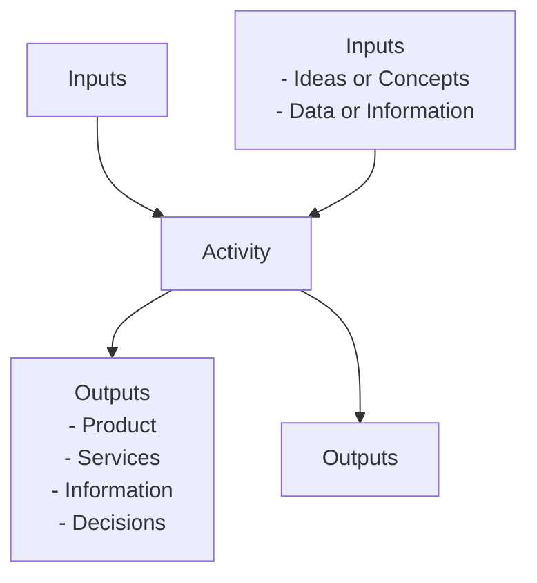

# 1.4 Process Map key

The Process Map Key serves as a standardized reference to interpret the visual Process Flow Diagrams included in the manual documentation. It defines the symbols, terminologies, and flow notations used to map out operational steps, responsibilities, decision points, and system interfaces across various milling stages.
1.4.1 Following key symbols are used in the process maps in this manual:

| Figure | Explanation | Figure | Explanation |
| --- | --- | --- | --- |
|  | This symbol represents a decision. Decisions are typically phrased as yes/ no questions. This symbol usually precedes a yes / no path |  | This symbol represents input to a process. Inputs are typically information, materials or outputs from a different process |
|  | Used to display the beginning and end of a process. |  | This symbol represents a process or an activity and its usually automated process. |
|  | This symbol represents information output such as a report or document. |  | This symbol represents a set of activities that have already been defined as a process separately |
|  | This symbol represents archiving. |  | This symbol represents a link to another page with certain relevance |
|  | Legend (M) in each symbol represents nature of the control that is “Manual” should be in place for this process |  | Legend (A) in each symbol represents nature of the control that is “Automated” should be in place for this process |
|  | Legend (A/M) in each symbol represents nature of the control that is “Semi-Automated” should be in place for this process |  |  |

A procedure changes inputs into outputs, using resources and according to defined rules:

**[Diagram — EMF→PNG]:**

**Process Name:** Activity  

**Roles / Swimlanes:** None specified in the diagram.

---

### Steps

| Step # | Role | Action | Decision/Next Step |
|--------|------|--------|--------------------|
| 1 | Not specified | Receive **Inputs** from the left:  - Ideas or Concepts  - Data or Information | Proceed to Step 2 (Activity) |
| 2 | Not specified | Perform **Activity** (central process box labeled “Activity”) receiving **Inputs** from the top (label: “Inputs”) and from the left (detailed list above). | Proceed to Step 3 (Outputs) |
| 3 | Not specified | Produce **Outputs** to the right:  - Product  - Services  - Information  - Decisions; and also produce **Outputs** downward (label: “Outputs”). | End of process |

---

### Text Exactly as Appearing in the Diagram

- Top label above the central box: `Inputs`
- Left-side heading: `Inputs`
  - `- Ideas or Concepts`
  - `- Data or Information`
- Central box label: `Activity`
- Right-side heading: `Outputs`
  - `- Product`
  - `- Services`
  - `- Information`
  - `- Decisions`
- Bottom label below the central box: `Outputs`

---

### Mermaid Diagram

