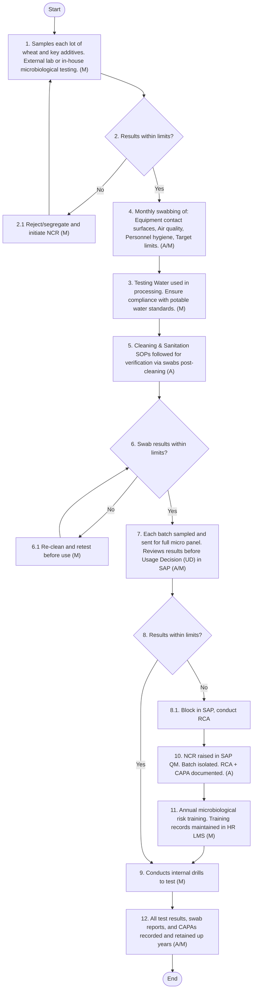
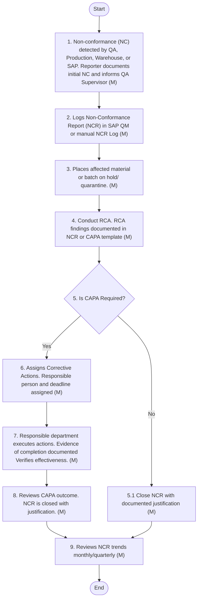
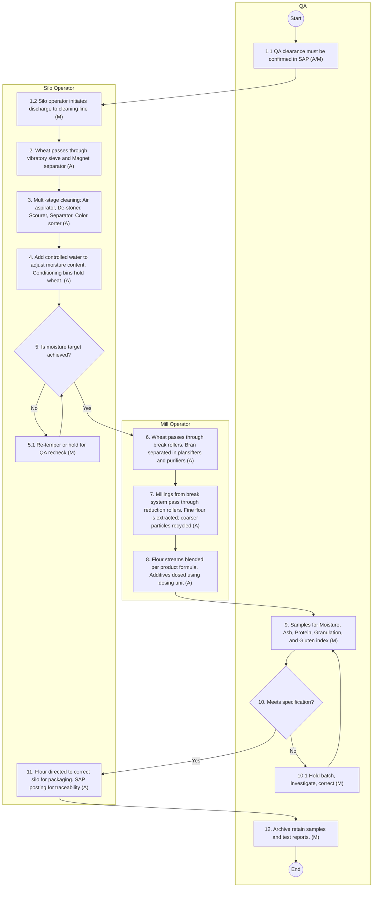

## C. Incoming Ingredients:

4.1 Purpose:
To establish a structured, SAP integrated and well-documented procedure for receiving, inspecting, and transferring wheat into silos, ensuring quality, safety, and compliance with industry standards. This process aims to minimize contamination risks, improve traceability, and enhance process efficiency through robust monitoring and control mechanisms. The process should ensure:
i. Compliance with food safety regulations (ISO 22000, Codex Alimentarius).
ii. Quality assurance of wheat used in production.
iii. Integration with SAP for traceability and process control.
iv. Improved efficiency through automated monitoring technologies.
v. Enhanced risk-based monitoring and control mechanisms.
4.2 Policy Statement:
The flour mill shall operate under stringent quality and food safety protocols and follow a structured approach to wheat receipt and storage to:
i. Standardize quality control measures across all shipments.
ii. Reduce human errors through automated testing and monitoring.
iii. Ensure compliance with applicable ISO and food safety standards.
iv. Integrate real-time tracking using SAP for full visibility.
v. Implement a risk-based approach to testing and monitoring.
vi. All staff must be trained and held accountable for executing procedures correctly and consistently.
4.3 Scope:
This policy applies to all employees involved in flour milling operations, covering:
i. The receipt of wheat from external sources
ii. Wheat receipt inspection & documentation
iii. Transfer of wheat into silos
iv. Automated & manual wheat quality assessment
v. Chemical, physical, and microbiological testing
vi. Environmental & storage controls
vii. Pest control management
viii. Quarantine procedures for non-conforming wheat & rejection handling.
ix. Integration with SAP for traceability
x. Supplier verification & COA validation.
4.4 Applicable Standards & References:
i. ISO 9001:2015 - Quality Management
ii. ISO 22000:2018 - Food Safety
iii. Codex Alimentarius – Grain Storage & Handling Standards
iv. General Food Security Authority (GFSA) Regulations
v. ISO 712: Moisture Content in Cereals
vi. ISO 3093: Gluten & Falling Number in Wheat
vii. ISO 16050: Mycotoxin Detection in Grains
viii. ASTM E220 - Standard Test Method for Calibration of Temperature Sensors
ix. ASTM D1513 - Standard Test Method for Foreign Material Detection in Grains
x. Company’s Internal Quality & Food Safety Standards
4.5 Policy - Raw Wheat Receipt into Silos:
4.5.1 Pre-Transfer Inspection of Silos:
i. All silos must be inspected prior to any internal or external material transfer.
ii. Inspections include visual cleanliness, review of fumigation logs, sensor calibration verification, pest controls, temperature, aeration, mechanical integrity, and product condition.
iii. SAP inspection records must be updated before transfer approval.
iv. No transfer is permitted without clearance from QA and maintenance.
v. Rejected silos must be locked out and marked in SAP as “BLOCKED”.
4.5.2. Wheat Delivery, Receipt & Initial Inspection:
i. Every wheat consignment must be accompanied by a Delivery Note and weighed at the gate.
ii. Visual inspection must be carried out for physical contamination: stones, mould, discoloration, or insect infestation.
iii. Sampling must be conducted at receiving using sampling probes, as per random lot protocol.
iv. Initial tests include:
  a. Mechanical sieves & metal detectors at intake
  b. Sensory checks
  c. Foreign matter
  d. Infestation
v. Results must be logged in SAP QM module.
vi. Loads failing minimum criteria are rejected or quarantined.
vii. GRN to be performed in SAP MM module.
viii. FIFO shall be enforced through barcode/RFID batch tracking via SAP.
4.5.3 Quality Monitoring (Chemical & Physical Analysis):
i. All intake materials shall under chemical and physical analysis using calibrated samplers as per documented sampling plan.
ii. Key parameters include moisture, protein, gluten, mycotoxins, pH, foreign matter, grain size and hardness, test weight, and NIR testing.
iii. All tests must be conducted using calibrated and validated equipment as per approve methods.
iv. Alert and action limits for all parameters must be pre-defined and programmed in SAP.
v. Batches exceeding critical thresholds must be placed on hold in SAP and root cause analysis initiated.
vi. Supplier compliance review must be initiated in parallel for all batches exceeding critical thresholds.
vii. All analysis must be entered in SAP QM module for traceability and batch release decisions (Accept/Reject/Quarantine).
4.5.4. Microbiological / Risk-Based Testing:
i. Microbiological testing is conducted based on risk assessment using random representative sampling methods as per defined frequency:
ii. Pathogen E. coli, Salmonella, yeast/mould/fungal, total plate count (TPC), coliforms and Aflatoxin B1.
iii. Proper sampling controls must be implemented to ensure sample integrity and traceability.
iv. Environmental swabs taken periodically from silos, conveyors and grain triers, bag cutters and funnels.
v. Higher-frequency testing must be applied to raw material from new/unverified suppliers or regions and / or high-risk shipment defined as: > 7 days transit, tropical origin, or flagged supplier.
vi. External lab testing certificates to be uploaded in SAP and archived.
vii. All analysis must be entered in SAP QM module for traceability and batch release decisions (Accept/Reject/Quarantine).
4.5.5. Silo Transfer and Environmental Controls:
i. Wheat/flour transfers between silos must follow FIFO and allergen segregation rules.
ii. Transfers are to be recorded in SAP batch log.
iii. Aeration systems must be verified frequently.
iv. Silo temperature and humidity must be logged and monitored.
v. Silos must undergo regular fumigation and silo cleaning.
vi. Limit light exposure and maintain airtight closure to prevent condensation and mould.
vii. Any deviations must be escalated via CAPA (Corrective Action Preventive Action) protocols.
4.5.6. Pest Management Monitoring:
i. Integrated Pest Management (IPM) must be implemented across all storage and processing areas.
ii. Traps, glue boards, and UV light devices are monitored weekly and logged in Pest log sheets.
iii. Monthly inspections should be carried out by approved pest control contractors.
iv. Pest control strategy should be regularly reviewed based on actual logs, history and data trends.
v. All pest management activities are recorded in SAP PM module.
vi. Any deviation / infestation should lead to immediate product quarantine, root cause investigation, and treatment and must be escalated via CAPA (Corrective Action Preventive Action) protocols.
4.5.7 Grain Circulation Cycle:
i. Grain circulation must be scheduled regularly, based on grain type, moisture content, and storage duration, to maintain grain quality and prevent compaction or spoilage.
ii. To prevent moisture stratification, pest harbourage, and quality deterioration, grain in steel silos shall undergo a full circulation at minimum every 15–20 calendar days, and concrete silos every 25–30 calendar days, or more frequently as indicated by real-time monitoring of temperature, moisture, and CO2 levels. This allows for dynamic adjustment based on actual conditions, which is best practice for large-scale operations. Consider a risk assessment to define circulation frequency based on grain type and ambient conditions.
iii. Grain in any silo must not remain static beyond 60 days (or shorter for high-risk grains) without at least one full circulation cycle. Any storage extending beyond 60 days shall be subject to a documented QA risk review and written approvals by both the Branch Manager and QA Manager. For critical or sensitive grain types, this duration may be significantly shorter based on a specific risk assessment.
iv. Before initiating circulation, the responsible Silo Operator shall complete the pre-transfer inspection protocol, checking for insect activity (including visual inspection and pheromone traps where applicable), moisture build-up, off-odors, or mechanical integrity. QA must validate clearance to proceed, documenting any deviations and corrective actions taken.
v. Each circulation event shall include visual inspections during movement to detect clumping, discoloration, mold growth, or infestation. Continuous temperature and moisture monitoring within the silo (if available) should be utilized in addition to readings before and two hours after circulation, capturing readings at three depths (top, mid, bottom) to confirm uniformity and absence of stratification. Any deviation beyond thresholds (temperature >30 °C or RH >65% or other pre-defined critical limits based on grain type) shall trigger immediate corrective action such as aeration, fumigation, or re-inspection, with documented follow-up to ensure efficacy. It’s important for Saudi Arabia environment that RH >65% is quite high; mold can grow at even lower RH levels depending on temperature and grain type, therefore, it’s recommended to consider lowering this threshold or specifying it per grain.
vi. All circulation activities shall be recorded in SAP with source and destination silo IDs, quantity circulated, date and time of cycle, QA remarks (including any observations or corrective actions), linked Lot/Bin ID, and environmental data (temperature and moisture) from inside the silo and ambient conditions before and after each cycle. This data should be easily retrievable for trend analysis.
vii. Regular reviews of circulation logs and environmental trends shall be conducted at least quarterly, or more frequently during periods of high risk (e.g., hot/humid seasons) by QA and Production teams. These reviews should aim to refine circulation intervals, introduce enhanced controls, and identify opportunities for process optimization and energy efficiency.
viii. Any missed circulation schedule, abnormal inspection finding, or extended storage beyond defined limits must be escalated immediately to QA and relevant Production team. All such incidents shall be recorded in SAP for thorough root cause analysis and corrective action, with defined responsibilities and timelines for resolution.
4.5.8. Quarantine and Rejection Handling:
i. Suspect or failed materials must be segregated and labelled “QUARANTINED” with date and reason.
ii. SAP inventory status must be updated accordingly.
iii. Secondary testing must be performed for test results close to limit.
iv. Root Cause Analysis (RCA) must be performed with CAPA.
v. Rejected lots must be disposed o3ff or returned to supplier, following documented approval.
vi. Reprocessing of quarantined material shall only be allowed after successful retesting and QA release.
4.5.9. Final Batch Release:
i. Only QA can authorize final release of wheat batches post-lab testing and process checks.
ii. Release Criteria:
  a. All in-process and final quality parameters passed.
  b. Microbiological results within limits
  c. Traceability data complete
  d. Batch status changed to “RELEASED” ins SAP
iii. Batches not released withing 30 days are subject to revalidation or disposal review.
4.5.10. Record Keeping:
i. All inspection, test, and transfer data must be recorded in SAP.
ii. Physical records (if any) must be signed, dated, and filed for 3 years minimum.
iii. Electronic backups maintained by IT/QA in compliance with applicable regulatory requirements.
iv. Any manual overrides or exceptions must be justified in writing and approved by Branch Manager.
4.5.11 Supplier Performance Monitoring:
i. All wheat suppliers must be evaluated jointly by Quality, Procurement and Production teams regularly based on quality, delivery, timelines, compliance and service responsiveness.
4.6 Procedure - Raw Wheat Receipt into Silos:
This section outlines the standard procedure followed for daily flour milling operations, ensuring hygiene, product integrity, and compliance with regulatory and customer requirements.
The "Raw Wheat Receipt into Silos" procedure forms a foundational part of flour mill operations, serving as the critical bridge between inbound raw material logistics and controlled storage. This multi-step process ensures that only safe, high-quality, and compliant wheat is accepted, tested, and stored under scientifically controlled conditions to preserve integrity and traceability.
Wheat, whether sourced from local suppliers or imported channels, is subject to stringent pre-receipt, intake, and post-intake protocols. These include inspection of silo conditions, sampling, quality testing, environmental monitoring, pest control, fumigation, and segregation or quarantine of non-compliant batches. Each step is governed by pre-defined acceptance criteria, risk-based decision points, and corrective actions based on technical data, aligned with international food safety standards such as Codex Alimentarius and ISO 22000.
Integration with enterprise systems (e.g., SAP ERP – QM, MM, and PM modules) facilitates digital traceability, regulatory compliance, and audit-readiness. Scientific controls such as microbial testing, ATP monitoring, aeration management, and silo environment control reduce the risk of contamination and spoilage. Operational disciplines like FIFO, grain rotation, and supplier performance scoring ensure both product quality and supply chain accountability.
By following this structured procedure, the mill ensures that raw wheat is safely and systematically handled, setting the stage for consistent flour quality, food safety assurance, and efficient downstream processing.
4.6.1 - Step 1:  Pre-Transfer Inspection of Silos:
Before any wheat can be accepted into storage, the structural and hygienic condition of the silo must be thoroughly verified. This step ensures that residual material, microbial contamination, or pest infestation from previous batches do not compromise the integrity of incoming grain. Scientifically, this step mitigates cross-contamination risks and ensures that silos meet the prerequisites for food-grade grain storage. It aligns with GMP and HACCP protocols by enforcing a controlled and documented verification process before transfer.

| Sr. No | Procedure Description | Responsibility | Frequency |
| --- | --- | --- | --- |
| 1. | **Visual Inspection of Silos**<br>• The Silo Operator must inspect all accessible internal surfaces of the silo (walls, hopper, roof area) using a flashlight and pre-inspection checklist. If there are "inaccessible" areas that pose a risk (e.g., hidden ledges), this should be noted for engineering solutions or alternative monitoring. The inspection should also cover the immediate conveying systems and transfer points leading into the silo for accumulation of old wheat, dust, or pest activity. This is a common bottleneck for hygiene.<br>• The goal is to confirm the absence of old wheat, mold growth, insect debris, or moisture damage. This prevents cross-contamination or microbial carryover into the new batch.<br>• It is mandatory that all inspections must be conducted in strict adherence to the mill's Confined Space Entry Permit (CSEP) procedures and safety protocols. This is paramount for perso nal Safety.<br>• Schedule:<br>• Mandatory before every wheat transfer into the silo.<br>• A full visual inspection of each silo must be performed at least once every 30 days even if NO transfer is planned, to ensure ongoing hygienic status.<br>• Records of both routine and pre transfer inspections shall be maintained in SAP and the silo inspection log.<br>• Consider the following as well:<br>• After heavy rain or high humidity periods: S pecifically check for moisture ingress.<br>• After a prolonged shutdown/idle period: Before restarting operations, a thorough inspection is critical.<br>• After any maintenance work inside the silo: Thorough inspection is a MUST to ensure no tools, debris, or contaminants were left behind.<br>• ✔ Acceptance: Silo surfaces are clean, dry, free from mold, pests, or residual material; checklist fully completed and signed.<br>• ✖ Rejection: Presence of old wheat, clumps, visible mold, insect debris, or signs of moisture ingress. Additionally, Foul or musty odors, accumulation of excessive dust or webbing (for spider mites/month).<br>• Actions on Rejection :<br>• i) Silo Operator to immediately halt intake and flag the silo status as “Not Ready” in SAP. ii) QA Analyst to document findings and raise a maintenance/cleaning work order. iii) Maintenance team to carry out cleaning and sanitation as per Maintenance SOP. iv) QA Analyst to re inspect and record clearance in SAP before use .<br>• v) QA Specialist to re-inspects before clearance is granted.<br>• vi) QA Specialist to escalates via email to the Silo Supervisor, with copy to Production Manager, Branch Manager and Procurement Manager ’ s. | **Silo Operator / Silo Supervisor / QA Specialist**<br>• (for respective actions) | Before each wheat transfer |
| 2. | **Review of Fumigation Log**<br>• QA Specialist verifies that fumigation has been carried out according to schedule (e.g., within the last 21–30 days), and that all fields in the fumigation log—including date, product, dosage, and temperature—are properly recorded by the Silo Operator. This ensures insect control is active. ✔ Accept ance : Valid fumigation date and temperature recorded. Log is signed and dated. ✖ Reject ion : Fumigation is overdue, missing, or log is incomplete. Actions on Rejection :<br>• i) QA Specialist to issue pest control request. No intake will be allowed until silo is re-fumigated and withholding period observed.<br>• ii) QA Specialist to give formal Clearance by email or other modes of internal communication, once post-treatment is verified. | QA Specialist | Before each wheat transfer |
| 3. | **ATP Swab Testing for Microbial Cleanliness**<br>• QA Analyst to performs ATP (Adenosine Triphosphate) swab testing at critical points inside the silo (inlet, cone wall, manhole cover) using a luminometer. Target ATP reading must be < 100 RLU to ensure low microbial presence. Results are uploaded to the QA module. ✔ Accept ance : ATP reading < 100 RLU — silo passes hygiene standard. ✖ Reject ion : ATP ≥ 100 RLU — indicates microbial residue. Actions on Rejection :<br>• i) QA Analyst to email the Silo Operator, copying Production and Branch Managers about the Rejection.<br>• ii) Silo Operator to initiate the Cleaning and re-aeration.<br>• iii) Silo remains “Not Ready” until QA Analyst performs the retesting, and it’s passes. | QA Analyst, Silo Operator (for respective actions) | Before each wheat transfer |
| 4. | **Sensor Calibration Verification**<br>• Automation Engineer to check temperature and humidity sensors installed in the silo and to verify calibration against traceable standards (e.g., ASTM E220). It is to be ensured that real -time silo monitoring is accurate and reliable. ✔ Accept ance : Calibration is current and documented. Sensors are functioning. ✖ Reject ion : Calibration expired or sensor malfunction. Actions on Rejection :<br>• i) Automation Engineer to log the issue and raise the maintenance request.<br>• ii) Automation Engineer to inform the Silo Operator to block the Silo from use.<br>• iii) Silo Operator to inform QA Analyst to check the sensor after maintenance and give formal clearance for use. | Automation Engineer, Silo Operator, QA Analyst ( for respective actions) | Monthly and prior to major transfers |
| 5. | **Start Aeration Cycle (if required)**<br>• Silo Operator to start the aeration cycle based on current season and ambient humidity levels. Aeration is important to prevent moisture build-up and mo u ld growth. Silo Operator to record the air flow rate, duration, and fan status in the silo log. ✔ Accept ance : Aeration started appropriately, and airflow data logged. ✖ Reject ion : No aeration done in high-humidity conditions; log data missing. Actions on Rejection :<br>• i) QA Specialist to instruct immediate aeration to Silo Operator.<br>• ii) Silo Operator to document the Aeration period and humidity levels in the Silo. | Silo Operator, QA Specialist (for respective actions) | As per seasonal schedule |
| 6. | **Pest Control (if required) - Over & above current practice**<br>• If any insect activity is detected during inspection, QA Analyst to organize pest control treatment (e.g., phosphine fumigation or thermal fogging) and logs treatment data. Post-treatment re-inspection is mandatory before intake. ✔ Accept ance : No live pest signs post-treatment; treatment log complete. ✖ Reject ion : Live insects detected post-treatment. Actions on Rejection :<br>• i) Repeat fumigation or alternative treatment applied. Silo Operator to defer the Intake during the withholding period.<br>• ii) QA Analyst to sign off on re-inspection before silo is cleared. | QA Analyst, Silo Operator, QA Analyst (for respective actions) | As needed |
| 7. | **Raise Maintenance Order in SAP (PM Module)**<br>• If any rejection occurs in Steps 1–6, Data Entry Operator to raise a PM order in SAP for cleaning, inspection, or repair. This ensures all corrective actions are traceable. ✔ Accept ance : PM order created, maintenance completed, silo status updated to “Ready for Use.” ✖ Reject ion : No PM order raised, or order left incomplete. Action on Rejection :<br>• i) Data Entry Operator to notify via email or any other internal communication system, to the Maintenance and QA Manager.<br>• ii) Silo Operator to ensure that all loading is halted.<br>• iii) Data Operator to update the SAP record with incident log. | Data Entry Operator, QA, Maintenance Manager’s, Silo Operator (for respective actions) | Immediately after rejection |
| 8. | **QA Clearance for Silo Usage in SAP**<br>• QA Analyst to review all inspection documents (visual check, ATP results, calibration, fumigation, pest control) and verifies maintenance closure. Only after review, QA Analyst to update the silo status to “Ready for Use” in SAP. No wheat transfer allowed without this clearance. ✔ Accept ance : All logs valid, PM order closed, SAP updated. ✖ Reject ion : Documentation incomplete or silo status not cleared. Actions on Rejection :<br>• i) QA to inform the Silo Operator to hold and initiate the required corrective action.<br>• ii) Wheat intake deferred until cleared by the QA Analyst. | QA Analyst, Silo Operator (for respective actions) | Before each wheat transfer |

4.6.2 - Step 2: Wheat Delivery Receipt & Initial Inspection:
This step governs the initial physical transfer of raw wheat from transport to facility, with sampling being the foundation of all subsequent quality assurance decisions. Scientific integrity of quality control begins here — proper sampling ensures that representative data is collected for physical, chemical, and microbiological analysis. Mistakes at this stage may lead to acceptance of inferior or contaminated grain, thus compromising both product safety and mill yield performance.

| S r . No. | Procedure Description | Responsibility | Frequency |
| --- | --- | --- | --- |
| 1. | **Document Verification**<br>• Silo Operator to match COA, Supplier ID, and Country of Origin with Purchase Order in SAP<br>• ✔ Accept ance : All documents match purchase order. ✖ Reject ion : Missing or mismatched COA or delivery note.<br>• Actions on Rejection:<br>• i) Silo Operator, not to unload and inform Procurement Manager via email and flag delivery in SAP MM. Attach deviation tag on the lot.<br>• ii) QA Specialist to initiate the investigation. | Silo Operator, QA Specialist, Procurement Manager (for respective actions) | For each incoming truck |
| 2. | **Apply deviation modelling tools for Risk Assessment**<br>• The QA Manager and Automation Engineer must:<br>• i) Extract historical wheat quality data (moisture, protein, FM, etc.) from SAP-QM and past COAs .<br>• ii) Input data into deviation modelling software (e.g., Power BI, Python-based tools).<br>• iii) Generate predictive flags for outlier lots.<br>• iv) Configure SAP to flag incoming trucks that deviate from defined baselines.<br>• v) Use this as a risk-ranking tool for increased sampling or testing.<br>• ✔ Acceptance:<br>• i) Deviation model successfully run and integrated with SAP alerts. ii) All flagged lots reviewed before unloading.<br>• ✖ Rejection:<br>• i) No modelling done, or risk categories not defined.<br>• ii) High-risk lots not evaluated.<br>• Actions on Rejection:<br>• i) QA Analyst to immediately review the trucks flagged by system and inform Production Manager.<br>• ii) QA Analyst to increases test scope before UD. iii) If model reveals consistent supplier deviation, inform Procurement Manager and initiate Supplier CAPA. | QA Analyst, Automation Engineer, Production and Procurement Manager (for respective tasks) | Bi-annually |
| 3. | **Truck Sampling**<br>• Silo Operator to use a manual or automated grain sampler probe to draw samples from at least 3–5 different depths and positions in the truck (front, middle, rear). Ensure sample is representative of the full load. Use clean sampling tools. Combine sub-samples into a composite sample (~2–3 kg). Label with truck ID and sampling time and send to lab for quality validation.<br>• ✔ Accept ance : A composite sample is properly collected, representative of full load (not just surface), with no cross-contamination or spillage. Sampler probe is clean and functioning. Sample integrity maintained.<br>• ✖ Reject ion : Sampling not performed from multiple depths; surface-only sample; sampler malfunction; sample container dirty or mislabelled ; insufficient quantity (<2kg).<br>• Actions on Rejection:<br>• i) Silo Operator to re-perform sampling under QA supervision. ii) If repeated failure: stop unloading and record deviation in SAP QM module. iii) QA Analyst to assess whether truck should be rejected or isolated pending further checks. iv) Silo Operator to inform the Mechanic to check sampling equipment if malfunction suspected. | Silo Operator, QA Analyst, Mechanic (for respective actions) | Each truck |
| 4. | **Implement SAP-driven sampling**<br>• The QA Manager, Maintenance Manager, and SAP Key User must:<br>• i) Categorize suppliers based on history (A/B/C risk levels).<br>• ii) Define corresponding sampling frequency in SAP QM (e.g., every truck, alternate truck, weekly).<br>• iii) Calibrate automated samplers at truck intake to match SAP logic.<br>• iv) Ensure sampling logs are captured in SAP for traceability.<br>• ✔ Accept ance :<br>• i) Sampling frequency is correctly linked to risk level in SAP. ii) Automated samplers work as per logic.<br>• ✖ Reject ion :<br>• i) Sampling logic not aligned with supplier category.<br>• ii) Manual override without justification.<br>• Actions on Rejection:<br>• i) QA Manager to initiate audit sampling compliance. ii) QA Manager to report deviations in sampling execution. iii) QA Manager to inform Production Manager to Suspend supplier intake if logic is consistently bypassed. | QA Manager, Maintenance Manager, Production Manager, SAP Key User (for respective actions) | Annual review (or upon major supplier/process change) |
| 5 . | **Visual Inspection**<br>• QA Analyst to perform visual inspection of wheat for physical contamination: stones, mould , discoloration, or insect infestation. ✔ Accept ance : Clean appearance; <0.5% foreign matter; no visible mould or pest infestation ✖ Reject ion : Foreign material > 0.5%, visible pest activity.<br>• Actions on Rejection:<br>• i) QA Analyst to inform WH Supervisor to Isolate the truck and log the deviation in SAP QM.<br>• ii) QA Analyst to notify QA Specialist via email and tag the lot as “Hold”; for potential rejection or re-testing. | QA Analyst, WH Supervisor, QA Specialist (for respective actions) | Each truck |
| 6. | **Operate Mechanical Sieves & Metal Detectors at Intake**<br>• Silo Operator to activate the intake line's mechanical sieves and inline metal detector as the wheat is unloaded. Monitor the automatic ejection system and alarms. Collect sieved-out foreign matter for analysis. Ensure metal detection test is verified with test pieces (Fe, Non-Fe, SS) before use.<br>• ✔ Accept ance :<br>• i) Metal Detector detects standard test pieces (Fe 2.0mm, non-Fe 2.5mm, SS 3.0mm). ii) Sieve rejects ≤ 0.5% by weight of total truck load (foreign matter such as husk, chaff, or small stones). iii) No metal alarm triggered during unloading.<br>• ✖ Reject ion :<br>• i) Metal Detector fails to detect test pieces. ii) Alarm triggered during unloading. iii) Sieve rejects > 0.5% of truck weight. iv) Presence of sharp metal fragments or hardware contamination.<br>• Actions on Rejection:<br>• i) Silo Operator to stop unloading immediately. ii) Isolate truck and raise deviation in SAP QM. iii) QA Analyst to perform root cause investigation (check prior truck load, unloading line hygiene). iv) QA Analyst to initiate rejection/quarantine decision in SAP. v) Automation Engineer to inspect and recalibrate metal detector if test pieces not detected. vi) If foreign matter >0.5%: QA Analyst to retest composite sample for grading. QA Analyst to notify Production and Procurement Manager via email.<br>• vii) Procurement Manager to inform via email to the Supplier if two consecutive trucks fail. | **Silo Operator, QA Analyst, Automation Engineer, Procurement Manager**<br>• (for respective actions) | During unloading |
| 7 . | **Sensory Check**<br>• QA Analyst to take 500g from the composite wheat sample and crush a handful to evaluate smell and rub between fingers to check moisture and feel. Ensure sample is at ambient temperature to avoid masking odour .<br>• ✔ Accept ance:<br>• i) Smell: Fresh, natural wheat aroma ii) Touch: Grains are firm, dry, non-sticky, and non-slimy<br>• ✖ Reject ion:<br>• i) Smell: Sour, musty, or fermented odour ii) Touch: Slimy, sticky, or excessively damp grains iii) Signs of sprouting or clumping<br>• Actions on Rejection:<br>• i) WH Supervisor to immediately isolate the truck from unloading. ii) QA Analyst to record deviation in SAP QM as “Sensory Failure”. iii) QA Analyst to send sample for expedited lab testing (moisture, fungal growth, microbiological if required). iv) QA Analyst to notify Production Manager, Branch Manager and Procurement Manager within 1 hour. v) If confirmed unsuitable by Quality analysis, QA Specialist should raise “Rejection Report” and SAP Usage Decision (UD) is set to ‘Rejected’. vi) WH Supervisor to return the truck or initiate disposal as per supplier agreement. vii) QA Specialist to initiate the Supplier quality incident report for recurring incidents from same supplier | **QA Analyst, QA Specialist, WH Supervisor**<br>• (for respective actions) | Each truck |
| 8 . | **Document Deviations and Foreign Matter**<br>• QA Analyst to documents any foreign matter, odour , insect, or parameter deviation once visual, sensory, and mechanical inspection is done. Use SAP QM module to enter inspection result and deviation classification (foreign matter, odour , infestation, etc.). If deviation exceeds the acceptable threshold, flag the batch in SAP and move truck to holding area physically and digitally.<br>• ✔ Accept ance:<br>• i) Minor deviations recorded in SAP but within acceptable limits.<br>• ii) Batch cleared for unloading after QA signs off.<br>• iii) SAP Usage Decision (UD) status: "Accepted" ✖ Reject ion:<br>• i) Deviations exceed specification thresholds (e.g., foreign matter >0.5%, confirmed pest infestation, abnormal odour , mould , etc.) ii) Inspection status fails in SAP QM<br>• Actions on Rejection:<br>• i) QA Analyst to flags lot as “Quarantined” in SAP QM. ii) Weighbridge Supervisor to move truck to designated QA-hold area, block access to intake point. iii) QA Analyst to initiate “Investigation Form” in SAP referencing Inspection Lot No. iv) QA Analyst to inform Procurement, Warehouse, and Production Managers by email and SAP workflow. v) If further lab tests are needed, QA Analyst to send expedited samples. vi) QA Specialist to evaluates findings and sets SAP Usage Decision to “Rejected” if non-conformance is confirmed. vii) Rejected truck is either:<br>• Returned to supplier (logged by Procurement & Weighbridge), or<br>• Disposed per waste SOP if deemed unsafe.<br>• viii) Procurement Manager to inform the Supplier about the rejection and share Quality Incident Report (QIR) via email. | **QA Analyst, QA Specialist, Procurement Manager, Weighbridge Supervisor**<br>• (for respective actions) | Each truck |
| 9. | **Capture truck weight before and after unloading :**<br>• i) Weighbridge Operator to weigh the truck before unloading at the inbound weighbridge station and enter gross weight into SAP. ii) After unloading wheat at the intake point, weigh the truck again to obtain tare weight. iii) System automatically calculates net wheat weight (Gross – Tare). iv) Compare with declared net weight on delivery documents (e.g., COA or invoice). v) Document any variation in weight compare against declared vs. actual. Tolerance limit is ±2%.<br>• ✔ Accept ance:<br>• i) Declared vs. actual weight difference is ≤ ±2%. ii) Both weights are properly logged in SAP.<br>• ✖ Reject ion:<br>• i) Weight variance is > ±2%. ii) Missing weighment data or truck not weighed twice.<br>• Actions on Rejection :<br>• i) Weighbridge Operator does not proceed with QA clearance until weight issue is resolved. ii) Re-weigh the truck to confirm measurement accuracy. If error persists:<br>• QA Analyst to issue deviation report.<br>• QA Analyst to notify Procurement for informing the Supplier.<br>• QA Analyst to Block or hold the stock in SAP MM.<br>• QA and Procurement to decide about returning the truck if significant discrepancy is confirmed. | **Weighbridge Operator, QA Analyst**<br>• (for respective actions) | Each truck |
| 10. | SAP Actions: |  |  |
| 10 .1 | **Create Goods Receipt Note (GRN) in SAP MM**<br>• Data Entry Operator to logs in to SAP MM module by using the relevant Purchase Order (PO) to create GRN for incoming wheat truck. Attach COA and delivery note.<br>• ✔ Accept ance:<br>• i) GRN created successfully against PO. ii) Documents attached and stored digitally.<br>• ✖ Reject ion:<br>• i) PO mismatch or missing line item. ii) GRN cannot be posted.<br>• Actions on Rejection:<br>• i) Data Entry Operator to contact Procurement Supervisor to verify PO. ii) Weighbridge Operator to hold the truck at weighbridge until GRN is posted. | Data Entry Operator, Procurement Supervisor, Weighbridge Operator (for respective actions) | Immediately upon physical receipt of wheat |
| 10 .2 | **Link COA and Delivery Note in SAP :**<br>• QA Analyst to scans and uploads COA and delivery note to the GRN record. Ensure COA matches PO specs (protein, moisture, etc.)<br>• ✔ Accept ance:<br>• i) COA correctly linked. ii) All key fields match SAP PO spec.<br>• ✖ Reject ion:<br>• i) Missing or unlinked COA. ii) Discrepancy in analytical values.<br>• Actions on Rejection:<br>• i) Reject load per QA rejection SOP. ii) Trigger non-conformance report (QIR). iii) Block in SAP and notify Procurement. | QA Analyst | At time of GRN posting |
| 10 .3 | **Initiate Inspection Lot in SAP QM**<br>• Automatically triggered once GRN is posted. SAP generates Inspection Lot No. QA Analyst to assign result recording and test parameters.<br>• ✔ Accept ance:<br>• i) Inspection Lot successfully created. ii) Correct test plan assigned.<br>• ✖ Reject ion:<br>• i) Inspection Lot not created due to system or config error.<br>• Actions on Rejection:<br>• i) QA Analyst to notify SAP Key User to troubleshoot.<br>• ii ) WH Operator to not proceed with unloading. iii) QA Analyst to hold process until lot is active. | QA Analyst, SAP Key User, WH Operator (for respective actions) | Automatically triggered upon GRN posting |
| 10 .4 | **Truck Weight Recorded through SAP-Weighbridge Interface**<br>• Weighbridge Operator to log inbound and outbound weight. System auto-links weight to GRN via truck ID.<br>• ✔ Accept ance:<br>• i) Inbound and outbound weights logged correctly. ii) SAP calculates net wheat quantity.<br>• ✖ Reject ion:<br>• i) Weight entry missing or mismatch (tolerance > ±2%).<br>• Actions on Rejection:<br>• i) Weighbridge Operator to investigate truck scale accuracy. ii) Re-weigh truck. iii) Weighbridge Operator to notify QA Analyst and Procurement Supervisor if discrepancy persists. | Weighbridge Operator, Procurement Supervisor (for respective actions) | At inbound and outbound truck movement |
| 10 .5 | **Stock Updated Post QA Approval (UD)**<br>• After QA Analyst approves wheat, Usage Decision (UD) is set in SAP QM. Stock is transferred to unrestricted status in MM.<br>• ✔ Accept ance:<br>• i) UD set to “Accepted”. ii) Stock visible in inventory.<br>• ✖ Reject ion :<br>• UD cannot be set due to open defects.<br>• Actions in Rejection:<br>• i) QA Analyst must resolve inspection result and document justification. ii) If non-conforming, UD set to “Rejected” by QA Analyst and blocked stock created. | QA Analyst , SAP Data Entry Operator (for respective actions) | Upon Usage Decision (UD) approval |
| 1 1 . | **Enforce FIFO through barcode/RFID batch tracking via SAP**<br>• The Warehouse S ection Head , QA Specialist, and SAP Data Entry Operator must: 1. Generate barcode/RFID tag for each wheat batch at intake. 2. Scan tag to record bin and timestamp into SAP (MM/WM module). [ WM module currently not in use] 3. Configure system to allow material issue on FIFO basis only.<br>• 4. Periodically verify material flow logs and audit FIFO movement.<br>• ✔ Accept ance:<br>• i) Each batch tagged and scanned upon intake. ii) FIFO constraint active in SAP.<br>• ✖ Reject ion:<br>• i) Tags not created or scanned. ii) SAP permits material issue out of sequence<br>• Action on Rejection:<br>• i) Data Operator to lock batch in SAP until re-tagged and inform QA Specialist. ii) QA Specialist to initiate internal non-conformance report (NCR). iii) QA Specialist to inform Production Manager and escalate to Automation Specialist or SAP Admin for logic correction. | Warehouse S ection Head , QA Specialist, Automation Specialist, Production Manager, SAP Data Entry Operator (for respective actions) | Review Monthly |

4.6.3 - Step 3: Quality Monitoring (Chemical & Physical Analysis):
Physical and Chemical analysis provides the scientific basis for accepting or rejecting wheat loads. Moisture, protein, gluten, and contaminant levels are tested against predefined thresholds. SAP integration ensures traceability by tagging each load with a unique identifier, linking it with test results and future process stages. This step enforces a data-driven gatekeeping mechanism, aligning with ISO 22000 and Codex grain handling practices.

| S r . No. | Procedure Description | Responsibility | Frequency |
| --- | --- | --- | --- |
| 1. | **Sample Collection and Logging**<br>• QA Analyst to collect representative samples from each truck/batch at intake using calibrated samplers as per documented sampling plan. Label samples and log them in SAP QM under the specific Inspection Lot number. ✔ Accept ance : Sample collected as per sampling SOP; correctly logged in SAP. ✖ Reject ion : Improper sampling, mislabelled or missing log.<br>• Actions on Rejection: QA Analyst to discard the sample, re-sample immediately, and raise non-conformance in SAP if recurring. | QA Analyst | Each wheat lot |
| 2. | **Moisture Content Test**<br>• QA Analyst to conduct moisture test using calibrated Moisture Analyzer as per ISO 712. Enter results into SAP QM. ✔ Accept ance : ≤ 14%. ✖ Reject ion :  >14% (risk of spoilage). Actions on Rejection:<br>• i) QA Analyst to flag lot as “To Be Quarantined” in SAP and inform Procurement Manager to raise NCR with supplier.<br>• ii) QA Analyst to escalate to QA Manager, Production Manager and Procurement Manager in case Possible rejection of full truckload is happening due to not within corrective threshold limits. | QA Analyst, QA Manager, Production Manager, Procurement Manager (for respective actions) | Each truck or as per plan |
| 3. | **Protein Content Test**<br>• QA Analyst to perform the Protein test as per Kjeldahl Method on collected samples. Compare against product specifications. ✔ Accept ance : 10.5%–13.5%. ✖ Reject ion : <10.5% or mismatch with PO. Actions on Rejection:<br>• i) QA Analyst to escalate to QA Manager to decide hold/rejection.<br>• ii) QA Analyst to inform Procurement Manager via email with copy to Production Manager to review supplier compliance.<br>• iii) QA Analyst to Hold lot in SAP until decision. | QA Analyst, QA Production, Procurement Manager’s (for respective actions) | Per sample |
| 4. | **Gluten Strength / Falling Number**<br>• QA Analyst to perform as per ISO 3093 Falling Number test. Record results in SAP. ✔ Accept ance : 250–400 sec. ✖ Reject ion : <250 sec. (indicates sprouting risk). Actions on Rejection:<br>• i) QA Analyst to isolate the batch and escalate to QA Manager.<br>• ii) QA Analyst to Mark SAP lot status as "Hold" and notify Production Manager if reallocation required. | QA Analyst, QA, Production Manager’s (for respective actions) | Per batch |
| 5. | **Mycotoxins Screening (DON etc.)**<br>• QA Analyst to screen for mycotoxins using ELISA or HPLC as per ISO 16050. ✔ Accept ance : Values below Codex/national limits (e.g., DON <1000 µg/kg). ✖ Reject ion : Exceeds limits. Actions on Rejection:<br>• i) QA Analyst to raise SAP quarantine request, notify QA Manager, Production and Branch Manager.<br>• ii) QA Manager to initiate supplier non-compliance review in coordination with Procurement Manager. | QA Analyst, QA/Production/Branch/ Procurement Managers | Each incoming shipment |
| 6. | **pH Testing**<br>• QA Analyst to test pH using calibrated meters. Record observations in lab sheet and SAP QM. ✔ Accept ance : pH 6.0–6.5. ✖ Reject ion : <5.8 or >6.7. Actions on Rejection :<br>• i) QA Analyst to re-confirm reading; if confirmed, isolate lot and escalate to QA Manager for further micro testing or rejection. | QA Analyst, QA Manager (for respective actions) | Spot check for high-risk loads |
| 7. | **Foreign Matter Sieve Test**<br>• QA Analyst to weigh sample and pass-through sieve mesh to check non-wheat particles. ✔ Accept ance : ≤ 0.5%. ✖ Reject ion : > 0.5%. Actions on Rejection:<br>• i) QA Analyst to document in SAP and isolate truckload.<br>• ii) QA Analyst to inform QA and Production Manager, and initiate root cause with supplier through Procurement Manager. Raise NCR if repeated. | QA Analyst, QA/Production , Procurement Manager’s (for respective actions) | Per sample |
| 8. | **Grain Size & Hardness**<br>• QA Analyst to analyse size distribution and hardness via mechanical sizer. ✔ Accept ance : Consistent kernel size, fines ≤ 10%. ✖ Reject ion : Fines >10%, uneven grains. Actions on Rejection :<br>• i) QA Analyst to flag lot as “ Deviated “and inform Production team about possible process impact.<br>• ii) QA Manager to decide hold or downgrade. | QA Analyst, QA Manager, Production Team (for respective actions) | Per batch |
| 9. | **Test Weight ( Hectolitre Weight)**<br>• QA Analyst to use hectolitre scale. Compare against wheat type standard. ✔ Accept ance : ≥76 kg/hL (soft), ≥78 kg/hL (hard). ✖ Reject ion : <74 kg/hL. Actions on Rejection:<br>• i) QA Analyst to document in SAP and inform QA Manager<br>• ii) If multiple loads show similar issue, then QA Manager to inform Procurement Manager for supplier audit. | QA Analyst, QA/Procurement Manager’s (for respective actions) | Per sample |
| 10. | **Instrument Calibration**<br>• QA Specialist to verify calibration tags and log calibration certificates. ✔ Accept ance : Calibration within due date. ✖ Reject ion : Expired or unverified calibration. Actions on Rej e ction:<br>• i) QA Analyst to halt tests, replace instrument, and repeat affected analyses. Log deviation in QA records.<br>• ii) QA Analyst to inform Automation Engineer for necessary corrective actions. | QA Analyst, Automation Engineer (for respective actions) | Monthly / Before use |
| 11. | **NIR Testing (Near-Infrared)**<br>• QA Analyst to scan wheat using NIR Spectrometer (ASTM D8190) for real-time profile. ✔ Accept ance : Protein, moisture, gluten values within SAP tolerance. ✖ Reject ion : Any value outside control band. Actions on Rejection:<br>• i) QA Analyst to re-test; if confirmed, isolate lot.<br>• ii) QA Manager to review cumulative test data and take final action in SAP. | QA Analyst, QA Manager (for respective actions) | Per truck or as per protocol |

4.6.4 - Step 4: Microbiological / Risk-Based Testing:
Microbiological and risk-based testing of incoming wheat is a critical control point in raw material acceptance and a central component of food safety assurance. This step verifies the absence of harmful pathogens (e.g., Salmonella, E. coli) and assesses microbial load to evaluate grain hygiene, storage condition prior to delivery, and transportation contamination. ATP swab testing, rapid detection kits, or culture-based assays may be used depending on facility capabilities and risk classification.
The frequency and scope of testing follow a risk-based approach — factoring in the wheat source (imported vs. domestic), historical supplier performance, seasonal risk trends, and any deviations noted in visual/sensory checks. This step ensures that no unsafe raw wheat enters the food chain, supports preventive actions (like fumigation or rejection), and fulfils regulatory mandates under national food safety standards.

| Sr. No. | Procedure Description | Responsibility | Frequency |
| --- | --- | --- | --- |
| 1. | **Sampling for Micro Testing**<br>• QA Analyst to collect representative grain samples from silo hatches or intake trucks using a sanitized grain sampler, following ISO 24333 sampling method. Samples must be stored in sterile Whirl-Pak bags and labelled with batch ID. ✔ Accept ance : Samples collected aseptically and logged correctly. ✖ Reject ion : Improper sampling, unlabelled/mixed samples. Actions on Rejection:<br>• i) QA Analyst to discard sample and repeat sampling under supervision of QA Specialist. | QA Analyst, QA Specialist (for respective actions) | Weekly / per shipment |
| 2. | **Pathogen Testing**<br>• QA Analyst to submit 100g sample to in-house or external lab for detection of Salmonella spp. and E. coli via ISO 6579 and ISO 16649. ✔ Accept ance : ND (Not Detected) or ≤ 10 CFU/g. ✖ Reject ion : > 10 CFU/g or detected .<br>• Actions on Rejection:<br>• i) QA Analyst to inform QA Manager to quarantine the lot and inform Procurement Manager to notify the supplier.<br>• ii) QA Analyst to resample for verification before escal at ing.<br>• iii) QA Manager to initiate the Root cause analysis (RCA) initiated. | QA Analyst, QA Manager , Procurement Manager (for respective actions) | High-risk: each lot; others: monthly |
| 4. | **Fungal Contamination (Spore ID)**<br>• QA Analyst to perform microscopic analysis using serial dilution plating or direct plating on PDA agar. Identify genera like Aspergillus, Fusarium. ✔ Accept ance : Rare/isolated growth < detection limit. ✖ Reject ion : Moderate/heavy growth of toxigenic fungi. Actions on Rejection:<br>• i) QA Analyst to initiate confirmatory mycotoxin test and hold the batch.<br>• ii) QA Analyst to inform QA Manager.<br>• iii) Enhanced Sampling for extensive monitoring. | QA Analyst, QA Manager (for respective actions) | Bi-weekly or monthly |
| 5. | **Total Plate Count (TPC)**<br>• QA Analyst to plate homogenized samples on Plate Count Agar (ISO 4833), incubate 30°C for 48h. ✔ Accept ance : ≤ 10⁴ CFU/g. ✖ Reject ion : > 10⁵ CFU/g. Actions on Rejection:<br>• i) QA Analyst to hold batch.<br>• ii) QA to initiate cleaning validation at intake area and notify Production Manager if trend continues. | QA Analyst, QA Manager, Production Manager (for respective actions) | Weekly |
| 6. | **Mycotoxin-Producing Mould s**<br>• QA Analyst to use mould -selective media (e.g., DG18) to detect colonies. Confirm Aspergillus flavus/ ochraceous via morphology. ✔ Accept ance : < 100 CFU/g; no visible mould . ✖ Reject ion : > 100 CFU/g or visible fungal colonies. Actions on Rejection:<br>• i) QA Analyst to hold batch and send for quantitative Aflatoxin screening (Step 7).<br>• ii) QA Analyst to inform QA Manager to review previous cleaning logs. | QA Analyst, QA Manager (for respective actions) | Weekly |
| 7. | **Aflatoxin B1 Quantification**<br>• QA Analyst to submit composite sample to HPLC or ELISA for Aflatoxin B1 (ISO 16050). Comply with country-specific limits. ✔ Accept ance : ≤ 2 µg/kg (EU), ≤ 5 µg/kg (Codex). ✖ Reject ion : > 5 µg/kg. Actions on Rejection:<br>• i) QA Analyst to reject batch and QA Manager, Production Manager and Branch Manager.<br>• ii) QA Manager to Procurement Manager to notify the supplier. i ii) Data Entry Operator to document in SAP. | QA Analyst, QA , Productio n, Branch & Procurement Manager’s , Data Entry Operator (for respective actions | Weekly |
| 8. | **High-Risk Shipment Testing**<br>• QA Analyst to test all microbiological parameters (ATP, TPC, Pathogens, Mould s, Aflatoxins). Defined as: > 7 days transit, tropical origin, or flagged supplier. ✔ Accept ance : All tests pass. ✖ Reject ion : Any one test fails. Actions on Rejection:<br>• i) QA Analyst to Conduct re-sampling and verify the results.<br>• ii) QA Analyst to hold batch and trigger for joint review by QA/Procurement.<br>• iii) QA Manager to initiate Corrective Action Request (CAR) and involved all relevant functions. | QA Analyst, QA/Procurement Manager’s & Others relevant (for respective actions) | Mandatory for flagged batches |
| 9. | **Swab Testing of Sampling Equipment**<br>• QA Analyst to swab grain triers, bag cutters, funnels using sterile swabs with neutralizing buffer. Plate on TSA/Yeast Extract Agar. ✔ Accept ance : < 10 CFU/cm². ✖ Reject ion : > 10 CFU/cm². Actions on Rejection:<br>• i) QA Analyst to clean and sanitize equipment and repeat swabbing before next use.<br>• ii) QA Analyst to Document as CAPA if recurrent. | QA Analyst | Monthly or post-positive |
| 10. | **SAP Data Entry & Batch Decision**<br>• Data Entry Operator to log test results into SAP QM. Batch disposition to be automatically generated by SAP based on thresholds:<br>• Accept / Reject / Quarantine. Actions (on flag):<br>• i) QA Manager to review batch if flagged “Quarantine” or “Rejected”.<br>• ii) Data Entry Operator to adjust the status post-confirmation for QA. | Data Entry Operator | Real-time |

Flowchart:

**[Diagram — Visio-EMF→PNG]:**

**Process Name:** Micro Risk Control  

**Roles / Swimlanes:**
- QA  
- HR/QA  

---

### Steps

| Step # | Role  | Action (verbatim text) | Decision / Next Step |
|--------|-------|------------------------|----------------------|
| Start | QA | Start | Proceeds to **1. Samples each lot of wheat and key additives. External lab or in-house microbiological testing. (M)** |
| 1 | QA | 1. Samples each lot of wheat and key additives. External lab or in-house microbiological testing. (M) | Proceeds to **2. Results within limits?** |
| 2 | QA | 2. Results within limits? | **Yes →** Proceeds to **4. Monthly swabbing of: Equipment contact surfaces, Air quality, Personnel hygiene, Target limits. (A/M)**.  **No →** Proceeds to **2.1 Reject/segregate and initiate NCR (M)**. |
| 2.1 | QA | 2.1 Reject/segregate and initiate NCR (M) | Arrows back to **1. Samples each lot of wheat and key additives. External lab or in-house microbiological testing. (M)** |
| 4 | QA | 4. Monthly swabbing of: Equipment contact surfaces, Air quality, Personnel hygiene, Target limits. (A/M) | Proceeds to **3. Testing Water used in processing. Ensure compliance with potable water standards. (M)** |
| 3 | QA | 3. Testing Water used in processing. Ensure compliance with potable water standards. (M) | Proceeds to **5. Cleaning & Sanitation SOPs followed for verification via swabs post-cleaning (A)** |
| 5 | QA | 5. Cleaning & Sanitation SOPs followed for verification via swabs post-cleaning (A) | Proceeds to **6. Swab results within limits?** |
| 6 | QA | 6. Swab results within limits? | **Yes →** Proceeds to **7. Each batch sampled and sent for full micro panel. Reviews results before Usage Decision (UD) in SAP (A/M)**. **No →** Proceeds to **6.1 Re-clean and retest before use (M)**. |
| 6.1 | QA | 6.1 Re-clean and retest before use (M) | Arrows back to **6. Swab results within limits?** |
| 7 | QA | 7. Each batch sampled and sent for full micro panel. Reviews results before Usage Decision (UD) in SAP (A/M) | Proceeds to **8. Results within limits?** |
| 8 | QA | 8. Results within limits? | **Yes →** Proceeds to **9. Conducts internal drills to test (M)**. **No →** Proceeds to **8.1. Block in SAP, conduct RCA**. |
| 8.1 | QA | 8.1. Block in SAP, conduct RCA | Proceeds to **10. NCR raised in SAP QM. Batch isolated. RCA + CAPA documented. (A)** |
| 10 | QA | 10. NCR raised in SAP QM. Batch isolated. RCA + CAPA documented. (A) | Proceeds to **11. Annual microbiological risk training. Training records maintained in HR LMS (M)** |
| 11 | HR/QA | 11. Annual microbiological risk training. Training records maintained in HR LMS (M) | Proceeds to **9. Conducts internal drills to test (M)** |
| 9 | QA | 9. Conducts internal drills to test (M) | Proceeds to **12. All test results, swab reports, and CAPAs recorded and retained up years (A/M)** |
| 12 | QA | 12. All test results, swab reports, and CAPAs recorded and retained up years (A/M) | Proceeds to **End** |
| End | QA | End | — |

**Yes/No Branches (explicit):**

- **Step 2 – Results within limits?**  
  - Yes → 4  
  - No → 2.1  

- **Step 6 – Swab results within limits?**  
  - Yes → 7  
  - No → 6.1 (loop back to 6)  

- **Step 8 – Results within limits?**  
  - Yes → 9  
  - No → 8.1 → 10 → 11 → 9  

---

### Mermaid.js Flow



4.6.5 – Step 5: Silo Transfer & Environmental Controls for Storage:
Long-term grain storage demands strict control of internal environment — particularly temperature and humidity — to suppress microbial and pest activity. This step regulates silo allocation, internal aeration, and environmental monitoring. From a scientific perspective, it prevents condensation, maintains equilibrium moisture content (EMC), and prolongs grain viability. Fumigation and pest prevention activities are synchronized here to maintain a sterile environment.

| Sr. No. | Procedure Description | Responsibility | Frequency |
| --- | --- | --- | --- |
| 1. | **Stock Transfer Posting in SAP**<br>• Silo Operator to initiate stock transfer posting in SAP from GR point to assigned silo bin using Movement Type. Ensure accurate silo bin code and quantity. Cross-check physical vs. system records. ✔ Accept ance : SAP stock reflects actual physical transfer and correct bin. ✖ Reject ion : Discrepancy in weight or incorrect bin. Actions on Rejection:<br>• i) Silo Operator to halt process, notify SAP Analyst.<br>• ii) QA Analyst to reconcile actual vs. posted stock. Correct posting with reference to weighing slips and batch tags. | Silo Operator, QA Analyst (for respective actions) | Per transfer |
| 2. | **Monitor Silo Temperature & Humidity**<br>• Mechanic to monitor environmental conditions via silo-integrated sensors or SCADA. Maintain ≤ 30°C and RH ≤ 65%. Check for stratification and condensation zones. Log hourly readings. ✔ Accept ance : Stable conditions within threshold. ✖ Reject ion : Exceeding either limit. Actions on Rejection:<br>• i) Mechanic to activate aeration or heating/cooling system. If RH persistently > 70%.<br>• ii) QA Specialist to assess risk of fungal growth and recommend preventive fumigation and logged for CAPA. | Mechanic, QA Specialist (for respective actions) | Continuous (automated); Hourly log |
| 3. | **Aeration System Operation**<br>• Silo Operator to verify proper operation of aeration system, fans, vents, ducts. Manual check daily; auto activation via moisture/CO₂ sensors. Inspect for airflow uniformity using manometers or CO₂ equalization. ✔ Accept ance : Aeration functional and evenly distributed. ✖ Reject ion : Blocked ducts, condensation observed, or uneven grain temp zones. Actions on Rejection:<br>• i) Silo Operator to pause intake and inform Engineering Technician for fan repair.<br>• ii) QA Analyst to initiate deep core sampling and visual inspection. Restart only after clearance. | Silo Operator, Engineering Technician, QA Analyst (for respective actions) | Daily (every shift) |
| 4. | **Fumigation & Silo Cleaning**<br>• QA Analyst to execute fumigation using approved agents (e.g., Aluminium Phosphide) under controlled conditions. Follow SOP for dosage, sealing, exposure period, and ventilation. Log treatment with date, duration, agent used. ✔ Accept ance : Treatment verified, logs signed, silo labelled as “Fumigated.” ✖ Reject ion : Overdue fumigation or missing log. Actions on Rejection:<br>• i) QA Analyst to isolate silo, reschedule treatment and notify QA Manager.<br>• ii) Pest presence to trigger full fumigation plus follow-up inspection after 72 hours by QA Analyst. | QA Analyst, QA Manager (for respective actions) | Monthly / as needed |
| 5. | **F IFO Policy Enforcement**<br>• Distribution Centre Specialist to issue wheat based on FIFO principle, verified via SAP batch date. Regularly review dispatch logs and silo depletion sequence. ✔ Accept ance : Oldest batch always dispatched first. ✖ Reject ion : If newer batch dispatched before older stock. Actions on Rejection:<br>• i) Distribution Specialist to place hold on dispatch. Investigate discrepancy.<br>• ii) QA Manager to audit FIFO log and stock history. Non-compliance to be escalated to SC Planner for Inventory Control. | Distribution Centre Specialist, QA Manager, SC Planner (for respective actions) | Every batch issue |
| 6. | **Corrective Action on Environmental Deviation**<br>• Silo Operator to respond to any deviation alerts (e.g., spike in CO₂, RH, or temp). Trigger corrective actions: increase aeration, reduce grain depth, consider fumigation. Document interventions. ✔ Accept ance: Conditions restored within 12–24 hrs. ✖ Reject ion : If deviation persists or recurrence >2 times/month. Actions on Rejection:<br>• i) Silo Operator to escalate to Engineering Coordinator and initiate the Root cause analysis.<br>• ii) QA Analyst to increase monitoring frequency and report in monthly KPI’s. | Silo Operator, QA Analyst, Engineering Coordinator (for respective actions) | Immediate (on deviation) |

4.6.6 - Step 6: Pest Management Monitoring:
Pest infestation poses a significant threat to raw grain storage, both in terms of physical contamination and potential mycotoxin development. This step establishes an evidence-based, continuous pest surveillance and control system through data logging, fumigation schedules, and trend analysis. It is aligned with scientific risk-based control models (e.g., IPM — Integrated Pest Management) and ensures the facility maintains zero-tolerance compliance for pest presence in grain handling zones.

| Sr. No. | Procedure Description | Responsibility | Frequency |
| --- | --- | --- | --- |
| 1. | **Implement Structured Pest Control Program**<br>• QA Manager to implement a documented pest control plan that includes site zoning (e.g., grain storage, transit, and packaging), inspection schedules, third-party service contracts, and bait map layout. Ensure the plan is site-specific and meets ISO 22000 / IPM standards. ✔ Accept ance : Valid pest control plan in place, contract active, inspection schedule followed. ✖ Reject ion : No plan, expired contract, or gaps in execution.<br>• Actions on Rejection:<br>• i) QA Analyst to escalate non-conformance to QA Manager.<br>• ii) QA Manager to immediately suspend receiving/storage in uncontrolled zones and initiate pest service re-contracting and emergency inspection. | QA Analyst, QA Manager (respective actions) | Weekly inspections |
| 2. | **Maintain Pest Monitoring Logs**<br>• QA Specialist to record trap counts, species identified (e.g., insects, rodents), and sighting events in a pest log sheet. Use standardized code per zone. Include corrective actions, e.g., repositioning traps, increasing frequency. ✔ Accept ance : Accurate, complete weekly records available for each zone. ✖ Reject ion : Missing log, outdated data, or generic entries. Actions on Rejection:<br>• i) QA Specialist to re-inspect affected zone, fill missing log, and file a deviation report.<br>• ii) QA Specialist to trigger pest control verification sweep and notify Silo Supervisor and Production Manager. | QA Specialist, Silo Supervisor, Production Manager (for respective actions) | Weekly |
| 3. | **Monthly Trend Analysis of Pest Activity**<br>• QA Analyst to analyse monitoring data for emerging patterns (e.g., increased insect activity in warmer months or rodent access points). Use graphs or heatmaps by area. Adjust trap layout or frequency based on hot spots. ✔ Accept ance : Monthly summary report prepared with recommendations. ✖ Reject ion : No trend report, data unutilized. Actions on Rejection:<br>• i) QA Analyst to submit delayed report immediately to QA Manager for review. Failure to adjust control measures leads to audit non-conformance. | QA Analyst | Monthly |
| 4. | **Fumigation Based on Risk Zones**<br>• Silo Operator to schedule fumigation based on infestation risk (e.g., frequent sightings, seasonal temperature > 30°C, stored duration > 2 months). Use approved fumigants (e.g., Phosphine). Follow isolation and re-entry protocols. ✔ Accept ance : Fumigation schedule matches risk level. ✖ Reject ion : Missed treatment in known infestation area. Actions on Rejection:<br>• i) Silo Operator to report missed treatment to QA Manager.<br>• ii) QA Manager to advise the Silo Operator to ‘mark the Zone’ as high-risk and sealed the silo until fumigation is completed. | Silo Operator, QA Manager (for respective actions) | Monthly / As needed |
| 5 . | **Install and Maintain Pest Traps / Barriers**<br>• QA Specialist with Engineering Coordinator to install and service physical barriers and traps in silo rooms, intake zones, and transfer corridors. Ensure trap numbers match site map. Maintain barrier integrity (e.g., sealed doors, mesh). ✔ Accept ance : Traps/barriers functional and recorded in the master bait map. ✖ Reject ion : Missing, damaged, or displaced traps. Actions on Rejection:<br>• i) Engineering Coordinator to replace faulty units immediately.<br>• ii) QA Specialist to conduct snap audit of site compliance. | QA Specialist / Engineering Coordinator (for respective actions) | Quarterly or per inspection |
| 6. | **Review Pest Control Strategy**<br>• QA Analyst to evaluate pest control efficiency by correlating trend data, site inspection reports, and infestation history. Propose updates to trap layout, inspection frequency, or supplier change if performance is poor. ✔ Accept ance : Strategy revised as per data review. ✖ Reject ion : Outdated strategy despite ongoing pest issues. Actions on Rejection:<br>• i) QA Manager to initiate CAPA process and review pest service SLA and immediate review to be initiated with service provider. | QA Analyst, QA Manager (for respective actions) | Monthly |
| 7. | **SAP Logging and Automation**<br>• Data Entry Operator or QA Analyst to log fumigation and inspection schedules in the SAP PM module or custom form (whichever is used). Flag bins with detected activity for automated work order generation.<br>• ✔ Accept ance : Digital records match physical logs. ✖ Reject ion : Missing entries, batch not flagged in system. Actions on Rejection:<br>• i) Data Entry Operator to re-enter the missing data and QA Analyst to verify SAP linkage. Missed automated alerts to be documented and reported. | Data Entry Operator / QA Analyst (for respective actions) | Real-time logging + Monthly audit |

4.6.7 - Step 7 Grain Circulation Management:
Grain circulation is a scientifically validated technique used to prevent moisture stratification, suppress localized microbial hotspots, and ensure uniform physical and chemical characteristics of stored wheat. Especially relevant in climates with fluctuating humidity, this practice improves grain aeration and is a proactive safeguard against spoilage and clumping. It also facilitates real-time inspection, making it a critical layer in post-storage quality preservation protocols.

| Sr. No. | Procedure Description | Responsibility | Frequency |
| --- | --- | --- | --- |
| 1. | **Plan and Schedule Circulation**<br>• Silo Operator to plan grain circulation in line with defined intervals:<br>• steel silos every 15–20 days,<br>• concrete silos every 25–30 days.<br>• QA Specialist to verify schedule against SAP records and confirm upcoming due cycles. ✔ Accept ance : Circulation plan prepared within defined interval and approved in SAP. ✖ Reject ion : Interval exceeded, or plan not prepared. Actions on Rejection:<br>• i) Silo Operator to immediately prepare overdue plan and notify QA<br>• ii) QA Specialist to review and approve revised plan<br>• iii) QA Manager to escalate if repeated delay is noted. | Silo Operator, QA Specialist, QA Manager (for respective actions) | As per defined interval (steel silos 15–20 days; concrete silos 25–30 days) |
| 2. | **Pre Transfer Inspection**<br>• Before initiating circulation, Silo Operator to conduct pre transfer inspection as per protocol (check insect activity, moisture build up, mechanical integrity). QA Analyst to validate readiness. ✔ Accept ance : Silo surfaces clean, no pest or moisture issues, QA validation received. ✖ Reject ion : Presence of clumping, pests, or mechanical fault. Actions on Rejection:<br>• i) Silo Operator to halt circulation<br>• ii) QA Analyst to document findings in SAP<br>• iii) Engineering Coordinator to rectify faults<br>• iv) QA Analyst to re inspect and approve prior to circulation. | Silo Operator, QA Analyst, Engineering Coordinator (for respective actions) | Before each scheduled circulation |
| 3. | **Execute Circulation**<br>• The Silo Operator activates internal grain transfer (mechanical or pneumatic) from the bottom of the silo back to the top inlet. The circulation cycle should be calculated to ensure 1.5x full silo turnover. Conduct activity during cooler times of day (preferably early morning) to minimize condensation risk. Grain movement must be steady, avoiding bottlenecks or bridging.<br>• ✔ Accept ance : Smooth transfer, no blockage, no abnormal dust or noise. ✖ Reject ion : Flow obstruction, equipment noise, incomplete circulation. Actions on Rejection:<br>• i) Silo Operator to stop operation and log deviation in SAP<br>• ii) Inform Engineering Coordinator for troubleshooting<br>• iii) Resume only after corrective actions and QA clearance. | Silo Operator, Engineering Coordinator, QA Analyst (for respective actions) | Every scheduled cycle |
| 4. | **Monitor Temperature & Moisture**<br>• Instrument Mechanic and QA Analyst perform readings using silo-embedded probes or manual thermocouple devices. Check 3 vertical depths (top, middle, base) and 2 lateral positions. Parameters are recorded before and 2 hours after circulation.<br>• ✔ Accept ance : Temperature ≤30°C, RH ≤65% and stable post circulation. ✖ Reject ion : Temperature >30°C, RH >65% or stratification persists. Actions on Rejection:<br>• i) QA Analyst to initiate aeration or fumigation<br>• ii) Silo Operator to isolate affected silo in SAP<br>• iii) QA Manager to review and approve further actions. | Instrument Mechanic, QA Analyst, Silo Operator (for respective actions) | Before and after each cycle |
| 5. | **Visual Inspection During Circulation**<br>• QA Analyst to observe moving grain for clumping, discoloration, or insects. ✔ Accept ance : Grain free of visible contamination, consistent color and flow. ✖ Reject ion : Off odors, clumping, insect presence. Actions on Rejection:<br>• i) QA Analyst to stop process and sample grain<br>• ii) QA Manager to review results and decide on reprocessing or disposal<br>• iii) Silo Operator to log deviation in SAP. | QA Analyst, QA Manager, Silo Operator (for respective actions) | During each cycle |
| 6. | **Document Circulation Parameters in SAP**<br>• Silo Operator logs circulation cycle in manual or digital silo circulation log. Capture the following:<br>• Start/end time<br>• Air velocity (if applicable)<br>• Ambient weather<br>• Internal readings<br>• Silo ID & batch lot<br>• Attach log to shift report or upload in internal system (share folder or ERP-linked document).<br>• ✔ Accept ance : All data accurately recorded and linked in SAP. ✖ Reject ion : Missing or incorrect records. Actions on Rejection:<br>• i) Data Entry Operator to correct entries immediately<br>• ii) QA Specialist to verify completeness<br>• iii) Internal audit to review if recurrent. | Data Entry Operator, QA Specialist (for respective actions) | Immediately after each circulation |

4.6.8 - Step 8 Periodic Stored Wheat Condition Monitoring:
Periodic monitoring of stored wheat is essential to preserve grain quality and detect latent deterioration that may not be evident through environmental parameters alone. Over time, stored wheat can undergo biochemical and microbiological changes due to factors such as residual moisture, fungal growth, temperature fluctuations, or pest activity.
This step introduces a structured surveillance program incorporating visual inspection, chemical testing, and microbiological evaluation at predefined intervals post-storage. It ensures early detection of spoilage, mycotoxin development, or microbial contamination — particularly in long-stored batches.
In alignment with GFSI-aligned food safety standards and internal quality assurance protocols, this routine enhances traceability, informs inventory decision-making (e.g., rotation or disposal), and ensures compliance with regulatory and export quality criteria. It provides scientific evidence for storage stability over time and supports preventive grain preservation strategies within the silo management lifecycle.

| Sr. No. | Procedure Description | Responsibility | Frequency |
| --- | --- | --- | --- |
| 1. | **Visual Inspection of Stored Wheat**<br>• Visual inspection must be conducted by the Silo Operator after one week of initial wheat storage to assess any signs of discoloration, mould growth, insect activity, or condensation. Silo Operator to document the Inspection details in the silo logbook, with photographic evidence if abnormalities are observed.<br>• ✔ Accept ance : Grain appears clean, uniform colour , no signs of infestation or mould .<br>• ✖ Reject ion : Visible mould , discoloration, or insect presence.<br>• Actions on Rejection:<br>• i) QA Analyst to collect grain sample for analysis. If required escalate the matter to QA Manager and Production Manager for urgent chemical/micro analysis.<br>• ii) Silo must be aerated, isolated, and fumigated if pest activity is confirmed. | Silo Operator, QA Analyst, QA/Production Manager’s (for respective actions) | After 1 week of storage |
| 2. | **Chemical Analysis of Stored Wheat**<br>• After one month of storage, QA Analyst shall perform chemical testing to detect moisture increase, fat acidity, mycotoxin levels (aflatoxins, DON), and protein deterioration. Sampling to follow ISO 24333. All results to be logged in QA LIMS system and SAP QM Module.<br>• ✔ Accept ance : All results within internal and regulatory specifications.<br>• ✖ Reject ion : Mycotoxin above legal limit, significant moisture rise, or protein degradation.<br>• Actions on Rejection:<br>• i) Silo Operator to immediately segregate the Silo and inform QA Manager.<br>• ii) QA Manager to determine if wheat can be reconditioned (e.g., blending/drying). Otherwise, batch must be rejected and notified to Procurement and Branch Manager’s | QA Manager, Silo Operator, Procurement , Branch Manager’s (for respective actions) | After 1 month of storage |
| 3. | **Microbiological Testing of Stored Wheat**<br>• After three months, QA Analyst to perform the microbiological testing including total plate count (TPC), mould s/yeasts, Bacillus cereus , and Enterobacteriaceae . Testing to follow ISO 4833 and ISO 21527 guidelines. SAP QM record must reflect final status.<br>• ✔ Accept ance : Microbial load within product specs and hygiene limits.<br>• ✖ Reject ion : TPC > 10^4 CFU/g, or any pathogenic indicators found.<br>• Actions on Rejection:<br>• i) QA Analyst to ensure that Batch must be quarantined and inform QA Manager<br>• ii) QA Specialist to initiate the Root cause investigation to assess possible storage failure. Notify QA Manager and Production for decision on reprocessing or disposal. | QA Analyst, QA Specialist, QA Manager, Production Manager (for respective actions) | After 3 months of storage |
| 4. | **SAP Logging & Traceability**<br>• Each inspection (visual, chemical, micro) must be logged in SAP QM Module under respective silo batch with test references and acceptance/rejection disposition. Use custom inspection lot creation or standard batch classification.<br>• ✔ Accept ance : Complete data trail with digital sign-off.<br>• ✖ Reject ion : Missing or delayed entries, mismatch between lab data and SAP.<br>• Actions on Rejection:<br>• i) Data Entry Operator to review missing fields and consult QA Lab for resubmission. QA Analyst to verify correction and close the record. | Data Entry Operator, QA Analyst (for respective actions) | Post every inspection |

4.6.9 – Step 9: Quarantine & Rejection Handling:
Rejection protocols form the defensive wall of any food safety system. This step ensures that non-conforming wheat loads — due to physical, chemical, or biological reasons — are effectively quarantined, re-tested, and either reprocessed, returned, or discarded based on scientific investigation. Root cause analysis and documentation provide traceability, uphold compliance with food safety standards, and protect downstream processing from compromised raw material.

| Sr. No. | Procedure Descriptio n | Responsibility | Frequency |
| --- | --- | --- | --- |
| 1. | **Quarantine batch if any test fails (micro, chem, or physical)**<br>• QA Analyst to immediately isolate any batch failing acceptance criteria (e.g., mycotoxin > max limit, high foreign matter, failed protein content) by posting to a 'Blocked' location in SAP QM/MM. Label silo/bags with "QUARANTINE" tags. ✔ Accept ance : Batch visible in blocked stock in SAP and physically tagged. ✖ Reject ion : Batch left in production flow or not tagged. Actions on Rejection:<br>• i) QA Analyst to initiate non-conformance report (NCR), halt usage, and isolate physically. Conduct traceability check to ensure no contaminated product moved forward. | QA Analyst | On failed test result |
| 2. | **Perform secondary testing**<br>• QA Analyst to request retesting (e.g., if aflatoxin is close to limit or inconsistent kernel moisture). Use validated analytical methods and duplicate samples from retained batch. ✔ Accept ance : Retest confirms or clarifies result. ✖ Reject ion : No retest conducted or poor documentation. Actions on Rejection:<br>• i) QA Analyst to file deviation report. Hold lot until confirmed disposition.<br>• ii) Escalate to QA Manager for decision. | QA Analyst, QA Manager (for respective actions) | As needed |
| 3. | **Root cause investigation**<br>• QA Specialist to lead root cause analysis (RCA) using 5 Whys, Ishikawa Diagram or similar method. Assess whether failure is due to supplier, handling, or internal error. ✔ Accept ance : Investigation conducted with documented evidence and corrective action. ✖ Reject ion : No RCA or incomplete analysis. Actions on Rejection:<br>• QA Manager to issue Corrective Action Request (CAR). Block further intake from supplier if recurrence noted. | QA Specialist | Upon failure |
| 4. | **Decision Tree: Reprocess  Return  Dispose**<br>• Department Manager (Procurement + QA) to apply triage logic: – Reprocess : if safe and contamination can be removed. – Return : if failure originates from vendor (e.g., pest-infected wheat). – Dispose : if contamination is toxic or non-recoverable. ✔ Accept ance : Decision matches RCA and is logged. ✖ Reject ion : Unjustified reprocessing or delay in action. Actions on Rejection:<br>• i) QA/Procurement Manager’s to escalate to respective directors and share their recommendations for decision.<br>• ii) QA Manager to review supplier certification. | Department Manager (Procurement + QA) - for respective actions | Per incident |
| 5. | **Document all actions in SAP**<br>• Data Entry Operator to enter all QA dispositions in SAP QM module: Block codes, usage decision, investigation outcome, supplier response (MM), and photographic records if needed. ✔ Accept ance : All entries traceable by batch. ✖ Reject ion : Missing or delayed entries. Actions on Rejection:<br>• Internal Audit Coordinator to conduct SAP data audit. Invalidate batch if critical trail is lost. | Data Entry Operator, Internal Auditor (for respective actions) | Per incident |

4.6.10 – Step 10 Final Batch Release, Record Keeping & Supplier Interface:
The final validation of wheat readiness for processing is governed by this step. It involves ensuring that all analytical data, visual inspections, circulation cycles, pest controls, and SAP records are closed, clean, and traceable. This step certifies that the batch meets process entry standards and regulatory readiness, allowing transition to the milling process. It also forms the core documentation layer for both internal audits and external food safety inspections.

| Sr. No. | Procedure Description | Responsibility | Frequency |
| --- | --- | --- | --- |
| 1. | **Maintain detailed logs of testing, inspections, deviations**<br>• QA Analyst and Data Entry Operator to record all quality operations in physical logs and SAP (QM module). Include analytical test reports, deviation forms, CAPAs, and sampling data. ✔ Accept ance : Records complete, signed, and organized per batch. ✖ Reject ion : Logs missing, unsigned, or data inconsistent. Actions on Rejection:<br>• i) QA Analyst to issue documentation deviation report. Conduct file recovery or revalidation. | Data Entry Operator , QA Analyst (for respective actions) | Ongoing |
| 2. | **Monthly internal audits to verify quality system compliance**<br>• Internal Auditor or QA Specialist to review random samples of wheat batches, documentation, and SAP entries. Cross-check batch release decisions, pest control data, and lab certificates. ✔ Accept ance : All workflows match SOP, no major findings. ✖ Reject ion : Evidence of skipped steps, poor traceability. Actions on Rejection:<br>• i) Auditor to issue the Internal Audit Report. Assign CAPAs and deadlines.<br>• ii) Repeat audit in 2 weeks to verify the actions compliance. | Internal Auditor , QA Specialist (for respective actions) | Monthly |
| 3. | **Synchronize SAP QM and MM data**<br>• Data Entry Operator to cross-check batch release status across Quality (QM) and Material Management (MM) modules. Ensure batch is visible as "Unrestricted Use" in MM only if UD is " Accepted ". ✔ Accept ance : SAP status synchronized; lot traceable. ✖ Reject ion : Status mismatch, ghost batches. Actions on Rejection:<br>• i) QA Specialist to investigate the root cause. Trigger IT support if SAP interface failed and initiate blocking of incorrect batches. | Data Entry Operator, QA Specialist (for respective actions) | Per batch closure |
| 4. | **Supplier Performance Monitoring**<br>• Procurement Manager to evaluate supplier performance based on delivery compliance, wheat quality, complaint trends, and rejection frequency. Scorecard is to be updated annually and formalize the sourcing strategy accordingly. ✔ Accept ance : Supplier meets KPIs; no repeated quality issues. ✖ Reject ion : Supplier underperforms repeatedly. Actions on Rejection:<br>• i) Procurement Manager to escalate to Procurement Director and placed the supplier under probation or de-list whatever is appropriate depending on the impact and severity. | Procurement Manager, Procurement Director (for respective actions) | Annual |
| 5. | **Centralized Supplier Quality Database**<br>• Cross-functional team of Procurement, Quality and Production to maintain a central database tracking for batch quality attributes (protein, gluten, moisture). This is important to support the traceability, trend analysis, and complaint resolution. ✔ Accept ance : Database updated and used in sourcing decisions. ✖ Reject ion : Missing or outdated quality data. Actions on Rejection:<br>• i) Internal Audit Manager triggered the issue and recorded as non-compliance. Procurement Manager to drive the Action plan created for correction and closure of the issues. | Procurement, Quality, Production Team appointed by the respective Department Managers. | Annual |
| 6. | **Quarterly Supplier Trend Analysis**<br>• Quality, Procurement, and Production teams to jointly review quality performance of government and imported wheat via scorecard analytics. Findings are to be used for supplier rating and feedback. ✔ Accept ance : Trends align with performance KPIs. ✖ Reject ion : Negative trends with no corrective action. Actions on Rejection:<br>• Procurement to initiate the Supplier performance review and appropriately escalate to Procurement Director for reviewing the Sourcing continuation. | Procurement, Quality, Production Team appointed by the respective Department Managers. | Annual |

Flowchart:

**[Diagram — Visio-EMF→PNG]:**

Process Name: **Incoming Wheat**

Roles / Swimlanes:
- **QA**

Additional role explicitly mentioned within steps:
- **QA Manager**

---

### Steps

| Step # | Role | Action | Decision/Next Step |
|--------|------|--------|--------------------|
| Start | QA | Start | Next step: 1 |
| 1 | QA (M) | Check delivery note and verify Purchase Order (PO). Record truck entry time (M) | Next step: 2 |
| 2 | QA (M) | Inspects for: Seal integrity, Certificate of Analysis (COA), Bill of Lading (M) | Next step: 3 (Decision) |
| 3 (Decision) | QA | 3. Is Seal intact? | If **Yes** → Step 4. If **No** → Step 3.1 |
| 3.1 | QA / QA Manager (M) | 3.1 Immediately quarantine the truck. Notify the QA Manager (M) | No further step indicated in diagram (leaf of “No” branch from Step 3) |
| 4 | QA (M) | 4. Draw representative wheat sample. Follow approved Sampling Plan. Record sample traceability. (M) | Next step: 5 |
| 5 | QA (M) | 5. Perform tests: moisture, foreign matter, protein, infestation, etc. (M) | Next step: 6 (Decision) |
| 6 (Decision) | QA | 6. Does wheat meet specifications? | If **Yes** → Step 7. If **No** → Step 6.1 |
| 6.1 | QA (M) | 6.1. Immediately place the truck on hold. (M) | No further step indicated in diagram (leaf of “No” branch from Step 6) |
| 7 | QA (A/M) | 7. Create Goods Receipt Note (GRN) in SAP MM. Link wheat lot number and supplier batch (A/M) | Next step: 8 |
| 8 | QA (M) | 8. Direct wheat to pre-assigned silo. Operator to record stock transfer in SAP MM (M) | Next step: 9 |
| 9 | QA (M) | 9. Retain sample as per retention policy. Archive lab results in SAP QM (M) | Next step: End |
| End | QA | End | None (process ends) |

---

### Mermaid.js Diagram

```mermaid
graph TD

    Start([Start])
    S1[1. Check delivery note and verify Purchase Order (PO). Record truck entry time (M)]
    S2[2. Inspects for: Seal integrity, Certificate of Analysis (COA), Bill of Lading (M)]
    D3{3. Is Seal intact?}
    S3_1[3.1 Immediately quarantine the truck. Notify the QA Manager (M)]
    S4[4. Draw representative wheat sample. Follow approved Sampling Plan. Record sample traceability. (M)]
    S5[5. Perform tests: moisture, foreign matter, protein, infestation, etc. (M)]
    D6{6. Does wheat meet specifications?}
    S6_1[6.1. Immediately place the truck on hold. (M)]
    S7[7. Create Goods Receipt Note (GRN) in SAP MM. Link wheat lot number and supplier batch (A/M)]
    S8[8. Direct wheat to pre-assigned silo. Operator to record stock transfer in SAP MM (M)]
    S9[9. Retain sample as per retention policy. Archive lab results in SAP QM (M)]
    End([End])

    Start --> S1 --> S2 --> D3
    D3 -- Yes --> S4
    D3 -- No --> S3_1
    S4 --> S5 --> D6
    D6 -- Yes --> S7
    D6 -- No --> S6_1
    S7 --> S8 --> S9 --> End
```

4.7. Emergency Procedures:
4.7.1.  Silo Contamination or System Failure:

| Sr. No. | Procedure Description | Responsibility | Frequency |
| --- | --- | --- | --- |
| 1. | **Detection of Contamination or Residue in Silos**<br>• If microbial residue, excessive dust, or pest activity is observed during pre-transfer inspection, the Silo Operator halts wheat transfers and isolates the silo.<br>• ✔ Acceptance : No visible contamination, clean inspection, normal odor profile.<br>• ✖ Rejection : Presence of mold, foul odor, pest residue, or unusual dust build-up.<br>• Actions on Rejection:<br>• i) Silo Operator to immediately halt the operations. Isolate silo and seal all entry points.<br>• ii) Silo Operator to notify QA Analyst to initiate testing (ATP, visual, Odor ). | Silo Operator | On-detection |
| 2. | **Trigger ATP & Visual Inspection**<br>• QA Analyst to conducts ATP swab test, sensory (odor) check, and visual inspection. Past fumigation and cleaning records are reviewed. ✔ Accept ance : ATP result <100 RLU, no mold or off-odors. ✖ Reject ion : ATP >100 RLU, visible contamination, or deviation from acceptable logs.<br>• Actions on Rejection:<br>• i) QA Analyst to classify contamination as minor or severe.<br>• ii) Inform Production Manager and escalate to Branch Manager if needed. | QA Analyst, Production/Branch Manager’s (for respective actions) | Upon Contamination Trigger |
| 3. | **Cleaning & Fumigation**<br>• For minor issues: Activate cleaning & fumigation per SOP.<br>• For severe contamination: Initiate Emergency Cleaning & Decontamination Plan. ✔ Accept ance : Post-cleaning ATP <100 RLU, no mold or pest traces. ✖ Reject ion : Re-test failure or recurring contamination. Actions on Rejection:<br>• i) QA Specialist to Repeat full decontamination and notify the relevant people in Production and Compliance.<br>• ii) Silo Operator to maintain silo in “Blocked” SAP status. | QA Specialist, Production Manager, Compliance Manager, Silo Operator (for respective actions) | As Required |
| 4. | **Escalation Protocol**<br>• For all Minor issues should be handled by QA & Production Manager’s. However, if unresolved, escalate to Branch Manager.<br>• For issues related to safety/legal exposure, QA Manager to inform Government Relations Specialist and Production Director. ✔ Accept ance : Proper escalation and timely resolution. ✖ Reject ion : Unresolved issues or delayed escalation. Actions on Rejection:<br>• i) Branch Manager to form the Emergency team for liaison with regulators (if required). | QA/Production/Branch Manager’s (for respective actions) | Upon Escalation |


| Sr. No. | Procedure Description | Responsibility | Frequency |
| --- | --- | --- | --- |
| 5. | **Mechanical Inspection**<br>• Post-cleaning, Engineering Coordinator to check all silo components for damage or wear (vents, filters, inlets). ✔ Accept ance : Silo structurally intact, all systems functional. ✖ Reject ion : Damage to mechanical parts, poor airflow, structural weakness. Actions on Rejection:<br>• i) Engineering Coordinator to raise SAP maintenance order.<br>• ii) Replace/repair components and inform QA Specialist to inspect and approve.<br>• iii) QA Specialist to inform Silo Operator to change the status in SAP to “Ready for Use”<br>• iv) QA Specialist to initiate Root Cause Analysis. All findings, tests, actions logged in SAP. Notify Branch Manager to review the completeness of all actions. | Engineering Coordinator, QA Specialist, Silo Operator, Branch Manager (for respective actions) | Before Silo Use, Post Incident |

4.7.2. Sensor Malfunction or Calibration Failure:

| Sr. No. | Procedure Description | Responsibility | Frequency |
| --- | --- | --- | --- |
| 1. | **Detection of Sensor Malfunction**<br>• If temperature or humidity sensors display abnormal, inconsistent, or no readings, the Wheat Transfer Operation must be stopped immediately to avoid spoilage or condensation-related risks.<br>• ✔ Accept ance : Sensor readings consistent with process conditions and trend history.<br>• ✖ Reject ion : Sensor shows erratic, zero, or out-of-spec readings<br>• Actions on Rejection:<br>• Stop transfer operations.<br>• Isolate affected silo.<br>• Inform Maintenance Department Manager. | Silo Operator | On-detection |
| 2. | **Deploy Backup Monitoring**<br>• Use handheld calibrated hygrometers and thermometers to record temperature/humidity. Compare manual readings with historical records and expected norms. ✔ Accept ance : Manual readings are within acceptable range; stable trends. ✖ Reject ion : Manual readings indicate unsafe storage conditions. Actions on Rejection:<br>• i) Silo Supervisor to escalate to QA & Production Manager.<br>• ii) Silo Operator to re-check manual readings after 1 hour. If unsafe, assess wheat condition for possible spoilage. | Silo Operator, Silo Supervisor, QA & Production Manager’s (for respective actions) | Immediate |
| 3. | **Technical Diagnosis & Repair**<br>• If readings are inaccurate: Conduct calibration using certified method per ASTM E220.<br>• If sensor is non-functional: Remove and replace with calibrated sensor. ✔ Accept ance : Sensor recalibrated and functioning within tolerance. ✖ Reject ion : Sensor unable to recalibrate or still non-responsive. Actions on Rejection:<br>• i) Automation Engineer to replace sensor and Retest system using standard probe.<br>• ii) Automation Engineer to record work order in SAP Maintenance Module. | Automation Engineer | On issue detection |


| Sr. No. | Procedure Description | Responsibility | Frequency |
| --- | --- | --- | --- |
| 4. | **Post-Repair Validation**<br>• Validate new sensor readings against handheld equipment and trend lines. Conduct sensor system check to confirm operational integrity. ✔ Accept ance : Readings consistent and trend aligned. ✖ Reject ion : Fluctuation or mismatch persists. Actions on Rejection:<br>• i) Automation Engineer to investigate possible software / configuration errors.<br>• ii) Contact vendor if sensor failure persists post-installation.<br>• iii) Inform QA Manager to validate compliance. | QA Manager, Automation Engineer (for respective actions) | Before Resuming Operations |
|  | **Escalation & Emergency Approval**<br>• Minor calibration should be handled by Maintenance. In case of urgent sensor replacement is required then escalate to Production Manager.<br>• For compliance threats, Government Relations Specialist to be informed. ✔ Accept ance : Proper escalation and documented approvals. ✖ Reject ion : Delay in corrective response or unauthorized reactivation. Actions on Rejection:<br>• i) QA Specialist to raise non-conformance report.<br>• ii) Production Manager to investigate escalation lapses and inform the Branch Manager. | Engineering Coordinator, QA Specialist, Government Relations Specialist, Production Manager, Branch Manager (for respective actions) | As required |
| 5. | **Documentation & Reporting**<br>• All readings, actions, and replacements logged in SAP Maintenance Module.<br>• Root Cause Analysis (RCA) to be conducted if repeated failures occur. ✔ Accept ance : Logs complete and RCA filed (if required). ✖ Reject ion : Missing test logs or incomplete RCA. Actions on Rejection:<br>• i) QA Manager to request correction.<br>• ii) Engineering Coordinator to initiate the Preventive action planning. | Data Entry Operator, QA Manager, Engineering Coordinator (for respective actions) | Post-actions |

4.7.3. Structural Damage or Mechanical Malfunction:

| Sr. No. | Procedure Description | Responsibility | Frequency |
| --- | --- | --- | --- |
| 1. | **Detection of Structural or Mechanical Failure**<br>• If silo wall cracks, buckling, conveyor malfunction, or blockage is noticed, immediately suspend wheat intake and isolate the affected silo. ✔ Accept ance : Equipment and structure intact and stable. ✖ Reject ion : Visible cracks, instability, or mechanical breakdown. Actions on Rejection:<br>• i) Silo Operator to immediately suspend silo operation.<br>• ii) Inform Engineering Coordinator and Production Manager. | Silo Operator, Engineering Coordinator, Production Manager | On detection |
| 2. | **Conduct Structural & Mechanical Inspection**<br>• Perform visual inspection of silo wall, roof, discharge mechanism, conveyor belts. If any doubt on integrity, use ultrasonic thickness testing or other non-destructive testing (NDT). ✔ Accept ance : No evidence of structural degradation or mechanical wear. ✖ Reject ion : Cracks, leaks, wear, metal thinning, or vibration. Actions on Rejection:<br>• i) Engineering Coordinator to escalate to Maintenance Department Manager and inform Branch Manager.<br>• ii) Inform the Safety Specialist and secure the area to prevent safety risks. | Engineering Coordinator, Safety Specialist (for respective actions) | Immediate |
| 3. | **Decision on Corrective Action**<br>• Minor damage: Reinforce and validate silo stability before reuse.<br>• Major damage: a. Isolate silo. b. Initiate emergency repairs. c. Engage external engineering consultant if required. ✔ Accept ance : Repairs completed and stability validated. ✖ Reject ion : Incomplete repair, risk of collapse, or structural non-compliance. Actions on Rejection:<br>• i) Silo Operator to suspend operations.<br>• ii) Do not resume until written clearance from Engineering Coordinator is received and Production Manager cleared the use. | Engineering Coordinator, Production Manager | Based on severity |
| 4. | **Communication & Escalation**<br>• Level 1: Engineering Mechanic handles minor issues.<br>• Level 2: Severe issues escalated to Production Manager & Engineering Department Manager.<br>• Level 3: Safety-critical cases reported to Branch Manager, Production Director & External Engineers. ✔ Accept ance : Timely escalation and communication logs maintained. ✖ Reject ion : Delay or gaps in escalation chain. Actions on Rejection:<br>• i) Engineering Coordinator to review SOP compliance.<br>• ii) Production Manager to conduct disciplinary review if negligence observed. | Engineering Mechanic, Production/Engineering Department Manager’s, Branch Manager (for respective actions) | As needed |


| Sr. No. | Procedure Description | Responsibility | Frequency |
| --- | --- | --- | --- |
| 5. | **Record, Report, and Preventive Review**<br>• Document structural issue, repair logs, and downtime in SAP Asset Management System. Conduct Root Cause Analysis and review Preventive Maintenance Program. ✔ Accept ance : Complete digital documentation and action tracking. ✖ Reject ion : Missing records or unresolved preventive gaps. Actions on Rejection:<br>• i) QA Specialist to issue non-compliance notice.<br>• ii) Engineering Coordinator to update preventive checklist and schedule. | QA Specialist, Engineering Coordinator (for respective actions) | Post Incident |

D. Processing / Milling Operation:
Milling is the central transformation stage in flour production—where cleaned, tempered wheat kernels are broken down and refined into flour through a systematic sequence of grinding (reduction) and sifting (separation) processes. It is both a physical and a functional operation that directly defines the quality, yield, and consistency of the final product.
This stage is not just about crushing grain; it’s about selectively extracting the endosperm while minimizing contamination from bran and germ. The precision with which this is done determines key flour parameters such as:
i. Ash content (a proxy for bran contamination),
ii. Granulation profile (particle size distribution),
iii. Starch damage (impacting water absorption and dough behavior)
iv. Color and whiteness.
v. Functional performance across applications (bread, cake, biscuit, pasta, etc.).
Milling also plays a major role in extraction rate optimization; balancing yield with quality to meet both commercial targets and customer specifications. Even slight misalignments in feed rate, roll pressure, sieve efficiency, or air aspiration can cascade into:
i. Unstable product quality,
ii. Increased rework or waste,
iii. Lower customer satisfaction,
iv. And reduced profitability.
With advances in automation and sensor technologies, modern milling operations rely on real-time data from PLCs, moisture sensors, and roller diagnostics to make minute adjustments that maintain process stability. But human expertise remains crucial, particularly in analyzing trends, responding to raw wheat variability, and interpreting subtle process shifts that automation may not fully capture.
The milling process serves as the pivotal stage where raw wheat variability is controlled through precision equipment, technical expertise, and continuous monitoring to deliver consistent flour quality. It combines scientific principles of grain processing with hands-on operational skill to ensure that every batch meets stringent quality, safety, and performance standards. As such, milling is one of the most critical control points—directly influencing product compliance, downstream application performance, and customer confidence.
5.1 Purpose:
The purpose of this policy and procedure is to standardize and control the wheat milling process through an automated, precision-driven system to ensure product quality, food safety, and operational efficiency. Utilizing advanced milling technologies from manufacturers such as Buhler and controlled via PLC- or SCADA-based automation platforms, this process enables consistent execution of each milling phase—from cleaning and conditioning to grinding, sifting, and final flour separation.
Key objectives include:
i. Ensuring optimal break-release ratios and sifting efficiency through controlled roller gap settings and sieve calibration.
ii. Minimizing flour ash content and bran contamination by maintaining correct roller speed differentials and effective purification steps.
iii. Reducing energy losses by standardizing pneumatic conveying, mechanical load balancing, and enforcing preventive maintenance schedules.
iv. Preventing microbial or physical contamination through in-line metal detection, allergen segregation protocols, and frequent sanitation of equipment.
This procedure plays a critical role in meeting regulatory requirements and standards such as HACCP, ISO 22000, and ISO 9001, ensuring that the final product is safe, traceable, and aligned with customer satisfaction.
5.2 Policy Statement:
i. All milling operations within the facility shall be conducted under strict process controls to ensure product consistency, regulatory compliance, and operational efficiency.
ii. The facility mandates the use of validated process parameters, equipment calibration, energy optimization, and robust in-process quality checks to maintain high product standards.
iii. Deviations from specified control limits shall trigger immediate corrective action as per defined protocols.
iv. All relevant process data shall be accurately recorded in the SAP system to ensure full traceability, audit readiness, and continuous improvement of milling performance.
v. It is the responsibility of all personnel involved in milling to adhere to this policy and contribute to the ongoing optimization of product quality and manufacturing efficiency.
5.3 Scope:
This procedure applies to the complete spectrum of milling operations within the facility, encompassing wheat cleaning, separation, conditioning (moisturization), grinding, milling, yield optimization, energy management, and in-process quality assurance activities. It is applicable to all relevant functions, including Production, Maintenance, and Quality Assurance department, and governs the consistent execution of milling processes across all shifts and product categories. The scope also supports alignment with regulatory requirements, customer specifications, and corporate quality standards.
5.4 Applicable Standards & References:
The procedure aligns with the following internationally recognized standards and best practices:
i. ISO 22000: Food Safety Management Systems
ii. ISO 50001: Energy Management Systems
iii. ISO 9001: Quality Management Systems
iv. Good Manufacturing Practices (GMP) for Food Processing
v. HACCP Guidelines: Hazard Analysis and Critical Control Points
vi. Occupational Safety and Health Administration (OSHA) Regulations
vii. Local Regulatory Food & Safety Laws
5.5 Policies – Milling Processes:
5.5.1 Cleaning - Foreign Material Removal & Pre-Processing Quality Assurance:
i. All raw wheat received must be subjected to mechanical cleaning processes, including aspiration, magnetic separation, and destoning, prior to storage or milling.
ii. Each lot of received wheat shall trigger an inspection process with results captured in the SAP system against the relevant goods receipt document.
iii. Rejected material must be blocked from further use, and its disposition documented via a system-based usage decision workflow.
5.5.2 Moisturization:
i. Only potable, approved water may be used for moisturizing wheat to the specified target moisture (e.g., 14–16%), with values monitored and recorded in production batch records.
ii. Moisture testing must be conducted as an in-process quality check and logged in the batch characteristics profile.
iii. Moisturization settings and rest periods (tempering) must be standardized per the production routing and verified before wheat moves to grinding.
5.5.3 Grinding & Milling:
i. Milling operations must be executed using SAP system-defined production orders aligned with product-specific routings and formulas.
ii. Roller mill settings, feed rates, and extraction ratios must be as per SAP system-stored master recipes and monitored for compliance.
iii. In-process quality parameters such as ash content, granulation, and moisture must be tested and recorded during milling; deviations shall trigger quality notifications and product holds.
iv. All production data shall be traceable by lot and batch via the SAP system.
5.5.4 Milling Start-Up & Shutdown Protocol:
i. Prior to milling start-up, a documented equipment inspection and line clearance checklist must be completed and confirmed.
ii. Start-up must include verification of cleanliness and readiness, and shutdown procedures must include emptying and cleaning of all product contact surfaces.
5.5.5 Cross-Lot / Cross-Product Changeover Controls:
i. Full cleaning and sanitation must be performed during changeovers between lots or products, especially where allergens or specifications differ.
ii. Verification of cleaning effectiveness must be recorded as part of the lot changeover process, and a new batch number must be generated for the next run.
iii. Changeover time and related sanitation activities must be reflected in system production logs for traceability and efficiency analysis.
5.5.6 Flour Rework Management:
i. Rework material must be identified, segregated, and evaluated for suitability before reintroduction into the process.
ii. Rework is only permitted within the same product family and must be linked to the original and new production batches through system-managed batch derivation.
iii. Rework limits must be defined in the production parameters and require QA approval before execution.
5.5.7 Process Air Quality Management:
i. All air used in product zones must meet established food-grade air quality standards, with filtration units maintained on a scheduled basis.
ii. Air quality test results must be recorded in the quality module, and equipment maintenance records must reflect timely filter replacements and inspections.
iii. Any deviation in air quality must be escalated for immediate corrective action, and impacted production batches flagged for review.
5.5.8 Metal & Foreign Object Management:
i. Metal detectors and magnets shall be installed at designated critical control points and must be tested and validated at defined intervals.
ii. System logs must include records of detector calibration, test results, and any product rejection events.
iii. Detected contaminants require immediate investigation, with all actions and outcomes documented within the quality notification process.
5.5.9 Finished Product Sieving & Screening:
i. All flour must undergo final sieving using mesh sizes that meet defined product specifications, with the condition of sieves verified prior to each run.
ii. Oversized or tailing material must be evaluated for rework or disposal, with decisions documented and linked to relevant batch numbers.
iii. Mesh integrity and screening effectiveness must be routinely verified, and findings logged in the in-process quality control section.
5.5.10 Milling Equipment Cleaning & Hygiene Controls:
i. Cleaning frequencies for all equipment (daily, weekly, monthly) must be predefined and tracked using the maintenance task scheduler embedded in the system.
ii. Cleaning completion must be confirmed with supporting records such as hygiene checklists and swab test results where applicable.
iii. Any equipment found unclean or damaged during inspections must be locked out and scheduled for maintenance with system-generated service requests.
5.5.11 Environmental Monitoring in Milling Area:
i. The milling area must be monitored for microbial, particulate, and allergen contamination through a defined sampling program.
ii. Sampling points, frequency, and acceptable limits must be mapped and reviewed periodically based on risk assessment.
iii. Results must be logged against predefined monitoring points and trended for early identification of contamination risks.
iv. Corrective actions and preventive measures must be system-documented and reviewed during periodic audits.
5.6 Procedure - Milling Process:
5.6.1 Cleaning - Foreign Material Removal & Pre-Processing Quality Assurance:
The cleaning process is the first and most critical step in the flour milling operation. It ensures that all incoming wheat is free from physical, chemical, and biological contaminants before entering the core milling system. This step not only protects downstream equipment from damage but also safeguards the quality and safety of the final product.
Through a combination of mechanical separation, magnetic traps, air classification, and optical sorting, foreign materials such as stones, metals, dust, weed seeds, insect fragments, and spoiled grains are systematically removed. Effective cleaning reduces the microbial and mycotoxin load, prevents cross-contamination, and stabilizes milling performance.
By consistently monitoring foreign matter levels, pest presence, and physical integrity of the grain, this step lays the foundation for a safe, compliant, and high-performing milling process. A well-executed cleaning operation also improves yield, reduces process variation, and strengthens traceability right from the start of the supply chain.

| Sr. No. | Procedure Details | Responsibility | Frequency |
| --- | --- | --- | --- |
| 1. | **Pre-Cleaning**<br>• Pass incoming raw wheat through vibrating sieves to remove large debris (straw, pods, etc.). Magnetic separators remove ferrous particles. Check all equipment for blockages or wear. ✔ Acceptance: No visible large debris; magnetic traps clean. ✖ Rejection : Presence of metal, straw, or clumps post-screening. Actions on Rejection: i) Mill Operator to pause unloading via SAP intake screen. ii) Inform the Maintenance Technician to inspect/clear screens/magnets. iii) QA Specialist to verify the cleaning status and allow resumption in SAP after re-verification. | Mill Operator , Maintenance Technician , QA Specialist (for respective actions) | Continuous during shift |
| 2. | **Main Cleaning**<br>• Run cleaned wheat through de-stoners, optical sorters, and air aspirators. Adjust sorter sensitivity based on visual feedback or wheat origin. ✔ Acceptance : Foreign Matters ≤ 0.5%, no visual discoloration or broken kernels. ✖ Rejection : Visible stones, high Foreign Matters, fungal grains. Actions on Rejection: i) Mill Operator to flag batch in SAP (Inspection Lot HOLD status). ii) QA Specialist to verify and record results in SAP QA module. iii) Mill Operator to Re-route batch for additional cleaning if feasible. | Mill Operator , QA Specialist (for respective actions) | Continuous during shift |
| 3. | **In-Process Acceptance Check**<br>• Hourly grab samples shall be collected from the cleaned wheat output for inspection. Each sample will be examined for:<br>• Presence of foreign matter<br>• Signs of mold<br>• Pest activity or infestation<br>• • All samples must be traceable to their corresponding SAP batch number to ensure full process traceability. • Inspection results shall be recorded, and any deviations shall be handled as per the defined rejection and corrective action procedures.<br>• ✔ Acceptance: FM ≤ 0.5%; no mold or live insects. ✖ Rejection: FM > 0.5% or visual contamination. Actions on Rejection: i) QA Specialist to update Inspection Lot results in SAP QA module and notify Production Manager. ii) QA Specialist to document the Root cause under SAP Quality Notification. | QA Specialist | Hourly |
| 4. | **In-Process Rejection Response**<br>• On rejection due to high FM or contamination, following needs to be taken by the Quality Analyst; i) Stop intake. ii) Tag and move the batch to a physical hold area. iii) Raise SAP Quality Notification or Block Stock Transfer. ✔ Acceptance: Not applicable. ✖ Rejection : Confirmed non-conformance. Actions on Rejection: i) QA Analyst to document NCR in SAP. ii) Mill Operator to isolate material physically and in SAP iii) Mill Manager to inform the Production, Procurement and QA Manager to initiate necessary actions at respective areas. | QA Analyst, Mill Operator, Procurement , Production & QA Manager’s (for respective actions) | As identified |

5.6.2 Moisturization:
Moisturization, also referred to as conditioning, is a critical pre-milling stage designed to optimize the milling performance of wheat. Controlled addition of water softens the bran layers while enhancing endosperm elasticity, promoting efficient separation during grinding. Maintaining correct moisture levels reduces starch damage, enhances flour extraction, and improves ash content. The pH and mineral content of the added water, as well as consistent tempering temperature, significantly affect bran toughness and milling yield. Poorly conditioned wheat results in excessive bran fragmentation, reduced flour whiteness, and inefficient sifting. Therefore, this step must be executed with precision and verified through systematic in-process checks with full SAP traceability and QA validation.

| Sr. No. | Procedure Description | Responsibility | Frequency |
| --- | --- | --- | --- |
| 1. | **Water Addition & Moisture Adjustment**<br>• Mill Utility Operator to initiate automated water dosing system (linked to inline moisture sensor) and to record cumulative water usage per batch and per shift in SAP. Production Supervisor to monitor and correlate water input with milling consistency and optimize water utilization. QA Analyst to test and record initial wheat moisture (SAP QM Inspection Lot). QA to test water pH (6.5–7.5) and hardness (per spec ppm CaCO₃). Continuous monitoring of dosing parameters and adjustments to be made in real time. Batch dosing parameters should be logged. QA Analyst to record the Initial and final moisture, pH/hardness to in SAP QM. ✔ Acceptance: 14–16% moisture. pH and hardness within limits. ✖ Rejection: Out-of-range moisture, pH, hardness, or sensor drift > ±0.5%. Actions on Rejection: i) Mill Operator to Stop dosing and investigate system or water supply. ii) Mill Operator to Re-sample from the sample point batch. Made the Correction and re-dose. iii) Log corrective actions in SAP QM / PM modules. | Mill Utility Operator , QA Analyst (for respective actions) | At the Start |
| 2. | **Conditioning / Tempering**<br>• Mill Supervisor to transfer wetted wheat to tempering bins. Record bin ID, time, temperature (≤25°C). Set target tempering time (8–24 hours) and Monitor bin temperature every 4 hours. Mill Operator to log in the respective SAP module, Bin assignment, tempering time and temperature monitoring details. ✔ Acceptance: Temp ≤25°C, time within target. ✖ Rejection: Temp >25°C, mold /condensation observed. Actions on Rejection: i) Mill Operator to Isolate batch and initiate Bin sanitation.<br>• ii) Inform QA for ATP testing. iii) Mill Supervisor to Hold batch in SAP. iv) QA Analyst to approve prior to verification of the corrective actions. | Mill Supervisor, Mill Operator, QA Analyst (for respective actions) | 4-hourly during tempering |
| 3. | **Moisture Monitoring (Pre, Mid, Post-Tempering)**<br>• QA Analyst to perform manual moisture checks: - Post-watering - Mid-tempering - Post-tempering Results validated against inline sensors. QA Analyst to log the moisture test results in SAP QM. ✔ Acceptance: 14–16% moisture across all checks. ✖ Rejection: Variance > ±0.5% or out of spec. Actions on Rejection: i) Mill Operator to adjust batch moisture and Re-homogenize. ii) Hold in SAP until conformance confirmed and verified by QA Analyst. | QA Analyst, Mill Operator (for respective actions) | Pre, mid, post tempering |
| 4. | **In-Process Foreign Matter & Contamination Check**<br>• QA Analyst to visually inspect conditioned wheat prior to milling for Foreign matter, Pest activity, Mold QA Analyst to log the inspection details against batch in SAP QM. ✔ Acceptance: Foreign matter < 0.5%, no pests/ mold . ✖ Rejection: FM > 0.5%, pest/ mold observed. Actions on Rejection: i) Mill Operator to Quarantine batch and inform QA. ii) QA Analyst to initiate Bin sanitation and check with ATP for any mold , pest infestation. iii) QA Specialist to clear the batch if results are conformed. | QA Analyst, Mill Operator, QA Specialist (for respective actions) | Continuous prior to milling |
| 5. | **Inline Moisture Sensor Calibration & Verification**<br>• Engineering Technician shall verify the accuracy and calibration of the inline moisture sensors used in the conditioning line. Calibration checks must be traceable to ASTM standards. The technician shall perform spot verification by comparing sensor readings with reference laboratory tests conducted on grab samples of wheat. This ensures that the sensors are operating within defined tolerances and providing accurate real-time data for process control.<br>• Calibration records and verification test results must be entered in SAP QM and linked to the relevant Inspection Lot for traceability.<br>• If deviation or drift is detected beyond acceptable limits, the maintenance team shall initiate a corrective Work Order in SAP PM.<br>• ✔ Acceptance: Sensor is functioning correctly, and readings are within ±0.5% of the reference lab method. ✖ Rejection: Sensor drift exceeds ±0.5% or sensor is non-functional.<br>• Actions on Rejection:<br>• i) Engineering Technician shall immediately switch process control to manual sampling.<br>• ii) Maintenance team to perform sensor recalibration or replacement.<br>• iii) QA Specialist must validate sensor performance post-maintenance and approve before resuming automated operation.<br>• iv) All corrective actions shall be logged in SAP QM and SAP PM. | Engineering Technician, QA Specialist (for respective actions) | Continuous |
| 6. | **Final Moisture Release Check & Batch Posting**<br>• The QA Specialist is responsible for performing a comprehensive review of the entire batch records prior to releasing the tempered wheat for milling. The review must include verification of:<br>• All moisture readings (pre-, mid-, and post-tempering),<br>• Bin temperature logs to ensure tempering was controlled below target thresholds,<br>• QA Analyst to perform ATP swab test (rapid hygiene verification) on bin surfaces periodically — especially during high humidity seasons or following downtime.<br>• Results of all contamination checks (ATP swabs, visual inspections for pests/ mold , foreign matter).<br>• Once the QA Specialist confirms that all batch parameters meet the required specifications, they will authorize the batch to be posted as "Ready for Milling" in SAP. No wheat shall be transferred to the milling line unless this release is complete. Any deviations or non-conformances are documented in SAP as part of batch history.<br>• ✔ Acceptance: ATP result <100 RLU. All other criteria (moisture, temperature, contamination, batch record completeness) are met and documentation is complete. ✖ Rejection: ATP >100 RLU. One or more criteria not met; incomplete data; process deviation detected.<br>• Actions on Rejection:<br>• QA Analyst to place the Batch on HOLD in SAP and flagged for investigation.<br>• QA Analyst to initiate root cause analysis (RCA) in collaboration with the Mill Supervisor and Maintenance team. Depending on findings:<br>• If correctable, batch may undergo reconditioning (e.g., additional tempering or bin rotation).<br>• If unfit, batch may be downgraded for other use or disposed of according to the mill’s waste handling SOP.<br>• All corrective actions and disposition decisions must be documented in SAP QM with full audit trail. | QA Specialist, QA Analyst, Data Entry Operator (for respective actions) | Continuous |

5.6.3 Detailed Procedure - Grinding & Milling
The Grinding & Milling process is the core conversion stage in flour production, transforming conditioned wheat kernels into refined flour with defined particle size, functional characteristics, and food safety assurance. The process integrates mechanical precision, process control, and quality assurance to consistently deliver high-performance flour aligned with customer and regulatory requirements.
Success in this stage relies on:
i. Optimizing the break and reduction milling sequence to maximize endosperm separation while minimizing bran contamination and starch damage.
ii. Carefully managing roller speed differentials (shear ratios), roller gap settings, and roller surface condition (corrugation profile and smoothness) to balance break-release efficiency with product quality.
iii. Controlling pneumatic airflow rates to avoid starch gelatinization, heat buildup (>50°C), or condensation within conveying lines, which can negatively affect shelf life and gluten functionality.
iv. Maintaining sifter and purifier performance to ensure optimal granulation, uniform flour grades, and desired ash levels.
The grinding and milling step have a direct influence on the final flour’s granulation and its functional performance in downstream baking and food processing. It also impacts the product’s shelf life, appearance (whiteness), and overall consumer acceptability. Additionally, this stage ensures regulatory compliance by controlling critical parameters such as starch damage, ash content, and the absence of physical or chemical contaminants. Finally, milling efficiency and energy performance are optimized here to achieve target yield while maintaining operational cost-effectiveness.

| Sr. No. | Procedure Description | Responsibility | Frequency |
| --- | --- | --- | --- |
| 1. | **Break Milling**<br>• The Milling Operator shall operate the corrugated break rollers to systematically open wheat kernels, releasing the endosperm while minimizing bran fragmentation. The operator must adjust roller speed differentials (shear ratio) and maintain the correct roller gap settings in accordance with the product specification and current wheat characteristics (kernel hardness, moisture). Continuous monitoring of roller surface temperature (< 50°C) must be performed using in-line sensors to prevent starch damage and gluten denaturation.<br>• In mills equipped with roller pressure sensors and temperature sensors (or planned IoT/automation upgrades), the operator shall monitor real-time roller pressure trends to detect abnormal force/load conditions that may cause uneven grinding or excessive starch damage. The QA and Engineering teams shall review roller pressure and temperature trends during daily process review to ensure stable performance, especially under variable wheat conditions.<br>• Any deviation in pressure or temperature from control bands must trigger investigation and adjustment (via roller gap correction, line speed adjustment, or maintenance action as required), logged in SAP PM/QM.<br>• ✔ Acceptance: Clean break release, minimal bran smearing, roller discharge temperature < 50°C. ✖ Rejection: Excessive bran smearing, excessive fines, roller temperature > 50°C. Actions on Rejection : i) Mill Operator to halt the milling process and Readjust roller gap and shear ratio. ii) Inspect roller surface for wear or glaze and Clean rollers if buildup is present. iii) Notify Head Miller for further inspection or roller replacement if excessive wear is suspected. iv) Data Entry Operator to log the Maintenance activity in SAP PM and production deviation in SAP QM. | Milling Operator, Head Miller, Data Entry Operator (for respective actions) | Continuous |
| 2. | **Reduction Milling**<br>• The Head Miller shall manage the reduction roller section to refine semolina into fine flour, ensuring product quality and yield optimization. Roller gaps, rotational speed, grinding pressure, and product feed rate must be continuously monitored and adjusted based on flour specifications and incoming semolina consistency.<br>• Target flour particle size is maintained between 200–300 microns depending on product grade, with discharge temperature controlled below 50°C to prevent starch gelatinization and preserve gluten functionality.<br>• Where installed, automated roller pressure and temperature monitoring (IoT or PLC-integrated) must be actively reviewed by the operator and Engineering to detect overload conditions, abnormal wear, or thermal drift.<br>• QA and the Head Miller shall conduct trend reviews and log all process adjustments in SAP QM and PM. Any deviation outside process parameters must result in line stoppage, adjustment, or corrective maintenance as per escalation protocol for ensuring product uniformity and compliance.<br>• ✔ Acceptance: Uniform particle size within target, no overheating, consistent feed rate. ✖ Rejection: Flour < 200 microns or > 300 microns, flour temperature > 50°C. Actions on Rejection : i) Mill Operator to Pause production line and recalibrate roller gap and pressure settings. ii) Conduct roller surface inspection and perform roller cleaning if overheating is detected. Inform Head Miller for deviation. iii) Data Entry Operator to record all deviation in the respective SAP QM and PM modules. | Mill Operator, Head Miller, Data Entry Operator (for respective actions) | Continuous |
| 3. | **Sifting & Purification**<br>• The Sifter Operator shall operate and monitor the high-speed sifters and purifiers. Sifter mesh condition and airflow purification must be controlled to ensure optimal separation of fine flour from bran and coarse fractions. Regular checks of sieve mesh integrity and cleanliness must be conducted per shift, and airflow must meet design specifications. ✔ Acceptance: Bran separation > 98%, sifter mesh intact, flour uniform and within specified granulation. ✖ Rejection: Torn sifter mesh, bran carry-over > 2%, uneven flour grade. Actions on Rejection : i) Mill Operator to Stop production and replace damaged or clogged sifter mesh. ii) Clean sifter housing and air channels. iii) Notify QA and Head Miller for verification. iv) Corrective maintenance logged in SAP PM; batch flagged in SAP QM if deviation affects product. | Sifter Operator, Head Miller, QA Specialist (for respective actions) | Continuous |
| 4. | **Pneumatic Conveying**<br>• The Maintenance Technician shall monitor and maintain the pneumatic conveying system, ensuring smooth and continuous transport of flour. Airflow parameters must be validated using system gauges and alarms. Daily inspection of filters and cyclones must be performed to prevent dust buildup and condensation risks, which may compromise product quality. ✔ Acceptance: Stable airflow, no condensation, filters clean, system operating within parameters. ✖ Rejection: Blocked lines, low airflow alarms, excessive dust accumulation. Actions on Rejection : i) Mill Operator to Halt conveying line, Clean and clear blockages. ii) Maintenance Technician to replace clogged filters. iii) Mill Operator to verify system integrity post-repair and record all corrective actions for future reference. iv) Maintenance work recorded in SAP PM; QA Specialist to be informed for impact assessment and notes updated in SAP QM if necessary. | Maintenance Technician, Mill Operator, QA Specialist (for respective actions) | Daily check |
| 5. | **Air System Monitoring**<br>• Maintenance Technician to inspect Air Washer performance per shift and verify air temperature, humidity, and flow stability per mill. ✔ Acceptance: Air temp/humidity within spec for optimal milling. ✖ Rejection: System offline or temp drift.<br>• Actions on Rejection :<br>• i). Maintenance to raise the work order for corrective actions.<br>• ii) Data Entry Operator to log in SAP PM. | Maintenance Technician, Data Entry Operator (for respective actions) | Weekly check |
| 6. | **In-Process Flour Quality Checks**<br>• The QA Analyst shall conduct hourly sampling of finished flour for the following quality parameters: - Particle size (target 200–300 microns) - Flour temperature (< 50°C) - Metal detection (zero tolerance — must pass) Testing to be performed using validated equipment and results logged into SAP QM to maintain traceability. ✔ Acceptance: All parameters within target range; metal detector passes. ✖ Rejection: Particle size out-of-spec, temperature > 50°C, or metal detected. Actions on Rejection : i) QA Analyst to advise Mill Operator for Immediately quarantine of the affected batch. ii) Mill Operator to Stop production line and initiate full product inspection. iii) Notify QA Specialist and Head Miller. iv) Data Entry Operator to record the Deviation in SAP QM and batch marked as “Blocked.” | QA Analyst, Mill Operator, QA Specialist, Head Miller, Data Entry Operator (for respective actions) | Hourly |
| 7. | **In-Process Non-Conformance Management**<br>• The QA Specialist is responsible for verifying non-conformance cases and coordinating corrective actions. A Root Cause Analysis (RCA) must be conducted to identify the issue (equipment fault, operator error, or raw material deviation). Based on findings: - If rework is feasible, initiate corrective processing. - If not, batch is downgraded or disposed of following waste management procedures. ✔ Acceptance: Non-conforming batch isolated, RCA completed, corrective actions initiated. ✖ Rejection: Failure to isolate non-conforming batch or incomplete investigation. Actions on Rejection : i) QA Specialist to escalate to Production and Branch Manager’s. ii) Data Entry Operator to Place hold in SAP QM on all related batches. iii) QA Manager to assign and monitor corrective actions using SAP CAPA module if available otherwise record manually. iv) Production Manager to close the loop through QA verification and release or final disposition. | QA Specialist, QA Manager, Production Manager, Data Entry Operator (for respective actions) | As triggered by QC result |

Flowchart:

**[Diagram — Visio-EMF→PNG]:**

**Process Name:** QA Non-Conformance Management (NCM)

**Roles / Swimlanes:**
- Issuer/ QA Admin Officer
- QA

---

### Steps

| Step # | Role | Action | Decision / Next Step |
|--------|------|--------|----------------------|
| Start | Issuer/ QA Admin Officer | Start | Proceeds to Step 1 |
| 1 | Issuer/ QA Admin Officer | Non-conformance (NC) detected by QA, Production, Warehouse, or SAP. Reporter documents initial NC and informs QA Supervisor (M) | Proceeds to Step 2 |
| 2 | Issuer/ QA Admin Officer | Logs Non-Conformance Report (NCR) in SAP QM or manual NCR Log (M) | Proceeds to Step 3 |
| 3 | Issuer/ QA Admin Officer | Places affected material or batch on hold/ quarantine. (M) | Proceeds to Step 4 |
| 4 | Issuer/ QA Admin Officer | Conduct RCA. RCA findings documented in NCR or CAPA template (M) | Proceeds to Step 5 |
| 5 | Issuer/ QA Admin Officer | Is CAPA Required? | If **Yes**, go to Step 6. If **No**, go to Step 5.1 |
| 5.1 | Issuer/ QA Admin Officer | Close NCR with documented justification (M) | Proceeds to Step 9 |
| 6 | QA | Assigns Corrective Actions. Responsible person and deadline assigned (M) | Proceeds to Step 7 |
| 7 | QA | Responsible department executes actions. Evidence of completion documented Verifies effectiveness. (M) | Proceeds to Step 8 |
| 8 | QA | Reviews CAPA outcome. NCR is closed with justification. (M) | Proceeds to Step 9 |
| 9 | QA | Reviews NCR trends monthly/quarterly (M) | Proceeds to End |
| End | QA | End | — |

---



5.6.4 Milling Start-Up & Shutdown Protocol:
A structured Start-Up & Shutdown Protocol in milling is essential to prevent product cross-contamination, protect mechanical equipment from damage due to incorrect sequencing, and ensure food safety compliance. In modern flour mills, equipment warm-up, product flow stabilization, and controlled shutdown protect against flour contamination from metal fragments (caused by cold starts), uneven flour granulometry, and energy spikes. Best practices require that transitions between production cycles be validated and documented in SAP, with first/last flour sampling and mill clearance verification.

| Sr. No. | Procedure Description | Responsibility | Frequency |
| --- | --- | --- | --- |
| 1. | **Pre-Start-Up Checks**<br>• The Mill Supervisor performs pre-start equipment inspections (rollers, sifters, conveying systems). All machine guards, air filters, and vibration limits checked. Utilities confirmed (compressed air, ventilation). Bins checked for residual materials. ✔ Acceptance: All equipment clean, no residual product, guards in place. ✖ Rejection: Contamination or equipment fault detected. Action on Rejection:<br>• Stop process, Maintenance team to be called, defect logged in SAP PM. | Mill Supervisor | Before each start-up |
| 2. | **Gradual Equipment Start-Up**<br>• Milling Operator initiates controlled start-up in sequence: conveyors → sifters → break rolls → reduction rolls. Warm-up time observed to stabilize roller temperature. ✔ Acceptance: All temperatures stable, no abnormal vibration, sound or alarms. ✖ Rejection: Irregular start, vibration, or excessive heat. Action on Rejection:<br>• Stop affected unit, investigate, log issue in SAP. | Milling Operator | Every production start |
| 3. | **First Flour Hold**<br>• First 10–15 mins of flour after cold start are held for inspection (possible metal debris, granulometry instability). Sample analyzed by QA: granulation, temp, metal detection. ✔ Acceptance: First flour passes inspection. ✖ Rejection: Fail result in any parameter. Actions on Rejection:<br>• Continue holding flour, conduct full mill inspection, record corrective actions in SAP QM. | QA Analyst | Each start-up |
| 4. | **Shutdown Procedures**<br>• On planned stops, Mill Supervisor sequences shutdown: reduction → break → sifters → conveyors. Residual product is cleared using air blasts or vacuum as per SOP. ✔ Acceptance: Equipment emptied; no residual flour left in conveying lines. ✖ Rejection: Flour residues detected. Actions on Rejection:<br>• Repeat cleaning, document corrective action in SAP. | Mill Supervisor, Maintenance Technician (for respective actions) | Each planned shutdown |
| 5. | **Post-Stop Cleaning**<br>• QA to verify cleanliness post-shutdown. ATP tests if stop > 12 hrs. Ensure no pest ingress risk during downtime. ✔ Acceptance: ATP pass, equipment clean. ✖ Rejection: Failed ATP / visible residue. Actions on Rejection:<br>• Sanitation, QA to approve re-start. | QA Analyst | Each shutdown or > 12 hr. stop |
| 6. | **SAP Interface**<br>• - Pre-start-up check record in SAP Maintenance Checklist. - First Flour Hold logged in SAP QM as batch note. - Equipment status update in SAP PM post-shutdown. | Data Entry Operator | Each occurrence |

5.6.5 Cross-Lot / Cross-Product Changeover Controls:
Cross-Lot / Cross-Product Changeover Control is critical in a modern flour milling operation where multiple flour grades and customer-specific products are produced on shared equipment. Inadequate control during product changeover can result in residual carry-over, label non-compliance, customer complaints, and even allergen or foreign body risk. The aim of this procedure is to standardize verification and cleaning protocols, ensuring regulatory compliance (SFDA, Codex), traceability, and food safety integrity during every product or lot change on shared milling lines. Documentation in SAP is key for audit trail and full product genealogy.

| Sr. No. | Procedure Description | Responsibility | Frequency |
| --- | --- | --- | --- |
| 1. | **Changeover Planning**<br>• QA Manager to verify product changeover matrix (high-to-low risk transitions) and approve planned sequence. Changeover risk level documented in SAP Batch Master. ✔ Acceptance: Changeover plan validated, low-risk transitions where possible. ✖ Rejection: High-risk transitions without planned controls. Actions on Rejection:<br>• Delay changeover, escalate to Production Manager, revise plan. | QA Manager, Production Manager (for respective actions) | Before each changeover |
| 2. | **Line Purging & Cleaning**<br>• Milling Operator performs mechanical purging of lines, conveying systems, sifters. Air blow-down or vacuum used. Visual inspection by QA to confirm cleanliness. ✔ Acceptance: No visible residual flour or product from previous batch. ✖ Rejection: Residues found. Actions on Rejection:<br>• Repeat purge, document in SAP PM Cleaning Log. | Milling Operator , QA Analyst (for respective actions) | Each changeover |
| 3. | **First Product Verification**<br>• First product post-changeover is held and tested: granulation, whiteness, ash, allergens (if applicable), metal detection. First samples released only after QA approval. ✔ Acceptance: Conforms to new product specs. ✖ Rejection: Non-conforming first product. Actions on Rejection:<br>• Continue flushing product, hold material, investigate cause, document in SAP QM. | QA Analyst | Each changeover |
| 4. | **SAP Lot Segregation**<br>• Data Entry Operator creates new production batch record in SAP QM/MM. No carry-over of previous lot is permitted in stock postings. Time stamp and material ID verified. ✔ Acceptance: New batch record created; clear lot separation in SAP. ✖ Rejection: Incorrect lot posting. Actions on Rejection:<br>• Correct postings, escalate to QA Manager. | Data Entry Operator, QA Manager (for respective actions) | Each changeover |
| 5. | **Allergen / Special Grade Handling**<br>• For allergen-handling lines or special grades (gluten-free, fortified), full sanitation (wet clean + ATP test) performed prior to start. QA signs off in SAP. ✔ Acceptance: ATP Pass, visual clearance. ✖ Rejection: Fail ATP or incomplete cleaning. Actions on Rejection:<br>• Re-clean, re-test, QA to approve restart. | QA Specialist | Per allergen changeover |
| 6. | **Documentation & Verification**<br>• QA to maintain Changeover Verification Log (SAP QM). Any deviations documented and approved by Mill Manager. ✔ Acceptance: All records complete, deviation closed. ✖ Rejection: Incomplete record. Actions on Rejection:<br>• Investigate, QA Specialist closure in SAP. | QA Specialist | Each changeover |

5.6.6 Flour Rework Management:
In any high-capacity flour milling operation, rework management is critical to controlling process losses and ensuring product consistency. “Rework” refers to flour or intermediary product that does not initially meet specification (due to granulation, temperature, contamination control, or process deviation), but is still food-safe and suitable for controlled reintegration into the process.
Improper rework handling can lead to quality deterioration, microbiological risks, or labeling non-conformance. Therefore, best practice requires that any rework be clearly segregated, identified, tested, and controlled through documented procedures — with full traceability in SAP QM/MM. Flour rework management also plays a key role in waste minimization and sustainability objectives.
5.6.6.1 Detailed Procedure:

| Sr. No. | Procedure Description | Responsibility | Frequency |
| --- | --- | --- | --- |
| 1. | **Identification of Rework Material**<br>• Milling Operator identifies flour material unsuitable for immediate packaging (off-spec particle size, excess bran, temperature deviation, etc.). Physically segregate rework from finished flour. ✔ Acceptance: Rework material clearly labeled and isolated. ✖ Rejection: Material not identified or mixed with regular product. Actions on Rejection:<br>• Stop line, notify QA Manager to investigate and advise next steps. | Milling Operator, QA Manager (for respective actions) | As needed |
| 2. | **Inspection and Approval for Rework**<br>• QA Analyst samples and tests rework for safety: • Moisture content • Granulation • Microbiological status ✔ Acceptance: All parameters within safety and reprocess criteria. ✖ Rejection: Fails safety/quality standards. Actions on Rejection:<br>• Quarantine and dispose of material per Waste Management SOP. Notify the Production Manager. | QA Analyst, Production Manager (for respective actions) | Per lot of reworks |
| 3. | **Rework Classification & Documentation**<br>• QA Specialist classifies approved rework as: • "Approved for Rework" • "Reject for Disposal" Update SAP MM and QM records to assign material status. ✔ Acceptance: Status recorded in SAP. ✖ Rejection: Mislabeling or incomplete status update. Actions on Rejection:<br>• Correct the records and inform QA to verify. | QA Specialist | As needed |
| 4. | **Controlled Reintroduction of Rework**<br>• Milling Operator to reintroduce approved rework gradually into upstream process (pre-sifter / feed bin). Addition rate must not exceed 5% of new batch weight unless otherwise approved. ✔ Acceptance: Addition rate controlled and documented. ✖ Rejection: Excessive rework usage or no documentation. Actions on Rejection:<br>• Halt line, isolate product, adjust addition rates. | Milling Operator | At addition of Rework |
| 5. | **Monitoring Rework Impact on Quality**<br>• QA Analyst monitors product quality after rework addition (moisture, granulation, contamination). ✔ Acceptance: Product meets finished spec. ✖ Rejection: Negative impact on product. Actions on Rejection:<br>• Stop line, isolate affected batch, investigate. | QA Analyst | Hourly when rework used |
| 6. | **SAP Interface**<br>• Rework tagging, approval, rework batch linkage, and final product batch traceability must be updated in SAP MM/QM. ✔ Acceptance: Full traceability achieved. ✖ Rejection: Missing batch links. Actions on Rejection:<br>• Correct in SAP, notify QA Manager. | QA Specialist, Data Entry Operator (for respective actions) | At Rework usage |

5.7 Process Air Quality Management:
Air quality management in flour milling is often an underappreciated control point yet plays a vital role in maintaining hygiene, preventing cross-contamination, and ensuring consistent flour quality. Milling is an inherently dusty process, and airborne particles (dust, spores, microbes) can circulate throughout the mill if HVAC and dust extraction systems are not properly designed, maintained, and monitored.
Clean, filtered air prevents recontamination of cleaned wheat and finished flour and protects operators from excessive dust exposure. International standards (e.g. GFSI, ISO 22000, AIB International Consolidated Standards for Inspection of Flour Mills) require routine verification of process air quality, effectiveness of dust extraction systems, and HVAC performance.
This section defines systematic controls for process air including ventilation, filtration, and environmental monitoring with traceability captured in SAP PM/QM modules.
5.7.1 Detailed Procedure – Process Air Quality Management:

| Sr. No. | Procedure Description | Responsibility | Frequency |
| --- | --- | --- | --- |
| 1. | **HVAC and Air Handling Maintenance**<br>• Engineering Technician to perform routine maintenance of HVAC systems supplying process areas: • Replace HEPA / fine filters per spec (HEPA if in final milling zones) • Inspect ductwork for leaks, condensation, or debris ✔ Acceptance: Filters clean & intact; air ducts free from debris. ✖ Rejection: Dirty/damaged filters, visible buildup in ducts. Actions on Rejection :<br>• Replace filters; clean ducts; log corrective work in SAP PM. | Engineering Technician | Monthly |
| 2. | **Dust Extraction System Monitoring**<br>• Maintenance Technician to check cyclone separators, bag filters, and local extraction fans: • Differential pressure gauges checked • Dust capture efficiency verified ✔ Acceptance: Target DP readings, no visible bypass of dust. ✖ Rejection: Excessive DP, dust escape observed. Actions on Rejection :<br>• Service extraction unit; change filter bags; notify QA for verification. | Maintenance Technician | Weekly |
| 3. | **Compressed Air Quality**<br>• QA Analyst to test compressed air quality used for product contact (e.g. pneumatic lines in flour transfer or packing): • Particle count • Moisture content • Oil mist ✔ Acceptance: Per ISO 8573-1: Class 1 or better. ✖ Rejection: Test exceeds limits. Actions on Rejection :<br>• Stop affected equipment; purge line; service compressor/dryer; retest. | QA Analyst | Quarterly |
| 4. | **Ambient Air Quality Testing**<br>• QA Specialist to perform air plate testing in milling zones (TSA for bacteria, DG-18 for yeast & mold ): • Sampling locations defined in Environmental Monitoring Map Target: < 50 CFU/plate (high care zones); < 100 CFU/plate elsewhere. ✔ Acceptance: Below target counts. ✖ Rejection: Excess counts. Actions on Rejection :<br>• i) Root Cause Analysis to be initiated; perform deep cleaning.<br>• ii) Inform Engineering Coordinator to inspect HVAC. | QA Specialist, Engineering Coordinator (for respective actions) | Quarterly |
| 5. | **Differential Pressure Monitoring**<br>• Engineering Technician to monitor Differential Pressure (DP) between high care (packing, final flour) and adjacent zones: • Target: ≥ 5 Pa positive pressure in high-care areas. ✔ Acceptance: DP ≥ target. ✖ Rejection: DP < target. Actions on Rejection :<br>• Inspect door seals; HVAC balancing; adjust airflow; log actions. | Engineering Technician | Daily |
| 6. | • SAP Interface All air quality and HVAC maintenance records entered in SAP PM; microbiological results logged in SAP QM. ✔ Acceptance: Full records traceable. ✖ Rejection: Missing records. Actions on Rejection :<br>• QA to escalate to Branch Manager. | QA Specialist | Ongoing |

5.8 Metal & Foreign Object Management:
Metal and foreign object control is one of the most critical food safety points in flour milling — directly linked to both consumer protection and regulatory compliance (GFSI, ISO 22000, SFDA, Codex). Despite upstream screening during wheat cleaning, it is still possible for metallic fragments (broken machine parts, bolts, wire, etc.) or other foreign matter (stones, plastic, wood) to enter flour through process wear or incidental contamination.
Milling best practice mandates multiple barriers: magnetic separators, high-sensitivity metal detectors, sieves, and strict inspection protocols. Metal detection must occur after the final sifting stage, before bagging or bulk loading. Monitoring must verify both equipment function and process records with immediate escalation if contamination is suspected. SAP QM/PM modules are used to maintain traceability of all checks, calibration status, and non-conformance handling. This section defines the detailed controls required.
5.8.1 Procedure – Metal & Foreign Object Management:

| Sr. No. | Procedure Description | Responsibility | Frequency |
| --- | --- | --- | --- |
| 1. | **Magnet Maintenance & Inspection**<br>• Engineering Technician to inspect and clean inline magnets (post-cleaning, pre-milling, pre-bagging) as per mill layout. Document findings in SAP PM. ✔ Acceptance: Magnet strength verified; no excessive buildup. ✖ Rejection: Weak magnetism; visible metallic debris. Actions on Rejection:<br>• Replace/recharge magnets; service unit; log in SAP PM. | Engineering Technician | Weekly |
| 2. | **Metal Detector Calibration**<br>• QA Analyst to verify metal detector sensitivity using test wands: Ferrous (1.5 mm), Non-ferrous (2.0 mm), Stainless steel (2.5 mm). Calibrate detector per manufacturer’s instructions. ✔ Acceptance: Pass test for all targets. ✖ Rejection: Fail to detect standard test pieces. Actions on Rejection:<br>• Remove affected product since last known good test; stop line; recalibrate; revalidate detector; QA to authorize restart. | QA Analyst | Per shift (start + 4-hourly) |
| 3. | **Sieve & Screen Integrity Monitoring**<br>• Sifter Operator to visually inspect sifter screens for damage: Torn mesh, sagging, loose fittings. ✔ Acceptance: Screen intact; no damage. ✖ Rejection: Torn or loose screen. Actions on Rejection:<br>• i) Stop sifter and replace the screen and ensure complete cleaning of the system<br>• ii) Inform QA to verify prior to restart the sifter. | Sifter Operator, QA Analyst (for respective actions) | Shift start + 8-hourly |
| 4. | **In-Process Checks — Flour Metal & Foreign Matter**<br>• QA Analyst to conduct manual screening of flour samples (e.g. hand sieve + magnetic check). ✔ Acceptance: No foreign objects; no visible metal. ✖ Rejection: Any foreign object detected. Actions on Rejection: Isolate batch; perform full line inspection; escalate to QA Manager. | QA Analyst, QA Manager (for respective actions) | Hourly |
| 5. | **Rejection Handling**<br>• QA Manager to lead RCA for any detection event: Identify source (equipment damage, poor handling); initiate CAPA; coordinate with Maintenance. Block affected lots in SAP QM. ✔ Acceptance: RCA documented; corrective actions completed. ✖ Rejection: Incomplete RCA or failure to block product. Actions on Rejection:<br>• Escalate to Branch Manager; suspend related production. | QA Manager | Per event |
| 6. | **SAP Interface**<br>• All calibration, rejection, RCA, and CAPA records are to be entered in SAP PM (maintenance) and SAP QM (quality tracking). ✔ Acceptance: Full traceability. ✖ Rejection: Missing records. Actions on Rejection:<br>• QA to notify Branch Manager. | QA Specialist | Ongoing |

5.9 Finished Product Sieving & Screening:
Finished product sieving and screening is a vital process control in flour milling that ensures final flour is free from oversized particles, foreign matter, and any processing residues. Even with upstream cleaning and controlled milling, particle agglomeration, process debris (thread, packaging dust), or worn equipment may introduce defects at the final stage.
Best practice requires that all flour pass through calibrated fine mesh screens post-milling especially critical for flour used in sensitive applications such as bakeries, export markets, or regulatory-specified products. This control step guarantees consistent granulation, visual cleanliness, and consumer safety. It also supports compliance with Codex Alimentarius, GFSI, and SFDA standards on flour purity. Screen integrity, mesh selection, and cleaning must be validated and recorded in SAP PM & QM for full traceability. Defective screens must trigger quarantine of affected batches.
5.9.1 Procedure – Finished Product Sieving & Screening:

| Sr. No. | Procedure Description | Responsibility | Frequency |
| --- | --- | --- | --- |
| 1. | **Screen & Mesh Selection**<br>• Head Miller to select appropriate mesh size (based on product specifications: typically, 250–300-micron mesh for standard flour; 150–180 micron for extra fine). Document mesh size in SAP batch record. ✔ Acceptance: Correct mesh used per flour type specs. ✖ Rejection: Incorrect mesh selected. Actions on Rejection:<br>• Replace mesh; re-screen product; update batch record. | Head Miller | Continuous |
| 2. | **Screen Installation Verification**<br>• Sifter Operator to visually check screen installation: tension, fit, frame seal integrity. ✔ Acceptance: Screen properly installed, no gaps. ✖ Rejection: Loose screen, improper seal. Actions on Rejection:<br>• Halt process, reinstall screen correctly and inform QA to validate. | Sifter Operator, QA Analyst | Per screen change |
| 3. | **In-Process Flour Screening**<br>• All finished flour must pass through dedicated final screen before entering packing or loading system. QA to confirm sifting performance via sieve analysis. ✔ Acceptance: Uniform granulation, no oversize or unsifted lumps. ✖ Rejection: Presence of lumps, oversize, unsifted material. Actions on Rejection:<br>• Isolate batch, perform re-screening, inspect upstream sieving systems. | QA Analyst | Continuous |
| 4. | **Screen Cleaning & Maintenance**<br>• Sifter Operator to perform screen cleaning: dry brushing and vacuuming every shift. Deep cleaning per validated schedule. ✔ Acceptance: Screen clean, no buildup. ✖ Rejection: Dirty screen, blocked mesh. Actions on Rejection:<br>• Halt sifting; deep clean screen; QA to revalidate; log in SAP PM. | Sifter Operator, QA Analyst | Shift-based; deep clean weekly |
| 5. | **Mesh Integrity Inspection**<br>• QA to perform tear test and visual inspection of mesh condition. ✔ Acceptance: Mesh intact; no tears or sagging. ✖ Rejection: Torn or sagging mesh. Actions on Rejection:<br>• Stop packing, replace mesh, screen out affected product, QA to authorize release. | QA Analyst | Weekly |
| 6. | **SAP Interface**<br>• All screening settings, mesh details, non-conformances and corrective actions to be logged in SAP QM (quality record) and SAP PM (maintenance). ✔ Acceptance: Full traceability. ✖ Rejection: Missing records. Actions on Rejection:<br>• QA to notify Branch Manager. | QA Specialist | Per batch |

5.10 Milling Equipment Cleaning & Hygiene Controls:
Rigorous equipment cleaning and hygiene control is foundational to maintaining flour quality and food safety in modern milling operations. Milling equipment, including roller mills, sifters, pneumatic conveyors, and screens operates in an environment where flour dust, bran fines, and moisture can accumulate, creating potential risks of microbiological growth, cross-contamination, and foreign matter hazards.
International food safety standards (GFSI, ISO 22000, SFDA) require that equipment surfaces in contact with product remain clean, sanitary, and protected from physical, chemical, and microbiological contamination. Routine and validated cleaning schedules, visual inspections, and corrective protocols are essential to prevent product contamination, ensure regulatory compliance, and protect brand integrity.
This section defines a systematic and auditable program for Milling Equipment Cleaning & Hygiene, fully integrated with SAP PM (Preventive Maintenance) and QM (Quality Management) systems for traceability.
5.10.1 Detailed Procedure – Milling Equipment Cleaning & Hygiene Controls:

| Sr. No. | Procedure Description | Responsibility | Frequency |
| --- | --- | --- | --- |
| 1. | **Daily Visual Inspection of Milling Equipment**<br>• The Mill Supervisor shall perform a full visual inspection of roller mill surfaces, sifter boxes, conveyors, and surrounding areas at start of each shift. Dust buildup, residue accumulation, condensation, or pest evidence must be checked. ✔ Acceptance: Surfaces visibly clean, no residue, no foreign matter. ✖ Rejection: Accumulation detected, pest evidence. Actions on Rejection:<br>• Immediate dry clean, document issue, report to QA Manager. | Mill Supervisor, QA Manager (for respective actions) | Start of each shift |
| 2. | **Dry Cleaning of Roller Mills**<br>• Milling Operator shall use approved methods (brushing, vacuum) to remove flour dust from roller surfaces, housings, and covers. ✔ Acceptance: Clean surfaces, no visible dust/bran. ✖ Rejection: Residual build-up. Actions on Rejection:<br>• Repeat cleaning and inform QA to verify. | Milling Operator, QA Analyst (for respective actions) | Per shift |
| 3. | **Scheduled Deep Cleaning of Roller Mills**<br>• Per validated Master Sanitation Schedule (MSS), deep cleaning of roller assemblies, covers, feeder mechanisms to be performed using food-grade cleaning agents. Machine to be released by QA after inspection. ✔ Acceptance: Surfaces sanitized, no residue. ✖ Rejection: Poor cleaning effectiveness. Actions on Rejection:<br>• Re-clean; additional training to be initiated; CAPA. | Maintenance Technician, QA Analyst (for respective actions) | Weekly or as per MSS |
| 4. | **Sifter & Screen Cleaning**<br>• Sifter Operator to remove and dry clean all screens using vacuuming, brushing. Air ducts and frames to be wiped. ✔ Acceptance: Screens clean, airflow clear. ✖ Rejection: Blocked mesh, residue buildup. Actions on Rejection:<br>• Deep clean, record in SAP PM. | Sifter Operator | Shift-based; deep clean weekly |
| 5. | **Pneumatic Line Cleaning**<br>• Maintenance Technician to conduct pneumatic line air flushing, filter replacement, and cyclone vacuuming. ✔ Acceptance: No flour buildup, filters serviceable. ✖ Rejection: Blocked lines, dirty filters. Actions on Rejection:<br>• Clean system, replace filters, log in SAP PM. | Maintenance Technician | Weekly |
| 6. | **Condensation & Moisture Check**<br>• QA Analyst to monitor moisture-prone areas for condensation risk. ✔ Acceptance: No condensation. ✖ Rejection: Condensation found. Actions on Rejection:<br>• Address HVAC, increase airflow, log finding. | QA Analyst | Weekly |
| 7. | **SAP Interface**<br>• All cleaning events, non-conformances, and verifications to be recorded in SAP PM (maintenance tasks), SAP QM (quality checks). ✔ Acceptance: Records complete, traceable. ✖ Rejection: Missing or incomplete records. Actions on Rejection:<br>• Notify Plant Manager, perform record correction. | QA Specialist | Per activity |

5.11 Environmental Monitoring in Milling Area:
Environmental conditions within the milling area play a crucial role in maintaining product quality, safety, and process efficiency. Factors such as ambient temperature, relative humidity, airborne dust levels, condensation, and pest presence can directly impact the microbial load, risk of cross-contamination, and overall product integrity.
High humidity can lead to mold growth or condensation on surfaces, which may contaminate the flour. Excess airborne dust can harbor pathogens or allergens. Uncontrolled pest ingress poses a direct food safety risk. Proper environmental monitoring ensures that GFSI, SFDA, ISO 22000, and customer standards are met, and is integral to maintaining a safe food production environment.
This section outlines the procedures for environmental monitoring within the milling zones, in alignment with HACCP and hygiene zoning practices, and defines corrective actions for any deviations.
5.11.1 Procedure – Environmental Monitoring:

| Sr. No. | Procedure Description | Responsibility | Frequency |
| --- | --- | --- | --- |
| 1. | **Ambient Temperature & Humidity Monitoring**<br>• QA Analyst to measure ambient temperature and relative humidity using calibrated devices. Maintain temp ≤ 30°C and RH ≤ 65% to prevent microbial growth. ✔ Acceptance: Temp ≤ 30°C, RH ≤ 65%. ✖ Rejection: Temp > 30°C or RH > 65%. Actions on Rejection:<br>• Notify Maintenance; activate ventilation/air conditioning; retest after adjustment; log incident in SAP. | QA Analyst | Daily |
| 2. | **Airborne Dust Monitoring**<br>• QA Analyst to conduct airborne dust tests in critical milling areas using settle plates or particle counters. ✔ Acceptance: Below internal airborne particle standard. ✖ Rejection: High dust level detected. Actions on Rejection:<br>• Perform deep cleaning; adjust extraction airflow; record corrective action. | QA Analyst | Weekly |
| 3. | **Condensation Monitoring**<br>• Milling Operator to inspect milling equipment and building surfaces for condensation points. ✔ Acceptance: No condensation observed. ✖ Rejection: Condensation detected. Actions on Rejection:<br>• i) Stop process in affected zone; implement moisture control; perform cleaning.<br>• ii) Inform QA to verify before resuming. | Milling Operator, QA Analyst (for respective actions) | Daily |
| 4. | **Pest Activity Monitoring**<br>• QA Analyst to review pest traps and fly catcher units. Inspect for pest activity (insects, rodents). ✔ Acceptance: No pest activity; traps clean. ✖ Rejection: Pest evidence found. Actions on Rejection:<br>• Notify Pest Control team; implement control measures; quarantine affected area if necessary; log in SAP. | QA Analyst | Weekly |
| 5. | **Cleaning Verification**<br>• QA Analyst to conduct ATP swab tests on high-risk surfaces. ✔ Acceptance: ATP < 100 RLU. ✖ Rejection: ATP > 100 RLU. Actions on Rejection:<br>• Immediate re-cleaning; retest ATP; log result; escalate if persistent failures. | QA Analyst | Weekly |
| 6. | **SAP Interface**<br>• All monitoring data to be logged in SAP QM or Hygiene Module for traceability. ✔ Acceptance: Records complete and audit ready. ✖ Rejection: Missing/incomplete data. Actions on Rejection:<br>• Notify QA Manager; corrective actions recorded. | QA Specialist | Continuous |

Flowchart:

**[Diagram — Visio-EMF→PNG]:**

**Process Name:** Grinding and Milling  

**Roles / Swimlanes:**

- QA  
- Silo Operator  
- Mill Operator  

---

### Steps

| Step # | Role | Action | Decision/Next Step |
|--------|------|--------|--------------------|
| Start | QA | Start | Proceeds to Step 1.1 |
| 1.1 | QA | QA clearance must be confirmed in SAP (A/M) | After clearance is confirmed, proceed to Step 1.2 |
| 1.2 | Silo Operator | Silo operator initiates discharge to cleaning line (M) | Proceed to Step 2 |
| 2 | Silo Operator | Wheat passes through vibratory sieve and Magnet separator (A) | Proceed to Step 3 |
| 3 | Silo Operator | Multi-stage cleaning: Air aspirator, De-stoner, Scourer, Separator, Color sorter (A) | Proceed to Step 4 |
| 4 | Silo Operator | Add controlled water to adjust moisture content. Conditioning bins hold wheat. (A) | Proceed to Decision Step 5 |
| 5 | Silo Operator | Decision: Is moisture target achieved? | If **Yes**, proceed to Step 6. If **No**, proceed to Step 5.1 |
| 5.1 | Silo Operator | Re-temper or hold for QA recheck (M) | After re-tempering or QA recheck, return to Decision Step 5 to reassess moisture target |
| 6 | Mill Operator | Wheat passes through break rollers. Bran separated in plansifters and purifiers (A) | Proceed to Step 7 |
| 7 | Mill Operator | Millings from break system pass through reduction rollers. Fine flour is extracted; coarser particles recycled (A) | Proceed to Step 8 |
| 8 | Mill Operator | Flour streams blended per product formula. Additives dosed using dosing unit (A) | Proceed to Step 9 |
| 9 | QA | Samples for Moisture, Ash, Protein, Granulation, and Gluten index (M) | Proceed to Decision Step 10 |
| 10 | QA | Decision: Meets specification? | If **Yes**, proceed to Step 11. If **No**, proceed to Step 10.1 |
| 10.1 | QA | Hold batch, investigate, correct (M) | After holding, investigation, and correction, return to Step 9 for re-sampling and re-testing |
| 11 | Silo Operator | Flour directed to correct silo for packaging. SAP posting for traceability (A) | Proceed to Step 12 |
| 12 | QA | Archive retain samples and test reports. (M) | Proceed to End |
| End | QA | End | Process complete |

---

