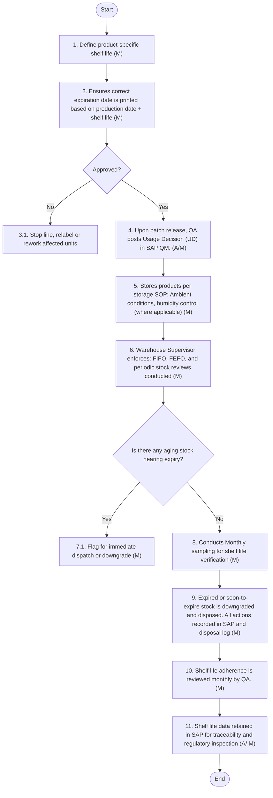

## J. Quality Assurance of Transportation of Finished Products:

11.1 Purpose:
To ensure that all finished flour products are transported under conditions that maintain product quality, integrity, safety, and full traceability, from dispatch at the mill to final delivery to customers or export destinations.
This procedure ensures compliance with Saudi and international transport regulations, minimizes risk of contamination or damage, and preserves customer confidence and it should be read in conjunction with Logistics Section of the Supply Chain Management Manual.
11.2 Policy Statement:
Arabian Mills is committed to ensuring that all finished products are transported using approved, hygienic, and fit-for-purpose vehicles that meet defined standards for cleanliness, loading practices, and documentation.
Transportation is managed as an Operational Prerequisite Program (O-PRP) under ISO 22000.
11.3 Scope:
This procedure applies to:
i. All finished flour products loaded from Arabian Mills’ warehouse or storage facilities.
ii. Both domestic market and export shipments
iii. All modes of transport used (bulk, bagged, palletized)
iv. All 3rd party transporters and in-house vehicles
11.4 Applicable Standards & References:
i. SFDA Food Transport & Handling Guidelines
ii. GSO / GCC Standards on Food Transportation
iii. ISO 22000 — Food Safety Management System
iv. ISO 9001 — Quality Management
v. WTO Codex CAC/RCP 47-2001 — Code of Hygienic Practice for the Transport of Food
vi. Ministry of Commerce & Industry, Saudi Arabia
vii. Export regulations for country of destination (where applicable)
11.5 Policies – Quality Assurance of Transportation of Finished Products:
i. Only approved transporters using food-grade, clean, pest-free, and covered vehicles shall be used for dispatch.
ii. Vehicles must be inspected prior to loading using a standard checklist covering cleanliness, odour, leaks, prior loads, and condition of cargo space.
iii. Loading must be carried out in designated dispatch zones under hygienic conditions, and loading personnel must follow PPE protocols.
iv. All dispatches must be accompanied by a delivery note containing batch numbers, quantity, destination, and transporter details.
v. Temperature-sensitive or export shipments must include additional precautions per contract or regulatory requirements.
vi. Each consignment must be fully traceable via SAP and transport records and must comply with customer requirements and applicable regulatory standards. This applies to both domestic deliveries and export shipments.
11.6 - Procedures – Quality Assurance of Transportation of Finished Products:

| Sr. No. | Procedure Description | Responsibility | Frequency |
| --- | --- | --- | --- |
| 1. | **Transporter Qualification**<br>• Logistics Manager and Procurement to ensure that only approved transporters are used, who: - Meet food-grade hygiene standards - Hold valid permits & certifications - Undergo periodic performance and hygiene review - Updated transporter list to be maintained. ✔ Acceptance: Approved transporter selected. ✖ Rejection: Unapproved transporter. Actions on Rejection:<br>• i) Arrange alternate approved transporter ii) Update approved transporter list iii) Notify QA Manager of any changes.<br>• R efer ‘ Logistics Section ’ of Supply Chain Management Manual for detail process and procedures for loading and unloading activities. | Logistics Manager , Procurement , QA Manager (for respective actions) | Annually reviewed; Per load verified |
| 2. | **Truck Pre-loading Inspection**<br>• Logistics Supervisor to inspect each truck before loading: - Must be clean, dry, odour -free, and free from contamination - Inspection Checklist to be completed prior to loading. ✔ Acceptance: Truck passed inspection. ✖ Rejection: Truck failed inspection. Actions on Rejection:<br>• i) Reject truck and arrange alternate vehicle ii) Log incident in Non-conformance Register iii) Review with transporter if repeated issues occur.<br>• R efer ‘ Logistics Section ’ of Supply Chain Management Manual for detail process and procedures for loading and unloading activities. | Logistics Supervisor | Per truck |
| 3. | **Correct Loading Practices**<br>• Warehouse Loading Team to ensure correct loading: - Pallets loaded securely - No contamination risk - No unauthorised double stacking - Protective covers used when required. ✔ Acceptance: Correct loading verified. ✖ Rejection: Unsafe or incorrect loading. Actions on Rejection:<br>• i) Stop loading ii) Correct the issue before proceeding iii) Retrain loading staff if repeated non-conformance iv) Notify Warehouse Manager for review.<br>• R efer ‘ Logistics Section ’ of Supply Chain Management Manual for detail process and procedures for loading and unloading activities. | Loading Team , Warehouse Manager (for respective actions) | Per truck |
| 4 . | **Traceability & Record Keeping**<br>• Each shipment to be fully traceable to production batch in SAP: - All records to meet traceability requirements - Quarterly audits by QA Supervisor. ✔ Acceptance: Traceability confirmed. ✖ Rejection: Missing or incomplete traceability. Actions on Rejection:<br>• i) QA Specialist to investigate ii) Correct traceability entry in SAP iii) Escalate to QA Manager if repeated. iv) Include in quarterly audit review.<br>• R efer ‘ Logistics Section ’ of Supply Chain Management Manual for detail process and procedures for loading and unloading activities. | Logistics Manage r, QA Specialist , QA Manager (for respective actions) | Per shipment; Quarterly audit |
| 5 . | **Export Container Handling**<br>• Export Manager to inspect export containers: - Physical condition check - Record seal number - Supervise loading - Ensure compliance of all customs/export documents. ✔ Acceptance: Container and documents compliant. ✖ Rejection: Container or documents non-compliant. Actions on Rejection:<br>• i) Reschedule loading and notify Export Manager and QA ii) Take corrective action iii) Report issue to Management if required. | Export Manager , QA Analyst (for respective actions) | Per export shipment |
| 6 . | **Temperature / Time-sensitive Products (if applicable)**<br>• Transport provider and QA Analyst to verify temperature-controlled transport: - Check at dispatch & receipt - Maintain temperature log. ✔ Acceptance: Temperature within specified range. ✖ Rejection: Out-of-spec temperature. Actions on Rejection:<br>• i) QA Analyst to hold load and conduct product safety assessment ii) Escalate to QA Manager for decision iii) Communicate with customer if necessary. | QA Analyst , Transport provider , QA Manager (for respective actions) | Per load (if applicable) |
| 7 . | **Transporter Hygiene Records Review**<br>• Procurement to review hygiene records: - Check validity of transporter hygiene certificates & cleaning logs - Records to be reviewed quarterly with QA Manager. ✔ Acceptance: Records updated & valid. ✖ Rejection: Missing or expired records. Actions on Rejection:<br>• i) Procurement to notify transporter ii) Suspend transporter if compliance not resolved iii) Update transporter status in approved vendor list iv) Inform QA Manager.<br>• R efer ‘Procurement Section ’ of Supply Chain Management Manual for detail process and procedures for Supplier Performance Evaluation. | Procurement , QA Manager (for respective actions) | Quarterly |

Flowchart:

**[Diagram — Visio-EMF→PNG]:**

**Process Name:** Finished Product Transportation  

**Roles / Swimlanes:**

- Logistics  
- QA  
- Warehouse Loading Team  

---

### Steps and Decisions

| Step # | Role | Action / Decision Text (exact) | Decision / Next Step |
|--------|------|---------------------------------|----------------------|
| Start | Logistics | Start | Next: Step 1 |
| 1 | Logistics | 1. Generates customer order. Warehouse picks assigned batch from storage. (M) | Next: Step 2 |
| 2 | QA | 2. Verifies product batch is SAP Released and correct. Packaging is checked. Document completeness is confirmed. (M) | Next: Step 3 |
| 3 | QA | 3. Product & Document Match? | **Decision:** If **Yes**, go to Step 4. If **No**, go to Step 3.1 |
| 3.1 | QA | 3.1 Hold loading and escalate | Next step not specified in diagram (result of “No” from Step 3) |
| 4 | Logistics | 4. Transport vehicle arrives and is inspected. Vehicle details recorded in dispatch log (M) | Next: Step 5 |
| 5 | Logistics | 5. Vehicle Suitable? | **Decision:** If **Yes**, proceed along branch labeled “Yes” towards subsequent loading/sealing/dispatch steps (Steps 6–8). If **No**, go to Step 5.1 |
| 5.1 | Logistics | 5.1. Reject vehicle and request replacement (M) | After replacement, vehicle is re‑inspected – returns to Step 4 |
| 6 | Warehouse Loading Team | 6. Load pallets with care. Segregate different SKUs. Pallets securely arranged to avoid movement. Dispatch team records each pallet against Delivery Note (M) | Next: Step 7 |
| 7 | Logistics | 7. Truck is sealed with numbered tamper-evident seal. (M) | Next: Step 8 |
| 8 | Logistics | 8. Final dispatch posting is done. Batch-wise linkage between product and delivery maintained. (A) | Next: Step 9 |
| 9 | Logistics | 9. Monitor route, delays. Alert sent for delays ≥2 hours or temperature excursions (M) | Next: Step 10 |
| 10 | Logistics | 10. Customer confirms delivery. POD scanned and uploaded in SAP. (A/M) | Next: End |
| End | Logistics | End | — |

**Explicit Yes/No Branch Traces**

- **Decision 3 – “Product & Document Match?”**  
  - **Yes →** Step 4: “Transport vehicle arrives and is inspected. Vehicle details recorded in dispatch log (M)”  
  - **No →** Step 3.1: “Hold loading and escalate”

- **Decision 5 – “Vehicle Suitable?”**  
  - **Yes →** (branch labeled “Yes”) continues through normal loading and dispatch flow:  
    - Step 6: “Load pallets with care. Segregate different SKUs. Pallets securely arranged to avoid movement. Dispatch team records each pallet against Delivery Note (M)”  
    - Step 7: “Truck is sealed with numbered tamper-evident seal. (M)”  
    - Step 8: “Final dispatch posting is done. Batch-wise linkage between product and delivery maintained. (A)”  
    - Step 9: “Monitor route, delays. Alert sent for delays ≥2 hours or temperature excursions (M)”  
    - Step 10: “Customer confirms delivery. POD scanned and uploaded in SAP. (A/M)”  
    - End  
  - **No →** Step 5.1: “Reject vehicle and request replacement (M)” → back to Step 4 for inspection of the replacement vehicle.

---

```mermaid
graph TD

    Start((Start))
    End((End))

    S1[1. Generates customer order. Warehouse picks assigned batch from storage. (M)]
    S2[2. Verifies product batch is SAP Released and correct. Packaging is checked. Document completeness is confirmed. (M)]
    D3{3. Product & Document Match?}
    S31[3.1 Hold loading and escalate]
    S4[4. Transport vehicle arrives and is inspected. Vehicle details recorded in dispatch log (M)]
    D5{5. Vehicle Suitable?}
    S51[5.1. Reject vehicle and request replacement (M)]
    S6[6. Load pallets with care. Segregate different SKUs. Pallets securely arranged to avoid movement. Dispatch team records each pallet against Delivery Note (M)]
    S7[7. Truck is sealed with numbered tamper-evident seal. (M)]
    S8[8. Final dispatch posting is done. Batch-wise linkage between product and delivery maintained. (A)]
    S9[9. Monitor route, delays. Alert sent for delays ≥2 hours or temperature excursions (M)]
    S10[10. Customer confirms delivery. POD scanned and uploaded in SAP. (A/M)]

    Start --> S1 --> S2 --> D3
    D3 -- Yes --> S4
    D3 -- No --> S31

    S4 --> D5
    D5 -- Yes --> S6
    D5 -- No --> S51 --> S4

    S6 --> S7 --> S8 --> S9 --> S10 --> End
```

K. Food Safety & Contamination Control:
12.1 Purpose:
The purpose of the Food Safety and Contamination Control measures in flour milling is to systematically prevent, detect, and eliminate physical, chemical, and microbiological hazards throughout the milling process. These controls are essential to protect consumer health, ensure regulatory compliance (e.g., HACCP, ISO 22000, FSSC), and uphold brand integrity.
To ensure that all potential sources of product contamination are identified, controlled, and monitored across all stages of flour milling, packaging, storage and transport.
This section ensures that critical control points (CCPs) are monitored, sanitation protocols are rigorously followed, and corrective actions are immediately taken if any deviation is found. These efforts directly support the safe production of high-quality flour, safeguard downstream processing (like baking and food manufacturing), and build customer trust in the finished product.
12.2 Policy Statement:
Arabian Mills recognizes that flour is a widely consumed staple ingredient with a unique risk profile while it is a low-moisture product, it is still vulnerable to contamination from physical, chemical, and microbiological sources if controls are not maintained at every stage.
Due to the open nature of milling systems, airborne dust, handling practices, worn equipment, pest ingress, or foreign materials can introduce hazards that affect product safety and brand integrity. Therefore, a structured, risk-based program for Food Safety & Contamination Control is implemented across all areas of the facility — from wheat cleaning to milling, packaging, storage, and transportation. The program is designed to proactively identify potential sources of contamination and implement effective preventive and monitoring measures.
Control measures include:
 Hygienic design of equipment and premises
 Personnel hygiene and behaviour standards
 Controlled cleaning and sanitation
 Prevention of foreign bodies through engineering and procedural controls
 Pest control with trend analysis
 Environmental monitoring to detect airborne or surface contamination
 Where applicable, allergen risk management
This program forms an integral part of Arabian Mills’ Food Safety Management System, and is maintained as an Operational Prerequisite Program (O-PRP) under ISO 22000.
12.3 Scope:
This procedure applies to all processes, equipment, premises, packaging, storage, and transportation systems involved in the production of flour at Arabian Mills. It also applies to all employees, contractors, and visitors entering the production and storage areas.
It covers the following contamination risks:
 Physical — foreign objects such as metal, plastic, glass, insects
 Chemical — residues, lubricants, cleaning agents
 Biological — microorganisms, spores, pests, cross-contamination from environment or personnel
Controls apply across:
 Raw wheat intake and pre-cleaning
 Milling operations
 Packaging lines
 Finished product storage and loading
 Transport vehicles
 Waste handling areas
 Utility areas (compressed air, ventilation, water, steam)
The scope also includes monitoring and verification activities to ensure the effectiveness of the contamination control measures and defines responsibilities for all relevant staff.
12.4 Applicable Standards & References:
i. SFDA Food Hygiene & Safety Standards
ii. ISO 22000 — Food Safety Management System
iii. ISO 9001 — Quality Management System
iv. BRC Global Standard for Food Safety
v. Codex Alimentarius General Principles of Food Hygiene
vi. Ministry of Commerce & Industry — Saudi Arabia
12.5 Policies – Food Safety & Contamination Control:
i. All handling areas and equipment must be regularly cleaned and sanitized. Cleaning schedules and records must be maintained and verified.
ii. Physical contaminants (e.g., glass, metal, wood), pest infestations, and chemical exposure must be strictly controlled through preventive systems (e.g., screens, seals, segregated zones, pest traps).
iii. All personnel involved in product handling must receive regular food safety and hygiene training, with compliance monitored through audits.
iv. Incidents of contamination must be reported immediately, with affected stock quarantined and subjected to QA evaluation and decision.
12.6 Procedures - Food Safety & Contamination Control:

| S.No. | Procedure Description | Responsibility | Frequency |
| --- | --- | --- | --- |
| 1. | **Facility Hygiene & Cleaning**<br>• Production Supervisor and QA Specialist to ensure full implementation of Master Sanitation Schedule (MSS): - All production areas cleaned as per MSS - Cleaning records maintained and signed - QA to verify and audit cleaning effectiveness monthly. ✔ Acceptance: Cleaning records complete and verified. ✖ Rejection: Missing or incomplete cleaning. Actions on Rejection:<br>• i) Stop operations in affected area and perform thorough cleaning ii) QA Specialist to verify before restart iii) Document in Cleaning Verification Log iv) Escalate to Production Manager if repeated. | Production Supervisor , QA Specialist , Production Manager (for respective actions) | Daily, Monthly Audit |
| 2. | **Personnel Hygiene**<br>• QA Manager and HR to ensure strict compliance to personnel hygiene policy: - Clean factory clothing, hairnets, no jewellery , no watches - Wounds covered with blue plaster - Proper handwashing before entry - Entry controls in place. ✔ Acceptance: Full compliance with hygiene standards. ✖ Rejection: Hygiene violations observed. Actions on Rejection:<br>• i) Remove non-compliant personnel from area ii) Provide retraining iii) Implement disciplinary action if repeated iv) Record incident and corrective action. | QA Manager , HR (for respective actions) | Daily monitoring |
| 3. | **Foreign Body Prevention (Glass, Metal, Plastics)**<br>• QA Manager and Maintenance Manager to ensure control measures are in place: - Shatterproof bulbs and covers - Controlled use of glass & plastics - Process magnets, screens, sieves maintained - Monthly Foreign Body Audit performed. ✔ Acceptance: No foreign body risks detected. ✖ Rejection: Potential foreign body source found. Actions on Rejection:<br>• i) Isolate affected area ii) Conduct inspection and cleaning iii) Initiate corrective action iv) Conduct retraining if required v) Document findings in Non-conformance Register. | QA Manager , Maintenance Manager (for respective actions) | Monthly |
| 4. | **Pest Control**<br>• QA Manager to ensure Pest Control Program is strictly followed: - Devices (traps, bait stations) monitored per plan - Pest Control Contractor to act on findings - Trend analysis performed quarterly. ✔ Acceptance: No pest activity detected. ✖ Rejection: Pest activity or poor control observed. Actions on Rejection:<br>• i) Escalate to QA Director and Branch Manager ii) Pest Control Contractor to conduct corrective action iii) Quarantine affected areas if required iv) Increase monitoring frequency v) Review Pest Control Program effectiveness. | QA Manager , Pest Control Contractor (for respective actions) | Weekly monitoring; Quarterly audit |
| 5. | **Environmental Monitoring (Air, Surfaces)**<br>• QA Specialist to implement Environmental Monitoring Plan: - Air and surface swab testing performed per plan (based on ISO 14644 Food Zones) - Results reviewed and trended. ✔ Acceptance: No out-of-spec microbiological results. ✖ Rejection: Out-of-spec results detected. Actions on Rejection:<br>• i) Investigate source increase cleaning & sanitation ii) Conduct follow-up testing and verify corrective action iii) Record and report to QA Manager. | QA Specialist , QA Manager (for respective actions) | Monthly |
| 6. | **Allergen Control (if applicable)**<br>• QA Manager and Production Manager to ensure allergen control measures are in place where applicable: - Identified allergen zones - Segregation procedures enforced - Dedicated equipment if required - Labelling control procedures followed. ✔ Acceptance: Allergen control verified. ✖ Rejection: Cross-contact or labelling issue observed. Actions on Rejection:<br>• i) Isolate affected product ii) Conduct root cause investigation iii) Correct labelling iv) Retrain staff v) Conduct additional verification before product release. | QA Manager , Production Manager (for respective actions) | Monthly |

L. Microbiological Risk Management:
13.1 Purpose:
To systematically identify, control, and monitor microbiological risks in flour milling operations, ensuring that all finished products meet legal and customer requirements for food safety and hygiene. Although flour is a low-moisture product, it can carry microbiological hazards such as Bacillus cereus spores, moulds, and pathogens such as Salmonella and E. coli O157:H7 if poor controls are in place. This procedure defines the management of microbiological risks at each relevant stage of the milling process.
13.2 Policy Statement:
Arabian Mills acknowledges that raw wheat, milling equipment, and the processing environment can act as potential sources of microbiological contamination. Furthermore, improper cleaning, poor storage conditions, or cross-contamination can create conditions where certain bacteria or moulds survive or proliferate.
Microbiological controls are therefore embedded as an integral part of the Food Safety Management System, linked to HACCP studies and are implemented across:
 Raw wheat intake
 Cleaning and tempering
 Milling operations
 Packaging
 Finished product storage
 Loading and transportation
The policy aims to minimize risk through:
 Supplier quality controls
 Cleaning and sanitation programs
 Environmental monitoring
 Air quality and dust management
 Moisture control during storage
 Testing of raw materials and finished products as per risk level
The program is implemented as part of Operational PRPs and monitored through Verification & Review processes to ensure compliance with SFDA, ISO 22000, and Codex requirements.
13.3 Scope:
This procedure applies to all operations at Arabian Mills that influence microbiological risk:
 Raw material (wheat) sourcing and testing
 Cleaning and tempering operations
 Milling system design and maintenance
 Product packaging
 Finished goods storage and transport
 Environmental and personnel hygiene controls
It applies to the following types of microbiological hazards:
 Pathogenic bacteria: Salmonella spp., E. coli O157:H7
 Spore-formers: Bacillus cereus
 Moulds and yeasts: Aspergillus spp., Penicillium spp.
 Enterobacteriaceae (as hygiene indicator organisms)
13.4 Applicable Standards & References:
 SFDA Food Safety Standards
 ISO 22000 — Food Safety Management System
 ISO 17025 — Testing and calibration requirements (for lab testing)
 BRC Global Standard for Food Safety
 Codex Alimentarius General Principles of Food Hygiene
 Ministry of Commerce & Industry — Saudi Arabia
13.5 Policies – Microbiological Risk Management:
 Finished product specifications must include microbiological criteria (e.g., total plate count, yeast/mould, coliforms, pathogens), based on product type and market requirements.
 Routine sampling and testing of finished goods must be performed by trained personnel or certified laboratories, with results linked to batch records.
 Environmental microbiological monitoring must be in place for storage and dispatch zones, with action thresholds and corrective plans.
 Equipment, containers, and packaging surfaces that contact food must be sanitized using validated methods and verified via surface swab tests.
 In case of microbial failure, affected product must be immediately blocked, and a root cause investigation must be conducted to prevent recurrence.
 Trends in microbial results must be reviewed monthly by the QA team for proactive mitigation and risk control.
13.6 Procedures - Microbiological Risk Management:

| S.No. | Procedure Description | Responsibility | Frequenc y |
| --- | --- | --- | --- |
| 1. | **Raw Wheat Microbiological Testing**<br>• QA Analyst to perform microbiological testing on incoming wheat : - Sampling based on risk profile & customer requirements - Parameters as per product specs - Results documented & reviewed. ✔ Acceptance : Wheat meets microbiological criteria. ✖ Rejection : Out-of-spec results. Actions on Rejection:<br>• i) Block the lot and inform Procurement & QA Manager ii) Hold for rework, return, or disposal iii) Record non-conformance and follow CAPA if repeated issue. | QA Analyst , Procurement & QA Manager’s (for respective actions) | As per Sampling Plan |
| 2. | **Cleaning & Sanitation of Milling Equipment**<br>• Maintenance Manager & QA Specialist to ensure all milling & packaging equipment cleaned per schedule : - Verified with cleaning records and swab results - Additional swabs taken as required. ✔ Acceptance: Cleaning records and swabs acceptable. ✖ Rejection: Swabs show unacceptable contamination. Actions on Rejection:<br>• i) Stop affected equipment and perform re-cleaning ii) Conduct re-swabbing iii) QA Manager to authorize restart iv) Escalate if repeated issue. | Maintenance Manager , QA Supervisor (for respective actions) | Daily / Weekly |
| 3. | **Environmental Monitoring Program (EMP)**<br>• QA Specialist to implement EMP : - Defined zones monitored for air, dust & surfaces - Target organisms: Enterobacteriaceae, yeasts, moulds - Trend analysis performed. ✔ Acceptance: EMP results within limits. ✖ Rejection: EMP results out of limits. Actions on Rejection:<br>• i) Intensify cleaning in affected areas and conduct root cause analysis ii) Perform resampling iii) Escalate to QA Manager, Document findings and actions. | QA Specialist | Monthly |
| 4. | **Compressed Air Quality Control**<br>• QA Specialist & Maintenance Manager to test compressed air used in product zones : - Tests performed per ISO 8573-7 standard - Results documented. ✔ Acceptance: Air quality meets standard. ✖ Rejection: Contaminated air. Actions on Rejection:<br>• i) Isolate affected air lines ii) Service or replace filters iii) Retest before restarting operations iv) Record results in maintenance & QA logs. | Maintenance Manager , QA Specialist (for respective actions) | Quarterly |
| 5. | **Finished Product Microbiological Testing**<br>• QA Analyst to perform microbiological testing of flour batches : - Pathogens & indicator organisms - Sampling frequency as per risk profile & finished product sampling plan. ✔ Acceptance: Product meets specifications. ✖ Rejection: Out-of-spec results. Actions on Rejection:<br>• i) Block affected batch ii) Activate traceability iii) QA Manager to lead investigation iv) Implement corrective actions v) Notify regulatory authority if required. | QA Analyst , QA Manager (for respective actions) | As per Finished Product Sampling Plan |
| 6. | **Personnel Hygiene Monitoring (Hand Swabs)**<br>• QA Specialist to conduct hygiene swabs of hands/gloves of production staff : - Testing performed periodically - Results recorded and trended. ✔ Acceptance: Hygiene swabs within limits. ✖ Rejection: Out-of-spec swabs. Actions on Rejection:<br>• i) Immediate retraining of individual ii) Increase hygiene monitoring frequency iii) Conduct root cause review iv) Record findings and follow CAPA if repeated. | QA Specialist | Quarterly |

M. Process Waste Management:
14.1 Purpose:
To establish a systematic and controlled approach for managing all waste materials generated during the milling process in a manner that ensures food safety, regulatory compliance, environmental responsibility, and operational efficiency.
This procedure aims to:
i. Prevent cross-contamination between waste and product.
ii. Minimize environmental impact.
iii. Ensure compliance with legal and customer requirements.
iv. Support operational cleanliness and pest control.
14.2 Policy Statement:
Arabian Mills is committed to managing all forms of waste generated from flour milling operations in a controlled and hygienic manner. Due to the continuous nature of milling and the presence of dust, by-products, packaging debris, maintenance residues and domestic waste, poor waste management can lead to contamination risks, pest attraction, and regulatory non-compliance.
Waste must be:
i. Identified and segregated at the point of generation.
ii. Collected in appropriate containers.
iii. Stored safely.
iv. Removed at defined frequencies.
v. Disposed of through approved waste handlers in compliance with environmental and local regulations
The Process Waste Management Program forms part of the mill’s Operational PRPs and contributes to overall food safety and environmental stewardship.
14.3 Scope:
This procedure applies to all types of waste generated within Arabian Mills' operations:
i. Production areas (milling, packaging, storage)
ii. Maintenance activities
iii. Administrative and support functions
Types of waste covered include:
i. Food process waste (bran, off-grade product, tailings)
ii. Packaging waste (paper, plastic, strapping, labels)
iii. Maintenance waste (lubricants, parts, rags)
iv. Pest control residues
v. Office/domestic waste
vi. Environmental waste (air filter dust, vacuum cleaner contents)
Excluded: Effluent — no process water used in flour milling.
14.4 Applicable Standards & References:
i. SFDA Food Safety Standards
ii. ISO 22000 — Food Safety Management System
iii. ISO 14001 — Environmental Management System
iv. MEWA (Saudi Ministry of Environment, Water and Agriculture) Waste Regulations
v. Codex Alimentarius — General Principles of Food Hygiene
vi. Local Municipality & Environmental Requirements
14.5 Policies - Process Waste Management:
i. All process waste (e.g., dust, off-spec flour, bran overs, packaging rejects) must be categorized as reusable, recyclable, or disposable and managed accordingly.
ii. Reusable by-products (e.g., bran) may be diverted for animal feed or industrial use if approved and tracked with traceability.
iii. Non-conforming or contaminated product must be securely stored and disposed of following documented QA protocols and local environmental regulations.
iv. Daily waste logs must be reviewed by production, QA, and maintenance for reduction opportunities and root cause analysis.
14.6 Procedures - Process Waste Management:

| Sr. No. | Procedure Description | Responsibility | Frequency |
| --- | --- | --- | --- |
| 1. | **Identification and Segregation of Waste**<br>• Production & QA to ensure: - Waste correctly identified and segregated by type - Labelled containers used at source - No mixing of waste types. ✔ Acceptance : Waste properly segregated. ✖ Rejection: Mixed/misclassified waste. Actions on Rejection:<br>• i) QA Supervisor to issue NC ii) Retraining of staff iii) Immediate correction at site. | Production Supervisor , QA Analyst (for respective actions) | Daily checks |
| 2. | **Storage of Waste**<br>• - Waste stored in closed, pest-proof containers - Quickly removed from production zones - Moved to designated waste storage. ✔ Acceptance: Waste storage controlled. ✖ Rejection: Open waste, pest risk. Actions on Rejection:<br>• i) Immediate correction ii) Increase monitoring iii) Notify Pest Control team if required. | Production Supervisor , QA Analyst (for respective actions) | Daily checks |
| 3. | **Removal of Waste**<br>• - Waste removed on set frequencies - Removal records maintained. ✔ Acceptance: Waste removed as per schedule. ✖ Rejection: Waste accumulation. Actions on Rejection:<br>• i) Escalate to Branch Manager ii) Organise immediate removal iii) Issue NC if repeated. | Waste Handling Te am, Facilities Manager (for respective actions) | Daily / Weekly (by type) |
| 4. | **Disposal of Waste**<br>• - Only approved contractors used - Disposal documented with permits, receipts. ✔ Acceptance: Approved contractor used; records complete. ✖ Rejection: No record or unapproved disposal. Actions on Rejection:<br>• i) QA Manager to investigate ii) Procurement to verify contractor iii) Stop unapproved disposal.<br>• R efer ‘Procurement Section ’ of Supply Chain Management Manual for detail process and procedures for Disposal of Waste Materials . | Facilities Manager , Procurement Manager (for respective actions) | Monthly review |
| 5. | **Pest Control Waste Management**<br>• - Pest residues (dead pests, bait waste) disposed separately. ✔ Acceptance: Controlled disposal. ✖ Rejection: Improper handling. Actions on Rejection:<br>• i) QA to issue NC ii) Retrain Pest Control team. | QA Specialist , Pest Control Contractor (for respective actions) | As generated |
| 6. | **Maintenance Waste Handling**<br>• - Used lubricants, filters, parts managed separately - Disposal via licensed contractors. ✔ Acceptance: Correct handling and disposal. ✖ Rejection: Improper disposal. Actions on Rejection:<br>• i) QA to issue NC ii) Maintenance Manager to correct process. | Maintenance Manager , Facilities Manager (for respective actions) | Monthly |

N. Product Shelf-Life Management:
15.1 Purpose:
To establish a structured system for managing product shelf life across all flour and related SKUs to ensure compliance with Saudi Food and Drug Authority (SFDA) regulations, uphold product integrity, and minimize expired product risk throughout the supply chain.
15.2 Policy Statement:
Arabian Mills is committed to proactively managing the shelf life of its flour and related products through scientifically established expiration parameters, SAP-integrated monitoring, and strict distribution controls. The company shall:
i. Ensure shelf life is determined based on product-specific stability studies in accordance with SFDA.GSO 150-2.
ii. Prevent the dispatch of products nearing expiry through defined minimum shelf-life requirements.
iii. Implement SAP controls for expiry tracking, alerts, and quality notifications.
iv. Follow First-Manufactured-First-Out (FMFO) discipline across the supply chain.
v. Ensure full compliance with SFDA.FD 150-1, SFDA.FD/GSO 9:2013, and SASO packaging and labelling standards.
vi. Conduct routine inspections, audits, and traceability checks to enforce shelf-life control and regulatory compliance.
15.3 Scope:
This policy applies to:
i. All flour and related food products produced, stored, distributed, or sold by Arabian Mills.
ii. All entities in the supply chain: factory warehouses, distributors, retailers, and sales outlets.
iii. All departments responsible for production, quality, supply chain, and regulatory compliance.
15.4 Applicable Standards & References:
i. SFDA.FD 150-1:2021 (Mandatory Expiry Requirements)
ii. SFDA.FD/GSO 150-2:2013 (Voluntary Expiry Guidelines)
iii. SFDA.FD/GSO 9:2013 (Labelling of Prepackaged Food)
iv. ISO 22000 and Codex Alimentarius Guidelines
v. Saudi SASO Labelling & Packaging Standards
15.5 Policies - Product Shelf-Life Management:
i. Each product must have a clearly defined shelf life based on scientific and regulatory justification (e.g., 3–6 months for flour), approved by QA and documented in the product specification file.
ii. Shelf life must be linked to batch records and system expiry dates at the time of production confirmation.
iii. Products must be labelled with production and expiry dates based on system-driven calculations to prevent manual error.
iv. Inventory must be rotated using FEFO (First Expiry, First Out) to reduce expiry-related wastage.
v. Near-expiry inventory must be system-flagged and reviewed weekly for clearance, re-validation (where permitted), or controlled destruction.
vi. Product returns due to expired shelf life must be logged, analysed, and presented in monthly quality and inventory reviews.
15.6 Procedures - Product Shelf-Life Management:

| S r . No . | Procedure Description | Responsibility | Frequency |
| --- | --- | --- | --- |
| 1. | **Shelf-Life Determination**<br>• Based on product stability, packaging, and storage, scientifically determine shelf life as per SFDA.GSO 150-2. Document the shelf life in product master data. Shelf life linked to batch records and system expiry dates at the time of production confirmation.<br>• ✔ Acceptance: Scientific studies completed and documented.<br>• ✖ Rejection: No documentation for shelf-life justification.<br>• Actions on Rejection:<br>• i) QA to initiate shelf-life testing.<br>• ii) QA to block distribution until documentation is complete.<br>• iii) Update SAP master data upon approval.<br>• iv) Notify SFDA if labelling change is required. | QA Manager | Product Launch / Review |
| 2. | **FMFO Principal Enforcement**<br>• Implement First-Manufactured-First-Out logic in SAP and enforce physical picking accordingly.<br>• ✔ Acceptance: Older batches dispatched first.<br>• ✖ Rejection: Newer batch dispatched before older.<br>• Actions on Rejection:<br>• i) Warehouse team to reverse dispatch.<br>• ii) Re-assign correct batch via SAP.<br>• iii) QA to raise deviation log. | Warehouse Section Head | Ongoing |
| 3. | **Shelf-Life Labelling**<br>• Ensure production date, expiry date, and batch code are printed legibly on all packages as per SFDA.GSO 9:2013. No use of stickers allowed.<br>• ✔ Acceptance: Clear, printed date info.<br>• ✖ Rejection: Missing/faded dates, stickers used.<br>• Actions on Rejection:<br>• Batch to be held; QA to inspect and decide on relabel or reprocess; escalate repeat issues to Printing Technician for equipment calibration. | Production Supervisor, QA Analyst (for respective actions) | Per Line |
| 4. | **SAP Shelf-Life Configuration**<br>• Configure SAP material and batch master’s with shelf-life parameters, expiry thresholds, and alerts. Near-expiry must be system flagged, reviewed weekly.<br>• ✔ Acceptance: SAP alerts triggered correctly.<br>• ✖ Rejection: Dispatch allowed despite short shelf life.<br>• Actions on Rejection:<br>• SAP Coordinator to update configuration, test logic, and inform QA; QA to validate system response. | SAP Coordinator | As Needed or weekly |
| 5. | **Non-Conforming & Expired Product Handling**<br>• Expired or low-shelf-life products must be quarantined and dispositioned through respective SAP workflows.<br>• ✔ Acceptance: Product isolated, logged in SAP.<br>• ✖ Rejection: Expired product found in circulation.<br>• Actions on Rejection:<br>• Immediate hold, root cause analysis by QA; raise SAP Quality Notification; management review for systemic lapse. | QA Analyst | Per Occurrence |
| 6. | **Monitoring & Traceability**<br>• Use SAP batch reports and expiry dashboards to track shelf-life status and identify at-risk batches. Product returns due to expired shelf life must be logged and investigated for the root cause. Recording of data to be ensured and reviewed periodically.<br>• ✔ Acceptance: System flags and alerts active.<br>• ✖ Rejection: Missed alerts or expired stock dispatched.<br>• Actions on Rejection:<br>• SAP to review logic; QA to conduct traceability test and issue NCR for any process breakdown. | Distribution Manager | Weekly or Monthly |
| 7. | **Training & Awareness**<br>• Train all stakeholders on shelf-life policy, SAP usage, and visual inspection practices.<br>• ✔ Acceptance: Training records maintained.<br>• ✖ Rejection: Staff unaware of shelf-life SOP.<br>• Actions on Rejection:<br>• HR to reschedule training; QA to assess knowledge gaps via quiz; reissue SOP summaries to floor staff. | HR , QA Trainer (joint responsibility) | Annual / New Joiner |

Flowchart:

**[Diagram — Visio-EMF→PNG]:**

**Process Name:** Shelf Life Stability  

**Roles / Swimlanes:**

- QA Manager  
- Packaging Operator  
- Warehouse Manager  
- SAP Coordinator  

---

### Steps and Decisions

| Step # / Decision | Role               | Action                                                                                                                                        | Decision / Next Step                                                                                                                                                              |
|-------------------|--------------------|-----------------------------------------------------------------------------------------------------------------------------------------------|-----------------------------------------------------------------------------------------------------------------------------------------------------------------------------------|
| Start             | QA Manager         | Start                                                                                                                                        | Next: **1. Define product-specific shelf life (M)**                                                                                                                               |
| 1                 | QA Manager         | Define product-specific shelf life (M)                                                                                                       | Next: **2. Ensures correct expiration date is printed based on production date + shelf life (M)**                                                                                |
| 2                 | Packaging Operator | Ensures correct expiration date is printed based on production date + shelf life (M)                                                        | Next: Decision **“Approved?”**                                                                                                                                                    |
| Approved?         | QA Manager         | Decision point labeled “Approved?”                                                                                                           | If **Yes**: go to **4. Upon batch release, QA posts Usage Decision (UD) in SAP QM. (A/M)**. If **No**: go to **3.1. Stop line, relabel or rework affected units**.               |
| 3.1               | QA Manager         | Stop line, relabel or rework affected units                                                                                                  | End of this branch (no further steps shown).                                                                                                                                     |
| 4                 | QA Manager         | Upon batch release, QA posts Usage Decision (UD) in SAP QM. (A/M)                                                                            | Next: **5. Stores products per storage SOP: Ambient conditions, humidity control (where applicable) (M)**                                                                        |
| 5                 | Warehouse Manager  | Stores products per storage SOP: Ambient conditions, humidity control (where applicable) (M)                                                | Next: **6. Warehouse Supervisor enforces: FIFO, FEFO, and periodic stock reviews conducted (M)**                                                                                 |
| 6                 | Warehouse Manager  | Warehouse Supervisor enforces: FIFO, FEFO, and periodic stock reviews conducted (M)                                                         | Next: Decision **“Is there any aging stock nearing expiry?”**                                                                                                                    |
| Is there any aging stock nearing expiry? | Warehouse Manager  | Decision point labeled “Is there any aging stock nearing expiry?”                                                                            | If **Yes**: go to **7.1. Flag for immediate dispatch or downgrade (M)**. If **No**: go to **8. Conducts Monthly sampling for shelf life verification (M)**.                      |
| 7.1               | Warehouse Manager  | Flag for immediate dispatch or downgrade (M)                                                                                                | End of this branch (no further steps shown).                                                                                                                                     |
| 8                 | QA Manager         | Conducts Monthly sampling for shelf life verification (M)                                                                                   | Next: **9. Expired or soon-to-expire stock is downgraded and disposed. All actions recorded in SAP and disposal log (M)**                                                        |
| 9                 | QA Manager         | Expired or soon-to-expire stock is downgraded and disposed. All actions recorded in SAP and disposal log (M)                               | Next: **10. Shelf life adherence is reviewed monthly by QA. (M)**                                                                                                                |
| 10                | QA Manager         | Shelf life adherence is reviewed monthly by QA. (M)                                                                                         | Next: **11. Shelf life data retained in SAP for traceability and regulatory inspection (A/ M)**                                                                                  |
| 11                | SAP Coordinator    | Shelf life data retained in SAP for traceability and regulatory inspection (A/ M)                                                           | Next: **End**                                                                                                                                                                    |
| End               | SAP Coordinator    | End                                                                                                                                         | Process terminates.                                                                                                                                                              |

---



O. Governance Framework for Cross-Functional Collaboration:
16.1 Purpose:
To define and implement a governance structure that enables effective cross-functional collaboration between Production, Quality Assurance, Maintenance, Supply Chain, Sales, and supporting functions. The objective is to ensure operational alignment, shared accountability, and transparent decision-making to support food safety, compliance, and continuous improvement.
16.2 Policy Statement:
Arabian Mills is committed to fostering a collaborative environment by institutionalizing structured communication, documented workflows, and defined responsibilities between departments. All operational decisions impacting food safety, product quality, or customer satisfaction shall be made within an integrated governance framework.
Key governance principles:
i. Structured inter-departmental coordination and timely escalation protocols.
ii. SAP-enabled integration to enhance visibility and traceability.
iii. Respectful communication and culturally sensitive collaboration.
iv. Inclusive participation across nationalities and roles.
16.3 Scope:
This framework applies to all functions directly or indirectly involved in flour production, packaging, storage, distribution, quality control, and regulatory compliance. It is relevant to both factory-level and corporate-level governance with an objective to ensure internal collaboration protocols for issue resolution, planning and continuous improvement.
16.4 Guiding Principles:

| Principle | Description |
| --- | --- |
| Respect & Dignity | Communication must reflect cultural respect, especially across hierarchical lines. Meetings should be scheduled formally with proper etiquette, honouring Saudi traditions. |
| Collaborative Decision-Making | While final authority may reside with specific functions (e.g., Production or QA), decisions must be preceded by collaborative discussions and impact assessments. |
| Inclusivity | Encourage full participation of both Saudi and non-Saudi team members. Multinational inputs are to be valued, especially in problem-solving or policy reviews. |
| Escalation Without Conflict | Issues must be escalated respectfully and within defined channels. Direct confrontation is discouraged; instead, seek mediated resolution through department heads. |
| Confidentiality & Integrity | All departments must uphold discretion regarding sensitive information, especially during audits, recalls, or incident handling. |

16.5 Policies - Governance Framework for Cross-Functional Collaboration:
i. A Cross-Functional Committee (CFC) shall be established comprising department heads or appointed leads, meeting bi-weekly or monthly based on criticality.
ii. CFGC shall be responsible for reviewing KPIs, quality incidents, customer complaints, project status, compliance risks, and cross-functional action items.
iii. All strategic and corrective actions requiring multi-departmental coordination (e.g., recalls, major downtime, new product launches) must be routed through CFC.
iv. Meeting outcomes shall be documented, action-tracked, and integrated into departmental work plans with system-linked responsibilities and timelines.
v. Escalation pathways must be clearly defined for critical issues that require CEO/Executive intervention.
vi. Cross-functional workflows must be supported by shared access to real-time data through dashboards and SAP reports for transparency and accountability.
16.6 Procedures - Governance Framework for Cross-Functional Collaboration:

| Sr. No. | Procedure Description | Responsibility | Frequency |
| --- | --- | --- | --- |
| 1. | **Cross-Functional Batch Approval**<br>• Trigger: Initiation of new flour type or supplier<br>• Production submits request to QA.<br>• QA performs raw material validation and lab clearance.<br>• Supply Chain updates and releases batch in SAP (Module: PP/MM)<br>• ✔ Acceptance: Batch approved and released in SAP after validation. ✖ Rejection: Incomplete validation or batch blocked in SAP. Actions on Rejection:<br>• Hold batch in SAP.<br>• Notify Supply Chain & QA Manager<br>• Investigate cause before re-initiation. | QA , Production , Supply Chain (for respective actions) | As Required |
| 2. | **Non-Conformance Handling**<br>• Trigger: Quality or operational deviation during or after production.<br>• QC logs deviation in SAP-QM.<br>• RCA conducted by cross-functional team.<br>• CAPA tracked in SAP (Module: QM).<br>• ✔ Acceptance: Deviation resolved and CAPA verified in SAP. ✖ Rejection: Incomplete RCA or unresolved issue. Actions on Rejection:<br>• Flag for management review.<br>• Escalate unresolved issues to committee.<br>• Revalidate after corrective actions. | QA , Production , Maintenance Manager’s (for respective actions) | On-going |
| 3. | **Equipment Downtime Escalation**<br>• Trigger: Any failure in production or packaging.<br>• Maintenance logs downtime in SAP-PM.<br>• Production reschedules impacted activities.<br>• QA authorizes restart post-cleanup validation.<br>• ✔ Acceptance: Downtime resolved, and QA cleared restart. ✖ Rejection: Restart without clearance or unresolved issue. Actions on Rejection:<br>• Restart blocked until QA clearance.<br>• Maintenance inspection scheduled.<br>• Escalate repeated failures to Plant Manager | QA , Production , Maintenance Manager’s (for respective actions) | As Needed |
| 4. | **Finished Goods Release Protocol**<br>• Trigger: Post-packaging and prior to dispatch.<br>• QA conducts sampling.<br>• Lab test results entered in SAP-QM.<br>• Sales accesses batch status via SAP-MM.<br>• ✔ Acceptance: Test results pass, batch released in SAP. ✖ Rejection: Failed results or incomplete release. Actions on Rejection:<br>• Block in SAP<br>• Initiate retesting or rework<br>• Notify Sales for revised plan. | QA , Sales , Logistics Managers (for respective actions) | Every Lot |
| 5. | **Governance Committee Reviews**<br>• Committees formed to review KPIs, issues, traceability:<br>• Quality & Operations (Bi-weekly)<br>• Shelf Life (Monthly)<br>• SAP Governance (Quarterly)<br>• Emergency Response (As needed)<br>• ✔ Acceptance: Actions tracked, and minutes recorded in SAP-DMS. ✖ Rejection: Delayed or unresolved committee actions. Actions on Rejection:<br>• Escalate delay.<br>• Reassign owners.<br>• Log in governance dashboard. | Committee Heads , QA Manager (joint responsibility) | Per Committee Calendar Meeting |
| 6. | **Performance Monitoring and Escalation**<br>• Daily: Rejections, NCs, plan adherence<br>• Weekly: Pest & downtime<br>• Monthly: Governance KPIs<br>• Escalations logged in SAP reports.<br>• ✔ Acceptance: Reports generated and KPIs improving. ✖ Rejection: Gaps not addressed or recurring NCs. Actions on Rejection:<br>• Escalate to Corporate QA<br>• Trigger internal audit.<br>• Track in review dashboard. | QA , Plant Manager , D epartment Heads (joint responsibility) | Daily / Weekly / Monthly |