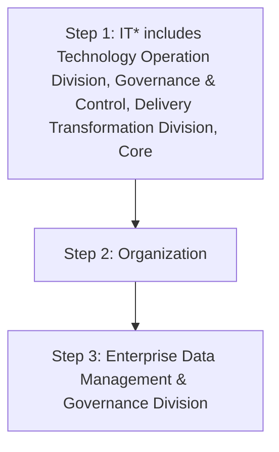

## 2.4. Data Value Realization KPIs

It is important to measure the progress of the Data Value Realization initiatives. Data Product and BI Team is accountable and responsible for creating and maintaining the Key Performance Indicators (KPIs) to measure the Data Value Realization initiatives. The following table delineates the Data Value Realization key performance indicators.

| Category | Metric | Description |
| --- | --- | --- |
| Data Value Realization Use Cases | C ost saved from implemented Use Cases | Total cost saved from implemented Cost Saving Use Cases . This in dicator will be assessed at each use case level, and the frequency will be on yearly basis. |
| Data Value Realization Use Cases | Data Value Realization Use Case Payback period | Period of Data Value Realization Use Case Payback . This KPI will be monitored and assessed as per the pay back period defined at business value estimation time. |
| Data Value Realization Use Cases | Data Value Realization Use Case Return on Investment (ROI). | Return on Investment (ROI) from implemented Data Value Realization Use Cases . This KPI will be assessed at each use case level, and the frequency will be on yearly basis. |


| organization |  |
| --- | --- |


**[Flowchart — Word Shapes]:**

1. IT* includes Technology Operation Division, Governance & Control, Delivery Transformation Division, Core
2. Organization
3. ing Division and Enterprise Data Management & Governance Division


**[Flowchart — Structured]:**

```markdown
## Step Table

| Step Number | Step Description                                                                          | Decision | Next Step (Yes) | Next Step (No) |
|-------------|-------------------------------------------------------------------------------------------|----------|-----------------|----------------|
| 1           | IT* includes Technology Operation Division, Governance & Control, Delivery Transformation Division, Core | No       | 2               | -              |
| 2           | Organization                                                                              | No       | 3               | -              |
| 3           | Enterprise Data Management & Governance Division                                         | No       | -               | -              |

## Mermaid Diagram


```