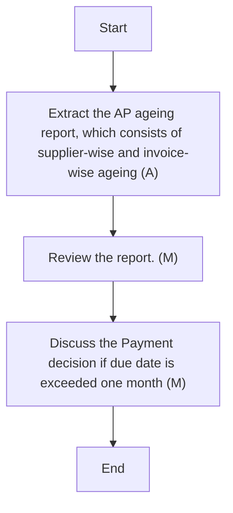

### Analysis

1. **Process Name**: Creditors Ageing

2. **Roles (Swimlanes)**:
   - SAP
   - AP Accountant
   - AP Unit Head/Accounting Manager
   - CFO

3. **Steps Table**:

| Step # | Role                            | Action                                                                       | Next Step/Logic              |
|--------|---------------------------------|------------------------------------------------------------------------------|------------------------------|
| 1      | AP Accountant                   | Extract the AP ageing report, which consists of supplier-wise and invoice-wise ageing (A) | Step 2                       |
| 2      | AP Unit Head/Accounting Manager | Review the report. (M)                                                       | Step 3                       |
| 3      | CFO                             | Discuss the Payment decision if due date is exceeded one month (M)            | End                          |

4. **Mermaid.js Code Block**:

