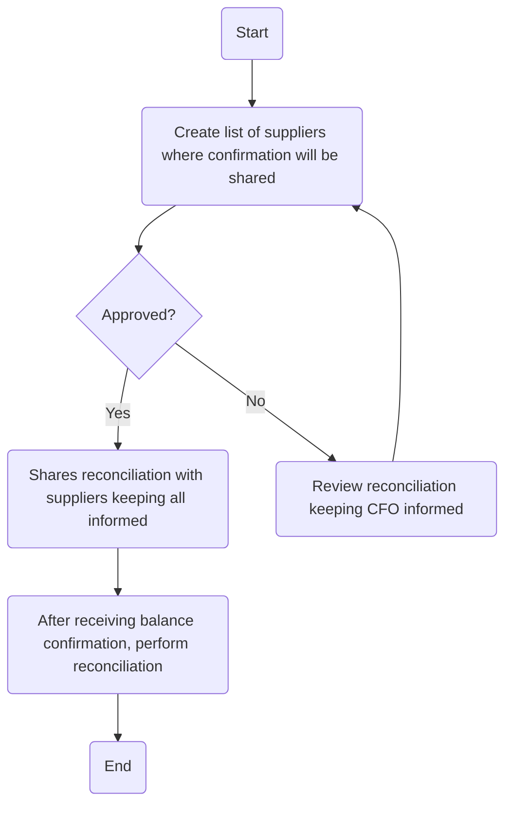

### Analysis of Flowchart

#### 1. Process Name:
- Balance Confirmation

#### 2. Roles (Swimlanes):
- AP Unit Head
- Accounting Manager / GL Manager
- AP Accountant

#### 3. Steps in Markdown Table:

| Step # | Role                      | Action                                                                                          | Next Step/Logic                                      |
|--------|---------------------------|-------------------------------------------------------------------------------------------------|------------------------------------------------------|
| 1      | AP Unit Head              | Create list of suppliers where confirmation will be shared (M)                                  | Approved?                                            |
| 2      | Accounting Manager / GL Manager | Approved?                                                                                      | Yes: Step 3; No: Step 5                              |
| 3      | AP Accountant             | Shares reconciliation with suppliers keeping AP Unit Head, Accounting Manager, GL Manager, and CFO informed (M) | Step 4                                               |
| 4      | AP Accountant             | After receiving balance confirmation, AP accountant to perform reconciliation (M)                | End                                                  |
| 5      | Accounting Manager / GL Manager | Review reconciliation keeping CFO informed (M)                                                 | Step 1                                               |

#### 4. Mermaid.js Code Block:

