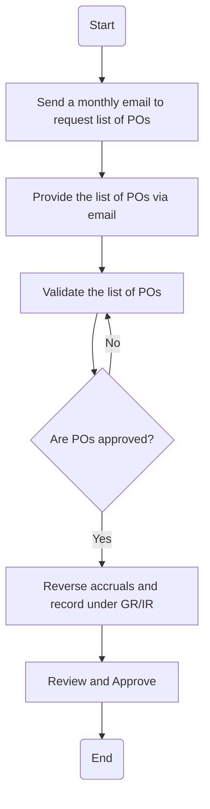

### Analysis

**1. Process Name:**
   - Accrual Management – PO based approvals

**2. Roles (Swimlanes):**
   - GL Manager
   - Supply Chain Team
   - Accounting Manager

**3. Steps in a Markdown Table:**

| Step # | Role                | Action                                                                                          | Next Step/Logic                                             |
|--------|---------------------|-------------------------------------------------------------------------------------------------|-------------------------------------------------------------|
| 1      | GL Manager          | Send a monthly email to the procurement team to request list of POs which are still under approval stage. | Step 2                                                      |
| 2      | Supply Chain Team   | Provide the list of POs which are under approval stage via email.                               | Step 3                                                      |
| 3      | GL Manager          | Validate the list of POs and upload the working on SAP and parks the accrual entry in the system. | Step 4                                                      |
| 4      | GL Manager          | Check if POs are approved.                                                                     | Yes: Step 5  No: Back to Step 3                          |
| 5      | GL Manager          | Reverse the accruals booked against approved POs and ensures they are recorded under GR/IR for the current month. | Step 6                                                      |
| 6      | Accounting Manager  | Review and Approve                                                                              | End                                                         |

**4. Mermaid.js Code Block:**

