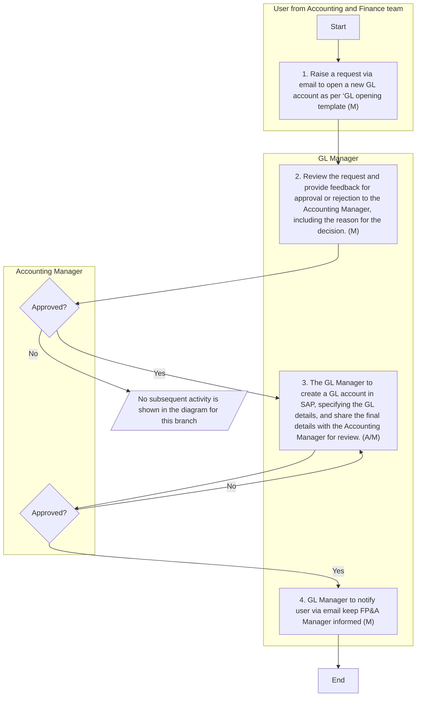
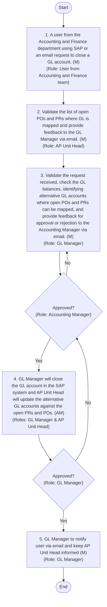
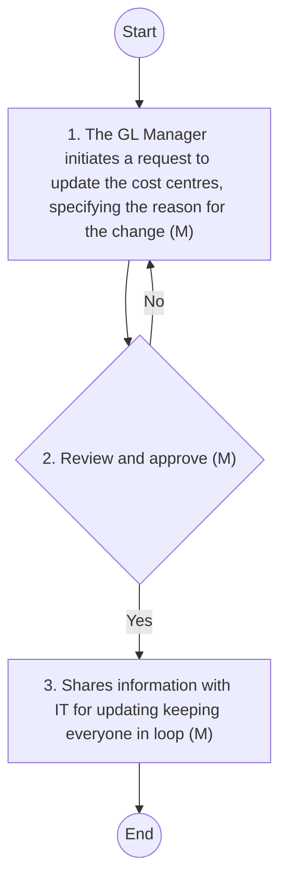

# Accounting Policies and Procedures
## GENERAL LEDGER AND CHART OF ACCOUNTS

Overview
A General Ledger (GL) is a comprehensive record of a Company's financial transactions over the life of the organisation. It includes all the accounts used to record the company's financial transactions, such as assets, liabilities, equity, revenues, and expenses. The GL balance will be used for the preparation of financial statements. Following are the classification used in the Company (GL Code range from 100000-499999 and from 900000-999999):

| Category | Classification | Description |
| --- | --- | --- |
| **Statement of** • Financial Position | Asset | • Six-digit GL code starting from 1 and 2 (example: 120100, 211306 etc.) . • Assets code begin with 1, • Liability code begin with 21 ; and • Equity code begins with 22. |
| **Statement of** • Financial Position | Liability | • Six-digit GL code starting from 1 and 2 (example: 120100, 211306 etc.) . • Assets code begin with 1, • Liability code begin with 21 ; and • Equity code begins with 22. |
| **Statement of** • Financial Position | Equity | • Six-digit GL code starting from 1 and 2 (example: 120100, 211306 etc.) . • Assets code begin with 1, • Liability code begin with 21 ; and • Equity code begins with 22. |
| **Statement of** • Profit or Loss | Revenue | • Six-digit GL code starting from 3 , 4 and 9. (example: 310101, 411101 , 910101, 920100 etc.) . • A ll expense GL code begins with 3 and 9 ; • GL code starting with 9 represent costs that need to be allocated across other GL accounts (example: water cost, labour cost etc etc.). The total balance of these GL accounts should always be zero by the end of the period. This includes Water Cost, Overhead Cost, Machine cost, Labour cost. • A ll revenue (including other income) and rebate on revenue GL code begins with 4 . |
| **Statement of** • Profit or Loss | Expens e | • Six-digit GL code starting from 3 , 4 and 9. (example: 310101, 411101 , 910101, 920100 etc.) . • A ll expense GL code begins with 3 and 9 ; • GL code starting with 9 represent costs that need to be allocated across other GL accounts (example: water cost, labour cost etc etc.). The total balance of these GL accounts should always be zero by the end of the period. This includes Water Cost, Overhead Cost, Machine cost, Labour cost. • A ll revenue (including other income) and rebate on revenue GL code begins with 4 . |

The Chart of Accounts (COA) is a structured list of all General Ledger (GL) accounts, categorised into Assets, Liabilities, Equity, Revenue, and Expenditure. Additionally, it includes other codes such as Company Code, Location Code, Department Code, Profit Centres, and Cost Centres.

| S No. | Segment | Code details |  |
| --- | --- | --- | --- |
| 1 | Company code | Company code is 20 |  |
| 2 | Location code | There are 4 locations in the Company |  |
|  | Head O ffice | Code consists of ‘00’ |  |
|  | Riyadh | Code consists of ‘10’ |  |
|  | Hail | Code consists of ‘20’ |  |
|  | Jizan | Code consists of ‘30’ |  |
| 3 | Department code | There are three department code as follows: |  |
|  | Production | Code starting with 20 |  |
|  | Sales and marketing | Code starting with 30 |  |
|  | Administration | Code starting with 50 |  |
| 4 | GL Number | GL Code range from 100000-499999 and from 900000-999999 |  |
| 4 | GL Number | Assets | Six-digit GL code starting from 1 and 2. |
| 4 | GL Number | Liabilities | Six-digit GL code starting from 1 and 2. |
| 4 | GL Number | Equity | Six-digit GL code starting from 1 and 2. |
| 4 | GL Number | Revenue | Six-digit GL code starting from 3, 4, and 9. |
| 4 | GL Number | Expenditure | Six-digit GL code starting from 3, 4, and 9. |
| 4 | Profit centers | • Profit centres are a combination of the company code and the location code. Revenue is mapped to these profit centres to ensure accurate financial tracking and reporting. There are four profit centres within the company: • 2000; • 2010; • 2020; and • 2030. |  |
| 5 | Cost centers | • Cost centres are designated areas within the company where costs are accumulated and managed. Cost centres are applicable exclusively to costs , encompassing both expenses and assets to be purchased. These include routine operational expenses and capital expenditures. Routine costs refer to day-to-day expenses such as salaries, utilities, maintenance , cost of purchase (inventory) , while capital costs pertain to long-term assets like property, plant, and equipment. • Each cost centre is identified by a unique 10-digit code which is configured within SAP . The structure of this code is as follows: • The first two digits represent the department code. • The next two digits represent the location code. • The final six digits are random numbers representing the specific cost. |  |

Following are the policies and procedures required for opening and closing of GL account and update in COA:
#### Opening of GL Account
Policy:
 Arabian Mills adheres to a structured approach for opening GL accounts.
 Assessment and approval: A new GL account shall be created only when an existing GL account cannot be used for the request. Finance team assess the necessity for new GL accounts based on business requirements. Approval from both the GL Manager and the Accounting Manager is mandatory before any new GL account can be created.
 Request for opening GL Account: A formal request must be submitted in the prescribed format, detailing the purpose and intended usage of the new GL account. The request must align with the existing chart of accounts to ensure consistency in financial reporting.
 Review and Approval Timeline: The review and approval process for opening a new GL account shall be completed within two working days from the date of submission to ensure timely processing.
 GL number: Upon approval, GL account is created in the SAP system using established coding structure.
Procedure
The following accounting procedures shall be followed:

| S No. | Procedure description | Responsibility | Fre que n c y |
| --- | --- | --- | --- |
| 1 | **Request Initiation:** • A user from A ccounting and Finance department fills a ‘GL opening form ’ to open a new GL account as per containing the following minimum requirement and share it over email with GL and Accounting Manager : • Date of request • Objectives of opening GL • Proposed GL name and sub-GL name • Proposed BS or SPL mapping • Proposed sub-classification in BS / SPL • Reason why new GL is required (specifying why it cannot be mapped to existing GL) • Any additional fields as deemed relevant. | Preparer: User from Accounting and Finance team | Frequency: As and when required |
| 2 | **Request review :** • Upon receiving the request from the user, the GL Manager reviews the request and provides feedback (for approval or rejection) on the request, which is then directed to the Accounting Manager. Based on the feedback from the GL Manager, the Accounting Manager approves or rejects the request. | **Reviewer: GL Manager** • Approver: Accounting Manager | Timeline : Within 1 day of receipt of the request |
| 3 | **GL creation in SAP** • On approval , the Accounting Manager notifies the GL Manager to create the GL account. The GL Manager create s a GL account in SAP, specifying GL classifications (i.e., assets, liabilities, equity, revenue, or expense), GL description, sub-GL details, etc. Once a GL account is created, a unique GL code is generated within SAP. • After the creation of the GL account, the GL Manager provides the following details in the email , which is directed to the Accounting Manager for final review: • GL & s ub-GL name • GL & sub-GL number • GL descriptions • Effective date of use • Based on the review in SAP, the Accounting Manager to provide final approval via email . | **Preparer: GL Manager** • Reviewer & approver: Accounting Manager | Timeline : Within 1 day from the date of approval |
| 4 | **Notification to stakeholders** • The GL Manager informs the user, keeping the FP&A Manager in the loop, and provides details or reasons for rejection. | **Informed by : GL Manager** • Informed to : • User and FP &A Manager | Frequency: U pon approval or rejection of the request |

Flow Chart:

**[Diagram — PNG]:**

Opening of GL Accounts

**Roles / Swimlanes**

- User from Accounting and Finance team  
- GL Manager  
- Accounting Manager  

---

### Steps

| Step # | Role                                  | Action                                                                                                                                                 | Decision/Next Step                                                                                          |
|--------|---------------------------------------|--------------------------------------------------------------------------------------------------------------------------------------------------------|-------------------------------------------------------------------------------------------------------------|
| 0      | User from Accounting and Finance team | **Start**                                                                                                                                                | Proceeds to Step 1                                                                                          |
| 1      | User from Accounting and Finance team | Raise a request via email to open a new GL account as per ‘GL opening template (M)                                                                     | Proceeds to Step 2                                                                                          |
| 2      | GL Manager                            | Review the request and provide feedback for approval or rejection to the Accounting Manager, including the reason for the decision. (M)               | Proceeds to Decision D1                                                                                     |
| D1     | Accounting Manager                    | **Decision:** Approved?                                                                                                                                | Yes → Step 3; No → (No subsequent activity is shown in the provided diagram for this branch)               |
| 3      | GL Manager                            | The GL Manager to create a GL account in SAP, specifying the GL details, and share the final details with the Accounting Manager for review. (A/M)   | Proceeds to Decision D2                                                                                     |
| D2     | Accounting Manager                    | **Decision:** Approved?                                                                                                                                | Yes → Step 4; No → Step 3 (loop back to GL Manager to recreate/adjust and reshare GL account details)      |
| 4      | GL Manager                            | GL Manager to notify user via email keep FP&A Manager informed (M)                                                                                    | Proceeds to Step 5                                                                                          |
| 5      | —                                     | **End**                                                                                                                                                 | —                                                                                                           |

---

### Mermaid.js diagram

#### Closing/deactivation of GL account
Policy
 At Arabian Mills, the closure of a GL account is governed by a structured policy to ensure financial accuracy and compliance.
 GL Balance verification: A GL account shall only be closed if its balance is nil.
 Open PO and PR associated with GL: Any open Purchase Orders (PO) or Purchase Requisitions (PR) associated with the GL account must be reassigned to an alternate GL account to maintain continuity in financial operations.
 Formal Closure Request: A formal closure request must be submitted to the GL Manager and Accounting Manager, detailing the rationale for the account closure and confirming the completion of all related financial activities. The request must include verification that all transactions have been settled and that the account balance is zero.
 Approval requirement: Approval from both the GL Manager and the Accounting Manager is mandatory before any GL account can be deactivated in SAP.
 Timeline: The review and approval process for closing a GL account shall be completed within two working days from the date of submission to ensure timely processing.
 Deactivation: Upon approval, the GL account shall be deactivated in the accounting system to prevent any further transactions.
Procedure
The following accounting procedures shall be followed:

| S No. | Procedure description | Responsibility | Frequency |
| --- | --- | --- | --- |
| 1 | • Request for closure of a GL account can be done in two ways : request initiation and internal review. • Request Initiation : A user from the Accounting and Finance department using SAP sends an email to the GL Manager, AP Unit Head , and Accounting Manager. The email specifies the requirement, reason for closure, details of the existing account, and any necessary balance transfer to another GL account. • Internal Review : The GL Manager conducts a monthly assessment of GL accounts to determine if any need closing. If a redundant account is identified and has not been used for a reasonable period, the GL Manager informs the Accounting Manager to initiate its closure. | **Preparer: User from Accounting and F i nance team** • Monitored by: GL Manager | **Frequency: As and when required** • Frequency: Monthly |
| 2 | **Request review & approval :** • Upon receiving the form from the user containing details of GL , the AP Unit Head validates the list of open PR and PO where the GL is mapped and provides feedback to the GL Manager via email. • Upon receiving feedback from the FP&A Manager, the GL Manager validates the request received, checks the GL balance, identifies alternative GL accounts where open POs and PRs can be mapped, and provides feedback for approval or rejection to the Accounting Manager via email. • Based on the feedback from the GL Manager, the Accounting Manager approves or rejects the request via email, keeping the CFO in loop . | **Reviewer 1: AP Unit Head** • Reviewer 2 : GL Manager • Approver : Accounting Manager • Informed : CFO | Timeline : Within 1 day of receipt of the request |
| 3 | **Deactivation in SAP:** • On approval , the GL Manager closes the GL account in the SAP system and the AP Unit Head updates the alternative GL account against the open PRs and POs and inform s the Accounting Manager . | **Performed by : GL Manager and AP Unit Head** • Reviewer & approver: Accounting Manager | Timeline : Within 1 day from the date of approval |
| 4 | **Notification to stakeholders** • The GL Manager responds to the user via specifying the GL account closure or reason for the rejection. | Email by: GL Manager | Frequency: Immediately upon final approval of the GL account creation or rejection of the request |

Flow Chart:

**[Diagram — Visio-EMF→PNG]:**

**Process Name:** Closing/Deactivating of GL Accounts  

**Roles / Swimlanes:**
- User from Accounting and Finance team
- AP Unit Head
- GL Manager
- Accounting Manager

---

### Steps

| Step # | Role | Action | Decision/Next Step |
|--------|------|--------|--------------------|
| 0 | User from Accounting and Finance team | **Start** | Proceeds to Step 1 |
| 1 | User from Accounting and Finance team | 1. A user from the Accounting and Finance department using SAP or an email request to close a GL account. (M) | Proceeds to Step 2 |
| 2 | AP Unit Head | 2. Validate the list of open POs and PRs where GL is mapped and provide feedback to the GL Manager via email. (M) | Proceeds to Step 3 |
| 3 | GL Manager | 3. Validate the request received, check the GL balances, identifying alternative GL accounts where open POs and PRs can be mapped, and provide feedback for approval or rejection to the Accounting Manager via email. (M) | Proceeds to Decision D1 |
| D1 | Accounting Manager | **Approved?** | If **Yes** → Step 4. If **No** → back to Step 3 (request to re‑validate / reconsider) |
| 4 | GL Manager (and AP Unit Head) | 4. GL Manager will close the GL account in the SAP system and AP Unit Head will update the alternative GL accounts against the open PRs and POs. (AM) | Proceeds to Decision D2 |
| D2 | GL Manager | **Approved?** | If **Yes** → Step 5. If **No** → back to Decision D1 for further review/approval |
| 5 | GL Manager | 5. GL Manager to notify user via email and keep AP Unit Head informed (M) | Proceeds to Step 6 |
| 6 | — | **End** | — |

---

### Mermaid.js flow

#### Update in Chart of Accounts
Policy
 No modifications or additions shall be made to any COA without prior written approval from the Accounting Manager, FP&A Manager, CFO and/or IT team.
 Any request for an update in the COA must clearly define the business justification, intended use, and applicable mapping to financial statements or management reports.
 All changes to the COA must be documented, version-controlled, and retained in the master COA log with effective date and responsible approver details.
 Deactivation of any existing COA element is only permitted after ensuring that there are no open transactions, balances, or reporting dependencies linked to that element.
 Changes to the COA that impact external financial reporting must be reviewed for compliance with IFRS endorsed by SOCPA.
Procedure
The following accounting procedures shall be followed:

| S No. | Procedure description | Responsibility | Description |
| --- | --- | --- | --- |
| 1 | **Request for change in cost center :** • The GL Manager initiates a request to update the cost centres, specifying the reason for the change. • The Accounting Manager and FP&A Manager provides feedback on the request initiated by the GL Manager for updating the cost centre, keeping the CFO in the loop. • Upon approval, the GL Manager updates the cost centres in SAP , and the Accounting Manager reviews the changes. | **Preparer: GL Manager** • Reviewer and approver : Accounting Manager and FP&A Manager • Informed: CFO | Frequency: Whenever there is a requirement |
| 2 | **Monitoring of GL account, Cost Centers :** • The Accounting Manager and FP&A Manager regularly reconciles GL account and cost centre master data on a monthly basis, ensuring that any new GL accounts and cost centres are established based on requests received during the month. | **Monitored by :** • Accounting Manager and FP&A Manager | Frequency: Monthly |
| 3 | **Request for new location** • The GL Manager or Accounting Manager initiates a request for the creation of a new location to IT after obtaining approval from the CFO for creating a new location, if any, based on business decisions , keeping FP&A Manager informed . The IT team initiates the process for adding the new location. | • Request initiated by : Accounting team approved by CFO . • Informed: FP&A Manager • Created by : IT team | Frequency: Whenever there is a new location |

Flow Chart

**[Diagram — PNG]:**

**Process Name:** Update COA  

**Roles / Swimlanes:**
- GL Manager  
- Accounting Manager and FP&A Manager  

---

### Steps

| Step # | Role                                   | Action                                                                                                 | Decision/Next Step                                                                                               |
|--------|----------------------------------------|--------------------------------------------------------------------------------------------------------|------------------------------------------------------------------------------------------------------------------|
| 0      | GL Manager                             | Start                                                                                                  | Proceed to step 1                                                                                                |
| 1      | GL Manager                             | 1. The GL Manager initiates a request to update the cost centres, specifying the reason for the change (M) | Send request to Accounting Manager and FP&A Manager for review and approval (step 2). If not approved, return here from step 2 via “No”. |
| 2      | Accounting Manager and FP&A Manager    | 2. Review and approve (M)                                                                              | **Yes:** If approved, proceed to step 3. **No:** Return to step 1.                                              |
| 3      | GL Manager                             | 3. Shares information with IT for updating keeping everyone in loop (M)                                | Proceed to step 4                                                                                                |
| 4      | GL Manager                             | End                                                                                                    | Process terminates                                                                                               |

**Branching logic:**
- From step 2 (“Review and approve (M)”):  
  - **Yes** → step 3 (“Shares information with IT for updating keeping everyone in loop (M)”)  
  - **No** → back to step 1 (“The GL Manager initiates a request to update the cost centres, specifying the reason for the change (M)”)

---

