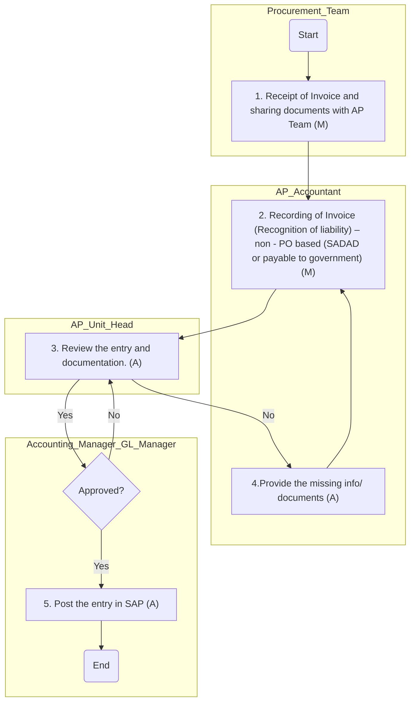
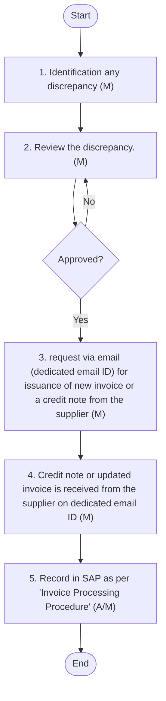

## ACCOUNTS PAYABLE AND ACCRUALS

Overview
Accounts Payable (AP) is a critical function within the accounting department that manages the Company's obligations to pay off short-term debts to its creditors or suppliers. Efficient management of accounts payable ensures that the company maintains good relationships with its suppliers, avoids late payment penalties, and accurately reflects its financial position in the financial statements. This policy governs the entire lifecycle of payables, including invoice receiving, processing, confirmation, and reconciliation. This manual encompasses various aspects of accounts payable and accruals, including:
 PO-Based Invoice Processing: Purchase Order (PO)-based invoice processing involves verifying invoices against purchase orders and goods receipt notes to ensure accuracy before payment. This process ensures that payments are made only for goods and services that have been received and approved.
 Non-PO-Based Invoice Processing: This involves checking and approving invoices without a purchase order, ensuring payments are made correctly for goods or services received, based on the invoice details.
 Issuance of Debit Note / Receipt of Credit Note: Debit notes are issued to suppliers for returned goods or services, while credit notes are received from suppliers for adjustments or corrections in invoicing. This process ensures accurate accounting and reconciliation of supplier accounts.
 Creditors Ageing: Creditors ageing involves analysing the outstanding balances owed to suppliers, categorised by the length of time they have been outstanding, credit terms, and invoice date. This process helps in managing payment schedules and maintaining good relationships with suppliers.
 GR IR Reconciliation: Goods Receipt/Invoice Receipt (GR IR) reconciliation involves matching goods received with invoices received to ensure that all goods have been invoiced correctly. This process helps in identifying discrepancies and ensuring accurate accounting.
 Payable Reconciliation and Balance Confirmation: Payable reconciliation involves verifying the accuracy of accounts payable balances by comparing internal records with supplier statements. Balance confirmations are obtained from suppliers to ensure that the recorded balances are accurate and agreed upon.
 Accrual Management – Non-PO-Based Approvals: Non-PO-based accrual management involves recognising expenses that have been incurred but not yet invoiced, based on internal approvals. This ensures that financial statements accurately reflect the company's liabilities for services or goods received without a purchase order.
 Accrual Management – PO-Based Accruals: PO-based accrual management involves recognising expenses that have been incurred but not yet invoiced, where the purchase order is still under the approval stage, but the service has been either fully or partially availed. This process ensures that financial statements accurately reflect the company's liabilities related to purchase orders in progress.
#### PO based invoice processing
Policy
 All goods and services must be procured through approved POs unless explicitly exempted (refer to non-PO-based invoice processing).
 The generation of POs is conducted in accordance with the Supply Chain (SC) policy, ensuring alignment with procurement standards.
 Suppliers are required to send invoices to a dedicated email ID accessible by both the procurement and AP departments. All invoices received require validation by the Procurement team and user department before processing by the accounting department.
 All accounting entries related to invoice processing shall be parked by one personnel (AP team) and posted in SAP once approved by another personnel (final approver) via workflow.
 Processing time for PO-based invoices shall not exceed 3 working days from the date of receipt of the invoice.
Procedure
The following accounting procedures shall be followed:

| S No. | Procedure description | Responsibility | Frequency |
| --- | --- | --- | --- |
| 1 | **Generation of PO**<br>• Refer S upply C hain (SC) policy and procedure document for generation of PO. | Refer SC P&P |  |
| 2 | **Receipt of goods/service**<br>• Once goods are procured or services are availed, the receiving department user generates a Goods/Service Receipt Note (GSRN) in SAP according to SC policy and procedure.<br>• The system automatically records the following entry in SAP at the time of generation of the Goods Receipt/Service Receipt Note (GSRN):<br>• Inventory a/c OR Expense a/c     Dr.   xx<br>• GR/IR                                        Cr.   xx | Refer SC P&P |  |
| 3 | **Receipt of invoice and sharing documents with AP Team**<br>• Suppliers send invoices to a dedicated email ID accessible by the procurement and AP departments. The procurement team validates the invoice, obtains approval from the user department, and provides the approved PO, GSRN, and invoice to the AP team digitally for processing. | **Documents received by: Procurement and AP Team**<br>• Documents to be shared by : Procurement Team | Frequency: 2 day s from the date of receipt of invoice |
| 4 | **Recording of invoice (Recognition of liability) – PO based**<br>• Upon receiving the digital copy of the approved invoice, PO, GSRN, and other documents, the AP Accountant parks the auto-generated entry in the system within 1 working day from the date of receipt of documents from the procurement team. The AP Unit Head reviews this entry, and the GL Manager/Accounting Manager approve it. On approval (via workflow), the system posts the entry in SAP.<br>• GR/IR                             Dr.   xx<br>• VAT                               Dr.   xx<br>• Supplier account             Cr.   xx<br>• In SAP, the total invoice amount cannot exceed the PO value and is only processed if it matches the GSRN. VAT entries are generated based on predefined codes and are validated by the Tax Manager or Tax consultants. | **Preparer: AP Accountant**<br>• Reviewer: AP Unit Head<br>• Reviewer: GL Manager or Accounting Manager | Frequency: 1 day from the date of receipt of documents |
| 5 | **Payment of Liability**<br>• Refer PO based and non-PO based payment under ‘Cash Management’ for details | Refer section ‘Cash Management’ in this manual |  |

Flow Chart:

**[Diagram — PNG]:**

**Process Name**

PO based invoice processing and payment

---

**Roles / Swimlanes**

- Supply Chain Team  
- Procurement Team  
- AP Accountant  
- AP Unit Head  
- Accounting Manager / GL Manager  

---

### Steps

| Step # | Role                         | Action                                                                                                                | Decision/Next Step                                                                                                                                                 |
|--------|------------------------------|------------------------------------------------------------------------------------------------------------------------|--------------------------------------------------------------------------------------------------------------------------------------------------------------------|
| 1      | Supply Chain Team            | Start                                                                                                                 | Proceeds to “Generation of PO”.                                                                                                                                    |
| 2      | Supply Chain Team            | Generation of PO                                                                                                      | Proceeds to “Receipt of goods/ services (System generated entry for GR/IR)”.                                                                                       |
| 3      | Supply Chain Team            | Receipt of goods/ services (System generated entry for GR/IR)                                                         | Proceeds to “1. Receipt of invoice on dedicated email ID; and sharing all approved documents with AP Team (M)”.                                                   |
| 4      | Procurement Team             | 1. Receipt of invoice on dedicated email ID; and sharing all approved documents with AP Team (M)                      | Proceeds to “2. Recording of Invoice (Recognition of liability) – PO based (A)”.                                                                                   |
| 5      | AP Accountant                | 2. Recording of Invoice (Recognition of liability) – PO based (A)                                                     | Proceeds to “3. Review the entry and documentation. (A)”.                                                                                                          |
| 6      | AP Unit Head                 | 3. Review the entry and documentation. (A)                                                                            | Proceeds to decision “Approved?” handled by Accounting Manager / GL Manager.                                                                                       |
| 7      | Accounting Manager / GL Manager | Approved?                                                                                                              | **Yes:** Proceeds to “5. The entry get posted in SAP once approved (A)”.  **No:** Proceeds to “4.Provide the missing info/ documents (A)”.                         |
| 8      | AP Accountant                | 4.Provide the missing info/ documents (A)                                                                             | Returns to “2. Recording of Invoice (Recognition of liability) – PO based (A)” for re-recording and then back through review and approval.                        |
| 9      | Accounting Manager / GL Manager | 5. The entry get posted in SAP once approved (A)                                                                      | Proceeds to “End”.                                                                                                                                                 |
| 10     | Accounting Manager / GL Manager | End                                                                                                                   | Process terminates.                                                                                                                                                |

---

### Explicit Yes/No Branches from “Approved?”

- From **“Approved?” (Accounting Manager / GL Manager)**  
  - **Yes** → “5. The entry get posted in SAP once approved (A)” → “End”.  
  - **No** → “4.Provide the missing info/ documents (A)” → back to “2. Recording of Invoice (Recognition of liability) – PO based (A)” and then re-review and re-approval.

---

```mermaid
graph TD

A[Start] --> B[Generation of PO]
B --> C[Receipt of goods/ services<br/>(System generated entry for GR/IR)]
C --> D[1. Receipt of invoice on dedicated email ID; and sharing all approved documents with AP Team (M)]
D --> E[2. Recording of Invoice (Recognition of liability) – PO based (A)]
E --> F[3. Review the entry and documentation. (A)]
F --> G{Approved?}
G -- Yes --> H[5. The entry get posted in SAP once approved (A)]
H --> I[End]
G -- No --> J[4.Provide the missing info/ documents (A)]
J --> E
```

#### Non-PO based invoice processing
Policy
 At Arabian Mills, non-PO-based invoicing is permitted only for predefined categories of expenses where purchase orders are not practical or applicable i.e., utilities, government fees, petty expenses, statutory dues or similar expenses.
 Under no circumstances shall material purchases of goods or capital expenditure be processed through non-PO invoicing; such invoices must be rejected or routed through proper procurement channels.
 Suppliers are required to send invoices to a dedicated email ID accessible by both the procurement and AP departments. All invoices received require validation by the Procurement team and user department before processing by the accounting department.
 All non-PO invoices must be supported by appropriate documentation, including departmental authorization, prior to accounting recognition. Processing time for non-PO based invoices shall not exceed 3 working days from the date of receipt of the invoice.
 All accounting entries related to invoice processing shall be parked by one personnel (AP team) and posted in SAP once approved by another personnel (final approver) via workflow.
 The payment of non-PO-based liabilities is managed under the Cash Management section.
Procedure
The following accounting procedures shall be followed:

| S No. | Procedure description | Responsibility | Frequency |
| --- | --- | --- | --- |
| 1 | **Receipt of invoice and sharing documents with AP Team**<br>• All suppliers must send invoices to a dedicated email ID accessible by procurement and AP departments. The procurement team validates the invoice, obtains approval from the user department, and shares all documents with the AP team for processing. | **Documents received by: Procurement and AP Team**<br>• Documents to be shared by: Procurement Team | Frequency: 2 day s from the date of receipt of invoice |
| 2 | • Recording of invoice / recognition of liability – non-PO based (SADAD or payable to government)<br>• Upon receiving the copy of the approved invoice and other documents, the AP Accountant validates the documents and, post-validation, parks the entry in SAP. The AP Unit Head reviews this entry, and the GL Manager/Accounting Manager approve it. On approval , the system posts the entry in SAP (via workflow).<br>• Expense                             Dr.   xx<br>• VAT                                   Dr.   xx<br>• Supplier account                Cr.   xx<br>• The Tax Manager or consultants validate VAT entries, which are generated based on predefined codes. | **Preparer: AP Accountant**<br>• Reviewer: AP Unit Head<br>• Reviewer: GL Manager or Accounting Manager | Frequency: 1 day from the date of receipt of documents |
| 3 | **Payment of Liability**<br>• Refer PO based and non-PO based payment under Cash Management for details |  |  |

Flow Chart:

**[Diagram — PNG]:**

**Process Name:**  
NON - PO based invoice processing and payment

**Roles / Swimlanes:**

- Procurement Team
- AP Accountant
- AP Unit Head
- Accounting Manager / GL Manager

---

### Steps

| Step # | Role                             | Action                                                                                                           | Decision/Next Step                                                                                                                                                  |
|--------|----------------------------------|------------------------------------------------------------------------------------------------------------------|---------------------------------------------------------------------------------------------------------------------------------------------------------------------|
| 0      | Procurement Team                 | Start                                                                                                            | Proceed to step 1.                                                                                                                                                   |
| 1      | Procurement Team                 | **1. Receipt of Invoice and sharing documents with AP Team (M)**                                                | Proceed to step 2.                                                                                                                                                   |
| 2      | AP Accountant                    | **2. Recording of Invoice (Recognition of liability) – non - PO based (SADAD or payable to government) (M)**    | Proceed to step 3.                                                                                                                                                   |
| 3      | AP Unit Head                     | **3. Review the entry and documentation. (A)**                                                                   | If **Yes** (entry and documentation acceptable) → step 5 “Approved?”. If **No** → step 4 “4.Provide the missing info/ documents (A)”.                               |
| 4      | AP Accountant                    | **4.Provide the missing info/ documents (A)**                                                                    | After providing missing information/documents, proceed back to step 2 “2. Recording of Invoice (Recognition of liability) – non - PO based (SADAD or payable to government) (M)”. |
| 5      | Accounting Manager / GL Manager  | **Approved?**                                                                                                    | If **Yes** → step 6 “5. Post the entry in SAP (A)”. If **No** → return to step 3 “3. Review the entry and documentation. (A)”.                                      |
| 6      | Accounting Manager / GL Manager  | **5. Post the entry in SAP (A)**                                                                                | Proceed to step 7.                                                                                                                                                   |
| 7      | Accounting Manager / GL Manager  | End                                                                                                              | Process complete.                                                                                                                                                    |

---

### Yes/No Branches (Explicit)

- From step 3 “3. Review the entry and documentation. (A)”:
  - **Yes** → step 5 “Approved?”
  - **No** → step 4 “4.Provide the missing info/ documents (A)”

- From step 5 “Approved?”:
  - **Yes** → step 6 “5. Post the entry in SAP (A)” → step 7 “End”
  - **No** → back to step 3 “3. Review the entry and documentation. (A)”

---

### Mermaid.js Flow



#### Issuance of debit note / receipt of credit note
Policy
 All credit notes received from suppliers must relate to previously invoiced transactions and reference the original invoice number and PO (if applicable).
 Credit notes are accepted only for valid reasons, such as goods returned, pricing errors, quantity discrepancies, or service deficiencies, supported by adequate documentation.
 Credit notes must be approved by the Procurement and relevant business unit before being recorded in SAP.
 Offsetting of credit notes against future invoices is permitted only upon verification and alignment with supplier account reconciliation.
 Any credit note affecting prior reporting periods must be evaluated for materiality and disclosure in line with IFRS.
 Unjustified or unsupported credit notes must be rejected and escalated to Procurement or Legal for resolution.
 All credit notes must be recorded in the period in which they are received and must not be backdated or used to manipulate expense recognition.
Procedure
The following accounting procedures shall be followed:

| S No. | Procedure description | Responsibility | Frequency |
| --- | --- | --- | --- |
| 1 | **Identification of discrepancy**<br>• If a discrepancy is identified in invoice of the supplier ( eg: amount of invoice , description of service) , the AP Accountant discusses this with the AP Unit Head and obtains approval from the Accounting Manager and the respective department head. Discrepancies can be identified by comparing the invoice received, approved PO, contract signed, GSRN, and other relevant documents. | **Preparer: AP Accountant**<br>• Reviewer: AP Unit Head<br>• Approver: Accounting M anager and respective Department Head | Frequency: If any discrepancy noticed |
| 2 | **D ebit / credit note**<br>• When a discrepancy is identified, the AP team (AP Accountant/AP Unit Head) requests for the issuance of a new invoice or a credit note from the supplier, keeping the Accounting Manager informed. | **Email by : AP team**<br>• Informed: Accounting Manager | Frequency: 1 day from the date of approval discrepancy identified |
| 3 | **Receipt of credit note from the supplier**<br>• Once the credit note or updated invoice is received from the supplier on the dedicated email ID, the procurement team validates it and the AP team records it in SAP as per the ‘Invoice Processing Procedure’. | Receipt by : Procurement and AP team | Frequency: After receipt of c redit note / updated invoice |

Flow Chart

**[Diagram — PNG]:**

**Process Name:** Issuance of debit note / receipt of credit note  

**Roles / Swimlanes:**
- Procurement Team
- AP Accountant
- AP Unit Head
- Accounting Manager / GL Manager

---

### Steps

| Step # | Role                          | Action                                                                                                                                                | Decision/Next Step                                                                                                      |
|--------|-------------------------------|-------------------------------------------------------------------------------------------------------------------------------------------------------|-------------------------------------------------------------------------------------------------------------------------|
| 0      | Procurement Team              | Start                                                                                                                                                 | Next: Step 1.                                                                                                           |
| 1      | AP Accountant                 | 1. Identification any discrepancy (M)                                                                                                                 | Next: Step 2.                                                                                                           |
| 2      | AP Unit Head                  | 2. Review the discrepancy. (M)                                                                                                                       | Next: Step 3 (“Approved?” decision).                                                                                     |
| 3      | Accounting Manager / GL Manager | Approved?                                                                                                                                             | If Yes: proceed to Step 4. If No: return to Step 2 (“2. Review the discrepancy. (M)”).                                  |
| 4      | AP Unit Head                  | 3. request via email (dedicated email ID) for issuance of new invoice or a credit note from the supplier (M)                                         | Next: Step 5.                                                                                                           |
| 5      | Procurement Team              | 4. Credit note or updated invoice is received from the supplier on dedicated email ID (M)                                                            | Next: Step 6.                                                                                                           |
| 6      | AP Accountant                 | 5. Record in SAP as per ‘Invoice Processing Procedure’ (A/M)                                                                                         | Next: Step 7 (End).                                                                                                     |
| 7      | AP Accountant                 | End                                                                                                                                                   | Process ends.                                                                                                           |

**Explicit Yes/No Branches from Decision “Approved?” (Step 3):**

- **Yes** → Step 4: “3. request via email (dedicated email ID) for issuance of new invoice or a credit note from the supplier (M)”.
- **No** → back to Step 2: “2. Review the discrepancy. (M)”.

---



#### Creditors ageing
Policy
 Creditors ageing must be prepared and reviewed weekly to ensure timely identification of overdue liabilities.
 Ageing must be prepared from due date of payment.
 Ageing reports classify balances by due dates and supplier categories in alignment with payment terms.
 Balances under dispute or litigation must be separately disclosed and not considered due for payment.
 Unreconciled or long-outstanding balances must be assessed for write-back or provision in line with IFRS.
 The ageing report must be reconciled with the general ledger and supplier statements regularly.
 Any payable balances outstanding for more than 30 days must be discussed with the CFO to determine appropriate action.
Procedure
The following accounting procedures shall be followed:

| S No. | Procedure description | Responsibility | Frequency |
| --- | --- | --- | --- |
| 1 | **Ageing Report**<br>• The finance team utilises the ageing report generated directly by SAP to determine AP ageing.<br>• The report is automatically generated within SAP, ensuring efficiency and accuracy.<br>• On a weekly basis, the AP Accountant extracts the AP ageing report, which consists of supplier-wise and invoice-wise ageing.<br>• The AP Accountant shares the report with the AP Unit Head and Accounting Manager for review.<br>• The age of suppliers is generally within the due date or a maximum of one month from the due date. | **Preparer: AP Accountant**<br>• Reviewer: AP Unit Head and Accounting Manager<br>• Discussed: CFO | Frequency: Weekly |

Flow Chart

**[Diagram — PNG]:**

**Process Name:** Creditors Ageing

**Roles / Swimlanes:**

- SAP  
- AP Accountant  
- AP Unit Head/ Accounting Manager  
- CFO  

---

### Steps

| Step # | Role                               | Action                                                                                          | Decision/Next Step                                   |
|--------|------------------------------------|-------------------------------------------------------------------------------------------------|------------------------------------------------------|
| S0     | SAP                                | Start                                                                                           | Proceed to Step 1                                    |
| 1      | AP Accountant                      | Extract the AP ageing report, which consists of supplier-wise and invoice-wise ageing (A)      | Proceed to Step 2                                    |
| 2      | AP Unit Head/ Accounting Manager   | Review the report. (M)                                                                          | Proceed to Step 3                                    |
| 3      | CFO                                | Discuss the Payment decision if due date is exceed on month (M)                                | Proceed to Step E (End)                              |
| SE     | CFO                                | End                                                                                             | Process completed                                    |

*Note: No explicit Yes/No decision branches are depicted in the diagram; the flow is purely sequential as shown above.*

---

```mermaid
graph TD

    %% Roles as subgraphs (swimlane-style grouping)
    subgraph SAP
        S0((Start))
    end

    subgraph "AP Accountant"
        S1[1. Extract the AP ageing report, which consists of supplier-wise and invoice-wise ageing (A)]
    end

    subgraph "AP Unit Head/ Accounting Manager"
        S2[2. Review the report. (M)]
    end

    subgraph CFO
        S3[3. Discuss the Payment decision if due date is exceed on month (M)]
        SE((End))
    end

    S0 --> S1 --> S2 --> S3 --> SE
```

#### GR IR reconciliation
Policy
 At Arabian Mills, the GR/IR account is used exclusively for PO based services and goods received but not yet invoiced.
 GR/IR reconciliation is the joint responsibility of Finance and Procurement.
 Goods receipts must be recorded with reference to the Purchase Order (PO)
 GR/IR accounts must be reconciled monthly to identify unmatched goods receipts and invoices.
 GR/IR balances older than 30 days must be reviewed and cleared with Procurement and AP and escalated to the respective department heads for resolution.
 Significant variances must be disclosed in monthly closing notes to management.
Procedure
The following accounting procedures shall be followed:

| S No. | Procedure description | Responsibility | Frequency |
| --- | --- | --- | --- |
| 1 | **Extraction of GR IR report**<br>• The GL Manager extracts the GR/IR report from SAP, detailing supplier-wise and Goods/Service Receipt Note (GSRN) wise information . | Extracted by : GL Manager | Frequency: Monthly ( last week) |
| 2 | **Validation**<br>• The GL Manager validates the GR/IR balance on a monthly basis to ensure that quantities and prices match the purchase orders.<br>• The GL Manager notes any discrepancies for further investigation.<br>• Once validated, the GL Manager shares the report with the Accounting Manager for review of the final working.<br>• The report includes a detailed list of suppliers where invoices are due but not yet received.<br>• The GL Manager shares the approved final working with the AP Unit Head for further action | **Preparer: GL Manager**<br>• Reviewer: Accounting Manager<br>• Share with : AP Unit Head | Timeline : Within 1 day from review by Accounting Manager |
| 3 | **Follow-up with the Supplier**<br>• The AP Unit Head or AP Accountant follows up with the procurement department, who in turn follows up with relevant suppliers to expedite the receipt of outstanding invoices. This involves contacting suppliers to inquire about the status of pending invoices. Once the invoice is received and processed, the GR/IR balance reverses automatically as per invoice processing procedures. | Email by: AP Team (AP Unit Head or AP Accountant) | Frequency: Monthly (First week) |
| 4 | **Reviewing and clearing**<br>• GR/IR balances older than 30 days must be reviewed and cleared with Procurement and AP and escalated to the respective department heads for resolution.<br>• The AP Unit Head follows up on these balances, keeping the GL Manager, Accounting Manager and CFO in the loop.<br>• Department heads must arrange for the invoice to be provided within the next 5 working days. | **Email by: AP Unit Head**<br>• Informed: GL Manager, A ccounting Manager and CFO | Frequency: Monthly (First week) |

Flow Chart

**[Diagram — Visio-EMF→PNG]:**

**Process Name:** GR IR reconciliation  

**Roles / Swimlanes:**
- SAP  
- GL Manager  
- Accounting Manager  
- AP Unit Team  

### Steps

| Step # | Role             | Action | Decision/Next Step |
|--------|------------------|--------|--------------------|
| 0      | SAP              | Start | Proceeds to Step 1 |
| 1      | GL Manager       | Extract the GR/IR report from SAP, detailing supplier-wise and Goods/ Service Received Note (GRN) wise information. (A) | Proceeds to Step 2 |
| 2      | GL Manager       | Review validates the GR/IR balance on a monthly basis and shares the report with the Accounting Manager via e-mail for review of the final working. (M) | Proceeds to Step 3 |
| 3      | Accounting Manager | Review the final working and approve. (M) | Proceeds to Step 4 |
| 4      | AP Unit Team     | Follows up with the procurement department, which in turn follows up with relevant suppliers to expedite the receipt of outstanding invoices. Once the invoice is received and processed, the GR/IR balance is reversed automatically as per invoice processing procedures. (M) | Proceeds to Step 5 |
| 5      | AP Unit Team     | End | — |

### Mermaid.js Flow

```mermaid
graph TD

    A0([Start]):::sap

    A1["1. Extract the GR/IR report from SAP, detailing supplier-wise and Goods/ Service Received Note (GRN) wise information. (A)"]:::gl
    A2["2. Review validates the GR/IR balance on a monthly basis and shares the report with the Accounting Manager via e-mail for review of the final working. (M)"]:::gl

    A3["3. Review the final working and approve. (M)"]:::acctmgr

    A4["4. Follows up with the procurement department, which in turn follows up with relevant suppliers to expedite the receipt of outstanding invoices. Once the invoice is received and processed, the GR/IR balance is reversed automatically as per invoice processing procedures. (M)"]:::ap

    A5([End]):::ap

    A0 --> A1 --> A2 --> A3 --> A4 --> A5

    classDef sap fill=#ffffff,stroke=#000000,stroke-width=1px;
    classDef gl fill=#ffffff,stroke=#000000,stroke-width=1px;
    classDef acctmgr fill=#ffffff,stroke=#000000,stroke-width=1px;
    classDef ap fill=#ffffff,stroke=#000000,stroke-width=1px;
```

#### Balance confirmation and AP Reconciliation
Policy:
 At Arabian Mills, the reconciliation of payables and balance confirmation is performed as per following table:

| Process | Frequency |
| --- | --- |
| Balance Confirmation | Month-end, Quarter -end and year-end |
| AP Reconciliation | Monthly |

 Balance confirmation from key suppliers is mandatory. Key suppliers would include suppliers of raw material including major suppliers identified based on the judgement of the AP Unit Head, GL Manager, Accounting Manager and CFO, as of reporting date.
 Supplier ledgers must be reconciled monthly with external statements to ensure accuracy of payable balances.
 All differences arising from reconciliation must be investigated and corrected in the appropriate period.
 Non-responsive suppliers must be followed up at least twice before alternative audit evidence is used.
 Unauthorized manual adjustments in suppliers accounts are prohibited without documented approval.
 Payable reconciliations must be retained as part of period-end close documentation.
 Significant unresolved variances must be disclosed to auditors and management.
Procedure:
The following accounting procedures shall be followed:

| S No. | Procedure description | Responsibility | Frequency |
| --- | --- | --- | --- |
| 1 | **Balance confirmation - Listing**<br>• AP Unit Head prepares the list of suppliers as per the policy . Major suppliers are those providing raw materials or holding significant balances as of the reporting date, determined by the judgement of the AP Unit Head and the Accounting Manager & GL Manager, keeping the CFO in loop . | **Preparer: AP Unit Head**<br>• Reviewer & approval : Accounting Manager and GL Manager<br>• Informed: CFO | Frequency: Quarterly |
| 2 | **Balance confirmation - sharing**<br>• On approval of listing , the AP Accountant shares the balance confirmation, including the closing balance, to the Supplier, keeping the AP Unit Head, Accounting Manager, GL Manager, and CFO in loop . | **Preparer: AP Accountant**<br>• Informed : AP Unit Head , Accounting Manager , GL Manager, and CFO | Frequency: 1 day from the date of approval of listing |
| 3 | **Reconciliation**<br>• The AP team reconciles the supplier's statement of account with the SAP-generated statement to identify the cause. If the variance is due to an invoice issued by the supplier but not provided to Arabian Mills, it remains as a reconciled variance, with no adjustment recorded. If the received invoice contains errors, it is not recorded until the supplier provides a revised invoice or credit note. It remains as a reconciled variance, with no adjustment recorded. If the variance is due to an invoice shared with Arabian Mills but not recorded, the AP team validates the same. If the invoice was not recorded due to a genuine error, it is recorded in the correct period of the financial year by the AP team, as per the existing process, keeping the AP Unit Head, Accounting Manager, GL Manager, and CFO in loop. If the invoice received contains any error, it is not recorded unless a revised invoice or credit note is shared by the supplier, and it remains as a reconciled variance, with no adjustment recorded. Adjustment entry is system-generated; no manual entry is recorded here. | **Preparer: AP Accountant**<br>• Informed: AP Unit Head , Accounting Manager, GL Manager, and CFO | Frequency: 1 day from the date of receipt of balance confirmation |


| S No. | Procedure description | Responsibility | Frequency |
| --- | --- | --- | --- |
| 1 | **Payable Reconciliation**<br>• Following reconciliation to be performed further:<br>• GL and sub-ledger reconciliation:  The AP Accountant performs the reconciliation of GL and sub-ledger balances on a monthly basis. The AP Unit Head reviews this reconciliation, followed by a discussion and review & approval by the GL Manager/Accounting Manager, keeping the CFO informed.<br>• Reconciliation of invoice received on email: At the end of each month, the AP Accountant reviews all invoices received via email to ensure they are accurately recorded in SAP. The AP Unit Head reviews the reconciliation between the email records of received invoices and the entries in SAP to identify any discrepancies or missing invoices. Finally, the GL Manager/Accounting Manager approves the reconciliation, ensuring that any discrepancies, if identified, are investigated and resolved promptly, keeping the CFO in loop.<br>• In case of any variance, necessary adjustments are incorporated in the period when the same is identified. | **Preparer: AP Accountant**<br>• Reviewer: AP Unit Head<br>• Approver: GL Manager / Accounting Manager<br>• Informed: CFO | Frequency: Monthly (last two working days) |

Flow Chart

**[Diagram — PNG]:**

**Process Name:** Payable reconciliation  

**Roles / Swimlanes:**
- AP Accountant
- AP Unit Head
- GL Manager/ Accounting Manager  

---

### Steps

| Step # | Role                          | Action                                                                                                              | Decision / Next Step                                                                                                 |
|--------|-------------------------------|---------------------------------------------------------------------------------------------------------------------|----------------------------------------------------------------------------------------------------------------------|
| 1      | AP Accountant                 | Start                                                                                                               | Proceed to Step 2                                                                                                    |
| 2      | AP Accountant                 | 1. Reconciliation (a) GL and Sub-ledger and (b) Reconcile email received vs recorded in SAP (M)                    | Proceed to Step 3                                                                                                    |
| 3      | AP Unit Head                  | 2. Review reconciliation (M)                                                                                        | Proceed to Step 4                                                                                                    |
| 4      | GL Manager/ Accounting Manager | Approved?                                                                                                           | If **Yes** → Step 5. If **No** → return to Step 3 “2. Review reconciliation (M)”.                                   |
| 5      | GL Manager/ Accounting Manager | Share reconciliation with CFO to keep him informed and for discussion purpose (M)                                   | Proceed to Step 6                                                                                                    |
| 6      | GL Manager/ Accounting Manager | End                                                                                                                 | Process ends                                                                                                         |

**Yes/No branches explicitly:**
- From **“Approved?” (Step 4)**  
  - **Yes** → Step 5: “Share reconciliation with CFO to keep him informed and for discussion purpose (M)”  
  - **No** → Step 3: “2. Review reconciliation (M)”  

---

```mermaid
graph TD

    A[Start<br/>Role: AP Accountant] --> B[1. Reconciliation (a) GL and Sub-ledger and (b) Reconcile email received vs recorded in SAP (M)<br/>Role: AP Accountant]
    B --> C[2. Review reconciliation (M)<br/>Role: AP Unit Head]
    C --> D{Approved?<br/>Role: GL Manager/ Accounting Manager}
    D -- Yes --> E[Share reconciliation with CFO to keep him informed and for discussion purpose (M)<br/>Role: GL Manager/ Accounting Manager]
    E --> F[End<br/>Role: GL Manager/ Accounting Manager]
    D -- No --> C
```


**[Diagram — PNG]:**

**Process Name:** Balance Confirmation  

**Roles / Swimlanes:**

- AP Unit Head  
- Accounting Manager / GL Manager  
- AP Accountant  

---

### Steps

| Step # | Role                         | Action                                                                                                             | Decision / Next Step                                                                                           |
|--------|------------------------------|--------------------------------------------------------------------------------------------------------------------|-----------------------------------------------------------------------------------------------------------------|
| 1      | AP Unit Head                 | Start                                                                                                              | Proceeds to Step 2                                                                                              |
| 2      | AP Unit Head                 | 1. Create list of suppliers where confirmation will be shared (M)                                                 | Proceeds to Step 3                                                                                              |
| 3      | Accounting Manager / GL Manager | Approved?                                                                                                          | If **Yes** → Step 4. If **No** → back to Step 2 (1. Create list of suppliers where confirmation will be shared (M)) |
| 4      | AP Accountant                | Shares reconciliation with suppliers keeping the AP Unit Head, Accounting Manager, GL Manager, and CFO informed (M) | Proceeds to Step 5                                                                                              |
| 5      | AP Accountant                | After receiving balance confirmation, AP accountant to perform reconciliation (M)                                  | Proceeds to Step 6                                                                                              |
| 6      | Accounting Manager / GL Manager | Review reconciliation keeping CFO informed (M)                                                                     | Proceeds to Step 7                                                                                              |
| 7      | Accounting Manager / GL Manager | End                                                                                                                | Process terminates                                                                                              |

---

### Yes/No Branch Tracing

- From **Step 3 – Approved?**  
  - **Yes:** go to **Step 4** – Shares reconciliation with suppliers keeping the AP Unit Head, Accounting Manager, GL Manager, and CFO informed (M).  
  - **No:** return to **Step 2** – 1. Create list of suppliers where confirmation will be shared (M).

---

### Mermaid.js Flow

```mermaid
graph TD

    A[Start] --> B[1. Create list of suppliers where confirmation will be shared (M)]
    B --> C{Approved?}
    C -- Yes --> D[Shares reconciliation with suppliers keeping the AP Unit Head, Accounting Manager, GL Manager, and CFO informed (M)]
    C -- No --> B
    D --> E[After receiving balance confirmation, AP accountant to perform reconciliation (M)]
    E --> F[Review reconciliation keeping CFO informed (M)]
    F --> G[End]
```

#### Accrual Management – non-PO based approvals
Policy
 At Arabian Mills, the accruals for non-PO-based services are calculated monthly to ensure accurate financial reporting.
 All material expenses incurred but not invoiced by period-end must be accrued based on reliable estimates.
 Non-PO accruals must be supported by approved service confirmations, contractual terms, or consumption records.
 Accruals must be reversed in the subsequent period when the actual invoice is received.
 Recurring non-PO accruals must be reviewed monthly for continued validity.
 Non-PO accruals are not allowed for capital or inventory purchases.
 Accounting team is solely responsible for booking and reviewing non-PO accruals.
 Over-accruals must be reversed immediately upon identification.
 Accrual working must be uploaded in SAP on monthly basis.
 Accruals balances older than 30 days must be reviewed and escalated to the respective department heads for resolution.
Procedures
The following accounting procedures shall be followed:

| S No. | Procedure description | Responsibility | Frequency |
| --- | --- | --- | --- |
| 1 | **Receipt of non-PO based information**<br>• For non-PO-based services, the GL Manager collaborates with relevant departments to gather essential data for calculating accrual provisions ( example, electricity consumption details are obtained from the Maintenance Department, and for rebate-related accruals, information is gathered from the Sales Department ) . Stakeholders confirm the percentage or value of services utilised, which the GL Manager uses to perform accrual calculations. | **Email by: GL Manager**<br>• Information provided by: Respective Department | Frequency: Monthly (last week of the month) |
| 2 | **Accrual Computation**<br>• After receiving the information, the GL Manager computes the accrual for these non-PO-based services. The GL Manager uploads this working into SAP and parks the accrual entry in the system, and the Accounting Manager reviews and approves the same . The following entry is parked in SAP:<br>• Expense account         Dr.     xxxx<br>• Accrual account          Cr.     xxxx | **Preparer: GL Manager**<br>• Reviewer: Accounting Manager | Frequency: Last date of each month |
| 3 | **Reversal of accruals**<br>• At the end of each month, the GL Manager checks whether invoices have been received for the accruals calculated in the previous month. If an invoice is received, the accrual from the previous month is reversed in the current month, and the invoice is processed according to the 'non-PO based invoice processing' procedure. The GL Manager uploads this working into SAP and parks the reversal entry in the system, and the Accounting Manager reviews and approves the same. The following entry is parked in SAP:<br>• Accrual account         Dr.     xxxx<br>• Expense account          Cr.     xxxx | **Preparer: GL Manager**<br>• Reviewer: Accounting Manager | Frequency: Last date of each month (along with accrual computation) |

Flow Chart

**[Diagram — PNG]:**

**Process Name:** Accrual Management – non-PO based approvals  

**Roles / Swimlanes:**

- GL Manager  
- Accounting Manager  

---

### Steps

| Step # | Role              | Action                                                                                                                                      | Decision/Next Step                                                                                                                                                                                                                                  |
|--------|-------------------|---------------------------------------------------------------------------------------------------------------------------------------------|-----------------------------------------------------------------------------------------------------------------------------------------------------------------------------------------------------------------------------------------------------|
| Start  | GL Manager        | **Start** (oval symbol in GL Manager swimlane).                                                                                            | Arrow from “Start” to Step 1.                                                                                                                                                                                                                      |
| 1      | GL Manager        | **1. Gather essential data for calculating accrual provisions**<br>(M)                                                                     | Arrow from Step 1 to Step 2. A connector line also appears to leave the lower edge of Step 1, running horizontally beneath Step 2 toward the Accounting Manager swimlane (no clear arrowhead or label visible).                                   |
| 2      | GL Manager        | **2. Calculate accrual and upload the working on SAP and parks the accrual entry in the system**<br>(M)                                   | Clear arrow from the right side of Step 2 to Step 4. A vertical connector from the bottom of Step 2 runs down into the Accounting Manager swimlane and then horizontally toward Step 3 (appears to feed Step 3 “Review and Approve (A)”).        |
| 3      | Accounting Manager| **3. Review and Approve**<br>(A)                                                                                                           | Connector from the upper part of Step 3 runs upward into the GL Manager swimlane, then horizontally under the Step 2–Step 4 area (exact destination/arrowhead not clearly visible). No explicit outgoing arrow from Step 3 to another step shown. |
| 4      | GL Manager        | **4. Reverse the accrual and upload the working on SAP and parks the accrual entry in the system**<br>(M)                                 | Clear arrow from Step 4 downward into the Accounting Manager swimlane, entering the top of Step 5. A horizontal connector line also leaves the bottom of Step 4 toward the Accounting Manager swimlane (parallel to the connector mentioned above).|
| 5      | Accounting Manager| **5. Review and Approve**<br>(M)                                                                                                           | Arrow from the right side of Step 5 to “End”.                                                                                                                                                                                                      |
| End    | Accounting Manager| **End** (oval symbol in Accounting Manager swimlane).                                                                                      | No subsequent step.                                                                                                                                                                                                                                |

**Notes on flow/branches:**

- The diagram does **not** contain any explicit decision diamonds or Yes/No labels.  
- The primary, clearly directed flow is: Start → 1 → 2 → 4 → 5 → End, with an additional clear connector from 2 down to 3.  
- There are unlabeled connector lines between Steps 1, 2, 3, and 4 (running below the GL Manager lane and into the Accounting Manager lane), but arrowheads/destinations are not clearly visible in the provided image, so no definite Yes/No branches can be identified from them.

---

### Mermaid.js representation (based on clearly visible arrows)

```mermaid
graph TD

    Start([Start])
    S1[1. Gather essential data for<br/>calculating accrual provisions<br/>(M)]
    S2[2. Calculate accrual and upload the working<br/>on SAP and parks the accrual entry<br/>in the system<br/>(M)]
    S3[3. Review and Approve<br/>(A)]
    S4[4. Reverse the accrual and upload the working<br/>on SAP and parks the accrual entry<br/>in the system<br/>(M)]
    S5[5. Review and Approve<br/>(M)]
    End([End])

    Start --> S1 --> S2 --> S4 --> S5 --> End
    S2 --> S3

    %% Note: Additional unlabeled connectors between S1, S2, S3, and S4
    %% are present in the original diagram but their exact directions
    %% and endpoints are not clearly visible in the image.
```

#### Accrual Management – PO based accruals
Policy
 Accruals for purchase order (PO)-based purchases should only be recognised when the PO is in the approval stage and the service has already been availed.
 PO accruals must be automatically reversed upon approval of the PO.
 PO accruals are permitted only with the approval of the Accounting Manager.
 PO accrual balances must be reviewed and aged on a monthly basis.
 No accrual provision is required for approved POs; these must be processed through system-generated approved Goods and Services Receipt Notes (GSRN).
 No accrual is required if goods or services have not been received by the period-end.
 Accruals balances older than 30 days must be reviewed and escalated to the respective department heads for resolution.
Procedure
The following accounting procedures shall be followed:

| S No. | Procedure description | Responsibility | Frequency |
| --- | --- | --- | --- |
| 1 | **POs under approval stage**<br>• The GL Manager sends a monthly email to the procurement team (last week of the month) to request list of PO s which are still under approval stage, as accounting team has access only to approved POs. | Email by : GL Manager | Frequency: Monthly basis (last week, generally 3 rd last day of the month) |
| 2 | **Receipt of listing of POs under approval stage**<br>• The Supply Chain team provides the list of POs which are under approval stage to the GL Manager via email. | Email by : Supply Chain Team | Frequency: Based on email of GL Manager |
| 3 | **Accrual Computation**<br>• GL Manager validates the listing of Purchase Orders (POs) that are under the approval stage and identifies the POs where an accrual is required based on communication with the corresponding user department. The GL Manager then manually computes the accrual for these PO ’ s.<br>• The GL Manager uploads this working into SAP and parks the accrual entry in the system, which the Accounting Manager review and approve . Following entry is parked and posted in SAP (via workflow) :<br>• Expense account         Dr.     xxxx<br>• Accrual account          Cr.     xxxx | **Preparer: GL Manager**<br>• Reviewer: Accounting Manager | Frequency: Last date of each month |
| 4 | **Reversal of accruals**<br>• At the end of each month, the GL Manager validates whether the POs for the previous month's accruals have been approved. On approval , the entire amount posted as accrual for the previous month is reversed in the current month. The same amount is then be recorded under GR/IR as per applicable procedures. | **Preparer: GL Manager**<br>• Reviewer: Accounting Manager | Frequency: Last date of each month (along with accrual computation) |

Flow Chart

**[Diagram — PNG]:**

**Process Name:** Accrual Management – PO based approvals  

**Roles / Swimlanes:**
- GL Manager
- Supply Chain Team
- Accounting Manager  

---

### Steps

| Step # | Role               | Action                                                                                                                                                | Decision/Next Step                                                                                           |
|--------|--------------------|-------------------------------------------------------------------------------------------------------------------------------------------------------|--------------------------------------------------------------------------------------------------------------|
| Start  | GL Manager         | Start                                                                                                                                                | Proceed to Step 1                                                                                            |
| 1      | GL Manager         | Send a monthly email to the procurement team to request list of POs which are still under approval stage (M)                                        | Proceed to Step 2                                                                                            |
| 2      | Supply Chain Team  | Provide the list of POs which are under approval stage via email. (M)                                                                               | Proceed to Step 3                                                                                            |
| 3      | GL Manager         | Validate the list of POs and upload the working on SAP and parks the accrual entry in the system (M/A)                                              | Proceed to Decision “Review and Approve”                                                                     |
| –      | Accounting Manager | **Decision:** Review and Approve                                                                                                                     | **Yes:** Proceed to “Entry is posted into the system (A)”  •  **No:** Return to Step 3                       |
| –      | Accounting Manager | Entry is posted into the system (A)                                                                                                                  | Proceed to Step 4                                                                                            |
| 4      | GL Manager         | Once PO are approved, the GL Manager reverses the accruals booked against them and ensures they are recorded under GR/IR for the current month (M/A) | Proceed to Step 6                                                                                            |
| 6      | Accounting Manager | Review and Approve (A)                                                                                                                               | Proceed to End                                                                                               |
| End    | Accounting Manager | End                                                                                                                                                  | —                                                                                                            |

---

```mermaid
graph TD

    Start([Start]):::gl
    S1["1. Send a monthly email to the procurement team to request list of POs which are still under approval stage (M)"]:::gl
    S2["2. Provide the list of POs which are under approval stage via email. (M)"]:::sc
    S3["3. Validate the list of POs and upload the working on SAP and parks the accrual entry in the system (M/A)"]:::gl
    D1{"Review and Approve"}:::am
    SPost["Entry is posted into the system (A)"]:::am
    S4["4. Once PO are approved, the GL Manager reverses the accruals booked against them and ensures they are recorded under GR/IR for the current month (M/A)"]:::gl
    S6["6. Review and Approve (A)"]:::am
    End([End]):::am

    Start --> S1 --> S2 --> S3 --> D1
    D1 -->|Yes| SPost --> S4 --> S6 --> End
    D1 -->|No| S3

    classDef gl fill=#ffffff,stroke=#000000,color=#000000;
    classDef sc fill=#ffffff,stroke=#000000,color=#000000;
    classDef am fill=#ffffff,stroke=#000000,color=#000000;
```