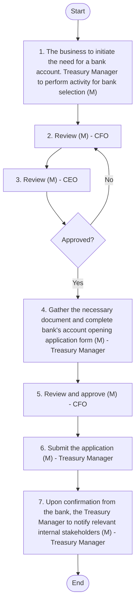
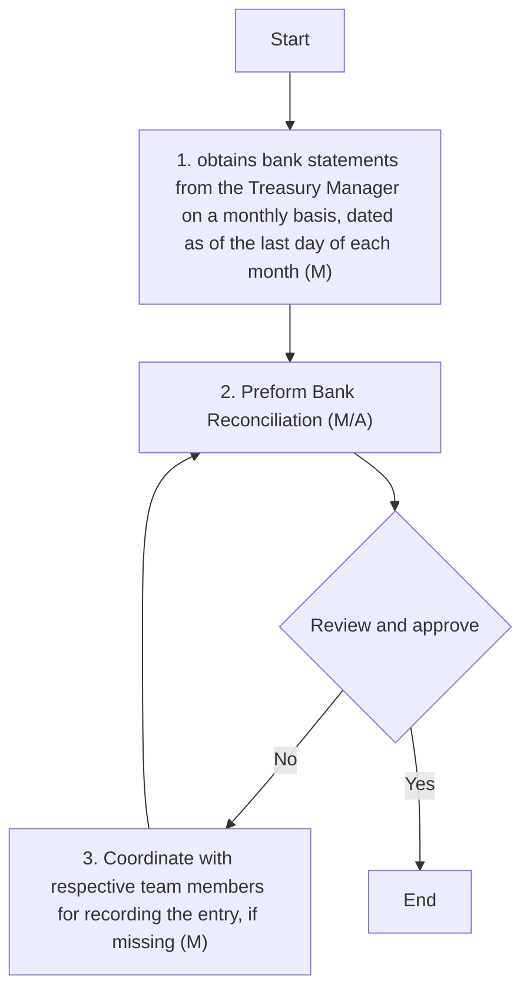
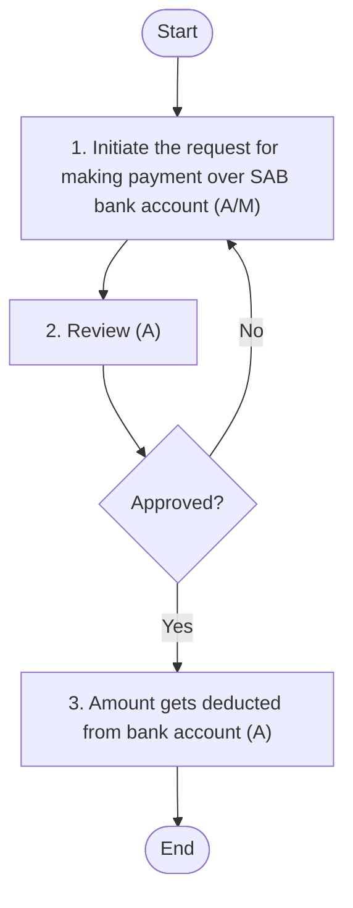
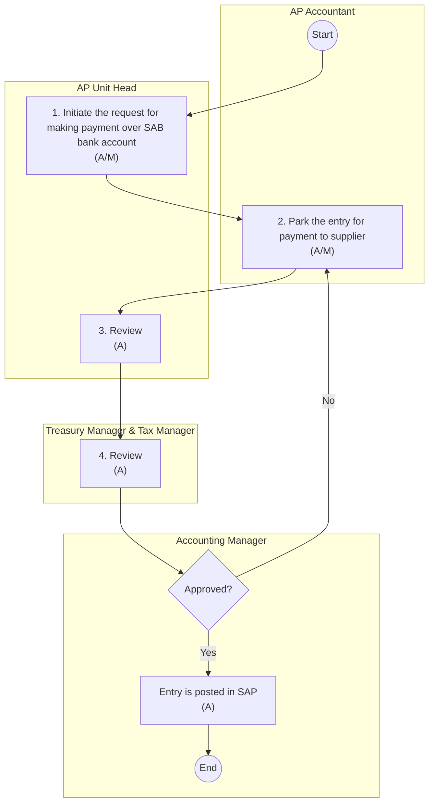

## CASH MANAGEMENT

Overview
At Arabian Mills, effective cash management is crucial for maintaining financial stability and operational efficiency. This manual encompasses various aspects of cash management, including:
 Bank Accounts Management: Selection, opening, and closing of bank accounts are conducted with diligence to ensure optimal banking relationships and services.
 Update Signatories in Bank Accounts: Signatories in bank accounts are regularly updated to reflect changes in authorised personnel, ensuring secure and authorised access to funds.
 Bank Reconciliation: Monthly bank reconciliations are performed to verify the accuracy of bank statements and internal records, identifying and resolving discrepancies promptly.
 PO-Based and Non-PO-Based Payments: Payments are processed according to the credit ageing, with PO-based payments verified against purchase orders and goods receipt notes, and non-PO-based payments verified against contracts.
 Issuance of Letters of Credit (LC): LCs are issued to facilitate international trade, ensuring secure and timely payment to suppliers.
 Borrowing and Finance Cost: Borrowing involves securing funds from external sources to meet financial obligations. For loans borrowed, interest is accrued periodically to reflect the cost of borrowing.
 Investment and Interest Income: The company engages in short-term investments in bank deposits. Interest from these investments is accrued periodically to reflect earnings.
 Preparation of Forecasted Cash Flow: Forecasted cash flows are prepared to anticipate future cash needs and ensure sufficient liquidity for operations.
 Petty Cash: Petty cash is managed for minor, day-to-day expenses, with strict controls and documentation to prevent misuse.
Currently, the Company has relationships with two banks:
 SAB Bank (through HSBC)
 BSF Bank
The Company has a total of five bank accounts with SAB Bank, consisting of:
 One account for capital-related transactions
 Three accounts for the collection of revenue, one for each location (Riyadh, Hail, and Jizan)
 One account for the payment of expenses
Borrowings obtained by the company from SAB Bank were transferred into the account used for making payments.
The Company has a total of four bank accounts with BSF Bank, consisting of:
 Three accounts for revenue collection and payments
 One account for letters of guarantee
Currently, the Company primarily utilises the bank accounts with SAB Bank for revenue collection and payment of expenses. The BSF Bank accounts are largely used for letters of guarantee.
Cash and cash equivalents in the statement of financial position comprise of cash at banks, Cash on hand and short-term deposits with a maturity of three months or less, which are subject to an insignificant risk of changes in value. For the purpose of the statement of cash flows, cash and cash equivalents consists of cash and short-term deposits, as defined above, net of outstanding bank overdrafts, if any, as they are considered an integral part of the Company’s cash management.
Restricted cash: The treatment of cash subject to restriction depends on the nature of the item and the restriction in force. In certain situations, cash is held in a separate blocked account or an escrow account to be used only for a specific purpose, such that the cash is not freely accessible to the Company. In these circumstances, the classification of cash as a current or non-current is also considered. Where cash is restricted from being exchanged or used to settle a liability for at least twelve months after the reporting period, that restricted cash shall be classified as a non-current asset.
Cash equivalents: Cash equivalents are short-term, highly liquid investments (usually commercial papers, treasury bills, short term government bonds, time deposits etc.) which must satisfy the following criteria to be classified under cash equivalents:
 The investment should mature in three months or less from the acquisition date;
 The item should be highly liquid. This means that they should be easily sold in the market. The buyers of these investments should be easily available; and
Readily convertible to known amounts of cash and so near their maturity that they present insignificant risk of changes in value.
#### Bank accounts management (Bank selection, Opening, and Closing of Bank)
Policy
 All bank accounts must be opened or closed only with the approval of the CFO, CEO and the Board of Directors.
 Opening and closing of accounts must adhere to internal delegation of authority and regulatory compliance.
 All bank accounts must be registered within Arabian Mills SAP and treasury records.
 Dormant bank accounts must be reviewed quarterly and closed if deemed unnecessary.
 Unauthorized or unofficial bank accounts are strictly prohibited.
 Any changes to bank accounts must be communicated to relevant stakeholders.
 Only designated personnel are authorised to interact with banks regarding account changes.
 Bank details must be verified during internal audits and cash reviews.
Procedure
The following accounting procedures shall be followed:

| S No. | Procedure description | Responsibility | Frequency |
| --- | --- | --- | --- |
| 1 | **Bank Selection**<br>• The business initiates the need for a bank account. The Treasury Manager performs the following activities for bank selection:<br>• Define criteria for choosing a bank based on service quality, fees charged, user-friendly technology/application, and support.<br>• Collect suggestions from internal stakeholders.<br>• Create a report summarising the evaluation and recommendations for bank selection.<br>• Present the report to the CFO and CEO.<br>• Incorporate feedback and prepare an updated report for the Board.<br>• Present the report to the Board for review and approval. | **Documents prepared by:**<br>• Treasury Manager<br>• Reviewer: CFO and C E O<br>• Approver: Board | Frequency: As and when required |
| 2 | **Opening of Bank Acc o unt**<br>• All authorisations are provided by the Board of Directors (BOD) and communicated to the Treasury Manager by the CFO.<br>• Upon obtaining approval from the Board regarding the selection of the bank account, the Treasury Manager gathers the necessary documents, including company registration, identification of authorised signatories, and any other required KYC paperwork for opening the bank account.<br>• The Treasury Manager completes the bank's account opening application form, which is reviewed by the CFO. Following the CFO's review, the Treasury Manager submits the application along with the required documents.<br>• The Treasury Manager conducts a meeting with the bank manager to discuss the company's banking needs and expectations.<br>• On approval of application , the bank sets up the account and provides the account details. | **Documentation p reparer: Treasury Manager**<br>• Documentation r eviewer: CFO | **Frequency: A fter obtaining board approval**<br>• Additional details: There has been no change in bank account (opening/closing) for past few years . |
| 3 | **Notification to the stakeholders**<br>• Upon confirmation from the bank, the Treasury Manager notifies relevant internal stakeholders, including members of the GL team and Sales team, about the new bank account details. Other team members perform activities, such as opening of GL account and sharing account details with customers, according to the applicable process. | Email by: Treasury Manager | Frequency: After opening of new bank account |
| 4 | **Closing of Bank Account**<br>• Assessment: The Treasury Manager assesses the need for closing the bank account based on business requirements, as indicated by the CFO and/or CEO.<br>• Document Collection: The Treasury Manager collects all necessary documents required by the bank for account closure, including the account closure form and list of authorised signatories.<br>• The Treasury Manager ensures all outstanding transactions are settled and no pending issues remain. Inform relevant internal stakeholders, including the GL team, about the decision to close the bank account.<br>• Submit the closure proposal to the CFO and CEO for review.<br>• Incorporate feedback from the CFO and CEO and prepare an updated proposal for the Board.<br>• Present the proposal to the Board for final review and approval.<br>• Upon obtaining Board approval, complete the bank's account closure form and submit it along with the required documents.<br>• After the bank approves the closure, obtain a closure certificate from the bank confirming the account has been closed and share it with relevant stakeholders. | • Request initiated by: CFO and/or CEO.<br>• Documentation preparer: Treasury Manager<br>• Documentation Reviewer: CFO<br>• Approver: Board | **Frequency: As and when required**<br>• Additional details: There has been no change in bank account (opening/closing) for past few years. |

Flow Chart

**[Diagram — PNG]:**

**Process Name:** Bank accounts management (Selection, Opening)

**Roles / Swimlanes:**
- Treasury Manager
- CFO
- CEO
- Board

---

### Steps

| Step # | Role            | Action                                                                                                                                           | Decision / Next Step                                                                                   |
|--------|-----------------|--------------------------------------------------------------------------------------------------------------------------------------------------|--------------------------------------------------------------------------------------------------------|
| —      | Treasury Manager | Start                                                                                                                                            | Flows to Step 1.                                                                                       |
| 1      | Treasury Manager | The business to initiate the need for a bank account. Treasury Manager to perform activity for bank selection (M)                              | Flows to Step 2 (CFO Review).                                                                          |
| 2      | CFO             | Review (M)                                                                                                                                       | Flows to Step 3 (CEO Review).                                                                          |
| 3      | CEO             | Review (M)                                                                                                                                       | Flows to Decision “Approved?”.                                                                         |
| —      | Board           | **Decision:** Approved?                                                                                                                          | **Yes:** Flows to Step 4.  **No:** Returns to Step 2 (CFO Review).                                     |
| 4      | Treasury Manager | Gather the necessary document and complete bank's account opening application form (M)                                                          | Flows to Step 5.                                                                                       |
| 5      | CFO             | Review and approve (M)                                                                                                                           | Flows to Step 6.                                                                                       |
| 6      | Treasury Manager | Submit the application (M)                                                                                                                      | Flows to Step 7.                                                                                       |
| 7      | Treasury Manager | Upon confirmation from the bank, the Treasury Manager to notify relevant internal stakeholders (M)                                             | Flows to End.                                                                                          |
| —      | Treasury Manager | End                                                                                                                                              | Process terminates.                                                                                    |

**Yes/No Branches from “Approved?”:**

- **Yes** → Step 4: Treasury Manager gathers the necessary document and completes bank's account opening application form (M).
- **No** → Step 2: CFO reviews (M) again.

---




**[Diagram — PNG]:**

**Process Name:** Bank accounts management (Closing of bank account)

**Roles / Swimlanes:**
- Treasury Manager
- CFO
- CEO
- Board

### Steps

| Step # | Role            | Action | Decision/Next Step |
|--------|-----------------|--------|--------------------|
| Start  | Treasury Manager | Start | Proceed to Step 1. |
| 1      | Treasury Manager | Assess the need for closing the bank account based on business requirements, as indicated by the CFO and/or CEO (M). | Proceed to Step 2. |
| 2      | Treasury Manager | Collect all necessary documents required by the bank for account closure, including the account closure form and list of authorized signatories (M). | Proceed to Step 3. |
| 3      | Treasury Manager | Ensure all outstanding transactions are settled and no pending issues remain and submit closure proposal (M). | Proceed to Step 4. |
| 4      | CFO             | Review (M). | Proceed to Step 5. |
| 5      | CEO             | Review (M). | Proceed to Decision “Approved?”. |
| D1     | Board           | Approved? | If **Yes** → proceed to Step 6. If **No** → return to Step 5 (CEO Review). |
| 6      | Treasury Manager | Complete the bank's account closure form and obtain a closure certificate from the bank confirming and notify the stakeholders (M). | Proceed to End. |
| End    | Treasury Manager | End | Process completed. |

### Explicit Yes/No Branches

- From Decision **“Approved?”** (Board):
  - **Yes** → Step 6: Treasury Manager completes the bank's account closure form and obtains a closure certificate from the bank confirming and notifies the stakeholders (M), then End.
  - **No** → Step 5: CEO performs Review (M) again.

### Mermaid.js Diagram

```mermaid
graph TD

    Start((Start))
    S1[1. Assess the need for closing the bank account based on business requirements, as indicated by the CFO and/or CEO (M)]
    S2[2. Collect all necessary documents required by the bank for account closure, including the account closure form and list of authorized signatories (M)]
    S3[3. Ensure all outstanding transactions are settled and no pending issues remain and submit closure proposal (M)]
    S4[4. Review (M)]
    S5[5. Review (M)]
    D1{Approved?}
    S6[6. Complete the bank's account closure form and obtain a closure certificate from the bank confirming and notify the stakeholders (M)]
    End((End))

    Start --> S1 --> S2 --> S3 --> S4 --> S5 --> D1
    D1 -- Yes --> S6 --> End
    D1 -- No --> S5
```

#### Update signatories in Bank accounts
Policy
 Any update in bank signatories must be approved in writing by the CFO, CEO and Board of Directors.
 Changes must be formally communicated to banks with original documentation.
 Only employees in active service with valid authority may be designated as signatories.
 The signatory matrix must be maintained by Treasury and reviewed annually.
 Removal of exited or transferred employees must be actioned within 7 working days.
Procedures
The following accounting procedures shall be followed:

| S No | Procedure description | Responsibility | Frequency |
| --- | --- | --- | --- |
| 1 | **List of authorised signatories**<br>• The Treasury Manager maintains the list of authorised signatories and ensures that the bank is informed of any changes. Currently, the authorised signatories are:<br>• CEO,<br>• CFO, and<br>• CHRO . | Preparer: Treasury Manager | n.a. |
| 2 | **Change in authorised signatories**<br>• The business initiates the assessment of the necessity for changing authorised signatories based on business requirements or organisational changes. All authorisations for changes in the list of bank authorised signatories are provided by the B oard and communicated to the Treasury Manager by the CFO.<br>• The Treasury Manager connects with the Relationship Manager of the bank and coordinates the changes in authorised signatories, led by the CFO and/or CEO.<br>• The Treasury Manager gathers all necessary documents required by the bank for changing authorised signatories, such as the updated signatory list and identification of new signatories.<br>• The Treasury Manager drafts a detailed proposal for changing authorised signatories, including reasons and implications.<br>• Submit the proposal to the CFO and CEO for review.<br>• Incorporate feedback and prepare an updated proposal for the Board.<br>• Present the proposal to the Board for final review and approval. | **Request initiation: C F O or CEO**<br>• Documentation preparer: Treasury Manager<br>• Documentation reviewer: CFO and CEO<br>• Approver: B oard | **Frequency: Once business initiate the request**<br>• Additional details: There has been no change in bank authorised signatories for past few years. |
| 3 | **Submission of documents to Bank**<br>• After obtaining Board approval, complete the bank's authorised signatory change form and submit it along with the required documents, keeping the CFO in loop. Obtain confirmation from the bank that the authorised signatories have been updated and update the company's accounting records to reflect the change. | **Documentation preparer: Treasury Manager**<br>• Documentation reviewer: CFO | Frequency: Post approval of Board |

Flow Chart

**[Diagram — PNG]:**

**Process Name:** Update signatories in Bank accounts  

**Roles / Swimlanes:**
- Treasury Manager  
- CFO  
- CEO  
- Board  

### Steps

| Step # | Role            | Action                                                                                                                                                                   | Decision/Next Step                                                                                                                                                                    |
|--------|-----------------|--------------------------------------------------------------------------------------------------------------------------------------------------------------------------|----------------------------------------------------------------------------------------------------------------------------------------------------------------------------------------|
| Start  | Treasury Manager | Start                                                                                                                                                                    | Proceeds to Step 1.                                                                                                                                                                   |
| 1      | Treasury Manager | Maintains the list of authorized signatories and ensures that the bank is informed of any changes (M)                                                                   | Proceeds to Step 2.                                                                                                                                                                   |
| 2      | Treasury Manager | Gathers all necessary documents required by the bank for changing authorized signatories (M)                                                                            | Proceeds to Step 3.                                                                                                                                                                   |
| 3      | Treasury Manager | Drafts a detailed proposal for changing authorized signatories, including reasons and implications (M)                                                                  | Proceeds to Step 4 (CFO Review).                                                                                                                                                      |
| 4      | CFO             | Review (M)                                                                                                                                                               | Proceeds to Step 5 (CEO Review).                                                                                                                                                      |
| 5      | CEO             | Review (M)                                                                                                                                                               | Proceeds to Decision D1 “Approved?”.                                                                                                                                                  |
| D1     | Board           | Approved?                                                                                                                                                                | If **Yes**, proceed to Step 6 (Treasury Manager). If **No**, return to Step 4 (CFO Review) for further review and repeat the review and approval cycle.                               |
| 6      | Treasury Manager | complete the bank's authorised signatory change form and submit. Obtain confirmation from bank the authorised signatories have been updated (M)                         | Proceeds to End.                                                                                                                                                                      |
| End    | Treasury Manager | End                                                                                                                                                                      | Process terminates.                                                                                                                                                                   |

### Yes/No Branches from Decision “Approved?”

- **Yes** → Step 6: Treasury Manager completes the bank's authorised signatory change form and submits it; obtains confirmation from bank the authorised signatories have been updated (M), then proceeds to End.  
- **No** → Step 4: CFO Review (M) is repeated, followed again by CEO Review (M) and the Board “Approved?” decision.

### Mermaid.js flow

```mermaid
graph TD
    A0([Start]) --> A1

    A1[1. Maintains the list of authorized signatories and ensures that the bank is informed of any changes (Treasury Manager) (M)] --> A2

    A2[2. Gathers all necessary documents required by the bank for changing authorized signatories (Treasury Manager) (M)] --> A3

    A3[3. Drafts a detailed proposal for changing authorized signatories, including reasons and implications (Treasury Manager) (M)] --> B1

    B1[4. Review (CFO) (M)] --> C1

    C1[5. Review (CEO) (M)] --> D1{Approved? (Board)}

    D1 -- Yes --> A4
    D1 -- No --> B1

    A4[6. complete the bank's authorised signatory change form and submit. Obtain confirmation from bank the authorised signatories have been updated (Treasury Manager) (M)] --> A5([End])
```

#### Bank reconciliation
Policy
 All bank accounts must be reconciled monthly without exception maximum by 7th day for following month.
 Unreconciled items older than 30 days must be investigated and cleared.
 Bank reconciliations must be reviewed and approved by Accounting Manager.
 Bank charges and interest must be posted accurately as per bank statements.
 Reconciliation reports must be retained as audit evidence.
Procedure
The following accounting procedures shall be followed:

| S No. | Procedure description | Responsibility | Frequency |
| --- | --- | --- | --- |
| 1 | **Obtaining Bank Statement**<br>• The Finance Accounting Unit Head of each respective location (Riyadh, Jizan, and Hail) obtains bank statements from the Treasury Manager on a monthly basis, dated as of the last day of each month. | Requester: Accounting Unit Head | Frequency: Monthly (on first day of each month) |
| 2 | **Perform Bank Reconciliation**<br>• Book b alance extraction and Reconciliation : After obtaining the bank statements, the Accounting Unit Head downloads the book balance statement from SAP for each month in Excel format. Subsequently, the bank statements and book balance statements are entered into Excel, and the reconciliation of transactions is performed. This activity is conducted during the first seven days of each month.<br>• D ifference between balance as per books and as per bank : Upon identifying differences, the Accounting Unit Head classifies them into reconciling differences and discrepancies.<br>• - Reconciling differences may arise due to timing differences between the recording of transactions in the books and their reflection in the bank statement. Examples include balances credited in books but not debited in the bank, which pertains to supplier payments recorded in the books at or near month-end, but the amount is debited from the bank statement at the beginning of the next month .<br>• - Unidentified differences , such as amounts credited in the bank but customers not identified, continue to appear in reconciliation until resolved.<br>• Review and Feedbac k: The GL Manager and Accounting Manager reviews the reconciliation prepared by the Accounting Unit Head and provides the feedback. | **Preparer: Accounting Unit Head**<br>• Reviewer and Approver : GL Manager and Accounting Manager | Frequency: Monthly (first week) |
| 3 | **Reconciling entries**<br>• If any entry is missed, relevant accounting team members park it in the system. The GL Manager or Accounting Manager reviews and approves the entries, which are then posted in SAP. | **Preparer: Respective Accounting Team Member**<br>• Reviewer: GL Manager and Accounting Manager | Frequency: In case any entry is required to be posted |
| 4 | **Balance confirmation**<br>• On a quarterly basis, balances are confirmed and reconciled with the GL balance. The confirmation is prepared by each location's Finance Unit Head/Accounting Unit Head, keeping the Treasury Manager, GL Manager, and Accounting Manager in loop. | **Preparer: Accounting Unit Head**<br>• Informed : Treasury Manager, GL Manager, and Accounting Manager | Frequency: Quarterly |

Flow Chart

**[Diagram — PNG]:**

**Process Name:** Bank Reconciliation  

**Roles / Swimlanes:**
- Accounting Unit Head  
- GL Manager/ Accounting Manager  

### Steps

| Step # | Role                          | Action                                                                                                                                   | Decision/Next Step                                                                                                                                                      |
|--------|-------------------------------|------------------------------------------------------------------------------------------------------------------------------------------|------------------------------------------------------------------------------------------------------------------------------------------------------------------------|
| 1      | Accounting Unit Head          | Start                                                                                                                                   | Proceed to Step 2                                                                                                                                                       |
| 2      | Accounting Unit Head          | 1. obtains bank statements from the Treasury Manager on a monthly basis, dated as of the last day of each month (M)                    | Proceed to Step 3                                                                                                                                                       |
| 3      | Accounting Unit Head          | 2. Preform Bank Reconciliation (M/A)                                                                                                    | Proceed to Step 4                                                                                                                                                       |
| 4      | GL Manager/ Accounting Manager | Review and approve                                                                                                                      | If **Yes** → Step 6 (End). If **No** → Step 5 (3. Coordinate with respective team members for recording the entry, if missing (M))                                     |
| 5      | Accounting Unit Head          | 3. Coordinate with respective team members for recording the entry, if missing (M)                                                     | After coordination, loop back to Step 3 (2. Preform Bank Reconciliation (M/A))                                                                                        |
| 6      | GL Manager/ Accounting Manager | End                                                                                                                                    | Process completed                                                                                                                                                       |

### Mermaid.js Flow




**[Diagram — PNG]:**

**Process Name:** Balance Confirmation  

**Roles / Swimlanes:**
1. Accounting Unit Head  
2. Treasury Manager, GL Manager, and Accounting Manager  

### Steps

| Step # | Role                                                   | Action                                                                                          | Decision/Next Step                            |
|--------|--------------------------------------------------------|-------------------------------------------------------------------------------------------------|-----------------------------------------------|
| 1      | Accounting Unit Head                                   | 1. On quarterly basis, balances are confirmed and reconciled with the GL balance (M)           | Proceeds to “Keep informed Treasury Manager, GL Manager, and Accounting Manager (M)” |
| 2      | Treasury Manager, GL Manager, and Accounting Manager   | Keep informed Treasury Manager, GL Manager, and Accounting Manager (M)                         | Proceeds to End                               |
| 3      | —                                                      | End                                                                                             | —                                             |

### Branches
- There are no decision/Yes-No branches in this process; the flow is linear: Start → Step 1 → Step 2 → End.

### Mermaid.js Flow

```mermaid
graph TD

    A[Start] --> B[1. On quarterly basis, balances are confirmed and reconciled with the GL balance (M)]
    B --> C[Keep informed Treasury Manager, GL Manager, and Accounting Manager (M)]
    C --> D[End]

    %% Swimlane indication via comments (visual lanes not natively supported in Mermaid)
    %% Accounting Unit Head: Start, Step 1
    %% Treasury Manager, GL Manager, and Accounting Manager: Step 2, End
```

#### PO based and non-PO based payment
Policy
 No payment shall be made without valid documentation (invoice, approval, PO, contract) except for payments to employees, including salaries, vacation clearance, business trips, and advances to employees, which will be based on approvals and related documentation.
 Payments must be processed only through official bank accounts registered with the company.
 All payments must be supported by matching accounting entries in SAP.
 Payment runs must be reviewed by Treasury and validated for cut-off compliance.
 All payment requires approval from two out of three key executives, as per the following limits:
  o Payments up to SAR 50,000 require joint approval from the Chief Financial Officer (CFO) and Chief Human Resources Officer (CHRO).
  o For payments exceeding SAR 50,000 related to employee reimbursements and HR-related expenses, approval must be obtained from both the Chief Executive Officer (CEO) and CHRO.
  o All other payments above SAR 50,000 require approval from the CEO and CFO.
Procedure
The following accounting procedures shall be followed:

| S No. | Procedure description | Responsibility | Frequency |
| --- | --- | --- | --- |
| 1 | **Initiate Request for Payment**<br>• The AP Unit Head initiates the payment request over the SAB bank account based on the due date specified in the invoice and the creditors ageing report. | **Preparer:**<br>• AP Unit Head | Frequency: At the time of payment |
| 2 | **Request Review**<br>• The payment request is reviewed by the Treasury Manager, who examines the liability documents, including:<br>• For non-PO-based suppliers: the approved supplier invoice, user department approval , or related documentation (All Suppliers should be PO based except for Government payments (SADAD & MOI) and employees) .<br>• For PO-based suppliers: the approved supplier invoice, contract copy, user department approval, approved PO, and GSRN.<br>• All payments related to deliveries, should be supported by “Delivery Note” from the suppliers. The exception is given when it’s an advance with a condition to provide delivery note once the delivery is completed. All payments related to final payments of a project should be supported by a Completion report duly signed by the requester/Department manager and the supplier.<br>• Upon validation, the Treasury Manager signs off on the SAB bank account to proceed with the payment, which then requires approval from two out of the CFO, CHRO, and CEO.<br>• In case of incomplete documentation, the Treasury Manager rejects the payment request, which is then redirected to the AP Unit Head for providing the complete documentation. | **Preparer: AP unit Head**<br>• Reviewer: Treasury Manager | Frequency: At the time of submission of document for payment processing |
| 3 | **Request Approval**<br>• Once the Treasury Manager validates and signs off on the payment request, it is forwarded for final approval.<br>• The payment approval requires the consent of two out of the three key executives: the CFO, CHRO, and CEO, as per accounting policy.<br>• Upon validating the documents, the key executives provide their approval, and post-approval, the payment is released to the supplier. | **Preparer: AP unit Head**<br>• Reviewer: Treasury Manager<br>• Approver: CFO, CHRO , and CEO | Frequency: At the time of submission of document for payment processing |
| 4 | **Recording of entry in SAP**<br>• On payment initiation , the AP Accountant parks the system-generated entry in SAP. The AP Unit Head, Tax Manager review the entry, and the Accounting Manager approves it. The entry is posted at the time of approval. | **Preparer: AP Accountant**<br>• Reviewer: AP Unit Head, Tax Manager<br>• Approver: Accounting Manager | Frequency: At the time of payment initiation |

Flow chart

**[Diagram — PNG]:**

**Process Name:** PO based and non-PO based payment  

**Roles / Swimlanes:**
- AP Unit Head  
- Treasury Manager  
- CFO, CHRO, & CEO  

### Steps

| Step # | Role                 | Action                                                                 | Decision/Next Step                                                                                           |
|--------|----------------------|-------------------------------------------------------------------------|--------------------------------------------------------------------------------------------------------------|
| Start  | AP Unit Head         | Start                                                                  | Proceeds to Step 1.                                                                                          |
| 1      | AP Unit Head         | Initiate the request for making payment over SAB bank account (A/M)   | Proceeds to Step 2.                                                                                          |
| 2      | Treasury Manager     | Review (A)                                                             | Proceeds to Decision D1 “Approved?”.                                                                         |
| D1     | CFO, CHRO, & CEO     | Approved?                                                              | **Yes:** Proceeds to Step 3.  **No:** Request is not approved and flows back to Step 1 for re‑initiation.   |
| 3      | CFO, CHRO, & CEO     | Amount gets deducted from bank account (A)                            | Proceeds to End.                                                                                             |
| End    | CFO, CHRO, & CEO     | End                                                                    | Process completed.                                                                                           |

### Yes/No Branches

- From Decision **“Approved?” (D1)**:  
  - **Yes** → Step 3: “Amount gets deducted from bank account (A)” → End.  
  - **No** → Back to Step 1: “Initiate the request for making payment over SAB bank account (A/M)”.

### Mermaid.js Flow




**[Diagram — PNG]:**

**Process Name:** Recording of PO based and non-PO based payment

**Roles / Swimlanes:**
- AP Accountant
- AP Unit Head
- Treasury Manager & Tax Manager
- Accounting Manager

### Steps

| Step # | Role                               | Action                                                                                     | Decision/Next Step                                                                                                                                                   |
|--------|------------------------------------|--------------------------------------------------------------------------------------------|----------------------------------------------------------------------------------------------------------------------------------------------------------------------|
| Start  | AP Accountant                      | Start                                                                                      | Next: Step **1. Initiate the request for making payment over SAB bank account (A/M)**                                                                                |
| 1      | AP Unit Head                       | 1. Initiate the request for making payment over SAB bank account (A/M)                    | Next: Step **2. Park the entry for payment to supplier (A/M)**                                                                                                       |
| 2      | AP Accountant                      | 2. Park the entry for payment to supplier (A/M)                                           | Next: Step **3. Review (A)**                                                                                                                                         |
| 3      | AP Unit Head                       | 3. Review (A)                                                                             | Next: Step **4. Review (A)**                                                                                                                                         |
| 4      | Treasury Manager & Tax Manager     | 4. Review (A)                                                                             | Next: Decision **Approved?**                                                                                                                                         |
| Dec-1  | Accounting Manager                 | Approved?                                                                                  | **Yes** → Step **Entry is posted in SAP (A)**; **No** → Return to Step **2. Park the entry for payment to supplier (A/M)**                                          |
| Post   | Accounting Manager                 | Entry is posted in SAP (A)                                                                | Next: **End**                                                                                                                                                        |
| End    | Accounting Manager                 | End                                                                                        | Process terminates.                                                                                                                                                  |

### Mermaid.js Flow



#### Issuance of LC
Policy
 Letters of Credit (LCs) must be issued only for approved import transactions which exceed 20,000 USD or equivalent.
 All LCs must be backed by valid PO, contract, and import license (if applicable).
 LC terms (amount, validity, beneficiary) must be approved by the CFO before issuance.
 Procurement and Treasury must maintain a centralized LC listing and monitor utilization and expiry.
 LC charges and commissions must be accrued accurately and expensed timely.
 LC limits must be tracked as part of overall banking facilities in the HSBCNet platform with no exception.
Procedure
The following accounting procedures shall be followed:

| S No. | Procedure description | Responsibility | Frequency |
| --- | --- | --- | --- |
| 1 | **Request Initiation**<br>• The process for requesting a Letter of Credit (LC) begins with the Procurement team preparing the necessary documents. The Treasury Manager reviews these documents to ensure accuracy and completeness. Following the review, the CFO and CEO approves the documents on the Banking platform (HSBCNet) . On approval , the Treasury Manager submits the documents to the Procurement team who contact s the bank for the issuance of the LC. | **Preparer: Procurement team**<br>• Reviewer: Treasury Manager<br>• Approver: CFO and CEO | Frequency: As and when required |
| 2 | **Issuance of LC**<br>• Upon issuance of the LC, the bank notifies the Procurement team who informs the Treasury Manager, thereby completing the request process. The Procurement Team then informs the relevant stakeholders of the LC issuance . | Notified to : Treasury Manager | Frequency: Once LC is issued |
| 3 | **Recording of LC expense**<br>• For the recording of LC expenses, the GL Manager initially parks the entry related to the LC expense in SAP. The Accounting Manager reviews and approves this entry. On approval , the entry is posted in SAP. | **Preparer: GL Manager**<br>• Reviewer & Approver : Accounting Manager | Timeline : Within 2 working days from date of issue |
| 4 | **Settlement of LC**<br>• Payment to the supplier follows the same process as described in ‘PO-based and non-PO-based payment’. Once the amount is released to the foreign supplier, the AP Accountant parks the system-generated entry (for inventory in transit/margin on LC). The AP Unit Head and Tax Manager review the entry, and the Accounting Manager approves it. On approval , the entry is posted in SAP. | **Accounting entry:**<br>• Preparer : AP Accountant<br>• Reviewer: AP Unit Head, Tax Manager<br>• Approver: Accounting Manager | Frequency: A t the time of settlement |

Flow Chart

**[Diagram — Visio-EMF→PNG]:**

**Process Name:** Issuance of LC  

**Roles / Swimlanes:**
- Procurement Department
- Treasury Manager
- GL Manager
- Accounting Manager
- CFO

| Step # | Role                  | Action                                                                                                   | Decision / Next Step                                                                                                                                             |
|--------|------------------------|----------------------------------------------------------------------------------------------------------|------------------------------------------------------------------------------------------------------------------------------------------------------------------|
| 1      | Procurement Department | Start                                                                                                    | Proceeds to Step 2.                                                                                                                                              |
| 2      | Procurement Department | Procurement team initiates request for issuance of LC                                                   | Proceeds to Step 3.                                                                                                                                              |
| 3      | Treasury Manager       | Review the documentation (M)                                                                            | Proceeds to Step 4 “Approved?”. If Step 4 outcome is “No”, flow returns from Step 4 back to this step for re‑review.                                           |
| 4      | Accounting Manager     | Approved?                                                                                               | **Yes:** Proceed to Step 5 “Submits the document for issuance of LC (M)”.  **No:** Return to Step 3 “Review the documentation (M)”.                              |
| 5      | Treasury Manager       | Submits the document for issuance of LC (M)                                                             | Proceeds to Step 6. If Step 8 outcome is “No”, flow returns from Step 8 back to this step.                                                                      |
| 6      | Treasury Manager       | Upon issuance of LC by the bank, inform all stakeholders about the opening of the LC. (M)              | Proceeds to Step 7.                                                                                                                                              |
| 7      | GL Manager             | Records LC related expense in SAP, and update disclosures in financial statement (AM)                  | Proceeds to Step 8.                                                                                                                                              |
| 8      | Accounting Manager     | Review and Approve                                                                                      | **Yes:** Proceed to Step 9 “End”.  **No:** Return to Step 5 “Submits the document for issuance of LC (M)”.                                                       |
| 9      | Accounting Manager     | End                                                                                                     | Process ends.                                                                                                                                                    |

*(CFO swimlane is present in the diagram but contains no specific steps or actions.)*

```mermaid
graph TD

%% Nodes with role prefixes in labels
A[Start<br/>(Procurement Department)]
B[Procurement team initiates request for issuance of LC<br/>(Procurement Department)]
C[Review the documentation (M)<br/>(Treasury Manager)]
D{Approved?<br/>(Accounting Manager)}
E[Submits the document for issuance of LC (M)<br/>(Treasury Manager)]
F[Upon issuance of LC by the bank, inform all stakeholders about the opening of the LC. (M)<br/>(Treasury Manager)]
G[Records LC related expense in SAP, and update disclosures in financial statement (AM)<br/>(GL Manager)]
H{Review and Approve<br/>(Accounting Manager)}
I[End<br/>(Accounting Manager)]

A --> B
B --> C
C --> D
D -- No --> C
D -- Yes --> E
E --> F
F --> G
G --> H
H -- No --> E
H -- Yes --> I
```

#### Borrowing and finance cost
Policy:
 Borrowings must be raised only with the approval of the Board of Directors.
 All borrowings must be recorded with full terms, including interest rate, tenor, and security.
 Finance costs must be accrued monthly using the effective interest method as per IAS 23.
 Borrowing costs eligible for capitalization must comply with IAS 23.
 Unauthorized overdrafts or informal loans are strictly prohibited.
 Early repayment of borrowings or voluntary Payment of Loan must be pre-approved by the CFO and CEO and the Board of Directors.
 The Accounting department must maintain loan and interest schedules.
Procedure
The following accounting procedures shall be followed:

| S No. | Procedure description | Responsibility | Frequency |
| --- | --- | --- | --- |
| 1 | **Recording of new loan**<br>• On approval , the loan agreement and other relevant documents are received from the lender, and the amount is credited to the bank account based on the confirmation from the Treasury Manager. The GL Manager records the entry of the loan receipt in SAP, and the Accounting Manager reviews and approves it. | **Preparer: GL Manager**<br>• Reviewer: Accounting Manager | Frequency: Once amount is credited to bank account |
| 2 | **Recording of interest**<br>• Interest expense accrual is based on the loan agreement. If there are any loan costs (e.g., origination fees), these costs are amortised over the life of the loan as per IFRS. The GL Manager parks the entry for interest expense, and the Accounting Manager reviews and approves it. | **Preparer: GL Manager**<br>• Reviewer: Accounting Manager | Frequency: End of each month |
| 3 | **Recording of payment for loan and interest**<br>• All payment-related entries are initiated by the Treasury Manager who coordinates with the AP Team for the initiation of the payment . On or before the due date, the AP Accountant parks the entry related to the payment of interest and repayment of the loan instalment. The AP Unit Head review the entry, and the Accounting Manager approves it. On approval , the entry is posted in SAP. | **Preparer: AP Accountant**<br>• Reviewer: AP Unit Head<br>• Approver: Accounting Manager | Frequency: Once payment is initiated |

Flow Chart

**[Diagram — PNG]:**

**Process Name:** Recording entry for borrowing and finance cost  

**Roles / Swimlanes:**
- GL Manager
- Accounting Manager
- AP Unit Head
- Treasury Manager  

---

### Steps

| Step # | Role            | Action                                                                                                   | Decision/Next Step                                                                                                  |
|--------|-----------------|----------------------------------------------------------------------------------------------------------|----------------------------------------------------------------------------------------------------------------------|
| 1      | GL Manager      | **Start**                                                                                                | Proceeds to Step 2.                                                                                                  |
| 2      | GL Manager      | Record entry for new loan once same has been disbursed and confirmed by Treasury Manager (M)            | Proceeds to Step 3.                                                                                                  |
| 3      | Accounting Manager | Review and approve (new loan entry)                                                                 | **No** – arrow labelled “No” loops back to Step 2 (Record entry for new loan once same has been disbursed and confirmed by Treasury Manager (M)). **Yes** – flows upward to Step 4 (Record entry for interest accrual periodically (A/M)). |
| 4      | GL Manager      | Record entry for interest accrual periodically (A/M)                                                    | Proceeds downward to Step 5.                                                                                         |
| 5      | Accounting Manager | Review and approve (interest accrual entry)                                                         | **No** – arrow labelled “No” goes rightward to Step 8 (Approve?). **Yes** – proceeds downward to Step 6 (Records entry for payment of interest and loan (A)). |
| 6      | AP Unit Head    | Records entry for payment of interest and loan (A)                                                      | Proceeds downward to Step 7.                                                                                        |
| 7      | Treasury Manager| Review (A)                                                                                               | Proceeds upward to Step 8 (Approve?).                                                                               |
| 8      | Accounting Manager | Approve?                                                                                            | **Yes** – proceeds rightward to Step 9 (End). **No** – proceeds downward back to Step 6 (Records entry for payment of interest and loan (A)). |
| 9      | Accounting Manager | **End**                                                                                             | Process terminates.                                                                                                  |

---

### Mermaid.js Flow

```mermaid
graph TD

%% Nodes
S1[Start]
S2[Record entry for new loan once same has been<br/>disbursed and confirmed by Treasury Manager (M)]
D3{Review and approve}
S4[Record entry for interest accrual<br/>periodically (A/M)]
D5{Review and approve}
S6[Records entry for payment<br/>of interest and loan (A)]
S7[Review (A)]
D8{Approve?}
E9[End]

%% Flows
S1 --> S2
S2 --> D3

D3 -- No --> S2
D3 -- Yes --> S4

S4 --> D5

D5 -- Yes --> S6
D5 -- No --> D8

S6 --> S7
S7 --> D8

D8 -- Yes --> E9
D8 -- No --> S6
```

#### Investment in Bank Deposit (short term) and Interest Income
Policy
 Surplus cash can only be placed in fixed deposits with approved banks.
 Investment decisions for deposit in short term bank deposit must be authorised by the CFO and the CEO.
 Interest income must be recognised on an accrual basis.
 No investment may be made in non-bank or high-risk instruments without explicit CEO and Board approval.
 Deposits must be reconciled and confirmed quarterly.
 Original deposit certificates must be retained by the Treasury team.
Procedure
The following accounting procedures shall be followed:

| S No. | Procedure description | Responsibility | Frequency |
| --- | --- | --- | --- |
| 1 | **Initial Recognition**<br>• When an investment in a deposit is made, the Treasury Manager notifies the GL Manager via email regarding the investment details, disbursement date, and related documents, keeping the CFO in loop . Based on this information, the GL Manager records the initial recognition entry of the investment in SAP. The Accounting Manager reviews and approves this entry. On approval , the entry is posted in SAP. | **Document provided by: Treasury Manager**<br>• Preparer: GL Manager<br>• Reviewer & Approver : Accounting Manager<br>• Informed: CFO | Frequency: On date of investment |
| 2 | **Interest Income**<br>• Interest income is recognised on a monthly basis (on the last date of each month) based on the terms of the investment. The GL Manager parks the entry in SAP, and the Accounting Manager reviews and approves it. On approval , the entry is posted in SAP.<br>• Entry:<br>• Interest receivable Dr.  xxxx<br>• Interest income     Cr.  xxxx | **Preparer: GL Manager**<br>• Reviewer & Approver: Accounting Manager | Frequency: Last date of each month |
| 3 | **Recording of amount on maturity date**<br>• When an investment matures and the amount is credited to the company's bank account, the Treasury Manager notifies the GL Manager via email regarding the receipt of the principal investment and interest, keeping the CFO in loop. Based on this information, the GL Manager records the entry related to the receipt of the amount. The Accounting Manager reviews and approves this entry. | **Information provided by: Treasury Manager**<br>• Preparer: GL Manager<br>• Reviewer & Approver: Accounting Manager<br>• Informed: CFO | Frequency: On date of maturity |

Flow Chart

**[Diagram — PNG]:**

**Process Name:** Recording entry for Investment and Interest Income  

**Roles / Swimlanes:**
- GL Manager
- Accounting Manager  

---

### Steps

| Step # | Role              | Action                                                                                                       | Decision/Next Step                                                                                          |
|--------|-------------------|--------------------------------------------------------------------------------------------------------------|-------------------------------------------------------------------------------------------------------------|
| 0      | —                 | Start                                                                                                        | Proceed to Step 1                                                                                           |
| 1      | GL Manager        | Record entry for investment made as confirmed by Treasury Manager keeping CFO informed (M)                  | Proceed to Step 2                                                                                           |
| 2      | Accounting Manager| Review and approve                                                                                           | If **No** → Step 1 (rework investment entry). If **Yes** → Step 3                                          |
| 3      | GL Manager        | Record entry for interest income periodically (A/M)                                                          | Proceed to Step 4                                                                                           |
| 4      | Accounting Manager| Review and approve                                                                                           | If **No** → Step 3 (rework interest income entry). If **Yes** → Step 5                                     |
| 5      | GL Manager        | Record entry for receipt of amount (investment and interest) (A)                                            | Proceed to Step 6                                                                                           |
| 6      | Accounting Manager| Review and approve                                                                                           | If **No** → Step 5 (rework receipt entry). If **Yes** → Step 7                                             |
| 7      | —                 | End                                                                                                          | —                                                                                                           |

---

### Yes/No Branch Tracing

- Step 2 – Review and approve (Accounting Manager, investment entry)  
  - **No** → back to Step 1: Record entry for investment made as confirmed by Treasury Manager keeping CFO informed (M)  
  - **Yes** → Step 3: Record entry for interest income periodically (A/M)

- Step 4 – Review and approve (Accounting Manager, interest income entry)  
  - **No** → back to Step 3: Record entry for interest income periodically (A/M)  
  - **Yes** → Step 5: Record entry for receipt of amount (investment and interest) (A)

- Step 6 – Review and approve (Accounting Manager, receipt of amount)  
  - **No** → back to Step 5: Record entry for receipt of amount (investment and interest) (A)  
  - **Yes** → Step 7: End

---

```mermaid
graph TD

    start((Start))
    inv[Record entry for investment made as confirmed by Treasury Manager keeping CFO informed<br/>(M)]
    rev1{Review and approve}
    int[Record entry for interest income periodically<br/>(A/M)]
    rev2{Review and approve}
    rcpt[Record entry for receipt of amount (investment and interest)<br/>(A)]
    rev3{Review and approve}
    end((End))

    start --> inv
    inv --> rev1
    rev1 -- No --> inv
    rev1 -- Yes --> int

    int --> rev2
    rev2 -- No --> int
    rev2 -- Yes --> rcpt

    rcpt --> rev3
    rev3 -- No --> rcpt
    rev3 -- Yes --> end
```

#### Preparation of forecasted cash flow
Policy
 Forecasted cash flows must be prepared annually and reviewed monthly.
 The preparation of cash flow forecasts must be authorised by the CFO and CEO.
 Cash flow forecasts must be based on realistic assumptions and historical data.
 All significant cash inflows and outflows must be included, with detailed explanations for variances.
 Forecasts must be aligned with the company’s strategic objectives and financial plans.
 Cash flow forecasts must be reconciled with actual cash flows monthly.
 Any significant deviations from the forecast must be investigated and reported to the CFO.
 Documentation supporting the assumptions and calculations must be retained for audit purposes.
Procedure
The following accounting procedures shall be followed:

| S No. | Procedure description | Responsibility | Frequency |
| --- | --- | --- | --- |
| 1 | **Gather information**<br>• T he Treasury Manager obtains information from the FP&A Manager related to revenue growth, expense trends, and other assumptions used in preparing the budget for the current year. Additionally, the Treasury Manager gathers actual cash flow data for the previous year to understand historical cash inflows and outflows. | Information requested by : Treasury Manager | Frequency: Once budget is approved |
| 2 | **Preparation of forecasted cash flow**<br>• The Treasury Manager performs the following activities on a quarterly basis by coordinating with all stakeholders (Sales, Operations, Supply Chain):<br>• Forecast future sales by analyzing historical trends, market conditions, and business strategies.<br>• Assess changes in working capital, i.e., accounts receivable, accounts payable, inventory, etc., to understand their impact on cash flow.<br>• Plan and identify investments in PPE for the forecast period.<br>• Plan and identify other short-term and long-term investments.<br>• Forecast cash flows from activities such as new borrowings, debt repayments, equity issuance, and dividend payments.<br>• The Treasury Manager prepares the forecasted cash flow based on the above activities and shares it with the CFO and CEO for final review and approval. | **Preparer: Treasury Manager**<br>• Reviewer & Approver: CFO and CEO | Frequency: Monthly |

Flow Chart

**[Diagram — PNG]:**

**Process Name:** Preparation for forecasted cashflow  

**Roles / Swimlanes:**
- Treasury Manager
- CFO
- CEO

---

### Steps

| Step # | Role             | Action                                                                                                             | Decision/Next Step                                                                                                                                  |
|--------|------------------|--------------------------------------------------------------------------------------------------------------------|-----------------------------------------------------------------------------------------------------------------------------------------------------|
| 1      | Treasury Manager | **Start**                                                                                                          | Proceed to Step 2                                                                                                                                    |
| 2      | Treasury Manager | Gather insights from the FP&A Manager on current year's budget and assess previous year's cash flow data (M)      | Proceed to Step 3                                                                                                                                    |
| 3      | Treasury Manager | Coordinate with all stakeholders and prepare forecasted cash flow (M)                                             | Proceed to Step 4 (CFO approval)                                                                                                                    |
| 4      | CFO              | Approve                                                                                                            | If **Yes**, proceed to Step 5 (CEO approval). If **No**, return to Step 3 (Treasury Manager coordinates with stakeholders and prepares cash flow). |
| 5      | CEO              | Approve                                                                                                            | If **Yes**, proceed to Step 6 (**End**). No “No” branch is shown in the diagram.                                                                    |
| 6      | CEO              | **End**                                                                                                            | Process ends                                                                                                                                        |

---

```mermaid
graph TD

    %% Swimlanes represented as subgraphs for roles

    subgraph TM["Treasury Manager"]
        A0([Start])
        A1[Gather insights from the FP&A Manager on current year's budget and assess previous year's cash flow data<br/>(M)]
        A2[Coordinate with all stakeholders and prepare forecasted cash flow<br/>(M)]
    end

    subgraph CFO["CFO"]
        B1{Approve}
    end

    subgraph CEO["CEO"]
        C1{Approve}
        C2([End])
    end

    A0 --> A1 --> A2 --> B1
    B1 -- No --> A2
    B1 -- Yes --> C1
    C1 -- Yes --> C2
```

#### Petty Cash
Policy
 Petty cash amounts are transferred to a dedicated central bank account, distinct from other operational accounts, and accessible only by authorised personnel at each location.
 The Treasury Team oversees these funds, with designated custodians (authorised personnel) at each site ensuring all expenses are properly documented and regularly reviewed.
 Every payment must be supported by a receipt and must not exceed the transaction limit of SAR 1,000, unless approved by the CFO and CEO.
 Petty cash limits must be reviewed annually.
 Petty cash is the joint responsibility of Finance and Procurement.
 The centralised bank account must maintain a minimum balance of SAR 25,000 and a maximum balance of SAR 100,000, with limits reviewed annually.
 The petty cash required value is determined by monthly departmental needs and must not exceed SAR 25,000 per department.
 Petty cash covers minor, incidental costs necessary for day-to-day operations that are impractical to process through the PO system, including:
  o Office Supplies: Stationery (pens, paper, envelopes); Small office equipment (staplers, calculators).
  o Employee Reimbursements: Travel expenses (local transportation, parking fees); Meals and refreshments for meetings.
  o Minor Repairs and Maintenance: Small-scale repairs (light bulbs, plumbing fixes); Maintenance supplies (cleaning materials).
  o Miscellaneous Expenses: Postage and courier services; Minor hospitality expenses (tea, coffee, snacks for guests).
  o Event and Meeting Costs: Decorations and supplies for small events; Refreshments for meetings and workshops.
  o Emergency Purchases: Immediate, unforeseen expenses that require prompt payment.
Procedure
The following accounting procedures shall be followed:

| S No. | Procedure description | Responsibility | Frequency |
| --- | --- | --- | --- |
| 1 | **Selection of Authorised Individuals**<br>• The CFO, CHRO, and CEO are responsible for selecting authorised employees from the Finance or Administration team who have access to the central bank account for petty cash management at each location. | **Selected by:**<br>• CFO, CHRO, or CEO | **Frequency :**<br>• Once |
| 2 | **Transfer amount to centralised bank -**<br>• The Treasury Manager is responsible for transferring funds to the centralised bank account once it reaches the minimum balance threshold. This transfer is initiated from the operational account with the approval from the Accounting Team and authorised individuals (to confirm the need of the replenishment of the centralized bank account) and requires approval from the CFO, CHRO, and CEO. | **Initiated by:**<br>• Treasury Manager<br>• Approved by:<br>• CFO, CHRO, or CEO | **Frequency:**<br>• As and when balance reaches minimum threshold |
| 3 | **Request for petty cash**<br>• Users initiate petty cash requests using the prescribed form containing details of the supplier including the supplier ’s bank account , which the procurement department approves. The approved form is then shared with authorised personnel (designated custodian ) , keeping the AP team in the loop. | **Request Initiated by: User, approved by department head**<br>• Reviewer and approver :<br>• Procurement team and a uthorized p ersonnel (designated custodian)<br>• Informed: AP team | **Frequency:**<br>• As and when required |
| 4 | **Payment to supplier**<br>• Upon approval, authorised personnel (designated custodian) review the details and add the supplier's bank account as a beneficiary.<br>• On the date of the transaction, after obtaining approval from the user and the procurement team, authorised personnel (designated custodian) transfer the approved amount to the supplier's bank account.<br>• The Treasury Manager then reviews and approves the transaction based on the supporting documentation . | **Funds transferred by: Authorized P ersonnel**<br>• Reviewed by: Treasury Manager | **Frequency:**<br>• Once request is approved |
| 5 | **Invoice Submission**<br>• Users submit invoices within 2 working day s of the transaction to the procurement team, keeping authorised personnel (designated custodian) and the AP team in the loop to facilitate timely processing and accurate documentation. The Procurement team validates the invoice and shares it with the AP team for further processing. | • Invoice to be submitted by: User, approved by department head.<br>• Reviewer and approver:<br>• Procurement team<br>• Informed: AP team and authorized personnel | **Timeline :**<br>• 2 working day from the date of transaction |
| 6 | **Recording Entry in SAP**<br>• The AP Accountant records the advance/prepayments entry on the date of transfer. The AP Unit Head, Treasury Manager, and Tax Manager review the entry, and the Accounting Manager approves it.<br>• Upon receipt of the approved invoice and documents, the advance/prepayments are reversed, and the corresponding expense is booked. | **Preparer : AP Accountant**<br>• Reviewer: AP Unit Head, Treasury Manager and Tax Manager<br>• Approver : A ccounting Head | **Frequency:**<br>• As and when required |
| 7 | **Reconciliation and Documentation**<br>• The petty cash account is regularly reconciled by Finance and Procurement to ensure all transactions are accurately recorded and supported by appropriate documentation. Designated c ustodians at each location verify receipts and maintain comprehensive records of all disbursements on a monthly basis . The Treasury Manager reviews these records. | **Reconciliation by: Authorized Personnel and Procurement**<br>• Reviewed by: Treasury Manager | Frequency: Monthly |

Flow Chart

**[Diagram — PNG]:**

**Process Name:** Petty Cash | Selection of Authorized Individuals  

**Roles / Swimlanes:**

- CFO, CHRO, CEO  
- Treasury Manager  

### Steps

| Step # | Role              | Action                                                                                      | Decision/Next Step                                                                                                  |
|--------|-------------------|---------------------------------------------------------------------------------------------|---------------------------------------------------------------------------------------------------------------------|
| 1      | CFO, CHRO, CEO    | **Start**                                                                                   | Proceed to Step 2                                                                                                   |
| 2      | CFO, CHRO, CEO    | Nominate the Authorized Individual as Petty Cash Custodian for each location (M)           | Proceed to Step 3                                                                                                   |
| 3      | Treasury Manager  | Arrange for providing access to centralized bank account for each authorized personnel (M) | Proceed to Step 4                                                                                                   |
| 4      | Treasury Manager  | Transfer funds to centralized bank account as per payment process (M)                      | If “Yes”, proceed to Step 5 (End). No alternate (“No”) path is shown in the diagram.                                |
| 5      | Treasury Manager  | **End**                                                                                    | Process terminates                                                                                                  |

### Explicit Yes/No Branches

- From Step 4 (“Transfer funds to centralized bank account as per payment process (M)”):  
  - **Yes** → Step 5 “End”  
  - **No** → Not depicted in the diagram (no branch shown).

### Mermaid.js Flow

```mermaid
graph TD

%% Roles (swimlanes are logical; Mermaid shows nodes only)
subgraph CFO_CHRO_CEO["CFO, CHRO, CEO"]
  A[Start]
  B[Nominate the Authorized Individual as Petty Cash Custodian for each location (M)]
end

subgraph Treasury_Manager["Treasury Manager"]
  C[Arrange for providing access to centralized bank account for each authorized personnel (M)]
  D[Transfer funds to centralized bank account as per payment process (M)]
  E[End]
end

A --> B
B --> C
C --> D
D -- Yes --> E
```


**[Diagram — Visio-EMF→PNG]:**