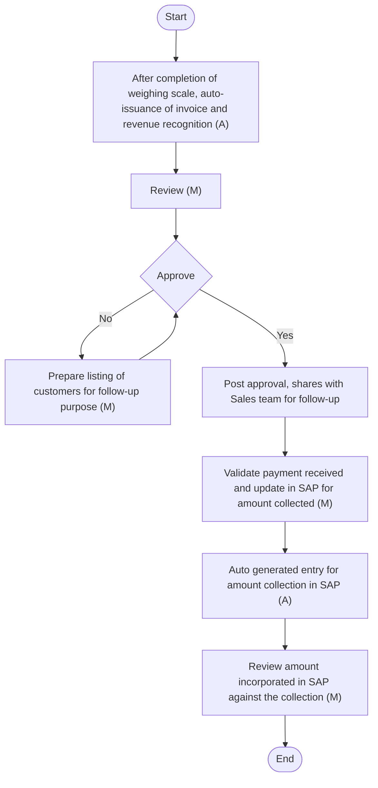

## REVENUE AND ACCOUNTS RECEIVABLES

Overview
At Arabian Mills, effective management of revenue and accounts receivables is essential for maintaining financial accuracy and operational efficiency. This manual encompasses various aspects of revenue and accounts receivables, including:
 Revenue Recognition: Revenue recognition is performed in accordance with IFRS, ensuring that revenue is recognised when control of goods or services is transferred to the customer and the amount can be reliably measured. Payment collection involves the systematic follow-up and receipt of payments from customers for goods and services provided.
 AR Ageing: Accounts Receivable (AR) ageing involves analysing the outstanding balances owed by customers, categorised by the length of time they have been outstanding. This process helps in managing collection schedules and maintaining good relationships with customers.
 Receivable Reconciliation and Balance Confirmation: Receivable reconciliation involves verifying the accuracy of accounts receivable balances by comparing internal records with customer statements. Balance confirmations are obtained from customers to ensure that the recorded balances are accurate and agreed upon.
 Expected Credit Loss and Write-Off: Expected Credit Loss (ECL) involves estimating the potential loss from accounts receivable that may not be collected, in accordance with IFRS 9. Write-offs are performed for receivables that are deemed uncollectible, ensuring that financial statements accurately reflect the company's assets.
#### Revenue Recognition
Policy
Arabian Mills policy on revenue recognition is in accordance with IFRS 15 “Revenue from contracts with customers”. Under IFRS 15 an entity recognizes revenue to depict the transfer of promised goods or services to customers in an amount that reflects the consideration to which the entity expects to be entitled in exchange for those goods or services.
The revenue is recognised when control of the goods is transferred to the customer, which is the time when these are dispatched from the warehouse of the Company or the goods are delivered to the customer, as the case may be. The revenue is recognised at an amount that reflects the consideration to which the Company expects to be entitled to in exchange for those goods or services.
Arabian Mills conducts sales transactions under three terms: advance payments, cash sales, and credit sales.
Majority of the customer sales are on cash or advance basis. The normal credit term is 30 to 60 days upon delivery.
Revenue is recognised once control has been transferred and there is no uncertainty regarding the collection of the consideration. Revenue from the sale of goods is recognised at the point in time when control of the goods is transferred to the customer, which is typically upon dispatch or delivery of the goods. The Company does not expect any returns of goods sold, and there is no history of any material returns for previously sold goods. Returns are recorded on an actual basis (if any). Revenue from the sale of goods is recognised at the point in time when control of the goods is transferred to the customer, which is typically upon dispatch or delivery of the goods.
The Company is engaged in the manufacturing of flour, feed, and bran. Revenue is recognised in accordance with IFRS 15, which stipulates that revenue is recognised when control of the goods is transferred to the customer. This transfer of control occurs either when the goods are dispatched from the Company's warehouse or when they are delivered to the customer, depending on the specific circumstances. Under IFRS 15, no separate contract assessment is required as all contracts are homogeneous in nature.
Revenue is recognised at the time the invoice is generated, equal to the value of the invoice. AR is measured at amortised cost in accordance with IFRS 15, equal to the invoice value plus VAT. When the Company's obligation includes delivering goods to the customer's premises, revenue should be recognised on the delivery date rather than the invoice date, provided the delivery date differs from the invoice date. The impact on revenue due to the difference between the delivery date and the invoice date is insignificant, and therefore no revenue adjustment is required.
Under advance against sales, payments are collected prior to the sale; cash sales are processed using a POS system, and credit sales are approved by the Sales Team in consultation with the CEO and CFO. The Sales Manager provides transaction details to the Sales & Collection Staff and AR team, who verify transactions against the bank statement daily. For cash collection, system-generated entries are recorded based on input provided by Sales & Collection Staff for cash collection. Invoices are auto-generated by the Warehouse team based on the sales order once weighing of the goods is completed and system generated entries are recorded for revenue recognition.
The Company considers whether there are other promises in the contract that are separate performance obligations to which a portion of the transaction price needs to be allocated (e.g., warranties, customer loyalty points). In determining the transaction price, the Company considers the effects of variable consideration, existence of a significant financing component, non-cash consideration, and consideration payable to the customer (if any) .
Variable consideration: The variable consideration is estimated at contract inception and constrained until it is highly probable that a significant revenue reversal in the amount of cumulative revenue recognised will not occur when the associated uncertainty with the variable consideration is subsequently resolved. The contracts with customers do not contain any provisions which may result in variable consideration. The Company uses the expected value method to estimate the variable consideration given the large number of contracts that have similar characteristics. The Company then applies the requirements on constraining estimates of variable consideration in order to determine the amount of variable consideration that can be included in the transaction price and recognised as revenue. A refund liability is recognised for the goods that are expected to be returned (i.e., the amount not included in the transaction price). A right of return asset (and corresponding adjustment to cost of sales) is also recognised for the right to recover the goods from the customer.
Significant financing component: Generally, the Company receives short-term advances from its customers. Using the practical expedient in IFRS 15, the Company does not adjust the promised amount of consideration for the effects of a significant financing component if it expects, at contract inception, that the period between the transfer of the promised good or service to the customer and when the customer pays for that good or service will be one year or less. Since majority all revenue is generated on cash basis, there is no financing component with amounts receivable from customers.
Non-cash consideration: Generally, there is no non-cash consideration against the sale of goods.
Contract balances
Contract Assets: A contract asset is the right to consideration in exchange for goods or services transferred to the customer. If the Company performs by transferring goods or services to a customer before the customer pays consideration or before payment is due, a contract asset is recognised for the earned consideration that is conditional. Contract assets are subject to impairment assessment.
Accounts receivables: A receivable is recognised if an amount of consideration that is unconditional is due from the customer (i.e., only the passage of time is required before payment of the consideration is due).
Contract liabilities: A contract liability is the obligation to transfer goods or services to a customer for which the Company has received consideration (or an amount of consideration is due) from the customer. If a customer pays consideration before the Company transfers goods or services to the customer, a contract liability is recognised when the payment is made, or the payment is due (whichever is earlier) . Contract liabilities are recognised as revenue when the Company performs under the contract.
Assets and liabilities arising from rights of return
Right of return assets: A right-of-return asset is recognised for the right to recover the goods expected to be returned by customers. The asset is measured at the former carrying amount of the inventory, less any expected costs to recover the goods and any potential decreases in value. The Company updates the measurement of the asset for any revisions to the expected level of returns and any additional decreases in the value of the returned products.
Refund liabilities: A refund liability is recognised for the obligation to refund some, or all of the consideration received (or receivable) from a customer. The Company’s refund liabilities arise from customers’ right of return and volume rebates. The liability is measured at the amount the Company ultimately expects it will have to return to the customer. The Company updates its estimates of refund liabilities (and the corresponding change in the transaction price) at the end of each reporting period.
Other policy:
 All POS transactions must be settled through approved banking channels and reconciled daily.
 Advance payments are recognised as 'Advance from customers' until control of the goods is transferred.
 All advances must be supported by valid documentation and linked to a future sale.
 Unutilised advances beyond 90 days must be flagged with the Sales team.
 Each invoice includes mandatory details such as invoice date, due date, itemised charges, applicable taxes (VAT), payment instructions (credit sale), and other relevant information.
 Duplicate or manual invoices outside the system are strictly prohibited unless explicitly authorised by the CFO and CEO under exceptional circumstances.
 Customers are assigned a predefined credit limit and credit period before any sales transactions are initiated, based on creditworthiness, financial review, and business risk assessment.
 Credit limits and credit periods are reviewed at least annually or upon significant changes in customer behaviour, financial condition, or payment performance.
 Sales orders are not processed if the customer exceeds the approved credit limit or has overdue invoices beyond the approved credit period, unless specific override approval is obtained from the CFO and CEO.
 No customer is provided with unlimited credit or open terms; all exceptions must be formally documented and justified by commercial or strategic rationale.
 Credit terms, including credit period and credit limit, are established based on customer risk assessment, historical payment behaviour, financial strength, and market credibility.
 The standard credit period for customers is defined by management (e.g., 30/45/60 days). Any deviation from this period requires pre-approval from the CFO and CEO.
 A maximum credit limit is set for each customer and periodically reviewed to ensure alignment with the customer’s current financial standing and transaction volume.
 No sales shall be made to customers exceeding their approved credit limit or credit period unless explicitly approved by CFO and CEO.
 Credit period and credit limit settings are maintained in SAP, with any modifications documented and justified.
 Customers with outstanding dues beyond their credit period are automatically placed on hold until dues are cleared, or an exception is approved.
 Credit policy applies to all customer accounts except for cash sales, advance against sales, and intercompany transactions.
Procedure
The following accounting procedures shall be followed:

| S No. | Procedure description | Responsibility | Frequency |
| --- | --- | --- | --- |
| 1 | **Payment Collection:**<br>• Arabian Mills conducts its sales transactions based on the following terms:<br>• Advance Against Sale : The Company collects an advance payment from its customers prior to the sale.<br>• Cash Sale : In this scenario, the customer pays for the goods at the point of purchase using a point-of-sale (POS) system.<br>• Credit Sale : For select customers, goods are sold on credit, allowing payment to be made at a later date. The Sales Team, in consultation with the senior management , approves the credit limit and collection period. Additionally, a promissory note is issued for credit sales to formalise the agreement and terms of payment.<br>• For advance payments and credit sales, the Sales Manager provides details of the customer's transferred amount to the Sales & Collection Staff and the AR team. These teams verify the transactions against the bank statement on a daily basis. For cash sales, the Sales Staff at the collection desk processes payments using the POS system. A system-generated entry records cash collection from the customers. | **Preparer: Sales and Collection T eam**<br>• Reviewer: A R Accountant | Frequency: As and when amount is collected (daily) |
| 2 | **Invoice Issuance**<br>• Based on the sales order, the Warehouse team issues an auto-generated invoice at the weighing scale. | Invoice issuance : Auto generated invoice issued by Warehouse t eam | Frequency: Daily once weighing is completed |
| 3 | **Recording of sales:**<br>• A system-generated entry records cash collection from customers and the recording of sales. The GL Manager and Accounting Manager review this entry.<br>• Entry for recording Sales – Cash Sales (Illustrative):<br>• Bank                                          Dr        115<br>• Customer (DC) Cr        115<br>• Customer (DC)                         Dr        115<br>• Customer (CL)                         Cr        115<br>• Customer (CL) Dr        115<br>• Sales (RC/RV) Cr        100<br>• VAT Sales Cr        15<br>• (date of invoice issuance and collection)<br>• Entry for recording Sales – Credit Sales (Illustrative):<br>• (date of invoice issuance)<br>• (date of collection)<br>• Entry for recording Sales – Advance against sales (Illustrative):<br>• Customer advance (DZ) Cr        115<br>• VAT Advance                           Dr          15<br>• VAT Sales Cr          15<br>• Customer Advance (DZ) Dr 46<br>• Customer Clearing (DA) Cr 46<br>• Vat Sales                                  Dr             6<br>• Vat Advance                            Cr             6<br>• Customer Clearing (D A ) Dr 46<br>• Sales (RC/RV) Cr 40<br>• VAT Sales Cr 6<br>• VAT payment/settlement is performed by Tax Tea. | **Recording: System Generated**<br>• Reviewer: GL Manager /<br>• Accounting Manager | Frequency: Daily |
| 4 | **F ollow - up with customers**<br>• The AR Manager extracts the ageing report and statement of accounts for all customers from SAP on a weekly basis, validates them, and shares them with the Accounting Manager for review. Once reviewed, the AR Manager shares the statement and the report with the Sales team via email for follow-up with the customers. The Sales Manager requests a statement of account, which includes the closing balance and transactions with selected customers, from the Accounts Receivable (AR) team on an ad hoc basis. | **Preparer: AR Accountant**<br>• Reviewer: AR Manager | Frequency: Ad-hoc basis |
| 5 | **Rebates:**<br>• At the end of each quarter, the GL Manager records the entry for rebates as per the approved contract or based on email approval from the CEO and Head of Sales. The Accounting Manager approves this entry. | **Preparer: GL Manager**<br>• Reviewer: Accounting Manager | Frequency: Quarterly |
| 6 | **Reconciliation of amount collected**<br>• The AR accountant reconciles the amount collected from POS sales, advance sales, and credit sales against the sales records and receipts on a daily basis.<br>• The AR Manager reviews, and the Accounting Manager approves the reconciliation.<br>• Discrepancies between recorded sales and actual collections are identified and investigated, ensuring all differences are resolved promptly. | **Preparer: AR Accountant**<br>• Reviewer: AR Manager<br>• Approver: Accounting Manager | Frequency: Daily |
| 7 | **Setting of credit terms**<br>• The Sales Head of Department initiates and proposes the sales credit terms (period, limit, etc.), which are reviewed by the Chief Financial Officer and then approved by the Chief Executive Officer. Post-approval, the IT team updates the credit terms in SAP and shares the information with relevant stakeholders. | **Initiated by : HOD Sales**<br>• Reviewer: CFO<br>• Approver: CEO | At the time of onboarding or revision |

Flow Chart

**[Diagram — PNG]:**

**Process Name:** Recording of payment collection & revenue recognition (Advance and Cash Sale)

**Roles / Swimlanes:**
- Sales & Collection Staff
- AR Team
- Warehouse Personnel (SCM P&P)
- GL and Accounting Manager

### Steps

| Step # | Role                                   | Action                                                                                                   | Decision/Next Step                                                                                       |
|--------|----------------------------------------|----------------------------------------------------------------------------------------------------------|----------------------------------------------------------------------------------------------------------|
| 1      | Sales & Collection Staff              | Start                                                                                                    | Next: Step 2                                                                                             |
| 2      | Sales & Collection Staff              | 1. Validate payment received and update in SAP for amount collected (M)                                 | Next: Step 3                                                                                             |
| 3      | Sales & Collection Staff              | Auto generated entry for amount collection in SAP (A)                                                   | Next: Step 4                                                                                             |
| 4      | AR Team                               | Review amount incorporated in SAP against the collection (M)                                            | Next: Step 5                                                                                             |
| 5      | Warehouse Personnel (SCM P&P)         | After completion of weighing scale, auto-issuance of invoice and revenue recognition entry (A)          | Next: Step 6                                                                                             |
| 6      | GL and Accounting Manager             | Review (M)                                                                                               | If Yes → Step 7 (End). No other branch/decision path is depicted.                                       |
| 7      | GL and Accounting Manager             | End                                                                                                      | —                                                                                                        |

### Mermaid.js Flow

```mermaid
graph TD

    A[Start<br/>Sales & Collection Staff] --> B[1. Validate payment received and update in SAP for amount collected (M)<br/>Sales & Collection Staff]
    B --> C[Auto generated entry for amount collection in SAP (A)<br/>Sales & Collection Staff]
    C --> D[Review amount incorporated in SAP against the collection (M)<br/>AR Team]
    D --> E[After completion of weighing scale, auto-issuance of invoice and revenue recognition entry (A)<br/>Warehouse Personnel (SCM P&amp;P)]
    E --> F[Review (M)<br/>GL and Accounting Manager]
    F -- Yes --> G[End<br/>GL and Accounting Manager]
```


**[Diagram — PNG]:**

**Process Name:** Recording of payment collection & revenue recognition (Credit Sale)

**Roles / Swimlanes:**
- Sales & Collection Staff
- AR Team
- Warehouse Department (SCM P&P)
- GL and Accounting Manager

### Steps

| Step # | Role                               | Action                                                                                          | Decision/Next Step                                                                                   |
|--------|------------------------------------|--------------------------------------------------------------------------------------------------|------------------------------------------------------------------------------------------------------|
| 1      | Sales & Collection Staff           | Start                                                                                           | Next: Step 2                                                                                         |
| 2      | Warehouse Department (SCM P&P)     | After completion of weighing scale, auto-issuance of invoice and revenue recognition (A)        | Next: Step 3                                                                                         |
| 3      | GL and Accounting Manager          | Review (M)                                                                                      | Next: Step 4                                                                                         |
| 4      | GL and Accounting Manager          | Approve                                                                                         | If **Yes** → Step 5. If **No** → Step 6.                                                             |
| 5      | AR Team                            | Post approval, shares with Sales team for follow-up                                             | Next: Step 7                                                                                         |
| 6      | AR Team                            | Prepare listing of customers for follow-up purpose (M)                                          | Next: Step 4 (listing sent back for approval again).                                                |
| 7      | Sales & Collection Staff           | Validate payment received and update in SAP for amount collected (M)                            | Next: Step 8                                                                                         |
| 8      | Sales & Collection Staff           | Auto generated entry for amount collection in SAP (A)                                           | Next: Step 9                                                                                         |
| 9      | AR Team                            | Review amount incorporated in SAP against the collection (M)                                    | Next: Step 10                                                                                        |
| 10     | AR Team                            | End                                                                                             | —                                                                                                    |

**Yes/No Branches from Decision Step "Approve":**

- From Step 4 **Approve**  
  - **Yes** → Step 5: *Post approval, shares with Sales team for follow-up*  
  - **No** → Step 6: *Prepare listing of customers for follow-up purpose (M)*, then back to Step 4 for re-approval.

### Mermaid.js Flow



#### AR Ageing
Policy
 Accounts Receivable (AR) ageing shall be reviewed weekly with classification buckets (e.g., 0–30 days, 31–60 days, etc.).
 Receivables over due-date of collection must be reviewed with Sales teams for recovery action.
 Ageing analysis shall be based on the due date, not the invoice date, unless otherwise required by contract.
 Long-outstanding balances exceeding the credit terms must be escalated to senior management for resolution.
 Disputed or suspended receivables must be segregated from normal ageing for reporting purposes.
 Ageing data must be reconciled with general ledger balances to ensure accuracy.
Procedure
The following accounting procedures shall be followed:

| S No. | Procedure description | Responsibility | Frequency |
| --- | --- | --- | --- |
| 1 | **Ageing analysis:**<br>• The AR Accountant extracts the accounts receivable ageing report from SAP on a weekly basis and shares it with the AR Manager for review.<br>• The AR Manager then forwards the ageing analysis to the Accounting Manager for a final review.<br>• Subsequently, the AR and Sales teams follow up with customers to collect outstanding balances. Finally, the ageing analysis is sent to the CFO for final review and decision-making. | **Preparer: AR Accountant**<br>• Reviewer: AR Manager, Accounting Manager ,<br>• CFO | Frequency: Weekly |

Flow Chart

**[Diagram — PNG]:**

**Process Name:** AR Ageing  

**Roles / Swimlanes:**
- AR Team  
- Accounting Manager  
- CFO  

### Steps

| Step # | Role              | Action                                                                                 | Decision/Next Step                 |
|--------|-------------------|----------------------------------------------------------------------------------------|------------------------------------|
| 1      | AR Team           | Start                                                                                  | Proceed to Step 2                  |
| 2      | AR Team           | Extract auto generated AR Ageing report from SAP (M)                                   | Proceed to Step 3                  |
| 3      | Accounting Manager| Review ageing report and approve listing of customers for follow-up purpose (M)       | Proceed to Step 4                  |
| 4      | CFO               | Final review (M)                                                                       | Proceed to Step 5 (End)            |
| 5      | CFO               | End                                                                                    | Process completed                  |

### Mermaid.js flow

```mermaid
graph TD
    A[Start<br/>(AR Team)] --> B[Extract auto generated AR Ageing report from SAP (M)<br/>(AR Team)]
    B --> C[Review ageing report and approve listing of customers for follow-up purpose (M)<br/>(Accounting Manager)]
    C --> D[Final review (M)<br/>(CFO)]
    D --> E[End<br/>(CFO)]
```

#### Balance confirmation and Receivable reconciliation
Policy
 At Arabian Mills, the reconciliation of AR and balance confirmation is performed as per following table:

| Process | Frequency |
| --- | --- |
| Balance Confirmation | Quarter-end and year-end |
| AR Reconciliation | Monthly |

 Quarter-end balance confirmations must be obtained for material customers (SAR 250,000 and above), or alternate audit evidence must be documented.
 Differences identified during reconciliation must be resolved within the reporting period.
 Only the Accounting department may authorise adjustments in AR balances following proper documentation.
 Receivable reconciliation must be part of the period-end close checklist and retained as audit evidence.
Procedure
The following accounting procedures shall be followed:

| S No. | Procedure description | Responsibility | Frequency |
| --- | --- | --- | --- |
| 1 | **Balance Confirmation and Reconciliation:**<br>• The AR Accountant sends an email to major customers on a quarterly basis, requesting balance confirmation by a specified date.<br>• The AR Accountant monitors customer responses and compares the confirmed balances with the Company's records. If any discrepancies arise, they are discussed internally with the AR Manager and Accounting Manager, and externally with the customer.<br>• Should adjustments be necessary, the reconciliation is shared with the CFO for final approval. | **Preparer: AR Accountant**<br>• Reviewer: GL Manager / Accounting Manager and AR Manager<br>• Approver: CFO | Frequency: Quarterly |


| S No. | Procedure description | Responsibility | Frequency |
| --- | --- | --- | --- |
| 2 | **Receivable Reconciliation:**<br>• GL and Sub-Ledger Reconciliation: The AR Accountant is responsible for performing the reconciliation of GL and sub-ledger balances on a monthly basis. This reconciliation is reviewed by the AR Manager, followed by a discussion and review & approval by the GL Manager/Accounting Manager. In case of any variance, necessary adjustments are incorporated in the period when the same is identified. | **Preparer: AR Accountant**<br>• Reviewer: AR Manager<br>• Approver: GL Manager / Accounting Manager | Monthly: Monthly |

#### Expected Credit Loss and Write-Off
Policy:
 ECLs are recognised in two stages. For credit exposures for which there has not been a significant increase in credit risk since initial recognition, ECLs are provided for credit losses that result from default events that are possible within the next 12-months (a 12-month ECL). For those credit exposures for which there has been a significant increase in credit risk since initial recognition, a loss allowance is required for credit losses expected over the remaining life of the exposure, irrespective of the timing of the default (a lifetime ECL).
 For accounts receivables, the Company applies a simplified approach in calculating ECLs. Therefore, the Company does not track changes in credit risk, but instead recognises a loss provision based on lifetime ECLs at each reporting date. The Company has established a provision matrix that is based on its historical credit loss experience, adjusted for forward-looking factors specific to the debtors and the economic environment.
 ECL assessments must be performed at least quarterly, and more frequently in volatile credit environments.
 Provisioning must consider historical loss trends, customer risk ratings, and macroeconomic factors.
 Write-offs must be authorised by CFO, CEO, and Board and supported by evidence.
 Reversal of ECL or write-offs shall be made only upon actual receipt or legal recovery.
 The Accounting department shall maintain documentation of ECL assumptions and model parameters.
 Write-off does not relieve collection responsibility unless legally deemed unrecoverable.
Procedure
The following accounting procedures shall be followed:

| S No. | Procedure description | Responsibility | Frequency |
| --- | --- | --- | --- |
| 1 | **Data Extraction:**<br>• The AR GL Manager obtains the AR ageing analysis sheet, AR subledger, and other relevant information from the AR team and shares it with the Accounting & Finance Team or ECL Consultant on a quarterly basis. | Documents shared by : GL Manager | Frequency: Quarterly |
| 2 | **ECL Computation:**<br>• The Accounting & Finance Team or ECL Consultant prepares the quarterly ECL working file in accordance with IFRS and shares it with the GL Manager and AR Manager for review. These managers validate the working and suggest adjustments if needed. Finally, the adjusted file is sent to the CFO for approval. | **Preparer: Accounting & Finance Team or E CL Consultant**<br>• Reviewer: AR Manager and GL Manager<br>• Approver: CFO | Frequency: Quarterly |
| 3 | **Write-offs**<br>• If any customer balance requires a write-off, the CFO and CEO review the working and the Board approves the write-off. | **Preparer: AR Manager and Accounting Manager**<br>• Reviewer: CFO and CEO<br>• Approver: Board of Directors | Frequency: If required |
| 4 | **Recording of the entry:**<br>• After obtaining approval, the GL Manager records the entry in SAP. The Accounting Manager reviews it, and the CFO approves it. | **Preparer: GL Manager**<br>• Reviewer: Accounting Manager<br>• Approver: CFO | Frequency: As and when approved |

Flow Chart

**[Diagram — PNG]:**

**Process Name:** Expected Credit Loss  

**Roles / Swimlanes:**
- GL Manager
- Accounting Manager
- Accounting & Finance Team or ECL Consultant
- CFO

### Steps

| Step # | Role | Action | Decision/Next Step |
|--------|------|--------|--------------------|
| 1 | GL Manager | Start | Proceed to Step 2. |
| 2 | GL Manager | Share data of AR Ageing, AR subledger | Proceed to Step 3. |
| 3 | Accounting & Finance Team or ECL Consultant | Perform ECL working based on information shared (M) | Proceed to Step 4. |
| 4 | Accounting Manager | Review the working (M) | Proceed to Step 5. |
| 5 | CFO | Approve | **Yes:** Proceed to Step 6. **No:** Return to Step 3 (Perform ECL working based on information shared (M)). |
| 6 | Accounting Manager | Record the adjust entry in SAP (M) | Proceed to Step 7. |
| 7 | Accounting Manager | Review the adjustment based on approved ECL computation (A) | Proceed to Step 8. |
| 8 | CFO | Approve | **Yes:** Proceed to Step 9 (End). **No:** No alternate path is shown in the source diagram. |
| 9 | CFO | End | Process ends. |

### Mermaid.js Diagram

```mermaid
graph TD

    A((Start))
    B[Share data of AR Ageing, AR subledger]
    C[Perform ECL working based on information shared (M)]
    D[Review the working (M)]
    E{Approve}
    F[Record the adjust entry in SAP (M)]
    G[Review the adjustment based on approved ECL computation (A)]
    H{Approve}
    I((End))

    A --> B --> C --> D --> E
    E -- Yes --> F
    E -- No --> C
    F --> G --> H
    H -- Yes --> I
    %% No alternate path from H on "No" is depicted in the source diagram.
```