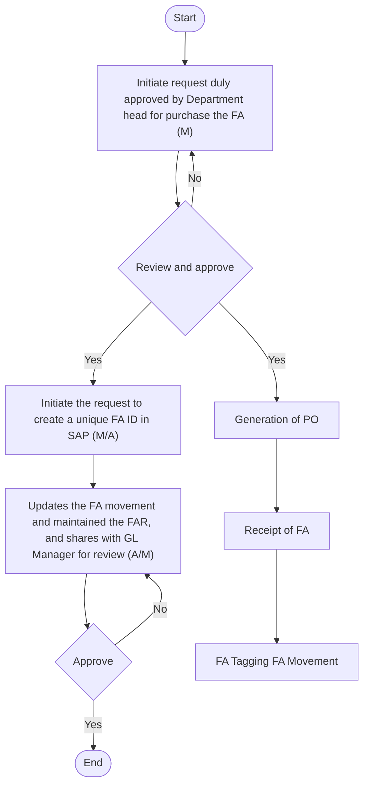
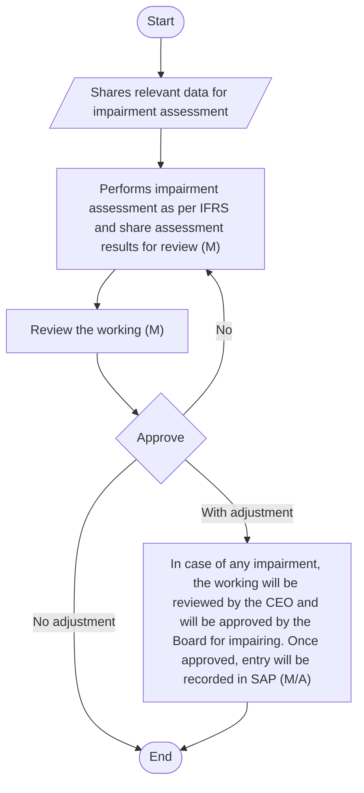

## FIXED ASSETS MANAGEMENT PPE, INTANGIBLES and CWIP

Overview
Fixed Assets at Arabian Mills consist of Property, Plant, and Equipment (PPE), Intangibles, and Capital Work-in-Progress (CWIP).
 PPE includes buildings, plant and machinery, computer equipment, furniture and fittings, motor vehicles, and capital spares.
 Intangible assets comprise software, goodwill, and brand.
 CWIP encompasses assets under construction and software under development.
At Arabian Mills, effective management of FA is essential for maintaining financial accuracy and operational efficiency. This manual encompasses various aspects of fixed assets management, including:
 FA Unique ID, Procurement and Tracking: Each fixed asset is assigned a unique identification number for tracking purposes. Procurement involves acquiring assets in accordance with company policies, and tracking ensures that assets are accurately recorded and monitored throughout their lifecycle.
 FA Capital Work-in-Progress: Capital Work-in-Progress (CWIP) or Asset Under Construction (AUC) involves tracking the costs associated with assets that are under construction or development but not yet ready for use. This process ensures accurate recording of expenditures until the asset is completed and capitalised.
 FA - Identification of Cost (Direct and Indirect) to be Allocated to Fixed Assets: Costs associated with fixed assets, including direct costs (e.g., purchase price, installation) and indirect costs (e.g., transportation, handling), are identified and allocated to the respective assets. This ensures accurate valuation and accounting of fixed assets.
 FA – Depreciation and Amortization: Depreciation and amortization involve systematically allocating the cost of tangible and intangible assets over their useful lives. This process ensures that the expense is recognised in the financial statements, reflecting the consumption of the asset's economic benefits.
 FA – Reconciliation and Adjustments: Reconciliation involves verifying the accuracy of fixed asset records by comparing internal records with physical assets and fixed assets register. Adjustments are made to correct any discrepancies, ensuring accurate accounting.
 FA - Impairment of Assets: Impairment involves assessing fixed assets for any indication that their carrying amount may not be recoverable. If an asset is impaired, its carrying amount is reduced to its recoverable amount, ensuring accurate valuation in the financial statements.
 FA – Disposals: Disposals involve removing fixed assets from the company's records when they are sold, retired, or otherwise disposed of. This process ensures that gains or losses on disposals are accurately recorded and reported.
 FA - Capital Spares: Capital spares involve tracking and managing spare parts that are capitalised and used for maintaining fixed assets. This ensures that the costs associated with capital spares are accurately recorded and allocated.
 PPE - Asset Retirement Obligation: Asset Retirement Obligation (ARO) involves recognising and measuring the legal obligation associated with retiring fixed assets. This process ensures that the costs of retiring assets are accurately estimated and recorded.
 Intangible – Mapping of Research and Development Phase Against Intangible: Mapping involves identifying and tracking the costs associated with the research and development phases of intangible assets. This ensures that costs are accurately allocated and capitalised in accordance with IFRS.
#### FA Unique ID, Procurement and Capitalization Criteria
Policy
 At Arabian Mills, fixed assets are managed with unique IDs to ensure accurate tracking and reporting. When acquiring a fixed asset, the user must request for the creation of a FA ID in SAP and Fixed Asset Manager is responsible for its creation.
 Assets must be procured through approved channels and recorded only when control is transferred.
 Tagging of physical assets is mandatory within 30 days of capitalization.
 The asset register must be updated for additions, disposals, transfers, and reclassifications.
 All physical assets must be verified periodically through asset verification processes.
 Assets without a valid procurement trail or approval must not be capitalized.
 Software, brands, and intangible assets must follow equivalent tagging via system tracking.
 Capitalisation threshold is the minimum cost at which an item of fixed assets shall be recognised in the statement of financial position. Small value assets costing individually less than the capitalization threshold are charged to the statement of profit or loss in the period acquired.
 The capitalization threshold for an individual item or piece of equipment is SAR 1,000. Individual items below SAR 1,000 are expensed unless these items are used as part of the cost of the larger PPE item in which case their individual cost will be included in the capitalized cost of the larger PPE asset. For individually insignificant items (such as tools) the recognition criteria is applied to the aggregate value.
Procedure
The following accounting procedures shall be followed:

| S . No | Procedure description | Responsibility | Frequency |
| --- | --- | --- | --- |
| 1 | **FA Master Data - Creation of FA Unique ID:**<br>• When a department intends to acquire a fixed asset, the department user sends an email to the Fixed Asset Manager requesting the creation of a FA ID in SAP. The email includes detailed information such as the asset description, FA classifications (PPE or Intangibles), category (e.g., Furniture, Capital Spares, etc.), location, expected useful life, and other relevant details prior to the generation of a Purchase Order (PO). Upon receipt of all necessary information, the Fixed Asset Manager initiates the request to create a unique FA ID in SAP, which is linked to the PO upon its generation (and if its functional assets should be linked with equipment number or create new one, by co-ordinating with maintenance department) . The Fixed Asset Manager communicates the FA ID to the respective department via email for reference. | **Request initiated by: Respective Department User**<br>• FA ID created on SAP: FA Manager | Frequency: As and when request is initiated |
| 2 | **Generation of PO**<br>• Please refer to the Supply Chain (SC) policy and procedure document for guidance on generating a PO. The FA ID is shared at the time of PO generation. | Refer SC P&P |  |
| 3 | **Receipt of Fixed Assets**<br>• Upon receipt of the fixed asset, the receiving department user at the relevant location is responsible for generating a Goods Receipt Note (GRN) in SAP, in accordance with SC policy and procedures. The following system-generated entry is recorded in SAP at the time of GRN generation:<br>• Fixed Assets           Dr.   xx<br>• GR/IR                     Cr.   xx | Refer SC P&P |  |
| 4 | **Tagging**<br>• Once the fixed asset is received by the warehouse department, all assets are tagged with identifiers matching the FA unique ID created in SAP. The maintenance team affixes tags to all fixed assets. | Refer Maintenance P&P |  |
| 5 | **Asset Tracking/Movement**<br>• In the event of any movement of fixed assets from one location to another, the Supply Chain team and/or Maintenance team notify the Fixed Asset Manager and GL Manager. The Fixed Asset Manager updates the relevant information in the FA Master Data, which the GL Manager and Accounting Manager review. | **Updated performed by : FA Manager**<br>• Reviewer: GL Manager and Accounting Manager | Frequency: Monthly |
| 6 | **FAR maintenance and validation**<br>• The FA Manager maintains the Fixed Asset Register (FAR) and verifies the accuracy and completeness of acquisitions, disposals, depreciation, and changes. The GL Manager reviews this register monthly, and the Accounting Manager approves it. | **Preparer: FA Manager**<br>• Reviewer: GL Manager<br>• Approver: Accounting Manager | Frequency: Monthly |

Flow-Chart

**[Diagram — PNG]:**

**Process Name:** FA Unique ID, Procurement and Tracking  

**Roles / Swimlanes:**
- User  
- FA Manager  
- Accounting Manager  
- Supply Chain P&P  
- Maintenance P&P  

### Steps

| Step # | Role              | Action                                                                                                      | Decision/Next Step                                                                                                                                                          |
|--------|-------------------|-------------------------------------------------------------------------------------------------------------|-----------------------------------------------------------------------------------------------------------------------------------------------------------------------------|
| 1      | User              | Start                                                                                                      | Proceeds to Step 2.                                                                                                                                                         |
| 2      | User              | Initiate request duly approved by Department head for purchase the FA (M)                                  | Proceeds to Step 3.                                                                                                                                                         |
| 3      | FA Manager        | Review and approve                                                                                          | If **Yes** → Step 4 and also proceeds to Step 8. If **No** → returns to Step 2.                                                                                            |
| 4      | FA Manager        | Initiate the request to create a unique FA ID in SAP (M/A)                                                 | Proceeds to Step 5.                                                                                                                                                         |
| 5      | Accounting Manager| Updates the FA movement and maintained the FAR, and shares with GL Manager for review (A/M)               | Proceeds to Step 6.                                                                                                                                                         |
| 6      | Accounting Manager| Approve                                                                                                    | If **Yes** → Step 7 (End). If **No** → returns to Step 5.                                                                                                                  |
| 7      | Accounting Manager| End                                                                                                        | No further steps indicated.                                                                                                                                                 |
| 8      | Supply Chain P&P  | Generation of PO                                                                                           | Proceeds to Step 9.                                                                                                                                                         |
| 9      | Supply Chain P&P  | Receipt of FA                                                                                              | Proceeds to Step 10.                                                                                                                                                        |
| 10     | Maintenance P&P   | FA Tagging FA Movement                                                                                     | No further steps indicated.                                                                                                                                                 |

### Mermaid.js Flow



#### FA Capital work-in-progress
Policy
 AUC/CWIP is managed to ensure accurate tracking and reporting. At Arabian Mills, CWIP is classified separately as a major asset class within PPE.
 Once a decision is made at Arabian Mills that an asset (e.g., construction of a building, warehouse, etc.,) is commercially viable, subsequent eligible costs incurred to bring the asset to the location and condition necessary for it to be capable of operating in the manner intended by management will be capitalized within capital work-in-progress. The user must request for the creation of a AUC ID in SAP and GL Manager is responsible for its creation.
 CWIP is not depreciated and are stated at cost less accumulated impairment losses, if any.
 When a CWIP asset is determined as available for use based on the issuance of the Asset Completion Certificate, it is transferred from CWIP to PPE asset and the depreciation commences.
 Further, these costs are transferred to PPE once the asset is available for use i.e., when the asset is in the location and condition necessary for it to be capable of operating in the manner intended by the management. CWIP of a retired or abandoned project is expensed out in the statement of profit or loss.
Procedure
The following accounting procedures shall be followed:

| S No. | Procedure description | Responsibility | Frequency |
| --- | --- | --- | --- |
| 1 | **Creation of AUC- ID:**<br>• For a fixed asset that is constructed over time, an Asset Under Construction ID (AUC-ID) is created in SAP. When a department intends to acquire such a fixed asset, the department user sends an email to the GL Manager to request the creation of an AUC-ID, and to the FA Manager to request the creation of an FA-ID. Once the AUC-ID is created, the GL Manager shares it with the requesting user via email. | **Request initiated by: Respective Department User**<br>• AUC ID created on SAP: GL Manager | Frequency: As and when request is initiated |
| 2 | **Generation of PO**<br>• Please refer to the Supply Chain (SC) policy and procedure document for guidance on generating a PO. The AUC-ID is shared at the time of PO generation. | Refer SC P&P |  |
| 3 | **Receipt of Goods or Services**<br>• Upon receipt of the goods/assets or services, the receiving department user at the relevant location is responsible for generating a Goods Receipt Note (GRN) in SAP, in accordance with SC policy and procedures. The following system- generated entry is recorded in SAP at the time of GRN generation:<br>• Expense Dr.   xx<br>• GR/IR                                    Cr.   xx | Refer SC P&P |  |
| 4 | **Capitalisation of CWIP**<br>• At the end of each month, the GL Manager runs an automatic entry for each CWIP order to reverse the expense and capitalise it to the CWIP account. The following entry is generated after running the automatic entry:<br>• CWIP Dr.   xx<br>• Expense                                  Cr.   xx<br>• The Accounting Manager reviews and approves this entry. | **Preparer: GL Manager**<br>• Reviewer/Approver: Accounting Manager | Frequency: Monthly |
| 5 | **Capitalisation of CWIP into PPE**<br>• Completion Notification:<br>• The Maintenance Department keeps the GL Manager informed about the construction status of the assets. Once asset construction is completed, the Maintenance Manager notifies the GL Manager and Accounting Manager via email regarding the completion of the asset construction.<br>• Certificate of Completion:<br>• The Maintenance Department, Requesting Department, and the supplier submit a certificate of completion to denote that the work on the CWIP has been completed and the asset can be recorded.<br>• Asset Capitalisation Process:<br>• Once the asset is fully complete and the completion certificate is provided, the process follows a similar procedure to the procurement of a complete asset, and the CWIP entry is reversed. The GL Manager reviews the certificate and runs the system-generated accounting entry for asset capitalisation, which the Accounting Manager approves.<br>• SAP has functionality that allows the CWIP entry to be reversed and capitalised to actual fixed assets, either fully or partially. The following entry is generated once the asset is capitalised:<br>• Fixed Assets Dr.   xx<br>• CWIP                                  Cr.   xx<br>• The amount parked in CWIP, where an AUC-ID is generated, becomes nil and transfers to the FA ID. The FA Manager fills in details of the fixed asset, such as useful life, date of completion, cost centre, etc. | **Informed by : Maintenance Manager and Respective User**<br>• CWIP reversed by : GL Manager<br>• Reviewer/Approver: Accounting Manager | Frequency: Post receipt of completion certificate |


**[Diagram — PNG]:**

**Process Name:** FA Capital work-in-progress  

**Roles / Swimlanes:**
- User  
- GL Manager  
- Accounting Manager  
- Supply Chain P&P  

---

### Steps

| Step # | Role              | Action                                                                                                      | Decision/Next Step                                                                                                                                                          |
|--------|-------------------|-------------------------------------------------------------------------------------------------------------|-----------------------------------------------------------------------------------------------------------------------------------------------------------------------------|
| 1      | User              | **Start**                                                                                                   | Proceed to Step 2.                                                                                                                                                          |
| 2      | User              | Initiate request duly approved by Department head for Asset under Construction (M).                        | Proceed to Step 3 (Review and approve by GL Manager).                                                                                                                       |
| 3      | GL Manager        | **Decision:** Review and approve.                                                                          | If **Yes**, proceed to Step 4. If **No**, return to Step 2 (Initiate request duly approved by Department head for Asset under Construction (M)).                           |
| 4      | GL Manager        | Initiate the request to create a unique FA ID in SAP (M/A).                                                | Proceed to Step 5.                                                                                                                                                          |
| 5      | Supply Chain P&P  | Generation of PO.                                                                                           | Proceed to Step 6.                                                                                                                                                          |
| 6      | Supply Chain P&P  | Receipt of goods/service and recording of system generated entry for GR/IR.                                | Proceed to Step 7.                                                                                                                                                          |
| 7      | GL Manager        | Capitalization of expense on monthly basis to CWIP/AUC (A).                                                | After completion, move to Step 9 (CWIP Transfer to FA (A)); this step converges with documentation from Step 8.                                                            |
| 8      | User              | Arrange for completion certificate and relevant documentation including approval from maintenance team (N). | After completion, move to Step 9 (CWIP Transfer to FA (A)); this step converges with capitalization from Step 7.                                                            |
| 9      | GL Manager        | CWIP Transfer to FA (A).                                                                                    | Proceed to Step 10 (Approve).                                                                                                                                               |
| 10     | Accounting Manager| **Decision:** Approve.                                                                                      | If **Yes**, proceed to Step 11 (End). If **No**, go back to Step 8 (Arrange for completion certificate and relevant documentation including approval from maintenance team (N)). |
| 11     | Accounting Manager| **End**                                                                                                     | Process terminates.                                                                                                                                                         |

---

### Mermaid.js Flow

```mermaid
graph TD

    start([Start])
    u1[Initiate request duly approved by Department head for Asset under Construction (M)]
    gl_dec1{Review and approve}
    gl2[Initiate the request to create a unique FA ID in SAP (M/A)]
    scp1[Generation of PO]
    scp2[Receipt of goods/service and recording of system generated entry for GR/IR]
    gl3[Capitalization of expense on monthly basis to CWIP/AUC (A)]
    user2[Arrange for completion certificate and relevant documentation including approval from maintenance team (N)]
    gl4[CWIP Transfer to FA (A)]
    acc_dec2{Approve}
    end_node([End])

    start --> u1
    u1 --> gl_dec1

    gl_dec1 -- Yes --> gl2
    gl_dec1 -- No --> u1

    gl2 --> scp1
    scp1 --> scp2
    scp2 --> gl3

    gl3 --> gl4
    user2 --> gl4

    gl4 --> acc_dec2

    acc_dec2 -- Yes --> end_node
    acc_dec2 -- No --> user2
```

#### FA- Identification of cost (direct and indirect) to be allocated fixed assets
Policy
 PPE is stated at cost less accumulated depreciation and accumulated impairment losses, if any. Historical cost includes expenditure that is directly attributable to the acquisition of the item.
 Cost of PPE comprises:
  o Purchase price, including import duties and non-refundable purchase taxes, after deducting trade discounts and rebates;
  o Any costs directly attributable to bringing the asset to the location and condition necessary for it to be capable of operating in the manner intended by management; and
  o The initial estimate of the costs of dismantling and removing the item and restoring the site on which it is located, the obligation which Arabian Mills incurs either when the item is acquired or as a consequence of having used the item during a particular period.
 When significant parts of property, plant and equipment are required to be replaced at intervals, the Company depreciates them separately based on their specific useful lives.
 Likewise, when a major inspection is performed, its cost is recognised in the carrying amount of the property, plant and equipment as a replacement if the recognition criteria are satisfied.
 All other repair and maintenance costs are recognised in statement of profit or loss and other comprehensive income as incurred. The present value of the expected cost for the decommissioning of an asset after its use (if any) is included in the cost of the respective asset if the recognition criteria for a provision are met, which is not applicable for the Company.
 Subsequent expenditure relating to an item of property, plant and equipment that has already been recognized should be added to the carrying amount of an asset or recognized as a separate asset when it is expected to bring economic benefits over more than 12 months (capital expenditures). All other subsequent expenditures (revenue expenditures) should be recognized as an expense in the period in which it is incurred.
 Subsequent expenditures including major renovations are only recognized as a separate asset when:
  o It is probable that the cost of such additional expenditures can be measured reliably;
  o The expenditures will result in a material increase in original productive capacity of the asset significantly beyond that obtained by normal repair and maintenance; and
  o The expenditure will increase the useful life resulting in additional future economic benefits associated with the item.
 IAS 23 defines borrowing costs as interest and other costs that a Company incurs in connection with the borrowing of funds; and defines a qualifying asset as an asset that necessarily takes a substantial period of time to get ready for its intended use or sale . Borrowing costs that are directly attributable to the acquisition, construction or production of a qualifying asset should be capitalized as part of the cost of that asset until such time as the asset is substantially ready for its intended use. To the extent that an entity borrows funds specifically for the purpose of obtaining a qualifying asset, the entity shall determine the amount of borrowing costs eligible for capitalisation as the actual borrowing costs incurred on that borrowing during the period less any investment income on the temporary investment of those borrowings. Where general financing facilities are used for construction of assets, borrowing cost eligible for capitalization is calculated by applying a capitalization rate to the expenditures on that asset. The capitalization rate will be the weighted average of the borrowing costs applicable to the borrowings that are outstanding during the period, other than borrowings made specifically for the purpose of obtaining a qualifying asset.
 Capitalization of borrowing costs begins on the commencement date, which is the date when all the following conditions are met:
o expenditures for the asset are incurred;
o borrowing cost is incurred; and
o activities that are necessary to prepare the asset for its intended use or sale are undertaken.
 The capitalization of borrowing costs is suspended during extended periods in which the Arabian Mills suspends active development of a qualifying asset, and it ceases when substantially all the activities necessary to prepare the qualifying asset for its intended use or sale are complete.
 Normal repairs and maintenance costs should be expensed. These are costs incurred to keep existing PPE in good day-to-day working condition but do not extend its life or improve the quantity or quality of its output, and where the same costs will be incurred again for the same purpose on the same asset within 12 months.
 Certain parts of PPE may require replacement at regular intervals. Arabian Mills shall recognise the cost of replacing the part as PPE if the recognition criteria is met. Consequently, the carrying amount of those parts that are replaced is derecognised. Expenditure that does not meet the recognition criteria shall be charged to the statement of profit or loss in the corresponding period.
 Leasehold improvements that meet the recognition criteria are amortized over the useful life of the asset or the lease term, whichever is lower. When a lease is terminated before the leasehold improvement is fully depreciated, the net book value of the improvement shall be written off in full on the date of lease termination.
Procedure
The following accounting procedures shall be followed:

| S No. | Procedure description | Responsibility | Frequency |
| --- | --- | --- | --- |
| 1 | **Cost of FA:**<br>• Direct Cost : When a fixed asset is to be procured, the cost of the asset is capitalised automatically based on the amount agreed upon during the PO stage.<br>• Indirect Cost : If the user plans to incur costs directly associated with the procurement of the fixed asset (e.g., transportation charges), these costs are mapped under the same category as the fixed asset.<br>• A single FA unique ID is generated by the FA Manager for all POs mapped for the acquisition of fixed assets. Both direct and indirect costs are capitalised to the fixed asset under the FAR. | • Cost capitalization : System generated .<br>• Reviewer: FA Manager , GL Manager, and Accounting Manager | Frequency: At the time of acquisition |
| 2 | **Subsequent cost**<br>• If any expenditure is incurred (e.g., major repair or inspection cost) that meets the definition of PPE, the PO for the corresponding expenditure is mapped to the FA in a similar manner. The user defines the useful life, which can be up to the remaining useful life of the main fixed asset as of the date of the service. The HOD of the User Department, the Procurement Team, and the FA Manager review these details. | • Cost capitalization: System generated .<br>• Reviewer: FA Manager, GL Manager, and Accounting Manager | Frequency: At the time of incurring of subsequent cost |

#### FA – Depreciation and Amortization
Policy
 Depreciation expense is to be based on the useful life of assets. Each asset should be depreciated to reduce its cost to its residual value by the end of its expected useful life, using straight-line method. The definition of residual value is the estimated disposal proceeds which could be obtained if the asset were already of the age and in the condition, it is expected to be in at the end of its useful life. At Arabian Mills, the estimated useful lives of the assets for the calculation of depreciation are as follows:

| Categories | Useful lives |
| --- | --- |
| Buildings | 25 years |
| Plant and machinery | 10 - 25 years |
| Computer equipment | 3 years |
| Furniture and fittings | 6.67 - 10 years |
| Motor Vehicles | 5 years |
| Capital spares | 15 years |

 At Arabian Mills, the estimated residual values, expected useful lives of assets, method of depreciation is reviewed at least annually, and adjusted prospectively, if appropriate.
 Depreciation of plant is calculated on the useful lives of the components of the principal asset. Certain inventories meeting the definition of PPE (Capital Spares) are also depreciation on the useful lives of particular component.
 Useful life is defined in terms of how long the use of the asset is expected, taking into account asset replacement policy, rather than the total physical life of the asset. Arabian Mills should estimate the realistic expected useful lives of assets in order to determine the depreciation rate to be applied. Following factors should be considered in determining the useful life of the asset :
  o Expected usage of the asset, by reference to the asset’s expected capacity or physical output;
  o Expected physical wear and tear, which depends on operational factors e.g., the number of shifts for which the asset is to be used and the repair and maintenance programme, and the care and maintenance of the asst while idle;
  o Technical or commercial obsolescence arising from changes or improvements in production, or from a change in the market demand for the product or service output of the asset; and
  o Legal or similar limits on the use of the asset, such as the expiry dates of related leases.
 An item of property, plant and equipment and any significant part initially recognised is derecognised upon disposal or when no future economic benefits are expected from its use or disposal. Any gain or loss arising on derecognition of the asset (calculated as the difference between the net disposal proceeds and the carrying amount of the asset) is included in the statement of profit or loss and other comprehensive income when the asset is derecognised.
Procedure
The following accounting procedures shall be followed:

| S No. | Procedure description | Responsibility | Frequency |
| --- | --- | --- | --- |
| 1 | **Depreciation / Amortisation Computation :**<br>• At the end of each month, the FA Manager runs depreciation/amortisation, wherein depreciation is recomputed automatically by SAP as per the fields defined during Asset Capitalisation. The following entry is recorded automatically:<br>• Depreciation Dr.   xx<br>• Acc, Depreciation Cr.   xx | System Generated Entry | Frequency: Monthly |
| 2 | **Depreciation / Amortisation - Validation**<br>• At the end of each month, the FA Manager also recomputes the depreciation amount as per the Fixed Asset Register (FAR) and ensures that it matches the SAP results. The GL Manager reviews this working, and the Accounting Manager approves it. | **Preparer: FA Manager**<br>• Reviewer: GL Manager , Accounting Manager | Frequency: Monthly |

Flow Chart

**[Diagram — PNG]:**

**Process Name:** Depreciation and Amortization  

**Roles / Swimlanes:**

- FA Manager  
- GL Manager and Accounting Manager  

---

### Steps

| Step # | Role                              | Action                                           | Decision/Next Step                    |
|--------|-----------------------------------|--------------------------------------------------|---------------------------------------|
| 1      | FA Manager                        | Start                                            | Proceeds to Step 2                    |
| 2      | FA Manager                        | Runs depreciation and amortization in SAP (A)    | Proceeds to Step 3                    |
| 3      | FA Manager                        | Shares FAR for review (M)                        | Proceeds to Step 4                    |
| 4      | GL Manager and Accounting Manager | Review and validate the FAR (M)                  | Proceeds to Step 5                    |
| 5      | GL Manager and Accounting Manager | End                                              | Process terminates                    |

- There are no explicit Yes/No or conditional branches; the flow is linear from Start to End.

---

```mermaid
graph TD

    A[Start<br/>Role: FA Manager] --> B[Runs depreciation and amortization in SAP (A)<br/>Role: FA Manager]
    B --> C[Shares FAR for review (M)<br/>Role: FA Manager]
    C --> D[Review and validate the FAR (M)<br/>Role: GL Manager and Accounting Manager]
    D --> E[End<br/>Role: GL Manager and Accounting Manager]
```

#### FA – Reconciliation and Adjustments
Policy
 At Arabian Mills, FA reconciliation and adjustment are conducted to ensure accurate financial reporting.
 The fixed asset register must be reconciled monthly with the general ledger.
 Any reconciling differences must be explained, adjusted, and approved.
 Capitalization and disposal entries must be reflected in both the asset register and the books.
 Adjustments for physical verification losses or impairments must follow formal approval processes.
 Accumulated depreciation must be separately maintained and updated monthly.
 Manual adjustments must be authorised and documented.
 Reconciliations must be reviewed by an Accounting Manager before the period close.
Procedure
The following accounting procedures shall be followed:

| S No. | Procedure description | Responsibility | Frequency |
| --- | --- | --- | --- |
| 1 | **Reconciliation – FAR vs GL Balance**<br>• The FA Manager downloads the Fixed Asset Register at the end of each month and recomputes the depreciation to ensure that the recorded depreciation for each month matches the recomputed depreciation. The GL Manager reviews the calculations and compares the gross and net balances of fixed assets, as well as the depreciation for the month, with the GL balance to ensure full reconciliation. The Accounting Manager then approves this reconciliation. | **Preparer: FA Manager**<br>• Reviewer: GL Manager<br>• Approver: Accounting Manager | Frequency: Monthly |
| 2 | **Reconciliation – Opening to Closing Movement**<br>• On a quarterly basis, the GL Manager prepares a movement schedule of fixed assets from the opening to the closing balance and reconciles it with the GL balance. This movement schedule includes the following details :<br>• Gross block<br>• Depreciation for the period<br>• Reclassification from CWIP to FA<br>• Reclassification from Capital Spares to PPE<br>• Impairment<br>• Net block<br>• The Accounting Manager reviews and approves this reconciliation. | **Preparer : GL Manager**<br>• Reviewer and a pprover: Accounting Manager | Frequency: Quarterly |
| 3 | **Physical count - FA**<br>• The Maintenance Team, led by the Maintenance Manager and in the presence of finance team members (AP or AR Staff), performs an annual physical count of fixed assets. A listing is extracted from SAP, and the count is performed by comparing the physical fixed assets with the SAP listing. The report of the physical count is shared with the Head of the Maintenance Department, FA Manager, GL Manager, and Accounting Manager.<br>• The tag number pasted on the asset is the same as the FA Unique ID mapped in SAP. | **Preparer: Maintenance Manager**<br>• Presence of Finance Staff | Frequency: Annual |
| 4 | **Adjustments**<br>• Generally, there are no adjustments. However, if adjustments are required, the FA Manager or GL Manager inspects the adjustment and prepares the adjustment entry. The Accounting Manager reviews this entry, and the CFO approves it. | **Preparer: GL Manager / FA Manager**<br>• Reviewer: Accounting Manager<br>• Approver : CFO | Frequency: As and when required |

Flow Chart

**[Diagram — PNG]:**


#### FA - Impairment of assets
Policy
 At Arabian Mills, impairment assessments are conducted annually to ensure accurate financial reporting and compliance with IFRS.
 An impairment loss is the amount by which the carrying amount of an asset or a cash-generating unit exceeds its recoverable amount. Impairment is an expense charged to statement of profit or loss when the book value of a non-current asset or assets is no longer supported by future economic benefits, usually due to either an unexpected occurrence or change in circumstances, e.g., site closure, or to adverse changes in the external market.
 In assessing whether there is any indication that an asset may be impaired, following are some examples of external and internal indicators which can be considered along with other factors:
External sources of information
  o During the period, an asset's market value has declined significantly more than would be expected as a result of the passage of time or normal use;
  o The technological, market, economic or legal environment in which Arabian Mills operates, or in the market to which an asset is dedicated, has deteriorated significantly during the period and/or is expected to deteriorate significantly during the future life of the asset;
  o The carrying amount of net assets of the Company is more than its market capitalization; and
  o Market interest rates or other market rates of return on investment have increased during the period, and those increases are likely to affect the discount rate used in calculating an asset value-in-use and decrease the assets recoverable amount materially.
Internal sources of information
  o Evidence is available of obsolescence or physical damage of an asset, or that there are quality issues with its output because the asset is not functioning properly;
  o Significant changes with an adverse effect on the Company have taken place during the period or are expected to take place in the near future, in the extent to which, or manner in which, an asset is used or is expected to be used. These changes include plans to discontinue or restructure the operation to which an asset belongs or to dispose of an asset before the previously expected date; and
  o Evidence is available from internal reporting that indicates that the economic performance of an asset is, or will be, worse than expected.
 If there is any indication that an asset may be impaired, recoverable amount shall be estimated for the individual asset. If it is not possible to estimate the recoverable amount of the individual asset, an entity shall determine the recoverable amount of the cash-generating unit to which the asset belongs (the asset’s cash-generating unit) . A cash-generating unit should be defined as the smallest identifiable group of assets that directly generates cash inflows from continuing use.
 If any indication exists, or when annual impairment testing for an asset is required, the Company estimates the asset’s recoverable amount. An asset’s recoverable amount is the higher of an assets or CGU’s fair value less costs of disposal and its value in use. The recoverable amount is determined for an individual asset, unless the asset does not generate cash inflows that are largely independent of those from other assets or groups of assets. When the carrying amount of an asset or CGU exceeds its recoverable amount, the asset is considered impaired and is written down to its recoverable amount.
 In assessing value in use, the estimated future cash flows are discounted to their present value using a pre-tax discount rate that reflects current market assessments of the time value of money and the risks specific to the asset. In determining fair value less costs of disposal, recent market transactions are considered. If no such transactions can be identified, an appropriate valuation model is used. These calculations are corroborated by valuation multiples, quoted share prices for publicly traded companies or other available fair value indicators.
 The Company bases its impairment calculation on most recent budgets calculations, which are prepared separately for each of the Company’s CGUs to which the individual assets are allocated. These budgets and forecast calculations generally cover a period of five years. A long-term growth rate is calculated and applied to project future cash flows after the fifth year. Impairment losses of continuing operations are recognised in the statement of profit or loss expense categories consistent with the function of the impaired asset.
 For assets excluding goodwill, an assessment is made at each reporting date to determine whether there is an indication that previously recognised impairment losses no longer exist or have decreased. If such indication exists, the Company estimates the assets or CGU’s recoverable amount. A previously recognised impairment loss is reversed only if there has been a change in the assumptions used to determine the asset’s recoverable amount since the last impairment loss was recognised. The reversal is limited so that the carrying amount of the asset does not exceed its recoverable amount, nor exceed the carrying amount that would have been determined, net of depreciation, had no impairment loss been recognised for the asset in prior years. Such reversal is recognised in the statement of profit or loss unless the asset is carried at a revalued amount, in which case, the reversal is treated as a revaluation increase.
 Goodwill is tested for impairment annually as at 31 December and when circumstances indicate that the carrying value may be impaired. Impairment is determined for goodwill by assessing the recoverable amount of each CGU (or group of CGUs) to which the goodwill relates. When the recoverable amount of the CGU is less than its carrying amount, an impairment loss is recognised. Impairment losses relating to goodwill cannot be reversed in future periods.
 The GL Manager shares necessary financial data with the Accounting & Finance Team or Consultant, who prepares the impairment working. This working is reviewed and validated by the GL Manager and Accounting Manager, and then shared with the CFO for final approval.
 Impairment, if any, must be reviewed by the CFO and CEO and approved by the Board for writing off.
Procedure
The following accounting procedures shall be followed:

| S No. | Procedure description | Responsibility | Frequency |
| --- | --- | --- | --- |
| 1 | **Data Sharin g :**<br>• The GL Manager shares the actual financial statement, budgeted financial statement, discount rate, growth rate, and other requested information with the Accounting & Finance Team or Consultant on an annual basis for the assessment of Goodwill Impairment. | Information provided by : GL Manager | Frequency: Annual |
| 2 | **Impairment Computation:**<br>• The Accounting & Finance Team or Consultant prepares the impairment working on an annual basis in accordance with IFRS and shares the working file with the GL Manager and Accounting Manager for their review. The GL Manager and Accounting Manager validate the working shared by the Accounting & Finance Team or Consultant and suggest appropriate adjustments in the computation, if required. | **Preparer: Accounting & Finance Team or C onsultant**<br>• Reviewer: GL Manager and Accounting Manager | Frequency: Annual |
| 3 | **Final review and approval:**<br>• The GL Manager or Accounting Manager shares the final working of the impairment computation (if any) with the CFO for final review and approval. | **Preparer: Accounting & Finance Team or C onsultant**<br>• Reviewer: GL Manager and Accounting Manager<br>• Approver: CFO | Frequency: Annual |
| 4 | **Adjustment**<br>• In case of any impairment, the CFO and CEO review the working, and the Board approves the impairment for writing off. | **Preparer: GL Manager and Accounting Manager**<br>• Reviewer: CFO and CEO<br>• Approver: Board of Directors | Frequency: If required |

Flow Chart

**[Diagram — PNG]:**

**Process Name:** Impairment  

**Roles / Swimlanes:**
- GL Manager
- Accounting Manager
- Accounting & Finance Team or Consultant
- CFO  

---

### Steps

| Step # | Role                                      | Action                                                                                                                                                               | Decision/Next Step                                                                                                                                                                                                                  |
|--------|-------------------------------------------|----------------------------------------------------------------------------------------------------------------------------------------------------------------------|-------------------------------------------------------------------------------------------------------------------------------------------------------------------------------------------------------------------------------------|
| 1      | GL Manager                               | **Start**                                                                                                                                                            | Proceeds to Step 2.                                                                                                                                                                                                                |
| 2      | GL Manager                               | Shares relevant data for impairment assessment.                                                                                                                      | Proceeds to Step 3 (Accounting & Finance Team or Consultant performs impairment assessment as per IFRS and shares assessment results for review).                                                                                  |
| 3      | Accounting & Finance Team or Consultant  | Performs impairment assessment as per IFRS and share assessment results for review (M).                                                                              | Proceeds to Step 4 (Accounting Manager reviews the working). If later not approved at Step 5 (decision “No”), process returns from Step 5 back to this Step 3 for reassessment / rework.                                           |
| 4      | Accounting Manager                       | Review the working (M).                                                                                                                                              | Proceeds to Step 5 (CFO approval decision).                                                                                                                                                                                         |
| 5      | CFO                                      | **Decision:** Approve. (Decision diamond labeled “Approve”; one return arrow labeled “No”; one forward branch labeled “No adjustment”; one branch labeled “With adjustment”.)                            | - If **No** (not approved): return to Step 3 (Performs impairment assessment as per IFRS and share assessment results for review).  <br> - If **Approve – No adjustment**: go to Step 7 (End). <br> - If **Approve – With adjustment**: go to Step 6. |
| 6      | CFO (involving CEO and Board per text)   | In case of any impairment, the working will be reviewed by the CEO and will be approved by the Board for impairing. Once approved, entry will be recorded in SAP (M/A). | After this adjustment and approvals, proceeds to Step 7 (End).                                                                                                                                                                      |
| 7      | CFO                                      | **End.**                                                                                                                                                             | Process terminates.                                                                                                                                                                                                                |

---

### Mermaid.js Flow



#### FA – Disposals
Policy
 Disposals must be supported by proper documentation, including approval and buyer information.
 Gains or losses on disposal must be recognised in the profit and loss statement.
 Retired or obsolete assets must be removed from the asset register upon disposal.
 Disposal proceeds must be traced to bank receipts to ensure accuracy.
 No partial disposals shall be recorded unless identifiable and separately valued.
 Disposals to related parties must follow arm’s length pricing and disclosure rules.
 Disposal of fully depreciated assets must be reported and documented for audit purposes.
 Disposal must be approved by Asset Exclusion Committee.
Procedure
The following accounting procedures shall be followed:

| S No. | Procedure description | Responsibility | Frequency |
| --- | --- | --- | --- |
| 1 | **Need for disposal**<br>• In case there is a need for disposal, the relevant department provides a list of the assets to be disposed of, specifying the reason (out of service, damaged, or no longer in use) or suggesting the possibility of the Company benefitting from the disposal of such assets. | Preparer: Relevant Department User | Frequency: As and when required |
| 2 | **Asset Removal from Service Request Form**<br>• The relevant department fills out the Asset Removal from Service Request form when there is a need for disposal and shares it with the respective location Branch Manager. The Branch Manager then shares the necessary details with the Asset Exclusion Committee. | **Preparer: Relevant Department User**<br>• Reviewer: Branch Manager | Frequency: As and when FA is expected to be sold |
| 3 | **Sharing l ist of assets with the Committee**<br>• Such asset listings need to be shared with the Asset Exclusion Committee, which consist s of the following members:<br>• Members of Maintenance Department<br>• Members of Finance Department<br>• Members of the department utilising the asset<br>• Branch Manager<br>• This Committee is headed by CEO. | **Preparer: Branch Manager**<br>• Reviewer: Asset Exclusion Committee | Frequency: As and when FA is expected to be sold |
| 4 | **Recording entry for sale**<br>• On approval for selling fixed assets (FA) as a scrap sale, the Supply Chain department arranges for the bidding of the assets. The following entry is recorded at the time of sale:<br>• Bank / Receivable                 Dr. xx<br>• Fixed Assets                          Cr. xx<br>• Accumulated Depreciation Dr. xx<br>• Loss/Gain on sale of FA         Dr/Cr. xx<br>• The entry for depreciation is recomputed automatically by the system until the date of sale. In the case of dismantling, the receivable or bank account is not debited; the rest of the entry remains the same. The Maintenance SCM department performs the dismantling of fixed assets. The FA Manager parks the entry, which the GL Manager and Accounting Manager review, and the CFO approves. | **Preparer: FA Manager**<br>• Reviewer : GL Manager, Accounting Manager<br>• Approver: CFO | Frequency: Date of sale |

Flow Chart

**[Diagram — PNG]:**

**Process Name:** FA Disposal  

**Roles / Swimlanes:**
1. GL Manager  
2. Accounting Manager  
3. Asset Exclusion Committee  
4. Accounting Team  

---

### Steps

| Step # | Role                       | Action                                                                 | Decision/Next Step |
|--------|----------------------------|-------------------------------------------------------------------------|--------------------|
| 1      | GL Manager                 | Start                                                                  | Proceed to Step 2  |
| 2      | GL Manager                 | Determine the need for disposal and prepare list of FA to be disposed (M) | Proceed to Step 3  |
| 3      | GL Manager                 | Update the information in asset removal form and shares with Branch Manager | Proceed to Step 4  |
| 4      | Accounting Manager         | Review the working (M)                                                 | Proceed to Step 5  |
| 5      | Asset Exclusion Committee  | **Decision:** Approved                                                 | If **Yes** → Step 6; If **No** → return to Step 2 (loop back) |
| 6      | Accounting Team            | Accounting team to record the entry for disposal of FA (A/M)           | Proceed to Step 7  |
| 7      | Accounting Team            | End                                                                    | —                  |

---

### Yes/No Branches from Decision “Approved”

- **Yes:**  
  - From “Approved” → “Accounting team to record the entry for disposal of FA (A/M)” → “End”.

- **No:**  
  - From “Approved” → back to “Determine the need for disposal and prepare list of FA to be disposed (M)”.

---

### Mermaid Diagram

```mermaid
graph TD

    A1[Start]
    A2[Determine the need for disposal and prepare list of FA to be disposed (M)]
    A3[Update the information in asset removal form and shares with Branch Manager]
    B1[Review the working (M)]
    C1{Approved}
    D1[Accounting team to record the entry for disposal of FA (A/M)]
    D2[End]

    A1 --> A2
    A2 --> A3
    A3 --> B1
    B1 --> C1

    C1 -- Yes --> D1
    D1 --> D2

    C1 -- No --> A2
```

#### FA- Capital Spares
Policy
 Spare parts, stand-by equipment, and servicing equipment are normally treated as inventory and expensed as consumed. However, spare parts, stand-by equipment, and servicing equipment should be treated as PPE when they meet the definition of PPE. These are depreciated over their expected useful life.
 At Arabian Mills, in determining whether spare parts are Capital Spares, the spare parts possess all the following characteristics:
o Value is SAR 1,000 or more (the threshold for recognition of capital spare parts);
o Vital to the continued operation of the facility (failing of which could cause operations to be disrupted);
o Expected service life is more than one accounting period; and
o Designation as a critical spare part in SAP by the Maintenance Department.
 All other spares are categorised as Normal Spares. Issuance of any spare requires approval of operations department.
Procedure
The following accounting procedures shall be followed:

| S No. | Procedure description | Responsibility | Frequency |
| --- | --- | --- | --- |
| 1 | **Issuance of critical s pare p arts (PPE)**<br>• As and when required, the maintenance department issues spare parts for replacement or utilisation in the plant and machinery, specifically for the main underlying Property, Plant, and Equipment (PPE). Once spare parts are issued for utilisation, a system-generated entry is recorded for the net book value of critical spare parts (PPE) as follows:<br>• PPE (P&M)                         Dr.   xx<br>• Acc Dep (P&M)                  Cr.   xx<br>• Critical Spare Parts (PPE)         Cr.   xx<br>• Accumulated Depreciation D r.   xx<br>• T he General Ledger Manager and the Accounting Manager review and approve the entry . | **Entry: System generated**<br>• Reviewer : GL Manager<br>• Approver: Accounting Manager | Frequency: At the time of issuance of ca p i t al spares |

#### PPE - Asset Retirement Obligation
Policy
Asset Retirement Obligation (ARO) is recognised and measured based on the present value of expected future costs to retire an asset, in accordance with IAS 16. At Arabian Mills, there are no Asset Retirement Obligations.
#### Intangible – Mapping of research and development phase against intangible
Policy
Intangible assets are defined as identifiable non-monetary assets that cannot be seen, touched, or physically measured, which are created through time and/or effort and that are identifiable as a separate asset. They include software, brand, goodwill, and any other intangibles. Only intangible assets acquired from 3rd parties are capitalized, except for certain approved production process and software project development costs. Expenditure incurred on internal projects to generate other intangible assets that have not yet obtained regulatory approval is expensed as incurred. An intangible asset arising from development (or from the development phase of an internal project) shall be recognised if, and only if, an entity can demonstrate all of the following :
 The technical feasibility of completing the intangible asset so that it will be available for use or sale;
 Its intention to complete the intangible asset and use or sell it;
 Its ability to use or sell the intangible asset;
 How the intangible asset will generate probable future economic benefits;
 The availability of adequate technical, financial, and other resources to complete the development and to use or sell the intangible asset; and
 Its ability to measure reliably the expenditure attributable to the intangible asset during its development.
Arabian Mills shall recognize an intangible asset when all of the following criteria are met:
 The asset to be recorded should be identifiable;
 The asset to be recorded should be controlled by the Company;
 It is probable that future economic benefit attributable to the asset will flow to Company; and
 The cost of the intangible asset to be recorded should be reliably measurable.
Currently, there are no costs associated with the mapping of the research and development phase against intangible assets.