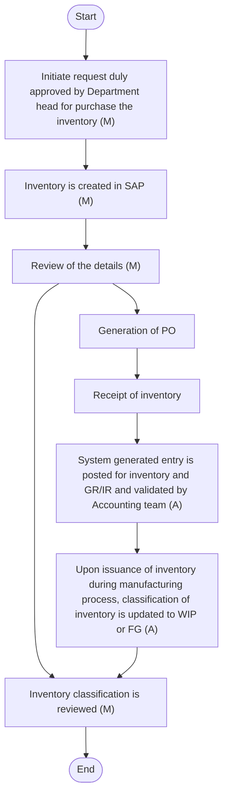
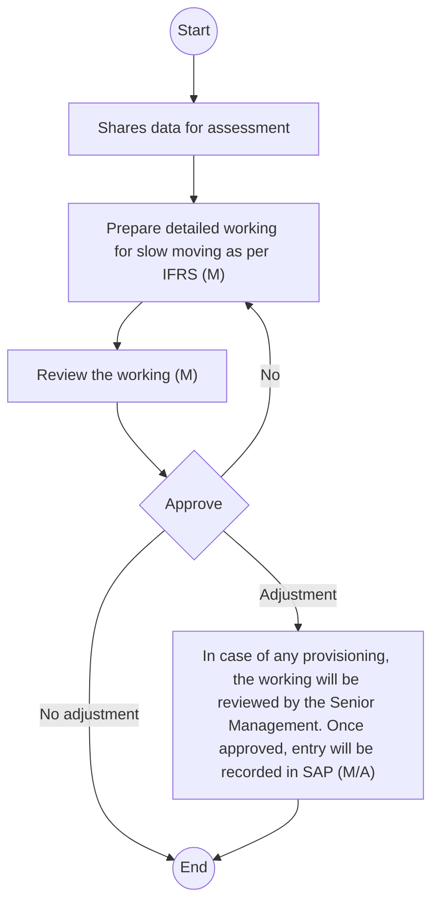

## INVENTORY AND COGS

Overview
At Arabian Mills, effective management of inventory and cost of goods sold (COGS) is essential for maintaining financial accuracy and operational efficiency. This manual encompasses various aspects of inventory and COGS, including:
 Inventory Classification: Inventory is classified into categories such as raw materials (RM), work-in-progress (WIP), and finished goods (FG). This classification helps in tracking and managing inventory at different stages of production.
 Identification of Cost and Basis of Allocation of Cost Across Stages of Inventory (RM - WIP - FG): Costs associated with inventory are identified and allocated across different stages of production, including raw materials, work-in-progress, and finished goods. This process ensures accurate valuation and accounting of inventory at each stage.
 Determination of Cost of Goods Manufactured and Cost of Goods Sold: The cost of goods manufactured (COGM) and cost of goods sold (COGS) are determined by calculating the total production costs and allocating them to the goods sold. This process ensures accurate recording of production costs and sales expenses.
 Inventory, Spare Parts Valuation and Valuation Methods and NRV Assessment: Inventory and spare parts are valued using appropriate valuation methods (weighted average for Arabian Mills). Net Realisable Value (NRV) assessment is performed to ensure that inventory is valued at the lower of cost or NRV, reflecting its recoverable amount.
 Obsolete and Slow Moving / Non-Moving Inventory, Write-Offs, and Disposal: Obsolete and slow-moving or non-moving inventory is identified, and appropriate write-offs and disposal actions are taken. This process ensures that inventory records accurately reflect the usable and saleable inventory.
 Issuance of Spare Parts: Spare parts are issued for maintenance and repair activities, ensuring that the costs associated with spare parts are accurately recorded and allocated.
 Inventory-in-Transit: Inventory-in-transit involves tracking and managing inventory that is in the process of being transported from suppliers. This ensures accurate recording and valuation of inventory during transit.
Policy
Inventories consist of Raw Material (wheat and others), finished goods, spare parts, and goods in transit. Cost is determined as follows:
o Finished goods: Direct cost of raw materials as well as overheads, the latter of which is allocated based on the normal level of activity. Finished goods are stated at cost or net realisable value, whichever is lower with provision for any obsolete or slow-moving goods. Net realisable value is the estimated selling price in the ordinary course of business, less estimated costs of completion and the estimated costs necessary to make the sale. Costs are assigned to individual items of inventory on the basis of weighted average method.
o Wheat (Raw material) Weighted average.
o Other raw materials Weighted average.
o Spare parts Costs are assigned to individual items of inventory on the basis of weighted average method. At each reporting date, inventories are assessed for impairment. If inventory is impaired, the carrying amount is reduced by its cost; the impairment loss is recognised immediately in statement of profit or loss.
o Goods in-transit Inventories are stated at cost plus freight and other related expense.
#### Inventory Creation
Policy
 Inventories consist of Raw Material (wheat and others), finished goods, spare parts, and goods in transit.
 Inventory creation & classification must align with the chart of accounts and SAP master data.
 Misclassification of inventory items must be identified and corrected during periodic reviews.
 Non-production materials must not be included in RM/WIP/FG categories.
 Inventory held for third parties must not be recorded unless legal ownership exists.
 Separate provision must be maintained for obsolete or damaged inventory.
Procedure
The following accounting procedures shall be followed:

| S No. | Procedure description | Responsibility | Frequency |
| --- | --- | --- | --- |
| 1 | **Inventory Master Data**<br>• When a department intends to purchase inventory, the department user requests the Procurement team to create an inventory ID in SAP, specifying its classification as raw material, spare parts, or packing material which is reviewed by Costing Manager . This inventory ID is linked to the PO at the time of generation. The Costing Manager communicates the inventory ID to the respective department for reference. | **Request initiated by: Respective Department User**<br>• ID reviewed on SAP: Costing Manager | Frequency: As and when request is initiated |
| 2 | **Generation of PO**<br>• Refer Supply Chain (SC) policy and procedure document for generation of PO. | Refer SC P&P |  |
| 3 | **Receipt of goods/service**<br>• U pon receipt of goods or services, the receiving department user generates a Goods/Service Receipt Note (GSRN) in SAP according to SC policy and procedure. The following system-generated entry is recorded in SAP at the time of generation of the GSRN:<br>• Inventory a/c OR Expense a/c     Dr.   xx<br>• GR/IR                                        Cr.   xx<br>• The GR/IR balance is reversed upon receipt of the invoice, as per Accounts Payable (AP) procedures. | Refer SC P&P |  |
| 4 | **Classification of inventory –WIP and FG**<br>• When raw materials are issued for the production of flour, they are consumed in the manufacturing process. The system records the consumption of raw materials, reducing the raw material inventory.<br>• As production progresses, the inventory of Work in Progress (WIP) is created, representing the partially completed goods still in the production process. The inventory of WIP is calculated based on actual cost at the end of each month.<br>• Upon completion of the production process, the WIP inventory converts into Finished Goods (FG). The system records the consumption of WIP, and the inventory of FG is created based on actual cost at the end of each month.<br>• The inventory is initially valued using the standard cost method, but adjustments are made based on the weighted average for reporting purposes. | **System Generated Process**<br>• Reviewer: Costing Manager | Frequency: Monthly |

Flow Chart

**[Diagram — PNG]:**

**Process Name:** Inventory Creation

**Roles / Swimlanes:**
- User
- Procurement Department
- Costing Manager
- Supply Chain P&P
- Operations

---

### Steps

| Step # | Role                | Action                                                                                                                                   | Decision/Next Step                                                                                                            |
|--------|---------------------|------------------------------------------------------------------------------------------------------------------------------------------|-------------------------------------------------------------------------------------------------------------------------------|
| 1      | User                | Start                                                                                                                                   | Next: Step 2                                                                                                                  |
| 2      | User                | Initiate request duly approved by Department head for purchase the inventory (M)                                                       | Next: Step 3                                                                                                                  |
| 3      | Procurement Department | Inventory is created in SAP (M)                                                                                                         | Next: Step 4                                                                                                                  |
| 4      | Costing Manager     | Review of the details (M)                                                                                                               | Next: Step 5 (to continue purchasing process) and Step 9 (for inventory classification review)                               |
| 5      | Supply Chain P&P    | Generation of PO                                                                                                                        | Next: Step 6                                                                                                                  |
| 6      | Supply Chain P&P    | Receipt of inventory                                                                                                                    | Next: Step 7                                                                                                                  |
| 7      | Supply Chain P&P / Accounting team | System generated entry is posted for inventory and GR/IR and validated by Accounting team (A)                                               | Next: Step 8                                                                                                                  |
| 8      | Operations          | Upon issuance of inventory during manufacturing process, classification of inventory is updated to WIP or FG (A)                       | Next: Step 9                                                                                                                  |
| 9      | Costing Manager     | Inventory classification is reviewed (M)                                                                                                | Next: Step 10 (End). If further issuance of inventory occurs, process may loop back from Step 8 to Step 9 for re‑classification. |
| 10     | —                   | End                                                                                                                                     | —                                                                                                                             |

---



#### Allocation of the Cost (RM - WIP - FG)
Policy
 At Arabian Mills, costs are allocated into three categories: Raw Material (RM) Cost, Labour Cost, Machine Cost, and Overhead Cost.
 Costs must be allocated consistently across inventory stages using standard costing initially and the weighted-average cost method at the end of each month. Further, Activity-Based Costing (ABC) is applied to allocate overhead costs more precisely by linking expenses to the specific activities that drive them.
 Direct materials, labour, machine cost, and production overheads must be included in the valuation of work-in-progress (WIP) and finished goods (FG).
 Administrative and abnormal costs must be excluded from inventory valuation.
 Joint cost allocations must be based on logical and consistent bases, such as volume or weight.
 Inventory cost flows must be aligned with operational processes and verified at month-end.
 Cost must be determined as follows:
o Finished goods: Direct cost of raw materials as well as overheads, the latter of which is allocated based on the normal level of activity. Finished goods are stated at cost or net realisable value, whichever is lower with provision for any obsolete or slow-moving goods. Net realisable value is the estimated selling price in the ordinary course of business, less estimated costs of completion and the estimated costs necessary to make the sale. Costs are assigned to individual items of inventory on the basis of weighted average method.
o Wheat (Raw material) Weighted average.
o Other raw materials Weighted average.
o Spare parts Costs are assigned to individual items of inventory on the basis of weighted average method. At each reporting date, inventories are assessed for impairment. If inventory is impaired, the carrying amount is reduced by its cost; the impairment loss is recognised immediately in statement of profit or loss.
o Goods in-transit Inventories are stated at cost plus freight and other related expense.
 Costing team review all costs associated with inventory and ensure that only eligible costs related to raw materials, labour, and overheads are allocated in accordance with IAS 2.
Procedure
The following accounting procedures shall be followed:

| S No. | Procedure description | Responsibility | Frequency |
| --- | --- | --- | --- |
| 1 | **Identification of Cost**<br>• Costs are divided into three categories:<br>• RM Cost,<br>• Labour Cost,<br>• Machine cost, and<br>• Overhead .<br>• RM Cost : The actual cost incurred by the Company for procuring goods as per approved purchase orders.<br>• Labour Cost : Consists of wages paid to the labour directly involved in production.<br>• Overhead Cost : Includes transportation costs, utility bills, rental costs, depreciation on plant and machinery, and other indirect costs.<br>• The costing manager determines these costs based on the GL and after discussion with the GL team, allocates costs to respective categories (RM, Labour, Overhead). The costing manager discusses the identified costs and allocation methods with the CFO. The CFO reviews and approves the cost allocations.<br>• A solution cycle is created in the system (SAP) which specifies the cost to be allocated to inventory. In case a new GL or new cost centre is created, the costing manager identifies and updates the same in the system. | **System Generated**<br>• Reviewer : Costing Manager<br>• Reviewer and Approver : CFO | Frequency: Monthly for the new update |
| 2 | **Creation of BOM**<br>• The production process begins with the creation of a Bill of Materials (BOM) for each final product, specifying the RM percentage required for each product. The operations team then creates a production order in SAP, specifying the raw materials, labour hours to be used, distribution costs, and the mill where production take s place which is reviewed by Costing Manager keeping CFO informed .<br>• After production is completed, the operations team confirms the total quantity of RM consumed, total quantity of FG produced, and total time consumed to produce that order. | **System Generated**<br>• Information provided by : Operations Team<br>• Reviewed by: Costing Manager<br>• Informed: CFO | Frequency: As and when production order is created |
| 3 | **Allocation of labour and overhead**<br>• Allocations are based on the number of hours defined by the operations team, using standard costing and adding variances at the end of each month based on actual hours worked. Quantity and price variances are allocated based on the difference between standard quantity and actual quantity. It is important to note that production orders are independent of sales orders. The entire allocation process is performed by SAP; however, the Costing Manager monitors the computations in an Excel workbook, which the CFO reviews and approves.<br>• The s tandard cost is updated on a monthly basis, based on the data from the previous month. | **System Generated Working**<br>• Reviewer : Costing Manager<br>• Reviewer and Approver: CFO | Frequency: Monthly |

Flow Chart

**[Diagram — PNG]:**

**Process Name:** Allocation of the Cost  

**Roles / Swimlanes:**
- Costing Manager
- CFO  

### Steps

| Step # | Role           | Action                                                                                                           | Decision/Next Step                                                                                       |
|--------|----------------|------------------------------------------------------------------------------------------------------------------|----------------------------------------------------------------------------------------------------------|
| 1      | Costing Manager | Start                                                                                                           | Proceed to Step 2                                                                                        |
| 2      | Costing Manager | Costing Manager identifies all GL which will be allocated to inventory and shares for review and approval (M)  | Move to Step 3 (Approve decision by CFO)                                                                |
| 3      | CFO            | Approve                                                                                                          | If **Yes** → Step 4. If **No** → return to Step 2                                                       |
| 4      | Costing Manager | Update GL in SAP for allocation of cost (A/M)                                                                  | Proceed to Step 5                                                                                        |
| 5      | CFO            | Review overall cost of goods sold and inventory valuation monthly (M)                                           | Proceed to Step 6                                                                                        |
| 6      | CFO            | End                                                                                                              | Process completed                                                                                        |

**Yes/No Branches from Decision Step 3 (Approve):**

- **Yes** → Step 4: Update GL in SAP for allocation of cost (A/M)
- **No** → Step 2: Costing Manager identifies all GL which will be allocated to inventory and shares for review and approval (M)

```mermaid
graph TD

  subgraph CM[Costing Manager]
    S([Start])
    A[Costing Manager identifies all GL which will be allocated to inventory and shares for review and approval (M)]
    C[Update GL in SAP for allocation of cost (A/M)]
  end

  subgraph CFO[CFO]
    D{Approve}
    E[Review overall cost of goods sold and inventory valuation monthly (M)]
    F([End])
  end

  S --> A
  A --> D
  D -- No --> A
  D -- Yes --> C
  C --> E
  E --> F
```

#### Determination of cost of goods manufactured and cost of goods sold
Policy
 Cost of goods manufactured (COGM) must include raw materials consumed, direct labour, and overheads allocated to production.
 Cost of goods sold (COGS) must be recognised upon transfer of control or delivery of goods to customers i.e., upon issuance of the delivery note.
 Inventory valuation must reflect actual costs incurred and must be reconciled monthly.
 Any inventory variances (standard vs actual) must be analysed and adjusted as needed.
Procedure
The following accounting procedures shall be followed:

| S No. | Procedure description | Responsibility | Frequency |
| --- | --- | --- | --- |
| 1 | **Cost of goods Manufactured**<br>• The cost of goods manufactured is the total cost of raw materials consumed, labour, machine cost, and overhead.<br>• A solution cycle is created in the system (SAP) which specifies the cost to be allocated to inventory.<br>• Costing Manager ensures that:<br>• All production orders are confirmed and settled.<br>• After the solution cycle, the production order is fixed with new activity costs, ensuring that all related costs are loaded onto the inventor y , and all costs are correctly allocated to direct and indirect cost centres.<br>• Fix actual activity costs in the production order and settle them.<br>• Allocate the variance between actual cost and standard cost to Inventory and COGS.<br>• Production orders should be confirmed by the production team in the same period.<br>• At the beginning of each month, inventory is valued at standard cost, which is adjusted at the end of each month based on variance.<br>• The cost of goods manufactured is computed automatically in the system. The Costing Manager monitors these computations in an Excel workbook. | System Generated | Frequency: Batch-wise |
| 2 | **Recording of c ost of goods sold**<br>• The value of inventory is computed by the system. When goods are sold, the Warehouse Staff issues a delivery note specifying the quantity and type of inventory being sold, which is linked to the sales order. Upon issuance of the delivery note, a system-generated entry is recorded to recognise the cost of goods sold and to reduce the inventory accordingly. | **System Generated**<br>• Delivery note prepared by Warehouse Staff | Frequency: Entry is recorded once delivery note is generated |

#### Inventory, spare parts valuation and valuation methods and NRV Assessment
Policy
 Inventories must be valued at the lower of cost or net realizable value (NRV) in accordance with IAS 2.
 NRV testing must be performed at least quarterly or upon identification of obsolescence.
 Write-downs to NRV must be recorded through inventory provision accounts.
 The inventory valuation method (weighted average) must be consistently applied across periods.
Procedure
The following accounting procedures shall be followed:

| S No. | Procedure description | Responsibility | Frequency |
| --- | --- | --- | --- |
| 1 | **Valuation Method**<br>• The Company follows the weighted average cost method for computing the value of inventory, which is automatically calculated by the system.<br>• During production, standard costing determines the value of inventory. At the end of each month, the inventory value is recalculated using the weighted average cost method.<br>• Variances between standard and actual quantities and prices are allocated over the inventory and COGS through SAP.<br>• The Operations team updates the quantity of goods consumed and finished goods produced based on the production order. | System Generated |  |
| 2 | **NRV Testing**<br>• The GL Manager initiates the NRV testing process by requesting quotations from the Procurement team for the inventory as of the reporting date. Once the quotations are received, the GL Manager gathers all relevant inventory data and compiles this information into a working document designed for NRV testing. The GL Manager calculates the NRV for each inventory item accordingly. This working document and the calculated NRV values are subsequently reviewed by the Accounting Manager and CFO and shared with the Costing Manager. | **Preparer: GL Manager**<br>• Reviewer: Accounting Manager and CFO | Frequency: Quarterly |

Flow Chart

**[Diagram — PNG]:**

**Process Name:** Net Realizable Value (NRV) Testing  

**Roles / Swimlanes:**
- GL Manager
- Accounting Manager
- CFO
- Supply Chain Team

---

### Steps

| Step # | Role             | Action                                                                                                                                         | Decision/Next Step                          |
|--------|------------------|------------------------------------------------------------------------------------------------------------------------------------------------|---------------------------------------------|
| 1      | GL Manager       | Start                                                                                                                                          | Proceeds to Step 2                          |
| 2      | GL Manager       | Initiates the NRV testing process by requesting quotations from the Procurement team (M)                                                       | Proceeds to Step 3                          |
| 3      | Supply Chain Team| Provide quotations to accounting team (M)                                                                                                      | Proceeds to Step 4                          |
| 4      | GL Manager       | Once the quotations are received, compiles this information into a working document designed for NRV testing (M)                              | Proceeds to Step 5                          |
| 5      | CFO              | Review                                                                                                                                         | Proceeds to Step 6                          |
| 6      | CFO              | End                                                                                                                                            | Process ends                                |

There are no decision diamonds or Yes/No branches in this flowchart; all steps follow a single linear path.

---

```mermaid
graph TD

A[Start<br/>(GL Manager)] --> B[Initiates the NRV testing process by requesting quotations from the Procurement team (M)<br/>(GL Manager)]
B --> C[Provide quotations to accounting team (M)<br/>(Supply Chain Team)]
C --> D[Once the quotations are received, compiles this information into a working document designed for NRV testing (M)<br/>(GL Manager)]
D --> E[Review<br/>(CFO)]
E --> F[End<br/>(CFO)]
```

#### Obsolete and slow moving / non-moving inventory, write offs, and disposal
Policy
 At Arabian Mills, inventory held for more than one year is classified as slow-moving. The accounting and maintenance conduct quarterly reviews to identify such inventory.
 Provisioning is calculated based on the likelihood of sale and potential loss in value, requiring CFO approval.
 Documentation of provisioning decisions is maintained, and regular reports are provided to senior management.
 Obsolete or non-moving stock must be fully written down or written off upon identification.
 Disposal of unusable inventory must be approved and documented.
 Scrap sales must be recorded separately and not netted against inventory value.
Procedure
The following accounting procedures shall be followed:

| S No. | Procedure description | Responsibility | Frequency |
| --- | --- | --- | --- |
| 1 | **Identification of slow-moving/non-moving inventory**<br>• The maintenance team, along with one member of the finance team, performs periodic inventory counts (refer to the Supply Chain Maintenance P&P manual for details). Any inventory held for more than one year from the date of acquisition is marked as aged inventory (or slow-moving inventory). This information is then shared with the GL Manager and Accounting Manager for reporting purposes . | Refer to the Maintenance P&P manual |  |
| 2 | **Data Sharing:**<br>• The GL Manager shares the details of slow-moving inventory (generally spare parts held for more than one year), along with other requested information, with the Accounting & Finance Team or Consultant on a quarterly basis. | Information provided by: GL Manager | Frequency: Quarterly |
| 3 | **Allowance Computation:**<br>• The Accounting & Finance Team or Consultant prepares the allowance working on an annual basis in accordance with IFRS and shares the working file with the GL Manager and Accounting Manager for their review. The GL Manager and Accounting Manager validate the working shared by the Consultant and suggest appropriate adjustments to the computation, if required. The GL Manager or Accounting Manager shares the final working of the computation (if any) with the CFO for final review and approval . | **Preparer: Accounting & Finance Team or C onsultant**<br>• Reviewer: GL Manager and Accounting Manager<br>• Approver: CFO | Frequency: Quarterly |
| 4 | **Recording of a djustment**<br>• The GL Manager records the approved allowance parked in the books SAP. The Accounting Manager reviews this entry. Once reviewed, the same posts in SAP. | **Preparer: GL Manager**<br>• Reviewer: Accounting Manager | Frequency: If required |
| 5 | **Sale or disposal of slow-moving inventory**<br>• In the case of the sale or disposal of inventory, the allowance provision reverses at the time of sale or disposal of the inventory. | **Reversed by : GL Manager**<br>• Reviewer: Accounting Manager | Frequency: As and when required |

Flow Chart

**[Diagram — PNG]:**

**Process Name:** Slow-moving  

**Roles / Swimlanes:**

- GL Manager  
- Accounting Manager  
- CFO  
- Accounting & Finance Team or Consultant  

---

### Steps

| Step # | Role                                   | Action                                                                                                                                                 | Decision/Next Step                                                                                                                                                                                |
|--------|----------------------------------------|--------------------------------------------------------------------------------------------------------------------------------------------------------|---------------------------------------------------------------------------------------------------------------------------------------------------------------------------------------------------|
| 1      | GL Manager                             | **Start**                                                                                                                                              | Proceed to Step 2.                                                                                                                                                                               |
| 2      | GL Manager                             | Shares data for assessment                                                                                                                             | Proceed to Step 3.                                                                                                                                                                               |
| 3      | Accounting & Finance Team or Consultant | Prepare detailed working for slow moving as per IFRS (M)                                                                                               | Proceed to Step 4. (Also reached again from Step 5 if decision outcome is **“No”**.)                                                                                                            |
| 4      | Accounting Manager                     | Review the working (M)                                                                                                                                 | Proceed to Step 5.                                                                                                                                                                               |
| 5      | CFO                                    | **Approve** (decision)                                                                                                                                 | - If **“No”**: return to Step 3 “Prepare detailed working for slow moving as per IFRS (M)”.  <br> - If **“Adjustment”**: proceed to Step 6. <br> - If **“No adjustment”**: proceed to Step 7. |
| 6      | Accounting Manager                     | In case of any provisioning, the working will be reviewed by the Senior Management. Once approved, entry will be recorded in SAP (M/A)               | Proceed to Step 7.                                                                                                                                                                               |
| 7      | CFO                                    | **End**                                                                                                                                                | Process terminates.                                                                                                                                                                              |

Additional labels shown on connectors in the diagram:  
- “No” (from Step 5 back to Step 3).  
- “Adjustment” (from Step 5 to Step 6).  
- “No adjustment” (from Step 5 to Step 7 End).  

---

### Mermaid.js Flow



#### Issuance of spare parts
Policy
 Spare parts must be issued through approved material requisition notes and in SAP.
 Capital spares must not be expensed unless declared obsolete or beyond repair.
 Maintenance spares must be charged to operating expenses (OPEX) when consumed.
 Spare part movement must be tracked and reconciled monthly.
 Unauthorized issuance or reclassification of spares is prohibited.
Procedure
The following accounting procedures shall be followed:

| S No. | Procedure description | Responsibility | Frequency |
| --- | --- | --- | --- |
| 1 | **Recording entry for i ssuance of Spare Parts**<br>• When there is a requirement for spare parts to be used in machinery, the Maintenance Department initiates a request for the issuance of spare parts via SAP. The Warehouse Team validates the availability of the requested part in the warehouse and provides confirmation accordingly. On approval , the spare parts are issued, and a system-generated entry posts as follows:<br>• Expense                       Dr.    xx<br>• Inventory – Spare        Cr.    xx | System Generated Entry | Frequency: As and when issued |

#### Inventory-in-transit
Policy
 Inventory in transit is recorded as an asset once ownership transfers to Arabian Mills, reflecting all costs incurred until the inventory is received and ready for use or sale.
 Inventory-in-transit ageing must be monitored and reviewed for delays and control gaps.
Procedure
The following accounting procedures shall be followed:

| S No. | Procedure description | Responsibility | Frequency |
| --- | --- | --- | --- |
| 1 | **Recording of inventory-in-transit**<br>• Once the payment releases to the foreign supplier, the AP Accountant parks a system-generated entry for inventory in transit or margin on LC. The AP Unit Head and Tax Manager review this entry, and the Accounting Manager subsequently approves it. Upon approval, the entry posts in SAP . | **System generated entry**<br>• Preparer: AP Accountant<br>• Reviewer: AP Unit Head, Tax Manager<br>• Approver: Accounting Manager | Frequency: At the time of settlement |
| 2 | **Receipt of Goods**<br>• When the goods arrive at the Company premises and a goods receipt note generates, a system-generated entry records the inventory and reverses the inventory-in-transit entry. | System generated entry | Frequency: Once goods are received |