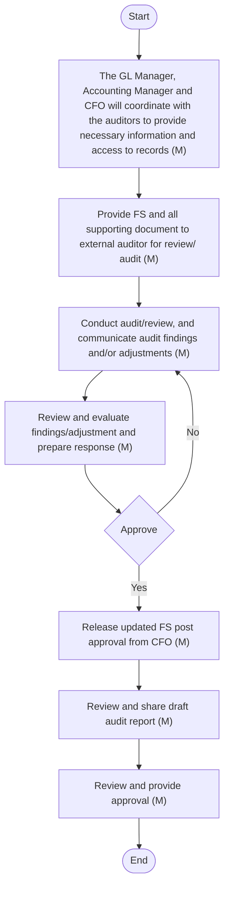

## FINANCIAL REPORTING

Overview
At Arabian Mills, financial reporting is a structured process designed to ensure timely and accurate preparation and presentation of financial information, compliance with IFRS as endorsed in KSA, and support for strategic decision-making. This process encompasses several key activities:
 Planning (Timeline, Frequency of Reporting) and Monitoring Process: Financial reporting is planned with specific timelines and frequency to ensure regular updates and compliance with reporting standards. The monitoring process involves ongoing reviews to maintain accuracy and adherence to internal policies.
 Closing of GL Period: The closing of modules and the General Ledger (GL) period involves finalising all transactions and adjustments for the reporting period. This ensures that financial data is complete and accurate before generating financial statements.
 Reconciliation and Monitoring of the GL: Reconciliation involves verifying the accuracy of GL balances by comparing sub-GL and GL balance. Monitoring ensures that any discrepancies are identified and resolved promptly, maintaining the integrity of financial data.
 Trial-Balance Closure and Preparation of Financial Statement (BS, Income Statement, Cash Flow, and SOCIE) and Schedules: The trial balance is closed and used to prepare the financial statements, including the Balance Sheet (BS), Income Statement, Cash Flow Statement, and Statement of Changes in Equity (SOCIE). Detailed schedules support these statements, ensuring comprehensive financial reporting.
 Comparison with Budgeted and Forecasted Financials: Financial statements are compared with budgeted and forecasted figures to assess performance against expectations. This comparison helps in identifying variances and informing strategic decision-making.
 Review of Financial Statement by Senior Management: Senior management reviews the financial statements to ensure accuracy and compliance with accounting standards. This review provides assurance that the financial information is reliable and supports strategic objectives.
 External Audit or Review and Final Approval of Financial Statements: An external audit or review is conducted to provide independent assurance of the financial statements. The final approval of the financial statements is obtained from the Board, ensuring transparency and compliance with regulatory requirements.
#### Planning (timeline, frequency of reporting) and Monitoring Process
Policy
 Financial reporting timelines must be defined and followed for monthly, quarterly, and annual closing.
 All business units must adhere to reporting cut-off dates set by the accounting department.
 Non-compliance or delays must be escalated to the CFO.
 Key controls and checklists must be embedded into the reporting calendar.
 Planning must cover both statutory and management reporting cycles.
Procedure
The following accounting procedures shall be followed:

| S No. | Procedure description | Responsibility | Frequency |
| --- | --- | --- | --- |
| 1 | **Reporting calendar**<br>• The Accounting Manager and GL Manager determine the timeline for the closing of financial reporting for monthly, quarterly, and annual reporting, keeping the CFO in loop . This reporting calendar is already in place and is followed consistently. If any changes to the reporting calendar are needed due to new requirements, the GL Manager updates it accordingly after discussions with the Accounting Manager and CFO. | **Preparer: GL Manager**<br>• Reviewer/Approver: Accounting Manager<br>• Informed: CFO | **Frequency: One time activity**<br>• Update: As and when required |
| 2 | **Communication to stakeholders**<br>• The Accounting Manager shares an email on a monthly basis with relevant stakeholders, keeping the CFO in copy, specifying the closing timeline for the GL Module (generally around 4:00 PM on the last date of the month). This ensures that all POs are booked in the system, modules are closed, and revenue and expenses, including accruals, are appropriately booked.<br>• Relevant stakeholders:<br>• Head of Sales (HOD Sales)<br>• Head of Marketing (HOD Marketing)<br>• Supply Chain Director (Procurement)<br>• Procurement Manager<br>• Head of Quality (HOD Quality)<br>• IT Security Manager<br>• Branch Manager<br>• Payroll Manager<br>• Warehouse Manager<br>• Safety and Security Director<br>• Accounting Division Head<br>• Production Planner MIS<br>• FP&A Manager<br>• Accounts Payable (AP) Unit Head | Preparer: Accounting Manager | Frequency: Monthly (last week of the month) |
| 3 | **Monitoring of closing calendar**<br>• The Accounting Manager monitors adherence to the closing calendar, ensuring timely submission of financial data and Purchase Orders. Any delays are escalated to the respective Head of Department (HOD) for resolution, with the CFO kept informed. Continuous review of the process aims to improve efficiency and accuracy in financial reporting | Preparer: Accounting Manager | Frequency: As and when required |

Flow Chart

**[Diagram — Visio-EMF→PNG]:**

**Process Name:** Planning  

**Roles / Swimlanes:**
- GL Manager
- Accounting Manager
- CFO  

### Steps

| Step # | Role              | Action                                              | Decision/Next Step                                                                                                                                             |
|--------|-------------------|-----------------------------------------------------|----------------------------------------------------------------------------------------------------------------------------------------------------------------|
| 1      | GL Manager        | Start                                               | Arrow to “Set-up calendar for periodical reporting (M)”.                                                                                                      |
| 2      | GL Manager        | Set-up calendar for periodical reporting (M)       | Arrow down to “Review the calinder (M)”.                                                                                                                      |
| 3      | Accounting Manager| Review the calinder (M)                            | Arrow down to “Approve”. Separate horizontal arrow to the right, labeled “Yes”, going to “Communicate to all department (A/M)”. No “No” branch is shown.     |
| 4      | CFO               | Approve                                             | Reached from “Review the calinder (M)” by a downward arrow. No outgoing arrows are shown from this decision symbol.                                          |
| 5      | GL Manager        | Communicate to all department (A/M)                | Reached from “Review the calinder (M)” via arrow labeled “Yes”. Arrow to “End”.                                                                               |
| 6      | GL Manager        | End                                                 | Process terminates.                                                                                                                                           |

### Mermaid.js flow

```mermaid
graph TD

A([Start]) --> B[Set-up calendar for periodical reporting (M)]
B --> C[Review the calinder (M)]
C --> D{Approve}
C -- Yes --> E[Communicate to all department (A/M)]
E --> F([End])
```

#### Closing of GL period
Policy
 All financial modules must be closed before the General Ledger (GL) period closure.
 GL closure must be authorised by the Accounting Manager after validation of completeness.
 System access for posting to closed periods must be restricted to prevent unauthorised entries.
 Any post-closing adjustments must follow formal approval processes and maintain an audit trail.
 GL closing must occur within agreed timelines to meet reporting deadlines.
Procedure
The following accounting procedures shall be followed:

| S No. | Procedure description | Responsibility | Frequency |
| --- | --- | --- | --- |
| 1 | **Closing and opening of Material Modules**<br>• All department stakeholders must ensure that all necessary transactions are duly incorporated into SAP before the GL period is closed, as per the timelines specified in the email. Material module includes production, sales, payroll etc . | Preparer: Relevant Stakeholders for closing material modules | Frequency: Monthly |
| 2 | **Closing and opening of GL Period**<br>• he Accounting Manager closes the GL period according to the timeline specified in the email and opens the GL period for the next month, keeping the CFO in loop throughout the process. | **Closed by : Accounting Manager**<br>• Informed: CFO | Frequency: Monthly |
| 3 | **Reopening of closed GL Period**<br>• The GL Manager, along with the Accounting Manager, reviews the trial balance and financial statements on a monthly basis during the first ten days of each month, followed by a detailed review with the CFO. If any discrepancies are identified during the review process, the Accounting Manager approves the reopening of the previous month's GL period, keeping the CFO informed. After recording the adjustments or missing entries, the GL Manager closes the GL period in consultation with the Accounting Manager and CFO. | **Reopened by: Accounting Manager**<br>• Informed: CFO | Frequency: Monthly (generally on or before 10 th of the month) |

Flow Chart

**[Diagram — Visio-EMF→PNG]:**

**Process Name:** GL period closure  

**Roles / Swimlanes:**
- Accounting Manager  
- Relevant stakeholders  

### Steps

| Step # | Role                | Action                                                                 | Decision/Next Step                                  |
|--------|---------------------|------------------------------------------------------------------------|-----------------------------------------------------|
| 1      | Accounting Manager  | Start                                                                  | Proceed to Step 2                                   |
| 2      | Accounting Manager  | Communicate to all department for closure checklist and module closing (AM) | Proceed to Step 3 and Step 4 (in parallel)         |
| 3      | Relevant stakeholders | Closure of Module (A)                                                 | After completion, feed into Step 4                  |
| 4      | Accounting Manager  | Closure of GL Module and GL Period (A)                                 | Confirm closure complete → Yes → Step 5 (End)      |
| 5      | Accounting Manager  | End                                                                    | Process terminates                                  |

- From Step 2, one flow goes down to Relevant stakeholders (Step 3: Closure of Module (A)).  
- From Step 2, another flow goes directly towards Step 4.  
- Output of Step 3 connects into Step 4 (Closure of GL Module and GL Period (A)).  
- From Step 4, there is a labeled arrow “Yes” going to the End.

### Mermaid.js diagram

```mermaid
graph TD

    A1[Start]:::start
    A2[Communicate to all department for closure checklist and module closing (AM)]
    B1[Closure of Module (A)]
    A3[Closure of GL Module and GL Period (A)]
    A4[End]:::end

    A1 --> A2
    A2 --> B1
    A2 --> A3
    B1 --> A3
    A3 -- Yes --> A4

    classDef start fill:#ffffff,stroke:#000000,stroke-width:1px,rx:20,ry:20;
    classDef end fill:#ffffff,stroke:#000000,stroke-width:1px,rx:20,ry:20;
```

#### Reconciliation and Monitoring of the GL
Policy
 All GL balances must be reconciled monthly with sub-ledgers and supporting documents.
 Reconciliations must be reviewed by GL Manager and approved by Accounting Manager and CFO.
 Any unresolved or aging reconciling items must be investigated and documented.
 GL controls must be tested periodically as part of the internal controls review.
Procedure
The following accounting procedures shall be followed:

| S No. | Procedure description | Responsibility | Frequency |
| --- | --- | --- | --- |
| 1 | **GL reconciliation**<br>• T he GL Manager reviews the following reconciliations on a monthly basis during the first week, based on the reports shared by respective workstream owners:<br>• Bank Reconciliation: Reconcile bank statements with accounting records to identify and resolve discrepancies.<br>• Accounts Receivable and Accounts Payable: Reconcile outstanding balances with customer and supplier records.<br>• FAR vs GL Reconciliation: Reconcile FA balances as per SAP with FA balance as per FAR.<br>• Ageing Report: AR and AP.<br>• Prepayments Schedule vs GL.<br>• This process is subsequently reviewed by the Accounting Manager and shared with the CFO for final review. | **Preparer: Workstream owners**<br>• Review : GL Manager<br>• and Accounting Manager<br>• Final review : CFO | Frequency: Monthly (first week) |
| 2 | **Coordinate with stakeholders**<br>• If any discrepancies are identified during the review of GL reconciliation, the GL Manager coordinates with the respective department manager to resolve the discrepancies. | Coordinated by : GL Manager | Frequency: As and when required |

#### Trial-balance closure and preparation of financial statement (BS, Income Statement, Cash flow and SOCIE) and schedules
Policy
 The trial balance must be finalised and validated before generating/preparing financial statements.
 Financial statements, including the Balance Sheet (BS), Profit and Loss Statement (P&L), Cash Flow Statement, and Statement of Changes in Equity (SOCIE), must comply with IFRS endorsed by SOCPA.
 Supporting schedules and notes must accompany all reported balances.
 Material movements must be explained and disclosed to stakeholders.
 Comparative and year-to-date (YTD) figures must be reconciled and validated.
Procedure
The following accounting procedures shall be followed:

| S No. | Procedure description | Responsibility | Frequency |
| --- | --- | --- | --- |
| 1 | **Pre-close review**<br>• The GL Manager ensures that the following activities have been performed:<br>• All transactions pertaining to the period have been recorded in the modules;<br>• Accruals have been recorded and reviewed; and<br>• The GL has been reconciled and all findings have been updated .<br>• The GL Manager ensures accuracy by verifying that all transactions are accurately recorded, accruals are properly documented, and reconciliations are complete. This involves checking with accounting and finance team members to ensure they have recorded the entries and coordinating with other departments to ensure they have shared relevant information with the accounting team for the closing process.<br>• The Accounting Manager reviews the pre-close activities by collaborating with the GL Manager, conducting physical meetings to check transactions. | **Preparer: GL Manager**<br>• Reviewer: Accounting Manager | Frequency: Monthly basis |
| 2 | **Generate Trial Balance (TB)**<br>• After completing the above activities, the GL Manager generates the Trial Balance (TB) for all four locations (HO, Riyadh, Hail, and Jizan) from SAP. The GL Manager then consolidates these into one TB for the entire company in an Excel workbook. | Preparer: GL Manager | Frequency: Monthly basis |
| 3 | **Preparation of Financial Statement (FS)**<br>• A standard Excel template is used within the company for preparing financial statements, which include the balance sheet, statement of profit or loss, statement of cash flows, statement of changes in equity, and corresponding schedules.<br>• The Excel FS excluding schedules is prepared on a monthly basis.<br>• The Excel FS including detailed schedules is prepared on a quarterly and annual basis.<br>• The GL Manager uses the consolidated TB to prepare the financial statements and the Accounting Manager review the same .<br>• The Accounting Manager reviews the financial statements by:<br>• Verifying the accuracy and completeness of the financial statements prepared using the standard Excel template.<br>• Ensuring that all figures in the financial statements reconcile with the consolidated TB.<br>• Checking for any discrepancies or errors in the financial statements.<br>• Conducting physical meetings with the GL Manager to discuss and resolve any issues found during the review. | **Preparer: GL Manager**<br>• Reviewer: Accounting Manager | Frequency: Monthly |
| 4 | **Preparation of detailed schedule**<br>• The GL Manager prepares the following schedules in the Excel FS on a quarterly basis:<br>• Segment reporting;<br>• Fixed assets (Property, Pant, and Equipment’s and Intangible Assets);<br>• Right-of-use assets and lease liabilities;<br>• Inventories;<br>• Prepayments & other current assets;<br>• Trade Payable & other current liabilities;<br>• Accrued expenses and other liabilities;<br>• Sales<br>• Cost of good sold, selling & distribution expenses, and general & administrative expenses;<br>• Related party transactions; and<br>• Other relevant schedules.<br>• The GL Manager coordinates with the relevant departments to obtain information related to the above schedules (eg: ageing of suppliers from AP team, ageing of customers from AR team etc) .<br>• The GL Manager uses the consolidated TB and information provided by the relevant departments to prepare the schedules and the Accounting Manager review s the same . | **Preparer: GL Manager**<br>• Reviewer: Accounting Manager | Frequency: Quarterly |
| 5 | **Variance Analysis**<br>• The GL Manager prepares a comprehensive variance analysis, comparing actual data with prior periods' actual data (Month-on-Month, Quarter-on-Quarter variances) and comparing actual data with the budget. The Accounting Manager reviews this analysis to ensure accuracy and completeness. | **Preparer: GL Manager**<br>• Reviewer: Accounting Manager | Frequency: Monthly |
| 6 | **Manual adjustments**<br>• During the review process, if any discrepancies are identified, the Accounting Manager shares observations with the GL Manager. This process typically involves a collaborative review, where both managers may sit together to analyse the numbers. The GL Manager then coordinates with the respective departments to gather explanations for any unresolved differences, ensuring that all inquiries are addressed thoroughly.<br>• If any entries are necessary, they are incorporated into the Excel financial statements. These entries are posted in SAP once the GL period for the relevant month is reopened. This step controls by ensuring that the entry is approved by the respective department head and the Accounting Manager. Further, the adjustment discusses with the CFO as part of the review of financial statements by senior management. | **Preparer: GL Manager**<br>• Reviewer: Accounting Manager | Frequency: Monthly |
| 7 | **Communication to the Senior Management**<br>• The GL Manager shares financial statement including schedules and variance analysis with CFO for his review and feedback. | **Preparer: GL Manager**<br>• Reviewer: CFO | Frequency: Monthly |

Flow Chart

**[Diagram — PNG]:**

**Process Name:** Trial-balance closure and preparation of financial statement  

**Roles / Swimlanes:**

- GL Manager  
- Accounting Manager  

---

### Steps

| Step # | Role              | Action                                                                                       | Decision/Next Step          |
|--------|-------------------|----------------------------------------------------------------------------------------------|-----------------------------|
| 1      | GL Manager        | Start                                                                                        | Next: Step 2                |
| 2      | GL Manager        | Extract TB, perform pre-closure checklist, and prepare financial statement (A/M)            | Next: Step 3                |
| 3      | Accounting Manager| Review and provide feedback (M)                                                              | Next: Step 4                |
| 4      | GL Manager        | Updated FS, prepare detailed schedule and perform variance analysis (M)                     | Next: Step 5                |
| 5      | Accounting Manager| Review and share with senior management (M)                                                 | Next: Step 6                |
| 6      | Accounting Manager| End                                                                                          | —                           |

*No explicit Yes/No decision branches are depicted in the diagram; the flow is linear from Start to End.*

---

### Mermaid.js Diagram

```mermaid
graph TD

    A((Start))
    B[Extract TB, perform pre-closure checklist, and prepare financial statement (A/M)]
    C[Review and provide feedback (M)]
    D[Updated FS, prepare detailed schedule and perform variance analysis (M)]
    E[Review and share with senior management (M)]
    F((End))

    A --> B --> C --> D --> E --> F
```

#### Comparison with budgeted and forecasted financials
Policy
 Budgeted financial statements shall be prepared annually in alignment with the corporate objectives, using consistent accounting policies as applied in the statutory financial statements.
 Budgets shall include projected statement of financial position, statement of profit or loss, and cash flow statement, prepared on the same reporting basis and using comparable classifications to enable meaningful comparison with actual results.
 Preparation of budgeted financial statements shall be based on reasonable and supportable assumptions, documented and approved by senior management prior to the start of the budget period.
 Actual financial results shall be compared against budgeted figures at regular intervals (e.g., monthly) to assess performance and identify material variances.
 Variance analysis shall focus on significant deviations from budget, supported by explanations and corrective action recommendations where appropriate.
 All budget and actual comparison reports shall be reviewed by the CFO and CEO.
Procedure
The following accounting procedures shall be followed:

| S No. | Procedure description | Responsibility | Frequency |
| --- | --- | --- | --- |
| 1 | **Initiation Process**<br>• The FP&A Manager update the business plan and prepares the budgeted financial statements for the upcoming year during the second half of the current year | Initiated by : FP&A Manager | Frequency : Annually, second half of year (August) |
| 2 | **Coordinate with stakeholders**<br>• A meeting is conducted with the Heads of Departments (HODs) at the beginning of the second half of the year, typically in August, where the company's vision, goals, and strategy are shared and aligned with the objectives of each department.<br>• The FP&A Manager provides standard forms to relevant departments (e.g., Sales, Production, HR) to gather necessary information related to current year budgets . Information to be provided by the department within 1 month from the date of receiving forms. | **Coordination performed by : FP&A Manager**<br>• Information provided by: Respective Department | Frequency: Annually, second half of year (August) |
| 3 | **Budgeted Financial Statements:**<br>• Based on this information, the budgeted financial statements are prepared, including the budgeted balance sheet, profit and loss statement, and cash flow statement for the upcoming year; and business plan is updated and is shared with CFO, then CEO, and then with Board for final approval. | **Preparer: FP&A Manager**<br>• Reviewer: CFO and CEO<br>• Approver: Board | Frequency: Annually |
| 4 | **Distribute Budget:**<br>• Once the budget has been approved by the Board, the FP&A Manager is responsible for distributing / emailing the finalised budget to each department. This ensures that all departments are aware of their financial allocations and can align their activities with the company's overall strategy. | Email by: FP&A Manager | Frequency: Post approval |
| 5 | **Monitor Budget and Actuals:**<br>• The FP&A Manager continuously monitors the budget against actual financial performance. This involves analysing any variances between the budgeted figures and the actual results. If there are significant changes or discrepancies, the FP&A Manager updates the forecasted financial statements to reflect these changes, ensuring that the company remains on track with its financial goals. This is then reviewed by CFO, and then CEO . | **Preparer: FP&A Manager**<br>• Reviewer: CFO and CEO | Frequency: Monthly |

Flow Chart:

**[Diagram — PNG]:**

**Process Name:** Comparison of Budgeted and Actual Financial Statement  

**Roles / Swimlanes:**

- Respective Department  
- FP&A Manager  
- CFO  
- CEO  
- Board  

---

### Steps

| Step # | Role                | Action                                                                                                                   | Decision/Next Step                                                                                                                                      |
|--------|---------------------|--------------------------------------------------------------------------------------------------------------------------|--------------------------------------------------------------------------------------------------------------------------------------------------------|
| 1      | FP&A Manager        | Start                                                                                                                    | Proceed to Step 2.                                                                                                                                      |
| 2      | FP&A Manager        | FP&A Manager conducts meeting with HOD of each department to align on company strategy and for obtaining CY Budget (M)  | Proceed to Step 5.                                                                                                                                      |
| 3      | Respective Department | Provide FS and all supporting document to external auditor for review/ audit (M)                                        | Proceed to Step 4.                                                                                                                                      |
| 4      | Respective Department | Prepares budget of respective department and share it with FP&A Manager (M)                                            | Proceed to Step 5.                                                                                                                                      |
| 5      | FP&A Manager        | Prepare over Company budget and update business plan and share it for review and approval (M)                           | Proceed to Step 6 (CFO review and approval).                                                                                                           |
| 6      | CFO                 | Review and approved (M)                                                                                                  | **Yes:** Proceed to Step 7.  **No:** Return to Step 5 for revision.                                                                                    |
| 7      | CEO                 | Review and approved (M)                                                                                                  | **Yes:** Proceed to Step 8.                                                                                                                             |
| 8      | Board               | Approve                                                                                                                  | **Yes:** Proceed to Step 9.                                                                                                                             |
| 9      | FP&A Manager        | Distributes Budget and monitors the budget which will be reviewed by CFO and CEO (M)                                    | Proceed to Step 10.                                                                                                                                     |
| 10     | FP&A Manager        | End                                                                                                                      | Process ends.                                                                                                                                           |

**Explicit Yes/No Branches:**

- Step 6 (CFO – Review and approved (M))  
  - Yes → Step 7 (CEO – Review and approved (M))  
  - No → Step 5 (FP&A Manager – Prepare over Company budget and update business plan and share it for review and approval (M))

- Step 7 (CEO – Review and approved (M))  
  - Yes → Step 8 (Board – Approve)

- Step 8 (Board – Approve)  
  - Yes → Step 9 (FP&A Manager – Distributes Budget and monitors the budget which will be reviewed by CFO and CEO (M))

---

```mermaid
graph TD

  start([Start])

  meet["FP&A Manager conducts meeting with HOD of each department to align on company strategy and for obtaining CY Budget (M)"]

  fs["Provide FS and all supporting document to external auditor for review/ audit (M)"]

  deptbud["Prepares budget of respective department and share it with FP&A Manager (M)"]

  compbud["Prepare over Company budget and update business plan and share it for review and approval (M)"]

  cforev{"Review and approved (M)"}

  ceorev{"Review and approved (M)"}

  approve{"Approve"}

  dist["Distributes Budget and monitors the budget which will be reviewed by CFO and CEO (M)"]

  end([End])

  %% Flows
  start --> meet
  fs --> deptbud
  deptbud --> compbud
  meet --> compbud
  compbud --> cforev
  cforev -- No --> compbud
  cforev -- Yes --> ceorev
  ceorev -- Yes --> approve
  approve -- Yes --> dist
  dist --> end
```

#### Review of financial statement by Senior Management
Policy
 Financial results must be reviewed monthly by senior management prior to external reporting.
 Variance analysis, key metrics, risks, and controls must be highlighted in review packs.
 Review documentation must be retained for audit and governance purposes.
 The CFO must certify the completeness and accuracy of reported numbers.
 Adjustments requested by management must be approved and documented.
 Any discrepancies or issues identified during the review must be promptly investigated and resolved to uphold the integrity of financial reporting.
Procedure
The following accounting procedures shall be followed:

| S No. | Procedure description | Responsibility | Frequency |
| --- | --- | --- | --- |
| 1 | **Preparation of Financial Statement**<br>• The finance team prepares the consolidated financial statements, including the balance sheet, income statement, cash flow statement, and notes to the accounts. The GL Manager prepares financial statement, a comprehensive variance analysis, comparing actual data with prior periods actual data (Month-on-Month, Quarter-on-Quarter variances) and comparing actual data with budget . This analysis is reviewed by the Accounting Manager to ensure accuracy and completeness . | **Preparer: GL Manager**<br>• Reviewer: Accounting Manager | Frequency: Monthly |
| 2 | **Review**<br>• The GL Manager shares the consolidated financial statement pack, including the variance analysis, with the CFO via email on or before the 10th of each month. The CFO conducts a detailed review, assessing the appropriateness of accounting policies, estimates, and significant judgments. | Reviewer: CFO | Frequency: Monthly |
| 2 | **F eedback**<br>• The CFO reviews the financial statements and provides feedback. If adjustments are necessary, the GL Manager records the appropriate accounting entries based on the CFO's feedback. These entries are incorporated into the financial statements and recorded in the books following the review process. . | **Preparer: GL Manager**<br>• Reviewer 1: Accounting Manager<br>• Reviewer 2: CFO | Frequency: Monthly |
| 4 | **CEO Review**<br>• The CFO discusses the final financial statements with the CEO in a meeting to plan future actions. During this meeting, they review both actual vs. actual (comparative) figures and budget vs. actual variances to ensure a comprehensive understanding of the company's financial performance. | CFO and CEO | Frequency: Monthly |

Flow Chart:

**[Diagram — Visio-EMF→PNG]:**

**Process Name:** Review of financial statement by Senior Management  

**Roles / Swimlanes:**
- Accounting Manager  
- CFO  
- CEO  

| Step # | Role              | Action                                                                                                                                     | Decision/Next Step                      |
|-------:|-------------------|--------------------------------------------------------------------------------------------------------------------------------------------|-----------------------------------------|
| 1      | Accounting Manager | Start                                                                                                                                      | Proceed to Step 2                       |
| 2      | Accounting Manager | Share financial statement, supporting documents and variance analysis with senior management for review (M)                               | CFO reviews and provides feedback → 3   |
| 3      | CFO               | Review and provide feedback (M)                                                                                                            | If updates required, Accounting Manager shares updated version of FS → 4 |
| 4      | Accounting Manager | Share updated version of FS, if required (M)                                                                                              | CFO discusses final financial statements with CEO → 5 |
| 5      | CFO               | The CFO discusses the final financial statements with the CEO in a meeting to plan future actions (M)                                     | Proceed to End → 6                      |
| 6      | Accounting Manager | End                                                                                                                                        | —                                       |

```mermaid
graph TD

    A1[Start\n(Role: Accounting Manager)]
    A2[Share financial statement, supporting documents and variance analysis with senior management for review (M)\n(Role: Accounting Manager)]
    C1[Review and provide feedback (M)\n(Role: CFO)]
    A3[Share updated version of FS, if required (M)\n(Role: Accounting Manager)]
    C2[The CFO discusses the final financial statements with the CEO in a meeting to plan future actions (M)\n(Role: CFO)]
    A4[End\n(Role: Accounting Manager)]

    A1 --> A2 --> C1 --> A3 --> C2 --> A4
```

#### External audit or review and final approval of financial statements
Policy
 Engagement of External Auditors: Engage external auditors to conduct an independent audit of the financial statements, ensuring compliance with IFRS endorsed by SOCPA and regulatory requirements.
 Audit Completion and Reporting: The external auditors must complete their audit and provide a detailed report on the financial statements, highlighting any material findings or recommendations for improvement.
 Resolution of Audit Findings: Any findings or recommendations from the external audit must be addressed and resolved before the Board approves the financial statements.
 Formal Approval: The Board/Audit Committee must formally approve the financial statements, confirming their accuracy and compliance with IFRS endorsed by SOCPA.
 Management representation letters must be signed only by authorised officials.
Procedure
The following accounting procedures shall be followed:

| S No. | Procedure description | Responsibility | Frequency |
| --- | --- | --- | --- |
| 1 | **Auditors Planning**<br>• The GL Manager, Accounting Manager, and CFO coordinate with the auditor to provide necessary information and access to records. A preliminary meeting is conducted with the auditor to discuss the audit plan, key areas of focus, and any specific concerns. | Audit plan aligned with auditors by: GL Manager, A ccounting Manager and CFO | Frequency: Quarterly |
| 2 | **Sharing of financial statement and schedules**<br>• The company provides the auditor with the latest financial statements, including the balance sheet, income statement, cash flow statement, and statement of changes in equity. These statements are accompanied by supporting documents and schedules that provide detailed information on the company's financial activities. The CFO and Accounting Manager ensure that the financial statements are complete and accurate before sharing them with the auditor. The Accounting Manager and GL Manager share the information, keeping the CFO informed. The company ensures timely provision of requested information to avoid delays in the audit process. | **Information shared by: Accounting Manager and GL Manager**<br>• Informed: CFO | Frequency: Quarterly |
| 3 | **Audit Findings**<br>• The auditor communicates preliminary findings and any issues identified during the audit. The CFO, Accounting Manager, and GL Manager review these findings and provide necessary explanations or corrective actions. This review process involves a thorough examination of the auditor's observations and recommendations to ensure that any discrepancies or concerns are addressed promptly. | Audit findings addressed by: Accounting Manager , GL Manager and CFO | Frequency: As and when audit findings are shared |
| 4 | **Adjustments Suggested by Auditor**<br>• If the auditor suggests adjustments to the financial statements, the CFO, GL Manager, and Accounting Manager evaluate these recommendations. Adjustments may include corrections to account balances, reclassification of transactions, or changes to accounting estimates. The CFO decides whether to accept or reject the suggested adjustments based on their impact on the financial statements and compliance with accounting standards. Any rejected adjustments must be documented with a rationale for the decision. | Adjustment acceptance by: CFO | Frequency: As and when audit findings are shared |
| 5 | **Resharing of final financials**<br>• In case any adjustments are required to be incorporated, they are initially recorded in the Excel financial statement and then in SAP . The GL Manager or Accounting Manager then shares the final financials after CFO review and approval, with the external auditor for final review/audit . | **Preparer: GL Manager**<br>• Reviewer: Accounting Manager<br>• Approver: CFO | Frequency: If any adjustments are recorded |
| 6 | **Review and F inalisation**<br>• The Board of Directors and Audit Committee review the audit report and discuss the findings with the auditor. The auditor issues the final audit report after addressing any responses or additional information provided by the company. | Discussion with Board and Audit Committee |  |

Flow Chart

**[Diagram — Visio-EMF→PNG]:**

**Process Name:**  
External audit or review and final approval of financial statements

**Roles / Swimlanes:**

- GL Manager  
- Accounting Manager  
- CFO  
- Auditors  
- Board  

---

### Steps

| Step # | Role                                                | Action                                                                                                           | Decision/Next Step                                                                                                  |
|--------|-----------------------------------------------------|------------------------------------------------------------------------------------------------------------------|----------------------------------------------------------------------------------------------------------------------|
| 1      | –                                                   | **Start**                                                                                                        | Proceed to Step 2                                                                                                    |
| 2      | GL Manager, Accounting Manager and CFO              | The GL Manager, Accounting Manager and CFO will coordinate with the auditors to provide necessary information and access to records (M) | Proceed to Step 3                                                                                                    |
| 3      | GL Manager                                          | Provide FS and all supporting document to external auditor for review/ audit (M)                                 | Proceed to Step 4                                                                                                    |
| 4      | Auditors                                            | Conduct audit/review, and communicate audit findings and/or adjustments (M)                                      | Proceed to Step 5                                                                                                    |
| 5      | Accounting Manager                                  | Review and evaluate findings/adjustment and prepare response (M)                                                | Proceed to Step 6                                                                                                    |
| 6      | CFO                                                 | **Decision: Approve**                                                                                            | If **Yes**, go to Step 7. If **No**, go to Step 4.                                                                   |
| 7      | GL Manager                                          | Release updated FS post approval from CFO (M)                                                                    | Proceed to Step 8                                                                                                    |
| 8      | CFO                                                 | Review and share draft audit report (M)                                                                          | Proceed to Step 9                                                                                                    |
| 9      | Board                                               | Review and provide approval (M)                                                                                  | Proceed to Step 10                                                                                                   |
| 10     | –                                                   | **End**                                                                                                          | –                                                                                                                    |

---

### Mermaid.js Diagram

