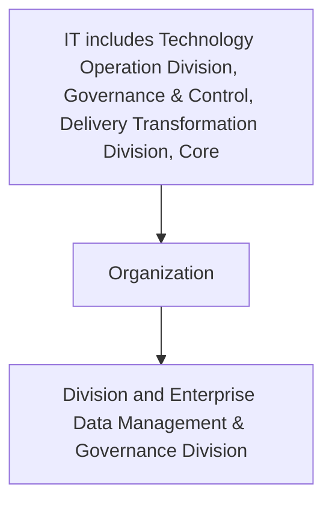

## .4. Business Intelligence and Analytics KPIs:

It is important to measure the performance and analyze the effectiveness of Business Intelligence and Analytics.
The following table delineates the Business Intelligence and Analytics key performance indicators.

| Category | Metric | Description |
| --- | --- | --- |
| BI and Analytics Use cases Implementation | Number of use cases defined | Total number of BI and Analytics use cases defined |
| BI and Analytics Use cases Implementation | Number of use cases piloted | Total number of use cases piloted during BI and Analytics process |
| BI and Analytics Use cases Implementation | Number of use cases implemented and scaled | Total number of use cases implemented and scaled to explore and expand the BI and Analytics process |
| BI and Analytics Process efficiency | Total ROI value generated from the implemented use cases | Total ROI value generated from the implemented use cases to evaluate efficiency/profitability of an investment |
| Performance Monitoring | Training and awareness sessions delivered | Total number of training and awareness programs delivered by [client] management |


**[Flowchart — Word Shapes]:**

1. IT* includes Technology Operation Division, Governance & Control, Delivery Transformation Division, Core
2. Organization
3. ing
4. Division and Enterprise Data Management & Governance Division
5. ing Division and Enterprise Data Management & Governance Division


**[Flowchart — Structured]:**

```markdown
## Step Table

| Step | Description                                                                                                   |
|------|---------------------------------------------------------------------------------------------------------------|
| 1    | IT includes Technology Operation Division, Governance & Control, Delivery Transformation Division, Core      |
| 2    | Organization                                                                                                  |
| 3    | Division and Enterprise Data Management & Governance Division                                                 |

## Mermaid Diagram


```