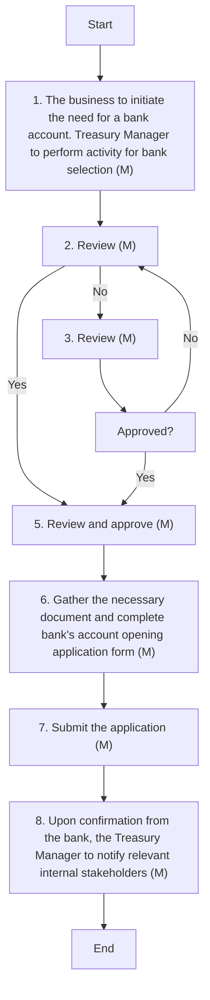

### 1. Process Name
Bank accounts management (Selection, Opening)

### 2. Roles (Swimlanes)
- Treasury Manager
- CFO
- CEO
- Board

### 3. Steps in a Markdown Table

| Step # | Role            | Action                                                                 | Next Step/Logic              |
|--------|-----------------|------------------------------------------------------------------------|------------------------------|
| 1      | Treasury Manager | The business to initiate the need for a bank account. Treasury Manager to perform activity for bank selection (M) | 2                            |
| 2      | CFO             | Review (M)                                                             | 3 (No) / 4 (Yes)             |
| 3      | CEO             | Review (M)                                                             | 4                            |
| 4      | Board           | Approved?                                                              | 5 (Yes) / 2 (No)             |
| 5      | CFO             | Review and approve (M)                                                 | 6                            |
| 6      | Treasury Manager | Gather the necessary document and complete bank’s account opening application form (M) | 7                            |
| 7      | Treasury Manager | Submit the application (M)                                            | 8                            |
| 8      | Treasury Manager | Upon confirmation from the bank, the Treasury Manager to notify relevant internal stakeholders (M) | End                          |

### 4. Mermaid.js Code Block

