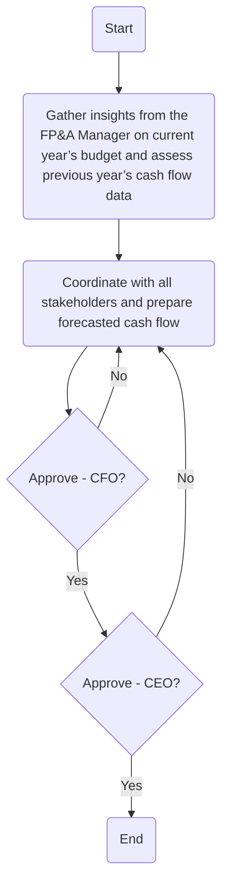

### Analysis

1. **Process Name**: Preparation for forecasted cash flow

2. **Roles (Swimlanes)**:
   - Treasury Manager
   - CFO
   - CEO

3. **Steps in Markdown Table**:

| Step # | Role            | Action                                                                   | Next Step/Logic            |
|--------|-----------------|--------------------------------------------------------------------------|----------------------------|
| 1      | Treasury Manager | Start                                                                    | Step 2                     |
| 2      | Treasury Manager | Gather insights from the FP&A Manager on current year’s budget and assess previous year’s cash flow data | Step 3                     |
| 3      | Treasury Manager | Coordinate with all stakeholders and prepare forecasted cash flow        | Step 4                     |
| 4      | CFO             | Approve                                                                   | Yes: Step 5, No: Step 3    |
| 5      | CEO             | Approve                                                                   | Yes: Step 6, No: Step 3    |
| 6      | -               | End                                                                      | -                          |

4. **Mermaid.js Code Block**:

