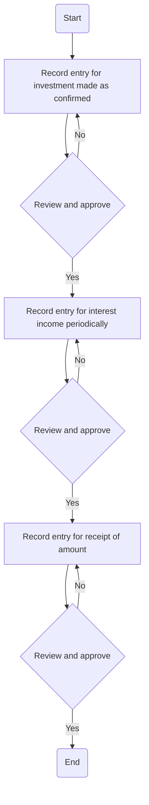

### 1. Process Name

Recording entry for Investment and Interest Income

### 2. Roles (Swimlanes)

- GL Manager
- Accounting Manager

### 3. Steps in a Markdown Table

| Step # | Role              | Action                                                        | Next Step/Logic                            |
|--------|-------------------|---------------------------------------------------------------|--------------------------------------------|
| 1      | GL Manager        | Start                                                         | 2                                          |
| 2      | GL Manager        | Record entry for investment made as confirmed by Treasury Manager keeping CFO informed (M) | 3                                          |
| 3      | Accounting Manager| Review and approve                                            | Yes: 4, No: 2                              |
| 4      | GL Manager        | Record entry for interest income periodically (A/M)           | 5                                          |
| 5      | Accounting Manager| Review and approve                                            | Yes: 6, No: 4                              |
| 6      | GL Manager        | Record entry for receipt of amount (investment and interest) (A) | 7                                          |
| 7      | Accounting Manager| Review and approve                                            | Yes: 8, No: 6                              |
| 8      | End               | End                                                           | -                                          |

### 4. Logic as Mermaid.js Code Block

