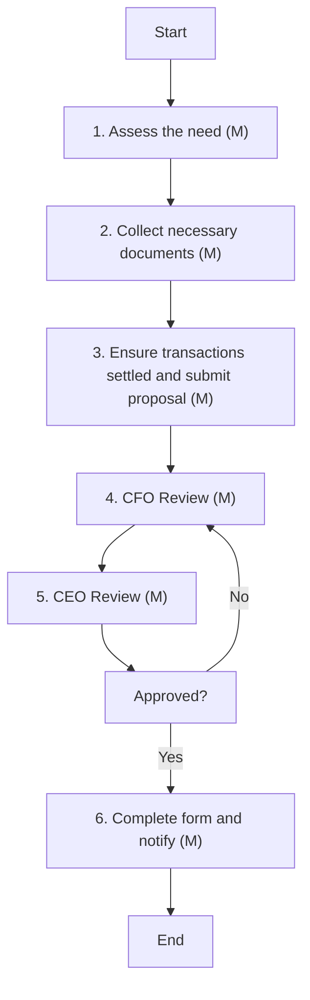

### Analysis of Flowchart

1. **Process Name**: Bank accounts management (Closing of bank account)

2. **Roles (Swimlanes)**:
   - Treasury Manager
   - CFO
   - CEO
   - Board

3. **Steps in Markdown Table**

| Step # | Role           | Action                                                                                  | Next Step/Logic    |
|--------|----------------|-----------------------------------------------------------------------------------------|--------------------|
| 1      | Treasury Manager | Assess the need for closing the bank account based on business requirements.            | Step 2             |
| 2      | Treasury Manager | Collect all necessary documents required by the bank for account closure.               | Step 3             |
| 3      | Treasury Manager | Ensure all outstanding transactions are settled and submit closure proposal.            | Step 4             |
| 4      | CFO            | Review.                                                                                  | Step 5             |
| 5      | CEO            | Review.                                                                                  | Approval Step      |
|        | Board          | Decision: Approved?                                                                     | Yes: Step 6, No: Step 4 |
| 6      | Treasury Manager | Complete the account closure form and obtain a closure certificate and notify stakeholders. | End                |

4. **Mermaid.js Code Block**

