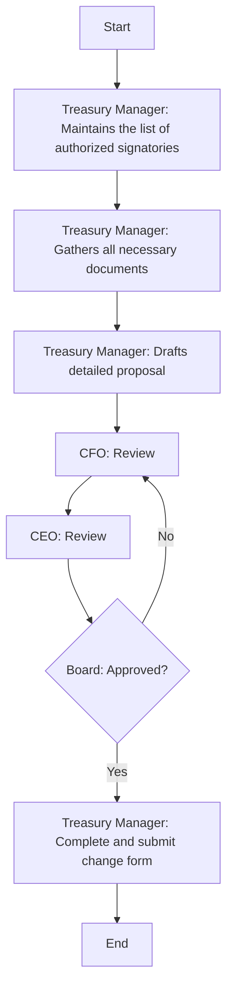

### Analysis

#### 1. Process Name:
- Update signatories in Bank accounts

#### 2. Roles (Swimlanes):
- Treasury Manager
- CFO
- CEO
- Board

#### 3. Steps in Markdown Table:

| Step # | Role             | Action                                                                                                   | Next Step/Logic                         |
|--------|------------------|----------------------------------------------------------------------------------------------------------|-----------------------------------------|
| 1      | Treasury Manager | Maintains the list of authorized signatories and ensures that the bank is informed of any changes         | 2                                       |
| 2      | Treasury Manager | Gathers all necessary documents required by the bank for changing authorized signatories                 | 3                                       |
| 3      | Treasury Manager | Drafts a detailed proposal for changing authorized signatories, including reasons and implications       | 4                                       |
| 4      | CFO              | Review                                                                                                   | 5                                       |
| 5      | CEO              | Review                                                                                                   | Board Decision: Approved?               |
| 6      | Board            | Approved?                                                                                                | Yes: Step 6; No: Step 4                 |
| 7      | Treasury Manager | Complete the bank’s authorized signatory change form and submit. Obtain confirmation from bank updates   | End                                     |

#### 4. Mermaid.js Code Block:

This captures the decision-making process and the associated steps involved in updating the signatories in bank accounts.