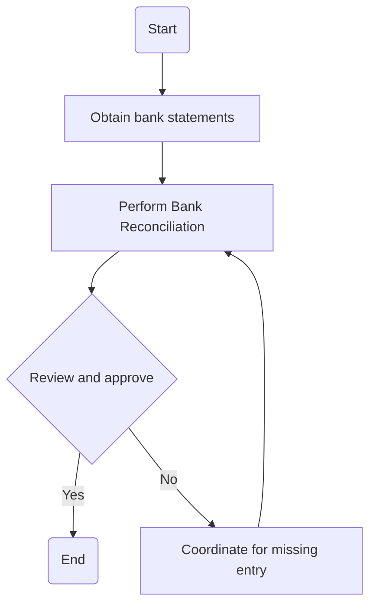

Certainly! Here's the analysis of the flowchart:

### 1. Process Name
- **Bank Reconciliation**

### 2. Roles (Swimlanes)
- **Accounting Unit Head**
- **GL Manager / Accounting Manager**

### 3. Steps into a Markdown Table

```markdown
| Step # | Role                        | Action                                                                                  | Next Step/Logic      |
|--------|-----------------------------|-----------------------------------------------------------------------------------------|----------------------|
| 1      | Accounting Unit Head        | Obtains bank statements from the Treasury Manager on a monthly basis.                    | Step 2               |
| 2      | Accounting Unit Head        | Perform Bank Reconciliation.                                                            | Review and approve   |
| 3      | Accounting Unit Head        | Coordinate with respective team members for recording the entry, if missing.            | Step 2               |
| 4      | GL Manager / Accounting Manager | Review and approve.                                                                   | Yes: End, No: Step 3 |
```

### 4. Logic as Mermaid.js Code Block



This structure outlines the process steps, roles involved, and the decision paths within the bank reconciliation process.