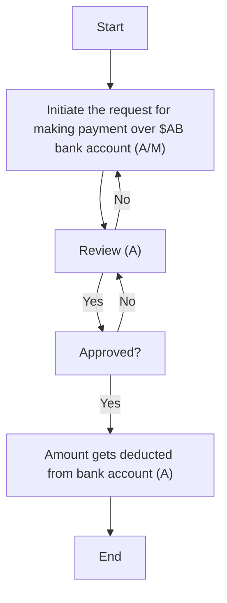

### Analysis

#### 1. Process Name
- **PO based and non-PO based payment**

#### 2. Roles (Swimlanes)
- AP Unit Head
- Treasury Manager
- CFO/CHRO
- CEO

#### 3. Steps in a Markdown Table

| Step # | Role            | Action                                               | Next Step/Logic              |
|--------|-----------------|------------------------------------------------------|------------------------------|
| 1      | AP Unit Head    | Initiate the request for making payment over $AB bank account (A/M) | Step 2                       |
| 2      | Treasury Manager| Review (A)                                           | If Approved: Step 3, If No: Step 1 |
| 3      | CEO             | Approved?                                            | If Yes: Step 4, If No: Step 2 |
| 4      | CEO             | Amount gets deducted from bank account (A)           | End                          |

#### 4. Logic in Mermaid.js Code Block

