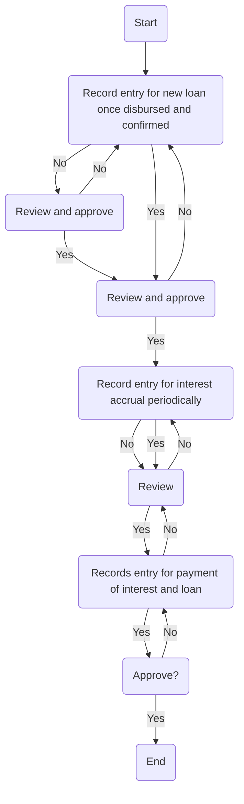

Sure! Here's the analysis of the flowchart:

### 1. Process Name:
Recording entry for borrowing and finance cost

### 2. Roles (Swimlanes):
- GL Manager
- Accounting Manager
- AP Unit Head
- Treasury Manager

### 3. Steps in a Markdown Table:

```markdown
| Step # | Role              | Action                                                          | Next Step/Logic            |
|--------|-------------------|-----------------------------------------------------------------|----------------------------|
| 1      | GL Manager        | Start                                                           | 2                          |
| 2      | GL Manager        | Record entry for new loan once disbursed and confirmed          | Decision 3                |
| 3      | Accounting Manager| Review and approve                                              | Yes: 5 / No: 2             |
| 4      | GL Manager        | Record entry for interest accrual periodically                  | Decision 3                |
| 5      | Accounting Manager| Review and approve                                              | Yes: 6 / No: 4             |
| 6      | AP Unit Head      | Records entry for payment of interest and loan                  | Decision 7                |
| 7      | Treasury Manager  | Review                                                          | Approve? Decision 8       |
| 8      | Accounting Manager| Approve?                                                        | Yes: End / No: 6           |
```

### 4. Mermaid.js Code Block:



These steps and logic trace each path in the flowchart, including the decision branches.