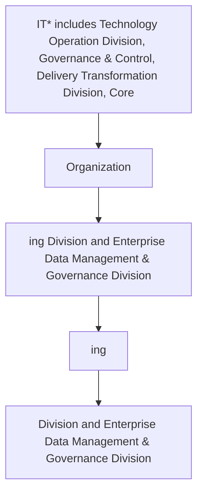

## . Data Architecture and Modelling KPIs

It is important to measure and analyze the effectiveness of data architecture and modelling KPIs. Following KPIs to be adopted and monitored by Data Architecture and Modelling team.

| Category | Metric | Description |
| --- | --- | --- |
| Data Architecture artifact | Number of data architecture artefact created | The total number of artifacts for each data architecture created within one year. |
| Target state architecture | Number of gaps between the data architecture baseline and target state | Total number of gaps identified between the data architecture baseline and target state data architecture. This metric will be monitored annually. |
| Target state architecture | Number of gaps resolved between the data architecture baseline and target state | Total number of gaps resolved between the data architecture baseline and target state data architecture. This metric will be monitored annually. |
| Data Model | Number of Data Models created vs databases | Total number of data models VS total number of databases during the year. |
| Data Model | Number of Data Models updated | Total number of data models updated during the year. |
| Data Model | Number of unstructured datasets modelled | Data modelling done on total number of unstructured datasets during the year. |
| Dataset | Number of datasets included within data flow documentation | Datasets included in data flow documentation during the year |
| Dataset | Number of datasets included within the Entity Relationship Diagram | The number of datasets become part of the Entity Relationship Diagram (ERD) during the year. |


**[Flowchart — Word Shapes]:**

1. IT* includes Technology Operation Division, Governance & Control, Delivery Transformation Division, Core
2. Organization
3. ing Division and Enterprise Data Management & Governance Division
4. ing
5. Division and Enterprise Data Management & Governance Division


**[Flowchart — Structured]:**

```markdown
# Step Table

| Step | Description                                                                             | Decision |
|------|-----------------------------------------------------------------------------------------|----------|
| 1    | IT* includes Technology Operation Division, Governance & Control, Delivery Transformation Division, Core |          |
| 2    | Organization                                                                             |          |
| 3    | ing Division and Enterprise Data Management & Governance Division                        |          |
| 4    | ing                                                                                      |          |
| 5    | Division and Enterprise Data Management & Governance Division                            |          |

# Mermaid Diagram


```