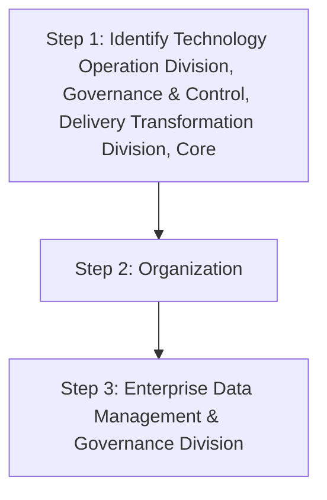

## .4. Data Operations KPIs

Data Operations team shall monitor these KPIs and help in providing inputs to gather statistics on usage of ’s data storage capabilities. The KPIs should include, at minimum, the following:

| Category | Metric | Description |
| --- | --- | --- |
| Storage Capacity Monitoring | % of total data storage capacity used | Percentage of data storage capacity utilized. This KPI will help to manage the storage capacity quarterly |
| Storage Capacity Monitoring | % of data storage capacity used by type of database | Percentage of data storage capacity utilized by database type. This KPI will help to manage the storage capacity at database each level quarterly |
| Storage Capacity Monitoring | % of data storage capacity used for backups | Percentage of data storage capacity utilized. This KPI will help to manage and monitor the storage capacity utilized for backup on half-yearly basis. |
| Performance Monitoring | Number of performed data transactions | Total number of data transaction performed during a quarter |
| Performance Monitoring | Average time of queries execution | The average time a query takes to execute. The queries maybe ETL queries, queries in application/systems to fetch the data, queries as part of stored procedure/stored process. This KPI will be monitored on monthly basis. |


**[Flowchart — Word Shapes]:**

1. IT* includes Technology Operation Division, Governance & Control, Delivery Transformation Division, Core
2. Organization
3. ing Division and Enterprise Data Management & Governance Division


**[Flowchart — Structured]:**

```markdown
### Step Table

| Step Number | Description                                                                                  | Decision | Next Step Yes | Next Step No |
|-------------|----------------------------------------------------------------------------------------------|----------|---------------|--------------|
| 1           | Identify Technology Operation Division, Governance & Control, Delivery Transformation Division, Core | No       | 2             |              |
| 2           | Organization                                                                                 | No       | 3             |              |
| 3           | Enterprise Data Management & Governance Division                                             | No       |               |              |

### Mermaid Diagram


```