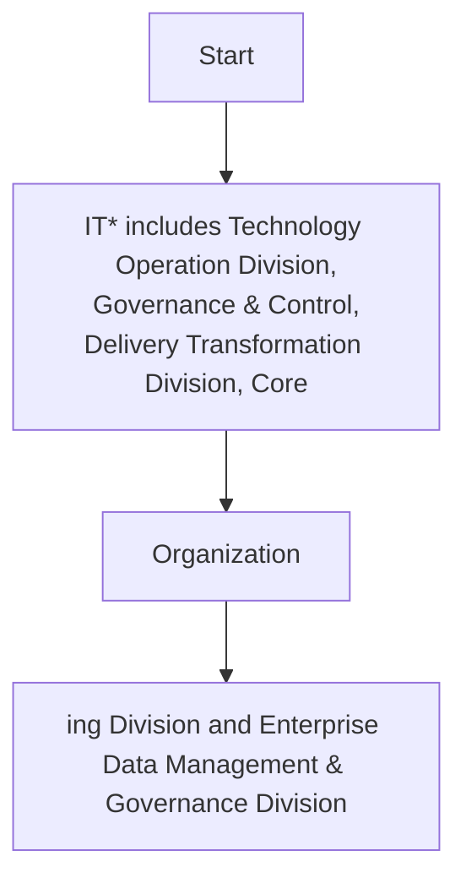

## Data Quality Exercises

Based on the dimensions/criteria provided and the approach, data quality exercises are carried out in order to monitor, identify, and address data quality issues. Different types of data quality exercises are detailed in the table below.

| Exercise | Definition |
| --- | --- |
| Data Quality Management | The practice of setting data quality standards and metrics that are applicable to data fields, domains, or subject areas. Data quality management includes the periodic evaluations of data quality against the data definitions and quality metrics, cleansing of erroneous data and root-causes remediation of erroneous data. |
| Data Quality Monitoring | An ongoing exercise that examines data for violations of data standards. The goals of monitoring are to maintain data quality, prevent past issues from recurring and identify previously unidentified data quality issues. |
| Data Quality Profiling | Profiling is a more detailed review of quality than monitoring and focuses on the content of data as well as data standards. Profiling results are documented in audit reports and resolutions are documented in remediation and improvement plans. |
| Data Quality Remediation | • The exercise of resolving data quality issues, as identified through monitoring and profiling activities. Some examples of data quality remediation involve changes to source systems, business rules, transformation processes in databases, and the redesign of business processes and applicable staff training.<br>• Whenever quality issues are identified with data from external sources, the same should be reported to the data producer/source, wherever possible. Appropriate data quality remediation plan should be discussed and agreed with the data producer in possible cases. |
| Remediation Plan | The detailed analysis and planning of resolution steps that must be performed to satisfactorily resolve an identified and prioritized data quality issue |


**[Flowchart — Word Shapes]:**

1. IT* includes Technology Operation Division, Governance & Control, Delivery Transformation Division, Core
2. Organization
3. ing Division and Enterprise Data Management & Governance Division


**[Flowchart — Structured]:**

```markdown
## Step Table

| Step | Description |
|------|-------------|
| 1    | IT* includes Technology Operation Division, Governance & Control, Delivery Transformation Division, Core |
| 2    | Organization |
| 3    | ing Division and Enterprise Data Management & Governance Division |

## Mermaid Diagram

