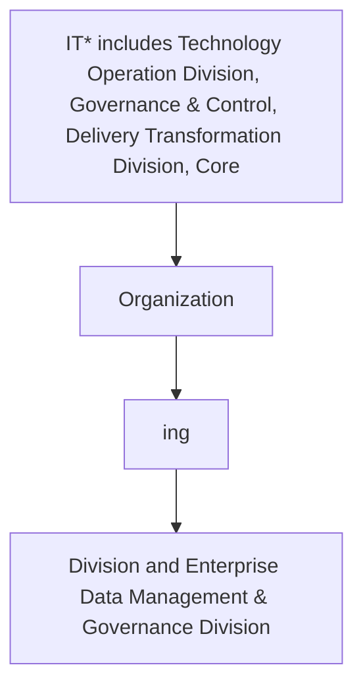

## .4. Data Sharing and Interoperability KPIs

It is important to measure and analyze the effectiveness of data sharing and interoperability activities. Data Owners are accountable for adopting the Key Performance Indicators (KPIs). The following table delineates the data sharing key performance indicators.

| Category | Metric | Description |
| --- | --- | --- |
| Data Sharing Request Volume | Number of Data Sharing Requests received | Total number of data sharing requests received by during a specified time duration |
| Data Sharing Request Volume | Number of Data Sharing Requests Accepted/denied | Number of data sharing requests received and accepted/denied by during a specified time duration |
| Data Sharing Process Efficiency | The average time taken for evaluating the Data Sharing requests received (days) | The average time taken for processing the data sharing requests received. Indicates the efficiency of processing the data sharing requests |
| Data Sharing Process Efficiency | Percentage of external data sharing requests fulfilled within the NDMO stipulated 90 days | Data sharing requests processed during a specific period against the number of requests received, expressed in percentage. Indicates the timeliness and compliance with NDMO directives on data sharing |
| Data Interoperability Efficiency | Data transfer rate between systems / applications | The average rate of data transfer between multiple systems and applications during a specified time duration |
| Data Interoperability Efficiency | Latency between data sources and data targets | The average latency (delays) of data transfer from data sources to data target (application, systems, data warehouse(s) etc ) |


**[Flowchart — Word Shapes]:**

1. IT* includes Technology Operation Division, Governance & Control, Delivery Transformation Division, Core
2. Organization
3. ing
4. Division and Enterprise Data Management & Governance Division


**[Flowchart — Structured]:**

```markdown
### Step Table

| Step | Description                                                                                       |
|------|---------------------------------------------------------------------------------------------------|
| 1    | Identify "IT* includes Technology Operation Division, Governance & Control, Delivery Transformation Division, Core"    |
| 2    | Identify "Organization"                                                                           |
| 3    | Identify "ing"                                                                                    |
| 4    | Identify "Division and Enterprise Data Management & Governance Division"                         |

### Mermaid Diagram


```