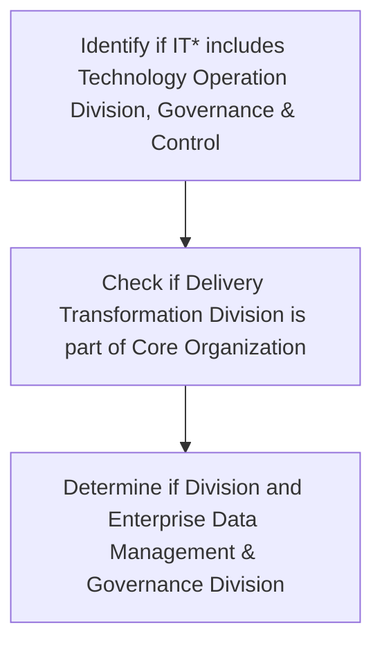

## .4. Document and Content Management KPIs

DMS team and Data Owners shall monitor these KPIs and help in providing inputs and measure its documents management efficiency. The KPIs should include, at minimum, the following:

| Category | Metric | Description |
| --- | --- | --- |
| Capacity Monitoring | Volume of the [client] 's documents stored and managed within the Document Management System | Metrics on utilized capacity of [client] ’s Document Management System |
| Capacity Monitoring | Number of users of the [client] 's Document Management System | Metrics on user of [client] ’s Document management System |
| Migration | % of identified paper-based documents migrated to electronic format | Percentage of paper-based document that are identified to migrate to electronic format. |
| Performance Monitoring | Training and Awareness programs conducted | Total number of training and awareness programs conducted by [client] management. |
| Performance Monitoring | Attendance for training and awareness programs | Metrics on number of people attended the training and awareness programs conducted by [client] management |


**[Flowchart — Word Shapes]:**

1. IT* includes Technology Operation Division, Governance & Control, Delivery Transformation Division, Core
2. Organization
3. ing
4. Division and Enterprise Data Management & Governance Division
5. ing Division and Enterprise Data Management & Governance Division


**[Flowchart — Structured]:**

```markdown
## Step Table

| Step Number | Description                                                                  | Decision | Next Step (Yes) | Next Step (No) |
|-------------|------------------------------------------------------------------------------|----------|----------------|----------------|
| 1           | Identify if IT* includes Technology Operation Division, Governance & Control | N/A      | 2              | N/A            |
| 2           | Check if Delivery Transformation Division is part of Core Organization       | N/A      | 3              | N/A            |
| 3           | Determine if Division and Enterprise Data Management & Governance Division   | N/A      | End            | N/A            |

## Mermaid Diagram


```