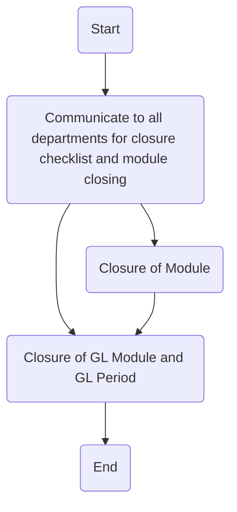

1. **Process Name**: GL period closure

2. **Roles (Swimlanes)**:
   - Accounting Manager
   - Relevant Stakeholders

3. **Steps in Markdown Table**:

   | Step # | Role                | Action                                            | Next Step/Logic                    |
   |--------|---------------------|---------------------------------------------------|-----------------------------------|
   | 1      | Accounting Manager  | Start                                             | 2                                 |
   | 2      | Accounting Manager  | Communicate to all departments for closure checklist and module closing | 3, 4                             |
   | 3      | Accounting Manager  | Closure of GL Module and GL Period                | 5                                 |
   | 4      | Relevant Stakeholders | Closure of Module                                | 3                                 |
   | 5      | Accounting Manager  | End                                               | -                                 |

4. **Mermaid.js Code Block**:

