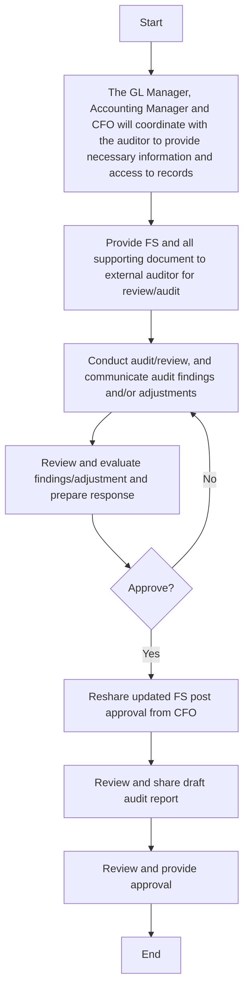

### Flowchart Analysis

#### 1. Process Name
External audit or review and final approval of financial statements

#### 2. Roles (Swimlanes)
- GL Manager
- Accounting Manager
- CFO
- Auditors
- Board

#### 3. Steps in Markdown Table

| Step # | Role             | Action                                                        | Next Step/Logic                   |
|--------|------------------|---------------------------------------------------------------|-----------------------------------|
| 1      | GL Manager       | Coordinate with the auditor to provide necessary information and access to records | 2                                 |
| 2      | GL Manager       | Provide FS and all supporting document to external auditor for review/audit | 3                                 |
| 3      | Auditors         | Conduct audit/review, and communicate audit findings and/or adjustments | 4                                 |
| 4      | Accounting Manager | Review and evaluate findings/adjustment and prepare response | 5                                 |
| 5      | CFO              | Approve?                                                      | Yes: 6 / No: 3                    |
| 6      | Accounting Manager | Reshare updated FS post approval from CFO                   | 7                                 |
| 7      | Auditors         | Review and share draft audit report                          | 8                                 |
| 8      | Board            | Review and provide approval                                  | End                               |

#### 4. Mermaid.js Code Block

