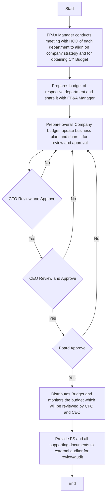

Sure, here is the analysis based on the provided flowchart:

### 1. Process Name
- Comparison of Budgeted and Actual Financial Statement

### 2. Roles (Swimlanes)
- Respective Department
- FP&A Manager
- CFO
- CEO
- Board

### 3. Steps in a Markdown Table

```markdown
| Step # | Role                 | Action                                                                                     | Next Step/Logic                   |
|--------|----------------------|--------------------------------------------------------------------------------------------|-----------------------------------|
| 1      | FP&A Manager         | Conducts meeting with HOD of each department to align on company strategy and for obtaining CY Budget | 2                                 |
| 2      | Respective Department| Prepares budget of respective department and share it with FP&A Manager                     | 3                                 |
| 3      | FP&A Manager         | Prepare overall Company budget, update business plan, and share it for review and approval | 4                                 |
| 4      | CFO                  | Review and approve                                                                         | 5 (Yes) / 3 (No)                  |
| 5      | CEO                  | Review and approve                                                                         | 6 (Yes) / 3 (No)                  |
| 6      | Board                | Approve                                                                                    | 7 (Yes) / 3 (No)                  |
| 7      | FP&A Manager         | Distributes Budget and monitors the budget which will be reviewed by CFO and CEO           | End                               |
| 8      | Respective Department| Provide FS and all supporting documents to external auditor for review/audit               | End                               |
```

### 4. Mermaid.js Code Block



This flowchart showcases the steps involved in comparing budgeted and actual financial statements, highlighting the review and approval process across different roles.