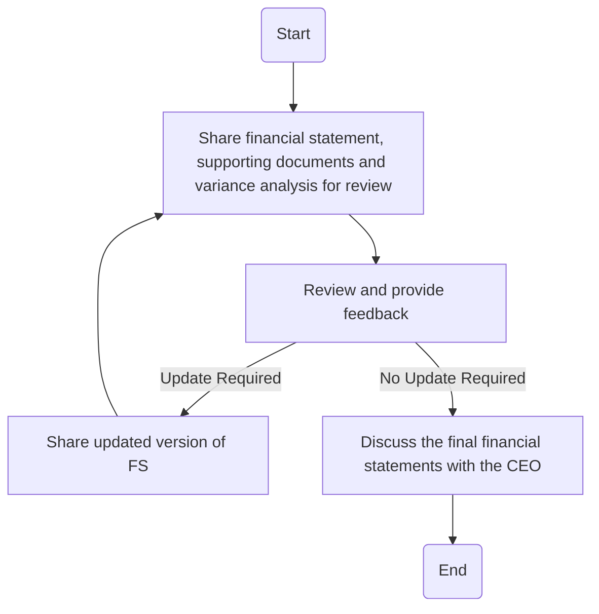

### Analysis of Flowchart

1. **Process Name**: 
   - Review of financial statement by Senior Management

2. **Roles (Swimlanes)**:
   - Accounting Manager
   - CFO
   - CEO

3. **Steps Extracted into a Markdown Table**:

   | Step # | Role             | Action                                                                 | Next Step/Logic                       |
   |--------|------------------|------------------------------------------------------------------------|---------------------------------------|
   | 1      | Accounting Manager | Share financial statement, supporting documents, and variance analysis with senior management for review | Go to Step 2                          |
   | 2      | CFO              | Review and provide feedback                                            | If update required, go to Step 3, else go to Step 4 |
   | 3      | Accounting Manager | Share updated version of FS                                           | Go back to Step 2                     |
   | 4      | CFO              | Discuss the final financial statements with the CEO in a meeting to plan future actions | End                                   |

4. **Mermaid.js Code Block**:

