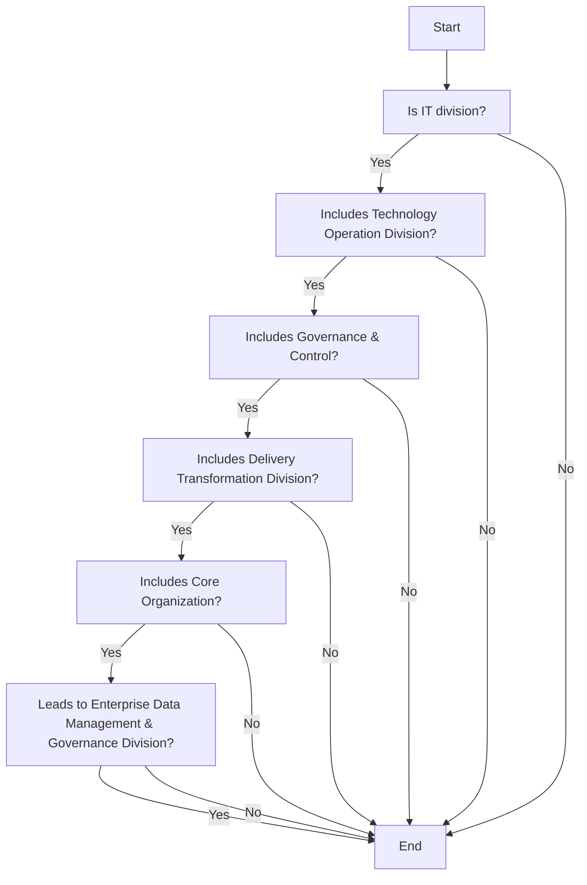

## .3. Roles, Responsibilities and RACI Matrix

The following roles and responsibilities are applicable to this policy:
 Data Management and Governance Leadership Team: The executive body of  data management & governance is responsible for signing off on any changes, exemption, and exceptions to this policy.
 Data Governance Council: The strategic body of  data management & governance authorizes freedom of information exercises, defines priorities and critical data, and is responsible for approving or rejecting requesters appeal for sharing data.
 Data Governance officer: An experienced business domain representative responsible for managing all data management & governance initiatives and changes. The data governance officer overlooks and manages the FOI requests and monitor the data sharing approaches.
 Stewardship Team: The stewardship team is responsible for attending training and awareness sessions, implement FOI request process steps, document all FOI requests, respond to data requestor, prepare and share request forms, maintain FOI register and raise any issue related to FOI requests.
 Head of : Head of  responsible for managing all data management & governance initiatives and changes. The Head of  overlooks and manages the delivery of data to the requestor and maintains plans, timelines, budgets, ensuring that progress is made.
 Chief Risk Officer (CRO): CRO is accountable for authorizing FOI Plan and roadmap, update FOI policy, launch training and awareness programs, determine fees for processing FOI request, monitoring Compliance and is responsible for create FOI Plan including Roadmap and assignment of required resources and budget, publish information on 's websites
 Data Owner: The Data Owner is responsible for providing domain-specific executive-level support in data operations and storage exercises, communicating the reports of the exercises across the business domain, support implementation of FOI process, manage and monitor activities of stewardship team, resolve FOI related issues raised by stewardship team.
 Data Privacy Officer (DPO): DPO is accountable and responsible for create FOI Plan including Roadmap and assignment of required resources and budget, authorizing FOI Plan and roadmap, update FOI policy, launch training and awareness programs, implement Request for Information process, document FOI requests, respond the data requestor, publish information on 's websites, prepare request forms, determine fees for processing FOI request,  maintaining FOI Register, raising FOI related issues , check Data Privacy and Data Sharing principles against requested data
 Data User: Any individual interacting with the data without having direct control over it. The data users are responsible for raising any issues that surface while interacting with the data. Data user is responsible for raising FOI related issues
 Compliance Officer: An experienced domain representative accountable and responsible for monitoring compliance
 GRM Team:  GRM Team is responsible for raising FOI related issues to the relevant stakeholders and support for the resolution.

| Main Activities | The Board | DG Leadership Team | Head data management | GRM Team | DG Council | Data Privacy Officer | Data Governance Officer | Compliance Officer | Data Owner | Data User | Chief Risk Officer | Stewardship Team | Data Specialist |  |  |  |
| --- | --- | --- | --- | --- | --- | --- | --- | --- | --- | --- | --- | --- | --- | --- | --- | --- |
| Main Activities | The Board | DG Leadership Team | Head data management | GRM Team | DG Council | Data Privacy Officer | Data Governance Officer | Compliance Officer | Data Owner | Data User | Chief Risk Officer | Data Domain Steward | Business Domain Steward | Data Steward | Business Steward | Data Specialist |
| Create FOI Plan including Roadmap and assignment of required resources and budget |  | I |  | i | A | I |  | R |  | R | I | C | I | C |  |  |
| Authorizing FOI Plan and roadmap |  | I |  | I | R | I |  | R |  | A | I | C | I | C |  |  |
| Update FOI policy |  | I |  | I | R | C |  | C |  | A | C | I |  |  |  |  |
| Launch training and awareness programs |  | I | R | C |  | C |  | A | I |  |  |  |  |  |  |  |
| Implement Request for Information process |  | I |  | I | A, R | C |  | R |  | C |  |  |  |  |  |  |
| Document FOI requests |  | A, R |  | C |  | I | C |  |  |  |  |  |  |  |  |  |
| Respond the data requestor |  | A, R |  | C |  | I | C |  |  |  |  |  |  |  |  |  |
| Publish information on [client] 's websites |  | I |  | I | A | I |  | R |  | R | I |  |  |  |  |  |
| Prepare request forms |  | I | A, R | I |  | R |  | C |  |  |  |  |  |  |  |  |
| Determine fees for processing FOI request |  | C |  | C | R | C |  | C |  | A | C | I |  |  |  |  |
| Monitoring Compliance |  | I | A, R | C |  | R, A |  |  |  |  |  |  |  |  |  |  |
| Maintaining FOI Register |  | A |  | R |  | C | R | i | I | C |  |  |  |  |  |  |
| Raising FOI related issues |  | R | C | R | I |  | A | R | I | R | C |  |  |  |  |  |
| Check Data Privacy and Data Sharing principles against requested data |  | C |  | R, A | I |  | C |  | C | I |  |  |  |  |  |  |


**[Flowchart — Word Shapes]:**

1. IT* includes Technology Operation Division, Governance & Control, Delivery Transformation Division, Core
2. Organization
3. ing
4. Division and Enterprise Data Management & Governance Division


**[Flowchart — Structured]:**

```markdown
### Step Table

| Step | Description                                                                                      | Decision       |
|------|--------------------------------------------------------------------------------------------------|----------------|
| 1    | Identify if it's the IT division                                                                 | No             |
| 2    | Check if it includes Technology Operation Division                                               | Yes/No implied |
| 3    | Determine if it includes Governance & Control                                                    | Yes/No implied |
| 4    | Verify if it includes Delivery Transformation Division                                           | Yes/No implied |
| 5    | Confirm if it includes Core Organization                                                         | Yes/No implied |
| 6    | Check if it leads to Enterprise Data Management & Governance Division                            | Yes/No implied |

### Mermaid Diagram


```