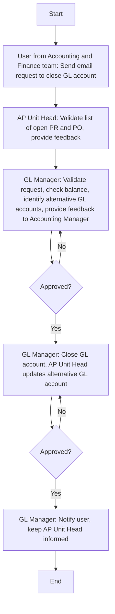

### Analysis

#### 1. Process Name
- Closing/Deactivating of GL Accounts

#### 2. Roles (Swimlanes)
- User from Accounting and Finance team
- AP Unit Head
- GL Manager
- Accounting Manager

#### 3. Steps in Markdown Table

| Step # | Role                             | Action                                                                                           | Next Step/Logic   |
|--------|----------------------------------|--------------------------------------------------------------------------------------------------|-------------------|
| 1      | User from Accounting and Finance team | A user from the Accounting and Finance department using SAP can email a request to close a GL account. | Step 2            |
| 2      | AP Unit Head                     | Validate the list of open PR and PO where GL is mapped and provide feedback to the GL Manager via email. | Step 3            |
| 3      | GL Manager                       | Validate the request received, check the GL balance, identify alternative GL accounts where open POs and PRs can be mapped, and provide feedback for approval or rejection to the Accounting Manager via email. | Decision: Approved? |
| 4      | GL Manager                       | GL Manager will close the GL account in the SAP system and AP Unit Head will update the alternative GL account against the open PRs and POs. | Step 5 (if Yes)   |
| 5      | GL Manager                       | GL Manager to notify user via email, keep AP Unit Head informed.                                   | End               |

#### 4. Mermaid.js Code Block

Note: Decisions are represented by diamond shapes, and all actions with roles are indicated in brackets.