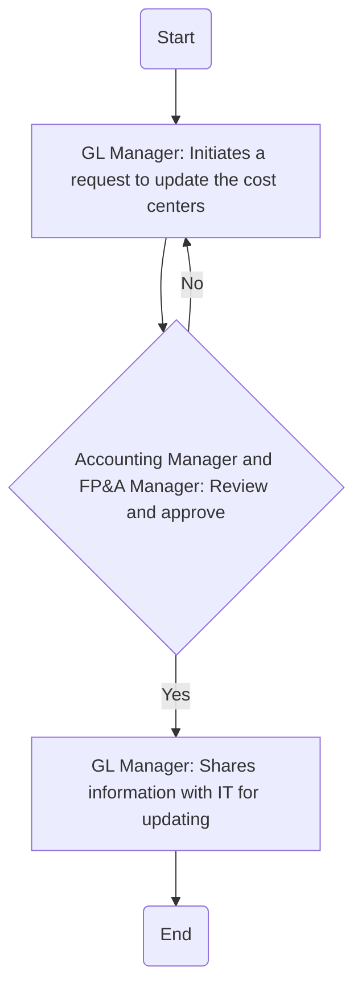

### Analysis of the Flowchart

1. **Process Name:** 
   - Update COA

2. **Roles (Swimlanes):** 
   - GL Manager
   - Accounting Manager and FP&A Manager

3. **Steps (Markdown Table):**

   | Step # | Role                          | Action                                                                       | Next Step/Logic     |
   |--------|-------------------------------|------------------------------------------------------------------------------|---------------------|
   | 1      | GL Manager                    | Initiates a request to update the cost centers, specifying the reason for change. | Step 2              |
   | 2      | Accounting Manager and FP&A Manager | Review and approve.                                                          | Yes: Step 3; No: Step 1 |
   | 3      | GL Manager                    | Shares information with IT for updating, keeping everyone in the loop.         | End                 |

4. **Mermaid.js Code Block:**

This representation summarizes the process and logic flow in a structured format suitable for implementation in an AI or process automation scenario.