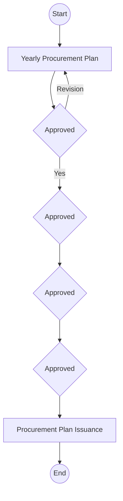

## Policies For Developing Procurement Plan

Policies
This section defines the core policies governing how procurement plans are developed at Arabian Mills. These policies ensure that the planning process is collaborative, data-driven, performance-monitored, and aligned with company objectives.
Procurement Plan Philosophy
 The development of the procurement plan must be coordinated with all department heads to ensure alignment with organizational needs.
 The Supply Chain Director is responsible for managing the planning process, which must receive formal approval from the Chief Executive Officer (CEO).
Planning Frequency
 A new procurement plan must be developed yearly ensuring continuous alignment with evolving operational and financial requirements.
Plan Accuracy
 The procurement plan must be developed using the most accurate inputs available from all affected departments to minimize deviations and ensure reliability.
Plan Execution
 All procurement activities must be executed strictly in accordance with the approved procurement plan, including quantities, specifications, and timelines of items to be procured.
Procurement Plan Execution Performance
 The performance of the procurement plan execution must be continuously monitored and measured through internal reporting mechanisms to the CEO.
 Any deviations or variances must be documented and considered during the development of the next procurement plan cycle.
Changes to Plan
 Any required changes to the procurement plan must be evaluated for impact, justified appropriately, and the plan updated accordingly.
Financial Considerations
 The procurement plan must be developed with a strong emphasis on maximizing value for money in all purchasing activities.
 This includes exploring cost-effective alternatives and leveraging bulk purchasing opportunities where applicable.
Quality Considerations
 The procurement plan must fully comply with quality specifications provided by the respective process owner or item requester to ensure procurement meets operational standards.
Ethical Practices
The procurement planning process must uphold the following ethical standards:
 Conflict of Interest: Avoid any undue influence or bias in selecting planned vendors or items.
 Integrity: Ensure truthful representation of needs and supplier capabilities.
 Confidentiality: Protect sensitive supplier and pricing data during the planning phase.
 Declaration of Interests: Disclose any conflicts that may affect sourcing or planning.
 Supplier Relations: Maintain transparency and fairness in engagement with suppliers during planning.
Plan Amendment
 Any amendments to the procurement plan must be formally approved by the relevant Department Manager, the Supply Chain Director, and the COO before implementation.
Procedure
The following table presents the step-by-step procedure to be followed at Arabian Mills when developing the procurement plan.

| S. No | Responsibility | Procedure Description | Output / Report |
| --- | --- | --- | --- |
|  | Procurement Manager | • Send a request to the Sales Department for the annual sales forecast , and to the Production Department to provide the production plan and procurement needs for the upcoming 6 months , followed by the next period. Categorize requisition items into: Raw Materials, Packaging Materials, Production Consumables, Machinery Spare Parts, Machineries and Equipment, and Other Materials and Items. • Notes: The forecast or planning report should be shared by the Head of the department to Procurement manager | Procurement Needs Report |
|  | Procurement Officer | Send a request to the Sales Department to provide the sales plan and procurement needs for the upcoming 6 months . | Procurement Needs Report |
|  | Procurement Officer | Send a request to the Maintenance Department to provide procurement needs for the upcoming 6 months , which may include: Spare Parts, Maintenance Disposables, Productivity Items, and Other Materials. * | Procurement Needs Report |
|  | Procurement Officer | Send a request to the HR & Administrative Department to provide procurement needs for the upcoming 6 months , which may include: Stationery, Consumables, Printer Ink, Toners, Ribbons, and Administrative Items. * | Procurement Needs Report |
|  | Procurement Officer | Send a request to all other departments to provide their procurement needs for the upcoming 6 months , based on operational requirements. * | Procurement Needs Report |
|  | Procurement Officer | • The procurement plan for Raw Materials and Packaging Materials is reviewed by the Material Planner under the guidance of the Supply Chain Director. • Procurement department doesn’t’ having the material planner | Procurement Needs Report |
|  | Transportation Manager | Evaluate the Product Sheet for each truck and assess spare part requirements as per the recommendations of vehicle dealers. Every two months , prepare a list of fast-moving and frequently consumed spare parts. Coordinate with dealers, leasing companies, or service centers for maintenance schedules. Receive the Sales Plan at the beginning of the year and conduct a load assessment to match required vs. available vehicle capacity. Coordinate vehicle acquisition (buy/lease) as needed. | **Product Sheet** • It’s not for the procurement |
|  | Procurement Manager | Receive contracting work requirements from concerned departments. Discuss the contract's technical sheet with the responsible engineer to set selection criteria and choose a contractor. For vehicle needs, analyze the capacity gap and cover it through buying or leasing based on geography, volume, transaction size, and financial feasibility. | Contracting Requirement Summary |
|  | Material Planning Manager | Every two months , prepare a list of fast-moving and consumable spare parts required frequently for operational continuity. Should be from the maintenance department planner | Email |
|  | Procurement Manager / Supply Chain Director | Review and approve expected procurement items based on: Current Year Procurement Plan, Department Budgets, Expected Next Year Sales and Projects, and Current Year Procurement Performance. Budget monitoring and validation with the Finance department | Email Approval |
|  | Procurement Manager | Conduct in-depth market research by category and provide feedback to Procurement Officers on: Preferred suppliers, Price ranges, Alternative options, Supplier capabilities, Economic & shipping conditions, Technology/quality factors, Lead times, Customs considerations, Financial health of suppliers, and Strengths/Weaknesses. | Market Intelligence Email |
|  | Procurement Officer | Send RFQs for each item with complete specifications, quantities, and delivery timelines to a minimum of 3 pre-qualified suppliers/contractors . | RFQs Issued |
|  | Suppliers and Contractors | Submit price quotations to the Procurement Officer in response to RFQs. | Price Quotations |
|  | Procurement Officer | Review and evaluate commercial terms for each quotation. Prepare a comparison sheet and share it with the Procurement Manager, Supply Chain Director, and Head of Department. | Quotation Comparison Sheet |
|  | Procurement Manager | After receiving technical evaluations from requesters, initiate negotiation with shortlisted suppliers regarding price and delivery terms. If agreed, instruct suppliers to lock quantities and prices. Prepare and sign contracts for CEO approval. Share final contract with contractors and finance . | Signed Contracts |
|  | Procurement Manager | If agreement cannot be reached with the preferred supplier, discuss with requesters whether trade-off is justified. If yes, proceed; if not, consider the next supplier in the ranking. | Justification Email |
|  | Procurement Officer | Prepare a bid evaluation form with a recommendation. Send both soft and hard copies to the Procurement Manager, Supply Chain Director, and HOD for review and approval. | Bid Evaluation Form |
|  | Procurement Manager | Review and sign the bid evaluation form, confirming selection decision. | Approved Bid Evaluation Form |
|  | Procurement Manager | Ensure payment approval limit aligns with policy: CEO approval required for payments from SAR 1 to SAR 200 million . | PR Form |
|  | Procurement Officer / Material Planner | • Consolidate all approved information to prepare the Next Year Procurement Plan , including Item Name, Opening Stock, Monthly Demand, Unit Cost, and Total Purchase Value. • Should come from the requestor's department (planner). | Draft Procurement Plan |
|  | Supply Chain Director | Review the Draft Procurement Plan with all Department Managers, incorporate amendments, and obtain approvals and signatures. | Signed Procurement Plan |
|  | CEO | Review, approve, and sign the Final Procurement Plan. | Approved Procurement Plan |
|  | Department Managers | Submit a formal request for any change, replacement, or cancellation of items listed in the approved plan. | Internal Memorandum |
|  | Supply Chain Director | Review the requested changes and evaluate their impact. Consult with Department Heads and submit final recommendation to CEO for review and approval. | Internal Memorandum |
|  | CEO | Review and approve/reject proposed changes to the Procurement Plan. | CEO-Approved Memo |
|  | Procurement Officer | Reflect approved changes in the Procurement Plan and forward the updated version to the Supply Chain Director for final processing post-COO , HOD approval. | Amended Procurement Plan |

* Notes: The reports should be shared by the procurement manager to the officer
Flowchart

**[Diagram — PNG]:**

**Process Name:** Procurement Planning Flowchart  

**Roles / Swimlanes:**

- Procurement Manager  
- SC Director  
- COO  
- CFO  
- CEO  

---

### Steps

| Step # | Role                | Action                          | Decision/Next Step                                                                 |
|--------|---------------------|---------------------------------|------------------------------------------------------------------------------------|
| 1      | Procurement Manager | Start                           | Proceeds to Step 2                                                                 |
| 2      | Procurement Manager | Yearly Procurement Plan         | Proceeds to Step 3                                                                 |
| 3      | SC Director         | Approved                        | Branch “Yes” to Step 4; branch “Revision” back to Step 2                           |
| 4      | COO                 | Approved                        | Proceeds to Step 5                                                                 |
| 5      | CFO                 | Approved                        | Proceeds to Step 6                                                                 |
| 6      | CEO                 | Approved                        | Proceeds to Step 7                                                                 |
| 7      | *Not specified*     | Procurement Plan Issuance       | Proceeds to Step 8                                                                 |
| 8      | *Not specified*     | End                             | Flow terminates                                                                    |

Connector labels present in the diagram:
- “Revision” (arrow from “Approved” under SC Director back to “Yearly Procurement Plan”)  
- “Yes” (arrow from “Approved” under SC Director to the next “Approved” under COO)

---

