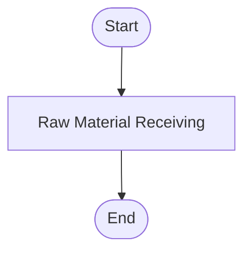
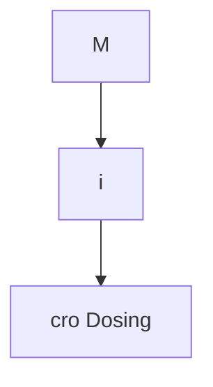
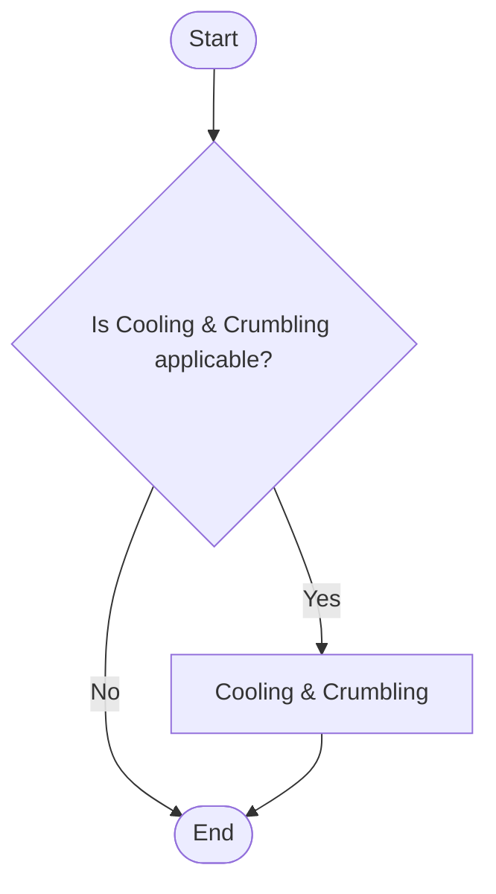
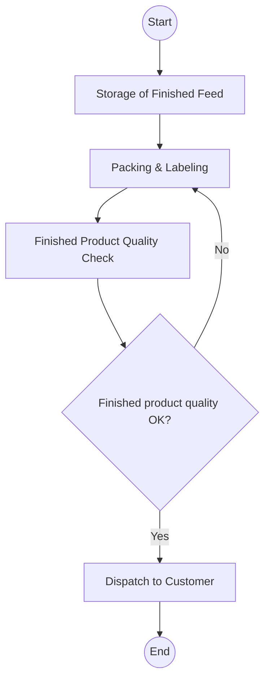
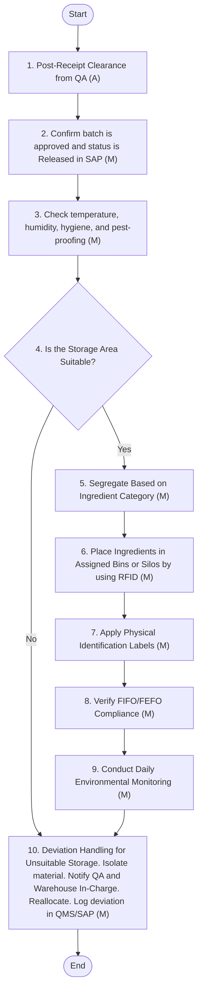
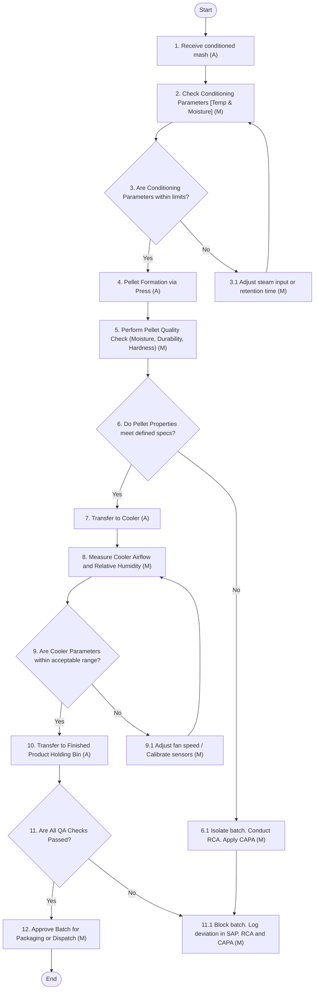
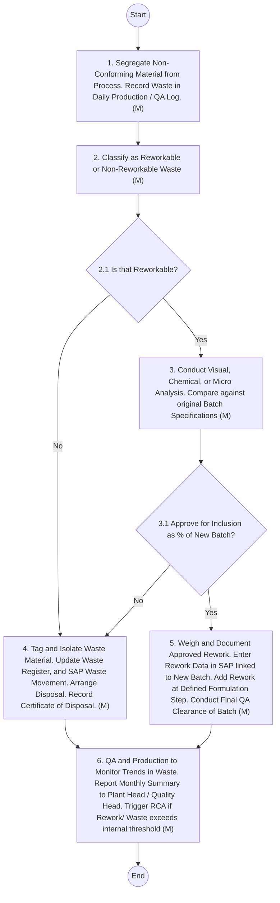

## 1.5 Production Procedures

A. Feed Mill Equipment Listing:
Arabian Mills operates a dedicated feed manufacturing facility adjacent to its flour mill. While the feed mill is functional and compliant with key quality practices, this section outlines the equipment typically required in modern feed mills to support safe, efficient, and traceable production.
The listing below reflects essential equipment and associated technical features commonly found in well-operated feed mills and may serve as a benchmark for evaluating current assets or planning future upgrades. The descriptions focus on the functional importance of each equipment category rather than specific make or model.
2.1 Key Equipment Used in Feed Mill Operations:
2.1.1 Raw Material Receiving System:
 Purpose: Initial unloading of macro and micro ingredients from trucks into silos or storage bins.
 Saliant Features:
  o Mechanical conveyors and bucket elevators
  o Dust collection system to prevent airborne particulate release
  o Magnetic separators and sieves for removal of foreign matter
 Importance: Ensures foreign body removal and proper segregation at the first point of contact.
2.1.2 Ingredient Storage Silos/Bins:
 Purpose: Bulk storage of raw materials before processing.
 Saliant Features:
  o Dedicated silos for allergens, oilseeds, and micro ingredients
  o Moisture- and pest-proof design
  o Level sensors for stock control (optional automation)
 Importance: Supports FIFO/FEFO and avoids cross-contamination.
2.1.3 Micro Dosing System:
 Purpose: Precise weighing and dosing of low-inclusion ingredients (vitamins, minerals, medications).
 Saliant Features:
  o Gravimetric dosing scales with ±0.1% accuracy
  o Anti-segregation mixer
  o SAP/MES-linked batch verification panel
 Importance: Critical for nutritional accuracy and traceability of potent ingredients.
2.1.4 Macro Dosing & Weighing System:
 Purpose: Bulk weighing of major ingredients (grains, meals, bran).
 Saliant Features:
  o Load cell-based weigh hoppers
  o Recipe-linked batch sequencing via SAP or PLC
  o Overfill alarms and tolerance checks
 Importance: Ensures accurate batch formation and compliance with formulation specs.
2.1.5 Mixer (Horizontal or Ribbon Blender):
 Purpose: Blending of all ingredients to ensure uniform nutrient distribution.
 Saliant Features:
  o Validated mixing time (180–240 seconds)
  o CV% monitoring system
  o Load cells for batch verification
 Importance: A critical control point (CCP). Impacts feed homogeneity and performance.
2.1.6 Hammer Mill / Grinder:
 Purpose: Particle size reduction of ingredients before mixing.
 Saliant Features:
  o Interchangeable screens (300–3000 µm)
  o Vibration and temperature sensors
  o Amperage-based motor load indicator
 Importance: Improves digestibility and pellet stability.
2.1.7 Pelleting Press:
 Purpose: Compression of mixed feed into dense pellets.
 Saliant Features:
  o Adjustable die compression ratio
  o Conditioning chamber with temperature/moisture control
  o Feeder interlock to prevent bridging
 Importance: Directly affects pellet quality, hardness, and hygiene.
2.1.8 Cooler (Counter-Flow Type):
 Purpose: Reduces pellet temperature and moisture post-pelleting.
 Saliant Features:
  o Air velocity and residence time control
  o Integrated discharge gate and level sensors
 Importance: Prevents spoilage and condensation-related Mold growth.
2.1.9 Crumbler:
 Purpose: Reduces pellet size for young animals (e.g., chicks).
 Saliant Features:
  o Adjustable rollers
  o Product diverter flap for bypass
 Importance: Enhances feed form for species-specific needs.
2.1.10 Screening and Sifting Unit:
 Purpose: Removes fines and dust from final feed.
 Saliant Features:
  o Vibratory screen with different mesh sizes
  o Dust hood and fine collection hopper
 Importance: Improves product quality and presentation.
2.1.11 Packaging Station:
 Purpose: Bagging and labelling of finished feed products.
 Saliant Features:
  o Automatic or semi-auto bag fillers
  o Heat sealers or stitching machines
  o Integrated barcode/label printer linked to SAP
 Importance: Supports traceability, labelling compliance, and presentation.
2.2 Flow of Materials:
The flow of material in Arabian Mills' Feed Mill follows a systematic, traceable path starting from the receipt of raw ingredients and ending at the dispatch of finished, labeled feed products. Each step is supported by specific policies and procedures developed to ensure feed safety, traceability, process efficiency, and regulatory compliance:

**[Flowchart — Word Shapes]:**

1. Raw Material Receiving


**[Flowchart — Structured]:**

### 1. Identified Steps

From the provided flowchart text, the only explicit operational step is:

- **Raw Material Receiving**

To form a minimal complete flow, we add implicit Start and End nodes.

---

### 2. Decisions Detected

- **No Yes/No decision steps are implied** in the provided text snippet.

---

### 3. Step Table

| ID  | Step Name             | Type     | Description                           | Yes leads to | No leads to |
|-----|-----------------------|----------|---------------------------------------|--------------|-------------|
| S0  | Start                 | Start    | Entry point of the process            | S1           | —           |
| S1  | Raw Material Receiving| Process  | Receive and log raw materials         | S2           | —           |
| S2  | End                   | End      | Process completion                    | —            | —           |

---

### 4. Mermaid Diagram




**[Flowchart — Word Shapes]:**

1. Storage of Incoming Ingredients


**[Flowchart — Structured]:**

### Step Table

| ID  | Type    | Description                    | Yes -> | No -> |
|-----|---------|--------------------------------|--------|-------|
| S1  | Process | Storage of Incoming Ingredients | —      | —     |

### Mermaid Diagram


**[Flowchart — Word Shapes]:**

1. Macro Dosing


**[Flowchart — Structured]:**

| ID  | Step Name    | Type    | Description              | Next Step |
|-----|--------------|---------|--------------------------|-----------|
| S1  | Macro Dosing | Process | Perform macro dosing step | —         |


**[Flowchart — Word Shapes]:**

1. M
2. i
3. cro Dosing


**[Flowchart — Structured]:**

### Step table

| ID  | Description | Type    | Yes path | No path |
|-----|-------------|---------|----------|---------|
| S1  | M           | Process | –        | –       |
| S2  | i           | Process | –        | –       |
| S3  | cro Dosing  | Process | –        | –       |

_No explicit decisions (Yes/No) are implied in the provided text._

---

### Mermaid diagram




**[Flowchart — Word Shapes]:**

1. Mixing (Batching)


**[Flowchart — Structured]:**

| ID  | Step / Decision       | Type      | Description                 | Yes → Next | No → Next | Next |
|-----|------------------------|-----------|-----------------------------|------------|-----------|------|
| S0  | Start                  | Start     | Entry point to the process |            |           | S1   |
| S1  | Mixing (Batching)      | Process   | Perform mixing/batching     |            |           | E0   |
| E0  | End                    | End       | Process is complete         |            |           |      |

```mermaid
graph TD
    S0([Start])
    S1([Mixing (Batching)])
    E0([End])

    S0 --> S1
    S1 --> E0
```


**[Flowchart — Word Shapes]:**

1. Grinding (Particle Size Reduction)


**[Flowchart — Structured]:**

### Step table

| ID  | Label                          | Description                     | Type    | Yes → | No → |
|-----|--------------------------------|---------------------------------|--------|------|------|
| S0  | Start                          | Entry point to the process      | Start  | —    | —    |
| P1  | Grinding (Particle Size Reduction) | Reduce particle size by grinding | Process | —    | —    |
| E0  | End                            | Process completed               | End    | —    | —    |

_No decisions are explicitly or implicitly indicated in the provided text._

---

### Mermaid diagram

```mermaid
graph TD
    S0([Start])
    P1[Grinding (Particle Size Reduction)]
    E0([End])

    S0 --> P1 --> E0
```


**[Flowchart — Word Shapes]:**

1. Conditioning


**[Flowchart — Structured]:**

### Step table

| ID  | Name         | Type      | Description                     | Next |
|-----|--------------|-----------|---------------------------------|------|
| S1  | Conditioning | Process   | Perform the conditioning step. | —    |

### Decisions

No decision (Yes/No) steps are implied or detected in the provided text.

### Mermaid diagram


**[Flowchart — Word Shapes]:**

1. Pelleting


**[Flowchart — Structured]:**

### Step table

| ID  | Name      | Type    | Description                     |
|-----|-----------|---------|---------------------------------|
| S1  | Pelleting | Process | Pelleting operation / activity. |

No decision points (Yes/No) are implied by the given text.

---

### Mermaid diagram


**[Flowchart — Word Shapes]:**

1. Cooling & Crumbling (if applicable)


**[Flowchart — Structured]:**

| ID  | Step / Decision                          | Type      | Description                                      | Yes →           | No →  |
|-----|------------------------------------------|-----------|--------------------------------------------------|-----------------|-------|
| S0  | Start                                    | Start     | Entry point to the process                       | D1              | —     |
| D1  | Is Cooling & Crumbling applicable?       | Decision  | Determine whether Cooling & Crumbling is needed  | P1              | E     |
| P1  | Cooling & Crumbling                      | Process   | Perform cooling and crumbling operations         | E               | —     |
| E   | End                                      | End       | Process ends                                     | —               | —     |




**[Flowchart — Word Shapes]:**

1. Screening / Sifting


**[Flowchart — Structured]:**

### Step table

| ID  | Step name          | Type    | Description                  | Next step |
|-----|--------------------|---------|------------------------------|-----------|
| S1  | Screening / Sifting | Process | Perform screening / sifting. | —         |

_No explicit decisions (Yes/No) are implied by the given text._

---

### Mermaid diagram


**[Flowchart — Word Shapes]:**

1. Dispatch to Customer
2. Storage of Finished Feed
3. Packing & Labeling
4. Finished Product Quality Check


**[Flowchart — Structured]:**

| ID  | Name                             | Type      | Description                                           | Next / Yes                                     | No (for decisions)         |
|-----|----------------------------------|-----------|-------------------------------------------------------|-----------------------------------------------|----------------------------|
| S   | Start                            | Start     | Entry point of the process                           | P1                                            | —                          |
| P1  | Storage of Finished Feed         | Process   | Store finished feed prior to packing and dispatch    | P2                                            | —                          |
| P2  | Packing & Labeling               | Process   | Pack and label the stored finished feed              | P3                                            | —                          |
| P3  | Finished Product Quality Check   | Process   | Perform quality check on the packed & labeled feed   | D1                                            | —                          |
| D1  | Finished product quality OK?     | Decision  | Decide if finished product meets quality standards   | P4 (if Yes)                                   | P2 (if No – re-pack/label) |
| P4  | Dispatch to Customer             | Process   | Dispatch conforming finished product to customer     | End                                          | —                          |
| End | End                              | Terminator| Process completion                                   | —                                             | —                          |



B. Incoming Ingredients – Receipt of Macro & Micro Ingredients:
3.1 Purpose:
The purpose of this section is to ensure the proper, safe, and traceable receipt of all macro and micro ingredients used in the manufacturing of animal feed. It aims to standardize the process for unloading, verifying, sampling, and recording incoming materials to:
 Maintain consistent feed quality and nutritional integrity.
 Prevent contamination and cross-contact between raw materials.
 Comply with applicable feed safety regulations and international quality standards (e.g., GMP+, ISO 22000, HACCP).
 Enable seamless integration with SAP for inventory tracking, material traceability, and batch formulation.
 Facilitate collaboration with Quality Assurance, Procurement, and Warehouse functions for accurate documentation and approval.
This procedure supports the overall feed safety system by providing a controlled approach for handling all incoming feed ingredients, whether bulk or bagged, ensuring they meet defined specifications before being used in production.
3.2 Policy Statement:
All incoming macro and micro ingredients shall be received under controlled conditions that ensure compliance with approved specifications, safety standards, and supplier qualifications. Only verified and approved raw materials shall be accepted into the feed mill’s storage or production systems. Materials that do not meet acceptance criteria will be rejected or held under quarantine until disposition is determined.
Each delivery shall be subjected to identity verification, visual inspection, and sampling as per defined protocols. Critical information such as batch numbers, supplier details, quantity, and condition shall be documented and interfaced into SAP in real time to support traceability and inventory control.
The Feed Mill, in coordination with Quality Assurance and Procurement, is committed to upholding product integrity and regulatory compliance by ensuring all received ingredients are handled with due diligence from point of receipt to final storage.
3.3 Scope:
This procedure applies to all macro (e.g., corn, wheat, soybean meal) and micro (e.g., premixes, vitamins, minerals, additives) feed ingredients received at the feed mill, whether delivered in bulk, bags, or containers. It covers the end-to-end process from material arrival at the facility to final acceptance or rejection, including:
 Coordination with suppliers and logistics teams for delivery scheduling
 Visual inspection, sampling, and quality verification
 Documentation of receipt, weight, and condition
 Integration of receipt data into SAP for traceability and inventory management
 Handling of non-conforming materials or discrepancies
The procedure is applicable to all personnel involved in goods receipt, including warehouse operators, weighbridge staff, QA personnel, SAP data entry users, and procurement support. It also aligns with relevant feed safety standards and cross-functional requirements with the Flour Mill, where by-products are shared.
3.4 Applicable Standards:
The receipt, inspection, and handling of incoming feed ingredients shall be conducted in compliance with the following international and internal standards, ensuring quality, safety, and traceability:
 GMP+ (Good Manufacturing Practices for Feed) – Covers feed safety assurance throughout the feed chain.
 ISO 22000:2018 – Food safety management systems requirements, including feed manufacturing.
 HACCP (Hazard Analysis and Critical Control Points) – Identifies and controls potential hazards in raw material intake.
 Codex Alimentarius – General principles of food and feed hygiene relevant to feed ingredient handling.
 GAFTA / FOSFA Contracts – When applicable, for trade and quality compliance of bulk agricultural ingredients.
 Local Feed & Food Regulatory Requirements – As mandated by government or agricultural authorities.
 Internal Feed Mill SOPs & Quality Manual – Includes acceptance criteria, sampling plans, and internal audit protocols.
 SAP Material Management (MM) Standards – For accurate GRN (Goods Receipt Note) generation, batch tracking, and integration with inventory.
These standards serve as the foundation for the procedures defined in this manual and are regularly reviewed to ensure ongoing compliance and continuous improvement.
3.5 Policies - Incoming Ingredients ‘Receipt of Macro and Micro Ingredients’:
i. All incoming raw materials must be scheduled in advance with appropriate coordination between Supply Chain, Planning, and Production teams to ensure readiness of space, manpower, and testing capabilities.
ii. No raw material delivery shall be accepted without prior verification of purchase order, material code, and system registration.
iii. Each consignment must be visually inspected upon arrival for packaging integrity, labeling accuracy, and signs of physical or pest-related damage before unloading is initiated.
iv. Statistical sampling methods must be applied for each batch, followed by laboratory or rapid testing for quality parameters such as moisture, aflatoxins, mycotoxins, and physical contaminants.
v. Any material failing to meet defined quality specifications must be rejected, physically tagged, quarantined, and updated in the SAP system as non-conforming stock.
vi. Accepted raw materials must be traceable through barcode or RFID labeling with complete batch-level identification including supplier, expiry date, and quality clearance status.
vii. All raw materials must be stored in segregated zones or silos based on ingredient category and risk profile to prevent cross-contamination and ensure integrity of high-risk ingredients.
viii. FIFO (First-In-First-Out) and First Expiry First Out (FEFO) inventory principles must be enforced through physical and digital inventory controls to prioritize usage of older batches and prevent expiry-based wastage.
ix. Periodic validation of stored materials must be conducted using defined test parameters (e.g., moisture, spoilage, magnet tests), and results recorded in the quality system for traceability.
x. A supplier performance monitoring system must be implemented to track quality consistency, rejection rates, and responsiveness, and must inform sourcing decisions through periodic reviews.
3.6 Procedure - Incoming Ingredients ‘Receipt of Macro and Micro Ingredients’:
The receipt of macro and micro ingredients is a critical control point in feed production, directly impacting product quality and safety. This procedure ensures that all incoming materials are inspected, sampled, and verified against predefined specifications, in line with SFDA, GSO, and internal feed safety standards. Integrated with SAP, the process ensures traceability, proper documentation, and compliance with storage and usage protocols. Non-conforming deliveries are systematically handled through the Non-Conformance Management process to prevent contamination or mis formulation.

| S No. | Procedure description | Responsibility | Frequency |
| --- | --- | --- | --- |
| 1. | **Pre-Arrival Coordination and Planning**<br>• All deliveries of raw materials must be pre-coordinated with the Supply Chain and Production teams. Advance shipping notifications and purchase order details must be reviewed to ensure space, manpower, and quality readiness. Material codes and batch quantities must be entered in SAP to facilitate system-based receipt and traceability. ✔ Acceptance: Material is listed in SAP; space and manpower arranged. ✖ Rejection: Delivery arrives without notification or planning. Actions on Rejection : i) Security at the gate to hold the vehicle and restrict entry. ii) Material Planner to verify PO against delivery documents. iii) If no PO match is found, the delivery is temporarily denied and deviation is logged in the Arrival Exception Register. iv) Planning Manager to be informed for decision on acceptance or rescheduling. | Material Planner | For each incoming PO |
| 2. | **Initial Receipt and Verification**<br>• On arrival, consignments must be unloaded only in the designated receiving bay. Receiving Supervisor c onduct s visual checks for packaging integrity, labeling correctness, infestation, and any physical damage. ✔ Acceptance: Packaging intact, clean, and correctly labeled. ✖ Rejection: Evidence of leakage, damage, pest activity, or incorrect labeling. Actions on Rejection : i) S top unloading immediately. ii) Label the consignment as "Hold – Suspected Non-conformance" and move to isolation zone. iii) QA team to be alerted for joint inspection. iv) Record the issue in SAP as an inbound non-conformance. v) Notify SCM and supplier for action. | Store Division Head , QA Analyst (for respective actions) | Every incoming vehicle |
| 3. | **Structured Sampling and Quality Testing**<br>• QA Analyst collects s amples following scientifically validated methods and batch-level traceability. Parameters like moisture, aflatoxin, foreign matter, and sensory attributes must be analyzed using rapid test kits and lab equipment. Results must be logged into QMS/SAP by QA Analyst . ✔ Acceptance: All results within defined tolerance. ✖ Rejection: Any parameter fails specification. Actions on Rejection :<br>• QA Analyst to :<br>• i) B lock the material in SAP with reason code. ii) Affix “Rejected” label physically on the batch. iii) Transfer material to quarantine zone with restricted access. iv) Retain sample and initiate internal NCR in QMS. v) Notify SCM for feedback to supplier and inform QA Manager. | QA Analyst , SC Manager , QA Manager (for respective actions) | Per batch/sample |
| 4. | **Rejection and Non-Conformance Management**<br>• If test failure is confirmed, the material is formally rejected as per documented protocol by Quality Manager . QA Analyst to log rejection reason and retain traceable sample. SCM must be informed immediately for supplier engagement. ✔ Acceptance: Meets all internal and external specs. ✖ Rejection: Confirmed quality parameter failure. Actions on Rejection :<br>• QA Analyst to: i) U pdate SAP block status with rejection category and justification. ii) Generate and send Rejection Report to SCM. iii) Submit retained sample to QA Lab Archive. iv) Initiate NCR and request supplier CAR within specified timeline. v) Rejected material to remain in tagged storage until disposal/replacement decision. | QA Analyst , SC Manager , QA Manager (for respective actions) | As applicable |
| 5. | **Acceptance, Labeling, and Identification**<br>• Warehouse Supervisor to l abel accepted material with SAP-linked barcode/RFID containing batch ID, material type, supplier, inspection status, and expiry. Link labeling to traceability database. ✔ Acceptance: Accurate barcode, SAP updated. ✖ Rejection: Label mismatch or release status not confirmed. Actions on Rejection : Store Division Head or WH Specialist to:<br>• i) S top movement to storage. ii) Validate barcode through SAP; reprint if needed. iii) Escalate mismatch to QA for resolution. iv) If mislabeling is recurrent, escalate to Department Head for process review. | Store Division Head or WH Specialist , QA Analyst (for respective actions) | Per batch |
| 6. | **Safe Storage and Segregation**<br>• Store materials in designated silos or rooms according to risk category (e.g., allergens, premix, bulk vitamins). Segregation to be verified by QA. Pest-proofing and environmental controls to be implemented. ✔ Acceptance: Stored in correct zone, no cross-contact risk. ✖ Rejection: Storage in wrong location or category. Actions on Rejection : Store Division Head to :<br>• i) H alt any further transfer. ii) Relocate the stock to correct bin. iii) Conduct visual inspection for potential contamination. iv) Record incident and inform QA for cross-check. v) Repeat violations to be addressed via retraining. | Store Division Head , QA Specialist (for respective actions) | Continuous |
| 7. | **FIFO Compliance and Inventory Management**<br>• Issue material using FIFO principle through SAP. Track expiry and aging alerts to minimize waste and stock-outs. ✔ Acceptance: Oldest stock issued first; SAP aligned. ✖ Rejection: Newer batch issued before older stock. Actions on Rejection : Material Plan ner t o:<br>• i) Halt issuance of new batch. ii) Perform batch movement traceability check. iii) Identify operator or system failure. iv) Document deviation and inform Production Scheduler for impact mitigation. v) Initiate correction in SAP. | Material Planner | Daily during issue |
| 8. | **Ongoing Validation and Preventive Monitoring**<br>• QA Analyst c onduct s periodic checks on stored materials for moisture, aflatoxin, spoilage, or pest signs. Magnet and sieve integrity must be checked. Record data in digital logbooks and QMS. ✔ Acceptance: Results within standards. ✖ Rejection: Deviations in condition or contamination. Actions on Rejection : QA Analyst to :<br>• i) T ag affected batch and move to quarantine. ii) Conduct root cause analysis involving Store and QA. iii) Schedule corrective pest control or hygiene interventions. iv) Update Preventive Monitoring Log in QMS. v) Notify SCM if shelf-life impact is foreseen. | QA Analyst | Weekly or as per schedule |
| 9. | **Supplier Performance Monitoring and Review**<br>• Track supplier KPIs: delivery timeliness, rejection rate, and responsiveness. Maintain performance dashboard. Use this data for sourcing decisions. ✔ Acceptance: Supplier score > 85% ✖ Rejection: Supplier score < 70% or repeated issues. Actions on Rejection : i) Procurement Specialist to initiate review call with supplier. ii) Issue formal Corrective Action Request CAR and request improvement plan. iii) Present findings in Monthly Sourcing Review Meeting. iv) Supplier to be placed on probation or delisted if unresolved.<br>• Please refer SCM policies and procedures for detailed procedures on Supplier Performance Evaluation. | Procurement Specialist | Monthly |

3.7 Flow Chart

**[Diagram — Visio-EMF→PNG]:**


C. Storage of Incoming Macro and Micro Ingredients:
4.1. Purpose:
To ensure that all incoming macro and micro ingredients are stored in a manner that preserves quality, prevents contamination, and maintains traceability, in accordance with regulatory requirements and internal feed safety standards.
4.2 Policy Statement:
Arabian Mills is committed to maintaining the integrity and safety of all raw materials used in feed production. Macro and micro ingredients must be stored under controlled conditions based on their risk profile, sensitivity to environmental conditions, and regulatory handling requirements. All materials shall be clearly labeled, properly segregated, stored off the floor, and rotated using FIFO/FEFO principles. SAP inventory control shall be used to track all storage movements and expiry dates.
4.3 Scope:
This procedure applies to:
 All macro and micro ingredients received for feed production.
 All warehouses, silos, rooms, and temporary storage areas.
 All personnel involved in material handling, quality assurance, inventory control, and SAP entries.
4.4 Applicable Standards:
 SFDA Animal Feed Regulations
 Codex Code of Practice on Good Animal Feeding (CAC/RCP 54-2004)
 ISO 22000:2018 – Food/Feed Safety Management System
 GMP+ and FAMI-QS Guidelines
 Arabian Mills Internal Feed Safety & Hygiene Policies
4.5 Policies - Storage of Incoming Ingredients:
i. All raw materials must be stored in designated, pest-controlled, and weather-protected facilities.
ii. High-risk materials (e.g., premixes, vitamins, enzymes, medicated ingredients) must be stored separately with restricted access.
iii. Temperature- and humidity-sensitive ingredients must be stored under controlled conditions as per manufacturer instructions.
iv. SAP must be updated in real-time for stock movements and expiry monitoring.
v. Daily housekeeping and storage inspections are mandatory.
4.6 Procedure – Storage of Incoming Ingredients:
Proper storage of incoming macro and micro ingredients is essential to preserve nutritional integrity, prevent cross-contamination, and ensure compliance with feed safety and quality standards. This procedure outlines the controls for segregated storage based on ingredient type, risk profile, and environmental sensitivity (e.g., moisture, light, pests). It incorporates FIFO/FEFO principles, SAP-enabled inventory traceability, and routine inspections aligned with Saudi SFDA regulations, GSO standards, and good manufacturing practices (GMP). The process ensures that materials remain in a compliant and usable state until formulation.

| S No. | Procedure description | Responsibility | Frequency |
| --- | --- | --- | --- |
| 1. | **Material Identification and Labeling**<br>• Store Division Head should label a ll incoming ingredients upon receipt with clear identification (material name, code, batch number, expiry date, status – QA Approved/Hold). Barcodes or RFID tags must be used for traceability. ✓ Acceptance: Label legible, complete, and matches SAP entry. ✗ Rejection: Missing or mismatched label. Actions on Rejection: i) Quarantine the material. ii) Notify QA and Warehouse In-Charge. iii) Verify data and reprint label if necessary. iv) Update status in SAP. | Supervisor Store Division Head | At receipt |
| 2. | **Segregation by Risk and Type**<br>• Store Division Head should s tore ingredients based on category (macro vs micro) and risk level (e.g., allergens, toxins, sensitive nutrients). Store Division Head should u se dedicated bins/racks/silos for high-risk items. Physical separation must always be maintained . ✓ Acceptance: Material stored in correct, designated area. ✗ Rejection: Cross-contact risk or misplacement. Actions on Rejection: Store Division Head to:<br>• i) Stop further storage action. ii) Relocate material to correct zone. QA Analyst to:<br>• iii) Inspect for contamination risk. iv) Document in storage log. | QA Analyst , Store Division Head (for respective actions) | Continuous |
| 3. | **Environmental Control and Monitoring**<br>• Maintain temperature and humidity within defined limits (e.g., <25°C and RH <65% for vitamins). Use calibrated hygrometers and temperature loggers. Calibrate monthly. ✓ Acceptance: Readings within limits; monitoring records available. ✗ Rejection: Deviations or faulty instruments. Actions on Rejection: i) Store Division Head to f lag affected material to Quality . QA Analyst to:<br>• ii) I nvestigate HVAC/insulation issue. iii) Initiate corrective action with Engineering. iv) Retest sensitive material if required. | Store Division Head , QA Analyst (for respective actions) | Daily |
| 4. | **FIFO/FEFO Compliance**<br>• Stock must be rotated based on First-Expired-First-Out for short- shelf-life materials (e.g., enzymes, vitamins), and FIFO for bulk raw materials. Use SAP alerts and physical bin cards. ✓ Acceptance: Materials issued based on expiry date. ✗ Rejection: Newer batch used before older one. Actions on Rejection:<br>• Store Division Head to : i) Halt issuance. ii) Investigate deviation and assign RCA. iii) Correct physical arrangement. iv) Report to Production Planner. | Material Planner Controller | Every issue |
| 5. | **Storage Hygiene and Pest Control**<br>• QA Specialist c onduct s weekly hygiene inspection of storage areas. Floors, racks, and bins must be clean and dry. Pest traps must be installed and monitored. Any sign of infestation must trigger immediate action. ✓ Acceptance: Area clean, dry, and pest-free. ✗ Rejection: Signs of pest, dampness, or spillage. Actions on Rejection: i) Isolate affected zone. ii) Clean and sanitize area. iii) Notify Pest Control and QA. iv) Monitor closely post-intervention. | Pest Management (external vendor) , QA Specialist (for respective actions) | Weekly |
| 6. | **Storage Documentation & SAP Entry**<br>• All receipts and storage location data must be recorded in SAP. Any movement (e.g., relocation, re-binning) must be updated in real-time. Paper logs, if used, must be reconciled daily. ✓ Acceptance: SAP updated; paper logs match movement. ✗ Rejection: Missing/incorrect data; movement not logged. Actions on Rejection: i) Review entries. ii) Rectify with responsible operator. iii) Escalate repeated lapses to IT and QA. | Warehouse In-charge , Data Entry Operator , Automation Engineer (for respective actions) | Real-time |

4.7 Flow Chart

**[Diagram — Visio-EMF→PNG]:**

**Process Name:**  
Storage of Incoming Macro and Micro Ingredients  

**Roles / Swimlanes:**

- Warehouse Supervisor  
- Inventory Controller  

---

### Steps

| Step # | Role | Action | Decision / Next Step |
|--------|------|--------|----------------------|
| Start | Warehouse Supervisor | Start | Proceed to step 1. |
| 1 | Warehouse Supervisor | 1. Post-Receipt Clearance from QA (A) | After post-receipt clearance, proceed to step 2. |
| 2 | Warehouse Supervisor | 2. Confirm batch is approved and status is Released in SAP (M) | After confirmation in SAP, proceed to step 3. |
| 3 | Warehouse Supervisor | 3. Check temperature, humidity, hygiene, and pest-proofing (M) | After checks, proceed to step 4. |
| 4 | Warehouse Supervisor | 4. Is the Storage Area Suitable? | **Yes:** Proceed to step 5.  **No:** Proceed to step 10 (Deviation Handling for Unsuitable Storage). |
| 5 | Warehouse Supervisor | 5. Segregate Based on Ingredient Category (M) | After segregation, proceed to step 6. |
| 6 | Warehouse Supervisor | 6. Place Ingredients in Assigned Bins or Silos by using RFID (M) | After placement, proceed to step 7. |
| 7 | Warehouse Supervisor | 7. Apply Physical Identification Labels (M) | After applying labels, proceed to step 8. |
| 8 | Inventory Controller | 8. Verify FIFO/FEFO Compliance (M) | After verification, proceed to step 9. |
| 9 | Warehouse Supervisor | 9. Conduct Daily Environmental Monitoring (M) | After conducting daily environmental monitoring, proceed to step 10. |
| 10 | Warehouse Supervisor | 10. Deviation Handling for Unsuitable Storage. Isolate material. Notify QA and Warehouse In-Charge. Reallocate. Log deviation in QMS/SAP (M). | After deviation handling, proceed to End. |
| End | Warehouse Supervisor | End | Process completed. |

---



D. Macro Dosing and Mixing (Batching):
5.1 Purpose:
To define standardized controls and procedures for the macro dosing and mixing process to ensure accurate batching, prevent cross-contamination (especially allergens and mycotoxins), and maintain product quality, regulatory compliance, and traceability.
5.2 Policy Statement:
It is the policy of the feed mill to follow a documented, validated, and auditable process for macro dosing and mixing. This process includes raw material segregation, allergen control, scale calibration, and batch sequencing to prevent cross-contamination and ensure consistency in feed formulation. Cleaning validation and root cause analysis are required for any deviations or discrepancies.
5.3. Scope:
This procedure applies to all operations involved in macro ingredient storage, segregation, weighing, dosing, mixing, cleaning, flushing, calibration, and verification at the batching stage. It covers:
 All macro ingredient silos and receiving hoppers
 All mixers and transfer conveyors
 All personnel involved in weighing, batching, and maintenance
5.4. Applicable Standards:
 GMP+ B2: Production of Feed Ingredients
 ISO 22000: Food Safety Management System
 FAMI-QS: Quality and Safety System for Specialty Feed Ingredients
 Codex Alimentarius: Principles for food hygiene and allergen control
 Local Food Safety Acts and Feed Regulations (e.g., FDA, EFSA)
5.5 Policies - Macro Dosing and Mixing (Batching):
i. Ingredients must be stored based on risk classification such as allergenic, high-protein, or high-mycotoxin categories, with clear visual labelling on all silos and containers. Co-storage of incompatible or allergenic materials is not permitted, and all storage zones must be validated, monitored, and periodically reviewed.
ii. Allergen-containing ingredients must be handled with strict control measures including physical segregation, batch sequencing from low- to high-risk, and validated cleaning protocols. These controls must be supported by annual risk assessments, employee training, and periodic ELISA testing to confirm absence of cross-contamination.
iii. Cleaning and flushing procedures must follow validated methods using defined materials and flushing volumes. Post-cleaning verification must be done using swab sampling or ATP-based hygiene monitoring, especially after handling allergenic or high-risk materials.
iv. All ingredient weighing must be conducted using SAP-defined batch formulations, ensuring each component falls within ±0.5% of the target weight. Scales must be internally calibrated daily and externally calibrated quarterly by certified vendors, with full calibration records maintained and accessible for audit.
v. No ingredient substitutions or formula modifications are allowed without a deviation request formally approved by the QA department. All such deviations must be documented, risk-assessed, and traceable within the batch record.
vi. Batching and sequencing must follow predefined logic to ensure correct ingredient order and prevent misplacement or segregation issues. All steps must be recorded in SAP, with real-time control checks and batch verification to ensure compliance and traceability.
vii. Any deviation in macro dosing must trigger a structured root cause analysis within 48 hours. The resulting corrective and preventive actions must be documented, tracked through closure, and verified by QA to prevent recurrence.
5.6 Procedure - Macro Dosing and Mixing (Batching):
Macro dosing and mixing is a foundational step in feed production, directly impacting product uniformity, nutritional accuracy, and overall feed safety. This procedure ensures that large-volume ingredients are weighed, sequenced, and blended according to validated formulations within defined tolerances. It integrates SAP-based recipe control, real-time weighing accuracy, allergen segregation, and flushing protocols to prevent cross-contamination. The process is designed in alignment with GMP, HACCP, and Saudi SFDA feed regulations to deliver consistent, traceable, and compliant feed batches.

| S No. | Procedure description | Responsibility | Frequency |
| --- | --- | --- | --- |
| 1. | **Ingredient Segregation & Labeling**<br>• Macro ingredients shall be segregated according to their risk profile (e.g., allergens, mycotoxin-prone materials, high-fat ingredients). Each silo or bin must be labeled with the ingredient name, risk category, and storage status using weatherproof tags. Cross-contamination must be avoided through physical segregation and color-coded systems. QA-approved storage maps must be available in the warehouse for quick verification.<br>• ✓ Acceptance: All bins and silos are clearly labeled; no incompatible ingredients stored together.<br>• ✗ Rejection: Labels are missing, damaged, or ingredients from incompatible categories are found stored together.<br>• Actions on Rejection:<br>• i) If labeling is missing or incorrect, the Warehouse Supervisor must immediately halt unloading or any material transfer. The affected storage bins must be re-labeled under supervision.<br>• ii) In case of co-storage of incompatible materials, the material is to be relocated to the correct bin and inspected for any cross-contamination risk.<br>• iii) A deviation report must be logged, and the incident escalated to the QA Manager for evaluation. | Store Division Head , QA Manager (for respective actions) | Daily |
| 2. | **Batch Sequencing**<br>• Batches must be scheduled in a sequence starting from low-risk to high-risk materials to minimize cross-contamination. The QA Manager must approve the sequence, especially when allergens are involved. Batch changeover must not proceed without validated cleaning between risk transitions. Sequence plans must be documented and reviewed daily.<br>• ✓ Acceptance: Batch schedule follows risk profile order and includes verified cleaning.<br>• ✗ Rejection: High-risk batch precedes low risk without validated cleaning; sequence deviation without documented approval.<br>• Actions on Rejection:<br>• i) The Shift Operator must immediately stop batching and notify QA Manager.<br>• ii) Emergency flushing or full cleaning must be carried out before resuming.<br>• iii) The deviation must be documented in the Batch Control Record and approved by QA.<br>• iv) The batch plan must be rescheduled accordingly to prevent downstream contamination. | Shift Operator, QA Manager (for respective actions) | Per batch schedule |
| 3. | **Flushing & Cleaning**<br>• Validated flushing procedures must be applied when switching between critical batches. Bran or inert material (50–100 kg or 1–2% line capacity) should be used as the flushing agent. ATP swabs and allergen kits (e.g., ELISA) must be used for verifying cleaning effectiveness. Swabbing points should include mixer internals, chute, and discharge pipe.<br>• ✓ Acceptance: Cleaning records complete; ATP/allergen tests within acceptable limits.<br>• ✗ Rejection: Residue or failed swab test; flushing not conducted.<br>• Actions on Rejection:<br>• i) QA Analyst must stop the production line. Re-cleaning must be conducted immediately, and follow-up ATP or allergen swab tests repeated.<br>• ii) The failed cleaning must be recorded in QMS. If failures persist, escalate to QA Manager for investigation and review of cleaning SOP effectiveness. | QA Analyst , QA Manager (for respective actions) | Per high-risk batch |
| 4. | **Weighing and Dosing**<br>• Each ingredient must be weighed according to the SAP-defined batch recipe using a calibrated scale. The operator must verify the ingredient code, batch ID, and confirm tolerance within ±0.5% of the target. Weighment data should be cross verified with SAP entries before transfer.<br>• ✓ Acceptance: Ingredient matches formulation; tolerance maintained.<br>• ✗ Rejection: Ingredient mismatch or weighment beyond ±0.5% without correction.<br>• Actions on Rejection:<br>• i) The Shift Operator must discard the incorrect dose and inform both QA and the Production Manager.<br>• ii) The weighing deviation must be documented in the Batch Record. A second weighment should be performed under supervision, and process delay must be recorded. | Shift Operator , QA Manager , Production Manager (for respective actions) | Every batch |
| 5. | **Scale Calibration**<br>• All scales used in batching must undergo daily internal calibration using certified test weights. Third-party calibration must be conducted quarterly, and certificates filed. Any drift beyond ±0.2% must be investigated.<br>• ✓ Acceptance: Calibration within ±0.2%; valid vendor certificate on file.<br>• ✗ Rejection: Calibration failure or no documentation available.<br>• Actions on Rejection:<br>• i) Sr. Technician must immediately label the scale as “Out of Use,” initiate troubleshooting, and notify QA.<br>• ii) All batches weighed since the last valid calibration must be reviewed.<br>• iii) Calibration deviation must be logged in the QMS, and affected batches flagged for QA risk assessment.<br>• Please refer to Plant Maintenance Management policies and procedures for detailed procedures relating to equipment calibration. | Sr. Technician , Feed Mill Operator , QA Manager (for respective actions) | Daily (internal), Quarterly |
| 6. | **Discrepancy Handling**<br>• Repeated discrepancies in weighing or mixing must trigger a formal Root Cause Analysis (RCA) and Corrective/Preventive Action (CAPA). QA must verify closure. The process area may require temporary suspension depending on risk severity.<br>• ✓ Acceptance: RCA completed within 48 hours; CAPA validated and closed.<br>• ✗ Rejection: Recurrence without investigation; unaddressed CAPAs.<br>• Actions on Rejection:<br>• i) The QA Manager must suspend operations in the affected area and initiate formal RCA (Fishbone/5-Why). The team must define and implement CAPA with deadlines.<br>• ii) Follow-up audits must confirm closure before resuming operation.<br>• iii) Notify to Production and Branch Manager<br>• Please refer to Plant Maintenance Management policies and procedures for detailed procedures relating to RCA and CAPA . | QA Manager | As triggered |
| 7. | **Allergen & Cross-Contact Control**<br>• Physical segregation of allergenic ingredients and validated cleaning protocols are mandatory. Allergen swab testing (e.g., lateral flow or ELISA) must be performed post-cleaning. An allergen control map and updated training logs must be maintained and reviewed annually.<br>• ✓ Acceptance: Negative allergen test; allergen SOP training completed.<br>• ✗ Rejection: Allergen detected in non-allergen batch; outdated training.<br>• Actions on Rejection:<br>• i) QA Specialist must block the affected batch and initiate swab re-testing. If confirmed positive, the batch must be rejected, and an RCA launched.<br>• ii) Staff must undergo retraining, and cleaning SOPs may need revision. iii) Affected equipment must be deep cleaned before further use. | QA Specialist , QA Manager , Production Manager (for respective actions) | Monthly + post-cleaning |

5.7 Flow Chart

**[Diagram — Visio-EMF→PNG]:**

**Process Name:** Macro Dosing & Mixing (Batching)

**Roles / Swimlanes:**

- Production & Mixing Supervisor  
- QA  

---

### Steps

| Step # | Role | Action | Decision/Next Step |
|--------|------|--------|--------------------|
| Start | Production & Mixing Supervisor | Start | Proceed to step 1. |
| 1 | Production & Mixing Supervisor | Batch production planning initiated. (A) | Proceed to step 2. |
| 2 | Production & Mixing Supervisor | Validate Bill of Materials (BOM) and batch formulation. (M) | Proceed to step 2.1. |
| 2.1 | Production & Mixing Supervisor | Is the Production Order complete and BOM accurate? | If **Yes** → step 3. If **No** → step 2.1.1. |
| 2.1.1 | Production & Mixing Supervisor | Halt process and notify Planning Team. (M) | Return to step 2 for revalidation. |
| 3 | Production & Mixing Supervisor | Segregate macro ingredients by risk category. Ensure silos/bins are labeled correctly. (M) | Proceed to step 3.1. |
| 3.1 | Production & Mixing Supervisor | Is segregation and labeling compliant? | If **Yes** → step 4. If **No** → step 3.1.1. |
| 3.1.1 | Production & Mixing Supervisor | Re-label bins, relocate material, and inform QA. (M) | Return to step 3.1. |
| 4 | Production & Mixing Supervisor | Schedule batches from low-risk to high-risk. Obtain QA approval. (M) | Proceed to step 4.1. |
| 4.1 | QA | Is sequencing validated? | If **Yes** → step 5. If **No** → step 4.1.1. |
| 4.1.1 | QA | perform cleaning, validate sequence, reschedule batch. (M) | Return to step 4.1. |
| 5 | QA | Perform flushing using validated material. Conduct ATP or allergen swab tests. (M) | Proceed to step 5.1. |
| 5.1 | QA | Is flushing validated? | If **Yes** → step 6. If **No** → step 5.1.1. |
| 5.1.1 | QA | Repeat cleaning and retesting. (M) | Return to step 5. |
| 6 | QA | Perform internal calibration and verify external certificate (M) | Proceed to step 6.1. |
| 6.1 | QA | Is calibration within acceptable range? | If **Yes** → step 7. If **No** → step 6.1.1. |
| 6.1.1 | QA | lock scale and inform Maintenance. (M) | Return to step 6 after maintenance/correction. |
| 7 | QA | Weigh ingredients per SAP-defined recipe. Cross-check with SAP interface. (M) | Proceed to step 7.1. |
| 7.1 | QA | Is weight accurate and ingredient verified? | If **Yes** → step 8. If **No** → step 7.1.1. |
| 7.1.1 | QA | Discard incorrect weighment and reweigh. (M) | Return to step 7.1. |
| 8 | QA | Load in the correct sequence to avoid segregation. (M) | Proceed to step 9. |
| 9 | QA | Run mixer for validated time and speed as per SOP. (M) | Proceed to step 10. |
| 10 | QA | QA checks for proper dosing, sequencing, and mixing parameters (A) | Proceed to step 10.1. |
| 10.1 | QA | All QA checks passed? | If **Yes** → End. If **No** → step 10.1.1. |
| 10.1.1 | QA | hold batch and initiate deviation protocol. (M) | Proceed to step 11. |
| 11 | QA | Perform root cause analysis. Implement corrective and preventive actions (CAPA). (M) | Proceed to step 12. |
| 12 | QA | Conduct allergen testing, validate cleaning, and update allergen risk map. (M) | Proceed to End. |
| End | QA | End | Process completed. |

---



```mermaid
graph TD
  Start([Start])
  S1["1. Batch production planning initiated. (A)"]
  S2["2. Validate Bill of Materials (BOM) and batch formulation. (M)"]
  D2_1{"2.1 Is the Production Order complete and BOM accurate?"}
  S2_1_1["2.1.1 Halt process and notify Planning Team. (M)"]
  S3["3. Segregate macro ingredients by risk category. Ensure silos/bins are labeled correctly. (M)"]
  D3_1{"3.1 Is segregation and labeling compliant?"}
  S3_1_1["3.1.1 Re-label bins, relocate material, and inform QA. (M)"]
  S4["4. Schedule batches from low-risk to high-risk. Obtain QA approval. (M)"]
  D4_1{"4.1 Is sequencing validated?"}
  S4_1_1["4.1.1 perform cleaning, validate sequence, reschedule batch. (M)"]
  S5["5. Perform flushing using validated material. Conduct ATP or allergen swab tests. (M)"]
  D5_1{"5.1 Is flushing validated?"}
  S5_1_1["5.1.1 Repeat cleaning and retesting. (M)"]
  S6["6. Perform internal calibration and verify external certificate (M)"]
  D6_1{"6.1 Is calibration within acceptable range?"}
  S6_1_1["6.1.1 lock scale and inform Maintenance. (M)"]
  S7["7. Weigh ingredients per SAP-defined recipe. Cross-check with SAP interface. (M)"]
  D7_1{"7.1 Is weight accurate and ingredient verified?"}
  S7_1_1["7.1.1 Discard incorrect weighment and reweigh. (M)"]
  S8["8. Load in the correct sequence to avoid segregation. (M)"]
  S9["9. Run mixer for validated time and speed as per SOP. (M)"]
  S10["10. QA checks for proper dosing, sequencing, and mixing parameters (A)"]
  D10_1{"10.1 All QA checks passed?"}
  S10_1_1["10.1.1 hold batch and initiate deviation protocol. (M)"]
  S11["11. Perform root cause analysis. Implement corrective and preventive actions (CAPA). (M)"]
  S12["12. Conduct allergen testing, validate cleaning, and update allergen risk map. (M)"]
  End([End])

  Start --> S1 --> S2 --> D2_1
  D2_1 -->|Yes| S3
  D2_1 -->|No| S2_1_1 --> S2
  S3 --> D3_1
  D3_1 -->|Yes| S4
  D3_1 -->|No| S3_1_1 --> D3_1
  S4 --> D4_1
  D4_1 -->|Yes| S5
  D4_1 -->|No| S4_1_1 --> D4_1
  S5 --> D5_1
  D5_1 -->|Yes| S6
  D5_1 -->|No| S5_1_1 --> S5
  S6 --> D6_1
  D6_1 -->|Yes| S7
  D6_1 -->|No| S6_1_1 --> S6
  S7 --> D7_1
  D7_1 -->|Yes| S8
  D7_1 -->|No| S7_1_1 --> D7_1
  S8 --> S9 --> S10 --> D10_1
  D10_1 -->|Yes| End
  D10_1 -->|No| S10_1_1 --> S11 --> S12 --> End
```

E. Micro Ingredients Dosing & Mixing:
6.1 Purpose:
To ensure accurate dosing and homogeneous mixing of micro-ingredients (e.g., vitamins, minerals, enzymes, premixes) in the feed production process, thereby ensuring nutritional integrity, compliance with feed safety standards, and minimizing the risk of cross-contamination.
6.2 Policy Statement:
Arabian Mills shall maintain precise and traceable control over the micro dosing and mixing process using validated equipment, automated dosing systems, and strict verification protocols. All micro-ingredients must be weighed, dispensed, and mixed according to the batch formulation with stringent adherence to weighing tolerance and segregation standards. All operations will comply with SFDA regulations, internal GMP protocols, and FAMI-QS guidelines.
6.3 Scope:
This procedure applies to all batches involving micro-ingredient dosing and mixing activities at the Feed Mill facility, including vitamin/mineral premixes, medicated additives, and other specialty ingredients handled at dosing accuracy of less than 5 kg per batch.
6.4 Applicable Standards:
 SFDA Feed Manufacturing Regulations
 FAMI-QS Code of Practice
 ISO 22000:2018
 GMP+ Feed Safety Assurance
 Company SOP-QA-018 (Micro Ingredient Control)
6.5 Policies – Micro Ingredients Dosing & Mixing:
i. All micro ingredients must be stored under controlled temperature and humidity conditions, segregated by risk class (e.g., allergens, antibiotics), and labeled clearly to prevent cross-contact.
ii. Only trained and authorized personnel are allowed to operate in the micro dosing cleanroom, following strict entry protocols and PPE requirements.
iii. Cleanroom hygiene and integrity must be always maintained, including airlock entry, surface sanitation, and enforcement of no-jewelry/no-loose-item policy to prevent foreign matter contamination.
iv. Micro ingredient weighing must follow SAP-defined formulation with ±0.1% tolerance, using calibrated precision balances. Batch-wise log must be maintained.
v. Weighed micro ingredients must be mixed in defined sequence using inert carriers (e.g., wheat bran) and pre-blended thoroughly for 1–2 minutes to ensure homogeneity.
vi. Each micro batch must be labeled with full traceability (batch code, operator ID, date/time) and must be verified by QA before release to macro mixing.
vii. Any deviations such as weighing errors or cross-contact must be reported immediately, batch blocked, and CAPA initiated under QA supervision.
6.6 Procedure - Micro Ingredients Dosing & Mixing:
Micro dosing and mixing are a critical step in feed production, responsible for the accurate incorporation of low-inclusion ingredients such as vitamins, trace minerals, amino acids, enzymes, and veterinary additives. Given the high potency and low margin for error associated with these materials, the process demands stringent control over weighing precision, sequencing, equipment hygiene, and traceability. This procedure outlines validated dosing protocols, segregation measures to prevent cross-contamination, and documentation requirements in compliance with GMP, HACCP, and SFDA feed safety standards.

| S No. | Procedure description | Responsibility | Frequency |
| --- | --- | --- | --- |
| 1 . | **Micro Ingredient Storage & Handling**<br>• All micro ingredients must be stored in clean, dry, and temperature-controlled environments. Each material must be labeled with full traceability info (batch number, expiry date, and supplier). Sensitive ingredients (e.g., enzymes, probiotics) should be stored in chilled conditions as per manufacturer recommendation.<br>• ✓ Acceptance: Labelled , undamaged packaging; ingredients within expiry.<br>• ✗ Rejection: Improper storage temperature, missing label, expired material.<br>• Actions on Rejection:<br>• i) Tag material as "Rejected" and move to quarantine. ii) Notify QA for inspection and sampling. iii) Update SAP batch status to "Blocked". iv) Coordinate with SCM for replacement or disposal. | Store Division Head , QA Analyst (for respective actions) | Daily / Per incoming batch |
| 2. | **Micro Ingredient Weighing**<br>• Ingredients must be weighed on precision balances (min 0.01 g readability) in a dust-free, ventilated area. Weighing must be done batch-wise as per formulation on SAP. Each weighing must be logged in the batch sheet and electronically verified.<br>• ✓ Acceptance: Weighing accuracy within ±0.2%; batch tag cross verified . ✗ Rejection: Over/underweight; label mismatch; wrong ingredient picked. Actions on Rejection: i) Discard mis weighed quantity. ii) Re-clean weighing tools and surfaces. iii) Repeat weighing with QA present. iv) Document deviation in weighing logbook. | Mechanic , QA Analyst (for respective actions) | Every batch |
| 3. | **Sequencing and Pre-blending**<br>• If required by the formulation, multiple micro ingredients must be pre-mixed with a carrier such as wheat bran or rice hulls to prevent segregation. Sequencing must avoid cross-contact (e.g., avoid premixes with antibiotics mixed with non-medicated batches).<br>• ✓ Acceptance: Pre-mix homogeneous; correct sequencing applied. ✗ Rejection: Omission of carrier; segregation; sequencing error. Actions on Rejection: i) Stop batching. ii) Discard affected pre-mix. iii) Investigate root cause and inform Production Supervisor. iv) Retrain staff if repeated. | Shift Operator , QA Analyst (for respective actions) | Per batch |
| 4. | **Micro Dosing Equipment Calibration**<br>• Automated dosing bins and screw feeders must be calibrated weekly using standard reference weights. The load cells must be validated to ensure accurate dispensing at low weights.<br>• ✓ Acceptance: Calibration within ±0.2%; certificates on record. ✗ Rejection: Calibration drift or incomplete log. Actions on Rejection: i) Suspend equipment use until recalibrated. ii) Inform Engineering for servicing. iii) Record deviation in calibration file. iv) Block any batches produced post-last calibration until verification.<br>• Please refer to Plant Maintenance Management policies and procedures for detailed procedures relating to equipment calibration. | Engineering Coordinator , QA Analyst (for respective actions) | Weekly |
| 5. | **Batch Charging & SAP Traceability**<br>• Charged micro-ingredients must be batch-coded and posted into SAP in real time. Operator must input material code, batch number, and quantity used into the SAP Production Order. Barcoding or RFID is preferred for reducing manual entry errors.<br>• ✓ Acceptance: Real-time SAP posting; all material traceable to batch. ✗ Rejection: Delayed entry; SAP mismatch; manual records only. Actions on Rejection: i) Suspend further dosing until SAP record is updated. ii) Inform QA and Production Planning. iii) Investigate and document reason for system lag. | Shift Operator , Production Planner , QA Manager (for respective actions) | Every Batch |
| 6. | **Cross-Contact & Allergen Control**<br>• Dedicated dosing tools must be used for allergenic or medicated ingredients. After each batch, tools and containers must be cleaned using validated cleaning protocols and verified via swab or visual inspection.<br>• ✓ Acceptance: Clean tools; no visible or swabbed residue. ✗ Rejection: Residue found; unclean tools; tool misuse. Actions on Rejection : i) Hold batch from further processing. ii) Re-clean and re-validate. iii) Report incident in the deviation tracker. iv) QA to authorize release post-verification. | QA Analyst , Shift Operator (for respective actions) | Per batch / Daily |
| 7. | **Preventive Controls and RCA**<br>• All deviations, overfills, spillages, or material loss must be recorded and investigated. Root cause analysis (5-Why or Fishbone) is mandatory for any recurring dosing errors. Corrective and Preventive Actions (CAPA) must be implemented and tracked.<br>• ✓ Acceptance: RCA completed within 48 hours; CAPA in place. ✗ Rejection: No RCA; recurrence of same issue. Actions on Rejection: i) Escalate to QA Manager and Maintenance Manager. ii) Review SOP and training effectiveness. iii) Log issue in deviation register and link to batch ID.<br>• Please refer to Plant Maintenance Management policies and procedures for detailed procedures relating to RCA and CAPA. | QA Manager , Maintenance Manager , Production Manager (for respective actions) | As triggered |

6.7 Flow Chart

**[Diagram — Visio-EMF→PNG]:**


F. Mixing (Batching):
7.1 Purpose:
To ensure homogenous mixing of all feed ingredients to meet nutritional specifications, regulatory compliance, and product quality requirements. This section defines controls for blending uniformity, oxidation prevention, and traceability.
7.2 Policy Statement:
All feed batches must undergo validated mixing procedures that include CV% testing, structured sampling, and preventive monitoring of ingredient degradation. Any deviations in mixing uniformity must trigger documented Root Cause Analysis and Corrective Action.
7.3 Scope:
This procedure applies to all mixing operations conducted in the feed mill, including macro and micro ingredient blending, liquid addition, and all quality checks associated with the mixing process.
7.4 Applicable Standards:
 ISO 6498: Animal feeding stuffs – Guidelines for sample preparation
 GMP+ FSA Module 2020
 FAMI-QS Code of Practice
 Feed Safety and Quality Standards (internal & regulatory)
 HACCP principles
7.5 Policies – Mixing (Batching):
i. Mixing must begin only after verifying the Production Order, BOM, and batch number in SAP to ensure material accuracy and traceability.
ii. All mixers and related equipment must be cleaned, residue-free, and validated before use. Calibration of load cells, RPM sensors, and discharge valves must be confirmed prior to operation.
iii. Ingredients must be weighed using calibrated scales with ±0.5% tolerance, and sequencing must follow the defined formulation. Pre-blending of low-dose ingredients must be done to prevent segregation.
iv. Ingredients must be loaded in the prescribed order using distribution controls like deflector plates. Mixing must be conducted for a validated duration and RPM as per equipment specification.
v. A minimum of 10 samples must be taken from different mixer zones as per ISO 6498. CV% testing must be conducted for macro nutrients and vitamin blends to ensure uniformity.
vi. CV% test results must meet internal QA limits (≤5% for macro, ≤10% for premix). All results must be recorded in SAP QM. Out-of-spec batches must be rejected, reworked, and RCA triggered.
vii. All deviations, including sampling errors or CV% failures, must be documented. Root Cause Analysis (RCA) and Corrective and Preventive Actions (CAPA) must be implemented and closed as per SOP.
viii. QC must verify each batch for ingredient sequence, mixing speed, and uniformity. Oxidation-prone ingredients must be tested weekly for Peroxide Value (PV) and Free Fatty Acids (FFA).
ix. Preventive maintenance for mixers must be scheduled and documented. FIFO policy must be strictly followed to avoid ingredient spoilage, with special controls for oxidation-prone materials.
x. Allergen-containing batches must be cleaned and verified post-mixing using validated swab tests. Allergen risk mapping and training must be documented and periodically updated.
7.6 Procedure – Mixing (Batching):
The mixing process is a Critical Control Point (CCP) in feed manufacturing that ensures uniform distribution of nutrients across each batch. Accurate mixing is essential to prevent nutritional imbalances, segregation, or medicated feed overdosing, each of which can compromise animal health and product performance. The Coefficient of Variation (CV%) serves as a statistical measure of blend uniformity and is a key quality indicator mandated by international feed standards. Achieving CV% within acceptable limits (typically ≤5% for protein and ≤10% for premix nutrients) confirms batch consistency and dosage accuracy. This procedure outlines all critical controls, including ingredient sequencing, mixer validation, structured sampling, in-process monitoring, and deviation management to uphold product safety, compliance, and traceability.

| S No. | Procedure description | Responsibility | Frequency |
| --- | --- | --- | --- |
| 1. | **Pre-Mixing Preparation**<br>• The Mixing Operator must begin by logging into the SAP Production Module and retrieving the current Production Order. This includes confirming the batch number, checking that the Bill of Materials (BOM) is complete, and verifying whether the materials have been issued against the batch. Once the order is validated, the operator must cross-check actual material availability against planned formulation to avoid stock variances or delays.<br>• Subsequently, the operator must inspect the mixer for cleanliness, it should be dry and free from any visible residue from the previous batch. Additionally, all functional elements of the mixer (load cells, discharge valve, and RPM controls) must be inspected for readiness. Weighing scales should also be verified for calibration status before proceeding.<br>• ✓ Acceptance: SAP order verified; clean and ready mixer; all materials available as per plan. ✗ Rejection: Incomplete Production Order; unclean mixer; equipment faults; material shortfall. Actions on Rejection:<br>• i) Do not proceed with the mixing operation.<br>• ii) Log a deviation in SAP QM Module indicating the exact reason (e.g., incomplete order, equipment issue).<br>• iii) Notify the Production Manager immediately for coordination of corrective steps.<br>• iv) Complete cleaning or maintenance actions as applicable, and ensure all materials are replenished before retrying | Mixing Operator , Production Manager (for respective actions) | Every Batch |
| 2. | **Ingredient Weighing and Sequencing**<br>• Ingredients must be weighed individually as per the SAP-defined batch formulation. The weighing must be accurate to within ±0.5% of the specified quantity. Micro-ingredients or additives, which are prone to segregation, should be pre-blended using an inert carrier such as rice bran to ensure even distribution during the mixing process.<br>• When required by the formulation logic, the weighing technician must input the defined ingredient addition sequence into SAP. Special attention must be given to avoid cross-contact or misidentification of critical ingredients like vitamins, enzymes, or medicated additives.<br>• ✓ Acceptance: Ingredient weights within tolerance; correct sequencing applied; carrier pre-mix used if required. ✗ Rejection: Weighing error; missing pre-mix; incorrect sequence. Actions on Rejection:<br>• i) Discard the incorrectly weighed ingredient immediately.<br>• ii) Reweigh and re-label as per standard procedure.<br>• iii) Enter the event in the weighing log for traceability.<br>• iv) Inform QA to review the cause and decide whether the batch process can continue or must restart. | Weighing Operator , QA Analyst (for respective actions) | Every Batch |
| 3. | **Ingredient Loading into Mixer**<br>• All weighed ingredients must be loaded into the mixer in the defined sequence to ensure homogeneity and prevent density-based segregation. Ingredients should be introduced using a deflector plate or chute to allow even layering inside the mixer. This is particularly important when handling a mix of powder and granular ingredients. The operator must ensure that all material is transferred completely without bridging or overflow.<br>• ✓ Acceptance: Loading sequence followed accurately; even ingredient distribution achieved. ✗ Rejection: Sequence error; material bridging or loss. Actions on Rejection:<br>• i) Stop the mixing process immediately.<br>• ii) Remove any bridged or stuck materials and clean the chute.<br>• iii) Reinspect the mixer to ensure it is ready for reloading.<br>• iv) Log the deviation and inform QA to validate the revised setup before continuing. | Mixing Operator , QA Analyst (for respective actions) | Every Batch |
| 4. | **Mixing Operation**<br>• Once all ingredients are loaded, the mixer must be operated at a validated speed, typically between 20–40 RPM depending on mixer design. The mixing time must be within the validated range (usually 180–240 seconds) to ensure uniform distribution of nutrients and additives. The operator must monitor the mixer for abnormal vibrations, heat buildup, or alarms via the SCADA interface or local control panel.<br>• ✓ Acceptance: Mixer runs smoothly; mixing time and speed as per validation; no alarms triggered. ✗ Rejection: Under/over mixing; process interruptions; abnormal equipment behavior. Actions on Rejection:<br>• i) Halt the mixing cycle immediately.<br>• ii) Perform equipment diagnostic to check for mechanical or control issues.<br>• iii) If batch time or speed was insufficient, reprocess the batch under QA guidance.<br>• iv) Record the event in the logbook and escalate to the Maintenance team if needed. | Machine Operator , QA Analyst (for respective actions) | Every Batch |
| 5. | **Structured Sampling for CV% (Uniformity Testing)**<br>• Upon mixing completion, the QA Analyst must collect at least 10 samples from the mixer — covering top, middle, and bottom layers — using an approved sampling probe. Samples should be representative of the entire batch and conform to ISO 6498 standards. Each sample must then undergo laboratory analysis or NIR testing to determine the Coefficient of Variation (CV%) for key nutrients such as crude protein and vitamin A.<br>• ✓ Acceptance: CV% values within control limits for<br>• [Protein ≤5%, Vitamin A ≤7%, Premix ≤10%]. ✗ Rejection: CV% exceeds limits; inadequate sampling; test discrepancy. Actions on Rejection:<br>• i) Block the batch in SAP to prevent dispatch.<br>• ii) Perform additional mixing or re-blending based on QA’s recommendation.<br>• iii) Retest CV% after re-mixing; if still out of spec, start Root Cause Analysis (RCA).<br>• iv) Document all actions in SAP QM module and tag batch for follow-up. | QA Analyst | Every Batch |
| 6. | **Recording and Usage Decision in SAP**<br>• All test results and uniformity data must be entered into SAP through the Quality Management (QM) module. The QA Officer will record the CV% results in the inspection lot and must decide whether to release or reject the batch. A rejected batch will be blocked in SAP and a notification for RCA will be automatically triggered.<br>• ✓ Acceptance: Results recorded; batch status updated; SAP decision documented. ✗ Rejection: Missing or late entry; incomplete inspection log. Actions on Rejection:<br>• i) Immediately complete the pending entries in SAP QM.<br>• ii) Escalate to QA Manager if repeated delays are observed.<br>• iii) Ensure rejection reason is clearly linked to batch ID and retained for audit trail. | QA Analyst , Data entry Operator (for respective actions) | Every Batch |
| 7. | **Routine QC Checks and In-Process Monitoring**<br>• Throughout the day, several routine tests must be conducted. These include mixer speed/time checks, swabbing after allergen product changeovers, and oxidation index monitoring (PV, FFA) especially for oil-based formulations. QC personnel must verify that control parameters remain within validated ranges and log all results in the daily quality control record.<br>• ✓ Acceptance: All parameters verified; equipment clean and functioning; results recorded. ✗ Rejection: Overlooked checks; abnormal test results. Actions on Rejection:<br>• i) Isolate and hold the batch from further processing.<br>• ii) Investigate equipment or formulation factors contributing to the deviation.<br>• iii) Record non-conformance and notify both QA and Production for RCA. | QA Analyst , QA Manager , Production Manager (for respective actions) | Batchwise / Weekly |
| 8. | **Deviation and Root Cause Analysis (RCA)**<br>• Any batch that fails CV% limits or is subject to a deviation must be logged in SAP. The QA Manager should initiate an RCA using structured tools like the 5-Why Analysis or Fishbone Diagram. Corrective actions must be defined and tracked until closure. This process helps reduce recurrence and ensures traceability.<br>• ✓ Acceptance: RCA conducted; CAPA implemented and closed. ✗ Rejection: No RCA done; repeated deviations. Actions on Rejection:<br>• i) Suspend related operations until cause is understood.<br>• ii) Escalate unresolved cases to QA Director.<br>• iii) Review and update mixing SOPs if required as part of corrective action. | QA Manager | As Triggered |
| 9. | **Preventive Controls and Maintenance**<br>• The Maintenance and Production teams must ensure that all mixers undergo routine preventive maintenance, including blade checks, motor inspection, and seal replacement. Ingredients that are sensitive to spoilage (e.g., oils, vitamins) must be stored in controlled environments and issued on FIFO basis.<br>• ✓ Acceptance: Maintenance on time; no expired or spoiled material used. ✗ Rejection: Missed preventive schedule; spoiled ingredient detected. Actions on Rejection:<br>• i) Immediately block any non-conforming ingredients in SAP.<br>• ii) Complete the overdue maintenance and inspect for damages.<br>• iii) File a preventive non-conformance report and ensure Maintenance Manager reviews future schedules.<br>• Please refer to Plant Maintenance Management policies and procedures for detailed procedures relating to preventive and corrective maintenance. | Engineering Coordinator , Maintenance Manager (for respective actions) | As Scheduled |

7.7 Flow Chart

**[Diagram — Visio-EMF→PNG]:**

**Process Name:** Mixing (Batching)

**Roles / Swimlanes:**
- Mixing Operator
- QA

---

### Steps

| Step # | Role            | Action                                                                                                                                          | Decision/Next Step                                                                                                                                                                |
|--------|-----------------|-------------------------------------------------------------------------------------------------------------------------------------------------|-----------------------------------------------------------------------------------------------------------------------------------------------------------------------------------|
| Start  | Mixing Operator | Start                                                                                                                                           | Proceed to Step 1.                                                                                                                                                                |
| 1      | Mixing Operator | Confirm BOM, batch number, and material issue status (M)                                                                                       | Proceed to Step 2.                                                                                                                                                                |
| 2      | Mixing Operator | Validate Formulation & Material Availability (M)                                                                                               | Proceed to Step 2.1.                                                                                                                                                              |
| 2.1    | Mixing Operator | Are all materials available?                                                                                                                   | Decision: If **Yes**, go to Step 3. If **No**, go to Step 2.1.1.                                                                                                                 |
| 2.1.1  | Mixing Operator | Hold batch, inform Planning & SCM (M)                                                                                                          | Outgoing next step is not explicitly shown in the diagram.                                                                                                                       |
| 3      | Mixing Operator | Inspect mixer (cleanliness, dryness, mechanical status) (M)                                                                                   | Proceed to Step 4.                                                                                                                                                                |
| 4      | Mixing Operator | Weigh Macro and Micro Ingredients (M)                                                                                                          | Proceed to Step 5.                                                                                                                                                                |
| 5      | Mixing Operator | Follow SAP or formulation-defined sequence (M)                                                                                                 | Proceed to Step 5.1.                                                                                                                                                              |
| 5.1    | Mixing Operator | Any allergenic or sensitive ingredients?                                                                                                       | Decision: If **Yes**, go to Step 5.1.1. If **No**, go to Step 6.                                                                                                                 |
| 5.1.1  | Mixing Operator | Perform pre-mix or segregation control V                                                                                                       | Proceed to Step 6.                                                                                                                                                                |
| 6      | Mixing Operator | Load Ingredients into Mixer (M)                                                                                                                | Proceed to Step 7.                                                                                                                                                                |
| 7      | Mixing Operator | Start Mixing. Maintain validated mixing time and speed. Log mixer parameters (RPM, duration) (M)                                              | Proceed to Step 8.                                                                                                                                                                |
| 8      | Mixing Operator | Take minimum 10 samples (top, mid, bottom) (M)                                                                                                | Proceed to Step 9 (QA).                                                                                                                                                           |
| 9      | QA              | Is CV% within acceptable limit?                                                                                                               | Decision: If **Yes**, go to Step 10. If **No**, go to Step 9.1.                                                                                                                  |
| 9.1    | QA              | Block batch, rework, initiate RCA (M)                                                                                                          | Proceed to Step 11.                                                                                                                                                               |
| 10     | QA              | Enter CV% Result in SAP – QM Module. Trigger usage decision and archive report (M)                                                            | Proceed to End.                                                                                                                                                                   |
| 11     | QA              | Conduct RCA, initiate CAPA, rework or discard batch (M)                                                                                       | Proceed to End.                                                                                                                                                                   |
| End    | QA              | End                                                                                                                                            | Process complete.                                                                                                                                                                 |

---

### Mermaid.js Flow

```mermaid
graph TD

    A[Start] --> S1[1. Confirm BOM, batch number, and material issue status (M)]
    S1 --> S2[2. Validate Formulation & Material Availability (M)]
    S2 --> D2_1{2.1 Are all materials available?}
    D2_1 -- Yes --> S3[3. Inspect mixer (cleanliness, dryness, mechanical status) (M)]
    D2_1 -- No --> S2_1_1[2.1.1 Hold batch, inform Planning & SCM (M)]

    S3 --> S4[4. Weigh Macro and Micro Ingredients (M)]
    S4 --> S5[5. Follow SAP or formulation-defined sequence (M)]
    S5 --> D5_1{5.1 Any allergenic or sensitive ingredients?}
    D5_1 -- Yes --> S5_1_1[5.1.1 Perform pre-mix or segregation control V]
    D5_1 -- No --> S6[6. Load Ingredients into Mixer (M)]
    S5_1_1 --> S6

    S6 --> S7[7. Start Mixing. Maintain validated mixing time and speed. Log mixer parameters (RPM, duration) (M)]
    S7 --> S8[8. Take minimum 10 samples (top, mid, bottom) (M)]

    S8 --> D9{9. Is CV% within acceptable limit?}
    D9 -- Yes --> S10[10. Enter CV% Result in SAP – QM Module. Trigger usage decision and archive report (M)]
    D9 -- No --> S9_1[9.1 Block batch, rework, initiate RCA (M)]

    S9_1 --> S11[11. Conduct RCA, initiate CAPA, rework or discard batch (M)]

    S10 --> EndNode[End]
    S11 --> EndNode
```

G. Grinding:
8.1 Purpose:
To ensure that the grinding of raw materials is performed consistently and accurately, producing particle sizes appropriate to species-specific nutritional requirements while minimizing energy use, production downtime, and equipment wear. This process aims to maximize feed conversion efficiency, product quality, and regulatory compliance.
8.2 Policy Statement:
It is the policy of the Feed Mill to conduct grinding operations in a controlled and validated manner that ensures consistent particle size distribution according to product specifications. The grinding process shall be monitored routinely using defined parameters and controlled tolerances. Equipment shall be maintained through predictive and preventive maintenance practices, and corrective actions shall be taken promptly upon detection of any deviation. All grinding activities must be documented, and root cause analysis shall be conducted on failures to ensure continuous improvement and compliance with feed safety and quality standards.
8.3 Scope:
This policy and procedure apply to all grinding operations conducted at the feed mill, covering the processing of raw materials used in the production of various feed types including broiler feed, layer feed, cattle feed, and other formulations. It includes the responsibilities of production, maintenance, and quality control teams involved in operating and monitoring hammer mills or any associated grinding equipment. The scope further extends to particle size verification, equipment calibration, preventive maintenance, deviation handling, and documentation.
8.4 Applicable Standards:
The grinding process at the feed mill shall comply with the following applicable internal and external standards to ensure safety, efficiency, and feed quality:
 ISO 22000:2018 – Food Safety Management Systems
 GMP+ Feed Safety Assurance Scheme
 Hazard Analysis and Critical Control Point (HACCP)
 Feed Code of Practice – FAO/WHO Codex Alimentarius
 Internal SOPs on Equipment Calibration and Maintenance
 Occupational Safety Standards (Local & OSHA equivalent)
8.5 Policies – Grinding:
i. All grinding equipment must be inspected and verified for cleanliness, foreign material removal, and maintenance readiness before every shift begins.
ii. Only QA-approved and within-shelf-life raw materials, traceable via batch/lot code, must be used in grinding operations.
iii. Machine settings including screen size, hammer speed, and feed rate must be configured according to species-specific feed specifications and documented before start-up.
iv. Continuous monitoring of grinding operations must be conducted to ensure even flow, no alarms, and operation within normal pressure, amperage, and temperature ranges.
v. Particle size verification must be performed hourly or per shift through sieve analysis, and results must meet defined product specifications.
vi. Immediate adjustments must be made to screen size, speed, or feed rate when particle size deviations are detected, with escalation if resolution is delayed.
vii. All weighing or metering instruments used in grinding must be calibrated daily in-house and verified periodically by certified external agencies.
viii. Any abnormal vibration, temperature, or noise during grinding must be logged and escalated as part of preventive maintenance control.
ix. Equipment must be cleaned, and wear parts such as hammers and screens must be inspected and recorded after every shift.
x. Any deviation observed during grinding must be logged, investigated within 48 hours, and resolved through a documented RCA and CAPA process involving QA review.
8.6 Procedure – Grinding (Particle Size Reduction):
Grinding, also referred to as particle size reduction, is a foundational step in feed production that directly influences feed efficiency, pellet durability, and nutrient availability. The process mechanically reduces raw materials such as grains, legumes, and oilseeds into uniform particle sizes tailored to species-specific nutritional and physical requirements. Proper grinding improves digestibility, minimizes feed wastage, and ensures homogeneous mixing in downstream processes. This procedure outlines operational controls, equipment calibration, monitoring practices, and corrective measures to maintain optimal particle size distribution and safeguard product quality.

| S No. | Procedure description | Responsibility | Frequency |  |
| --- | --- | --- | --- | --- |
| 1. | **Pre-operational Check**<br>• Prior to grinding, the shift operator inspect s the hammer mill, feeder, separator, and magnet to ensure equipment is clean, foreign matter is removed, and safety guards are intact. Maintenance history should be reviewed, and the pre-operational checklist must be completed and signed by Feed Mill Head XXX before proceeding.<br>• ✓ Acceptance: Equipment is clean, inspection checklist signed, no contamination or pending maintenance.<br>• ✗ Rejection: Presence of debris, incomplete checklist, or open maintenance issues.<br>• Actions on Rejection :<br>• i. Halt equipment start-up until the issue is resolved.<br>• ii. Remove any contaminants and re-clean all internal areas of the grinder.<br>• iii. Notify the Engineering Coordinator for any overdue tasks or mechanical concerns.<br>• iv. Escalate the delay to the Shift Supervisor for alternate planning or resource reallocation. | Shift Operator , Feed Mill Head , Engineering Coordinator (for respective actions) | Daily before shift start |  |
| 2. | **Material Request from Warehouse**<br>• Shift Operator to raise a material requisition through SAP system for the required ingredient(s) as per the approved batch formulation. The requisition must include the correct material code, required quantity, and designated bin. Once approved, the warehouse team will issue the material and update the SAP transaction for traceability. Operator must verify material label, bin number, and physical integrity before transferring for grinding. ✓ Acceptance – Correct material issued, proper documentation and bin mapping done, physical condition intact. ✗ Rejection – Incorrect material issued, damaged packaging, or mismatch in label or SAP code.<br>• Actions on Rejection:<br>• i) Notify Store Division Head immediately.<br>• ii) Record the incident in SAP/Material Deviation Log.<br>• iii) Quarantine the incorrect/damaged material.<br>• iv) Request immediate reissuance of correct material. v) QA Analyst to inspect and release replacement material. | Shift Operator | Per Batch/Shift (or as required) |  |
| 3 . | **Raw Material Verification**<br>• Confirm that the material issued matches the SAP lot/batch number and has been approved by QA. Inspect physically for mold, pests, or contaminants. Expired or unapproved materials must not be used.<br>• ✓ Acceptance: Material matches batch records, approved by QA, no visual defects.<br>• ✗ Rejection: Expired, unapproved, or contaminated material; batch mismatch.<br>• Actions on Rejection :<br>• i. Stop the unloading or transfer of the material into the hopper.<br>• ii. Clearly label the material as “REJECTED” and move to the quarantine zone.<br>• iii. Inform the QA Manager and Supply Chain Manager (SCM) immediately for evaluation.<br>• iv. Initiate a deviation report in SAP and update the site QMS logbook. | Store Division Head , Shift Operator , QA Manager , SC Manager (for respective actions) | Per batch |  |
| 4 . | **Set Mill Parameters**<br>• Adjust machine settings (RPM, screen size, and feed rate) based on formulation and target particle size by species. Parameters must be documented and approved by the Shift Supervisor.<br>• Broiler: 600–1200 μm<br>• Layer: 800–1200 μm<br>• Cattle: 1000–3000 μm<br>• ✓ Acceptance : Settings aligned with formulation; supervisor sign-off completed. ✗ Rejection: Incorrect settings, missing authorization, mismatch with formulation. Actions on Rejection :<br>• i. Stop any further setup until revalidation of parameters.<br>• ii. Reset mill parameters to match the feed formulation sheet.<br>• iii. Record the deviation in the operator’s log.<br>• iv. Obtain verification and sign-off from QA before restarting production. | Shift Operator , QA Analyst (for respective actions) | Per product changeover |  |
| 5 . | **Grinding Operation**<br>• Start the grinding process and during grinding, monitor temperature, amperage, flow pressure, and product consistency. Watch for unusual sound, smell, equipment vibration or overheating.<br>• ✓ Acceptance: Smooth grinding with no alarms, stable readings within control limits. ✗ Rejection: High vibration, overloads, frequent stoppage, or alarms triggered.<br>• Actions on Rejection :<br>• i. Pause grinding operations immediately.<br>• ii. Inspect for and remove blockages or screen clogging.<br>• iii. If mechanical faults are suspected, inform the Engineering Coordinator for inspection.<br>• iv. Log the event in the production anomaly registers and shift report<br>• Please refer to Plant Maintenance Management policies and procedures for detailed procedures relating to break-down maintenance. | Shift Operator , Engineering Coordinator (for respective actions) | Continuous during operation |  |
| 6 . | **Particle Size Verification**<br>• Perform sieve analysis using standard mesh trays.<br>• Calculate and record the average particle size and standard deviation per batch or per shift.<br>• ✓ Acceptance: Particle size within ±10% of target, data logged and reviewed. ✗ Rejection: Out-of-spec size, missing records, or manipulated data.<br>• Actions on Rejection:<br>• i. Adjust screen size, feed rate, or hammer speed based on deviation analysis.<br>• ii. Re-run the sieve analysis to confirm particle size after adjustments.<br>• iii. Notify QA for oversight and verification if issue persists.<br>• iv. Stop grinding operations until the issue is resolved if two consecutive failures occur. | Shift Operator , QA Analyst (for respective actions) | Hourly or per shift |  |
| 7 . | **Real-Time Adjustments**<br>• If deviations are found in particle size, take corrective actions within 15 minutes. Adjust screen, mill speed, or feed rate as required. Escalate if issue persists.<br>• ✓ Acceptance: Corrective action taken promptly; deviation resolved within standard time and logged. ✗ Rejection: No corrective action taken; repeated rejections; deviation not closed.<br>• Actions on Rejection :<br>• i. Immediately notify the Production Supervisor for decision-making.<br>• ii. Halt the current batch if the deviation remains unresolved.<br>• iii. Initiate formal Root Cause Analysis (RCA) with QA if the same issue occurs in multiple batches. | Shift Operator , Production Supervisor , QA Specialist (for respective actions) | As needed |  |
| 8 . | **Calibration Check**<br>• Use certified reference weights or auto-diagnostic tools to verify the calibration of the feed meter and weighing scale. Record calibration outcome in the equipment logbook.<br>• ✓ Acceptance: Reading within ±0.5%; documented calibration log. ✗ Rejection: Out-of-spec reading. Calibration drift or documentation missing<br>• Actions on Rejection :<br>• i. Take the device out of service until recalibrated.<br>• ii. Notify the Maintenance team for immediate recalibration or replacement.<br>• iii. Reschedule any affected batches and assess risk impact on prior production.<br>• Please refer to Plant Maintenance Management policies and procedures for detailed procedures relating to equipment calibration. | Mechanic , Engineering Coordinator (for respective actions) | Daily |  |
| 9 . | **Preventive Maintenance Monitoring**<br>• Visually and acoustically check equipment performance during operation for vibration, wear, or overheating. Log observations in the PM record.<br>• ✓ Acceptance: No anomalies; baseline readings within normal range. ✗ Rejection : Noise, abnormal temperature, signs of wear or vibration.<br>• Actions on Rejection :<br>• i. Notify the Maintenance department without delay.<br>• ii. Shut down or reduce operational load depending on severity.<br>• iii. Log the abnormality in the Preventive Maintenance system and assign for follow-up.<br>• Please refer to Plant Maintenance Management policies and procedures for detailed procedures relating to preventive maintenance monitoring. | Shift Operator , Engineering Coordinator (for respective actions) | Per shift |  |
| 10 . | **Shutdown & Post-Operational Inspection**<br>• After grinding, clear out remaining material. Open equipment and inspect screens, hammers, and feed chutes. Document wear or damage and clean machine. ✓ Acceptance: Machine cleaned, wear parts inspected, no feed residue, all checks signed off. ✗ Rejection: Screens cracked, hammer worn, product residue.<br>• Actions on Rejection :<br>• i. Document observed damage in the PM log.<br>• ii. Tag parts for immediate replacement or schedule the replacement during next shutdown.<br>• iii. Clean all equipment surfaces thoroughly and recheck before closing.<br>• Please refer to Plant Maintenance Management policies and procedures for detailed procedures relating to Plant Shutdown activities. | Shift Operator , Engineering Coordinator (for respective actions) | End of shift |  |
| 11 . | **Deviation Management & RCA**<br>• Any deviation must be entered into the SAP/QMS system. RCA should follow structured methods such as 5-Why or Fishbone and be completed within 48 hours. Implement Corrective and Preventive Actions (CAPA) and track through closure.<br>• ✓ Acceptance: RCA and CAPA completed with action plan; QA signed-off. ✗ Rejection: No RCA, repeated deviation, unresolved issues.<br>• Actions on Rejection :<br>• i. Suspend production of affected products until investigation is concluded.<br>• ii. QA Specialist to lead RCA and review findings.<br>• iii. CAPA must be verified and linked to QMS or SAP notification before resuming. | QA Specialist , Production Manager (for respective actions) | As triggered. |  |

8.7 Flow Chart

**[Diagram — Visio-EMF→PNG]:**

**Process Name:** Grinding Process  

**Roles / Swimlanes:**
- Mill Operator
- Maintenance Technician
- QA Specialist  

---

### Steps

| Step # | Role | Action | Decision/Next Step |
|--------|------|--------|--------------------|
| Start | Mill Operator | Start | Proceed to **1. Is equipment clean and functional?** |
| 1 | Mill Operator | Is equipment clean and functional? | **Yes:** go to **2**. **No:** go to **1.1**. |
| 1.1 | Mill Operator | Clean/Repair, log deviation, then recheck (M) | After repair and recheck, return to **1**. |
| 2 | Mill Operator | Is approved material issued and free from visible defects? | **Yes:** go to **3**. **No:** go to **2.1**. |
| 2.1 | Mill Operator | Quarantine batch, notify QA/SCM (M) | Batch quarantined and QA/SCM notified; process paused/handled per quarantine procedure (no subsequent step shown in diagram). |
| 3 | Mill Operator | Configure hammer speed, feed rate, screen size as per formula. Authorize settings by Supervisor (M) | Proceed to **4**. |
| 4 | Mill Operator | Monitor for flow consistency, temperature, and abnormal noise (M) | Proceed to **5**. |
| 5 | Mill Operator | Is particle size within target (±10%)? | **Yes:** go to **5.1**. **No:** go to **6**. |
| 5.1 | Mill Operator | Continue grinding (A) | Loop back to **5** to re-check particle size. |
| 6 | Mill Operator | Adjust feed rate, screen, or speed to correct deviation. Notify QA if deviation persists (M) | Proceed to **7**. |
| 7 | Mill Operator | Are weighing and monitoring instruments within calibration tolerance? | **Yes:** go to **8**. **No:** go to **7.1**. |
| 7.1 | Mill Operator | Isolate equipment and inform Maintenance (M) | Proceed to **9**. |
| 8 | Mill Operator | Record any abnormal vibration, noise, temperature (M) | Proceed to **9**. |
| 9 | Maintenance Technician | Stop mill, clean area, inspect screens/hammers (M) | Proceed to **10**. |
| 10 | QA Specialist | Any Deviation Noted? | **Yes:** go to **10.1**. **No:** go to **End**. |
| 10.1 | QA Specialist | Log deviation in SAP/QMS, conduct RCA and CAPA (M) | After logging and CAPA, proceed to **End**. |
| End | QA Specialist | End | Process complete. |

---

### Flow as Mermaid Diagram

```mermaid
graph TD

Start((Start))

S1{1. Is equipment clean and functional?}
S1_1[1.1 Clean/Repair, log deviation, then recheck (M)]
S2{2. Is approved material issued and free from visible defects?}
S2_1[2.1 Quarantine batch, notify QA/SCM (M)]
S3[3. Configure hammer speed, feed rate, screen size as per formula. Authorize settings by Supervisor (M)]
S4[4. Monitor for flow consistency, temperature, and abnormal noise (M)]
S5{5. Is particle size within target (±10%)?}
S5_1[5.1 Continue grinding (A)]
S6[6. Adjust feed rate, screen, or speed to correct deviation. Notify QA if deviation persists (M)]
S7{7. Are weighing and monitoring instruments within calibration tolerance?}
S7_1[7.1 Isolate equipment and inform Maintenance (M)]
S8[8. Record any abnormal vibration, noise, temperature (M)]
S9[9. Stop mill, clean area, inspect screens/hammers (M)]
S10{10. Any Deviation Noted?}
S10_1[10.1 Log deviation in SAP/QMS, conduct RCA and CAPA (M)]
End((End))

Start --> S1

S1 -- Yes --> S2
S1 -- No --> S1_1
S1_1 --> S1

S2 -- Yes --> S3
S2 -- No --> S2_1

S3 --> S4
S4 --> S5

S5 -- Yes --> S5_1
S5 -- No --> S6
S5_1 --> S5

S6 --> S7

S7 -- Yes --> S8
S7 -- No --> S7_1

S7_1 --> S9
S8 --> S9

S9 --> S10

S10 -- No --> End
S10 -- Yes --> S10_1
S10_1 --> End
```

H. Pelleting:
9.1 Purpose:
To ensure consistent pellet quality by controlling conditioning parameters, performing root cause analysis for deviations, and monitoring airflow to reduce reprocessing, minimize waste, and maintain product integrity.
9.2 Policy Statement:
The pelleting process shall be managed through real-time monitoring of conditioning temperature and humidity, documented Root Cause Analysis (RCA) and Corrective & Preventive Actions (CAPA), and structured airflow monitoring. Compliance with defined operational and quality standards is mandatory to ensure stable product quality and efficient production.
9.3 Scope:
This policy applies to all pelleting lines, operators, maintenance teams, and QA personnel involved in the conditioning, pelletizing, and cooling stages of production.
9.4 Applicable Standards:
 ISO 22000: Food Safety Management
 GMP+ Feed Safety Assurance
 Internal Quality Assurance Manual
 Pellet Mill Supplier O&M Guidelines
 Safe Feed/Safe Food (SF/SF) Certification (if applicable)
9.5 Policies – Pelleting:
i. Conditioning temperature and moisture levels must be continuously monitored and maintained within validated ranges (78–82°C; 10–12%) using calibrated sensors and automated control systems.
ii. Digital or manual logs of conditioning parameters must be recorded every 30 minutes and verified by Shift supervisors, with any deviation escalated as a quality event.
iii. Pellet quality must be verified every 2 hours during production through physical inspection and laboratory testing of durability, hardness, and moisture content.
iv. Any deviation in pellet quality (e.g., excessive fines, low durability) must trigger an immediate isolation of the affected lot and sampling from multiple points for confirmation.
v. Structured Root Cause Analysis (RCA) must be conducted within 48 hours of any deviation, using tools such as 5-Why or Fishbone diagrams, and resulting in documented Corrective and Preventive Actions (CAPA).
vi. Cooling efficiency must be ensured by monitoring airflow velocity (2.5–3.5 m/s) and humidity (~70% RH) using anemometers or installed flow sensors, with readings taken every 4 hours and at shift start.
vii. Preventive maintenance of conditioning and cooling systems must include airflow calibration and inspection for mechanical wear and be documented on a quarterly basis.
viii. No non-conforming batch may be reprocessed or recycled without documented RCA, approved CAPA, and QA sign-off; all batch status changes must be reflected in SAP.
ix. Any unauthorized mixing of rejected material with good product is strictly prohibited and constitutes a critical non-conformance.
x. All logs, test results, deviations, and CAPA records must be maintained in SAP or equivalent QMS for full traceability and audit compliance.
9.6 Procedure – Pelleting:
Pelleting is a critical thermal and mechanical process in feed manufacturing that transforms conditioned mash into compact, uniform pellets. This step enhances feed efficiency, improves handling, reduces feed wastage, and supports animal performance by improving nutrient digestibility. The process involves conditioning with steam to achieve target moisture and temperature levels, typically around 80–85°C and 15–17% moisture, to activate natural binders, improve pellet durability, and reduce microbial load. Strict control of conditioning parameters, die specifications, throughput rates, and cooling is essential to avoid under-processed or overcooked feed. This procedure outlines the best practices for pelleting setup, in-process control, preventive maintenance, and quality verification in alignment with regulatory standards and internal CCP requirements.
9.6 Procedure – Pelleting:

| S No. | Procedure description | Responsibility | Frequency |
| --- | --- | --- | --- |
| 1. | **Conditioning Process Control**<br>• The operator must initiate the conditioning unit and monitor the incoming mash temperature and moisture using calibrated sensors. Target conditioning parameters must be 78–82°C and 10–12% moisture. These values are displayed on SCADA and logged every 30 minutes on log sheet. Any fluctuation beyond the control range must be corrected manually or through automated control.<br>• ✓ Acceptance: Conditioning parameters within validated range.<br>• ✗ Rejection: Deviations beyond tolerance.<br>• Actions on Rejection :<br>• i) Pause feed flow to the conditioner to prevent improperly conditioned mash from entering the pellet mill.<br>• ii) Adjust steam pressure, water spray, or retention time to bring conditions back within the validated range.<br>• iii) Record the deviation in the shift log and notify the Production Supervisor for review and potential intervention.<br>• iv) Verify and recheck the calibration status of sensors if persistent issues are observed. | Shift Operator , Production Supervisor (for respective actions) | Every Batch / 30 min interval |
| 2. | **Pellet Mill Operation**<br>• Once mash is conditioned, it must be fed into the pellet mill at a steady rate to ensure uniform pellet size and density. Operator must monitor die RPM, feeder speed, and amperage. Use correct die (e.g., 3mm for poultry, 5mm for cattle or any other defined as per customer specifications). Observe for excessive vibration, noise, or jamming.<br>• ✓ Acceptance: Pellet mill runs within operational set points.<br>• ✗ Rejection: Process interruptions or abnormal vibration.<br>• Actions on Rejection :<br>• i) Immediately stop the pellet mill to avoid equipment damage or defective product generation.<br>• ii) Conduct a mechanical inspection for wear, blockage, or misalignment in the die and roller assembly.<br>• iii) Clear any jammed material and confirm smooth rotation before restart.<br>• iv) Notify the Engineering team if the issue persists and ensure proper documentation in the equipment logbook.<br>• Please refer to Plant Maintenance Management policies and procedures for detailed procedures relating to corrective maintenance. | Machine Operator , Engineering Coordinator (for respective actions) | Continuous |
| 3. | **Pellet Quality Verification**<br>• QA Analyst to perform visual and physical inspection of pellet every 2 hours: check durability, colour , length, and fines. Durability should exceed 90%. Moisture and hardness tests must be recorded. Use lab equipment (e.g., Kahl tester) where applicable.<br>• ✓ Acceptance: Pellet quality within defined specification.<br>• ✗ Rejection: Poor durability or visual non-conformance.<br>• Actions on Rejection :<br>• i) Immediately isolate the affected lot by blocking it in SAP and physically tagging it in the warehouse.<br>• ii) Collect confirmatory samples from different time intervals (start, middle, end) of the production batch.<br>• iii) Re-run physical and chemical analysis to determine root causes.<br>• iv) Notify QA Manager and Production Manager to review and define disposition actions (e.g., rework, discard, or downgrade). | QA Analyst , QA Manager , Production Manager (for respective actions) | Every 2 Hours |
| 4. | **Deviation Handling & RCA**<br>• All deviations must be documented. If pellet quality or process parameters are outside specification, an RCA using 5-Why or Fishbone must be initiated within 48 hours by the Quality Assurance Department Manager . Document outcome and define CAPA.<br>• ✓ Acceptance: Deviation addressed with documented RCA and CAPA.<br>• ✗ Rejection: No RCA or repeated issues.<br>• Actions on Rejection :<br>• i) Escalate issue to QA Manager and Branch Manager with deviation report.<br>• ii) Assign a cross-functional team to conduct RCA using structured problem-solving tools.<br>• iii) Define CAPA with responsible owners and implementation timelines.<br>• iv) Verify closure through QA sign-off and ensure all documents are archived in QMS. | QA Manager , Branch Manager (for respective actions) | As Triggered |
| 5. | **Cooling Efficiency Monitoring**<br>• Airflow velocity must be monitored in cooler using calibrated anemometers or built-in sensors.<br>• Target: 2.5–3.5 m/s, RH ~70%.<br>• Verify uniform airflow and temperature at different zones of cooler. Record every 4 hours and at shift start.<br>• ✓ Acceptance: Uniform airflow and RH maintained.<br>• ✗ Rejection: Dead spots or high RH.<br>• Actions on Rejection :<br>• i) Inspect airflow paths and remove any physical blockages such as accumulated fines or dust.<br>• ii) Adjust fan speed or ducting angle to optimize air distribution.<br>• iii) Re-measure after corrective adjustments and compare against baseline.<br>• iv) Report deviation to Maintenance and record in PM system for future inspections. | Utilit ies Technician / Operator | Every 4 Hours |
| 6. | **Preventive Maintenance of Pelleting Line**<br>• Engineering must carry out maintenance every quarter: inspect pellet mill die & roller, conditioner nozzles, airflow system. Replace worn-out parts and verify sensor accuracy.<br>• ✓ Acceptance: Maintenance completed; no overdue jobs.<br>• ✗ Rejection: Missed maintenance schedule or fault recurrence.<br>• Actions on Rejection :<br>• i) Raise a non-conformance in the maintenance module of SAP.<br>• ii) Prioritize and reschedule missed tasks preferably in the Computerized Maintenance Management System ( CMMS). If CMMS is not in place, then record in the existing system used.<br>• iii) Notify QA and document any quality risk arising due to delayed PM.<br>• iv) Conduct interim checks and temporary measures if critical issues are detected.<br>• Please refer to Plant Maintenance Management policies and procedures for detailed procedures relating to preventive maintenance. | Engineering Coordinator , QA Specialist (for respective actions) | Quarterly |
| 7. | **Handling of Non-Conforming Batches**<br>• Any rejected batch must not be reprocessed without formal RCA and QA sign-off. Mixing rejected material with good batch is strictly prohibited. QA must update SAP with batch disposition.<br>• ✓ Acceptance: Blocked and documented per SOP.<br>• ✗ Rejection: Unauthorized reprocessing.<br>• Actions on Rejection :<br>• i) Initiate an immediate investigation to assess batch status and processing logs.<br>• ii) Alert Production Manager and stop downstream operations to avoid distribution.<br>• iii) Retrain involved staff on critical deviation handling procedures.<br>• iv) Submit incident for regulatory review if required and document findings. | QA Analyst , Shift Operator , Production Manager (for respective actions) | As Needed |
| 8. | **Documentation and SAP Entry**<br>• All operational logs, test results, deviations, and CAPA must be recorded and entered into SAP (PP and QM modules). Use batch ID for traceability.<br>• ✓ Acceptance: All entries completed and cross-verified.<br>• ✗ Rejection: Missing or late entries.<br>• Actions on Rejection :<br>• i) Notify the respective department head to take immediate corrective measures.<br>• ii) Complete missing entries with timestamps and supporting comments.<br>• iii) Conduct weekly review by QA to identify any patterns of non-compliance and report to management.<br>• iv) Use audit trail feature of SAP to verify late entries and prevent data manipulation. | SAP User , QA Specialist (for respective actions) | Daily / Weekly |

9.7 Flow Chart

**[Diagram — Visio-EMF→PNG]:**

**Process Name:** Pelleting  

**Roles / Swimlanes:**

1. Pelleting Operator  
2. QA  
3. Utility Technician  

---

### Steps and Decisions

| Step # | Role | Action | Decision / Next Step |
|--------|------|--------|----------------------|
| Start | Pelleting Operator | Start | Proceed to **1. Receive conditioned mash (A)**. |
| 1 | Pelleting Operator | Receive conditioned mash (A) | Proceed to **2. Check Conditioning Parameters [Temp & Moisture] (M)**. |
| 2 | QA | Check Conditioning Parameters \[Temp & Moisture\] (M) | Proceed to **3. Are Conditioning Parameters within limits?** |
| 3 | QA | Are Conditioning Parameters within limits? | **Yes:** Proceed to **4. Pellet Formation via Press (A)**. **No:** Proceed to **3.1 Adjust steam input or retention time (M)**. |
| 3.1 | QA | Adjust steam input or retention time (M) | After adjustment, return to **2. Check Conditioning Parameters \[Temp & Moisture\] (M)**. |
| 4 | QA | Pellet Formation via Press (A) | Proceed to **5. Perform Pellet Quality Check (Moisture, Durability, Hardness) (M)**. |
| 5 | QA | Perform Pellet Quality Check (Moisture, Durability, Hardness) (M) | Proceed to **6. Do Pellet Properties meet defined specs?** |
| 6 | QA | Do Pellet Properties meet defined specs? | **Yes:** Proceed (via “Yes” connector) to **7. Transfer to Cooler (A)**. **No:** Proceed to **6.1 Isolate batch. Conduct RCA. Apply CAPA (M)**. |
| 6.1 | QA | Isolate batch. Conduct RCA. Apply CAPA (M) | Proceed to **11.1 Block batch. Log deviation in SAP. RCA and CAPA (M)**. |
| 7 | Utility Technician | Transfer to Cooler (A) | Proceed to **8. Measure Cooler Airflow and Relative Humidity (M)**. |
| 8 | Utility Technician | Measure Cooler Airflow and Relative Humidity (M) | Proceed to **9. Are Cooler Parameters within acceptable range?** |
| 9 | Utility Technician | Are Cooler Parameters within acceptable range? | **Yes:** Proceed to **10. Transfer to Finished Product Holding Bin (A)**. **No:** Proceed to **9.1 Adjust fan speed / Calibrate sensors (M)**. |
| 9.1 | Utility Technician | Adjust fan speed / Calibrate sensors (M) | After adjustment, return to **8. Measure Cooler Airflow and Relative Humidity (M)**. |
| 10 | Utility Technician | Transfer to Finished Product Holding Bin (A) | Proceed to **11. Are All QA Checks Passed?** |
| 11 | QA | Are All QA Checks Passed? | **Yes:** Proceed to **12. Approve Batch for Packaging or Dispatch (M)**. **No:** Proceed to **11.1 Block batch. Log deviation in SAP. RCA and CAPA (M)**. |
| 11.1 | QA | Block batch. Log deviation in SAP. RCA and CAPA (M) | No further step indicated; process terminates with blocked batch and recorded deviation. |
| 12 | QA | Approve Batch for Packaging or Dispatch (M) | Proceed to **End**. |
| End | QA | End | Process completed. |

---

### Mermaid.js Flow



I. Finished Product Quality:
10.1 Purpose:
To ensure that all finished feed products meet the predefined nutritional, physical, and microbiological quality standards prior to dispatch. This procedure outlines the control measures for final product validation, defect identification, traceability, and product release in compliance with regulatory and customer requirements.
10.2 Policy Statement:
All finished products must be systematically verified and approved through quality testing before they are released from the feed mill. Only products that meet all internal specifications and applicable legal and customer requirements shall be dispatched. Non-conforming products shall be segregated, investigated, and either reprocessed or disposed of per established protocols.
10.3 Scope:
This procedure applies to all finished feed products produced at the feed mill, including mash, pellets, and specialty blended feeds, and involves the Quality Control (QC), Production, and Warehouse teams.
10.4 Applicable Standards:
 SFDA Regulations (Saudi Arabia)
 GSO 2055-1 (GCC Feed Manufacturing Standard)
 ISO 22000:2018 (Food Safety Management System)
 GMP+ Feed Safety Assurance Scheme
 FAMI-QS Code of Practice
10.5 Policies – Finished Product Quality Verification:
i. All batches must be tested for critical quality parameters before release.
ii. A Certificate of Conformance (COC) must accompany every shipment.
iii. Any batch failing final QC must be investigated with RCA and CAPA.
iv. Release of finished product shall be only through QA authorization.
v. Records of all test results and approvals must be maintained for traceability.
vi. A hold-and-release system must be in place to prevent inadvertent dispatch.
vii. Product sampling must follow ISO 6497 guidelines.
viii. CV% tests must be conducted for nutrient uniformity on all batches.
ix. Moisture, hardness (for pellets), particle size, and appearance are minimum required checks.
x. Equipment used for testing must be calibrated as per schedule.
10.6 Procedure - Finished Product Quality:
Finished Product Quality Verification is a critical step in feed manufacturing, ensuring that every batch meets the defined nutritional, physical, safety, and regulatory requirements before dispatch. This includes not only verifying the formulation accuracy, moisture content, pellet durability, and microbial safety, but also inspecting the packaging integrity, label accuracy, and physical presentation of the final product.
The procedure serves as the final checkpoint to confirm conformance with product specifications, Codex standards, and Saudi SFDA requirements. It integrates both in-line and end-of-line quality checks, covering sampling, laboratory analysis, visual inspections, and SAP-based release protocols. Any deviation from quality benchmarks is managed through structured non-conformance protocols, ensuring product safety, traceability, and customer satisfaction. This procedure also embeds packaging quality verification as an essential component, validating the suitability of bags, seals, barcodes, and printed labels to protect the product and support supply chain visibility.

| S No. | Procedure description | Responsibility | Frequency |
| --- | --- | --- | --- |
| 1. | **Batch Completion Notification**<br>• Upon production completion, the Shift Operator must notify QC for sampling and quality inspection. The batch should remain in quarantine until QC clearance is given.<br>• ✓ Acceptance: QC informed immediately; batch marked as “Hold”.<br>• ✗ Rejection: Batch moved to warehouse without QC release.<br>• Actions on Rejection:<br>• i) Immediately halt further movement of the batch.<br>• ii) Move batch back to quality hold zone.<br>• iii) Report incident in SAP and escalate to QA Manager. | Shift Operator , QA Analyst , QA Manager (for respective actions) | Every Batch |
| 2. | **Sample Collection for QC Testing**<br>• The QA Analyst must collect 10 representative samples from every batch of finished feed, adhering to ISO 6497 guidelines. Sampling should occur at multiple points—start, middle, and end—using standardized tools (e.g., sampling spear or inline auto-sampler). Each sample must be labelled with the correct batch number, date, product code, and stored in tamper-evident containers.<br>• ✓ Acceptance : Samples are collected per protocol and recorded with proper identification.<br>• ✗ Rejection : Samples are missing, improperly labelled , not traceable to a specific batch, or collected from insufficient points.<br>• Actions on Rejection:<br>• i) Halt batch clearance and isolate the product in SAP until valid samples are collected.<br>• ii) Re-sample under QA supervision following standard procedure.<br>• iii) Document deviation in the sampling logbook and initiate internal communication to relevant departments (e.g., Production, QA Manager). | QA Analyst | Every Batch |
| 3. | **Laboratory Analysis and Test Reporting**<br>• Each batch must be tested for Moisture, Hardness (for pellets), CV% (nutrient uniformity), Particle Size, and Physical Appearance. Testing should be performed using validated instruments (e.g., NIR analysers , pellet durability testers), calibrated as per schedule. Testing must be recorded in both physical QC sheets and SAP.<br>• ✓ Acceptance: All test results fall within the defined specification range.<br>• ✗ Rejection : Any parameter falls outside its acceptable range.<br>• Actions on Rejection:<br>• i) Immediately place the batch on hold in SAP and notify the QA Supervisor.<br>• ii) Initiate Root Cause Analysis (RCA) within 24–48 hours, involving Production, QA, and Maintenance (if applicable).<br>• iii) Retest if justified with new representative samples; otherwise reject batch and initiate material disposition process.<br>• iv) Document CAPA and track for future trend analysis. | QA Analyst , QA Manager (for respective actions) | Every Batch |
| 4. | **Packaging Quality Verification**<br>• After the product passes all quality checks, ensure that final packaging meets defined specifications. This includes pack integrity (no leakage or damage), correct labeling, seal strength, and barcode readability. Verify that printed information (batch no., production date, expiry date) is clear and matches the batch records in SAP. Packaging must be tested for proper weight, sealing temperature (if applicable), and stacking stability. Any visual defect or mislabeling must be segregated and quarantined.<br>• ✓ Acceptance: Packaging intact, properly sealed and labeled; barcode readable; SAP batch info correctly printed .<br>• ✗ Rejection: Torn or loose pack, poor seal, misprinted label, unreadable barcode.<br>• Actions on Rejection:<br>• i) Immediately stop packing line and isolate defective units.<br>• ii) Conduct 100% inspection of current batch for similar defects.<br>• iii) Reprint and replace defective labels as per batch documentation.<br>• iv) Inform QA Supervisor and record deviation in SAP QM.<br>• v) Retrain packing team if issue reoccurs frequently. | Lead Packer , QA Analyst (for respective actions) | Every Batch |
| 5. | **Product Release Authorization**<br>• QA issues a Certificate of Conformance only after verifying that all parameters are within specification and required records are complete. The COC must include batch number, product code, testing results, and date of approval. Approval is granted in SAP with status change from “Quality Inspection” to “Released.”<br>• ✓ Acceptance: COC issued with full supporting documentation and digitally approved.<br>• ✗ Rejection: Missing or incomplete test data, batch mismatch, or premature approval.<br>• Actions on Rejection:<br>• i) Withhold dispatch and block batch in SAP.<br>• ii) Reconcile data discrepancies with QC and Production logs.<br>• iii) Regenerate and revalidate COC only after confirmation of compliance.<br>• iv) Escalate to QA Manager if repeated issues are observed for process correction. | QA Analyst , QA Manager , Plant Manager (for respective actions) | Every Batch |
| 6. | **Hold, Rework, and Disposition**<br>• All batches must remain in “Quality Inspection” status until QA formally authorizes release in SAP. This status acts as a digital control gate to prevent premature dispatch. Final disposition (reprocess, downgrade, dispose) must follow SOP.<br>• ✓ Acceptance : SAP batch status is correctly managed and reflects current quality disposition.<br>• ✗ Rejection: Incorrect or premature status update without QA clearance.<br>• Actions on Rejection:<br>• i) Investigate the cause and revert SAP status to ‘Hold’.<br>• ii) Identify the individual responsible for the SAP error and initiate targeted SAP training.<br>• iii) Flag any wrongly dispatched material for recall if already shipped.<br>• iv) Review internal controls to prevent recurrence. | Store Division Head , QA , Branch Manager’s (for respective actions) | Every Batch |
| 7. | **Traceability and Documentation Management**<br>• All related records, sample log, test data, COC, RCA, CAPA, QA approvals must be stored in physical files and/or uploaded to SAP or the QMS platform. Each batch must be fully traceable from production to dispatch.<br>• ✓ Acceptance: All documentation is complete, signed, filed, and easily retrievable.<br>• ✗ Rejection: Any missing, incomplete, or untraceable document.<br>• Actions on Rejection:<br>• i) Conduct a documentation gap review and retrieve backup copies.<br>• ii) Escalate the issue to QA Manager for traceability breach assessment.<br>• iii) Reinforce document control practices and retrain relevant personnel.<br>• iv) Implement corrective action if repeated lapses occur. | QA Specialist | Batchwise |
| 8. | **Calibration of Laboratory Instruments**<br>• Lab instruments used for finished product testing (e.g., NIR, Hardness tester, Moisture analyser ) must undergo routine calibration: internal daily checks and external calibration every quarter by certified agencies.<br>• ✓ Acceptance: Calibration logs are up to date, with instruments performing within range.<br>• ✗ Rejection: Overdue calibration or instrument out-of-tolerance.<br>• Actions on Rejection:<br>• i) Stop testing and isolate any affected test results.<br>• ii) Recalibrate the equipment and reverify a known standard.<br>• iii) Retest all batches tested using the uncalibrated instrument.<br>• iv) Document incident and assess risk to product already released.<br>• Please refer to Plant Maintenance Management policies and procedures for detailed procedures relating to calibration. | QA Specialist , Engineering Coordinator (for joint actions) | As per maintenance schedule |

10.7 Flow Chart

**[Diagram — Visio-EMF→PNG]:**

**Process Name:** Finished Product Quality  

**Roles / Swimlanes:**
- QA
- Lab/NIR

---

### Process Steps

| Step # | Role   | Action                                                                                                                       | Decision / Next Step                                                                                                                                                                  |
|--------|--------|------------------------------------------------------------------------------------------------------------------------------|----------------------------------------------------------------------------------------------------------------------------------------------------------------------------------------|
| Start  | –      | Start                                                                                                                        | Next → 1                                                                                                                                                                               |
| 1      | QA     | Mixer finishes blend cycle; batch is transferred to holding bin. (A)                                                         | Next → 2                                                                                                                                                                               |
| 2      | QA     | QA draws samples from top, middle, and bottom for uniformity testing. (M)                                                    | Next → 3                                                                                                                                                                               |
| 3      | Lab/NIR| Lab/NIR testing conducted. (A)                                                                                               | Next → 3.1                                                                                                                                                                             |
| 3.1    | QA     | Is CV% within acceptable range?                                                                                              | If Yes → 4  •  If No → 3.1.1                                                                                                                                                           |
| 3.1.1  | QA     | Re-mix and Retest (M)                                                                                                        | After re-mix and retest, return to 2                                                                                                                                                   |
| 4      | QA     | QA tests moisture (target: 6%-8%) and Pellet Durability Index (PDI u8E3) (M)                                                 | Next → 5                                                                                                                                                                               |
| 5      | QA     | Monthly or risk-based testing for Salmonella, Coliforms, Mould (A)                                                           | Next → 6                                                                                                                                                                               |
| 6      | QA     | Inspect pack integrity, seal strength, label accuracy, barcode, net weight. (M)                                             | Next → 7                                                                                                                                                                               |
| 7      | QA     | Are all Quality Parameters Within Spec?                                                                                      | If Yes → 8  •  If No → 9                                                                                                                                                               |
| 8      | QA     | QA records test results and selects ‘Accept’ in SAP Quality Lot. Batch released for packing or bulk dispatch. (M)          | Next → End                                                                                                                                                                            |
| 9      | QA     | Batch is blocked in SAP. RCA initiated (5-Why or Fishbone). Corrective & Preventive Actions (CAPA) implemented. (M)        | Next → 10                                                                                                                                                                              |
| 10     | QA     | Can batch be reprocessed?                                                                                                    | If Yes → 10.1  •  If No → 10.2                                                                                                                                                         |
| 10.1   | QA     | Rework under QA supervision (M)                                                                                              | After rework, return to 1                                                                                                                                                              |
| 10.2   | QA     | Dispose batch per waste SOP; document in SAP. (M)                                                                           | Next → End                                                                                                                                                                            |
| End    | –      | End                                                                                                                          | –                                                                                                                                                                                      |

---

```mermaid
graph TD

    Start([Start])
    S1[1. Mixer finishes blend cycle; batch is transferred to holding bin. (A)]
    S2[2. QA draws samples from top, middle, and bottom for uniformity testing. (M)]
    S3[3. Lab/NIR testing conducted. (A)]
    D3_1{3.1 Is CV% within acceptable range?}
    S3_1_1[3.1.1 Re-mix and Retest (M)]
    S4[4. QA tests moisture (target: 6%-8%) and Pellet Durability Index (PDI u8E3) (M)]
    S5[5. Monthly or risk-based testing for Salmonella, Coliforms, Mould (A)]
    S6[6. Inspect pack integrity, seal strength, label accuracy, barcode, net weight. (M)]
    D7{7. Are all Quality Parameters Within Spec?}
    S8[8. QA records test results and selects ‘Accept’ in SAP Quality Lot. Batch released for packing or bulk dispatch. (M)]
    S9[9. Batch is blocked in SAP. RCA initiated (5-Why or Fishbone). Corrective & Preventive Actions (CAPA) implemented. (M)]
    D10{10. Can batch be reprocessed?}
    S10_1[10.1 Rework under QA supervision (M)]
    S10_2[10.2 Dispose batch per waste SOP; document in SAP. (M)]
    End([End])

    Start --> S1
    S1 --> S2
    S2 --> S3
    S3 --> D3_1
    D3_1 -- Yes --> S4
    D3_1 -- No --> S3_1_1
    S3_1_1 --> S2

    S4 --> S5
    S5 --> S6
    S6 --> D7
    D7 -- Yes --> S8
    D7 -- No --> S9

    S8 --> End

    S9 --> D10
    D10 -- Yes --> S10_1
    D10 -- No --> S10_2
    S10_1 --> S1
    S10_2 --> End
```

J. Product Labeling Finished Feed Products:
11.1 Purpose:
To ensure that all finished feed products are labeled accurately, consistently, and in compliance with regulatory requirements. This facilitates full traceability, enhances customer trust, and safeguards product identity throughout storage and distribution.
11.2 Policy Statement:
Arabian Mills mandates that all finished feed products must be labeled with accurate, legible, and durable information, compliant with local and international regulations. Labeling must support traceability, prevent misidentification, and ensure regulatory compliance through integration with SAP and structured verification by QA.
11.3 Scope:
This procedure applies to:
 All finished feed products destined for market or internal transfer.
 Personnel involved in packaging, labeling, QA, and dispatch operations.
 Labeling activities executed manually or via automated systems within the Feed Mill.
11.4 Applicable Standards:
 Codex Alimentarius (CXS 1-1985)
 EU Feed Hygiene Regulation 183/2005/EC & EC 767/2009
 AAFCO & FDA Feed Labeling Guidelines (US Market)
 Bureau of Indian Standards (BIS) – India
 ISO 22000:2018 – Food Safety Management Systems
 Saudi SFDA and GSO feed labeling regulations
 FAMI-QS Feed Safety Guidelines
 Legal Metrology Rules (if applicable to domestic retail)
 Arabian Mills internal SOPs on packaging and traceability
11.5 Policies – Labeling:
i. All labels must be pre-approved by QA and Licenses Department Manager before release.
ii. SAP must be used for label generation, printing, batch linkage, and traceability.
iii. Label printers must be calibrated and verified before use.
iv. Products with incorrect, damaged, or missing labels must not be dispatched.
v. Label verification must occur at defined intervals during packaging operations.
vi. Label data must match the production order, BOM, and SAP batch record.
vii. Non-conformances must be recorded and investigated under the QMS system.
viii. Only QA-authorized personnel may approve relabeling or reprinting of product labels.
11.6 Procedure – Labeling:
Product labeling is an important element of finished feed management that ensures regulatory compliance, product traceability, and accurate communication to end-users. This procedure governs the generation, verification, and application of product labels, ensuring that all mandatory information, such as product name, batch number, manufacturing/expiry dates, net weight, and storage instructions are clearly and correctly presented on every package.
Given the operational integration with SAP, label accuracy is directly linked to batch production data, supporting real-time traceability and preventing mislabeling risks. The procedure outlines controls for label design approval, printing accuracy, environmental durability, and quality verification checkpoints. It also incorporates barcode or RFID systems for enhanced traceability during dispatch and inventory handling. Effective implementation of this labeling protocol reinforces Arabian Mills’ commitment to feed safety, transparency, and customer assurance across all markets.

| S No . | Procedure description | Responsibility | Frequency |
| --- | --- | --- | --- |
| 1. | **Label Design and Approval**<br>• Standard label formats must be developed by QA with inputs from Licenses department and Production. Mandatory fields include:<br>• Product Name,<br>• Batch No.,<br>• Mfg. /Exp Date,<br>• Net Weight,<br>• Nutritional Info,<br>• Storage Instructions,<br>• Manufacturer Details.<br>• Labels must be version-controlled and reviewed before use.<br>• ✓ Acceptance: Label template reviewed and approved by stakeholders.<br>• ✗ Rejection: Unapproved label, outdated format, or missing data.<br>• Actions on Rejection :<br>• i) Halt usage of non-approved label.<br>• ii) Notify QA/RA for verification.<br>• iii) Update and reissue the correct format.<br>• iv) Document change control. | QA , Licenses Department Manager (for respective actions) | At any design change or review cycle |
| 2. | **Label Generation via SAP**<br>• SAP must be used to generate batch-specific labels linked to the production order and formulation. Operators must validate the batch number, label version, and information before printing.<br>• ✓ Acceptance: Correct linkage between SAP and label data; label generated with traceability ID.<br>• ✗ Rejection: Mismatch in SAP and printed label.<br>• Actions on Rejection :<br>• i) Cancel label generation.<br>• ii) Revalidate batch/order linkage.<br>• iii) Escalate to SAP Key User if unresolved. | Labeling Operator , SAP Coordinator (for respective actions) | Every batch |
| 3. | **Label Printing**<br>• Labels must be printed using calibrated thermal transfer printers. A sample must be printed for QA sign-off prior to full batch printing.<br>• ✓ Acceptance: Clear, legible, and durable print; QA-approved sample.<br>• ✗ Rejection: Faded or misprinted labels; damaged stock.<br>• Actions on Rejection :<br>• i) Replace ribbon/media.<br>• ii) Retest print quality.<br>• iii) Record batch of faulty labels.<br>• iv) Notify QA for sample recheck. | Packaging Operator , QA (for respective actions) | Per batch |
| 4. | **Label Application**<br>• Labels must be applied to sacks/cartons manually or automatically. Proper placement and adhesion must be ensured. Bulk dispatches require container-level labeling with all mandatory info.<br>• ✓ Acceptance: Label properly affixed and legible.<br>• ✗ Rejection: Misaligned, detached, or missing label.<br>• Actions on Rejection :<br>• i) Remove and discard affected packaging.<br>• ii) Re-label under QA supervision.<br>• iii) Investigate repeated equipment faults. | Packing Operator | During labeling |
| 5. | **Label Verification**<br>• QA must verify label accuracy against SAP, placement, legibility, and regulatory completeness. Minimum once per hour or every 100 sacks.<br>• ✓ Acceptance: All mandatory info corrects and in-place.<br>• ✗ Rejection: Label data mismatch or illegible label.<br>• Actions on Rejection :<br>• i) Segregate affected packs.<br>• ii) Reprint and reapply under QA monitoring.<br>• iii) Record NCR in QMS. | QA Analyst | Hourly or every 100 sacks |
| 6. | **Non-Conformance Management**<br>• Label errors must be recorded via Non-Conformance Report [ NCR ] . Product must be blocked in SAP and physical stock quarantined until RCA and relabeling completed.<br>• ✓ Acceptance: NCR logged; RCA and CAPA initiated.<br>• ✗ Rejection: Error not documented or repeated violation.<br>• Actions on Rejection :<br>• i) Quarantine affected batch and notify to Production and Branch Manager<br>• ii) Conduct RCA using structured format.<br>• iii) Implement and verify CAPA.<br>• iv) Update audit trail in SAP. | QA Manager , Production , Manager , Branch Manager (for respective actions) | As triggered |
| 7. | **Storage & FEFO-Based Movement**<br>• Post-labeling finished product must be stored in line with label instructions and FEFO rules. SAP must reflect batch age, label date, and dispatch priority.<br>• ✓ Acceptance: Stock arranged per FEFO; no expired product dispatched.<br>• ✗ Rejection: Older stock dispatched before newer; SAP error.<br>• Actions on Rejection :<br>• i) Hold dispatch.<br>• ii) Investigate misallocation.<br>• iii) Rectify SAP entry and retrain staff.<br>• Please refer to Supply Chain Management policies and procedures for detailed procedures relating to finished feed storage and inventory management. | Store Division Head | Daily stock handling |

11.7 Flow Chart

**[Diagram — Visio-EMF→PNG]:**

**Process Name:** Product Labeling  

**Roles / Swimlanes in Diagram:**  
- QA (explicitly mentioned in steps 1 and 5)  
- Other roles/swimlanes are not specified in the diagram text.  
- Indicators “(M)” and “(A)” appear in several steps but are not expanded or defined in the diagram.

There is also a small standalone character “g” in the left margin of the page.

---

### Steps and Decisions

| Step # | Role (as shown) | Action / Decision Text (verbatim) | Decision / Next Step |
|--------|------------------|------------------------------------|----------------------|
| Start | – | Start | Flows to Step 1 |
| 1 | QA | 1. QA prepares label template. Cross-functional review. Approval granted (M) | Next: Step 2 |
| 2 | – | 2. SAP Production Order initiated. Label format auto-generated with batch data (A) | Next: Step 3 |
| 3 | – | 3. Thermal printer setup. Test label printed (A) | Next: Decision 3.1 |
| 3.1 | – | 3.1 Is test label accurate and legible? | **Yes** → Step 4; **No** → Step 3.1.1 |
| 3.1.1 | – | 3.1.1 Printer recalibration / correction (A) | Next: back to Step 3 |
| 4 | – | 4. Label applied manually or via applicator. Proper placement verified. Sack/ carton sealed (M) | Next: Step 5 |
| 5 | QA | 5. QA checks every hour or per 100 sacks (M) | Next: Decision 5.1 |
| 5.1 | – | 5.1 Does label meet all criteria? | **Yes** → Step 6; **No** → Step 5.1.1 |
| 5.1.1 | – | 5.1.1 Quarantine product \| Raise NCR \| Reprint & relabel (M) | (No further steps shown from this box) |
| 6 | – | 6. Product stored as per label conditions. FIFO principles applied. Dispatch executed via SAP (M) | Next: End |
| End | – | End | – |

---

### Mermaid.js Flow

```mermaid
graph TD

    Start((Start))
    S1[1. QA prepares label template. Cross-functional review. Approval granted (M)]
    S2[2. SAP Production Order initiated. Label format auto-generated with batch data (A)]
    S3[3. Thermal printer setup. Test label printed (A)]
    D3_1{3.1 Is test label accurate and legible?}
    S3_1_1[3.1.1 Printer recalibration / correction (A)]
    S4[4. Label applied manually or via applicator. Proper placement verified. Sack/ carton sealed (M)]
    S5[5. QA checks every hour or per 100 sacks (M)]
    D5_1{5.1 Does label meet all criteria?}
    S5_1_1[5.1.1 Quarantine product \| Raise NCR \| Reprint & relabel (M)]
    S6[6. Product stored as per label conditions. FIFO principles applied. Dispatch executed via SAP (M)]
    End((End))

    Start --> S1 --> S2 --> S3 --> D3_1
    D3_1 -- Yes --> S4
    D3_1 -- No --> S3_1_1 --> S3

    S4 --> S5 --> D5_1
    D5_1 -- Yes --> S6 --> End
    D5_1 -- No --> S5_1_1
```

K. Storage & Inventory Management of Finished Feed:
12.1 Purpose:
Arabian Mills aims to ensure that all finished feed products are stored, handled, and dispatched in a manner that maintains quality, prevents contamination, and supports efficient inventory turnover. This procedure outlines the best practices and system-based controls for storage and inventory management of finished feed in compliance with regulatory and internal standards.
12.2 Policy Statement:
All finished feed must be stored in a manner that protects against physical, chemical, and biological contamination. Storage conditions shall support product stability, maintain packaging integrity, and comply with FIFO/FEFO inventory principles. Stock movement must be traceable in SAP and aligned with demand planning to prevent overage, expiry, or mix-ups.
12.3 Scope:
This policy applies to all finished feed products post-production through their storage, handling, and dispatch from the Feed Mill warehouse and should be read in conjunction with the inventory management policies included in the Supply Chain Management policies and procedures manual.
12.4 Applicable Standards:
 Saudi Food and Drug Authority (SFDA)
 Gulf Standard Organization (GSO)
 ISO 22000:2018 - Food Safety Management System
 HACCP Principles
 Internal QA Policy for Feed Products
12.5 Policies – Storage & Inventory Management:
i. Finished feed must be stored in dry, ventilated areas on clean pallets with aisle space for inspection and access.
ii. Temperature and humidity must be monitored, especially for sensitive formulations.
iii. Damaged or suspect bags must be isolated, inspected, and dispositioned by QA.
iv. Product must be labeled and stored by batch, product type, and manufacturing date.
v. FIFO or FEFO systems must be strictly enforced.
vi. SAP stock movement must be synchronized with physical inventory.
vii. Pest control and sanitation must be implemented and verified.
viii. Rejected stock must be tagged and isolated in designated areas.
ix. Traceability must be maintained for every lot stored and dispatched.
x. Regular stock counts and inventory reconciliation must be conducted.
12.6 Procedure – Storage & Inventory Management:
Effective storage and inventory management of finished feed is essential to maintain product quality, traceability, and compliance with feed safety standards. This procedure outlines the protocols for storing finished goods in a clean, secure, and organized environment that protects against contamination, spoilage, or physical damage. It incorporates principles such as FIFO (First-In-First-Out) and FEFO (First Expiry-First-Out) to minimize product obsolescence and ensure timely rotation.
The procedure emphasizes the integration of inventory control with SAP to ensure real-time visibility of stock movements, batch traceability, and alignment with demand planning. It also includes guidelines for warehouse zoning, environmental control (e.g., temperature, humidity), pest-proofing, and periodic stock audits. By maintaining systematic records and enforcing strict control measures, Arabian Mills ensures feed safety, product integrity, and regulatory compliance throughout the storage lifecycle.

| S No. | Procedure description | Responsibility | Frequency |
| --- | --- | --- | --- |
| 1. | **Warehouse Cleaning and Preparation**<br>• Warehouse Supervisor to ensure the storage facility is clean, dry, and equipped with pallets. Cleaning logs must be maintained. Environmental conditions should be verified before receipt. ✓ Acceptance: Clean, dry, pest-free warehouse. ✗ Rejection: Dirty floor, signs of pest infestation. Actions on Rejection: i) Suspend feed intake until cleaning is completed. ii) Notify Warehouse Manager and Pest Control Coordinator. iii) Log deviation in warehouse hygiene record. | Store Division Head , WH Specialist , QA Specialist (for respective actions) | Daily / Before Shift |
| 2. | **Product Receipt and Tagging**<br>• Receive finished feed from production with batch ID and QA release. Tag pallets with product name, batch, production date, shelf life, and status (Released/Blocked). ✓ Acceptance: Complete labeling and QA status tag present. ✗ Rejection: Missing or incorrect labeling. Actions on Rejection: i) Hold pallet from storage. ii) Notify QA and Production. iii) Rectify labels before storage. | Store Division Head , QA , Production Manager’s (for respective actions) | Every Batch |
| 3. | **Segregated Storage and Stack Compliance**<br>• Store pallets as per product type, batch, and release status. Maintain stack height (max 1.5 m), spacing, and aisle clearance. Use barcode scanning for placement recording. ✓ Acceptance: Stack aligned, segregated, and recorded in SAP. ✗ Rejection: Mixed stacks, over height or blocked access. Actions on Rejection: i) Re-stack material per SOP. ii) Update SAP record. iii) Notify Warehouse Manager. | Store Division Head | Per shift |
| 4. | **Inventory Control – FIFO & FEFO**<br>• Follow SAP-defined First-In-First-Out and First-Expire-First-Out. Expired or near-expiry stock must be flagged for evaluation. ✓ Acceptance: FIFO/FEFO matched between physical and SAP. ✗ Rejection: Older stock found unused. Actions on Rejection: i) Freeze material in SAP. ii) Conduct deviation review. iii) Notify QA Manager and Planning Coordinator. | Material Planner , QA Manager , Production Planner (for respective actions) | Daily |
| 5 | **Temperature & Pest Control Monitoring**<br>• Temperature and pest activity must be logged. Pest traps and baits must be checked regularly. SAP/logbook must be updated. ✓ Acceptance: All checks within control limits. ✗ Rejection: Signs of pest activity or extreme temperature. Actions on Rejection: i) Isolate affected area. ii) Call pest control and perform cleaning. iii) Reassess stock condition. | QA Specialist + Pest Control Agency (joint responsibility) | Weekly / Monthly |
| 6. | **Shelf-Life Monitoring**<br>• Monitor product shelf life and flag stock approaching expiry (within 30 days). Block expired stock in SAP. ✓ Acceptance: No expired stock in Released zone. ✗ Rejection: Expired product found in usable stock. Actions on Rejection: i) Block stock in SAP. ii) Quarantine physically. iii) Conduct product disposal or repurposing review.<br>• iv) Notify QA and Branch Manager. | QA Analyst , QA , Branch Manager’s (for respective actions) | Weekly |
| 7. | **Stock Reconciliation and Physical Count**<br>• Reconcile SAP vs. physical count every month. Discrepancies must be investigated with RCA and documented. ✓ Acceptance: Variance ≤ 1%. ✗ Rejection: Unjustified variance > 1%. Actions on Rejection: i) Conduct spot check. ii) Verify receiving/dispatch records. iii) Escalate to QA and Finance.<br>• Please refer to Supply Chain Management policies and procedures for detailed procedures relating to stock count. | Internal Auditor , QA Manager , Finance Manager (for respective actions) | Monthly |
| 8. | **Dispatch Readiness and Loading Check**<br>• Verify dispatch against SAP Delivery Note. Double-check product name, batch, and quantity. Pallets must be clean, labeled, and intact before loading. ✓ Acceptance: All data match SAP; loaded properly. ✗ Rejection: Quantity mismatch or wrong batch loaded. Actions on Rejection: i) Stop loading. ii) Investigate mismatch. iii) Inform Planning and QA.<br>• Please refer to Supply Chain Management policies and procedures for detailed procedures relating to product dispatches. | Distribution Center , Specialist , QA Manager , Planning Coordinator (for respective actions) | Per dispatch |

12.7 Flow Chart

**[Diagram — Visio-EMF→PNG]:**

**Process Name:** Storage and Inventory Management of Finished Feed  

**Roles / Swimlanes:**
- Warehouse & Inventory Supervisor  
- QA  

**Additional text on page:** `3` (page number at bottom-left)

---

### Steps

| Step # | Role | Action | Decision / Next Step |
|--------|------|--------|----------------------|
| Start | Warehouse & Inventory Supervisor | Start | Next: Step 1 |
| 1 | Warehouse & Inventory Supervisor | Batches of finished feed are transferred to the warehouse with accompanying batch documentation. (A) | Next: Step 2 |
| 2 | Warehouse & Inventory Supervisor | Verify packaging integrity, labeling, and batch documentation. (M) | Next: Step 2.1 |
| 2.1 | Warehouse & Inventory Supervisor | Any signs of damage or missing info? | If Yes → Step 2.2; If No → Step 3 |
| 2.2 | Warehouse & Inventory Supervisor | Move batch to HOLD area and notify QA. (M) | No outgoing step shown in diagram |
| 3 | Warehouse & Inventory Supervisor | Place product in designated storage area based on batch code and SAP bin mapping. (M) | Next: Step 4 |
| 4 | Warehouse & Inventory Supervisor | Update batch location and status in SAP (e.g., \<Released for Sale\>, \<Hold\>). (M) | Next: Step 5 |
| 5 | Warehouse & Inventory Supervisor | Run SAP alerts for near-expiry or overage stock. (M) | Next: Step 5.1 |
| 5.1 | Warehouse & Inventory Supervisor | Any items within 60 days of expiry or misallocated? | If Yes → Step 5.2; If No → Step 6 |
| 5.2 | Warehouse & Inventory Supervisor | Tag, report to QA and Planning; initiate further action (disposal, revalidation) (M) | No outgoing step shown in diagram |
| 6 | Warehouse & Inventory Supervisor | Only released stock to be picked as per dispatch schedule. (M) | Next: Step 6.1 |
| 6.1 | Warehouse & Inventory Supervisor | Does physical match SAP & QA status? | If Yes → Step 6.2; If No → Step 6.3 |
| 6.2 | Warehouse & Inventory Supervisor | Load verified stock to outbound vehicle with documentation. (M) | Next: Step 7 |
| 6.3 | Warehouse & Inventory Supervisor | Stop loading. Reconcile SAP vs physical. Escalate to Inventory Supervisor. (M) | No outgoing step shown in diagram |
| 7 | QA | Monitor temperature, humidity, and housekeeping. (M) | Next: Step 8 |
| 8 | QA | Audit bin cards and SAP entries; resolve variances. (M) | Next: End |
| End | QA | End | — |

---

```mermaid
graph TD

  %% Roles as subgraphs
  subgraph WIS[Warehouse & Inventory Supervisor]
    S([Start])
    S1[1. Batches of finished feed are transferred to the warehouse with accompanying batch documentation. (A)]
    S2[2. Verify packaging integrity, labeling, and batch documentation. (M)]
    D2_1{2.1 Any signs of damage or missing info?}
    S2_2[2.2 Move batch to HOLD area and notify QA. (M)]
    S3[3. Place product in designated storage area based on batch code and SAP bin mapping. (M)]
    S4[4. Update batch location and status in SAP (e.g., <Released for Sale>, <Hold>). (M)]
    S5[5. Run SAP alerts for near-expiry or overage stock. (M)]
    D5_1{5.1 Any items within 60 days of expiry or misallocated?}
    S5_2[5.2 Tag, report to QA and Planning; initiate further action (disposal, revalidation) (M)]
    S6[6. Only released stock to be picked as per dispatch schedule. (M)]
    D6_1{6.1 Does physical match SAP & QA status?}
    S6_2[6.2 Load verified stock to outbound vehicle with documentation. (M)]
    S6_3[6.3 Stop loading. Reconcile SAP vs physical. Escalate to Inventory Supervisor. (M)]
  end

  subgraph QA[QA]
    S7[7. Monitor temperature, humidity, and housekeeping. (M)]
    S8[8. Audit bin cards and SAP entries; resolve variances. (M)]
    E([End])
  end

  %% Flow connections
  S --> S1
  S1 --> S2
  S2 --> D2_1
  D2_1 -- Yes --> S2_2
  D2_1 -- No --> S3
  S3 --> S4
  S4 --> S5
  S5 --> D5_1
  D5_1 -- Yes --> S5_2
  D5_1 -- No --> S6
  S6 --> D6_1
  D6_1 -- Yes --> S6_2
  D6_1 -- No --> S6_3
  S6_2 --> S7
  S7 --> S8
  S8 --> E
```

L. Waste and Rework Handling – Feed Mill:
13.1 Purpose:
To establish a standardized and traceable procedure for the identification, segregation, documentation, and appropriate disposition of waste and rework materials generated during feed mill operations. This ensures compliance with food/feed safety standards, prevents cross-contamination, and minimizes environmental impact.
13.2 Policy Statement:
Arabian Mills is committed to managing waste and rework in a controlled manner that supports feed safety, regulatory compliance, and operational efficiency. All waste and rework must be documented, segregated from conforming product, evaluated for reusability where applicable, and disposed of following internal procedures and local environmental regulations. Under no circumstances shall unsafe or contaminated material be reintroduced into production without QA clearance.
13.3 Scope:
This policy applies to:
 All process-generated waste (e.g., spillage, off-spec feed, damaged packaging)
 Rework from batching, pelleting, or packing operations
 All areas within the feed mill including batching, mixing, grinding, packaging, and storage
 QA, Production, Warehouse, and Maintenance personnel
13.4 Applicable Standards:
 ISO 22000:2018 (Food Safety Management System)
 GSO 2055-1:2015 (GCC Feed Safety Guidelines)
 Saudi Feed Regulatory Guidelines
 ISO 14001 (Environmental Management)
 Internal QMS and Waste Management SOPs
13.5 Policies – Waste and Rework:
i. Waste must be classified (e.g., clean waste, contaminated, packaging) and segregated.
ii. All reworks must be subject to QA review before reprocessing or disposal.
iii. Rework is only permitted if the material quality, traceability, and safety are verified.
iv. No expired, pest-infested, moldy, or cross-contaminated materials can be reused.
v. Daily logs must be maintained for all rework and waste transactions.
vi. Waste containers must be covered, color-coded, and cleaned regularly.
vii. Rework limits and reprocessing frequency must be governed by QA processes and recorded in SAP.
13.6 Procedure – Waste and Rework Handling:
Effective management of waste and rework is essential in maintaining product integrity, environmental compliance, and operational efficiency within feed manufacturing. This procedure outlines the systematic identification, segregation, classification, and disposition of all forms of waste, including expired raw materials, process rejects, spillage, damaged packaging, and off-spec product as well as guidelines for the controlled handling and reintegration of approved rework into production.
Given the potential risks associated with improper reprocessing, such as contamination, nutrient imbalance, and traceability failure; this procedure emphasizes strict approval protocols, SAP-based tracking, and QA-led assessments. Additionally, it aligns with regulatory expectations from bodies such as the Saudi Food and Drug Authority (SFDA) and promotes sustainable practices through waste minimization and documentation of root causes. Proper execution of this protocol safeguards both feed safety and environmental responsibility across Arabian Mills’ operations.

| S No. | Procedure description | Responsibility | Frequency |
| --- | --- | --- | --- |
| 1. | **Waste Identification and Segregation**<br>• During feed production, any material found spilled, damaged, contaminated, or not meeting quality specifications must be identified and segregated immediately. The operator must visually inspect and classify.<br>• material as “waste” and record it in the daily production log and marked as rejected in SAP.<br>• ✓ Acceptance: Waste identified and segregated properly at generation point.<br>• ✗ Rejection: Waste not separated or left unattended, leading to possible cross-contamination.<br>• Actions on Rejection :<br>• i) Production Operator to stop operations in the affected area.<br>• ii) Immediately remove and tag unsegregated waste.<br>• iii) Report incident to Shift Supervisor and QA.<br>• iv) Record the deviation in waste log for review. | Production Operator , Shift Supervisor , QA Analyst (for respective actions) | Continuous - during the shift |
| 2. | **Waste Classification (Reworkable vs non-Reworkable )**<br>• QA Specialist must classify the segregated waste based on its origin, nature, and condition. If reworkable (e.g., over- or under-weight feed, minor spills on clean surfaces), proceed to evaluation.<br>• Non-reworkable material includes contamination, pest-infested, moldy, or wet material.<br>• ✓ Acceptance: Waste correctly classified with rationale recorded.<br>• ✗ Rejection: Misclassification or no evidence supporting classification.<br>• Actions on Rejection :<br>• i) QA Specialist to re-assess the waste classification.<br>• ii) Correct classification and document justification.<br>• iii) Initiate retraining for the concerned personnel if repeated. | QA Specialist | Each Incident |
| 3. | **Rework Evaluation and Approval**<br>• Conduct a physical and chemical assessment of reworkable material. Ensure it complies with specification for key parameters (moisture, odor, appearance, etc.). Only allow ≤5% rework in a new batch.<br>• ✓ Acceptance: All parameters within limits; quantity <5% of batch.<br>• ✗ Rejection: Off-spec material or quantity exceeds defined limit.<br>• Actions on Rejection :<br>• i) QA to reject rework material and tag as non-reworkable.<br>• ii) Inform Production to remove from rework area.<br>• iii) Update waste register accordingly. | QA Analyst | As Required |
| 4. | **Waste Disposal (Non-Reworkable Material)**<br>• All non-reworkable waste must be tagged, documented, and transferred to the designated disposal zone. Final disposal must be carried out through authorized waste contractors. SAP entries must reflect disposal date and certificate.<br>• ✓ Acceptance: Waste disposed with documented evidence; SAP updated.<br>• ✗ Rejection: Disposal not recorded or unauthorized dump observed.<br>• Actions on Rejection :<br>• i) Hold further disposal until incident is investigated.<br>• ii) Report to QA and Safety Officer.<br>• iii) Contractor may be re-audited or penalized as per terms. | Store Division Head , Safety Officer , QA Manager | Weekly / Monthly |
| 5. | **Rework Inclusion into New Batch**<br>• Approved rework must be weighed, labeled, and linked to the batch via SAP. This is o nly permitted during batching/mixing, ensuring proper documentation. Mixing must be validated for uniformity.<br>• ✓ Acceptance: Rework included as per policy; traceability ensured.<br>• ✗ Rejection: Rework added without approval or above threshold.<br>• Actions on Rejection :<br>• i) Batch to be held and QA to evaluate for release or rejection.<br>• ii) RCA to be initiated by QA.<br>• iii) Personnel involved to be retrained. | Shift Operator , QA Analyst (for respective actions) | Per Batch |
| 6. | **Monitoring and Monthly Reporting**<br>• Compile monthly reports on total waste generated, percentage of rework used, and disposal metrics. Review against targets. Any upward trend in waste must trigger an RCA and preventive measures.<br>• ✓ Acceptance: Monthly summary submitted and reviewed.<br>• ✗ Rejection: Report missing, or trend not analyzed.<br>• Actions on Rejection :<br>• i) Notify Production and QA Manager’s.<br>• ii) Review and update waste minimization strategies.<br>• iii) Include findings in management review. | QA Analyst , Production & QA Manager’s (for respective actions) | Monthly |
| 7. | **Documentation and Traceability**<br>• All waste and rework handling actions must be documented in real time using the designated formats and SAP systems. Each entry should include source, type, weight, classification, and final action (reworked or disposed). Batches that include rework must show clear backward traceability to rework origin and QA approval.<br>• ✓ Acceptance: Accurate, complete, and real-time records in SAP and physical tags maintained.<br>• ✗ Rejection: Missing entries, poor traceability, or unapproved use.<br>• Actions on Rejection :<br>• i) QA to immediately stop related batch movement.<br>• ii) Conduct traceability review and fill data gaps.<br>• iii) Escalate unresolved gaps to QA Manager for RCA. | QA Analyst , Shift Operator , QA Manager (for respective actions) | Daily |
| 8. | **Trend Monitoring and Review**<br>• All data related to waste generation, rework approval, and disposal must be compiled monthly. QA team should identify trends (e.g., recurring sources of waste, frequent rejection causes) and compare them to set thresholds. Key trends must be presented during monthly management reviews and should trigger corrective/preventive actions if needed.<br>• ✓ Acceptance: Trends analyzed; action points documented and assigned.<br>• ✗ Rejection: No analysis; repeated patterns unaddressed.<br>• Actions on Rejection :<br>• i) Escalate to QA and Production Heads.<br>• ii) Assign CAPA owners.<br>• iii) Review effectiveness during next cycle. | QA Analyst , Production & QA Manager’s (for respective actions) | Monthly |

13.7 Flow Chart

**[Diagram — Visio-EMF→PNG]:**

**Process Name:** Waste and Rework Handling  

**Roles / Swimlanes:**
- QA  

| Step # | Role | Action | Decision / Next Step |
|--------|------|--------|----------------------|
| Start | QA | Start | Next: Step 1 |
| 1 | QA | Segregate Non-Conforming Material from Process. Record Waste in Daily Production / QA Log. (M) | Next: Step 2 |
| 2 | QA | Classify as Reworkable or Non-Reworkable Waste (M) | Next: Step 2.1 |
| 2.1 | QA | Is that Reworkable? | Yes → Step 3; No → Step 4 |
| 3 | QA | Conduct Visual, Chemical, or Micro Analysis. Compare against original Batch Specifications (M) | Next: Step 3.1 |
| 3.1 | QA | Approve for Inclusion as % of New Batch? | Yes → Step 5; No → Step 4 |
| 4 | QA | Tag and Isolate Waste Material. Update Waste Register, and SAP Waste Movement. Arrange Disposal. Record Certificate of Disposal. (M) | Next: Step 6 |
| 5 | QA | Weigh and Document Approved Rework. Enter Rework Data in SAP linked to New Batch. Add Rework at Defined Formulation Step. Conduct Final QA Clearance of Batch (M) | Next: Step 6 |
| 6 | QA | QA and Production to Monitor Trends in Waste. Report Monthly Summary to Plant Head / Quality Head. Trigger RCA if Rework/ Waste exceeds internal threshold (M) | Next: End |
| End | QA | End | — |



M. Addendum – Shared Procedures from Flour Mill SOP Manual:
14.1 Introduction:
Given the integrated nature of operations at Arabian Mills, where the Feed Mill and Flour Mill operate adjacently within the same facility, certain quality, compliance, and management procedures are common and uniformly applicable across both domains. Rather than duplicating these in full, the Feed Mill SOP Manual includes this dedicated Addendum Section, which references the corresponding sections from the Flour Mill SOP Manual.
This approach ensures:
 Consistency in policy implementation across both units.
 Simplified document control, reducing redundancy.
 Quick reference access for Feed Mill personnel to applicable policies.
 Audit readiness by maintaining alignment with central regulatory and traceability standards.
Where procedures require feed-specific adaptation (e.g., veterinary controls, animal nutrition standards), such variations are either noted within the addendum or addressed separately in dedicated Feed Mill sections.
14.2 Addenda Covered:
The following areas are shared with the Flour Mill SOP and included here as addenda:

| S.No. | Addendum Title | Reference SOP Section (Flour Mill) | Applicability Notes |
| --- | --- | --- | --- |
| 1. | Traceability | Section 8. 1-8. 6 | Shared SAP-based traceability for raw material, batch processing, and finished feed. |
| 2. | Product Recall & Escalation | Section 9. 1-9.6 | Centralized recall plan based on batch control and SAP QM events. |
| 3. | Shelf-Life Management | Section 13. 1-13.6 | FEFO/FIFO stock controls aligned with feed formulation and expiry sensitivity. |
| 4. | Governance Framework | Section 14. 1-14.6 | Unified organizational structure, SOP governance, and RACI matrix coverage. |
| 5. | Regulatory Compliance | Section 15. 1-15.6 | Covers SFDA, MEWA, feed labeling rules, and product registration. |

Addendum A– Traceability Procedure (Feed Mill):
Reference: Flour Mill SOP – Section 8.1-8.6 (Product Traceability)
1.1 Applicability Statement:
The traceability procedure outlined in the Flour Mill SOP is fully applicable to the Feed Mill, as both operations are integrated under the same enterprise SAP platform, governed by the same Quality Management System (QMS), and aligned with regulatory expectations of SFDA and ISO 22000.
1.2 Feed-Specific Guidance:
While the core mechanism of traceability is shared, the following additional notes are applicable for Feed Mill operations:

| Element | Feed-Specific Consideration |
| --- | --- |
| Batch Composition | Traceability must cover macro, micro, additives, and medicated ingredients separately. |
| Premix Linkage | Each feed batch must be traceable to specific premix lots. Ensure this is maintained in SAP. |
| SAP Batch Entry | Operators must ensure that all dosing events are linked with correct material and lot numbers. |
| Labeling for Dispatch | Final product must carry label with batch number and QR/barcode (cross-reference in SAP). |
| Sampling & Retention | Composite samples from each feed batch must be retained for 3–6 months (or as per SFDA). |

1.3 Traceability Workflow Summary:

| Step | Description | System/Documentation Used | Responsibility |
| --- | --- | --- | --- |
| 1. | Raw Material GRN linked to batch and vendor | SAP MM & QM | Storekeeper |
| 2. | Batch Production data logging | SAP Production Order | Production Operator |
| 3. | Premix batch consumption tracking | SAP Material Consumption Report | Dosing Operator |
| 4. | Final feed batch labeling and tagging | SAP Label Print + Manual Check | Packaging Supervisor |
| 5. | Dispatch and lot tracking | SAP Outbound Delivery | Warehouse Supervisor |
| 6. | Sample Retention, QA approval, and deviation handling | QMS / Retention Register | QA Analyst |

1.4 Regulatory Alignment:
This procedure supports compliance with the following:
 SFDA Traceability Guidelines for Animal Feed
 ISO 22005: Traceability in Feed and Food Chain
 FAMI-QS and GMP+ standards (as applicable)
1.5 Document Control:
For full procedural details, refer to Flour Mill SOP Section 8.1-8.6. This Addendum supplements the main procedure and outlines any Feed-specific execution details.
Addendum B– Product Recall Procedure (Feed Mill):
Reference: Flour Mill SOP – Section 9.1-9.6 (Product Recall Management)
1.1 Applicability Statement:
The product recall procedure documented in the Flour Mill SOP is fully applicable to Feed Mill operations. Both operations fall under the same corporate food/feed safety management system, operate using SAP for traceability, and follow the centralized recall escalation protocol managed by the QA Manager and Recall Coordinator.
1.2 Feed-Specific Considerations:
While the overarching recall process is common, the following feed-specific adaptations should be noted:

| Element | Feed-Specific Detail |
| --- | --- |
| Recall Trigger Points | Mycotoxin detection, presence of prohibited substances, incorrect medicated additives |
| Target Audience | Livestock farms, feed distributors, veterinary suppliers |
| Regulatory Notification | Must inform SFDA Feed Control Dept. within 24 hours of initiating a recall |
| Premix/Medicated Feeds | Premix batch linkage must be verified and recalled concurrently if applicable |

1.3 Feed Mill Recall Process Summary:

| Step | Action | Responsibility | Documentation |
| --- | --- | --- | --- |
| 1. | Detection of defect or contamination | QA Analyst / Production Supervisor | Deviation Form, COA |
| 2. | Batch Identification & Traceability Check | QA Analyst | SAP Recall Module |
| 3. | Initial Recall Notification (Internal + Regulator) | QA Manager | Email + SAP Notification Report |
| 4. | Blocking Further Dispatch of Feed | Warehouse / QA Analyst | SAP Batch Block |
| 5. | Field Notification to Distributors/Clients | Customer Service Manager | Recall Letter |
| 6. | Retrieval and Return of Affected Stock | Logistics Coordinator | Return Receipt Form |
| 7. | Root Cause Analysis and CAPA | QA + Production Team | RCA Report |
| 8. | Close-out and Reporting to Regulator | Recall Coordinator | Final Recall Report to SFDA |

1.4 Supporting Tools and Templates:
 Recall Log Template
 SAP Batch Traceability Report
 Customer Recall Communication Format
 Root Cause Analysis (RCA) Template
 Recall Close-Out Summary Template
1.5 Regulatory Compliance:
Compliant with:
 SFDA Guidelines for Feed Recall (KSA)
 ISO 22000 & ISO 22005 for Traceability & Recall
 Codex Code of Practice on Food/Feed Recall (CAC/GL 20-1995)
 FAMI-QS Code of Practice – Recall Management
1.6 Document Control:
For detailed recall classification, communication protocol, and template access, refer to the Flour Mill SOP – Section 9.1-9.6. This Addendum clarifies Feed-specific application and stakeholder responsibilities.
Addendum C – Shelf-Life Management (Feed Mill):
Reference: Flour Mill SOP – Section 13.1-13.6 (Product Shelf-Life Management)
1.1 Applicability Statement:
The Shelf-Life Management procedure documented in the Flour Mill SOP is applicable to Feed Mill operations with the same policy objective: ensuring that no finished product is stored, shipped, or consumed beyond its validated shelf life. However, considering the nature of feed products, ingredient stability, and premix content, some feed-specific shelf-life criteria and monitoring responsibilities apply, as outlined below.
1.2 Feed-Specific Shelf-Life Considerations:

| Area | Feed-Specific Detail |
| --- | --- |
| Shelf-Life Determination | Based on nutrient stability, oxidation rate, presence of vitamins/enzymes/premixes |
| Common Shelf-Life Range | 60–120 days for mash/pellet; 180 days for premix blends; shorter for oil-rich feeds |
| Storage Requirements | Temperature < 30°C, RH < 65%, shaded/dry warehousing, pallet stacking with air gaps |
| Premix Sensitivity | Label with shortest shelf life when multiple sensitive ingredients are present |
| Control in SAP | Shelf-life expiry date auto-populated in SAP; alerts for nearing expiry (>14 days) |
| Regulatory Compliance | SFDA Feed Law; Local MOA guidance on feed stability |

1.3 Feed Mill Shelf-Life Procedure Summary:

| Step | Action | Responsibility | Records / Tools |
| --- | --- | --- | --- |
| 1. | Determine shelf life based on raw material profiles and supplier COAs | R&D / QA | Product Spec Sheet |
| 2. | Define expiry in SAP during product master creation | SAP Master Data Team + R&D | SAP MM Module |
| 3. | Apply shelf-life details on product labels | QA + Packaging Team | Label Approval Template |
| 4. | Verify expiry and MFG date before dispatch | Dispatch / QA | Dispatch Checklist |
| 5. | Monitor warehouse inventory for nearing expiry (e.g., <14 days) | Warehouse Supervisor | SAP Batch Report |
| 6. | Implement First Expiry First Out (FEFO) principle in dispatch | Inventory Team | FEFO Logbook |
| 7. | Revalidate product with nearing expiry if reprocessing is possible | QA + R&D | Stability Data / Retest Report |
| 8. | Segregate and dispose expired feed following rejection SOP | QA + Warehouse | Expired Product Disposal Form |

1.4 Common Non-Conformities in Feed Shelf Life:
 Products shipped with <7 days remaining shelf life
 Storage of sensitive feeds (enzyme/oil) in poor ventilation
 Manual label expiry mismatch with SAP batch record
 Use of expired premix in new batches
1.5 Supporting Logs and Templates:
 Shelf-Life Monitoring Log
 SAP Batch Expiry Report
 Retest/Revalidation Template
 Expired Product Disposal Form
1.6 Document Control:
For detailed shelf-life criteria, risk-based revalidation, and expiry handling protocols, refer to Flour Mill SOP – Section 13.1-13.6. This Addendum specifies feed-related parameters and additional responsibilities.
Addendum D – Governance Framework (Feed Mill):
Reference: Flour Mill SOP – Section 14.1-14.6 (Governance Framework)
1.1 Applicability Statement:
The Governance Framework outlined in the Flour Mill SOP provides a comprehensive structure for operational discipline, oversight, and accountability. This framework is fully applicable to the Feed Mill, with specific extensions to cover feed safety risks, regulatory compliance, and cross-functional coordination unique to animal feed production. This Addendum provides additional clarity on roles, escalations, and internal governance relevant to the feed manufacturing environment.
1.2 Feed Mill Oversight Structure:

| Governance Element | Description | Feed Mill Implementation |
| --- | --- | --- |
| Cross-Functional Quality Review Forum (QRF) | A monthly review chaired by QA Manager with participation from Production, Maintenance, and SCM | Focus on feed safety incidents, trend deviations, and CAPA effectiveness |
| Deviation Management Board (DMB) | Handles major deviations and escalations | Deviations exceeding impact threshold (e.g., CV% >10%, contamination) must be reviewed here |
| Feed Product Release Authorization | Dual release by QA and Production for each batch in SAP | Mandatory for medicated feed and micro-sensitive formulations |
| Change Control Protocol | Review of new ingredients, equipment, or process modifications | Assessed via structured impact assessment for nutritional and safety risks |
| Annual Management Review | Performance benchmarking, internal audit outcomes, customer complaints, and regulatory updates | Conducted jointly with Flour Mill governance team |

1.3 Feed-Specific Policy Governance:
 Nutritional Accuracy Oversight: All feed formulations are subject to QA verification and CV% control.
 Allergen & Medication Control: Micro dosing must follow documented segregation protocols and batch traceability.
 Regulatory Preparedness: Any product intended for export or subject to veterinary inspection must comply with importing country requirements.
1.4 Documentation, Records, and Traceability:
 All SOPs for Feed Mill must have unique control codes (e.g., FM-SOP-07) and revision history.
 Deviations, batch rejections, and non-conformances are to be logged in the QMS and SAP.
 Feed Mill must maintain independent documentation even when procedures are shared with Flour Mill (e.g., pest control, shelf life).
1.5 Key Governance KPIs (Feed Mill):

| KPI Category | Target/Indicator |
| --- | --- |
| SOP Compliance Rate | > 98% |
| CAPA Closure Timeliness | 100% closure within defined period (e.g., 30 days) |
| Internal Audit Completion | Quarterly without skip |
| Recall Readiness Drill | At least once annually |
| Governance Meeting Minutes | 100% documentation & action tracking |

1.6 Reporting Lines and Escalation Matrix:
 Level 1: Production Supervisor → QA Analyst (routine deviations, batch holds)
 Level 2: QA Analyst → QA Manager → Feed Mill Manager (recurring deviations, SOP violations)
 Level 3: Feed Mill Manager → Executive Director or Flour Mill Branch Manager (recalls, regulatory alerts)
Note: For foundational governance philosophy, documentation control procedures, risk matrix, and policy issuance framework, refer to Flour Mill SOP – Section 14.1-14.6. This Addendum highlights governance elements customized for Feed Mill operational realities.
Addendum E – Regulatory Compliance (Feed Mill):
Reference: Flour Mill SOP – Section 15.1-15.6 (Regulatory Compliance)
1.1 Applicability Statement:
The regulatory framework described in the Flour Mill SOP forms the baseline for legal and compliance expectations across all mill operations. This Addendum affirms its application to the Feed Mill, while emphasizing specific animal feed regulations, veterinary oversight, and ingredient control protocols relevant to livestock and poultry feed.
1.2 Regulatory Authorities and Feed-Specific Compliance Standards:

| Regulatory Body / Standard | Applicability to Feed Mill Operations |
| --- | --- |
| SFDA – Feed Regulations | Registration of feed premises, product approval, traceability, labeling |
| Ministry of Environment, Water and Agriculture (MEWA) | Veterinary clearance, animal feed licensing, biosecurity practices |
| Codex Alimentarius | General principles for feed hygiene and labeling |
| EU Feed Hygiene Regulation (183/2005/EC) | Applicable for exports or customers requiring EU-standard compliance |
| AAFCO (USA) | As applicable based on customer or market-specific requirements |
| ISO 22000:2018 / FAMI-QS | For safety and quality management of feed additives and premixes |

1.3 Feed Mill-Specific Regulatory Controls:
 Premise Licensing: Feed Mill must maintain updated licensing and registration with local authorities (e.g., SFDA, MEWA).
 Product Registration: Any new feed or feed additive formulation must be approved prior to sale or distribution.
 Labeling Compliance: All mandatory label declarations (e.g., “Not for Human Consumption”) must be present on finished product.
 Microbial & Toxin Testing: Regulatory limits must be met for aflatoxins, Salmonella, and other critical hazards.
 Medicated Feed Controls: Batches containing veterinary drugs must be clearly labeled, traceable, and stored separately.
 Veterinary Inspection Access: Facility must allow periodic inspection and respond to audit findings with corrective action.
1.4 Documentation and Recordkeeping:

| Record Type | Retention Period | Compliance Notes |
| --- | --- | --- |
| Batch Manufacturing & QA Records | 3 years | Required for traceability and recall verification |
| Ingredient Certificate of Analysis (COA) | 2 years | Especially for high-risk or regulated additives |
| Label Approval Records | 3 years | Must be version-controlled |
| Regulatory Communication & Licensing Files | 5 years | Stored in central compliance system |
| Non-conformance / Recall Investigation | 3–5 years | Linked to QMS and regulatory response protocols |

1.5 Regulatory Audit Preparedness:

| Element | Feed Mill Practice |
| --- | --- |
| Mock Inspection Drills | Conducted annually with QA & Compliance Team |
| Audit Logbook | Maintained with findings, observations, CAPA, and closure timelines |
| Training Records | Regulatory training for QA, production, and dispatch teams |
| Regulatory Communication Channel | Designated officer for SFDA and MEWA correspondence |

1.6 Regulatory KPIs (Feed Mill):

| KPI | Target Frequency / Benchmark |
| --- | --- |
| Licensing Status | 100% valid and current |
| Product Label Compliance | 100% verification before dispatch |
| Non-conformance Escalation Rate | <2% batches escalated for regulatory issues |
| Recall Simulation Completion | Once annually, with CAPA validation |
| External Audit Compliance Rate | ≥95% without major non-conformance |

This Addendum ensures that all regulatory obligations for Feed Mill operations are clearly documented, tracked, and auditable. For shared elements, refer to Flour Mill SOP – Section 15.1-15.6.
ANNEXURE - 1 Monitoring Sheets Receipt of Macro & Micro Ingredients
1.1 Monitoring Log Sheet – Receipt of Macro and Micro Ingredients:

| Date | __________________________ |
| --- | --- |
| Shift | ☐ Morning ☐ Evening ☐ Night |
| Material Name | __________________________ |
| Supplier Name | __________________________ |
| Vehicle No. | __________________________ |
| Purchase Order No. | __________________________ |
| SAP GRN / Receipt Reference | __________________________ |

Inspection and Verification Checklist:

| Checkpoint | Yes | No | Remarks / Actions Taken |
| --- | --- | --- | --- |
| Advance shipment notice received and coordinated with Planning? | ☐ | __________________________ |  |
| Material code pre-listed in system and batch quantities validated? | ☐ | __________________________ |  |
| Packaging integrity (No damage, leakage, pest infestation)? | ☐ | __________________________ |  |
| Labeling and batch details match PO? | ☐ | __________________________ |  |
| Sample collected as per defined sampling plan? | ☐ | __________________________ |  |
| Rapid Test Performed (Moisture, Aflatoxin, etc.)? | ☐ | __________________________ |  |
| Results within acceptable limits? | ☐ | __________________________ |  |
| Material accepted and barcode/RFID label generated? | ☐ | __________________________ |  |
| Rejected material quarantined, SAP updated, supplier notified? | ☐ | __________________________ |  |
| FIFO and bin location assigned correctly in SAP? | ☐ | __________________________ |  |
| Pest-proof storage confirmed? | ☐ | __________________________ |  |
| Validation tests (magnet, sieve, spoilage) performed? | ☐ | __________________________ |  |
| Supplier scorecard updated (if applicable)? | ☐ | __________________________ |  |


| Verified By (Name & Signature) | __________________________ |
| --- | --- |
| QA Supervisor Review | __________________________ |
| Date & Time of Completion | __________________________ |

1.2 Audit Checklist – Receipt of Macro and Micro Ingredients:

| S.No. | Audit Point | Check Description | Compliance (Y/N) | Remarks / Observation | Frequency | Auditor Responsibility |
| --- | --- | --- | --- | --- | --- | --- |
| 1. | Pre-Arrival Coordination | Are deliveries planned in coordination with Supply Chain and Production teams? |  | Monthly | QA Auditor |  |
| 2. | System Preparedness | Are POs loaded in SAP and storage/manpower planned in advance? |  | Monthly | QA Auditor |  |
| 3. | Vehicle Receipt Verification | Are materials checked for packaging integrity, labeling, and pest signs on arrival? |  | Weekly | QA Auditor |  |
| 4. | Sampling Protocol | Is sampling performed as per defined statistical methods and traceability logged? |  | Monthly | QA Specialist |  |
| 5. | Quality Testing | Are rapid tests and lab results recorded in SAP/QMS for each lot? |  | Monthly | QA Specialist |  |
| 6. | Rejection Documentation | Are rejected materials tagged, quarantined, and blocked in SAP with proper NCR? |  | Monthly | QA Manager |  |
| 7. | Labeling & Traceability | Are accepted materials labeled with RFID/barcode and SAP master data updated? |  | Monthly | QA Auditor |  |
| 8. | Segregation & Safe Storage | Are high-risk ingredients stored separately with environmental and pest controls? |  | Monthly | QA Auditor |  |
| 9. | FIFO Compliance | Is inventory movement system-guided, and expiry dates tracked digitally? |  | Monthly | QA Auditor |  |
| 10. | Preventive Monitoring | Are sieve checks, moisture/aflatoxin tests conducted and recorded periodically? |  | Monthly | QA Manager |  |
| 11. | Supplier Performance Review | Is a performance dashboard maintained and used for supplier engagement? |  | Quarterly | Procurement Manager |  |
| 12. | Repeated Non-Conformance | Is RCA initiated for recurring quality issues and actions documented? |  | Monthly | QA Manager |  |

1.3 Critical Control Points (CCP) – Receipt of Macro and Micro Ingredients:

| CCP Step | Critical Control Point | Critical Limits | Monitoring Method | Frequency | Responsibility | Actions if Deviated |
| --- | --- | --- | --- | --- | --- | --- |
| 1. | Structured Sampling & Quality Testing | All test parameters (moisture, aflatoxin, mycotoxin, contamination) must be within defined specification limits as per regulatory and internal standards | Laboratory test results (manual or SAP-QMS entry), rapid test kits, COA validation | Per batch/sample | QA Analyst | - Immediately block the batch in SAP - Tag and quarantine the material physically - Notify QA Manager and SCM - Initiate Non-Conformance Report (NCR) and supplier feedback - Retain test sample for traceability - Escalate if repeated deviation occurs |
| 2. | Acceptance and Labeling | Barcode/RFID labels must match SAP batch details, status must be “Approved,” and batch must be cleared by QA | Physical label verification, SAP label match, QA release confirmation | Per batch | Store Division Head | - Do not store or use batch - Correct or regenerate the label - Validate information against QA clearance - Escalate to QA and Warehouse In-Charge if repeated mismatches observed |
| 3. | Rejection and Non-Conformance Management | Any material failing defined parameters must be tagged and blocked in SAP; must not proceed to storage or use | SAP block status, physical tag check, NCR documentation | As triggered | QA Analyst | - Confirm SAP block status is updated - Quarantine material with signage - File NCR - Notify SCM and issue Corrective Action Request to supplier - Track resolution through QMS |
| 4. | Safe Storage and Segregation | Ingredients must be stored according to risk profile (e.g., allergens, premixes), with no cross-contamination or misplacement | Visual check of bins/silos, storage layout review, label verification | Continuous | Store Division Head | - Relocate any mis-stored item - Check surrounding silos for contamination - Log the deviation and investigate - Retrain staff if the issue is recurring |
| 5. | FIFO and Inventory Movement | Always follow First-In-First-Out (FIFO); use system alerts and physical batch review | SAP FIFO trace, bin card checks, expiry date validation | Daily during stock issue | Material Planner | - Suspend issuance - Investigate log and physical batch discrepancy - Report to Production Planner - Implement corrective action for systemic FIFO failure |

ANNEXURE - 2 Storage of Incoming Macro and Micro Ingredients
2.1 Monitoring Log Sheet - Storage of Incoming Macro and Micro Ingredients:

| S.No. | Item to be Monitored | Standard / Acceptance Criteria | Method of Monitoring | Frequency | Responsible Person | Record Reference / Location |
| --- | --- | --- | --- | --- | --- | --- |
| 1 | Ingredient label accuracy (material name, code, batch, expiry) | Label present, legible, and matches SAP entry | Visual inspection and SAP cross-check | At receipt | Store Division Head | Goods Receipt Log / SAP |
| 2 | Segregation of macro vs micro and allergenic vs non-allergenic materials | Materials physically segregated in designated areas | Visual verification | Continuous | QA + Store Division Head | Segregation Logbook |
| 3 | Storage temperature and humidity | Temp < 25°C; RH < 65% (unless otherwise defined) | Hygrometer / Temp logger | Daily | Store Division Head + QA Analyst | Environmental Monitoring Sheet |
| 4 | Calibration of hygrometers and temperature loggers | Calibration within last 30 days | Calibration certificate verification | Monthly | QA Analyst | Calibration File |
| 5 | FIFO/FEFO compliance | Oldest batch issued first (FEFO for short-shelf life) | SAP stock issue history & bin card cross-check | At each issue | Material Planner | SAP / Physical Stock Card |
| 6 | Storage hygiene condition (bins, racks, floor) | Clean, dry, no signs of infestation or spillage | Visual inspection | Weekly | QA + Helper | Weekly Housekeeping Checklist |
| 7 | Pest control trap status | No infestation; traps in place and checked | Pest logbook, bait box status | Weekly | QA + Pest Control Contractor | Pest Monitoring Log |
| 8 | Relocation / movement update in SAP | SAP updated in real-time for all storage changes | System check + movement log | As needed | Data Entry Operator | SAP Movement History |
| 9 | QA approval for high-risk storage zones | Material in restricted zones has QA sign-off | QA tag or SAP batch approval | Per batch | QA Analyst | Batch Approval Record |
| 10 | Non-conforming material quarantine status | Quarantine area used; SAP status = Blocked | Visual & SAP status verification | As needed | Store Division Head |  |

2.2 Internal Audit Checklist - Storage of Incoming Macro and Micro Ingredients:

| S.No. | Audit Question | Yes / No | Remarks / Evidence |
| --- | --- | --- | --- |
| 1. | Are all incoming ingredients labeled clearly with name, batch, and expiry details? | ☐ Yes / ☐ No |  |
| 2. | Are macro and micro ingredients stored in segregated designated zones? | ☐ Yes / ☐ No |  |
| 3. | Are allergenic ingredients stored separately to prevent cross-contact? | ☐ Yes / ☐ No |  |
| 4. | Are temperature and humidity monitored and recorded daily in storage areas? | ☐ Yes / ☐ No |  |
| 5. | Are monitoring devices (thermometers, hygrometers) calibrated regularly? | ☐ Yes / ☐ No |  |
| 6. | Is FIFO/FEFO stock rotation followed during storage and material issuance? | ☐ Yes / ☐ No |  |
| 7. | Are warehouse storage areas clean, pest-free, and free of any spills or contamination? | ☐ Yes / ☐ No |  |
| 8. | Are pest control traps placed, numbered, and inspected as per schedule? | ☐ Yes / ☐ No |  |
| 9. | Is SAP updated promptly for every storage movement or relocation? | ☐ Yes / ☐ No |  |
| 10. | Are non-conforming materials properly tagged, segregated, and blocked in SAP? | ☐ Yes / ☐ No |  |
| 11. | Is there QA approval for storage of high-risk materials in restricted areas? | ☐ Yes / ☐ No |  |
| 12. | Are expired or unapproved materials identified and prevented from use? | ☐ Yes / ☐ No |  |
| 13. | Are warehouse personnel trained on ingredient handling and storage protocols? | ☐ Yes / ☐ No |  |
| 14. | Are storage conditions aligned with the requirements defined in the material specification sheet? | ☐ Yes / ☐ No |  |
| 15. | Are quarantine areas clearly marked and access-controlled? | ☐ Yes / ☐ No |  |

2.3 Critical Control Points (CCP) - Storage of Incoming Macro and Micro Ingredients:

| S.No. | CCP Title | Critical Limit | Monitoring Method | Corrective Action | Responsibility |
| --- | --- | --- | --- | --- | --- |
| 1. | Moisture Control in Ingredient Storage | Max. 65% RH (Relative Humidity) and ≤30°C temperature (as per material spec) | Daily monitoring using calibrated hygrometer and thermometer; visual inspection for condensation or mold | i) Immediately isolate affected stock. ii) Relocate material to climate-controlled area. iii) Investigate HVAC or ventilation issue. iv) Notify QA for sample testing and status confirmation. | Store Division Head / QA Analyst |
| 2. | Segregation of Allergenic Materials | No cross-contact with non-allergen stock; dedicated bins and zone identification | Physical segregation; visual checks during shift; label and storage zone audits | i) Stop further use of affected stock. ii) Conduct deep cleaning and allergen swab test. iii) Block involved batches in SAP. iv) Notify QA and initiate RCA for cross-contact. | Store Division Head / QA Analyst |
| 3. | Pest Activity Prevention in Storage | Zero live pest activity or contamination evidence in stored materials | Routine pest control logs; visual inspection; trap monitoring and pest proofing checks | i) Isolate and inspect affected stock. ii) Discard contaminated material as per SOP. iii) Escalate to Pest Control Coordinator. iv) Increase inspection frequency and review structural integrity of the warehouse. | Pest Control Coordinator / QA Analyst |
| 4. | Storage of Expired or Rejected Materials | Expired or rejected materials must be quarantined and physically tagged with "Hold/Reject" – not stored with usable stock | SAP blocking records; physical inspection for tagging and segregation; weekly QA review | i) Immediately relocate to quarantine area. ii) Confirm SAP block status. iii) Notify QA for final disposition (rework or disposal). iv) Train personnel if repeat issue. |  |

ANNEXURE - 3 Monitoring Log Sheets – Macro Dosing & Mixing
3.1 Macro Dosing & Mixing (Batching) - Monitoring Log Sheet:
(To be filled daily or per batch)

| S.No. | Monitoring Item | Criteria | Frequency | Responsibility | Remarks |
| --- | --- | --- | --- | --- | --- |
| 1. | Ingredient verification vs SAP batch recipe | Ingredient name & code match | Per Batch | Shift Operator |  |
| 2. | Ingredient weighing accuracy | ±0.5% of target weight | Per Batch | Shift Operator |  |
| 3. | Labeling of ingredient bins/silos | Label present & legible | Daily | Shelves Organizer |  |
| 4. | Batch sequencing order (Low to High Risk) | Schedule followed | Per Batch | Production Planner |  |
| 5. | Pre-batch flushing (if allergen present) | As per SOP flushing quantity used | Per Batch | Shift Operator |  |
| 6. | Swab/ATP test results post-cleaning | Below threshold | Per Batch (High-risk only) | QA Analyst |  |
| 7. | Internal scale calibration | ±0.2% within tolerance | Daily | Mechanic |  |
| 8. | Cross-contact evidence check (visual) | No cross-contact observed | Per Batch | QA Analyst |  |

3.2 Macro Dosing & Mixing (Batching) - Internal Audit Checklist:
(To be reviewed periodically by QA or Compliance Auditor)

| S.No. | Audit Item | Criteria | Frequency | Responsibility | Verified ( ✓ / ✗ ) | Comments |
| --- | --- | --- | --- | --- | --- | --- |
| 1. | Allergen risk assessment reviewed | Reviewed in past 12 months | Quarterly | QA Specialist |  |  |
| 2. | External calibration reports available | Report within valid date | Quarterly | QA Specialist |  |  |
| 3. | Silo and bin labeling system implemented | Clear, risk-classified, updated | Monthly | Warehouse Auditor |  |  |
| 4. | Cleaning validation protocol adherence | Records complete and signed | Monthly | QA Specialist |  |  |
| 5. | Corrective & Preventive Actions (CAPA) documented for deviations | RCA + CAPA completed | Monthly | QA Manager |  |  |
| 6. | Allergen SOP training records | Staff trained, training current | Quarterly | Training Coordinator |  |  |
| 7. | Cleaning and flushing log completeness | Logs maintained & verified | Weekly | QA Specialist |  |  |
| 8. | Supplier-related discrepancy logs maintained | Repeated deviations tracked | Monthly | Procurement Specialist |  |  |

3.3 Critical Control Point (CCPs) - Macro Dosing and Mixing (Batching):

| CCP No. | Critical Control Point | Critical Limit | Monitoring Method | Responsibility | Action on Deviation |
| --- | --- | --- | --- | --- | --- |
| 1. | Allergen Cross-Contact Prevention | No detectable allergen residue after cleaning and flushing (validated by ATP or ELISA swab) | Swab testing of equipment post-cleaning (ATP or ELISA) | QA Specialist | If allergen detected, block next batch. Re-clean, retest, and document all actions. Escalate to QA Manager and withhold batch until clearance is confirmed. |
| 2. | Ingredient Identification & Weighing Accuracy | Weighing within ±0.5% of batch target; correct ingredient ID as per batch recipe | Batch sheet cross-check with SAP recipe; scale reading verification | Shift Operator / QA Analyst | If wrong ingredient or weight out of spec: discard the incorrect batch portion, correct weighment, and report the incident in the batch deviation log. |
| 3. | Validated Batch Sequencing for High-Risk Ingredients | High-risk or allergenic ingredient must follow validated cleaning/flushing before batching | Review of batch sequencing plan and cleaning record | Production Planner / QA Analyst | If sequencing skipped or cleaning not validated: halt batching, conduct emergency cleaning, document deviation, and notify QA for re-approval. |

ANNEXURES - 4 Micro Ingredients Dosing & Mixing
4.1 Monitoring Log Sheet - Micro Dosing & Mixing:

| S.No. | Parameter / Activity | Method / Criteria | Responsible Person | Frequency | Remarks / Corrective Actions if Out of Spec |
| --- | --- | --- | --- | --- | --- |
| 1. | Clean room Temperature | 22–25°C (as per spec) using calibrated thermometer | QA Analyst | Every 4 hours | Notify Maintenance if out of range; log deviation |
| 2. | Cleanroom Relative Humidity | 40–60% using digital hygrometer | QA Analyst | Every 4 hours | Adjust HVAC or dehumidifier; escalate if persistent |
| 3. | Entry Log for Authorized Operators | Record in access register / biometric log | Security Officer | Every shift | Report unauthorized entry to QA Head |
| 4. | Surface Sanitation (tables, scales) | Visual check + swab if needed | Line Labour | Before and after each batch | Re-clean if any contamination seen or swab fails |
| 5. | Weighing Accuracy (micro balance) | ±0.1% tolerance based on SAP batch spec | Weighing Operator | Every batch | Reweigh material and notify QA if out of range |
| 6. | Balance Calibration (internal) | Check with reference weights (certified) | Mechanic | Daily | Block scale if fails; initiate recalibration |
| 7. | Material Labeling and Traceability Check | Verify labels match SAP batch, date, time, and initials | QA Analyst | Every batch | Hold batch if mislabeled; correct and re-verify |
| 8. | Pre-Mix Uniformity (Visual) | Homogenous appearance (color, flow, no clumps) | Shift Operator | Every batch | Re-mix and escalate if inconsistent |
| 9. | Deviation Log Entry (if any rejection occurs) | Record in SAP-QM and manual deviation logbook | QA Analyst | As triggered | Initiate CAPA; supervisor to approve closure |

4.2 Internal Audit Checklist - Micro Dosing & Mixing:

| S.No. | Audit Point | Yes/No | Evidence / Comments | Auditor’s Initials / Date |
| --- | --- | --- | --- | --- |
| 1. | Are only trained and authorized personnel allowed entry into the micro dosing area? |  | Review training logs and access register |  |
| 2. | Is the cleanroom temperature and humidity within the defined range? |  | Check log sheets and sensor readings |  |
| 3. | Are surface sanitation checks (tables, scales, contact tools) performed as per schedule? |  | Swab test records or visual logs |  |
| 4. | Are micro balances calibrated daily with certified weights? |  | Calibration logbook and calibration stickers |  |
| 5. | Are ingredients weighed within ±0.1% tolerance as per SAP batch formulation? |  | Review weighing logs and batch sheets |  |
| 6. | Are pre-weighed materials labeled accurately with batch ID, date, and operator initials? |  | Physical label checks and SAP batch printouts |  |
| 7. | Is the sequencing of ingredient addition followed correctly as per defined procedure? |  | Observation or batch review reports |  |
| 8. | Is the prepared pre-mix visually uniform before transfer to main mixer? |  | Visual verification record and operator confirmation |  |
| 9. | Are rejected materials or out-of-spec weighments documented and investigated? |  | SAP deviation records, NCR log |  |
| 10. | Are all deviations followed by RCA and documented CAPA within defined timelines? |  | RCA reports and CAPA tracking sheets |  |
| 11. | Is the storage of micro ingredients compliant with temperature, humidity, and segregation standards? |  | Visual inspection and storage logbook |  |
| 12. | Are expired or unapproved materials identified and blocked from use? |  | SAP material status, stock reports |  |
| 13. | Are pre-mix transfer and final usage entries recorded accurately in SAP? |  | SAP production order history and batch logs |  |

4.3 Critical Control Points - Micro Dosing & Mixing:

| S.No. | Critical Control Point | Critical Limit / Parameter | Monitoring Method | Frequency | Responsibility | Actions on Deviation |
| --- | --- | --- | --- | --- | --- | --- |
| 1. | Accuracy of Micro Ingredient Weighing | ±0.1% tolerance from SAP-defined formulation | Manual verification against SAP; Digital balance | Every weighing | Shift Operator | i) Immediately stop dosing. ii) Discard mis weighed material. iii) Inform QA and reweigh. iv) Record in deviation log. |
| 2. | Cross-Contact Prevention in Allergen Handling | No presence of allergen residue post-cleaning | Swab test (ELISA/Lateral Flow); Visual check | Daily / post-cleaning | QA Analyst | i) Block area from further use. ii) Re-clean contact surfaces. iii) Re-test before clearance. iv) Log incident in SAP QM. |
| 3. | Environmental Conditions in Dosing Area | Temperature: 20–25°C; Humidity: ≤60% RH | Thermo-hygrometer reading | Every shift | QA / Shift Operator | i) Alert Maintenance. ii) Suspend dosing until conditions stabilize. iii) Document deviation in logbook. |
| 4. | Calibration of Micro Balance | Must pass internal check within ±0.05 g drift | Standard weight calibration check | Daily | QA Specialist / Engineering Coordinator | i) Lock balance from further use. ii) Inform Engineering for recalibration. iii) Replace with verified backup. |

ANNEXURE - 5 Grinding Process – Monitoring Sheets
5.1 Monitoring Log Sheet – Grinding:

| S.No. | Monitoring Parameter | Specification / Acceptance Criteria | Method / Tool Used | Responsible Person | Frequency | Remarks |
| --- | --- | --- | --- | --- | --- | --- |
| 1. | Equipment Cleanliness Pre-Check | Clean, free from residue, no foreign material | Visual + Pre-Op Checklist | Shift Operator | Daily (pre-shift) |  |
| 2. | Maintenance Clearance Status | No overdue PM; status checked | Maintenance Checklist / SAP PM Log | Sr. Technician | Daily (pre-shift) |  |
| 3. | Raw Material Verification | QA-released, correct batch, no mold/contamination | SAP + Physical Label + Visual Inspection | Store Division Head | Every batch |  |
| 4. | Mill Parameter Setting | Configured as per product spec | Machine Panel Settings | Shift Supervisor | Per batch | Broiler / Layer / Cattle |
| 5. | Grinding Operation Monitoring | Smooth flow, pressure, vibration, temperature in range | Control Panel Display + Observation | Shift Operator | Continuous | Log alarms if any |
| 6. | Particle Size Verification (Sieve Analysis) | Target ±10% of required micron size | Sieve Set + Digital Weighing | QA Analyst | Hourly / per shift | Record in QMS |
| 7. | Real-Time Adjustment Log | Timely adjustment recorded in case of deviation | Process Logbook / Panel Logs | Shift Operator | As deviation occurs | Escalate to QA if not resolved |
| 8. | Scale / Meter Calibration Check | ±0.5% accuracy, no drift | Reference Weights / Digital Scale Display | QA Analyst | Daily | Internal + External Quarterly Record |
| 9. | Preventive Maintenance Observations | No abnormal noise, heat, or vibration | Condition Monitoring Sheet / Vibration Log | Sr. Technician | Weekly | Sensor data if available |
| 10. | Hammer / Screen Wear Status | Within replacement limits | Visual Inspection + Thickness Gauge | Sr. Technician | Weekly | Record in PM Sheet |
| 11. | End-of-Shift Cleaning & Inspection | Equipment cleaned, feed removed, wear noted | Post-Shift Log | Shift Operator | Daily (end shift) |  |
| 12 | Deviation Log (if any) | RCA initiated within 48 hrs. , CAPA documented | SAP / QMS / Manual Log | QA Specialist | As triggered | Must attach CAPA evidence |

5.2 Internal Audit Checklist – Grinding:

| S.No. | Audit Checkpoint | Audit Criteria | Compliance ( ✓ / ✗ ) | Remarks | Audit Frequency |
| --- | --- | --- | --- | --- | --- |
| 1. | Pre-operational Equipment Check | Hammer mill, feeder, separator cleaned and inspected. Pre-checklist signed and completed. |  | Weekly |  |
| 2. | Maintenance Status Verified | Maintenance clearance available and valid. No overdue PM. |  | Monthly |  |
| 3. | Raw Material Verification | Material matches approved batch from QA. Within expiry. SAP entry matches delivery. |  | Weekly |  |
| 4. | Mill Parameter Setup | Screen size, feed rate, and hammer speed configured as per feed type (broiler, layer, cattle). |  | Weekly |  |
| 5. | Sieve/Particle Size Analysis | Conducted hourly or per shift. Particle size within ±10% of target. Logs available. |  | Monthly |  |
| 6. | Real-Time Adjustments | Adjustments made promptly. Deviations recorded. QA informed if persistent. |  | Monthly |  |
| 7. | Scale Calibration | Internal calibration daily (±0.5%). External certificate quarterly. Records maintained. |  | Monthly |  |
| 8. | Preventive Maintenance Monitoring | Unusual sound/vibration/temperature recorded. Logs or condition monitoring (if sensor-based). |  | Monthly |  |
| 9. | Hammer & Screen Wear Inspection | Checked post-operation. Wear logged. Screens replaced timely. |  | Monthly |  |
| 10. | Post-Operation Cleaning | Residual material removed. Screens, hammer area cleaned. Log signed off. |  | Weekly |  |
| 11. | Deviation Management & RCA | Deviations logged in SAP/QMS. RCA completed within 48 hours. CAPA documented. |  | Monthly |  |
| 12. | SAP/QMS Traceability Maintained | Grinding process entries traceable in SAP/QMS. Time-stamped and batch-linked. |  | Quarterly |  |

5.3 Critical Control Points (CCP) - Grinding Process:

| S.No. | Step | Potential Hazard | Hazard Type | Control Measure(s) | CCP (Yes/No) | Justification |
| --- | --- | --- | --- | --- | --- | --- |
| 1. | Pre-Operational Check | Presence of foreign objects in the mill or feeder | Physical | Visual inspection, sanitation checklist, preventive maintenance logs | No | Preventive step – controlled through GMP and pre-checks |
| 2. | Raw Material Verification | Contaminated, expired, or misidentified raw material | Biological, Chemical | QA release, SAP batch verification, inspection for mold or infestations | No | Controlled through QA release protocol and traceability |
| 3. | Parameter Setting | Wrong screen size or hammer speed leading to incorrect particle size | Quality (Process) | Batch sheet validation, Supervisor authorization | No | Can be corrected through operational controls |
| 4. | Grinding Operation | Overheating can lead to nutrient degradation or potential chemical hazard | Chemical | Monitor temperature and amperage during operation | Yes | If overheating occurs, it can degrade nutrients or cause Maillard reaction producing harmful compounds |
| 5. | Particle Size Verification | Improper particle size impacting feed digestibility, animal health | Quality (Nutritional) | Sieve analysis, real-time adjustments | No | Non-conformity triggers process correction – not a direct hazard to safety |
| 6. | Calibration of Scales | Inaccurate measurement leading to imbalanced nutrient profile | Quality (Nutritional) | Internal and external calibration with certified weights | No | Not a direct hazard – affects formulation accuracy |
| 7. | Preventive Maintenance | Worn hammers or screens may shed metal into product | Physical | Visual inspection, vibration trend analysis, scheduled part replacement | Yes | Worn metal components can enter feed as metal fragments – consumer safety hazard |
| 8. | Post-Grinding Inspection | Residual material contamination: hammer/screen damage not reported | Physical | Inspection and cleaning; logging of wear-and-tear | No | Control managed through proper housekeeping |

ANNEXURE - 6 Mixing (Batching) - Monitoring Sheets
6.1 Monitoring Log Sheet - Mixing (Batching):

| S.No. | Monitoring Item | Parameter / Detail to Record | Responsible Person | Frequency |
| --- | --- | --- | --- | --- |
| 1. | SAP Production Order Review | PO No., BOM availability, Batch No. confirmation | Production Planner | Per Batch |
| 2. | Mixer Cleanliness & Readiness | Visual check status, residue presence, equipment ID | Shift Operator | Per Batch |
| 3. | Equipment Calibration | Load cell, RPM, discharge valve calibration check | Sr. Technician | Daily |
| 4. | Ingredient Weighing Accuracy | Target vs actual weight (±0.5%), ingredient ID | Shift Operator | Per Batch |
| 5. | Ingredient Sequencing | Loading order vs SAP formulation | QA Analyst | Per Batch |
| 6. | Mixing Time & Speed | Actual mixing time, RPM, SCADA record | Machine Operator | Per Batch |
| 7. | CV% Sampling | No. of sampling points, location, date/time | QC Analyst | Per Batch |
| 8. | CV% Test Results | CV% for crude protein, vitamin A, premix | QC Analyst | Per Batch |
| 9. | SAP Quality Log Entry | CV% value, usage decision (Accept/Reject) | QA Supervisor | Per Batch |
| 10. | Rejected Batch Handling | RCA status, re-blending/rework done, CAR reference | QA Manager | As Occurs |
| 11. | Premix Storage Condition | Container seal, storage temperature (if sensitive) | Store Division Head | Daily |
| 12. | PV and FFA Testing | PV (meq/kg) and FFA (%) values | QC Analyst | Weekly |
| 13. | Allergen Control | Cleaning status, swab test results, allergen log update | QA Specialist | Post Allergen Batch |
| 14. | Preventive Maintenance Log | Lubrication, blade condition, motor RPM, checklist | Maintenance Unit Head | Weekly |
| 15. | FIFO Compliance | Last used batch, expiry date check | Material Planner | Daily |

6.2 Internal Audit Checklist - Mixing (Batching):

| S.No. | Audit Item | Audit Criteria | Evidence to Review | Responsible Auditor | Frequency |
| --- | --- | --- | --- | --- | --- |
| 1. | SAP Production Order Verification | BOM, batch number, and formulation match | SAP printout or log; PO records | QA Auditor | Weekly |
| 2. | Equipment Calibration Status | Load cells, mixer speed calibrations current | Calibration certificates, maintenance log | Engineering Coordinator | Monthly |
| 3. | Mixing Equipment Cleanliness | Cleaned, dry, residue-free before start | Cleaning log, visual inspection records | QA Analyst | Weekly |
| 4. | Mixing Time and RPM Validation | Time and speed within approved parameters | SCADA data, manual logs | QA Auditor | Weekly |
| 5. | Ingredient Sequencing Compliance | Actual vs. planned sequence followed | SAP logs, batch documents | QA Auditor | Weekly |
| 6. | CV% Test Validation | CV% ≤ 5% for macros, ≤ 10% for premix | CV% lab results, NIR reports | Q A   Analyst S | Weekly |
| 7. | Non-Conforming Batch Management | RCA completed, CAPA documented | Deviation log, CAR forms | QA Manager | As Triggered |
| 8. | Allergen Control Measures | Allergen swab results, cleaning verification | Swab test reports, training log | QA Specialist | Monthly |
| 9. | Premix and Sensitive Ingredient Storage | Controlled storage with correct FIFO | Storage temperature/humidity log | QA Auditor | Monthly |
| 10. | Preventive Maintenance Status | Blade inspection, lubrication done | Maintenance checklist, PM tracker | QA Auditor | Monthly |

6.3 Critical Control Points (CCP’s) - Mixing (Batching):

| S.No. | Step | Potential Hazard | Risk Level | Control Measure | Monitoring | Corrective Action | Records |
| --- | --- | --- | --- | --- | --- | --- | --- |
| 1. | Mixing Uniformity (Coefficient of Variation – CV%) | Nutritional inconsistency due to poor mixing – leads to overdosing or underdosing of critical nutrients (e.g., vitamins, micro-minerals) | High – especially for medicated or premix blends | Validated mixing time and speed; CV% testing as per ISO 6498 | Test every batch for CV%; enter result in SAP-QM | If out of spec: Hold batch, conduct RCA, rework if safe, or discard | CV% reports, SAP logs, RCA documents |

ANNEXURE - 7 Pelleting
7.1 Monitoring Log Sheet - Pelleting Process:

| Monitoring Parameter | Specification / Target | Recorded Value | Time | Frequency | Responsibility |
| --- | --- | --- | --- | --- | --- |
| Conditioning Temperature (°C) | 78–82°C |  | Every 30 minutes | Shift Operator |  |
| Conditioning Moisture (%) | 10–12% |  | Every 30 minutes | Shift Operator |  |
| Pellet Durability | As per product spec |  | Every 2 hours | QA Analyst |  |
| Pellet Hardness | As per product spec |  | Every 2 hours | QA Analyst |  |
| Final Pellet Moisture (%) | 10–12% |  | Every 2 hours | QA Analyst |  |
| Cooler Air Velocity (m/s) | 2.5–3.5 m/s |  | At shift start & 4 hr | Sr. Maintenance Technician |  |
| Cooler Air Relative Humidity (%) | ~70% |  | At shift start & 4 hr | Sr. Maintenance Technician |  |
| Visual Pellet Inspection | No breakage / excess fines | Pass / Fail |  | Every 2 hours | Production Supervisor |
| Equipment Cleaning Confirmation | Mixer & cooler cleaned | Done / Not Done |  | After each batch | Shift Operator / Supervisor |
| Deviation Logged in SAP (if any) | Yes / No |  | As deviation occurs | QA / Production Supervisor |  |

7.2 Internal Audit Checklist - Pelleting Process:

| S.No. | Audit Checkpoint | Compliance (Yes/No) | Remarks / Evidence | Audit Frequency |
| --- | --- | --- | --- | --- |
| 1. | Is the conditioning temperature maintained within 78–82°C? |  | Review log sheet & SCADA records | Monthly |
| 2. | Is the mash moisture content maintained at 10–12% during conditioning? |  | Cross-check log sheets & sensor logs | Monthly |
| 3. | Are temperature & moisture values logging every 30 minutes? |  | Review logs for last 5 production days | Monthly |
| 4. | Are alarms and automated sensors functional and calibrated? |  | Maintenance log + test activation records | Quarterly |
| 5. | Are pellet hardness and durability tests performing every 2 hours? |  | QA records and batch sampling verification | Monthly |
| 6. | Are out-of-specification (OOS) values documented and RCA performed? |  | Review SAP QM module entries | Monthly |
| 7. | Is the pellet cooler airflow between 2.5–3.5 m/s? |  | Audit of airflow logs and calibration tags | Monthly |
| 8. | Are air humidity levels near cooler maintained at ~70%? |  | Check sensor records and cooling logs | Monthly |
| 9. | Is any reprocessing/recycling documented with QA approval? |  | SAP batch history & RCA/CAPA review | Monthly |
| 10. | Are pellet inspections visually performed by operator every 2 hours? |  | Observation and record review | Monthly |
| 11. | Is preventive maintenance on conditioning and cooling equipment done? |  | Maintenance schedule and PM checklist | Quarterly |
| 12. | Is deviation closure tracked in SAP QM with sign-off? |  | SAP Quality Notifications | Monthly |

7.3 Critical Control Points (CCPs) – Pelleting:

| S.No. | CCP Step | Critical Limit(s) | Responsibility | Corrective Action (Actions on Rejection) |
| --- | --- | --- | --- | --- |
| 1. | Conditioning | - Temperature: 78–82°C - Moisture: 10–12% | Pelleti zer Operator Shift Supervisor | • Pause mash feed immediately • Adjust steam pressure or retention time • Monitor until within range • Log deviation • Notify QA if unresolved • Block batch in SAP if persistent |
| 2. | Pellet Quality Inspection | - Pellet Durability: As per product spec - Final Moisture: 10–12% | QA Analyst Pelletizer Operator | • Isolate defective batch • Sample from multiple points • Rework or recondition if needed • Record result in SAP QM • Conduct RCA if repeated deviation |
| 3. | Cooler Efficiency | - Air Velocity: 2.5–3.5 m/s - Relative Humidity: ~70% | Shift Supervisor Sr. Maintenance Technician | • Check fan speed and duct flow • Calibrate sensors if required • Conduct manual airflow check • Escalate to Engineering/Maintenance for persistent issues |
| 4. | Reprocessing Control | - No reprocessing without RCA and QA approval | QA Supervisor Production Supervisor | • Tag and isolate batch • Initiate structured RCA • Log deviation in SAP • Obtain QA sign-off before re-blending or discarding |

ANNEXURE - 8 Finished Product Quality
8.1 Monitoring Log Sheet - Finished Product Quality:

| S.No. | Parameter Checked | Specification / Tolerance | Method of Verification | Responsible Person | Frequency | Action on Deviation |
| --- | --- | --- | --- | --- | --- | --- |
| 1. | Appearance | Uniform, no discoloration, free from lumps/foreign matter | Visual Inspection | QA Analyst | Every Batch | • i) Hold batch.<br>• ii) Inform QA Manager.<br>• iii) Initiate RCA.<br>• iv) Retest before release. |
| 2. | Moisture Content | ≤ 12% (as per product spec) | Moisture Analyzer / Oven Drying | QA Analyst | Every Batch | • i) Block batch in SAP. ii) Inform QC Head.<br>• iii) Consider reprocessing or blending under QA control. |
| 3. | Pellet Durability Index (PDI) / Fines % | PDI ≥ 90%; Fines ≤ 5% | Pellet Durability Tester / Sieve Analysis | QA Analyst | Every Batch | • i) Re-run test.<br>• ii) Hold batch.<br>• iii) Inform Production Supervisor.<br>• iv) Evaluate for rework. |
| 4. | Bulk Density | Product-specific standard (e.g., 550–650 g/L) | Density Cup | QA Analyst | Every Batch | • i) Document deviation.<br>• ii) Inform Production. iii) Hold if out of spec. |
| 5. | Odor / Off-smell | No rancid, musty, or sour smell | Sensory Evaluation | QA Analyst | Every Batch | • i) Quarantine batch. ii) Request secondary sensory panel.<br>• iii) Disposition by QA Manager. |
| 6. | Color (optional, product-specific) | Product-specific shade | Visual / Colorimeter | QA Analyst | As applicable | • i) Notify QA Lead.<br>• ii) Investigate raw material contribution.<br>• iii) Document adjustment. |
| 7. | Metal Detection | Zero metal fragments detected | Metal Detector | Shift Operator / QA Analyst | Continuous + Batchwise Validation | • i) Stop line.<br>• ii) Isolate affected packs.<br>• iii) Investigate and calibrate detector. |
| 8. | Packaging Integrity | No torn, damaged, or open bags | Visual Check | Packaging Operator | Every Pallet | • i) Segregate affected bags.<br>• ii) Repack or dispose. iii) Record in packing deviation log. |
| 9. | Final Product Label Verification | Matches batch, MFD, EXP, code | Label Cross-check | QA Analyst | Every Batch | • i) Hold batch.<br>• ii) Reprint or correct label.<br>• iii) Report non-conformance. |
| 10. | Seal Quality | Seals tight, no loose ends or poor adhesion | Visual | QA Analyst | Every Batch | i) Halt line; adjust sealing temperature; ii) Retrain operator if recurrent |
| 11. | Barcode Readability | Barcode scannable and matches SAP info | Check with Scanner | QA Analyst | Every Batch | **In case of Unreadable or misaligned barcode:**<br>• i) Isolate affected stock.<br>• ii) Reprint label;<br>• iii) QA to validate and sign-off |
| 12 . | Packaging Weight | Within declared weight ± tolerance | Check weight | QA Analyst | Every Batch | • For packs out of Tolerance limit; underfilled/overfilled pack.<br>• i) Immediately<br>• adjust filler settings.<br>• ii) Segregate batch.<br>• iii) QA to review and sign-off |
| 13. | Finished Product Sampling | Collected, labeled, and stored as per SOP | Sample Logbook & Retention | QA Analyst | Every Batch | • i) Record lapse.<br>• ii) Inform QA Supervisor.<br>• iii) Take duplicate sample if within shift time. |

8.2 Internal Audit Checklist - Finished Product Quality:

| S.No. | Audit Point | Yes/No | Comments/Findings |
| --- | --- | --- | --- |
| 1. | Are finished products sampled from each batch as per defined protocol? |  |  |
| 2. | Is there a documented checklist covering all critical product parameters? |  |  |
| 3. | Are the physical, chemical, and microbiological tests performed regularly? |  |  |
| 4. | Are CoA (Certificates of Analysis) generated and verified for each batch? |  |  |
| 5. | Is SAP QM used to record inspection results and batch disposition? |  |  |
| 6. | Are results compared against the product specifications? |  |  |
| 7. | Are non-conforming products properly identified, segregated, and blocked? |  |  |
| 8. | Is RCA conducted for repeated deviations or customer complaints? |  |  |
| 9. | Are all quality control instruments calibrated and maintained? |  |  |
| 10. | Is there a tracking system for product shelf-life and stability parameters? |  |  |
| 11. | Are there any overdue or unclosed CAPAs related to finished product quality? |  |  |
| 12. | Is the rework or disposal of non-conforming products documented and approved? |  |  |
| 13. | Are QA sampling tools, environment, and staff hygiene compliant? |  |  |
| 14. | Are the QA records securely stored and traceable by batch ID? |  |  |
| 15. | Are periodic internal audits conducted to verify finished product controls? |  |  |
| 16. | Is packaging integrity checked for every batch? |  |  |
| 17. | Are batch labels accurate and match SAP master data? |  |  |
| 18. | Are sealing operations validated for temperature and adhesion? |  |  |
| 19. | Are barcode print and placement verified? |  |  |
| 20. | Are packaging weights within declared tolerance? |  |  |
| 21. | Are packaging defects recorded and corrective actions tracked? |  |  |
| 22. | Is packaging line staff trained on product-specific packaging specs? |  |  |

8.3 Critical Control Point (CCP) - Finished Product Quality:

| S.No. | CCP Description | Critical Limit | Monitoring Method | Frequency | Responsibility | Actions on Deviation |
| --- | --- | --- | --- | --- | --- | --- |
| 1. | Final Product Microbiological Contamination (e.g., Salmonella, E. coli) | Absence in 25g sample (as per SFDA standards) | Laboratory testing (internal or external lab) | Every batch or as per product risk | QA Analyst | i) Block the batch in SAP; ii) Inform QA Manager and initiate Root Cause Analysis (RCA); iii) Resample and retest; iv) Escalate to QA Head if failure is confirmed. |
| 2. | Presence of Mycotoxins (e.g., Aflatoxin B1) | ≤ 20 ppb (as per regulatory threshold) | HPLC or Rapid Kit Test | Weekly / As per risk assessment | QA Analyst | i) Quarantine the product; ii) Notify SCM and QA Manager; iii) File NCR and initiate supplier investigation; iv) Consider rework or disposal based on RCA. |
| 3. | Product Nutritional Homogeneity – CV% for critical nutrients (e.g., Protein, Vitamin A) | **Protein ≤ 5%, Vitamin A ≤ 7%,**<br>• Premix ≤ 10% | Laboratory / NIR CV% Analysis | Every batch | QA Analyst | i) Block the batch from release; ii) Re-blend and re-test; iii) Document deviation in SAP QM; iv) Escalate repeated trends to QA Head for system review. |
| 4. | Metal Contamination (post-pelleting or final packaging) | No ferrous or non-ferrous metal detected | Metal detector record & physical test | Each shift | QA Analyst | i) Stop product dispatch; ii) Re-screen affected lot; iii) Conduct equipment integrity check; iv) Document deviation and escalate to Engineering and QA. |

ANNEXURE - 9 Storage & Inventory Management
9.1 Monitoring Log Sheet - Storage & Inventory Management:

| S. No. | Monitoring Parameter | Specification / Guideline | Frequency | Responsibility | Remarks / Action if Deviated |
| --- | --- | --- | --- | --- | --- |
| 1. | Batch Number & Product Name | Must match SAP production data | Per Batch | Store Division Head | Verify against label and SAP; log if mismatch occurs |
| 2. | Storage Area Identification | Clearly labeled & designated per product type | Daily | Store Division Head | Relocate if incorrect; update zone assignment |
| 3. | Packaging Condition | No tears, moisture, or damage | Daily | QA / Packer | Segregate damaged stock; tag and report |
| 4. | Stack Height | Max 1.5 meters; stable stacks | Daily | Forklift Operator | Re-stack as per safety guideline |
| 5. | Pallet Use / Floor Clearance | At least 6 inches off floor using pallet | Daily | Store Division Head | Re-stack on pallets if found directly on floor |
| 6. | Pest Presence / Infestation Signs | No visible signs (droppings, webs, rodents) | Daily | QA / Pest Control Operator | Inform pest control, isolate affected stack |
| 7. | Ambient Temperature | 20–30°C (as per feed type) | Twice Daily | Store Division Head | Report deviations; check ventilation |
| 8. | Relative Humidity | 55–65% | Twice Daily | Store Division Head | Log and verify corrective ventilation/humidity control |
| 9. | FIFO / FEFO Compliance | Oldest stock issued first | Per Issuance | WH Specialist | Hold if violated; investigate SAP stock picking |
| 10. | Stock Rotation | Stocks rotated physically in order of expiry | Weekly | Store Division Head | Manual rotation; record batch sequence |
| 11. | Stock Labeling | Label must include batch no., MFG & EXP dates | Per Batch | QA / Packer | Re-label missing/incomplete labels |
| 12. | Isolation of Expired / Non-Conforming Stock | Must be tagged and placed in rejected zone | As Identified | QA Analyst | Quarantine and block in SAP |
| 13. | Physical Cleanliness of Storage | Clean, no spillage, no dust | Daily | Line Labour | Clean and log action |
| 14. | SAP Inventory Update | Quantity, location, and movement entered | Per Transaction | Material Planner | Rectify mismatches during stock take |
| 15. | Access Control | Only authorized personnel permitted | Continuous | Security Officer / Store In-charge | Report breach; implement access restriction |
| 16. | Lighting and Ventilation | Adequate for storage and working conditions | Weekly | Engineering Coordinator / QA Specialist | Rectify if found inadequate |
| 17. | Pest Control Devices | Rodent stations / traps functional and placed | Weekly | Pest Control Technician | Replace or repair faulty devices |
| 18. | Monitoring & Inspection Compliance | All above checks done as per schedule | Weekly Review | QA Analyst | Flag any missed check; escalate repeated lapses |
| 19. | Deviation Noted and Action Taken | Any observed issue logged with action taken | As Occurred | Concerned Supervisor | Maintain corrective action log |
| 20. | Verification by Responsible Personnel | Log sheet checked and signed | Daily / Weekly | QA Manager / Production Manager | Ensure sign-off and verification |

9.2 Internal Audit Checklist - Storage and Inventory Management of Finished Feed:

| S. No. | Audit Checklist Point | Criteria / Guideline | Frequency | Responsibility | Compliance (Yes/No) | Remarks |
| --- | --- | --- | --- | --- | --- | --- |
| 1. | Are all finished products stored in designated, clean, and pest-free areas? | Storage areas must be hygienic, pest-proof, and structurally sound. | Monthly | QA Auditor |  |  |
| 2. | Is there evidence of FIFO or FEFO being followed during stock rotation? | Review stock movement logs and physical inventory placement. | Monthly | Material Planner |  |  |
| 3. | Are storage temperature and humidity maintained within acceptable limits (if applicable)? | As per product requirements and SOP. | Monthly | Store Division Head |  |  |
| 4. | Are damaged or torn packaging materials properly segregated and logged? | Damaged products must be tagged, logged in SAP, and investigated. | Monthly | QA & Store Division Head |  |  |
| 5. | Are pallets in good condition and used to keep stock off the floor? | No direct product contact with floor or wall. | Monthly | Store Division Head |  |  |
| 6. | Are blocked/held stocks clearly identified and separated from released stock? | Tagging and physical separation must be evident. | Monthly | QA Specialist |  |  |
| 7. | Are SAP records updated in real-time for all stock movements? | Review system transaction logs. | Monthly | Material Planner |  |  |
| 8. | Are pest control activities recorded and verified for effectiveness? | Check pest control logbooks and trap monitoring reports. | Monthly | QA & Maintenance |  |  |
| 9. | Is expired stock tracked, quarantined, and investigated? | Expiry list must be auto generated and reconciled. | Monthly | QA & Planning |  |  |
| 10. | Is warehouse housekeeping maintained to 5S standards? | Cleanliness, organization, and safety. | Monthly | Store Division Head |  |  |
| 11. | Are emergency protocols for fire, flood, or contamination documented and tested? | Check emergency SOPs and mock drill records. | Quarterly | WH Manager & Safety Officer |  |  |
| 12. | Is inventory reconciliation between SAP and physical stock conducted regularly? | Stock take logs and SAP reports must match. | Monthly | Material Planner |  |  |

9.3 Critical Control Points (CCP’s) - Storage and Inventory Management of Finished Feed:

| S. No. | CCP Title | Critical Limits | Monitoring Method | Frequency | Responsibility | Actions on Deviation |
| --- | --- | --- | --- | --- | --- | --- |
| 1. | Product Segregation and Quarantine | All held/rejected products must be clearly labeled and stored in a designated non-conforming area, physically separated from released stock | Visual inspection and SAP transaction verification | Daily | Store Division Head & QA Specialist | i) Immediately stop issuance of the affected lot. ii) Physically separate and tag the product as "HOLD" or "REJECTED". iii) Verify SAP block status. iv) Initiate non-conformance investigation and inform QA for follow-up. |
| 2. | Expiry Management (FEFO/FIFO Compliance) | No expired or soon-to-expire product should be dispatched; system alerts should trigger removal/action at 60 days before expiry | SAP expiry alert reports and physical checks | Daily | Material Planner | i) Block dispatch of identified expired or near-expiry product. ii) Tag and move stock to "Expiry Quarantine Area". iii) Inform Planning and QA for decision on reprocessing or disposal. iv) Log action in expiry deviation register. |
| 3. | Storage Conditions (if applicable for temperature/humidity sensitive feeds) | Temperature: <35°C; Humidity: <65% RH (or as per product requirements) | Temperature and humidity log or digital monitoring system | Daily | Store Division Head | i) Investigate and correct source of deviation (e.g., HVAC issue, ventilation). ii) Hold affected stock for QA evaluation. iii) Document deviation and corrective action in logbook. iv) Escalate to Maintenance if condition persists. |
| 4. | SAP Inventory Integrity | 100% match between physical stock and SAP inventory for all issued and stored materials | SAP inventory reconciliation and bin audit | Weekly | Material Planner & QA | i) Stop stock issuance from affected bins. ii) Investigate cause of mismatch (e.g., wrong posting, bin swap). iii) Rectify SAP entries after physical verification. iv) Report incident to QA for audit trail and closure. |

ANNEXURE - 10 Product Labelling
10.1 Monitoring Log Sheet - Product Labelling:

| S.No. | Parameter to be Monitored | Frequency | Responsibility | Remarks |
| --- | --- | --- | --- | --- |
| 1 . | Label generation accuracy (Product name, Batch No., etc.) | Every batch | QA Analyst | Cross-check SAP-generated label vs. Production Order |
| 2 . | Label print quality and legibility | Every batch | Packaging Operator / QA | Ensure print is clear, smudge-free |
| 3 . | Label placement (correct position on pack) | Every 100 sacks or hourly | QA Analyst | As per SOP-defined layout |
| 4 . | Presence of mandatory information fields | Every batch | QA Analyst | Includes product name, batch, expiry, warnings |
| 5 . | Barcode / RFID functionality | Every batch | Packaging Operator / QA Analyst | Scan to verify match with SAP |
| 6 . | Label material integrity (adhesion, waterproofing) | Daily | Packaging Supervisor | Especially in humid or dusty conditions |
| 7 . | Label verification log entry completion | Every batch | QA Analyst | Review for traceability audit |
| 8 . | Printer calibration and maintenance status | Weekly | Engineering / IT Support | Record preventive checks |
| 9 . | Handling of labelling non-conformance (quarantine, relabelling ) | As triggered | QA Analyst | As per CAPA system |
| 10 . | Compliance with FEFO during labelled stock movement | Daily | Store Division Head | As per SAP dispatch records |

10.2 Internal Audit Checklist - Product Labelling:

| S.No. | Audit Point | Audit Criteria | Compliant (Y/N) | Comments / Corrective Actions |
| --- | --- | --- | --- | --- |
| 1 . | Are all label templates reviewed and approved by QA, Production, and Regulatory? | Approved and version-controlled templates on file |  |  |
| 2 . | Is SAP-integrated label generation functioning and traceable to batch numbers? | Each label linked to batch in SAP |  |  |
| 3 . | Is the label printing process calibrated and verified regularly? | Printer calibration log maintained |  |  |
| 4 . | Are labels printed with legible, complete, and smudge-free information? | No faded or damaged labels |  |  |
| 5 . | Are mandatory fields present on all labels (product name, batch, expiry, etc.)? | Spot-checked packs meet regulatory and internal label requirements |  |  |
| 6 . | Are QA checks on label placement and verification conducted as per frequency? | Hourly or per 100 bags as defined |  |  |
| 7 . | Are barcode/RFID scans properly logged and matched with SAP records? | Scans traceable and validated |  |  |
| 8 . | Is there a documented procedure for handling mislabelling or damaged labels? | NCR and CAPA documented and filed |  |  |
| 9 . | Are relabelling activities conducted under QA supervision? | Supervision and documentation evident in records |  |  |
| 10 . | Are labelled products stored and dispatched according to FEFO? | SAP inventory log matches physical stock movement |  |  |
| 11 . | Are QA records and logs for label verification complete and auditable? | Logs available for each batch |  |  |
| 12 . | Are printed labels resistant to environmental damage during handling/storage? | Sample review of labels in warehouse |  |  |
| 13 . | Are there training records for labelling personnel (packaging + QA)? | Annual refresher training documented |  |  |

10.3 Critical Control Points (CCP’s) - Product Labelling:

| S.No. | CCP Description | Critical Limits | Monitoring Method | Frequency | Responsibility | Actions on Deviation |
| --- | --- | --- | --- | --- | --- | --- |
| 1 . | Label Accuracy (Batch info, expiry, net weight, etc.) | 100% match with SAP-generated batch details and approved label format | Visual and SAP-based cross-verification | Per batch / hourly | QA Analyst | i) Quarantine affected stock immediately. ii) Reprint and relabel under QA supervision. iii) Initiate NCR and document deviation with batch ID reference. |
| 2 . | Label Legibility and Durability | Label must be clearly printed, scannable (if barcode), and resistant to smudging | Visual inspection + test swipe / scan | Hourly sample check | QA & Packing Supervisor | i) Stop label printer and isolate affected print run. ii) Calibrate/clean printer. iii) Reprint labels and resume only after QA clearance. |
| 3 . | Mislabelling / Incorrect Placement | Labels affixed on correct panel, orientation aligned, no misapplication or omission | In-process check and random verification during packaging | Every 100 bags | Packaging Operator + QA | i) Stop packaging line. ii) Identify and segregate affected units. iii) Rectify mislabelling and document CAPA in the labelling error log. |

ANNEXURE - 11 Waste and Rework Handling
11.1 Monitoring Log Sheet - Waste and Rework Handling:

| S. No. | Parameter / Activity to Monitor | Criteria / Guidance | Frequency | Responsibility | Record Location |
| --- | --- | --- | --- | --- | --- |
| 1 . | Waste classification (reworkable vs. non-rework) | All waste must be categorized correctly at the point of generation | Per batch / shift | Production Supervisor | Waste & Rework Log |
| 2 . | Color-coded bins and labelling | Containers must be visibly labelled and correctly color-coded | Daily | Housekeeping Lead | Sanitation Inspection Log |
| 3 . | QA assessment of rework potential | QA must assess physical and safety suitability before reuse | Per occurrence | QA Analyst | Rework Assessment Record |
| 4 . | Rework approval documentation | Written approval by QA Manager and Production Head required | Per occurrence | QA Manager | Rework Authorization Form |
| 5 . | SAP entry for rework usage | All rework material must be traceable to specific batch ID in SAP | Per batch | Shift Operator | SAP Production Report |
| 6 . | Rework quantity (% of batch) | Rework not to exceed 5% of total batch (unless validated otherwise) | Per batch | QA / Production Manager’s | Batch Record / SAP |
| 7 . | Proper disposal of non-reworkable waste | Labelled , segregated, and disposed via approved vendors | Weekly or as needed | EHS Officer | Waste Disposal Log |
| 8 . | Secure storage for rejected material | Rejected waste stored in controlled area with “NOT FOR USE” signage | Daily | QA / Store Division Head | Rejected Materials Log |
| 9 . | Reprocessing batch testing | Reprocessed batch must pass all QC specifications before release | Per reworked batch | QA Analyst | Batch QC Test Report |
| 10 . | Trend analysis and corrective action review | Monthly summary and review of waste/rework trends for continuous improvement | Monthly | QA Manager | Monthly QA Report |

11.2 Internal Audit Checklist - Waste and Rework Handling:

| S. No. | Audit Checkpoint | Compliance Status ( ✔ / ✘ ) | Remarks / Evidence Location |
| --- | --- | --- | --- |
| 1 . | Is waste clearly classified into reworkable and non-reworkable categories? |  |  |
| 2 . | Are color-coded bins correctly labelled and placed at designated areas? |  |  |
| 3 . | Is there a documented QA assessment for each rework material? |  |  |
| 4 . | Has QA Manager approved all rework materials prior to reuse? |  |  |
| 5 . | Are rework quantities within the permissible limit (e.g., ≤5% of batch)? |  |  |
| 6 . | Is rework usage correctly recorded and traceable in SAP? |  |  |
| 7 . | Are rejected and non-reworkable materials stored securely with proper signage? |  |  |
| 8 . | Is non-reworkable waste disposed through approved vendors with documentation? |  |  |
| 9 . | Are reworked batches tested and meeting all quality parameters before release? |  |  |
| 10 . | Is a monthly trend analysis conducted for waste and rework incidents? |  |  |
| 11 . | Are training records available for personnel on waste and rework procedures? |  |  |
| 12 . | Are all relevant SOPs and forms (e.g., Rework Authorization, Waste Log) updated? |  |  |

11.3 Critical Control Point (CCP’s) - Waste and Rework Handling:

| S. No. | CCP Step | Critical Limits / Control Measures | Monitoring Method | Responsibility | Frequency | Actions on Deviation |
| --- | --- | --- | --- | --- | --- | --- |
| 1 . | Rework Material Approval | Only approved rework within 5% of the new batch. Must meet original quality specs. | Review of COA, batch data, and QA rework assessment | QA Manager | Per rework batch | • i) Reject rework lot if outside specifications.<br>• ii) Quarantine material and perform RCA.<br>• iii) Reassess rework feasibility or dispose as non-reworkable. |
| 2 . | Non-Reworkable Waste Disposal | Must be disposed via certified vendor within defined timeframe (e.g., 7 days). | Waste disposal log, vendor record, SAP tracking | Store Division Head | Weekly | • i) Escalate delay to Compliance.<br>• ii) Reconfirm vendor availability.<br>• iii) Log incident in waste disposal report. |
| 3 . | Rework Inclusion in Production | Rework must be added at defined formulation step with proper SAP entry. | Batch sheet and SAP traceability | Shift Operator / QA Analyst | Per batch | • i) Stop batching.<br>• ii) Correct SAP entries.<br>• iii) Notify QA for batch clearance and document deviation. |