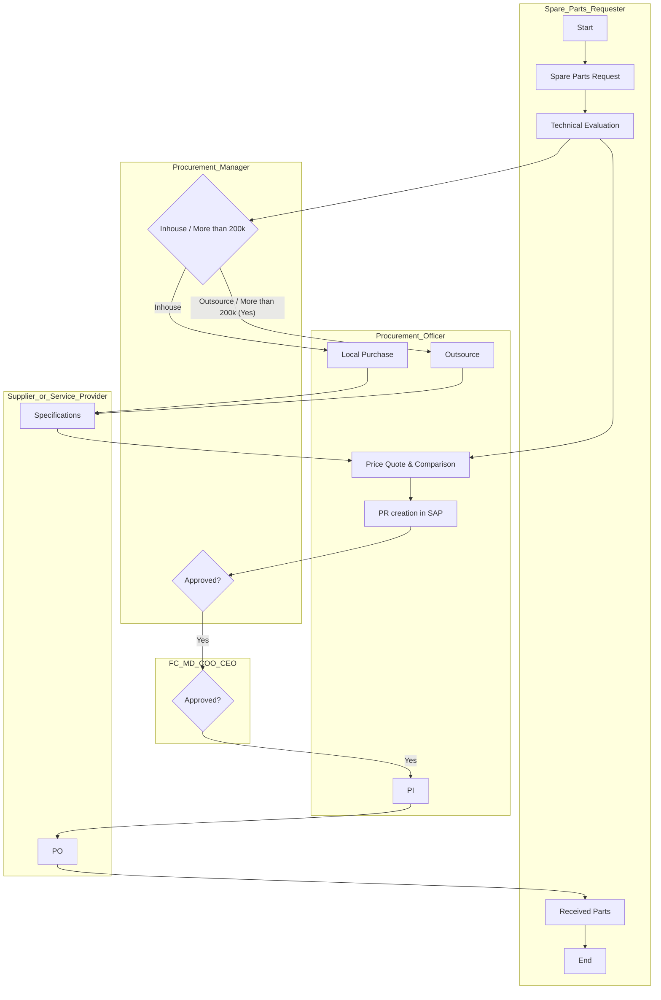

## Policies & Procedure for Purchasing of Vehicle Spare Parts

Policies
This section defines the procurement policies that apply specifically to the purchase of vehicle spare parts at Arabian Mills These items are essential to maintaining the company’s transportation fleet, and procurement must ensure authenticity, suitability, and compliance with warranty and sourcing guidelines.
Minimum Number of Suppliers
 A minimum of Three (3) suppliers must be considered for every vehicle spare part to ensure competitive sourcing and pricing.
 This requirement may be waived if the part is exclusive to a vehicle dealer who provides genuine OEM parts.
Request for Quotation
 In the absence of a vehicle dealership, all spare parts procurement must be initiated through an RFQ process.
 RFQs must be sent to a minimum of three (3) qualified spare parts suppliers from the pre-approved vendor list.
Approved Vendors List
 A formal approved vendor list must be maintained by the Procurement Department.
 The list must be developed using a defined selection and qualification procedure and must be referred to before issuing any RFQ.
Payment to Suppliers
 Payments to suppliers may be executed in cash or on credit, depending on the nature and urgency of the procurement.
 All payments must follow the terms and conditions stipulated in the procurement agreement.
Payment Currency
 The standard currency for supplier payments is Saudi Riyals (SAR).
 Foreign currencies such as USD or EUR may be used only if specified in international agreements.
Outsourcing
 In the case of outsourced repairs, the same procurement process must be followed as for spare parts — replacing the spare parts dealers with authorized service centers.
Spare Part Compliance
 All procured vehicle spare parts must comply with pre-defined technical specifications as communicated during the sourcing process.
Parts Provider Selection
 If a genuine spare part is available through the authorized vehicle agent, it should be purchased directly from them.
 If not available, the Procurement Officer must follow the standard process to procure from alternate qualified suppliers.
Vehicle Warranty
 In the case of vehicle malfunction, the vehicle warranty terms must be reviewed prior to any procurement.
 If the issue falls under warranty coverage, the vehicle dealer must be contacted for resolution.
Procedure
This procedure outlines the specific steps to be followed for sourcing, evaluating, and procuring spare parts required for the maintenance and repair of company vehicles. The process ensures technical and commercial due diligence, compliance with financial limits, and alignment with warranty terms.

| S. No | Responsibility | Procedure Description | Output / Report |
| --- | --- | --- | --- |
|  | Logistics Coordinator | In case of a vehicle malfunction, send a spare part request to the Supply Chain Director. The request must include a technical assessment or defect report. | **Spare Part Request and Technical** • Report |
|  | Supply Chain Director | **Review the technical report and decide whether the vehicle should be repaired** • in-house or outsourced to a service center . | **Technical** • Report |
|  | Procurement Officer | **If in-house repair is selected, conduct market research and gather price lists** • from local vendors for the required part. | Price List |
|  | Procurement Officer | **Report findings to the Supply Chain Director. If the part cost is less than** • SAR 2,000 , proceed with cash purchase. If above SAR 2,000 , obtain at least • two quotations and forward to the Supply Chain Director for review. | Supplier Quotations |
|  | Supply Chain Director | **If cost is above SAR 2,000 , reassess the in-house vs outsourcing decision based** • on price, urgency, and operational feasibility. | **Approval** • Email / Discussion Summary |
|  | Procurement Officer | **If proceeding in-house, send the part specifications to an authorized dealer or** • pre-approved suppliers and request official quotations. | Quotation Request |
|  | Procurement Officer | **After receiving quotations, forward them to the Logistics Coordinator for** • technical review and evaluation. | **Quotation** • Price |
|  | Procurement Officer | **Upon receiving the technical recommendation, prepare a comparison sheet in** • case of multiple suppliers and get it signed by the Supply Chain Director. | Comparison Sheet |
|  | Logistics Coordinator | Prepare a Purchase Requisition (PR) in the SAP system and send it to the Plant Manager and Supply Chain Director for approval. | SAP PR |
|  | Procurement Officer | **Upon PR approval, issue a Purchase Order (PO) in SAP and send it to the** • selected supplier. If payment is in cash , send the PO with all supporting • documents (PR, Comparison Sheet, Bid Evaluation) to the Finance Department. | PO |
|  | Procurement Officer | **If payment is on credit , submit the PO along with the Goods Received Note** • (GRN) and supporting documents to the Finance Department after receiving • the parts. | GRN |
|  | Procurement Officer | • If the repair is outsourced , follow the same process, but replace spare parts suppliers with authorized service centers as the source of quotations and • services. | **Outsourcing PO and** • Supporting • Docs |

Flowchart

**[Diagram — Visio-EMF→PNG]:**

**Process Name:** Purchase Of Vehicle Spare Parts  

**Roles / Swimlanes:**

1. Spare Parts Requester  
2. Procurement Officer  
3. Procurement Manager  
4. FC/MD/COO/CEO  
5. Supplier or Service Provider  

---

### Steps Table

| Step # | Role                           | Action / Decision                                                                 | Decision / Next Step                                                                                                                                                     |
|--------|---------------------------------|------------------------------------------------------------------------------------|--------------------------------------------------------------------------------------------------------------------------------------------------------------------------|
| 1      | Spare Parts Requester          | **Start**                                                                          | Flows to Step 2: Spare Parts Request.                                                                                                                                   |
| 2      | Spare Parts Requester          | **Spare Parts Request**                                                            | Flows to Step 3: Technical Evaluation.                                                                                                                                  |
| 3      | Spare Parts Requester          | **Technical Evaluation**                                                           | Main flow goes to Step 4: decision “Inhouse / More than 200k”. A separate visible connector also leads directly down to Step 8: Price Quote & Comparison.               |
| 4      | Procurement Manager            | **Decision – diamond labeled:** “Inhouse” / “More than 200k” (with “Outsource”).   | Branch “Inhouse” → Step 5: Local Purchase. Branch labeled “Outsource” / “More than 200k” (with green “Yes”) → Step 6: Outsource. No “No” branch is explicitly shown.    |
| 5      | Procurement Officer            | **Local Purchase**                                                                 | Flows down to Step 7: Specifications (Supplier or Service Provider).                                                                                                    |
| 6      | Procurement Officer            | **Outsource**                                                                      | Flows down to Step 7: Specifications (Supplier or Service Provider).                                                                                                    |
| 7      | Supplier or Service Provider   | **Specifications**                                                                 | Flows up to Step 8: Price Quote & Comparison.                                                                                                                           |
| 8      | Procurement Officer            | **Price Quote & Comparison**                                                       | Receives input from Technical Evaluation (Step 3) and from Specifications (Step 7). Flows to Step 9: PR creation in SAP.                                               |
| 9      | Procurement Officer            | **PR creation in SAP**                                                             | Flows up to Step 10: Approved? (Procurement Manager).                                                                                                                   |
| 10     | Procurement Manager            | **Decision – diamond labeled:** “Approved?”                                        | Branch labeled “Yes” (green) → Step 11: Approved? (FC/MD/COO/CEO). No “No” branch or alternate flow is shown in the diagram.                                           |
| 11     | FC/MD/COO/CEO                  | **Decision – diamond labeled:** “Approved?”                                        | Branch labeled “Yes” (green) → Step 12: PI (Procurement Officer). No “No” branch or alternate flow is shown in the diagram.                                            |
| 12     | Procurement Officer            | **PI**                                                                             | Flows down to Step 13: PO (Supplier or Service Provider).                                                                                                               |
| 13     | Supplier or Service Provider   | **PO**                                                                             | Flows up to Step 14: Received Parts (Spare Parts Requester).                                                                                                            |
| 14     | Spare Parts Requester          | **Received Parts**                                                                 | Flows to Step 15: End.                                                                                                                                                  |
| 15     | Spare Parts Requester          | **End**                                                                            | Process terminates.                                                                                                                                                     |

---

### Mermaid.js Flow

