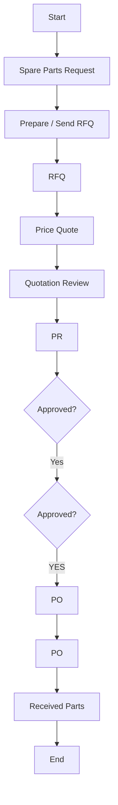

## Policies & Procedure for Purchasing Consumable Spare Parts

Policies
This section outlines the specific procurement policies for acquiring consumable spare parts used in machinery, tools, and operational maintenance at Arabian Mills These items are typically used regularly and require reliable sourcing and adherence to technical specifications.
Minimum Number of Suppliers
 All consumable spare parts must be sourced from a minimum of three (3) suppliers to ensure fair competition and optimal value.
 This requirement may be waived only if the part is exclusive to an authorized dealer or sole source provider.
Request for Quotation
 Every consumable spare part purchase must be initiated through an RFQ.
 The RFQ must be issued to a minimum of three (3) pre-qualified suppliers unless the part is only available through an authorized source.
Approved Vendors List
 All consumable parts must be procured from vendors listed on the approved vendor list, maintained by the Supply Chain Department.
 The list must be developed using defined selection and qualification criteria and updated periodically.
Payment to Suppliers
 Supplier payments may be made in cash or on credit, depending on transaction nature and urgency.
 All payments must comply with the contractual terms agreed between Arabian Mills and the supplier.
Payment Currency
 The standard payment currency is Saudi Riyals (SAR).
 For international purchases, USD or EUR may be used where specified in the agreement.
Spare Part / Consumables Compliance
 All consumables must comply with technical specifications shared with suppliers at the RFQ stage.
 Non-compliant materials must be rejected upon receipt in line with Arabian Mills’ quality protocols.
Parts Provider Selection
 If the item is available from an authorized agent or manufacturer, it must be procured directly from that source.
 If unavailable, follow the standard RFQ process to select from approved alternative suppliers.
Machine Warranty
 Before purchasing consumable parts for machines under warranty, the warranty terms must be reviewed to avoid voiding coverage.
 If the issue is warranty-covered, the authorized dealer or service provider must be contacted for resolution.
Spare Part Installation
 Where applicable, the installation of consumable parts may be performed by the supplier or their authorized technician to ensure proper usage and validation.
Spare Part Warranty
 Certain consumables may carry a limited operational warranty provided by the supplier.
 These terms must be reviewed during procurement and recorded for follow-up.
Procedure
This procedure provides the structured steps for acquiring consumable spare parts used in daily operations at Arabian Mills It ensures traceability, compliance with supplier agreements, and proper documentation throughout the procurement process.

| S. No | Responsibility | Procedure Description | Output / Report |
| --- | --- | --- | --- |
|  | Department Coordinator | Send a Spare Part Request to the Procurement Officer via email. Include part name , serial number , and other relevant specifications to ensure clarity and traceability. | Spare Part Request |
|  | Procurement Officer | Verify whether the item is exclusive to an authorized dealer . If so, send the RFQ directly to that dealer. Otherwise, issue the RFQ to a minimum of three (3) qualified suppliers. | RFQ |
|  | Procurement Officer | In either case, review any existing agreement with the supplier. For authorized dealers, apply pre-agreed pricing and discount terms (if applicable). | Email |
|  | Procurement Officer | Once supplier quotations are received, forward them to the Technical Manager for review and technical evaluation. | Quotations |
|  | Head of Maintenance | Review the submitted quotations. If clarifications are needed, contact the Procurement Officer to initiate supplier query. | Quotations |
|  | Procurement Officer | Contact suppliers to resolve any technical inquiries received from the Maintenance Department and forward responses accordingly. | Email |
|  | Head of Maintenance | If all quotations are clear and validated, classify the suppliers and issue a Purchase Requisition (PR) in the SAP system. | PR on SAP |
|  | Procurement Officer | If the item is new or not registered in SAP, initiate a New Item Registration Form and send it to the Finance Department. Add the item to the system after obtaining approval from the Supply Chain Director. | Item Registration Form |
|  | Procurement Officer | Upon PR approval, if there is only one qualified supplier, issue the PO directly . If multiple options exist, prepare a Bid Evaluation Form , create the PO in SAP, and route it for approval. | PO or Bid Evaluation + PO |
|  | Procurement Officer | Send a copy of the PO to both the Supplier and the Warehouse . For cash purchases or those requiring advance payment , print and submit all supporting documents (PR, Comparison Sheet, Bid Evaluation) to the Finance Department. | PO and Supporting Documents |
|  | Procurement Officer | For credit-based purchases , submit the PO along with all required supporting documents and the Goods Received Note (GRN) to the Finance Department after material receipt. | GRN |

Flowchart

**[Diagram — Visio-EMF→PNG]:**

**Process Name**

Purchasing Consumable Spare Parts

---

**Roles / Swimlanes**

- Technical Manager  
- Procurement Officer  
- Procurement Manager / SCM Director  
- FC/MD/OPS/CEO  
- Supplier Or Service Dealer  

---

**Process Steps**

| Step # | Role                                | Action                | Decision/Next Step                                                                 |
|--------|-------------------------------------|-----------------------|------------------------------------------------------------------------------------|
| 1      | Technical Manager                   | Start                 | Flows to “Spare Parts Request”.                                                   |
| 2      | Procurement Officer                 | Spare Parts Request   | Flows to “Prepare / Send RFQ”.                                                    |
| 3      | Procurement Officer                 | Prepare / Send RFQ    | Flows down to “RFQ”.                                                              |
| 4      | Supplier Or Service Dealer          | RFQ                   | Flows up to “Price Quote”.                                                        |
| 5      | Procurement Officer                 | Price Quote           | Flows up to “Quotation Review”.                                                   |
| 6      | Technical Manager                   | Quotation Review      | Flows down to “PR”.                                                               |
| 7      | Procurement Officer                 | PR                    | Flows to decision “Approved?” (Procurement Manager / SCM Director).              |
| 8      | Procurement Manager / SCM Director  | Approved?             | Yes → flows down to next decision “Approved?” (FC/MD/OPS/CEO). No branch not shown in the diagram. |
| 9      | FC/MD/OPS/CEO                       | Approved?             | YES (label shown) → flows to “PO” (Procurement Officer). No branch otherwise shown in the diagram. |
| 10     | Procurement Officer                 | PO                    | Flows down to “PO” (Supplier Or Service Dealer).                                  |
| 11     | Supplier Or Service Dealer          | PO                    | Flows up to “Received Parts”.                                                     |
| 12     | Technical Manager                   | Received Parts        | Flows to “End”.                                                                   |
| 13     | Technical Manager                   | End                   | Process terminates.                                                               |

---

