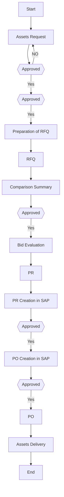

## Policies & Procedure for Purchasing Assets & Capital Equipment

Policies
The following policies apply to the procurement of assets and capital equipment at Arabian Mills, ensuring strategic acquisition, proper authorization, and compliance with technical and financial controls.
Asset and Capital Equipment Requisition
 Procurement of assets or capital equipment—whether planned or unplanned—will be initiated based on a formal request by the process owner. This request must be duly approved by the CFO and CEO before proceeding.
Minimum Number of Suppliers
 At least three (3) suppliers must be considered for every asset or capital equipment procurement to ensure competitiveness and value.
Request for Quotation
 The procurement must be executed through a formal Request for Quotation (RFQ) process sent to a pre-qualified list of suppliers. A minimum of two (2) RFQs must be issued.
Approved Vendors List
 The Procurement Department shall maintain an updated approved vendors list. This list must be developed based on defined supplier qualification and selection criteria and must be referenced during RFQ issuance.
Payment to Suppliers
 Payments to suppliers may be made in cash or on credit, depending on the case. The Supply Chain Department is responsible for selecting the most appropriate payment terms, which must comply with agreed contract terms.
Payment Currency
 Standard payment currency is Saudi Riyals (SR). For international transactions, payment may be made in USD or EUR as specified in the purchase agreement.
Item Compliance
 All procured assets, and equipment must strictly conform to the predefined technical specifications submitted by the requester or process owner.
IT Devices Selection Criteria
 For IT devices, purchases should generally be made from a pre-approved brand. If no such brand is applicable, RFQs must be sent to at least two (2) suppliers. Updated replacement parts and equivalent performance standards must be considered due to ongoing technological advancements.
Petty Cash Usage
 Under urgent or exceptional conditions, assets or capital equipment may be procured directly through petty cash with proper justification and documentation.
Installation Responsibility
 The supplier shall be fully responsible for installation and assembly of all machines, equipment, IT devices, furniture, and applicable vehicles. This must be clearly stated in both the RFQ and PO.
Operational Responsibility
 Suppliers must operate the installed machinery and equipment under their direct supervision during commissioning. Arabian Mills employees must be trained in operation, maintenance, and troubleshooting by the supplier’s technical team.
Purchasing Feasibility
 The feasibility of acquiring new machinery or equipment must be carefully evaluated by comparing operational and maintenance costs against productivity benefits.
Local Suppliers
 Preference shall be given to local suppliers, particularly for IT devices and furniture, to ensure the availability of warranty services and immediate access to replacement parts.
Procedure
This procedure outlines the steps for purchasing capital assets including machines, equipment, vehicles, IT devices, and office furniture. It ensures all asset procurements are based on approved requirements, technical specifications, and processed through qualified suppliers with proper documentation and approvals.
Machines and Equipment

| S. No. | Responsibility | Procedure Description | Output / Report |
| --- | --- | --- | --- |
|  | Process Owner | Plan asset/equipment requirement, obtain HOD and top management approval, and send request via email to Procurement Officer after CEO approval. | Machine and Equipment Request |
|  | Procurement Officer | Forward the request to the Procurement Manager for review and action. | Request Forwarded |
|  | Procurement Manager | Review and verify the request and authorize further procurement action. | Reviewed Request |
|  | Procurement Officer | Send RFQ via email to at least three ( 3 ) approved suppliers, attaching specifications and delivery terms. | Request for Quotation (RFQ) |
|  | Suppliers | Submit quotations including item specifications, prices, delivery schedules, and commercial terms. | Price Quotations |
|  | Procurement Officer | Compile quotations and commercial terms into a comparison sheet; share it with the Process Owner for evaluation. | Quotations Comparison Sheet |
|  | Procurement Officer | Negotiate terms and pricing with suppliers. If pricing gaps remain, escalate to Supply Chain Director and HOD for resolution. | Negotiation Summary |
|  | Procurement Officer | Prepare Bid Evaluation Form and obtain signatures from Procurement Manager, Supply Chain Director, and HOD. | Bid Evaluation Form |
|  | Process Owner | Create a Purchase Requisition (PR) in SAP, detailing specifications, delivery terms, and requirements. | PR on SAP |
|  | Procurement Officer | Receive PR, enter pricing and supplier details, and finalize data in SAP. | Finalized PR |
|  | Procurement Officer | Submit the PR for approval to the Plant Manager and HOD. | Approved PR |
|  | Procurement Officer | After full approval cycle, convert the PR into a Purchase Order (PO) and route for approvals (Procurement Manager, Supply Chain Director, Finance Controller, HOD, CFO, CEO). | PO Generated and Routed for Approval |
|  | Procurement Officer | Print and compile PO with all related documents (Comparison Sheet, Evaluation Form, PR); submit to Supply Chain Director for review and signature. | PO Package |
|  | Procurement Manager | Sign the PO and return it to Procurement Officer for communication to the supplier. | Signed PO |
|  | Procurement Officer | If advance payment is required, submit full document copies to Finance Department. | Payment Documents |
|  | Procurement Officer | If full credit applies, submit original invoice and documents to Finance after delivery. | Invoice |
|  | Procurement Officer | Follow up with supplier for timely delivery, coordinate documentation for customs clearance, and liaise with clearing agent if required. | Follow-Up and Clearance Coordination |

Vehicles

| S. No. | Responsibility | Procedure Description | Output / Report |
| --- | --- | --- | --- |
|  | Process Owner | Send vehicle request to Procurement Officer and HOD after receiving CEO approval. | Vehicle Request |
|  | Procurement Officer | Forward the vehicle request to Procurement Manager for processing. | Forwarded Request |
|  | Procurement Manager | Review and authorize the vehicle request for procurement. | Reviewed Request |
|  | Procurement Officer | Email RFQ to at least three ( 3 ) pre-qualified suppliers with detailed vehicle specs and delivery terms. | RFQ |
|  | Suppliers | Submit quotations including specifications, prices, and delivery terms. | Price Quotations |
|  | Procurement Officer | Prepare a quotation comparison sheet and share it with the vehicle requester for review. | Quotations Comparison Sheet |
|  | Procurement Officer | Negotiate commercial terms. If price variations exist, escalate to Supply Chain Director and HOD with justification from the requester. | Negotiation Summary |
|  | Procurement Officer | Prepare Bid Evaluation Form; obtain signatures from Supply Chain Director and Process Owner. | Bid Evaluation Form |
|  | Process Owner | Create PR in SAP listing vehicle details and requirements. | PR in SAP |
|  | Procurement Officer | Input pricing, terms, and supplier info into SAP and finalize PR. | Finalized PR |
|  | Procurement Officer | Submit PR for SAP approval (Plant Manager and HOD) and generate PO post-approval. | PO Generated |
|  | Procurement Officer | Compile PO package and submit for review and signature by Procurement Manager. | PO and Documents |
|  | Supply Chain Director | Sign PO and return it to Procurement Officer to share with vehicle supplier. | Signed PO |
|  | Procurement Officer | If advance payment is required, send document copies to Finance. | Advance Payment Package |
|  | Procurement Officer | If payment is on credit, send invoice and supporting documents to Finance after delivery. | Invoice |
|  | Procurement Officer | Follow up with supplier for timely delivery, obtain customs documentation, and coordinate with clearing agent as necessary. | Delivery Follow-Up |
|  | Procurement Officer | Archive PO and related documents after delivery confirmation. | Archived Documentation |

Furniture & IT Eq.

| S. No. | Responsibility | Procedure Description | Output / Report |
| --- | --- | --- | --- |
|  | Department Coordinator | Send a request for IT devices or furniture via email to the Procurement Officer and Procurement Manager. This includes needs for new items or replacement of existing ones. CEO approval must be obtained prior to initiating IT device purchases. | IT Device / Furniture Request |
|  | Procurement Officer | Forward the IT device or furniture request to the Procurement Manager for evaluation and further action. | Request Forwarded |
|  | Procurement Manager | Review the request and approve it for procurement action. | Reviewed Request |
|  | Procurement Officer | For IT devices, if a predefined brand is applicable, proceed with procurement from the approved brand. For other items or furniture, issue RFQ to at least two (2) qualified suppliers with item specs and delivery terms. | RFQ Sent |
|  | Suppliers | Submit price quotations including item specifications, delivery timeline, cost, and terms. | Price Quotations |
|  | Procurement Officer | Compile all received quotations into a comparison sheet and share with the item requester for review and recommendation. | Quotations Comparison Sheet |
|  | Procurement Officer | Negotiate prices and commercial terms with suppliers. In case of pricing gaps, escalate to Supply Chain Director and HOD with justification from requester. | Negotiation Summary |
|  | Procurement Officer | Prepare the Bid Evaluation Form and obtain required approvals from Procurement Manager, Supply Chain Director, and IT Manager. | Bid Evaluation Form |
|  | Item Requester | Create the Purchase Requisition (PR) in SAP, including item specifications, terms, and delivery details. | PR on SAP |
|  | Procurement Officer | Review the PR, add pricing, payment terms, and supplier information. | Finalized PR |
|  | Procurement Officer | Send the PR to the relevant Head of Department (HOD) for approval. | Approved PR |
|  | Procurement Officer | After receiving PR approval, convert the PR into a Purchase Order (PO) in SAP. | PO Generated |
|  | Procurement Officer | Print the PO and submit it with supporting documents (Comparison Sheet, Evaluation Form, PR) to Supply Chain Director for review and signature. | PO and Supporting Documents |
|  | Supply Chain Director | Review and sign the PO and return it to Procurement Officer for supplier communication. | Signed PO |
|  | Procurement Officer | If advance payment is required, prepare and send document copies to the Finance Department before initiating delivery. | Advance Payment Documents |
|  | Procurement Officer | If payment is on credit, submit the original invoice and related documents to Finance Department after delivery is completed. | Invoice |
|  | Procurement Officer | If items are to be stored, send a copy of the PO to the Warehouse Unit for receipt and verification. | PO Copy to Warehouse |
|  | Procurement Officer | Follow up with the supplier for timely delivery and coordinate documentation required for customs clearance, if applicable. | Follow-up Record |
|  | Procurement Officer | Archive the PO and all related documents after acknowledgment from the Warehouse. | Archived PO and Documentation |

Flowchart

**[Diagram — Visio-EMF→PNG]:**

**Process Name:** Assets & CAPEX (Procurement)

---

### Roles / Swimlanes

- Service Provider  
- Requester  
- LOB / Budget Proponent / *[final word illegible]*  
- Procurement Manager & Checker  
- FC / HOD  
- CEO / CFO  

---

### Steps and Flow

| Step # | Role | Action / Decision | Decision / Next Step |
|--------|------|-------------------|----------------------|
| 1 | Requester | **Start** | Flows to Step 2 (Assets Request). |
| 2 | LOB / Budget Proponent / *[illegible]* | **Assets Request** | Flows down to Step 3 (Approved – Procurement Manager & Checker). |
| 3 | Procurement Manager & Checker | **Approved** (decision under “Assets Request”) | **Yes:** Flows to Step 4 (Approved – FC / HOD). **No:** (arrow labeled **NO** in red) loops back left/up to Step 2 (Assets Request). |
| 4 | FC / HOD | **Approved** (decision, left side) | **Yes:** Flows up to Step 5 (Preparation of RFQ). *(No “No” path shown in diagram.)* |
| 5 | LOB / Budget Proponent / *[illegible]* | **Preparation of RFQ** | Flows up to Step 6 (RFQ). |
| 6 | Service Provider | **RFQ** | Flows down to Step 7 (Comparison Summary). |
| 7 | LOB / Budget Proponent / *[illegible]* | **Comparison Summary** | Flows down to Step 8 (Approved – Procurement Manager & Checker). |
| 8 | Procurement Manager & Checker | **Approved** (decision under “Comparison Summary”) | **Yes:** Flows up to Step 9 (Bid Evaluation). *(No “No” path shown in diagram.)* |
| 9 | LOB / Budget Proponent / *[illegible]* | **Bid Evaluation** | Flows up to Step 10 (PR). |
| 10 | Requester | **PR** | Flows down to Step 11 (PR Creation in SAP). |
| 11 | LOB / Budget Proponent / *[illegible]* | **PR Creation in SAP** | Flows down to Step 12 (Approved – FC / HOD, mid/right). |
| 12 | FC / HOD | **Approved** (decision under “PR Creation in SAP”) | **Yes:** Flows up to Step 13 (PO Creation in SAP). *(No “No” path shown in diagram.)* |
| 13 | LOB / Budget Proponent / *[illegible]* | **PO Creation in SAP** | Flows down to Step 14 (Approved – CEO / CFO). |
| 14 | CEO / CFO | **Approved** (decision under “PO Creation in SAP”) | **Yes:** Flows up to Step 15 (PO). *(No “No” path shown in diagram.)* |
| 15 | Requester | **PO** | Flows right to Step 16 (Assets Delivery). |
| 16 | Service Provider | **Assets Delivery** | Flows right to Step 17 (End). |
| 17 | Service Provider (lane alignment by position) | **End** | Process terminates. |

---

### Mermaid.js Flow (graph TD)

