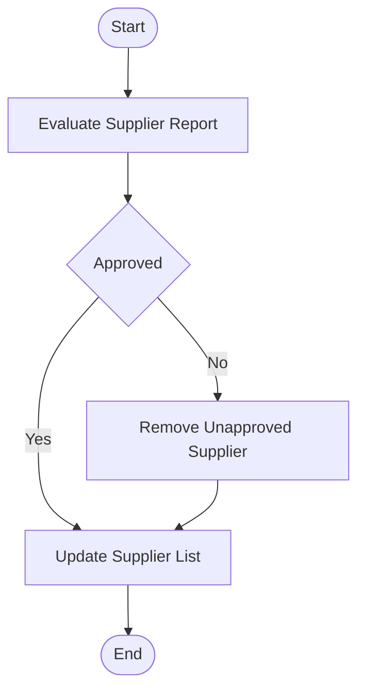

## Policies & Procedure for Supplier Assessment

Policies
The following policies govern the assessment of suppliers at Arabian Mills, ensuring consistent performance evaluation and enabling continuous improvement in supplier relationships.
Supplier Assessment Frequency
 Supplier assessment must be conducted for every procurement or service engagement. This evaluation must occur both during and after the execution of a contract to ensure compliance with performance expectations.
Supplier Assessment Ethical Practices
 The assessment process must adhere to core ethical principles including transparency, fairness, and confidentiality throughout the evaluation cycle.
Assessment Factors
Suppliers and service providers shall be assessed based on multiple performance factors including:
   Quality of goods and services delivered
   Internal management systems and organizational style
   Financial strength and performance
   Cost-effectiveness and value delivery
   On-time delivery and adherence to timelines
   Technical capabilities and innovation
Suppliers Assessment Results
Based on the assessment results, suppliers may be removed from the Approved Vendors List if their performance is unsatisfactory.
   Suppliers receiving poor marks may be delisted.
   Rejected suppliers must be notified in writing with reasons for delisting to allow corrective action for future qualification opportunities.
Procedure
This procedure defines the process for evaluating supplier performance during and after contract execution. It ensures that suppliers are assessed based on quality, delivery, cost, and compliance, supporting continuous improvement and informed vendor management decisions.

| S. No. | Responsibility | Procedure Description | Output / Report |
| --- | --- | --- | --- |
|  | Procurement Officer | Evaluate supplier performance after each delivery of goods or services. For ongoing contracts, assessments must also be conducted during the contract period. Assign evaluation marks independently along with the item requester. | Supplier Evaluation Form |
|  | Calculate the final evaluation score as the average of marks given by both the Procurement Officer and the item requester. | Consolidated Evaluation Score |  |
|  | Use a 100-mark scale divided as follows: • Quality (PPM Defect Performance): 25 marks • Management Capability: 10 marks • Financial Conditions: 10 marks • Cost Structure: 20 marks • Delivery Performance: 20 marks • Technical Capabilities: 15 marks | Weighted Evaluation Criteria |  |
|  | Apply the following performance scale: (0–19): Poor (20–39): Weak (40–59): Marginal (60–79): Qualified (80–100): Outstanding | Evaluation Rating Scale |  |
|  | Procurement Officer and Requester | Submit completed evaluation forms and results to the Procurement Manager for review and final approval. | Submitted Evaluation Form |
|  | Procurement Manager | Review the assessment results, validate scoring, and approve the final evaluation. | Approved Evaluation Form |
|  | Procurement Officer | If any of the following conditions apply, remove the supplier from the Approved Vendors List: • More than two Marginal or lower evaluations • Business closure, death of sole proprietor, or company liquidation • Repeated non-delivery or ongoing non-compliance • Fraud, legal violations, or mutual termination requests | Amended Approved Suppliers List |

Flowchart

**[Diagram — Visio-EMF→PNG]:**

**Process Name:** Supplier Assessment  

**Department Label (top-right):** Procurement  

**Roles / Swimlanes:**
- Procurement Officer
- Procurement Manager

---

### Steps

| Step # | Role                | Action                         | Decision/Next Step                                                                 |
|--------|---------------------|--------------------------------|------------------------------------------------------------------------------------|
| 1      | Procurement Officer | Start                          | Proceed to Step 2 – Evaluate Supplier Report                                      |
| 2      | Procurement Officer | Evaluate Supplier Report       | Proceed to Step 3 – Decision “Approved”                                           |
| 3      | Procurement Manager | Approved (decision point)      | If **Yes (Approved)** → Step 4A – Update Supplier List; If **No (Not Approved)** → Step 4B – Remove Unapproved Supplier |
| 4A     | Procurement Officer | Update Supplier List           | (Branch where supplier is **Approved**) Proceed to Step 5 – End                   |
| 4B     | Procurement Officer | Remove Unapproved Supplier     | (Branch where supplier is **Not Approved**) Proceed to Step 5B – Update Supplier List |
| 5B     | Procurement Officer | Update Supplier List           | (After removal of unapproved supplier) Proceed to Step 6 – End                    |
| 5      | Procurement Officer | End                            | Process completed                                                                 |
| 6      | Procurement Officer | End                            | Process completed                                                                 |

*(Note: In the diagram, both branches converge before the End event; “End” appears once at the far right.)*

---

### Mermaid.js Flow

