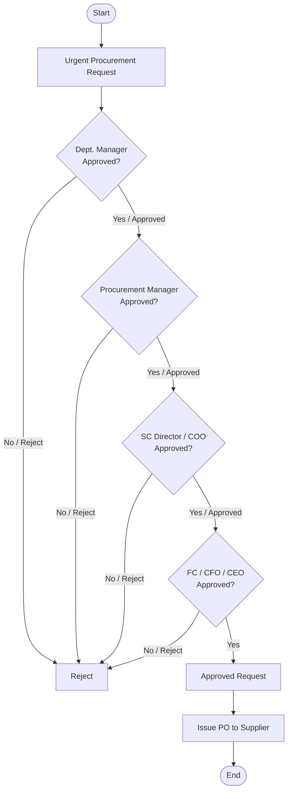

## Policies & Procedure for Urgent Procurement

Policies
The following policies guide the urgent procurement process at Arabian Mills These policies ensure appropriate justification, control, and documentation when standard procurement timelines cannot be followed due to critical operational needs.
Urgent Procurement Need
 Urgent procurement is permitted when early delivery is of critical importance, and standard procurement procedures are impractical or impossible to follow due to the urgency of the situation.
Urgent Buying Limit
 The maximum allowable limit for any urgent procurement is SAR 100,000 per case. All such cases must be formally approved by the CEO before execution.
Urgent Buying Cases
 Urgent procurement may be applied in specific critical cases, including:
   Procurement of essential production materials
   Emergency acquisition of manufacturing assets
   Immediate purchase of spare parts for breakdown maintenance
Number of Suppliers
 For urgent procurement, it is permissible to proceed with only one (1) supplier to expedite the process.
Urgent Procurement Time
 The full urgent procurement cycle—from request to delivery—must be executed as quickly as possible due to the immediate nature of the need.
Procedure

| S. No. | Responsibility | Procedure Description | Output / Report |
| --- | --- | --- | --- |
|  | Urgent Procurement Requester | • Submit a formal urgent procurement request to the Department Manager. The request must include: • • Nature of urgency • Date and time of request • Description of required action • Expected outcome if standard process is followed • Three quotations (if feasible) from prospective suppliers | Urgent Procurement Request |
|  | Requester's Department Manager | Review and validate the urgency and completeness of the request. Once verified, forward the request to the Procurement Manager for further processing. | Approved Request from Department Head |
|  | Procurement Manager | Review the request and submit the file to the CEO for final approval. Ensure documentation meets all urgent procurement policy requirements, including financial limits and justification. | Request Forwarded to CEO |
|  | CEO | Approve or reject the urgent procurement request based on the justification and financial threshold (not exceeding SAR 100,000). | CEO Approval |
|  | Procurement Officer | Upon CEO approval, proceed to issue the Purchase Order to the selected supplier and coordinate with the concerned department for immediate delivery and follow-up. | Purchase Order (PO) |
|  | Procurement Officer | Ensure the PO and all related documentation (request form, justification, quotations, approvals) are archived for audit and compliance reference. | Archived Documentation |

Flowchart

**[Diagram — Visio-EMF→PNG]:**

**Process Name:** Urgent Procurement  
(Top-right header text: **Procuremment**)

**Roles / Swimlanes (from top to bottom):**
- Initiator
- Dept. Manager
- Procurement Manager
- SC Director / COO
- FC / CFO / CEO

### Steps

| Step # | Role                   | Action (Shape Text)        | Decision / Next Step |
|--------|------------------------|----------------------------|----------------------|
| 1      | Initiator             | **Start**                  | Proceeds to Step 2. |
| 2      | Initiator             | **Urgent Procurement Request** | Proceeds to Step 3. |
| 3      | Dept. Manager         | **Approved** (decision)    | Yes/Approved → Step 4. No/Reject → Reject (process stops – not further detailed in diagram). |
| 4      | Procurement Manager   | **Approved** (decision)    | Yes/Approved → Step 5. No/Reject → **Reject** (explicit red label; process stops). |
| 5      | SC Director / COO     | **Approved** (decision)    | Yes/Approved → Step 6. No/Reject → Reject (process stops – not further detailed in diagram). |
| 6      | FC / CFO / CEO        | **Approved** (decision)    | Yes (green “Yes”) → Step 7. No/Reject → Reject (process stops – not further detailed in diagram). |
| 7      | Procurement Manager   | **Approved Request**       | Proceeds to Step 8. |
| 8      | Procurement Manager   | **Issue PO to Supplier**   | Proceeds to Step 9. |
| 9      | Procurement Manager   | **End**                    | Process terminates. |

(Only one explicit “Reject” label is shown in red beside the Procurement Manager approval; other reject/No outcomes are implied by the decision diamonds but not drawn in detail.)

### Mermaid.js flow

