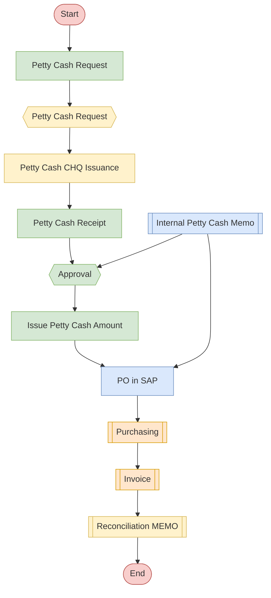

## Policies & Procedure for Petty Cash Buying

Policies
The following policies apply to the use of petty cash for procurement at Arabian Mills These guidelines ensure that low-value purchases are handled efficiently while maintaining accountability and departmental oversight.
 Petty cash amounts are transferred to a dedicated central bank account, distinct from other operational accounts, and accessible only by designated custodians at each location.
 The Treasury Team oversees these funds, with designated custodians at each site ensuring all expenses are properly documented and regularly reviewed.
 Every payment must be supported by a receipt and must not exceed the transaction limit of SAR 1,000, unless approved by the CFO and CEO.
 Petty cash limits must be reviewed annually.
 Petty cash is the joint responsibility of Finance and Procurement.
 The centralized bank account must maintain a minimum balance of SAR 25,000 and a maximum balance of SAR 100,000, with limits reviewed annually.
 The petty cash required value is determined by monthly departmental needs and must not exceed SAR 25,000 per department.
 Petty cash covers minor, incidental costs necessary for day-to-day operations that are impractical to process through the PO system, including:
   Office Supplies: Stationery (pens, paper, envelopes); Small office equipment (staplers, calculators).
   Employee Reimbursements: Travel expenses (local transportation, parking fees); Meals and refreshments for meetings.
   Minor Repairs and Maintenance: Small-scale repairs (light bulbs, plumbing fixes); Maintenance supplies (cleaning materials).
   Miscellaneous Expenses: Postage and courier services; Minor hospitality expenses (tea, coffee, snacks for guests).
   Event and Meeting Costs: Decorations and supplies for small events; Refreshments for meetings and workshops.
   Emergency Purchases: Immediate, unforeseen expenses that require prompt payment.
Procedure
This procedure details the process for making low-value purchases through petty cash at Arabian Mills It ensures controlled disbursement, proper documentation, and timely reconciliation to support routine departmental needs without engaging the full procurement cycle.

| S. No. | Responsibility | Procedure Description | Output / Report |
| --- | --- | --- | --- |
|  | Buying Requester | • For item-specific petty cash purchases, fill out an internal memorandum stating the required item , suppliers bank account and amount of the transaction . • Send the memorandum to the Department Manager for further action. • Confirms the date of transaction when service is availed. | Internal Memorandum |
|  | Procurement Manager | • Review and approve the petty cash request. • Submit a petty cash request via internal memorandum to the Finance team (designated custodian) . • Execute the purchase using the approved suppliers list • C onfirms the date of transaction when service is availed. | Internal Memorandum |
|  | Finance Team | • After review, add suppliers bank account as a beneficiary. • Transfer amount to supplier’s bank account on the date of transactions. • Records the entry as per accounting manual. | Petty Cash Cheque |
|  | Buyer / Procurement Manager | Obtain individual invoices for each transaction within 2 working days . Sign each invoice and submit to the Department Manager for countersignature. | Invoices |
|  | Finance Team | Review all submitted petty cash invoices and records entry as per accounting manual | Approved Invoices |
|  | Procurement Manager | Reconcile the petty cash with Finance Department using signed invoices on monthly basis. | Invoices / Internal Memorandum |

Flowchart

**[Diagram — Visio-EMF→PNG]:**

**Process Name:** Petty Cash Procurement  

**Additional Header Text (top right):** Procurement  

**Roles / Swimlanes:**
- Local Buyer
- Procurement Manager
- CFO / Finance
- Supplier  

---

### Steps

| Step # | Role               | Action / Step Name          | Decision / Next Step                                                                                                                                                  |
|--------|--------------------|-----------------------------|------------------------------------------------------------------------------------------------------------------------------------------------------------------------|
| 1      | Procurement Manager | Start                       | Proceed to **Petty Cash Request** (Procurement Manager).                                                                                                              |
| 2      | Procurement Manager | Petty Cash Request          | Request is sent to **Petty Cash Request** (CFO / Finance).                                                                                                            |
| 3      | CFO / Finance      | Petty Cash Request          | Proceed to **Petty Cash CHQ Issuance**.                                                                                                                               |
| 4      | CFO / Finance      | Petty Cash CHQ Issuance     | Proceed to **Petty Cash Receipt** (Procurement Manager).                                                                                                             |
| 5      | Procurement Manager | Petty Cash Receipt          | Proceed to **Approval** (Procurement Manager).                                                                                                                        |
| 6      | Local Buyer        | Internal Petty Cash Memo    | Flows into **Approval** (Procurement Manager) and also to **PO in SAP** (Local Buyer).                                                                               |
| 7      | Procurement Manager | Approval                    | Decision point (shown as diamond) but no Yes/No branches are labeled; single outgoing flow proceeds to **Issue Petty Cash Amount**.                                  |
| 8      | Procurement Manager | Issue Petty Cash Amount     | Proceeds to **PO in SAP** (Local Buyer).                                                                                                                              |
| 9      | Local Buyer        | PO in SAP                   | Proceeds to **Purchasing** (Supplier).                                                                                                                                |
| 10     | Supplier           | Purchasing                  | Proceeds to **Invoice** (Supplier).                                                                                                                                   |
| 11     | Supplier           | Invoice                     | Proceeds to **Reconciliation MEMO** (CFO / Finance).                                                                                                                  |
| 12     | CFO / Finance      | Reconciliation MEMO         | Proceeds to **End**.                                                                                                                                                  |
| 13     | CFO / Finance      | End                         | Process terminates.                                                                                                                                                   |

*No explicit Yes/No branches are labeled in the diagram; the only decision shape (“Approval”) has a single outgoing path.*

---

### Mermaid.js Flow

