## Bidding & Tendering Policy and Procedure

Scope
To set when and how Arabian Mills bidding process for high-value or critical procurement. Applies to new needs and to changes to ongoing purchase orders if the value passes the limit or risk becomes critical. All goods, services, rentals, and projects purchased by Arabian Mill’s, except for emergency cases or approved single-source cases described below.
Policies
When bidding is required
 Any procurement with estimated total value equal to or above SAR 1,000,000.
 Any “critical” procurement (business-critical, safety-critical, quality-critical, regulatory-critical), even if value is below SAR 1,000,000.
 Any variation or change order on an existing PO that pushes the total award to or above SAR 1,000,000 or materially changes scope, specs, risk, or supplier concentration.
Minimum competition
 Get at least three qualified bids where the market allows.
 If the market is limited (e.g., OEM only), record the reason and follow the single-source rules below.
Compliance of Ongoing and New Procurement Activities
 All ongoing or new procurement actions that meet the bidding criteria defined in this policy shall be immediately aligned with the approved bidding procedure.
 Any requisition, purchase, or commitment initiated without competition or required documentation must be stopped immediately until a proper bidding process is completed in accordance with this manual.
 Procurement staff and end users are responsible for ensuring that no purchase order, supplier commitment, or payment request is processed outside the approved bidding procedure and Delegation of Authority (DoA).
 The Supply Chain Director may suspend or cancel any non-compliant procurement and initiate corrective action to bring it under bidding control.
Single-source and emergency exceptions
 Single source: allowed only with written justification approved by the Supply Chain Director before commitment.
 Emergency: only for urgent health, safety, or plant protection needs. Head of User department and Supply Chain Director must confirm in writing. Convert to a normal process as soon as practical.
Bidding Committees
To strengthen transparency and evaluation quality, a formal committee shall be constituted for all high-value or critical bids:
 Bidding Evaluation Committee:  responsible for evaluating compliance to specifications, scope of work, quality, and technical capability; in addition to evaluating price, payment terms, delivery, warranty, and total cost of ownership.
Committee Composition and Responsibilities
Composition
 Subject Matter Expert(s) from the respective department.
 One representative from Procurement
 One representative from Quality or Engineering (as applicable)
 One representative from Finance
 Procurement Lead/Director Supply Chain
Key Responsibilities:
 Review technical submissions strictly against the pre-declared criteria and weightages.
 Ensure all mandatory requirements, certifications, and specifications are met.
 Document findings and assign scores using the approved Technical Evaluation Sheet.
 Submit a signed Technical Evaluation Report (TER) to Procurement within the defined timeline.
 Maintain confidentiality of all technical data during and after evaluation.
 Open and review only the commercial bids of qualified suppliers.
 Verify compliance with payment terms, delivery, warranty, and total cost of ownership.
 Ensure all clarifications are handled through Procurement and recorded in the Clarification Log within the team.
 Prepare the Commercial Evaluation Report (CER) with complete financial comparison and justification.
Independence and Governance
 The Bid Evaluation Committee shall sign its respective report to confirm due diligence and fairness.
 Any conflict of interest must be declared in writing before evaluation begins.
 The Supply Chain Director retains authority to review or reconstitute committee as required.
Governance Structure and Role Responsibilities
 Requester or End User: Responsible for initiating requisition, defining technical requirements, and confirming post-delivery acceptance.
 Procurement (Category Lead/Buyer): Manages the end-to-end bidding process, documentation, and award recommendation.
 Bid Evaluation Committee: Conduct evaluations as per defined criteria and submit formal reports to Procurement and ensure independence.
 Finance: Ensures financial compliance, budget validation, and payment term feasibility.
 Supply Chain Director: Reviews and approves the final recommendation in accordance with the DoA, ensuring procedural fairness and compliance.
Integrity and fairness
 No conflict of interest. All evaluators must sign a conflict-of-interest and confidentiality note.
 No sharing of one supplier’s commercial offer with another.
 Questions from suppliers go through Procurement only.
 All bidder clarifications, meetings, or presentations must be arranged and minutes by Procurement to maintain equal opportunity and audit transparency.
Bid Documentation Framework
The standard bid documentation framework shall include the following components:
 Instructions to Bidders
 Scope of Work / Technical Specifications / Drawings
 Commercial Terms (delivery, payment, taxes, warranties, LDs, performance securities, etc.)
 Evaluation Criteria and Assigned Weightage
 Submission Forms (Technical Bid, Commercial Bid, Deviation List, Compliance Checklist)
Timing guidance
 Normal bids: minimum 10 working days to submit.
 Complex/Capex bids: minimum 20 working days.
 Pre-bid meeting or site visit when helpful.
Bid Evaluation and award approval process
 All high-value or critical procurements shall follow the two-envelope method, where Technical Bids are evaluated first and Commercial Bids open only after technical qualification.
 All evaluations shall use scored evaluation sheets with pre-declared criteria aligned with templates or with committee members.
 Any clarifications from bidders must be requested and responded to in writing only, through Procurement.
 Final evaluation shall consider the total cost of ownership and risk profile, rather than lowest price alone.
 The Bid Evaluation Committee shall conduct the technical review and issue a signed Technical Evaluation Report.
 The Bid Evaluation Committee shall review the commercial offers of technically qualified suppliers and prepare a Commercial Evaluation Report.
 Procurement shall consolidate both committee reports and submit the Award Recommendation to the Supply Chain Director for approval as per DoA.
 Upon approval, a Letter of Award (LoA) shall be issued, followed by formal contract or Purchase Order (PO).
Performance Security (where applicable)
 For contracts exceeding defined thresholds or involving advance payments, the supplier may be required to submit a bank guarantee or performance security as specified in the RFP. Procurement and Finance shall ensure compliance prior to contract signing.
Records and audit
 Keep the full file: requisition, approvals, RFP, bidder list, minutes, questions log, bids, evaluation sheets, recommendation, approvals, LoA, contract, acceptance and any change orders.
 Procurement shall maintain a live Tender Status Register in ERP identifying each bid’s stage (issued, evaluated, awarded, closed). A monthly summary shall be reviewed by the Supply Chain Director to monitor cycle times and compliance.
Data privacy, HSE, compliance
 Suppliers must meet applicable laws and HSE rules.
 Sensitive data handled per company policy.
Link to Delegation of Authority
 The above-mentioned policy goes concurrently with the approved DoA. In case of extra approvals, both are to be followed.
Procedure Table for Bidding

| S. No. | Job Title / Responsible | Step / Activity | Output / Report | Target Time |
| --- | --- | --- | --- | --- |
|  | Requester / End User | Raise Requisition with specifications, drawings, SoW, and budget reference. | Approved Requisition | Day 0 |
|  | Procurement Officer | Check if bidding is required based on value, criticality, or variation. | Bid Decision Note | Day 1 |
|  | Category Lead | Develop Bid Plan: strategy, bidder list, timeline, evaluation committees, and evaluation methodology. | Bid Plan | Day 2 |
|  | Procurement Officer | Prepare RFP Pack including Instructions, SoW/Specs, Terms, and Standard Forms. | RFP Pack | Day 3–5 |
|  | Procurement Officer | Obtain Finance endorsement on budget availability and payment term compliance. | Budget / Terms Check | Day 5 |
|  | Procurement Officer | Issue RFP to shortlisted suppliers and arrange pre-bid meeting (if applicable). | RFP Issued, Minutes | Day 6 |
|  | Suppliers | Submit Technical and Commercial bids in two separate sealed envelopes by deadline. | Bid Submissions | By Due Date |
|  | Procurement Officer | Open Technical bids only; log and securely store Commercial bids unopened. | Bid Opening Minutes | Due Date + 1 |
|  | Bid Evaluation Committee | Review technical bids for compliance with specifications, SoW, and quality standards; assign scores using approved Technical Evaluation Sheet. | Technical Evaluation Report | +3–5 Days |
|  | Procurement Officer | Forward approved TEC report to Procurement and prepare for commercial opening. | TEC Submission Log | +1 Day |
|  | Bid Evaluation Committee | Open Commercial bids for technically qualified suppliers; evaluate pricing, payment, warranty, delivery, and total cost of ownership. | Commercial Evaluation Report | +2–5 Days |
|  | Procurement Officer | Consolidate results of both committees; prepare Clarification Log (if needed) and ensure all records are signed. | Clarification Log | As Needed |
|  | Category Lead | Prepare Award Recommendation attaching both TEC and CEC reports and propose LoA terms. | Recommendation Note | +1–2 Days |
|  | Bid Evaluation Committee | Review process compliance, fairness, and evaluation results; endorse recommendation for management approval. | Committee Minutes | +1–2 Days |
|  | Supply Chain Director | Approve and sign Letter of Award / Contract within Delegation of Authority (DoA) limits. | Signed LoA / Contract | +1–3 Days |
|  | Requester / QA / End User | Conduct inspection or acceptance as per contract or PO terms. | Inspection / Acceptance Report | As per Delivery |
|  | Procurement Officer | File complete bid documentation (RFP, Bids, Reports, LoA) for record and audit. | Complete Bid Dossier | Closeout |

Flow Chart

**[Diagram — PNG]:**

**Process Name:** Bidding  

**Additional Heading on Diagram:** Procurement  

**Roles / Swimlanes:**

1. Requester / End User  
2. Procurement Officer  
3. Category Lead  
4. Suppliers  
5. Bid Evaluation Committee  
6. Supply Chain Director  

*(No explicit Yes/No decision branches are labeled in the diagram.)*

---

### Steps

| Step # | Role / Swimlane           | Action                                                                                                                                           | Decision / Next Step                                                                                             |
|--------|---------------------------|--------------------------------------------------------------------------------------------------------------------------------------------------|------------------------------------------------------------------------------------------------------------------|
| 1      | Requester / End User     | Start                                                                                                                                           | Proceeds to Step 2.                                                                                              |
| 2      | Requester / End User     | Raise Requisition with specifications, drawings, SoW, and budget reference.                                                                     | Proceeds to Step 3.                                                                                              |
| 3      | Procurement Officer      | Check if bidding is required based on value, criticality, or variation.                                                                         | Proceeds to Step 4 (Develop Bid Plan) and then Step 5 (Prepare RFP Pack). No alternative path is shown.         |
| 4      | Category Lead            | Develop Bid Plan                                                                                                                                 | Proceeds to Step 5.                                                                                              |
| 5      | Procurement Officer      | Prepare RFP Pack including Instructions, SoW/ Specs, Terms, and Standard Forms.                                                                 | Proceeds to Step 6.                                                                                              |
| 6      | Procurement Officer      | Obtain Finance endorsement on budget availability and payment term compliance.                                                                  | Proceeds to Step 7.                                                                                              |
| 7      | Procurement Officer      | Issue RFP to shortlisted suppliers and arrange pre-bid meeting (if applicable).                                                                 | Proceeds to Step 8.                                                                                              |
| 8      | Suppliers                | Submit Technical and Commercial bids in two separate sealed envelopes by deadline.                                                              | Proceeds to Step 9.                                                                                              |
| 9      | Procurement Officer      | Open Technical bids only; log and securely store Commercial bids unopened.                                                                      | Proceeds to Step 10.                                                                                             |
| 10     | Bid Evaluation Committee | Review technical bids for compliance with specifications, SoW, and quality standards.                                                           | Proceeds to Step 11.                                                                                             |
| 11     | Procurement Officer      | Forward approved TEC report to Procurement and prepare for commercial opening.                                                                  | Proceeds to Step 12.                                                                                             |
| 12     | Bid Evaluation Committee | Open Commercial bids                                                                                                                             | Proceeds to Step 13.                                                                                             |
| 13     | Bid Evaluation Committee | Review and endorse recommendation for management approval.                                                                                      | Proceeds to Step 14.                                                                                             |
| 14     | Procurement Officer      | Consolidate results of both committees; prepare Clarification Log and ensure all records are signed.                                            | Proceeds to Step 15.                                                                                             |
| 15     | Category Lead            | Prepare Award Recommendation and propose LoA terms.                                                                                              | Proceeds to Step 16.                                                                                             |
| 16     | Supply Chain Director    | Approve and sign Letter of Award / Contract within Delegation of Authority (DoA) limits.                                                        | Proceeds to Step 17.                                                                                             |
| 17     | Requester / End User     | Conduct inspection or acceptance as per contract or PO terms.                                                                                   | Proceeds to Step 18.                                                                                             |
| 18     | Procurement Officer      | File complete bid documentation (RFP, Bids, Reports, LoA) for record and audit.                                                                 | Proceeds to Step 19.                                                                                             |
| 19     | Procurement Officer      | End                                                                                                                                              | Process ends.                                                                                                    |

---

### Mermaid.js Flow

```mermaid
graph TD

  S1["Start"]
  S2["Raise Requisition with specifications, drawings, SoW, and budget reference."]
  S3["Check if bidding is required based on value, criticality, or variation."]
  S4["Develop Bid Plan"]
  S5["Prepare RFP Pack including Instructions, SoW/ Specs, Terms, and Standard Forms."]
  S6["Obtain Finance endorsement on budget availability and payment term compliance."]
  S7["Issue RFP to shortlisted suppliers and arrange pre-bid meeting (if applicable)."]
  S8["Submit Technical and Commercial bids in two separate sealed envelopes by deadline."]
  S9["Open Technical bids only; log and securely store Commercial bids unopened."]
  S10["Review technical bids for compliance with specifications, SoW, and quality standards."]
  S11["Forward approved TEC report to Procurement and prepare for commercial opening."]
  S12["Open Commercial bids"]
  S13["Review and endorse recommendation for management approval."]
  S14["Consolidate results of both committees; prepare Clarification Log and ensure all records are signed."]
  S15["Prepare Award Recommendation and propose LoA terms."]
  S16["Approve and sign Letter of Award / Contract within Delegation of Authority (DoA) limits."]
  S17["Conduct inspection or acceptance as per contract or PO terms."]
  S18["File complete bid documentation (RFP, Bids, Reports, LoA) for record and audit."]
  S19["End"]

  S1 --> S2
  S2 --> S3
  S3 --> S4
  S4 --> S5
  S5 --> S6
  S6 --> S7
  S7 --> S8
  S8 --> S9
  S9 --> S10
  S10 --> S11
  S11 --> S12
  S12 --> S13
  S13 --> S14
  S14 --> S15
  S15 --> S16
  S16 --> S17
  S17 --> S18
  S18 --> S19
```

Additional Notes
 The Bid Evaluation Committee must sign their respective evaluation reports prior to award recommendation.
 Procurement maintains all evaluation documents, committee approvals, and meeting minutes.
 For variations triggering new bidding, repeat steps 3 to 15.
 For emergency procurement, document justification and complete post-facto records.
Standard Forms and Templates (to attach in Annexes)
Annex 1: RFP Pack (Instructions to Bidders, SoW/Specs, Terms, Forms)
Annex 2: Conflict of Interest and Confidentiality Note
Annex 3: Technical and Commercial Evaluation Sheets
Annex 4: Recommendation and Approval Note
Annex 5: Letter of Award template
Summary Index of Bidding & Tendering Annexes

| Annex No. | Annex Title | Purpose / Description | Used By |
| --- | --- | --- | --- |
| Annex 1 | RFP Pack (Instructions to Bidders, SoW/Specs, Terms, and Forms) | Standard RFP document containing bid instructions, scope, commercial terms, and submission forms. | Procurement Department |
| Annex 2 | Conflict of Interest and Confidentiality Note | Signed declaration by evaluators and involved staff confirming impartiality and confidentiality. | All Evaluators / Procurement Staff |
| Annex 3 | Technical and Commercial Evaluation Sheets | Templates to assess and score supplier bids (technical and commercial) with transparent criteria. | Evaluation Team |
| Annex 4 | Recommendation and Approval Note | Summarizes evaluation results and documents management approval for award decision. | Procurement / Category Lead / Supply Chain Director |
| Annex 5 | Letter of Award (LoA) Template | Official letter notifying successful bidder of award before formal contract signing. | Procurement Department |

Post-Bidding Procurement Handover and Contract Finalization SOP
Once the bidding process is completed and the successful bidder has been selected, the Procurement Department shall ensure that the subsequent contract preparation and approval process follows a consistent, compliant approach as defined below:
Award Confirmation
Procurement shall issue a formal Letter of Award (LoA) to the successful bidder after management approval. The LoA must clearly reference the bid number, scope, and validity period for contract finalization.
Contract Preparation: Company Template
If Arabian Mill’s issuing its own contract, Procurement shall initiate the process using the approved standard contract template, attaching all annexes (Scope of Work, Delivery Schedule, Pricing, Terms, etc.) as per the award recommendation. The draft contract must then proceed through the Contract Review & Approval Process outlined in Section XX.
Contract Preparation: Supplier Template
If the selected vendor submits its own contract draft, Procurement must follow the Supplier-Initiated Contract Review Process (refer to Section XX, Step 1A). Legal and Finance must review the draft to ensure compliance with Arabian Mills policies and Saudi legal requirements before signing.
Document Linkage
The finalized and signed contract must reference the corresponding RFP Number, Bid Evaluation Report, and Award Recommendation to maintain traceability and audit compliance.
Record Update
Procurement shall record the finalized contract details in the ERP contract register, marking the related bid as “Closed and Contracted.”
Compliance Reminder
No purchase order, invoice, or payment shall be processed unless the corresponding contract has been finalized, approved, and archived.