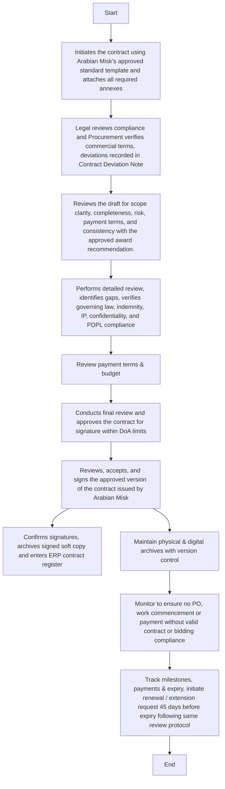

## Contract Review & Approval Process

This policy applies to all contracts drawn up by Arabian Mill’s for the procurement of goods, services, work, or outsourcing arrangements, including both local and international vendors. It covers contract drafting, internal reviews, approvals, and retention.
Policies
Standard Contract Templates Must Be Used
Procurement teams must initiate all contracts using Faizan & Co’ pre-approved templates for goods, services, or long-term agreements.
Legal Review is Mandatory for Non-Standard Contracts
Any clause changes, deviations, or new contract types require Legal Department review and approval.
Supplier-Initiated Contract Templates
If a supplier or service provider submits its own contract draft or template, it shall be treated as a non-standard contract and must undergo mandatory review by the Legal and Finance Departments. Legal shall ensure compliance with Saudi laws and company policies, while Procurement shall confirm commercial and operational accuracy. Any deviations from Arabian Mill’s approved templates require written approval from the Supply Chain Director before signing. No purchase order or commitment shall proceed until the supplier-initiated contract has been fully reviewed, approved, and registered in the contract log.
Contract Thresholds for Review
Contracts exceeding monetary thresholds (to be defined in the DoA) must undergo mandatory legal and finance review.
Enforcement of Bidding and Contract Compliance
All ongoing or new procurement activities that fall within the defined bidding or contract criteria must fully comply with the approved procedures outlined in this manual. Any procurement action initiated without following the prescribed bidding process or without a valid contract shall be immediately suspended until the correct process is completed. Procurement staff and requesting departments are jointly responsible for ensuring that no purchase order, work commencement, or payment is processed outside the approved workflow and Delegation of Authority (DoA). The Supply Chain Director holds the authority to review, suspend, or reject any procurement activity that is found to be non-compliant with the company’s bidding or contract requirements.
Cross-Functional Collaboration is Required
Procurement, Legal, Finance, and Technical Teams must collaborate on contract scope, terms, risks, and deliverables before finalization.
Contract Must Be Finalized Before PO Issuance
No Purchase Order (PO) shall be raised unless the signed contract is archived and logged in the contract register.
Digital & Physical Record Retention
Finalized contracts must be stored in both soft (digital) and hard copy formats in centralized systems (ERP, SharePoint, etc.).
Annual Template Review
The Legal Department must review and update standard templates annually or as per regulatory changes (e.g., Saudi PDPL, VAT, import/export laws).
Procedure Table for Contract Review & Finalization

| S. No. | Job Title / Responsible | Procedure Description | Output / Report |
| --- | --- | --- | --- |
|  | Procurement Officer | Initiates the contract using Arabian Mill’s’s approved standard template and attaches all required annexes (Technical Specifications, Delivery Schedule, Scope of Work, etc.). | Draft Contract with Annexes |
| 1A. | Procurement Officer / Legal Department / Finance | If the supplier provides its own contract draft, Procurement must forward it to Legal and Finance for review. Legal reviews for compliance with Saudi laws, company policy, and standard clauses; Procurement verifies commercial and operational terms. Any deviations from approved templates must be recorded in a Contract Deviation Note and endorsed by both Legal and the Supply Chain Director before signing. | Reviewed Supplier Contract / Contract Deviation Note |
|  | Procurement Manager | Reviews the draft for scope clarity, commercial risk, payment terms, and consistency with the approved award recommendation. | Internal Review Note |
|  | Legal Officer | Performs detailed legal review, identifies gaps, validates governing law, indemnity, IP, confidentiality, and PDPL compliance, and confirms alignment with Arabian Mill s contract standards. | Legal Review Comments |
|  | Finance Representative | Reviews payment terms, budget availability, and financial exposure to ensure compliance with DoA and financial policy. | Finance Endorsement |
|  | Supply Chain Director | Conducts final review and approves the contract for signature within DoA limits. Ensures all mandatory reviews (Legal and Finance) are completed before approval. | SCM Approval Record |
|  | Vendor / Supplier | Reviews, accepts, and signs the approved version of the contract issued by Arabian Mill’s | Signed Contract Copy from Vendor |
|  | Procurement Officer | Confirms both parties’ signatures are obtained, archives the signed soft copy, and enters contract details in the ERP contract register. | Final Contract Log / ERP Entry |
|  | Legal & Procurement | Jointly maintain physical and digital archives of all signed contracts with version control and ensure easy retrieval for audit. | Contract Archive (Soft & Hard Copy) |
|  | Procurement Officer / SCM Department | Monitors ongoing procurement to ensure that no PO, work commencement, or payment is processed without a valid contract or prior bidding compliance, in accordance with the Enforcement of Bidding and Contract Compliance policy. | Compliance Record / Contract Register Audit Log |
|  | Contract Performance Review | Procurement shall coordinate with User and Finance teams to track key milestones, payments, and contract expiry. Renewal or extension requests must be initiated at least 30 days before expiry and follow the same review protocol |  |

Flow Chart

**[Diagram — Visio-EMF→PNG]:**

**Process Name:** Contract Review & Finalization  
**Department Header (top-right):** Procurement  

---

### Roles / Swimlanes (from top to bottom, left side)

1. Procurement Officer  
2. Procurement Officer/ Legal Department  
3. Procurement Manager  
4. Legal Officer  
5. Finance Representative  
6. Supply Chain Director  
7. Vendor / Supplier Representative  
8. Legal & Procurement  
9. Procurement Officer/ SCM Department  
10. Contract Review Executive  

---

### Steps

| Step # | Role | Action (exact text from diagram) | Decision / Next Step |
|--------|------|-----------------------------------|----------------------|
| 1 | Procurement Officer | Start | Next: Step 2 |
| 2 | Procurement Officer | Initiates the contract using Arabian Misk's approved standard template and attaches all required annexes | Next: Step 3 |
| 3 | Procurement Officer/ Legal Department | Legal reviews compliance and Procurement verifies commercial terms, deviations recorded in Contract Deviation Note | Next: Step 4 |
| 4 | Procurement Manager | Reviews the draft for scope clarity, completeness, risk, payment terms, and consistency with the approved award recommendation. | Next: Step 5 |
| 5 | Legal Officer | Performs detailed review, identifies gaps, verifies governing law, indemnity, IP, confidentiality, and PDPL compliance | Next: Step 6 |
| 6 | Finance Representative | Review payment terms & budget | Next: Step 7 |
| 7 | Supply Chain Director | Conducts final review and approves the contract for signature within DoA limits | Next: Step 8 |
| 8 | Vendor / Supplier Representative | Reviews, accepts, and signs the approved version of the contract issued by Arabian Misk | Next: Step 9 and Step 10 (parallel follow‑up activities) |
| 9 | Procurement Officer | Confirms signatures, archives signed soft copy and enters ERP contract register | Flow for registration/recording ends after this step (no further steps shown from this box) |
| 10 | Legal & Procurement | Maintain physical & digital archives with version control | Next: Step 11 |
| 11 | Procurement Officer/ SCM Department | Monitor to ensure no PO, work commencement or payment without valid contract or bidding compliance | Next: Step 12 |
| 12 | Contract Review Executive | Track milestones, payments & expiry, initiate renewal / extension request 45 days before expiry following same review protocol | Next: Step 13 |
| 13 | Contract Review Executive | End | Terminal step |

---

### Mermaid.js Flow

Key Notes
 All contracts initiated by suppliers must be treated as non-standard and undergo mandatory Legal and SCM approval before execution.
 Procurement is responsible for maintaining traceable records of all contract deviations and approvals.
 No purchase order, invoice, or payment shall be processed without completion of the above steps and registration of the approved contract in ERP.
Contract Threshold Summary, Review & Approval Matrix

| Nature of Procurement | Contract Template Required | Legal Review Required | Finance Review Required | Final Approval Authority |
| --- | --- | --- | --- | --- |
| Routine consumables or services | Optional | No | Department Head |  |
| Standard supplies / small jobs | Yes – Standard Template | No (unless non-standard) | Yes | SCM Manager / Procurement Lead |
| Services / CAPEX / local works | Yes | Yes (template compliance) | Yes | Supply Chain Director |
| High-value or long-term supply | Yes | Yes (full legal review) | Yes | Supply Chain Director + CFO |
| Strategic / foreign contracts | Yes – Customized as needed | Yes (full legal review) | Yes | CEO / Managing Director |

This manual shall be read in conjunction with Arabian Mills Procurement Policies and Procedures Manual. Each contract type defined in the preceding table corresponds to the nature and value of the procurement activity carried out by the company. Procurement department must identify the applicable contract category based on the sourcing method, value threshold, and associated risk level.
Once a procurement falls within the criteria requiring a formal contract, the process defined in this Contract Manual shall apply for contract preparation, review, and approval. All contracts must be supported by evidence of competitive bidding or approved sourcing, as outlined in the Procurement Manual, before execution. No contract shall be signed or processed without completion of the relevant procurement procedure and documentation trail.
Note: Procurement shall refer to the Procurement Manual to confirm the applicable sourcing and approval process before initiating a contract.
Contract Classification Criteria by Nature of Procurement

| Contract Type | Definition / Criteria |
| --- | --- |
| Routine Consumables or Services | Low-value, recurring requirements that are operational in nature, with limited commercial or technical complexity. Usually short-term and based on fixed prices or blanket agreements. |
| Standard Supplies / Small Jobs | Medium-value or limited-scope works requiring standard contract terms and formal quotation. Typically, non-critical and low risk. |
| Services / CAPEX / Local Works | High-value or asset-related contracts require detailed SoW, installation, or commissioning. It must include defined deliverables and risk assessment. |
| High-Value or Long-Term Supply | Contracts exceeding defined DoA thresholds or extending beyond one fiscal year. Usually includes performance obligations and penalties. |
| Strategic / Foreign Contracts | Cross-border or high-risk agreements involving significant value, foreign currency exposure, or long-term commitments. Requires full legal and finance review. |

Appendix 1
Standard Procurement Key Performance Indicators (KPIs)

| No. | KPI Name | Description | Frequency | Responsib i l it y |
| --- | --- | --- | --- | --- |
| 1 | Purchase Requisition to PO Lead Time | Measures the average time taken from PR initiation to PO issuance | Monthly | Procurement Officer |
| 2 | Supplier On-Time Delivery Rate | Percentage of deliveries received on or before the promised date | Monthly | Procurement Officer |
| 3 | Procurement Cost Savings | Total savings achieved through negotiation or competitive sourcing | Quarterly | Procurement Manager |
| 4 | PR to PO Accuracy Rate | Percentage of PRs accurately converted to POs without rework | Monthly | Procurement Officer |
| 5 | % Spend via Approved Vendors | Share of total spend executed through pre-qualified suppliers | Quarterly | Procurement Manager |
| 6 | Number of Urgent Procurement Cases | Tracks the number of purchases processed as urgent cases | Monthly | Procurement Officer |
| 7 | Supplier Evaluation Coverage | Percentage of suppliers assessed during or after contract completion | Quarterly | Procurement Manager |
| 8 | Petty Cash Utilization Compliance | Tracks adherence to petty cash policy (limits, documentation, approvals) | Monthly | Department Manager |
| 9 | Bid Compliance Rate | Percentage of POs issued with complete documentation and approvals | Monthly | Procurement Officer |

Appendix 2
Standard Transportation Reports

| Report Name | Purpose / Description | Prepared By | Reviewed By | Frequency |
| --- | --- | --- | --- | --- |
| Monthly Procurement Summary Report | Summary of PRs, POs, spend, savings, delays, and category-wise breakdown | Procurement Officer | Procurement Manager | Monthly |
| Supplier Performance Evaluation Report | Scorecards based on supplier assessments and evaluation forms | Procurement Officer | Procurement Manager | Quarterly |
| Urgent Procurement Register | Record of all urgent cases with justifications and approvals | Procurement Officer | CFO / Supply Chain Director | Monthly |
| Petty Cash Reconciliation Report | Detailed report of petty cash usage and reimbursement status | Procurement Manager | Finance Manager | Monthly |
| Procurement Non-Conformance Report (NCR) | Captures deviations from procurement policies and corrective actions | Procurement Officer | Supply Chain Director | As Needed |
| Approved Vendors Master List | Updated list of pre-qualified vendors with commodity categorization | Procurement Officer | Procurement Manager | Bi-Annual |
| Procurement Planning vs. Actual Report | Compares procurement plan against actual execution and identifies variances | Procurement Officer | Supply Chain Director | Quarterly |