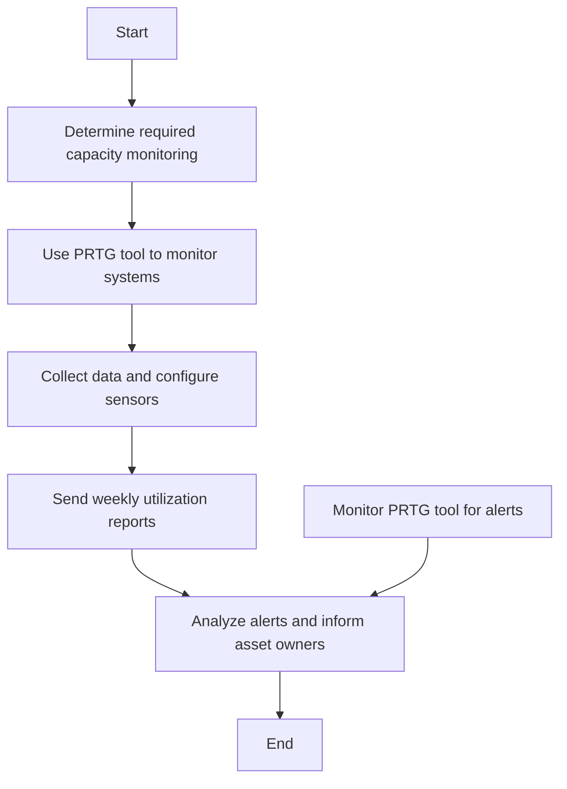

### Analysis of Flowchart

1. **Process Name**: Capacity Management Procedure

2. **Roles (Swimlanes)**:
   - IT & Cybersecurity Manager
   - IT Server and Network Admin
   - Helpdesk Engineer

3. **Steps in a Markdown Table**:

| Step # | Role                      | Action                                                                                                    | Next Step/Logic       |
|--------|---------------------------|-----------------------------------------------------------------------------------------------------------|-----------------------|
| 1      | IT & Cybersecurity Manager| Determine which servers, network devices, and applications require capacity monitoring and projection. (A/M) | Step 2                |
| 2      | IT Server and Network Admin | Use PRTG tool to monitor CPU, RAM, disk utilization, network bandwidth, application load, and security data logs. (A/M) | Step 3                |
| 3      | IT Server and Network Admin | Collect data daily using PRTG automated tool and configure sensors accordingly. (A)                          | Step 4                |
| 4      | IT Server and Network Admin | Send weekly utilization reports to asset owners (system-generated). (A)                                      | Step 6                |
| 5      | Helpdesk Engineer          | Monitor PRTG tool daily to identify alerts. (A/M)                                                           | Step 6                |
| 6      | Helpdesk Engineer          | Inform system administrator about alerts generated in PRTG tool. (A)                                         | Step 6                |
| 6      | IT & Cybersecurity Manager | Analyze alerts, discuss technical issues, suggest remedial actions, and inform asset owners via email with alert report. (A/M) | End                 |

4. **Logic in Mermaid.js Code Block**:

This code and table detail the steps and logic flow of the Capacity Management Procedure as contained within the flowchart.