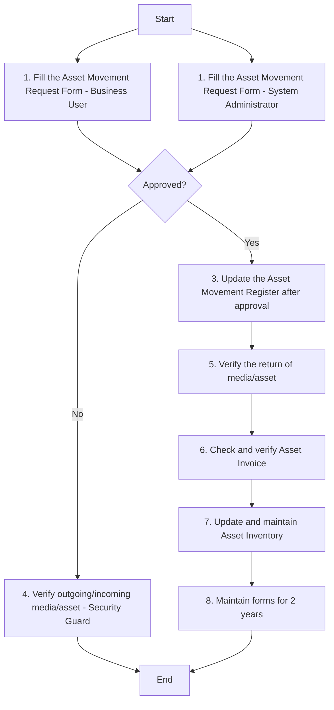

### Analysis of Asset Movement Procedure Flowchart

#### 1. Process Name:
- Asset Movement Procedure

#### 2. Roles (Swimlanes):
- Business User
- System Administrator
- IT & Cybersecurity Manager
- Security Guard

#### 3. Steps in Markdown Table:

| Step # | Role                      | Action                                                                                         | Next Step/Logic              |
|--------|---------------------------|-----------------------------------------------------------------------------------------------|------------------------------|
| 1      | Business User             | Fill the Asset Movement Request Form for moving assets between locations or vendors. (M)      | Step 2                       |
| 1      | System Administrator      | Fill the Asset Movement Request Form for moving assets between locations or vendors. (M)      | Step 2                       |
| 2      | IT & Cybersecurity Manager| Approved?                                                                                      | Yes: Step 3, No: Step 4      |
| 3      | Business User             | Update the Asset Movement Register after approval. (M)                                        | Step 5                       |
| 4      | Security Guard            | Verify outgoing/incoming media/asset as per the Asset Movement Request Form (M)               | End                          |
| 5      | Business User             | Verify the return of media/asset as per the return date specified in the Asset Movement Request Form(M) | Step 6        |
| 6      | Business User             | Check and verify Asset Invoice for any new device, system, or media brought inside the IT premises or Datacentre. (M) | Step 7   |
| 7      | Business User             | Update and maintain Asset Inventory for any new or discarded device, system, or media. (M)   | Step 8                       |
| 8      | Business User             | Maintain forms for 2 years. (M)                                                                | End                          |

#### 4. Logic in Mermaid.js Code Block:

