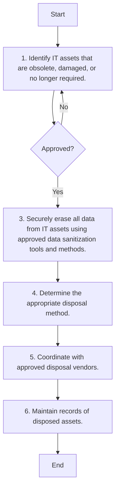

1. **Process Name**: Asset Disposal Procedure

2. **Roles (Swimlanes)**:
   - IT Network and Server Administrator
   - IT & Cybersecurity Manager

3. **Markdown Table**:

   | Step # | Role                           | Action                                                                                       | Next Step/Logic                    |
   |--------|--------------------------------|----------------------------------------------------------------------------------------------|------------------------------------|
   | 1      | IT Network and Server Administrator | Identify IT assets that are obsolete, damaged, or no longer required.                         | Approved?                          |
   | 2      | IT & Cybersecurity Manager     | Approved?                                                                                    | Yes: Step 3, No: Step 1            |
   | 3      | IT Network and Server Administrator | Securely erase all data from IT assets using approved data sanitization tools and methods.   | Step 4                             |
   | 4      | IT Network and Server Administrator | Determine the appropriate disposal method, such as recycling, donation, or physical destruction. | Step 5                             |
   | 5      | IT Network and Server Administrator | Coordinate with approved disposal vendors.                                                   | Step 6                             |
   | 6      | IT Network and Server Administrator | Maintain records of disposed assets, including asset details and vendor information.         | End                                |

4. **Mermaid.js Code Block**:

