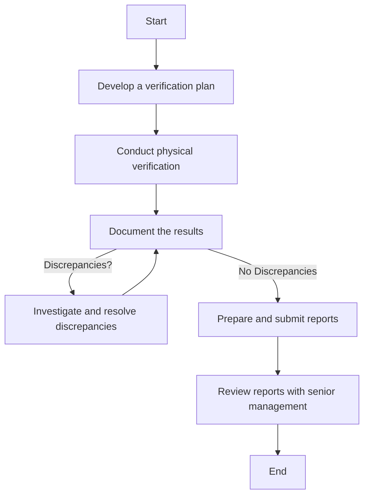

### Analysis of the Flowchart

#### 1. Process Name:
- IT Asset Verification Procedure

#### 2. Roles (Swimlanes):
- Finance Department
- IT Network and Server Admin
- IT & Cybersecurity Manager
- Senior Management

#### 3. Steps Extracted into a Markdown Table:

| Step # | Role                          | Action                                                                                       | Next Step/Logic   |
|--------|-------------------------------|----------------------------------------------------------------------------------------------|-------------------|
| 1      | Finance Department            | Develop a verification plan outlining the scope, objectives, and schedule for regular verification of IT assets. | Step 2            |
| 2      | Finance Department            | Conduct physical verification of IT assets, confirming their existence, condition, and location as recorded in the inventory. | Step 3            |
| 3      | Finance Department            | Document the results of the verification process, including any discrepancies or issues identified. | Step 4 or Step 5  |
| 4      | IT Network and Server Admin / IT & Cybersecurity Manager | Investigate and resolve any discrepancies identified during the verification process, updating inventory records as necessary. | Step 3             |
| 5      | Finance Department            | Prepare and submit verification reports detailing findings, resolutions, and recommendations for improving asset management practices. | Step 6            |
| 6      | Senior Management             | Review verification reports with senior management to ensure awareness and support for necessary changes and improvements. | End               |

#### 4. Logic in Mermaid.js Code Block:

