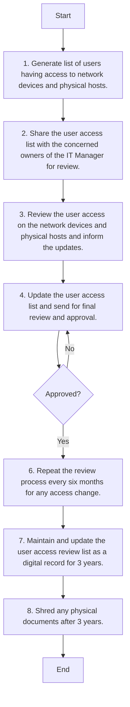

Certainly! Here's an analysis of the flowchart:

### 1. Process Name
**Access Right Review - Network Devices and Physical Hosts Procedure**

### 2. Roles (Swimlanes)
- IT Network and Server Admin
- IT & Cybersecurity Manager

### 3. Steps in a Markdown Table

| Step # | Role                        | Action                                                                                   | Next Step/Logic     |
|--------|-----------------------------|------------------------------------------------------------------------------------------|---------------------|
| 1      | IT Network and Server Admin | Generate list of users having access to network devices and physical hosts.               | Step 2              |
| 2      | IT Network and Server Admin | Share the user access list with the concerned owners of the IT Manager for review.        | Step 3              |
| 3      | IT & Cybersecurity Manager  | Review the user access on the network devices and physical hosts and inform updates.      | Step 4              |
| 4      | IT Network and Server Admin | Update the user access list and send for final review and approval.                       | Approved Decision   |
| Approved| IT Network and Server Admin | Decision: Approved?                                                                       | Yes: Step 6 / No: Step 4 |
| 6      | IT Network and Server Admin | Repeat the review process every six months for any changes.                               | Step 7              |
| 7      | IT Network and Server Admin | Maintain and update the user access review list as a digital record for 3 years.          | Step 8              |
| 8      | IT Network and Server Admin | Shred any physical documents after 3 years.                                               | End                 |

### 4. Mermaid.js Code Block

This analysis provides a detailed breakdown of each step, the roles involved, and the flow logic connecting each component.